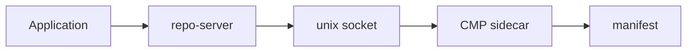
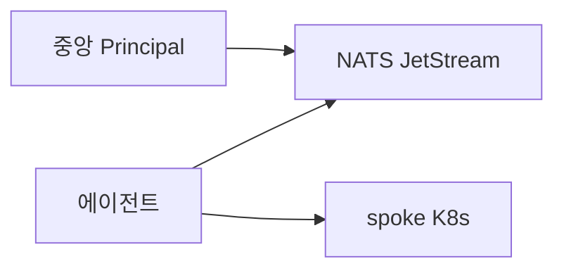

# ArgoCD 고급

> 기본 Application·Sync·Project를 넘어서 ArgoCD 3.3에서 GA/개선된 **차세대
> 기능**을 다룬다. **PreDelete Hooks**로 삭제 안전망, **Shallow Clone**으로
> 대용량 리포 속도 개선, **Source Hydrator**로 manifest 렌더링과 Git 저장을
> 분리, **Config Management Plugin v2**로 Cue·Jsonnet·Tanka 확장,
> **argocd-agent**로 air-gapped/멀티 클러스터 pull 모델. 일상 기능이 아니라
> "언제 필요한가"가 핵심.

- **전제**: [ArgoCD 설치](./argocd-install.md) · [App](./argocd-apps.md)
  · [Sync](./argocd-sync.md) · [Project](./argocd-projects.md) · [운영](./argocd-operations.md)
  기본 이해
- **현재 기준**: ArgoCD 3.3 GA (2026-03), 3.4 GA 예정 (2026-05)

---

## 1. PreDelete Hooks — 삭제 안전망

### 1.1 해결하는 문제

3.2 이전까지 Application 삭제 = **즉시 모든 리소스 cascade 삭제**. 다음
시나리오가 불가능했다:

- **DB 백업** 후 stateful 서비스 teardown
- **Service Mesh 서비스 디스커버리에서 deregister** 후 Pod 삭제
- **외부 DNS 레코드 제거** 후 Ingress 삭제
- **장기 connection drain** 완료 후 Deployment 삭제

기존 해법: `preStop` hook, external script, 수동 개입 — 전부 선언적이지
않음.

### 1.2 3.3 PreDelete Hook

```yaml
apiVersion: batch/v1
kind: Job
metadata:
  generateName: db-backup-
  annotations:
    argocd.argoproj.io/hook: PreDelete
    argocd.argoproj.io/hook-delete-policy: HookSucceeded,BeforeHookCreation
    argocd.argoproj.io/sync-wave: "-5"
spec:
  template:
    spec:
      containers:
        - name: backup
          image: myapp:backup-tools
          command: ["./pre-delete-backup.sh"]
      restartPolicy: Never
```

- **PreDelete phase는 Application 삭제 시작 시** 실행
- hook이 성공해야 실제 리소스 삭제 단계로 진입
- hook이 실패하면 **Application 삭제 정지** — 수동 개입 전까지 대기
- `sync-wave`는 여러 PreDelete hook 간 순서 (작은 값부터)

**3.3.0 알려진 이슈**: Helm chart의 `helm.sh/hook-delete-policy:
before-hook-creation,hook-succeeded`로 마킹된 리소스는 PreDelete phase
에서 재생성되지 않아 **해당 리소스에 의존하는 PreDelete Job이 실패**
할 수 있다 ([#26404](https://github.com/argoproj/argo-cd/issues/26404)).
Helm hook과 ArgoCD hook을 한 chart에서 섞을 때 충돌 체크 필요.

### 1.3 기존 Hook 생명주기 확장

| Hook phase | 실행 시점 |
|---|---|
| `PreSync` | sync 시작 전 |
| `Sync` | sync 중 (Sync phase 일반 리소스) |
| `PostSync` | sync 후 Healthy 확인 후 |
| `SyncFail` | Sync phase 실패 시 |
| **`PreDelete`** | **Application 삭제 시작 시 (3.3+)** |
| `Skip` | 이 리소스는 sync 대상에서 제외 (phase 아님) |

### 1.4 finalizer와의 관계

기존 `resources-finalizer.argoproj.io`는 "**Application 삭제 시 live
리소스도 함께 삭제**"를 보장. PreDelete는 "**리소스 삭제 전에 cleanup 작업
실행**"을 보장. 둘은 **독립적이고 보완적**.

```yaml
metadata:
  finalizers:
    - resources-finalizer.argoproj.io   # cascade 삭제 보장
  # + PreDelete hook으로 삭제 전 backup 보장
```

### 1.5 주의

- hook Job이 **영구 실패**하면 Application이 "Deleting" 상태에 고정.
  긴급 탈출:
  ```bash
  kubectl -n argocd patch app <name> --type=merge \
    -p '{"metadata":{"finalizers":null}}'
  ```
  이때 live 리소스는 **orphan**으로 남는다. 수동 삭제 또는 새 Application
  으로 재관리 선택
- hook 타임아웃 자체는 Job의 `activeDeadlineSeconds`로 제어 (예: 10m)
- PreDelete hook 리소스는 **Application의 네임스페이스에 생성**

### 1.6 언제 쓰면 안 되는가

- 단순 stateless 서비스 — 복잡도 추가 대비 이득 없음
- 삭제가 빈번한 Preview 환경 — hook Job 오버헤드 누적
- 외부 리소스 cleanup은 **External Secrets·Crossplane** 같은 전용
  관리자가 더 적합한 경우 있음

---

## 2. Source Hydrator — 렌더링 ≠ 저장

### 2.1 동기 — dry repo vs wet repo

기존 GitOps의 딜레마:

| 접근 | 문제 |
|---|---|
| **Git에 렌더링된 YAML 저장** (wet repo) | Helm 파라미터만 바뀌어도 수천 줄 diff, 리뷰 지옥 |
| **Git에 Helm values만 저장** (dry repo) | PR 단계에서 실제 배포 내용 리뷰 불가 |

Source Hydrator는 이 둘의 타협점: "**dry repo에 push → ArgoCD가 hydrate
→ wet branch 자동 생성**" 자동화.

### 2.2 Flow (3.3 개선)


1. 개발자가 `values.yaml` 변경 push → dry branch
2. Hydrator가 `helm template` 실행 → 결과 YAML을 wet branch에 commit
3. ArgoCD가 **wet branch를 실제 source로 동기화**
4. PR 리뷰어는 wet branch에서 정확한 manifest diff 확인

### 2.3 3.3 개선 사항

- **Inline 파라미터 지원** — 작은 변경에 별도 parameter 파일 commit 불필요
- **Git notes 기반 hydration 상태 추적** — 매 hydration마다 새 commit
  만들지 않음 (기존 방식은 히스토리 오염)
- **Monorepo 레이아웃 최적화** — 변경 영향 받는 path만 hydrate
- repo server 호출 최소화로 성능 개선

### 2.4 Application 설정

```yaml
apiVersion: argoproj.io/v1alpha1
kind: Application
metadata:
  name: my-app
spec:
  sourceHydrator:
    drySource:
      repoURL: https://git.example.com/org/gitops
      targetBranch: main
      path: apps/my-app
    hydrateTo:
      targetBranch: environments/prod
    syncSource:
      targetRevision: environments/prod
      path: apps/my-app
  destination:
    server: https://kubernetes.default.svc
    namespace: my-app
```

- `drySource`: 개발자가 편집하는 소스 브랜치
- `hydrateTo`: Hydrator가 결과물을 푸시할 브랜치
- `syncSource`: 실제 ArgoCD가 sync에 사용할 브랜치

### 2.5 3.3 업그레이드 시 Audit 필요

3.3에서 Hydrator 구현이 크게 바뀌었다. 기존 wet branch가 있다면 업그레이드
전에 확인:

- hydration **commit 히스토리가 예상대로 재구성**되는지
- Git notes에 기존 메타데이터가 남아 있지 않은지
- **ApplicationSet이 wet branch를 watch**할 때 sync 트리거 방식 변경 확인

**tracking-id annotation 처리**: Hydrator는 **wet Git에 `argocd.argoproj.io/
tracking-id`를 쓰지 않는다** (3.3부터 의도된 동작,
[#24371](https://github.com/argoproj/argo-cd/issues/24371)). sync 시점에
ArgoCD가 동적으로 추가. annotation tracking 모드와 결합 시 "wet branch
파일에 tracking-id가 없는데 왜 ArgoCD가 관리하지?"라는 혼란을 야기할 수
있으니 팀 교육 필요.

### 2.6 언제 쓸 가치가 있는가

- Helm/Kustomize를 많이 쓰는 대규모 조직 — dry diff 지옥 해결
- **PR 리뷰 품질**이 중요한 프로덕션 — wet manifest 승인 기준
- **감사/변경 관리**가 엄격한 업계 (금융, 의료) — 실제 배포 결과 Git 저장

### 2.7 주의와 제약

- Multiple Sources와의 조합 논의 중 ([Discussion
  #21971](https://github.com/argoproj/argo-cd/discussions/21971))
- ApplicationSet + Hydrator는 cluster/env 각각 wet branch 관리 필요 —
  운영 복잡도 증가
- 개발자 워크플로 교육 부담 — "왜 내 변경이 wet branch commit 후에야
  배포되는가"

---

## 3. Shallow Clone — 대용량 리포 속도

### 3.1 문제

GitOps 리포가 커지면서 매 sync마다 **전체 히스토리 clone**은 수분이
소요된다. 100MB+ 리포는 기본. monorepo는 GB 단위도 있다.

### 3.2 3.3 Shallow Clone

```bash
# repo 등록 시 depth 지정
argocd repo add https://git.example.com/gitops --depth 1

# 기존 repo 업데이트
argocd repo add https://git.example.com/gitops --depth 1 --upsert
```

- `depth N`: 최근 N개 commit만 clone
- 기본 = full clone (`depth 0`)
- **만드는 효과**: Git fetch가 수초로 단축, 디스크 사용 감소

### 3.3 주의

- `sync-wave` + 과거 commit 기반 diff는 불가 — shallow clone은 최근 commit만
- **Source Hydrator의 Git notes 기반 추적**에는 제약 — 충분한 depth
  필요
- 일부 SCM(Gitea 구버전)은 shallow clone을 막을 수 있음 — 프로바이더
  호환 확인

### 3.4 언제 쓸 가치

- GitOps monorepo 수 GB, 수만 commit
- **fetch 시간**이 reconcile lag의 주범으로 드러날 때
- **repo-server autoscaling**과 함께 Git rate limit 절감

---

## 4. Config Management Plugin (CMP) v2

### 4.1 왜 필요한가

기본 지원 도구는 4가지: plain YAML, Kustomize, Helm, Jsonnet. 다음이
빠져 있다:

| 도구 | 용도 |
|---|---|
| **Cue** | 강타입 schema + DSL (CNCF 채택 증가) |
| **Timoni** | Cue 기반 Kubernetes 패키지 매니저 |
| **Tanka** | Grafana Labs의 Jsonnet 기반 도구 |
| **kustomize + envsubst** | 환경변수 치환 |
| **cdk8s** | TypeScript로 K8s manifest |
| **yq/sh 커스텀** | 내부 규약 templating |

CMP v2는 **sidecar 컨테이너로 이런 도구를 주입**.

### 4.2 v1 → v2 전환 — 2.4에서 이미 도입, 2.8에서 v1 완전 제거

- **v1** (deprecated, 2.8에서 제거): `argocd-cm` ConfigMap에 플러그인
  정의, repo-server 본체에 binary 마운트
- **v2** (현재 표준): 별도 sidecar 컨테이너, plugin.yaml로 선언

기존 v1 플러그인 사용 조직은 반드시 v2로 마이그레이션 완료 필요.

### 4.3 아키텍처



- repo-server와 CMP sidecar가 **동일 Pod**에서 Unix domain socket
  (`/home/argocd/cmp-server/plugins/`)으로 통신
- Git 리포는 **repo-server가 clone**, sidecar는 공유 volume으로 읽기
  (shared `emptyDir`)
- sidecar가 반환한 manifest를 repo-server가 application-controller에
  전달

### 4.4 plugin.yaml

```yaml
apiVersion: argoproj.io/v1alpha1
kind: ConfigManagementPlugin
metadata:
  name: cue-plugin
spec:
  version: "v1.0"
  init:                             # (선택) 초기화
    command: ["sh", "-c"]
    args: ["cue mod tidy"]
  generate:                          # 필수 — manifest 생성
    command: ["sh", "-c"]
    args: ["cue export -e k8s --out yaml ."]
  discover:                          # 자동 감지
    fileName: "*.cue"
    # 또는 find.glob: "**/*.cue"
  parameters:
    static:
      - name: environment
        title: Environment
        required: true
        itemType: string
```

sidecar 이미지 내부 `/home/argocd/cmp-server/config/plugin.yaml`에
위치해야 함.

### 4.5 Sidecar 정의 (Helm values)

```yaml
repoServer:
  extraContainers:
    - name: cmp-cue
      image: myregistry.example.com/argocd-cmp-cue:1.0
      securityContext:
        runAsNonRoot: true
        runAsUser: 999
        readOnlyRootFilesystem: true
      env:
        - {name: ARGOCD_EXEC_TIMEOUT, value: "5m"}
      volumeMounts:
        - {mountPath: /var/run/argocd,     name: var-files}
        - {mountPath: /home/argocd/cmp-server/plugins, name: plugins}
        - {mountPath: /tmp,                name: tmp}
        - {mountPath: /home/argocd/cmp-server/config/plugin.yaml,
           subPath: plugin.yaml,
           name: cmp-cue-config}
  volumes:
    - name: cmp-cue-config
      configMap: {name: cmp-cue-config}
```

### 4.6 Application에서 사용

```yaml
source:
  repoURL: https://github.com/org/gitops
  targetRevision: main
  path: apps/my-app
  plugin:
    name: cue-plugin-v1.0           # name 형식: <plugin-name>-<version>
    env:
      - {name: APP_ENV, value: prod}
    parameters:
      - {name: environment, string: prod}
```

**version 필드 함정** ([#12083](https://github.com/argoproj/argo-cd/issues/12083)):
`plugin.yaml`의 `spec.version` 필드가 있으면 socket 경로가
`<name>-<version>.sock`로 형성되고 Application에서도 `<name>-<version>`
형식으로 참조. **version 필드를 생략하면** socket이 `<name>.sock`, Application
참조도 plain `name`. 둘을 섞어 쓰면 "plugin not supported. plugin name
cmp-plugin" 에러 발생. 팀 내부 규약으로 **version 사용 여부를 일관**시키고,
디버깅 시 sidecar의 `/home/argocd/cmp-server/plugins/` 경로에 어떤 sock이
생성됐는지 확인할 것.

### 4.7 보안 고려

- sidecar는 **repo-server Pod의 권한**을 이어받음 → ServiceAccount 최소
  권한
- sidecar 이미지는 **조직 내부 레지스트리**에서 signed 이미지 (cosign)
- CMP 실행은 임의 명령 실행 = RCE 잠재 → `--allow-plugin-binaries`
  목록·CI 빌드 이미지 검증 필수

### 4.8 제공되는 예시 플러그인

공식 레포 `argo-cd/examples/` 밑에:

- Helm with values
- Kustomize with envsubst
- Jsonnet with Tanka-like 구성
- Cue 기본

**맞춤 구성**은 대개 위의 예시를 복제 후 변형.

---

## 5. argocd-agent — 멀티 클러스터 Pull 모델

### 5.1 동기

**Hub-and-spoke 모델의 한계**:

- 중앙 ArgoCD에 spoke 클러스터의 **bearer token 저장** (유출 시 전체 파괴)
- 중앙 ArgoCD → spoke API로 **outbound 연결 필수** (방화벽 규제 충돌)
- air-gapped 환경에서 중앙 접근 불가

argocd-agent는 이걸 뒤집어 **spoke가 중앙에 pull**하는 모델.

### 5.2 프로젝트 상태

- **`argoproj-labs/argocd-agent`** — ArgoCD 본체와 **별개 프로젝트**
- 2026-04 기준 **v1.0 GA 직전 (pre-GA / late beta)**. 팀 공식 표현은
  "mature enough to install and run"
- ArgoCD 3.3/3.4 릴리즈가 argocd-agent를 자동 포함하지 않음
- **"battle-tested"까지는 미도달** — 프로덕션 전면 도입은 PoC + 충분한
  스테이징 검증 후

### 5.3 아키텍처



- 중앙에 **Principal** 컴포넌트, 각 spoke에 **Agent**
- 통신은 **NATS JetStream** (outbound만 필요)
- spoke가 필요한 Application 정보를 agent가 가져와 spoke 로컬 controller
  가 reconcile
- 중앙에는 **spoke 자격증명 저장 불필요**

### 5.4 언제 쓰나

- air-gapped·DMZ 환경 spoke 클러스터
- spoke 클러스터가 **중앙의 개별 팀이 아니고 고객/파트너** (SaaS 형태)
- 규제로 **spoke → hub outbound만** 허용되는 환경

### 5.5 제약

- alpha — 프로덕션 도입 리스크 수용 필요
- Application CR은 여전히 중앙에서 선언 — spoke 자율성 낮음
- 업그레이드 경로 · API 호환성 아직 불안정

---

## 6. Sigstore · Cosign 통합

### 6.1 왜

내장 GPG 서명 검증은 키 관리가 번거롭고 Helm chart(HTTPS repo)를 지원
못 한다. **Sigstore**의 keyless signing (OIDC-based)이 현대적 대안.

### 6.2 ArgoCD 직접 지원 상태

- ArgoCD 본체는 **Sigstore 네이티브 검증 미지원** (2026-04)
- 우회 방식:
  1. **CMP**에서 `cosign verify` 호출 후 manifest 렌더
  2. **Kyverno Policy** (admission controller)에서 이미지 서명 검증
  3. **policy-controller** sidecar로 cluster-wide 강제

### 6.3 CMP로 cosign 통합 예시

```yaml
# plugin.yaml
generate:
  command: ["sh", "-c"]
  args:
    - |
      set -e
      # Helm chart 서명 검증
      cosign verify oci://ghcr.io/org/my-chart:1.0.0 \
        --certificate-identity-regexp="https://github.com/org/.*" \
        --certificate-oidc-issuer="https://token.actions.githubusercontent.com"
      helm template my-chart oci://ghcr.io/org/my-chart --version 1.0.0
```

검증 실패 시 `generate` 종료코드 != 0 → sync 실패. 공급망 보안 경계가
ArgoCD에 자연스럽게 통합.

### 6.4 Kyverno 조합

ArgoCD sync는 통과, Kyverno가 **admission 단계에서 이미지 서명 검증**.
수동 kubectl apply나 외부 도구까지 일괄 보호.

---

## 7. App-in-any-namespace 심화

### 7.1 기본은 App 글 §1.2에

[ArgoCD App §1.2](./argocd-apps.md)에서 namespace 파라미터·AppProject
`sourceNamespaces` 기본 다룸. 여기는 **운영 난이도**에 초점.

### 7.2 RBAC 복잡도

```csv
# 기존: 단일 namespace에 모든 Application
p, role:dev, applications, *, dev/*, allow

# app-in-any-namespace: project와 namespace 조합 매칭
p, role:dev, applications, *, dev/team-alpha/*, allow
p, role:dev, applications, *, dev/team-beta/*, allow
```

정책 객체 표기가 `<project>/<app>`에서 `<project>/<namespace>/<app>`으로
확장. RBAC CSV 리뷰 복잡도 증가.

### 7.3 관측 파편화

- Grafana 대시보드가 namespace별 필터를 못 받으면 혼선
- `argocd app list`는 여전히 전체 — namespace 필터링은 `-n` 또는 `-l`로

### 7.4 app-in-any-namespace vs ArgoCD Instance per team

둘 다 테넌트 분리 솔루션. 선택 기준:

| 축 | app-in-any-namespace | Instance per team |
|---|---|---|
| 관리 | 단일 ArgoCD | 여러 인스턴스 (Operator) |
| SSO | 공유 | 인스턴스별 분리 가능 |
| 업그레이드 | 1회 | N회 |
| 자원 효율 | 우수 | 낮음 |
| 블래스트 반경 | 전체 영향 | 인스턴스별 격리 |

**권장**: 50팀 이하는 app-in-any-namespace. 그 이상이거나 **강한 격리**
(규제, 고객별 분리)는 Instance per team.

---

## 8. Notifications 고급 — Webhook·Template

기본은 [Notifications](./argocd-notifications.md) 글. 여기는 "고급
템플릿·Webhook 통합"만 포인터.

- Golang template + sprig 함수로 **rich message**
- Webhook service를 CI에 역호출 (Sync 성공 시 배포 파이프라인 완료 마킹)
- Microsoft Teams Adaptive Cards (3.4+)

---

## 9. Application 리소스 추적 라벨

### 9.1 Tracking Method

ArgoCD는 관리 리소스에 label/annotation을 추가해 소유권 추적.

| 모드 | 적용 |
|---|---|
| `label` (기본, legacy) | `app.kubernetes.io/instance=<app-name>` 라벨 |
| `annotation` | `argocd.argoproj.io/tracking-id` annotation |
| `annotation+label` | 둘 다 |

### 9.2 annotation 모드 권장

label 방식은 **다른 도구(Helm, Kustomize)와 label이 겹치면 경합**. 2026
권장은 annotation 기반.

```yaml
configs:
  params:
    application.resourceTrackingMethod: "annotation"
```

**전환 절차 — orphan 방지** ([#17361](https://github.com/argoproj/argo-cd/issues/17361)):

1. `resourceTrackingMethod: annotation+label`로 먼저 전환 (둘 다 주입)
2. **전체 Application 강제 sync** — `argocd app sync --all` 또는
   ApplicationSet refresh. `--prune=false` 권장 (이 단계에서 prune 위험
   높음)
3. 모든 리소스에 annotation 생겼는지 확인 (`kubectl get -A -o yaml | grep
   tracking-id`)
4. `resourceTrackingMethod: annotation`으로 최종 전환

전환 중 sync 없이 Application 삭제 시 orphan 발생. 단순 `refresh`는
tracking-id를 주입하지 않으므로 **명시적 sync**가 필요.

### 9.3 커스텀 installation ID

멀티 ArgoCD 인스턴스가 같은 cluster를 관리할 때 서로의 리소스를
건드리지 않도록:

```yaml
configs:
  params:
    application.instanceLabelKey: "app.kubernetes.io/instance"
    # 인스턴스 A와 B가 다른 key를 사용하도록 각자 조정
```

---

## 10. 안티패턴

| 안티패턴 | 왜 문제 | 교정 |
|---|---|---|
| PreDelete hook에 외부 의존 (DB, S3) 무한 재시도 | Application이 "Deleting" 영구 고정 | Job `activeDeadlineSeconds` + 실패 시 수동 승인 경로 |
| Source Hydrator + Multiple Sources 혼용 | 아직 정식 지원 아님, 엣지케이스 | 단일 source로 먼저 hydrator 도입 |
| Shallow clone `depth: 1` + sync-wave 의존 히스토리 | 과거 commit 참조 실패 | depth를 실제 필요 수치로 |
| CMP v1 `argocd-cm` 플러그인 잔존 | 2.8에서 제거됨 | v2 sidecar로 이주 |
| CMP sidecar 없이 cue/tanka 직접 repo-server에 | 권한 분리 안 됨, 유지보수 불가 | sidecar 패턴 준수 |
| argocd-agent alpha 프로덕션 직접 투입 | 불안정 | 스테이징 PoC + 점진 도입 |
| Sigstore 검증을 admission(Kyverno)만 | 개발자 로컬 apply는 통과 | ArgoCD(CMP) + Kyverno 이중 |
| `resourceTrackingMethod` legacy 유지 | Helm chart와 label 충돌 | annotation 기반 전환 |
| PreDelete hook 결과 무시 | 의도한 cleanup 누락 | `HookSucceeded` 정책으로 성공 강제 |
| Source Hydrator wet branch를 사람이 수동 편집 | 다음 hydration에서 덮어써짐 | wet은 읽기 전용, 변경은 dry에만 |
| CMP 플러그인에 shell injection 가능 parameter | RCE 위험 | 입력 검증, `sh -c` 지양 |

---

## 11. 도입 로드맵

1. **annotation tracking 전환** (모든 고급 기능의 전제)
2. **CMP v2 점검** — v1 잔존 시 v2로 마이그레이션
3. **PreDelete hook 시범** — DB 백업 Job부터 (3.3+ 필요)
4. **Shallow clone** — monorepo 리포 대상 성능 측정
5. **Source Hydrator** — dry/wet 분리 설계, 파일럿 Application
6. **Sigstore·Cosign 통합** — CMP 내부 verify 또는 Kyverno 이중
7. **3rd party manifest tool** (Cue, Timoni) 필요 시 CMP 추가
8. **argocd-agent PoC** — air-gapped 요구 있을 때만
9. **app-in-any-namespace 확장** — 팀 자율성 확대 단계적 도입

---

## 12. 관련 문서

- [ArgoCD 설치](./argocd-install.md) — HA·샤딩·Agent mode 개요
- [ArgoCD App](./argocd-apps.md) — Application·ApplicationSet
- [ArgoCD Sync](./argocd-sync.md) — hooks·SyncOptions
- [ArgoCD 프로젝트](./argocd-projects.md) — AppProject·RBAC·signatureKeys
- [ArgoCD 운영](./argocd-operations.md) — upgrade·backup·metrics
- [Notifications](./argocd-notifications.md) — 알림 상세
- [Image Updater](./argocd-image-updater.md) — 이미지 태그 자동화
- [DevSecOps — 공급망 보안](../devsecops/slsa-in-ci.md) — SLSA

---

## 참고 자료

- [Argo CD 3.3 Release](https://blog.argoproj.io/argo-cd-3-3-release-candidate-00e99f7b7daa) — 확인: 2026-04-24
- [PreDelete Hooks (3.3)](https://engineering.01cloud.com/2025/12/16/whats-new-in-argo-cd-3-3-predelete-hooks-oidc-refresh-more/) — 확인: 2026-04-24
- [Resource Hooks](https://argo-cd.readthedocs.io/en/stable/user-guide/resource_hooks/) — 확인: 2026-04-24
- [Source Hydrator](https://argo-cd.readthedocs.io/en/latest/user-guide/source-hydrator/) — 확인: 2026-04-24
- [Manifest Hydrator Proposal](https://github.com/argoproj/argo-cd/blob/master/docs/proposals/manifest-hydrator.md) — 확인: 2026-04-24
- [Source Hydrator Audit Guide](https://dev.to/vainkop/argo-cd-33-changed-the-source-hydrator-heres-what-to-audit-before-you-upgrade-2kdj) — 확인: 2026-04-24
- [Issue #26404 — PreDelete + helm.sh hook interaction](https://github.com/argoproj/argo-cd/issues/26404) — 확인: 2026-04-24
- [Issue #24371 — Hydrator tracking-id handling](https://github.com/argoproj/argo-cd/issues/24371) — 확인: 2026-04-24
- [Issue #12083 — CMP version field socket path](https://github.com/argoproj/argo-cd/issues/12083) — 확인: 2026-04-24
- [Issue #17361 — resourceTrackingMethod migration orphan](https://github.com/argoproj/argo-cd/issues/17361) — 확인: 2026-04-24
- [Akuity — Optimizing GitOps at Scale with Shallow Clones](https://akuity.io/blog/optimizing-gitops-at-scale-with-shallow-clones-in-argo-cd) — 확인: 2026-04-24
- [Shallow Clone Issue #5467](https://github.com/argoproj/argo-cd/issues/5467) — 확인: 2026-04-24
- [Config Management Plugins](https://argo-cd.readthedocs.io/en/stable/operator-manual/config-management-plugins/) — 확인: 2026-04-24
- [CMP v2 Proposal](https://github.com/argoproj/argo-cd/blob/master/docs/proposals/config-management-plugin-v2.md) — 확인: 2026-04-24
- [argocd-agent](https://github.com/argoproj-labs/argocd-agent) — 확인: 2026-04-24
- [argocd-agent Architecture](https://argocd-agent.readthedocs.io/latest/concepts/architecture/) — 확인: 2026-04-24
- [Cosign](https://docs.sigstore.dev/cosign/overview/) — 확인: 2026-04-24
- [Kyverno Image Verify](https://kyverno.io/policies/?policytypes=verifyImages) — 확인: 2026-04-24
- [Argo CD Tracking Resources](https://argo-cd.readthedocs.io/en/stable/user-guide/resource_tracking/) — 확인: 2026-04-24
