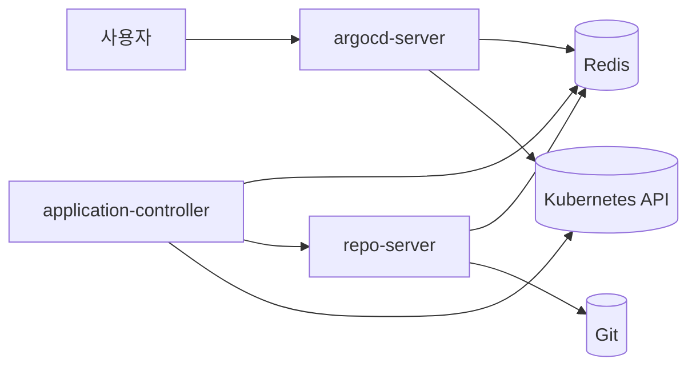

# ArgoCD 설치

> **ArgoCD는 Kubernetes 위에서 동작하는 GitOps 컨트롤러**다. Git을 단일
> 진리 원천(single source of truth)으로 삼고, 클러스터 상태를 Git에 선언된
> 상태로 **지속적으로 수렴**시킨다. 설치 자체는 한 줄 `kubectl apply`로
> 끝나지만, 프로덕션에서는 **HA 구성, 컴포넌트 샤딩, Redis 분리, 멀티 클러스터
> 연결, 최초 부트스트랩**의 다섯 축을 설계해야 무너지지 않는다.

- **현재 기준**: ArgoCD 3.2.10 (2026-04), 3.3 GA (2026-03), 3.4 GA 예정
  (2026-05). Helm 차트 `argo/argo-cd` 9.5.x
- **전제**: Kubernetes 1.28+ (3.0+부터는 1.30 이상 권장), kubectl 4.x,
  클러스터 관리자 권한
- **GitOps 개념** 배경은 [GitOps 개념](../concepts/gitops-concepts.md)
  참조. 이 글은 **설치와 HA**에만 집중한다

---

## 1. 아키텍처 먼저 이해하기

어떤 컴포넌트가 왜 필요한지 알아야 HA·샤딩 설계가 가능하다.

### 1.1 핵심 컴포넌트



| 컴포넌트 | 역할 | 상태성 | 스케일링 |
|---|---|---|---|
| `argocd-server` | REST/gRPC API, UI 제공 | stateless | Deployment, 수평 확장 자유 |
| `argocd-repo-server` | Git clone + manifest 렌더링 | stateless (로컬 캐시) | Deployment, 병렬성 = 레플리카 × `parallelism` |
| `argocd-application-controller` | 리소스 reconcile, 실행 주체 | stateful (샤딩) | StatefulSet, 샤드 = replicas |
| `argocd-applicationset-controller` | ApplicationSet generator 실행 | stateless | Deployment (leader-election 기본 off) |
| `argocd-notifications-controller` | 이벤트 → 알림 | stateless | **반드시 단일 레플리카** (leader-election 미구현, 다중 시 중복 알림) |
| `argocd-redis` | 캐시·세션 저장 | stateful (메모리) | HA는 Redis Sentinel 또는 외부 Redis |
| `argocd-dex-server` (옵션) | OIDC bridge (SAML/LDAP/GitHub 등) | stateless | 단일 인스턴스 |

**핵심 통찰 3가지**

1. `application-controller`만 유일하게 **샤드가 의미 있는** 컴포넌트다
   (클러스터별로 reconcile 담당을 분할)
2. `repo-server`는 CPU·디스크가 가장 많이 드는 컴포넌트 — **manifest 렌더링**
   (Helm template, Kustomize build)이 여기서 실행
3. **Redis가 내려가면 전체 성능 붕괴** — 캐시 miss로 모든 renderinng이 cold
   path로 — HA가 사실상 필수

### 1.2 데이터 흐름

1. 사용자가 Application CR 생성 (Git URL + target rev + path)
2. Controller가 reconcile loop에서 Git 상태 요청
3. Repo-server가 해당 커밋을 clone·cache, manifest 렌더링 후 반환
4. Controller가 **live state (K8s API)** vs **target state (렌더 결과)**
   비교 → `Synced`/`OutOfSync` 결정
5. (Auto-sync 또는 수동) `kubectl apply` 상당 연산 수행
6. 결과·상태가 Redis에 캐시, UI·API에 노출

이 흐름을 머릿속에 두면 **어느 컴포넌트를 몇 개 띄울지**가 자연히 결정된다.

---

## 2. 설치 방식 선택

3가지 공식 경로가 있고, 성숙한 조직은 **Helm 또는 ArgoCD Operator**를 쓴다.

| 방식 | 적합 | 장점 | 단점 |
|---|---|---|---|
| `kubectl apply` 매니페스트 | 데모·학습·소규모 | 단순, 공식 manifest 그대로 | 업그레이드·튜닝 번거로움 |
| **Helm 차트** (`argo/argo-cd`) | **대부분 조직의 정답** | values로 튜닝, 업그레이드 자동 | 차트 버전 ≠ ArgoCD 버전 유의 |
| ArgoCD Operator | OpenShift, 멀티 인스턴스 필요 | CR로 선언적 관리, 여러 인스턴스 | K8s-native 추상 추가 |
| Argo CD Autopilot | 부트스트랩 자동화 | Git 리포 초기 구조까지 생성 | 초기 관례 강제, 중도 전환 어려움 |

**권장 조합**: **Helm 차트로 최초 설치 → 이후 자기 자신을 Application으로
관리**(self-management). 즉 Helm install은 한 번만 하고, 이후 values 변경은
Git → Application → ArgoCD가 스스로 업데이트.

---

## 3. 최소 설치 (개발·검증용)

프로덕션이 아닌 환경에서 빠르게 띄우는 경로.

```bash
kubectl create namespace argocd
kubectl apply -n argocd -f \
  https://raw.githubusercontent.com/argoproj/argo-cd/v3.2.10/manifests/install.yaml
```

**초기 admin 암호**

```bash
kubectl -n argocd get secret argocd-initial-admin-secret \
  -o jsonpath='{.data.password}' | base64 -d
```

**UI 접근 (포트 포워드)**

```bash
kubectl -n argocd port-forward svc/argocd-server 8080:443
# https://localhost:8080, user: admin
```

**CLI 로그인**

```bash
argocd login localhost:8080 --username admin --password <pw> --insecure
```

> ⚠️ `install.yaml`은 **단일 레플리카**다. 이름대로 "install"이지 "HA"가
> 아니다. 프로덕션에 이대로 두면 Controller 재시작 시 **모든 Application
> reconcile 정지**.

---

## 4. HA 설치 — 프로덕션 표준

### 4.1 공식 HA 매니페스트

```bash
kubectl apply -n argocd -f \
  https://raw.githubusercontent.com/argoproj/argo-cd/v3.2.10/manifests/ha/install.yaml
```

**이 매니페스트가 하는 것**

- `argocd-server`: 2 레플리카 + Pod anti-affinity
- `argocd-repo-server`: 2 레플리카 + anti-affinity
- `argocd-application-controller`: 1 StatefulSet (샤딩 가능한 단일 샤드)
- `argocd-redis-ha`: Redis 3개 + Sentinel 3개 + HAProxy
- `argocd-applicationset-controller`: 2 레플리카
- Pod Disruption Budget 전부 세팅

**Pod anti-affinity 때문에 최소 3 노드 필요**하다. 싱글 노드 클러스터는
대기 상태로 멈춘다.

### 4.2 Helm로 HA 구성 (권장)

```yaml
# argocd-values.yaml
global:
  domain: argocd.example.com

configs:
  params:
    server.insecure: false
    # 대규모 환경은 application-controller 샤딩
    # legacy(기본) / round-robin / consistent-hashing(experimental, 권장)
    controller.sharding.algorithm: consistent-hashing
    # 아래는 소규모 기본값 — 규모별 조정 필요 (§4.5 참조)
    controller.status.processors: "20"
    controller.operation.processors: "10"
    controller.self.heal.timeout.seconds: "5"
    reposerver.parallelism.limit: "10"

server:
  replicas: 3
  autoscaling:
    enabled: true
    minReplicas: 3
    maxReplicas: 6
  resources:
    requests: {cpu: 100m, memory: 128Mi}
    limits:   {cpu: 500m, memory: 512Mi}
  ingress:
    enabled: true
    ingressClassName: nginx
    hosts: [argocd.example.com]
    tls:
      - hosts: [argocd.example.com]
        secretName: argocd-tls

repoServer:
  replicas: 3
  autoscaling:
    enabled: true
    minReplicas: 3
    maxReplicas: 10
  resources:
    requests: {cpu: 250m, memory: 512Mi}
    limits:   {cpu: 1,    memory: 2Gi}

controller:
  replicas: 3                   # = 샤드 수
  env:
    - name: ARGOCD_CONTROLLER_REPLICAS
      value: "3"
  resources:
    requests: {cpu: 500m, memory: 1Gi}
    limits:   {cpu: 2,    memory: 4Gi}

applicationSet:
  replicas: 2
  # ⚠️ leader-election 기본 비활성 — 복수 레플리카 시 반드시 켜기
  # 안 켜면 generator가 동시 실행되어 Application race 발생
  extraArgs:
    - --enable-leader-election
  resources:
    requests: {cpu: 100m, memory: 128Mi}
    limits:   {cpu: 500m, memory: 512Mi}

redis-ha:
  enabled: true                 # 내장 Redis HA (Sentinel 3개)
redis:
  enabled: false                # 단일 Redis 비활성

dex:
  enabled: true                 # OIDC 브리지 필요 시

notifications:
  enabled: true
  # ⚠️ notifications-controller는 leader-election 미구현 (2026-04 기준)
  # replicas를 2 이상으로 두면 모든 레플리카가 알림을 중복 송신
  replicas: 1
```

```bash
helm repo add argo https://argoproj.github.io/argo-helm
helm install argocd argo/argo-cd -n argocd --create-namespace \
  -f argocd-values.yaml --version 9.5.4
```

### 4.3 컴포넌트별 HA 전략

| 컴포넌트 | HA 방식 | 주의 |
|---|---|---|
| `argocd-server` | 레플리카 ≥ 2, HPA | **stateless** — 자유 스케일 |
| `argocd-repo-server` | 레플리카 ≥ 2, HPA | 각 레플리카는 **독립 Git clone**, Git provider rate limit 고려 (§4.6) |
| `argocd-application-controller` | 샤딩 (아래 §5 참조) | StatefulSet, 샤드 키 = 클러스터 server URL |
| `argocd-redis` | Redis Sentinel 3 + HAProxy | **외부 Redis 사용 권장** (아래 §4.4) |
| `argocd-applicationset-controller` | 레플리카 ≥ 2 + `--enable-leader-election` | **leader-election 기본 off** — 꺼두면 generator race |
| `argocd-notifications-controller` | **반드시 `replicas: 1`** | leader-election **미구현** — 다중 기동 시 모든 레플리카가 중복 알림 |
| `argocd-dex-server` | 단일 인스턴스 | 외부 OIDC를 직접 쓰면 제거 가능 |

### 4.4 외부 Redis

내장 Redis HA는 3 노드 Sentinel 방식이다. 규모가 커지면 **외부 관리형 Redis**
(AWS ElastiCache Cluster Mode **Disabled**, GCP Memorystore Standard tier,
Redis Enterprise Sentinel 등)로 분리.

```yaml
redis-ha:
  enabled: false
externalRedis:
  host: my-redis.redis.cache.amazonaws.com
  port: 6379
  existingSecret: argocd-redis-auth
```

- **ArgoCD는 Redis Cluster mode를 공식 지원하지 않는다** (Discussion
  [#20729](https://github.com/argoproj/argo-cd/discussions/20729)). 지원되는
  토폴로지는 **단일 Redis / Sentinel / HAProxy 앞단** 세 종류뿐.
  ElastiCache라면 Cluster Mode Disabled, Memorystore Standard tier 선택
- **Redis 장애 = ArgoCD 기능 마비** — SLA가 높은 쪽으로 맞출 것
- TLS·AUTH 필수 (`argocd-redis-secret`에 `redis-password` 저장)
- `redis.compression: gzip`은 2.8+ 기본 활성 — 네트워크/메모리 비용 완화.
  외부 Redis 사용 시에도 유지 권장 (옵션: `gzip` 또는 `none`)

### 4.5 repo-server autoscaling과 Git rate limit

repo-server HPA를 크게 잡을수록 **Git provider rate limit**이 병목이
된다. 각 레플리카가 fetch·clone을 독립 수행하기 때문.

| Provider | 기본 Rate Limit |
|---|---|
| GitHub (authenticated) | 5,000 req/h/token |
| GitHub App | 15,000 req/h/installation |
| GitLab.com | 2,000 req/m/user |
| Bitbucket Cloud | 1,000 req/h/user |

대응:

- **GitHub App 기반 인증** (PAT 대신) — 속도 제한 3배
- **Webhook** 으로 polling 간격 늘리기 (`timeout.reconciliation: 3m` → `10m`)
- **Shallow clone** (3.3+ 기본 활성) — `reposerver.git.shallow-clone`
- **repo cache 튜닝** — `reposerver.git.lsfiles.cache` 크기 증가
- **Pull Request Generator** 는 webhook 전환 필수 (polling이면 리밋 즉시 소진)

### 4.6 최소·권장 리소스 가이드

관리 Application 수와 Git 리포 크기에 비례한다. 아래 표의 표기는
**requests → limits** (CPU/Memory).

| 규모 | Apps | Controller | Repo-server | Redis |
|---|---|---|---|---|
| 소규모 | ~50 | 500m/1Gi → 1/2Gi | 250m/512Mi → 500m/1Gi | 100m/256Mi |
| 중규모 | 50~300 | 1/2Gi → 2/4Gi | 500m/1Gi → 1/2Gi × 3 | 500m/1Gi × 3 |
| 대규모 | 300~1000 | 2/4Gi → 4/8Gi × 샤드 | 1/2Gi → 2/4Gi × 5~10 | 1/4Gi × 3, 또는 외부 |
| 초대규모 | 1000+ | 샤드 5+ | autoscale 10+ | 외부 관리형 |

**메모리는 관리 리소스 수에 선형 증가**한다. 경험치로 리소스 1개당
5~10KB. 1000 Application × 50 resources = 500MB 언저리.

**반드시 limits 설정**. 대형 Helm 차트 한 번의 `helm template`이 수 GB
메모리를 튀게 할 수 있고, limit 없으면 노드 전체가 OOM.

---

## 5. Application Controller 샤딩

### 5.1 왜 샤딩인가

Controller는 **모든 Application의 reconcile**을 책임진다. 1000+ Apps가
되면 단일 Controller가 한 루프 돌기도 전에 다음 이벤트가 쌓여 lag 폭발.
**클러스터 단위로 샤드를 나눠 부하 분산**한다.

### 5.2 샤드 동작

- **샤드 키 = target cluster server URL**
- Controller 레플리카가 3이면 클러스터를 3개 샤드에 분산
- 하나의 Controller 레플리카는 **할당된 클러스터만 reconcile**
- StatefulSet이라 Pod 이름에 인덱스(0, 1, 2) 고정 → 샤드 매핑 안정

### 5.3 샤딩 알고리즘

```yaml
configs:
  params:
    controller.sharding.algorithm: consistent-hashing
```

| 알고리즘 | 특성 | 상태 |
|---|---|---|
| `legacy` | 클러스터 이름 hash mod N | **기본값**, stable |
| `round-robin` | 순차 할당 | stable, 노드 추가 시 대규모 재할당 |
| `consistent-hashing` | Bounded loads 기반 | **experimental** — 벤치마크 우수, 향후 기본 전환 유력 |

`consistent-hashing`은 샤드 추가·제거 시 **최소한의 클러스터만 재할당**
되어 중·대규모 환경에서 선호된다. CNOE 벤치마크에서 균등 분포·재분배
비용 양쪽 모두 우수. 공식적으로는 아직 experimental 표시이므로, **검증
기간을 두고 기본값(`legacy`)에서 단계 전환** 권장.

### 5.4 환경변수 동기화 필수

```yaml
controller:
  replicas: 3
  env:
    - name: ARGOCD_CONTROLLER_REPLICAS
      value: "3"
```

**`replicas`와 `ARGOCD_CONTROLLER_REPLICAS` 값이 반드시 일치**해야 한다.
불일치 시 일부 클러스터가 아예 reconcile되지 않는 고스트 상태 발생.

### 5.5 Dynamic Cluster Distribution (alpha)

ArgoCD에는 레플리카 변경 시 자동 재분배되는 **Dynamic Cluster Distribution**
기능이 있으나 **여전히 alpha**다 (2026-04 기준). 활성 조건:

```yaml
# 1) StatefulSet → Deployment로 전환 (Helm: controller.dynamicClusterDistribution: true)
# 2) 환경변수로 활성
controller:
  env:
    - name: ARGOCD_ENABLE_DYNAMIC_CLUSTER_DISTRIBUTION
      value: "true"
```

- Deployment 기반이라 **Pod 인덱스가 사라진다** — §5.2의 "StatefulSet
  인덱스 기반" 가정이 깨짐
- 여전히 alpha: 프로덕션에서는 **StatefulSet + 고정 replicas + 환경변수
  동기화**가 안정적 기본값

### 5.6 단일 클러스터 대규모 — Namespace Sharding

샤드 키는 "**클러스터 단위**"다. 모든 App이 같은 local 클러스터를 대상
으로 하면 샤드가 하나로 몰려 분산이 안 된다. 2026 표준 해법 두 가지:

**(a) Namespace-scoped ArgoCD + `--application-namespaces`**

`app-in-any-namespace` (3.x에서 GA) 기능으로 Application CR을 여러 namespace
에 두고, 각 namespace별로 **별도 ArgoCD 인스턴스**가 reconcile.

```yaml
# ArgoCD Instance A
controller:
  extraArgs: ["--application-namespaces", "team-a-*"]
# ArgoCD Instance B
controller:
  extraArgs: ["--application-namespaces", "team-b-*"]
```

**(b) ArgoCD Operator Multi-Instance**

Operator가 하나의 클러스터에 여러 ArgoCD CR을 배포, namespace·팀 단위로
분리. OpenShift 외 일반 K8s에서도 사용 가능.

둘 중 **(a) namespace-scoped**가 Helm 표준 흐름과 맞아 운영 부담이 적다.
Operator는 멀티 테넌트 플랫폼 팀이 수십 개 ArgoCD를 관리할 때 유리.

---

## 6. 네트워크 노출

### 6.1 노출 옵션

| 방식 | 적합 | 장단 |
|---|---|---|
| Port-forward | 로컬 테스트 | 1명만, 수명 짧음 |
| NodePort | 내부 전용, 임시 | 포트 관리·보안 부담 |
| LoadBalancer | 관리형 K8s (EKS/GKE/AKS) | 비용, 한 서비스당 LB |
| **Ingress** | 표준 (NGINX, Traefik, HAProxy) | TLS·SSO 통합 자연스러움 |
| Gateway API | 차세대 표준 | HTTPRoute·TLSRoute 조합 |
| Service Mesh (Istio/Linkerd) | 이미 메시가 있을 때 | VirtualService로 통합 |

**2026 권장**: Ingress 또는 Gateway API. LoadBalancer Service를 직접
노출하는 것은 엔터프라이즈 환경에서는 거의 사라졌다.

### 6.2 TLS 종단 위치 — 가장 헷갈리는 포인트

`argocd-server`는 **기본적으로 TLS를 자체 terminate**(self-signed)한다.
Ingress가 TLS를 terminate하면 **이중 TLS**가 된다.

| 방식 | Ingress | argocd-server | 설정 |
|---|---|---|---|
| **권장** | TLS 종단, HTTP로 백엔드 | `server.insecure: true` | `server.service.servicePortHttp` 사용 |
| Passthrough | TLS 그대로 전달 | TLS 종단 | 인증서를 `argocd-server-tls`에 |
| 이중 TLS | 종단 후 재암호화 | TLS 재수립 | `backend-protocol: HTTPS`, 오버헤드 ↑ |

```yaml
# 권장 — Ingress 종단 + argocd-server HTTP
configs:
  params:
    server.insecure: true
server:
  ingress:
    enabled: true
    ingressClassName: nginx
    annotations:
      nginx.ingress.kubernetes.io/ssl-redirect: "true"
      nginx.ingress.kubernetes.io/backend-protocol: "HTTP"
    hosts: [argocd.example.com]
    tls:
      - hosts: [argocd.example.com]
        secretName: argocd-tls
```

### 6.3 gRPC·Web 혼합 엔드포인트

`argocd` CLI는 **gRPC**로, UI는 **HTTPS**로 통신한다. 같은 도메인에 둘 다
뚫으려면 Ingress의 **HTTP/2** 또는 **gRPC** 지원이 필요.

```yaml
annotations:
  nginx.ingress.kubernetes.io/grpc-backend: "true"        # NGINX
  traefik.ingress.kubernetes.io/service.serversscheme: "h2c"  # Traefik
```

또는 **서버와 CLI를 다른 호스트**로 분리하기도 한다.
`argocd.example.com` (UI) + `argocd-grpc.example.com` (CLI).

---

## 7. 인증 구성

초기 `admin` 계정은 부트스트랩용이다. 프로덕션은 반드시 SSO로 전환.

### 7.1 OIDC 직접 연결 (권장)

Dex를 빼고 IdP에 바로 붙는 쪽이 단순하고 장애 지점이 적다.

```yaml
# argocd-cm (Helm: configs.cm)
configs:
  cm:
    url: https://argocd.example.com
    oidc.config: |
      name: Okta
      issuer: https://example.okta.com
      clientID: 0oa...
      clientSecret: $oidc.okta.clientSecret
      requestedScopes: ["openid", "profile", "email", "groups"]
      requestedIDTokenClaims:
        groups:
          essential: true
```

### 7.2 Dex 경유 (SAML, LDAP, GitHub/GitLab)

OIDC를 지원하지 않는 IdP나 GitHub·GitLab 로그인이 필요하면 Dex 사용.

```yaml
configs:
  cm:
    dex.config: |
      connectors:
        - type: github
          id: github
          name: GitHub
          config:
            clientID: ...
            clientSecret: $dex.github.clientSecret
            orgs:
              - name: my-org
                teams: [platform, sre]
```

### 7.3 admin 계정 비활성화

SSO 전환 후 **admin은 껴두지 말 것**. 비활성화 또는 복구용 Break-glass
계정만 유지.

```yaml
configs:
  cm:
    admin.enabled: "false"
```

RBAC 상세는 [ArgoCD 프로젝트](./argocd-projects.md) 참조.

---

## 8. 첫 클러스터 연결 — 자체 클러스터

설치된 ArgoCD는 기본적으로 **자기가 떠 있는 클러스터만 `in-cluster` 이름
으로 등록**돼 있다. 별도 클러스터를 관리하려면 추가 등록이 필요하다.

```bash
# 첫 위치 인자는 kubeconfig context 이름 (EKS면 ARN, GKE면 gke_...)
argocd cluster add <kubeconfig-context> --name prod-a

# EKS + IRSA (장기 Bearer Token 대체, 권장)
argocd cluster add arn:aws:eks:us-east-1:111:cluster/prod-a \
  --name prod-a --aws-cluster-name prod-a \
  --service-account argocd-manager --system-namespace argocd
```

**뒤에서 일어나는 일**

1. 대상 클러스터에 `argocd-manager` ServiceAccount + ClusterRoleBinding
   생성
2. 해당 SA의 토큰을 ArgoCD 소스 클러스터의 `cluster-secret` (Secret 타입
   `argocd.argoproj.io/cluster`)에 저장
3. Controller가 이 Secret을 watch → reconcile 대상 클러스터 목록에 추가

### 8.1 멀티 클러스터 아키텍처 결정

| 패턴 | 설명 | 적합 |
|---|---|---|
| **Hub-and-spoke** (중앙 ArgoCD 1개) | 중앙 클러스터가 모든 관리 | 소·중규모, ~100 클러스터 |
| ArgoCD per cluster | 각 클러스터에 ArgoCD | 리전 독립, 규제 요건 |
| Hierarchical | 지역별 ArgoCD + 중앙 ArgoCD가 ArgoCD 자체 관리 | 초대규모, 멀티 리전 |
| argocd-agent (별도 프로젝트) | 중앙 제어 평면 + 원격 pull 에이전트 | 네트워크 격리, air-gapped |

**중요**: Hub-and-spoke는 "얼마나 많은 클러스터까지?"가 항상 문제.
Controller 샤딩·repo-server 캐시 적중률·네트워크 왕복이 300 클러스터쯤에서
체감 한계. 그 위로는 **Hierarchical** 이 현실적 답.

**argocd-agent** 는 ArgoCD 본체 기능이 아니라 **argoproj-labs/argocd-agent**
별도 프로젝트로 alpha 단계다 (본 글 작성 시점). 중앙 ArgoCD에 spoke 클러스터의
bearerToken 저장 없이, 각 spoke가 에이전트를 통해 중앙에 접속해 pull 형태로
동작 — air-gapped·규제 환경에 적합. ArgoCD 본체 릴리즈 노트를 ArgoCD-agent와
혼동하지 말 것.

### 8.2 클러스터 등록 시크릿 구조 (선언적 관리)

```yaml
apiVersion: v1
kind: Secret
metadata:
  name: prod-cluster
  namespace: argocd
  labels:
    argocd.argoproj.io/secret-type: cluster
type: Opaque
stringData:
  name: prod-a
  server: https://k8s-prod-a.example.com
  config: |
    {
      "bearerToken": "...",
      "tlsClientConfig": {"insecure": false, "caData": "<base64>"}
    }
```

**이 방식의 장점**: cluster 등록 자체를 Git으로 관리 가능 → ArgoCD가
ArgoCD의 클러스터 목록을 관리하는 self-referential 부트스트랩.

**단점**: bearerToken 장기 저장 — **External Secrets Operator + Vault**
조합으로 해소하는 게 업계 표준. [Secrets Operator](../../security/)에서
상세히 다룸.

### 8.3 인증 모드 비교

| 모드 | 보안 | 운영 |
|---|---|---|
| **Bearer Token** (SA 장기 토큰) | 유출 시 풀 컨트롤 | 단순, 가장 흔함 |
| **AWS IAM / IRSA** (EKS) | 토큰 없음, IAM 기반 | EKS 전용, exec plugin |
| **GKE Workload Identity** | 토큰 없음 | GKE 전용 |
| **Azure AD Workload Identity** | 토큰 없음 | AKS 전용 |
| **argocd-agent** (별도 프로젝트) | 중앙에 자격 없음, spoke가 pull | alpha, air-gapped |

**EKS/GKE/AKS는 IRSA/Workload Identity 사용을 강력히 권장**. 장기 Bearer
Token은 cluster 하나가 유출되면 전체가 영향받는 큰 공격 표면.

### 8.4 IRSA 구성 상세 (EKS Hub-and-spoke)

실제 운영 시 디테일이 많다. 핵심 체크리스트:

**(1) ServiceAccount annotation — 세 컴포넌트 모두**

argocd-server / repo-server / application-controller **모두** 해당
IAM Role을 assume해야 한다. 하나라도 빠지면 Role discovery·reconcile
실패.

```yaml
controller:
  serviceAccount:
    create: true
    annotations:
      eks.amazonaws.com/role-arn: arn:aws:iam::111:role/argocd-controller
server:
  serviceAccount:
    annotations:
      eks.amazonaws.com/role-arn: arn:aws:iam::111:role/argocd-controller
repoServer:
  serviceAccount:
    annotations:
      eks.amazonaws.com/role-arn: arn:aws:iam::111:role/argocd-controller
```

**(2) 클러스터 Secret에 IRSA 설정**

```yaml
apiVersion: v1
kind: Secret
metadata:
  name: prod-cluster
  namespace: argocd
  labels: {argocd.argoproj.io/secret-type: cluster}
stringData:
  name: prod-a
  server: https://xxx.gr7.us-east-1.eks.amazonaws.com
  config: |
    {
      "awsAuthConfig": {
        "clusterName": "prod-a",
        "roleARN": "arn:aws:iam::222:role/argocd-spoke-prod-a"
      },
      "tlsClientConfig": {"insecure": false, "caData": "<base64>"}
    }
```

**(3) Trust Policy chain — 멀티 계정**

중앙 ArgoCD 계정의 IAM Role이 spoke 계정의 Role을 `AssumeRole` 할 수
있어야 한다.

```json
// Spoke 계정 argocd-spoke-prod-a Role의 Trust Policy
{
  "Version": "2012-10-17",
  "Statement": [{
    "Effect": "Allow",
    "Principal": {"AWS": "arn:aws:iam::111:role/argocd-controller"},
    "Action": "sts:AssumeRole"
  }]
}
```

**(4) Spoke 클러스터 aws-auth ConfigMap**

Spoke EKS의 `kube-system/aws-auth`에 해당 Role이 추가돼야 `kubectl`
명령이 통한다.

```yaml
mapRoles:
  - rolearn: arn:aws:iam::222:role/argocd-spoke-prod-a
    username: argocd-manager
    groups: [system:masters]   # 실운영은 최소 권한으로 좁힐 것
```

**(5) aws CLI 내장 이미지**

ArgoCD 2.x 이미지는 `aws` 바이너리를 포함하지 않는다. 3.x `argocd:vX.Y.Z`
공식 이미지에는 기본 포함되지만, **이미지 버전별로 확인 필수**. 없으면
initContainer로 복사하거나 별도 빌드 이미지 사용.

GKE Workload Identity·Azure AD Workload Identity도 구조는 동일: SA
annotation → cluster Secret config에 exec provider / GCP auth 명시 →
spoke측 IAM.

---

## 9. 초기 부트스트랩 패턴

### 9.1 App-of-Apps (고전 패턴)

"**ArgoCD 자신**을 ArgoCD의 Application으로 관리"가 GitOps의 미덕. 최초
Helm install만 수동, 이후 전부 Git이 단일 진리 원천.

```yaml
# Git: argocd/bootstrap/root-app.yaml
apiVersion: argoproj.io/v1alpha1
kind: Application
metadata:
  name: root
  namespace: argocd
spec:
  project: default
  source:
    repoURL: https://git.example.com/platform/gitops
    targetRevision: HEAD
    path: argocd/apps           # 디렉터리 안의 모든 Application을 매핑
    directory:
      recurse: true
  destination:
    server: https://kubernetes.default.svc
    namespace: argocd
  syncPolicy:
    automated:
      # ⚠️ root는 prune 비활성 — cascade 삭제 방지 (§9.1.1 참조)
      prune: false
      selfHeal: true
```

```bash
# 최초 부트스트랩 (한 번만)
kubectl apply -n argocd -f argocd/bootstrap/root-app.yaml
```

이후 `argocd/apps/` 밑에 `platform.yaml`, `monitoring.yaml` 등 추가 →
자동 배포. ArgoCD 자신의 Helm chart도 그 밑의 Application으로 관리하면
**설정 변경이 Git PR + Merge로 일원화**된다.

#### 9.1.1 Prune cascade 함정 — 가장 흔한 사고

App-of-Apps의 root에 `prune: true`를 걸면, **어떤 사유로든 자식
Application YAML이 Git에서 일시 삭제/이동**될 때 root가 해당 Application
CR을 prune → 자식 Application이 관리하던 **모든 워크로드가 cascade로
삭제**된다.

방어책 3가지:

| 방어 | 방법 |
|---|---|
| Root에 prune 끔 | `automated.prune: false` (위 예시 권장) |
| 자식에 prune-protection annotation | `argocd.argoproj.io/sync-options: Prune=false` |
| Application에 finalizer | `resources-finalizer.argoproj.io` 추가 (삭제 시 리소스 정리 보장이 필요한 경우만 — prune과는 별개) |

**대규모 운영 원칙**: root Application은 prune 끄고, 의도적으로 무언가를
제거할 때만 **수동으로 `kubectl delete`** 또는 `argocd app delete`.
"자동 반영 = 안전"이라는 생각이 가장 위험하다.

### 9.2 ApplicationSet (신 표준)

App-of-Apps를 ApplicationSet의 `git` generator로 대체 가능. 자세한 내용은
[ArgoCD App](./argocd-apps.md) 참조. 수십 개 이상은 ApplicationSet이
유지보수 우위.

### 9.3 ArgoCD Autopilot

초기 Git 구조(Projects/Apps 트리)까지 스캐폴딩해주는 도구.

```bash
export GIT_TOKEN=... GIT_REPO=https://github.com/org/gitops
argocd-autopilot repo bootstrap
```

- 장점: 조직별 "ArgoCD 리포 구조"를 한 번에 표준화
- 단점: 디렉터리 관례가 강제 — 중도에 구조 바꾸기 힘듦
- 적합: 새 조직·새 리포 시작할 때만. 기존 GitOps 리포에 맞추는 건 비추

---

## 10. 자체 업그레이드 (Self-management)

ArgoCD가 자신을 관리하게 되면 **버전 업그레이드도 PR 한 번**.

```yaml
# argocd/apps/argocd.yaml (Git)
apiVersion: argoproj.io/v1alpha1
kind: Application
metadata:
  name: argocd
  namespace: argocd
spec:
  project: platform
  source:
    chart: argo-cd
    repoURL: https://argoproj.github.io/argo-helm
    targetRevision: 9.5.4        # 여기만 바꾸면 업그레이드
    helm:
      valueFiles: [values-prod.yaml]
  destination:
    server: https://kubernetes.default.svc
    namespace: argocd
  syncPolicy:
    automated: { selfHeal: true, prune: false }
    syncOptions:
      - ServerSideApply=true
      - ApplyOutOfSyncOnly=true
```

**차트 버전 ≠ ArgoCD 버전**. Helm 차트 릴리즈 노트에서 포함 ArgoCD 버전
확인 필요. 양쪽 버전 매트릭스는
[argo-helm CHANGELOG](https://github.com/argoproj/argo-helm/blob/main/charts/argo-cd/Chart.yaml)
참조.

### 10.1 업그레이드 원칙

1. **Minor/Major는 한 단계씩**: 3.1 → 3.3 금지, 3.1 → 3.2 → 3.3
2. **CRD 변경 체크**: 릴리즈 노트 "Breaking Changes" 필독
3. **스테이징에서 먼저**: ArgoCD 자체 업그레이드는 스테이징 클러스터 선행
4. **PreDelete Hooks (3.3+)** 사용 중이면 롤백 시 훅 정의 제거 확인
5. **CRD는 별도 Application**: Helm 차트가 release를 삭제할 때 Application
   CRD까지 삭제되면 모든 Application CR이 사라진다. CRD를 별도 Application
   에 `Replace=true` + `ServerSideApply=true`로 분리하는 것이 대규모 운영
   표준 — 상세는 [ArgoCD 운영](./argocd-operations.md)

상세는 [ArgoCD 운영](./argocd-operations.md) 참조.

---

## 11. 네트워크·보안 하드닝

### 11.1 NetworkPolicy — Ingress + Egress

ArgoCD 보안 하드닝의 핵심은 **egress 통제**다. repo-server는 Git host로,
controller는 모든 target cluster API로, server는 SSO IdP로 outbound 연결.
Zero-trust 관점에서 default-deny + 허용 리스트.

```yaml
# 1. 기본 deny-all (Ingress + Egress)
apiVersion: networking.k8s.io/v1
kind: NetworkPolicy
metadata:
  name: argocd-default-deny
  namespace: argocd
spec:
  podSelector: {}
  policyTypes: [Ingress, Egress]
---
# 2. argocd-server: Ingress controller에서만 유입
apiVersion: networking.k8s.io/v1
kind: NetworkPolicy
metadata:
  name: argocd-server-ingress
  namespace: argocd
spec:
  podSelector:
    matchLabels: {app.kubernetes.io/name: argocd-server}
  policyTypes: [Ingress]
  ingress:
    - from:
        - namespaceSelector:
            matchLabels: {kubernetes.io/metadata.name: ingress-nginx}
      ports:
        - {protocol: TCP, port: 8080}
---
# 3. repo-server egress — Git host + DNS
apiVersion: networking.k8s.io/v1
kind: NetworkPolicy
metadata:
  name: argocd-repo-server-egress
  namespace: argocd
spec:
  podSelector:
    matchLabels: {app.kubernetes.io/name: argocd-repo-server}
  policyTypes: [Egress]
  egress:
    - to: [{namespaceSelector: {matchLabels: {kubernetes.io/metadata.name: kube-system}}}]
      ports: [{protocol: UDP, port: 53}, {protocol: TCP, port: 53}]
    - to: []  # Git host — 실운영은 Cilium CiliumNetworkPolicy로 FQDN 제한
      ports: [{protocol: TCP, port: 443}, {protocol: TCP, port: 22}]
```

- 기본 `NetworkPolicy`는 **IP/라벨 기반**이라 FQDN 제한 불가 → Cilium
  (`CiliumNetworkPolicy`의 `toFQDNs`) 또는 Calico GlobalNetworkPolicy 권장
- Controller는 **모든 target cluster API**로 egress 필요 — 멀티 클러스터
  IP 범위를 CIDR로 허용하거나 egress gateway 뒤에 둘 것

### 11.2 Pod Security

Helm 차트는 기본 `runAsNonRoot: true`, `readOnlyRootFilesystem: true`
상태. 오버라이드 금지.

### 11.3 민감 정보 저장

`argocd-secret` (서버 TLS 키, admin 토큰 서명 키) · `argocd-notifications-secret`
· 클러스터 bearerToken — 전부 Secret 객체. **External Secrets Operator**
로 Vault·AWS SM·GCP SM에서 주입하는 게 표준.

```yaml
# ExternalSecret 예
apiVersion: external-secrets.io/v1beta1
kind: ExternalSecret
metadata:
  name: argocd-oidc
  namespace: argocd
spec:
  refreshInterval: 1h
  secretStoreRef: {name: vault-backend, kind: ClusterSecretStore}
  target: {name: argocd-secret, creationPolicy: Merge}
  data:
    - secretKey: oidc.okta.clientSecret
      remoteRef: {key: argocd/okta, property: clientSecret}
```

### 11.4 Audit Log

`argocd-server`, `argocd-application-controller` 로그는 JSON 구조.
모든 API 요청·reconcile 결과가 여기에. 중앙 로그 시스템(Loki,
Elasticsearch)으로 반드시 수집.

---

## 12. 설치 직후 상태 검증 체크리스트

아래가 전부 통과해야 "설치 완료".

```bash
# 1. 모든 Pod Running
kubectl -n argocd get pods -o wide

# 2. 샤딩 동작 (Controller 레플리카 수만큼 StatefulSet 기동)
kubectl -n argocd get statefulset argocd-application-controller

# 3. Redis HA 건전성
kubectl -n argocd exec argocd-redis-ha-server-0 -c sentinel -- \
  redis-cli -p 26379 sentinel get-master-addr-by-name argocd

# 4. UI·gRPC 통신
argocd version --server argocd.example.com

# 5. 초기 Application 동기화
argocd app list
argocd app get root

# 6. 메트릭 엔드포인트 (각 컴포넌트 :8082, :8083, :8084)
kubectl -n argocd port-forward svc/argocd-metrics 8082
curl -s localhost:8082/metrics | head
```

**메트릭 스크레이핑**은 다음 운영 장에서 상세 다룸. Prometheus Operator의
ServiceMonitor를 Helm values에서 한 번에 켤 수 있다 (`metrics.enabled:
true` + `metrics.serviceMonitor.enabled: true`).

---

## 13. 안티패턴

| 안티패턴 | 왜 문제 | 교정 |
|---|---|---|
| `install.yaml`을 프로덕션에 사용 | 단일 레플리카, Redis SPOF | `ha/install.yaml` 또는 Helm |
| 리소스 limits 미설정 | 대형 Helm template이 노드 OOM | requests/limits 명시 |
| Controller `replicas` ≠ `ARGOCD_CONTROLLER_REPLICAS` | 일부 클러스터 reconcile 누락 | 값 동기화 |
| **notifications-controller 레플리카 ≥ 2** | leader-election 미구현 — 중복 알림 | `replicas: 1` 고정 |
| **applicationset-controller 다중 레플리카 + leader-election off** | Generator race, 중복 Application | `--enable-leader-election` 추가 |
| **Redis Cluster Mode Enabled 사용** | ArgoCD 미지원 | Sentinel 또는 단일 Redis |
| root App-of-Apps에 `prune: true` | 자식 Application cascade 삭제 | root는 `prune: false` |
| admin 계정을 일상 사용 | 감사·권한 분리 불가 | SSO 강제, admin 비활성 |
| 이중 TLS (Ingress + server 둘 다 종단) | 오버헤드·디버깅 복잡 | `server.insecure: true` + Ingress에서 TLS |
| 클러스터 bearerToken 평문 저장 | 유출 시 파급 | ESO + Vault, IRSA/Workload Identity |
| 단일 리전 ArgoCD로 전 세계 관리 | 네트워크 왕복·장애 blast | 리전별 ArgoCD + Hierarchical |
| ArgoCD를 ArgoCD로 관리하지 않음 | 설정 drift, 감사 불가 | self-management |
| minor 여러 단계 점프 업그레이드 | CRD·마이그레이션 실패 | 한 단계씩 |
| Dex 남용 (OIDC 직접 가능한데) | 장애점 하나 더 추가 | 가능한 한 OIDC 직결 |
| Redis HA 비활성 프로덕션 | Redis 재시작 = 성능 붕괴 | 내장 HA 또는 외부 관리형 |
| App-of-Apps 없이 Application을 kubectl로 생성 | Git이 진리가 아님 | 루트 Application으로 Git 연결 |
| repo-server HPA만 키우고 rate limit 무대책 | Git provider 차단 | GitHub App + webhook + shallow clone |
| Egress NetworkPolicy 없음 | repo-server·controller로 exfil 가능 | default-deny + FQDN 허용 (Cilium) |
| Pull Request Generator + polling | 즉시 rate limit 소진 | webhook 전환 필수 |

---

## 14. 도입 로드맵

1. **단일 노드 검증**: `install.yaml` + port-forward로 개념 이해
2. **Helm 전환**: values 파일 만들고 `ha/install` 수준으로 구성
3. **Ingress + TLS + OIDC**: admin → SSO 전환, `admin.enabled: false`
4. **Self-management**: 루트 Application으로 ArgoCD 자신 관리
5. **모니터링**: ServiceMonitor + Grafana 공식 대시보드 15760
6. **Controller 샤딩**: Application 수 증가 시 레플리카 ↑, consistent-hashing
7. **Redis 외부화**: 대규모면 관리형 Redis로 분리
8. **멀티 클러스터**: SA bearerToken → IRSA/Workload Identity
9. **ApplicationSet 도입**: App-of-Apps를 ApplicationSet으로 전환
10. **Hierarchical / Agent 모드**: 초대규모 시 중앙·지역 분리

---

## 15. 관련 문서

- [ArgoCD App](./argocd-apps.md) — Application, ApplicationSet, Generator
- [ArgoCD 프로젝트](./argocd-projects.md) — AppProject, RBAC
- [ArgoCD Sync](./argocd-sync.md) — sync policy, hooks, pruning
- [ArgoCD 운영](./argocd-operations.md) — upgrade, backup, DR
- [ArgoCD 고급](./argocd-advanced.md) — PreDelete Hooks, Shallow Clone, Agent
- [Notifications](./argocd-notifications.md) — 알림·Webhook
- [GitOps 개념](../concepts/gitops-concepts.md) — pull vs push, 원칙

---

## 참고 자료

- [Argo CD 공식 문서 — Operator Manual](https://argo-cd.readthedocs.io/en/stable/operator-manual/) — 확인: 2026-04-24
- [Architectural Overview](https://argo-cd.readthedocs.io/en/stable/operator-manual/architecture/) — 확인: 2026-04-24
- [High Availability](https://argo-cd.readthedocs.io/en/stable/operator-manual/high_availability/) — 확인: 2026-04-24
- [Installation](https://argo-cd.readthedocs.io/en/stable/operator-manual/installation/) — 확인: 2026-04-24
- [argo-helm — argo-cd 차트](https://github.com/argoproj/argo-helm/tree/main/charts/argo-cd) — 확인: 2026-04-24
- [argo-cd GitHub Releases](https://github.com/argoproj/argo-cd/releases) — 확인: 2026-04-24
- [Argo CD 3.3 Release Blog](https://blog.argoproj.io/argo-cd-3-3-release-candidate-00e99f7b7daa) — 확인: 2026-04-24
- [Release Process And Cadence](https://argo-cd.readthedocs.io/en/latest/developer-guide/release-process-and-cadence/) — 확인: 2026-04-24
- [Component Architecture](https://argo-cd.readthedocs.io/en/latest/developer-guide/architecture/components/) — 확인: 2026-04-24
- [Argo CD Autopilot](https://argocd-autopilot.readthedocs.io/) — 확인: 2026-04-24
- [Argo CD endoflife.date](https://endoflife.date/argo-cd) — 확인: 2026-04-24
- [Dynamic Cluster Distribution](https://argo-cd.readthedocs.io/en/latest/operator-manual/dynamic-cluster-distribution/) — 확인: 2026-04-24
- [argocd-agent (argoproj-labs)](https://github.com/argoproj-labs/argocd-agent) — 확인: 2026-04-24
- [argocd cluster add — Command Reference](https://argo-cd.readthedocs.io/en/stable/user-guide/commands/argocd_cluster_add/) — 확인: 2026-04-24
- [EKS IRSA with ArgoCD — AWS Containers Blog](https://aws.amazon.com/blogs/containers/deep-dive-streamlining-gitops-with-amazon-eks-capability-for-argo-cd/) — 확인: 2026-04-24
- [CNOE Argo CD Sharding Benchmark](https://cnoe.io/blog/argo-cd-application-scalability) — 확인: 2026-04-24
