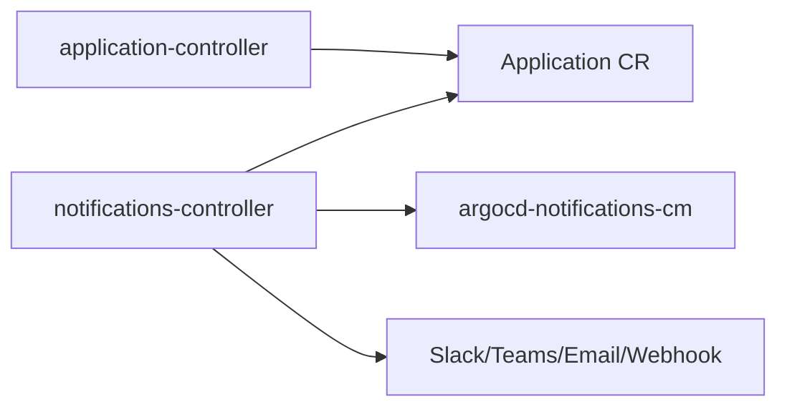
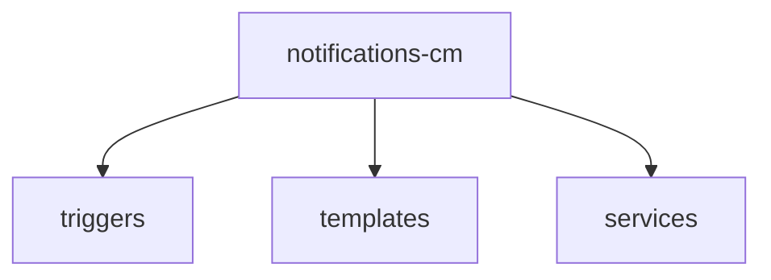

# ArgoCD Notifications

> **배포 이벤트를 사람·시스템에 알리는 사이드 컴포넌트**. Sync 성공/실패,
> Health degraded, OutOfSync drift, Application 삭제 등을 Slack, MS
> Teams, 이메일, Webhook으로 전송. `argocd-notifications-cm` 설정 3요소
> (triggers · templates · services) + Application annotation 구독이
> 전부다. 이 글은 built-in 트리거, 커스텀 템플릿, 서비스별 구성, 중복
> 방지(`oncePer`), 3.4 MS Teams Adaptive Cards까지 정리.

- **주제 경계**: 컴포넌트 배치·HA는 [ArgoCD 설치](./argocd-install.md).
  여기는 **어떻게 알릴지** 구성에만 집중
- **현재 기준**: ArgoCD 3.2 / 3.3 GA / 3.4 (MS Teams Adaptive Cards)
- **중요**: notifications-controller는 **leader-election 미구현** —
  `replicas: 1` 필수 ([설치 §4.3](./argocd-install.md))

---

## 1. 아키텍처



- notifications-controller가 **Application CR을 watch**
- 이벤트 감지 → trigger 조건 평가 → template 렌더 → service 호출
- Application annotation `notifications.argoproj.io/subscribe.<trigger>.<service>`
  가 "누가 이 이벤트를 받을지" 선언

### 1.1 구성 3요소



| 요소 | 역할 | 예 |
|---|---|---|
| `trigger.<name>` | 이벤트 조건 + 보낼 template 지정 | `on-sync-failed` |
| `template.<name>` | 메시지 본문 (Go template) | `app-sync-failed` |
| `service.<type>` | 전송 채널 + 자격증명 | `service.slack` |

### 1.2 Built-in 리소스

ArgoCD는 자주 쓰는 trigger·template을 **catalog**로 제공. Helm
values에서 활성 가능:

```yaml
notifications:
  triggers:
    trigger.on-sync-status-unknown: |
      - when: app.status.sync.status == 'Unknown'
        send: [app-sync-status-unknown]
  templates:
    template.app-sync-failed: |
      message: "Application {{.app.metadata.name}} sync is failed."
```

커스텀 필요 없이 built-in 그대로 사용하는 케이스가 대부분.

---

## 2. Triggers — 이벤트 조건

### 2.1 Built-in triggers

| Trigger | 조건 |
|---|---|
| `on-sync-succeeded` | `app.status.operationState.phase == 'Succeeded'` |
| `on-sync-failed` | `app.status.operationState.phase in ['Error', 'Failed']` |
| `on-sync-running` | Syncing 진행 중 |
| `on-sync-status-unknown` | Sync status Unknown |
| `on-health-degraded` | `app.status.health.status == 'Degraded'` |
| `on-deployed` | `phase=Succeeded` + `health=Healthy` (revision별 1회, built-in에 `oncePer` 포함) |
| `on-created` | Application 생성 |
| `on-deleted` | Application 삭제 |

### 2.2 Trigger 정의 문법

```yaml
trigger.on-sync-failed: |
  - description: Application sync failed
    send: [app-sync-failed]
    when: app.status.operationState.phase in ['Error', 'Failed']
    # oncePer 으로 중복 방지
    oncePer: app.status.sync.revision
```

- `send`: 전송할 template 이름(들)
- `when`: **expr-lang (antonmedv/expr)** 표현식 — Application 객체의
  필드 접근. 논리 연산자는 `and`/`or`/`not` 사용 (CEL 아님)
- **`oncePer`**: 동일 값에 대해 한 번만 — 반복 알림 폭주 방지

### 2.3 커스텀 trigger 예시

"**staging에서 sync 성공 + prod에서 sync 실패**" 처럼 조합된 조건:

```yaml
trigger.on-prod-deploy-failure: |
  - when: app.status.operationState.phase == 'Failed' and
          app.metadata.labels.env == 'prod'
    send: [prod-deploy-failure]
    oncePer: app.status.operationState.syncResult.revision
```

- 라벨·annotation 기반 조건으로 팀별 알림 분리
- `oncePer`가 없으면 **매 Application refresh 주기(기본 180초)마다**
  when이 true인 동안 재송신 — 같은 실패에 대해 수십 번 알림 폭주

### 2.4 `oncePer` — 중복 방지의 이해

`oncePer` 값이 바뀔 때까지는 같은 trigger가 **재송신되지 않는다**.

| 패턴 | 효과 |
|---|---|
| `app.status.sync.revision` | 새 commit일 때만 알림 |
| `app.status.operationState.syncResult.revision` | 매 sync 결과별 1회 |
| `app.status.health.status` | health 상태 변경 시만 |

**주기적 재알림**(예: 24시간마다) 기능은 공식 미지원. 필요하면
CronJob으로 annotation 갱신 후 `oncePer`를 깨는 우회 필요.

---

## 3. Templates — 메시지 본문

### 3.1 기본 구조

```yaml
template.app-sync-failed: |
  email:
    subject: "Application {{.app.metadata.name}} sync failed"
  message: |
    {{.app.metadata.name}} sync is failed.
    Sync operation details are available at:
    {{.context.argocdUrl}}/applications/{{.app.metadata.name}}
  slack:
    attachments: |
      [{
        "title": "{{.app.metadata.name}}",
        "color": "#E96D76",
        "fields": [
          {"title": "Sync Status", "value": "{{.app.status.sync.status}}", "short": true},
          {"title": "Repository", "value": "{{.app.spec.source.repoURL}}", "short": true},
          {"title": "Revision",   "value": "{{.app.status.sync.revision}}", "short": true}
        ]
      }]
```

### 3.2 template 컨텍스트

template 안에서 접근 가능한 객체:

| 변수 | 내용 |
|---|---|
| `.app` | Application CR 전체 (metadata, spec, status) |
| `.context` | argocdUrl, notificationType 등 |
| `.recipient` | 구독자 (annotation 값) |

### 3.3 Go template + sprig 함수

```yaml
message: |
  {{ $env := .app.metadata.labels.env | default "dev" }}
  {{ $color := ternary "#36a64f" "#E96D76" (eq .app.status.operationState.phase "Succeeded") }}
  {{- /* 주석 */}}
  {{ upper $env }} 환경의 {{ .app.metadata.name }} 배포
  ({{ .app.status.sync.revision | substr 0 7 }})
```

- sprig 함수 (`default`, `upper`, `substr`, `ternary` 등) 전부 지원
- `{{- -}}`로 공백 제어

### 3.4 Service별 분기

같은 template을 여러 service에 보낼 때 각자 다른 포맷:

```yaml
template.app-sync-failed: |
  message: "Plain text fallback"
  slack:
    attachments: "..."           # Slack 전용 JSON
  teams:
    themeColor: "#FF0000"
    title: "Sync Failed"
  webhook:
    my-webhook:
      method: POST
      body: |
        {"event": "sync_failed", "app": "{{.app.metadata.name}}"}
```

---

## 4. Services — 전송 채널

### 4.1 Slack

```yaml
# argocd-notifications-cm
service.slack: |
  token: $slack-token
  icon: ":boom:"
  username: "ArgoCD"
  signingSecret: $slack-signing-secret   # (선택) verification용
```

```yaml
# argocd-notifications-secret
stringData:
  slack-token: "xoxb-..."       # Bot User OAuth Token
```

- **권장**: Bot token (`xoxb-...`). Bot이 채널에 **초대**되어 있어야 송신
- Incoming Webhook URL도 `webhook` service를 통해 여전히 사용 가능
  (구 방식 — Slack chat API v2 권한 관리와 감사 이점은 Bot token 우위)
- 구독: `notifications.argoproj.io/subscribe.on-sync-failed.slack: "#deploy-alerts"`

### 4.2 MS Teams — 두 가지 서비스 타입

ArgoCD는 **두 개의 별도 서비스**를 지원한다. 2026-03-31로 Microsoft가
Office 365 Connectors를 공식 retire했으므로 신규는 `teams-workflows`만
선택.

| Service | 포맷 | 상태 |
|---|---|---|
| `service.teams` | Office 365 Connector (MessageCard) | **retired 2026-03-31**, 신규 사용 금지 |
| `service.teams-workflows` | Power Automate Workflow (Adaptive Cards) | 2026 표준 |

```yaml
service.teams-workflows: |
  recipientUrls:
    prod-team: $teams-workflow-prod        # Power Automate Workflow URL
    dev-team:  $teams-workflow-dev
```

```yaml
template.app-sync-failed-teams: |
  teamsWorkflows:
    type: message
    attachments: |
      [{
        "contentType": "application/vnd.microsoft.card.adaptive",
        "content": {
          "type": "AdaptiveCard",
          "version": "1.4",
          "body": [
            {"type": "TextBlock", "text": "{{.app.metadata.name}} failed",
             "weight": "bolder", "color": "attention"}
          ]
        }
      }]
```

### 4.3 Email (SMTP)

```yaml
service.email: |
  host: smtp.gmail.com
  port: 587
  from: argocd@example.com
  username: $email-user
  password: $email-password
```

- SMTP 서버 직접 연결 — AWS SES, SendGrid SMTP 등
- OAuth2 미지원 — 앱 패스워드·API 키 방식만

### 4.4 Webhook — 범용 통합

```yaml
service.webhook.jira: |
  url: https://jira.example.com/rest/webhook/1/xxxx
  headers:
    - name: Content-Type
      value: application/json
    - name: Authorization
      value: Bearer $jira-token
```

```yaml
template.app-sync-failed: |
  webhook:
    jira:
      method: POST
      body: |
        {
          "fields": {
            "project": {"key": "INFRA"},
            "summary": "ArgoCD: {{.app.metadata.name}} sync failed",
            "description": "{{.app.status.operationState.message}}",
            "issuetype": {"name": "Incident"}
          }
        }
```

이 패턴으로 **Jira ticket, PagerDuty incident, ServiceNow, 내부 CMDB,
배포 기록 DB** 전부 통합 가능.

### 4.5 기타 서비스

| Service | 용도 |
|---|---|
| `grafana` | Annotation 기록 (배포 = 라인 마킹) |
| `opsgenie` | On-call 알림 |
| `pagerduty` | Incident 생성 |
| `googlechat` | Google Workspace |
| `rocketchat` | Self-hosted 대안 |
| `mattermost` | Self-hosted 대안 |
| `pushover` | 개인 모바일 푸시 |
| `telegram` | Bot |
| `github` | Commit status / Deployment |
| `gitlab` | Commit status |

**GitHub/GitLab deployment status**는 특히 유용 — Git에서 배포 성공
여부가 표시되어 개발자가 ArgoCD UI 없이도 상태 파악.

---

## 5. Subscriptions — 누가 무엇을 받는가

### 5.1 Annotation 문법

```yaml
apiVersion: argoproj.io/v1alpha1
kind: Application
metadata:
  annotations:
    # <trigger>.<service>: <recipient>
    notifications.argoproj.io/subscribe.on-sync-failed.slack: "#deploy-alerts"
    notifications.argoproj.io/subscribe.on-health-degraded.slack: "#sre-oncall"
    notifications.argoproj.io/subscribe.on-deployed.teams: "dev-team"
    notifications.argoproj.io/subscribe.on-created.email: "dev@example.com"
```

### 5.2 AppProject 수준 구독

모든 소속 Application에 공통 구독:

```yaml
apiVersion: argoproj.io/v1alpha1
kind: AppProject
metadata:
  annotations:
    notifications.argoproj.io/subscribe.on-sync-failed.slack: "#deploy-alerts"
```

### 5.3 Default subscription

```yaml
# argocd-notifications-cm
subscriptions: |
  - recipients: ["slack:#deploy-alerts"]
    triggers: [on-sync-failed, on-health-degraded]
```

- Application·Project annotation 없어도 적용
- 새 팀이 구독 설정 잊어도 기본 알림 동작
- 개별 구독이 default보다 우선

### 5.4 Selector 기반 구독

특정 label의 Application만:

```yaml
subscriptions: |
  - recipients: ["slack:#prod-deploy"]
    triggers: [on-sync-succeeded, on-deployed]
    selector: env=prod,team=payment
```

### 5.5 같은 trigger를 여러 service에

```yaml
metadata:
  annotations:
    notifications.argoproj.io/subscribe.on-sync-failed.slack: "#alerts"
    notifications.argoproj.io/subscribe.on-sync-failed.email: "oncall@example.com"
    notifications.argoproj.io/subscribe.on-sync-failed.pagerduty: "prod-service"
```

같은 service의 **여러 채널**은 세미콜론으로 구분:

```yaml
notifications.argoproj.io/subscribe.on-sync-failed.slack: "#alerts;#sre-oncall"
```

### 5.6 default와 annotation은 합산

Application annotation 구독은 default subscription을 **대체하지 않고
합산**된다. 둘 다 매칭되면 **양쪽 모두 송신** — 의도치 않은 중복 가능.
팀별 커스텀을 할 때 default를 selector로 좁혀두는 게 안전.

---

## 6. 실전 패턴

### 6.1 환경별 차등 알림

```yaml
# default subscriptions
subscriptions: |
  - recipients: ["slack:#info"]
    triggers: [on-sync-succeeded]
    selector: env=dev

  - recipients: ["slack:#prod-deploy"]
    triggers: [on-deployed]
    selector: env=prod

  - recipients: ["pagerduty:prod"]
    triggers: [on-health-degraded]
    selector: env=prod
```

dev는 Slack 정보성, prod는 deploy 알림 + Health degrade 시 PagerDuty
즉시 페이징.

### 6.2 "배포 시 Jira 상태 자동 전환"

```yaml
trigger.on-deployed: |
  - when: app.status.operationState.phase == 'Succeeded' and
          app.status.health.status == 'Healthy'
    send: [jira-close-ticket]
    oncePer: app.status.operationState.syncResult.revision
```

commit message에 Jira 티켓 키가 포함되어 있으면 template에서 파싱해
Jira webhook 호출.

### 6.3 ArgoCD → Grafana 배포 annotation

```yaml
service.grafana: |
  apiUrl: https://grafana.example.com/api/annotations
  apiKey: $grafana-api-key

template.deploy-annotation: |
  grafana:
    tags: "argocd,{{.app.metadata.labels.env}},{{.app.metadata.name}}"
    time: "{{.app.status.operationState.finishedAt}}"
    text: "Deployed {{.app.metadata.name}} @ {{.app.status.sync.revision | substr 0 7}}"
```

Grafana 대시보드에 **배포 라인**이 자동 표시 → 배포와 메트릭 상관관계
빠르게 파악.

---

## 7. 운영 고려사항

### 7.1 시크릿 관리

`argocd-notifications-secret`에 저장되는 토큰 (Slack, Teams, Jira 등)은
전부 민감 정보.

```yaml
# ExternalSecret으로 Vault에서 주입
apiVersion: external-secrets.io/v1beta1
kind: ExternalSecret
metadata:
  name: argocd-notifications-secret
  namespace: argocd
spec:
  secretStoreRef: {name: vault-backend, kind: ClusterSecretStore}
  target: {name: argocd-notifications-secret, creationPolicy: Merge}
  data:
    - secretKey: slack-token
      remoteRef: {key: argocd/slack, property: token}
    - secretKey: teams-webhook-prod
      remoteRef: {key: argocd/teams, property: webhook-prod}
```

### 7.2 HA — 반드시 단일 레플리카

notifications-controller는 **leader-election 미구현** (2026-04 기준,
Issue [#17338](https://github.com/argoproj/argo-cd/issues/17338)).

```yaml
notifications:
  enabled: true
  replicas: 1                     # 2 이상이면 알림 중복 송신
```

다중 기동 = 같은 이벤트에 모든 레플리카가 각자 전송 = **N배 중복 알림**.

### 7.3 Controller CPU·Memory

대규모 (수백~수천 Application) 환경에서는 CPU 튀는 순간이 있음. 기본
요청은 보통 충분하지만 관찰 필요.

```yaml
notifications:
  resources:
    requests: {cpu: 100m, memory: 128Mi}
    limits:   {cpu: 500m, memory: 512Mi}
```

### 7.4 메트릭

notifications-controller는 port `9001/metrics`에서 아래 메트릭 노출:

```
argocd_notifications_deliveries_total{exported_service, succeeded}
argocd_notifications_trigger_eval_total{name, triggered}
```

- `deliveries_total{succeeded="true|false"}`로 전송 성공·실패 구분
- `trigger_eval_total{triggered="true|false"}`로 trigger 평가 결과
- duration 히스토그램은 없음

Grafana에서 `rate(argocd_notifications_deliveries_total{succeeded="false"}[5m])`
로 실패율 알림. 실패율이 지속 10% 넘으면 외부 서비스(Slack rate limit,
Webhook endpoint 다운, Teams connector retired 등) 의심.

### 7.5 로그 디버깅

```bash
# Pod 로그
kubectl -n argocd logs deploy/argocd-notifications-controller

# 개별 Application에 대한 template 전송 dry-run
argocd admin notifications template notify \
  app-sync-failed my-app --recipient slack:#deploy-alerts

# trigger when 조건 dry-run (해당 App에서 trigger가 true인지)
argocd admin notifications trigger run on-sync-failed my-app

# 전체 template·trigger 목록
argocd admin notifications template get
argocd admin notifications trigger get
```

2022년 이후 `argocd-notifications` 독립 CLI는 본체에 통합되어
**`argocd admin notifications`** 하위명령으로만 사용 가능. 구성 변경
후 `trigger run` + `template notify`로 조합 검증이 필수.

### 7.6 구성 변경 감지

`argocd-notifications-cm` ConfigMap을 수정해도 controller가 자동 reload.
다만 **template 문법 오류**가 있으면 해당 trigger가 조용히 실패 →
CI에서 `argocd admin notifications template notify` 와
`argocd admin notifications trigger run` 으로 사전 렌더링·조건 검증
권장.

### 7.7 `.context` 변수는 사용자 정의

template에서 쓰는 `{{.context.argocdUrl}}`은 ArgoCD가 자동 주입하지
**않는다**. ConfigMap 최상위에 명시해야 한다:

```yaml
# argocd-notifications-cm
context: |
  argocdUrl: https://argocd.example.com
  environment: prod
```

이후 template에서 `{{.context.argocdUrl}}`, `{{.context.environment}}`
등으로 참조. 누락하면 해당 필드는 빈 문자열로 렌더.

---

## 8. Webhook 보안

### 8.1 Webhook URL 유출 영향

Webhook URL이 유출되면 **외부가 임의로 Jira 티켓·PagerDuty incident**
생성 가능. 관리 중요.

- `argocd-notifications-secret`에 저장, 평문 파일 금지
- ExternalSecrets 또는 SealedSecrets로 주입
- Rotation 주기 설정 (분기 1회)

### 8.2 인증 — 공유 토큰 방식

ArgoCD의 Webhook service는 **템플릿 레벨 HMAC 서명을 기본 제공하지 않는다**
(Sprig에 `hmac_sha256`이 없음). 수신측 검증은 **공유 토큰 헤더**로 구현하는
것이 표준.

```yaml
service.webhook.my-endpoint: |
  url: https://my-endpoint.example.com/hook
  headers:
    - name: Authorization
      value: "Bearer $webhook-token"
    - name: Content-Type
      value: application/json
```

수신측은 Authorization 헤더의 토큰을 비교. 정식 HMAC 서명이 필요하면
**수신측 앞단의 리버스 프록시**에서 body를 다시 HMAC 계산해 검증하는
구조.

---

## 9. MS Teams Workflows — 마이그레이션 가이드

### 9.1 배경

Microsoft가 **Office 365 Connectors를 2026-03-31로 공식 retire**. 2026
현재 **Power Automate Workflow + Adaptive Cards** 조합이 유일한 Teams
통합 경로. ArgoCD는 `service.teams-workflows`로 네이티브 지원 (3.3에
백포트된 경로 + 3.4 RC에서 추가 개선).

### 9.2 Workflow URL 획득

1. Teams 채널 → "워크플로" 앱 → "Webhook을 통해 채널로 게시"
2. 생성된 **Workflow URL** 복사 (Power Automate flow로 자동 생성)
3. ArgoCD secret에 저장

### 9.3 ArgoCD 설정

```yaml
service.teams-workflows: |
  recipientUrls:
    platform-team: $teams-workflow-platform

template.app-sync-failed-teams: |
  teamsWorkflows:
    type: message
    attachments: |
      [{
        "contentType": "application/vnd.microsoft.card.adaptive",
        "content": {
          "type": "AdaptiveCard",
          "version": "1.5",
          "body": [...],
          "actions": [
            {"type": "Action.OpenUrl", "title": "View in ArgoCD",
             "url": "{{.context.argocdUrl}}/applications/{{.app.metadata.name}}"}
          ]
        }
      }]
```

- 구조화된 layout, 버튼·링크 포함 가능
- 기존 `service.teams` (Office 365 Connectors) 설정은 2026-03-31 이후
  **응답 실패** → 즉시 `teams-workflows`로 전환 필수

---

## 10. 안티패턴

| 안티패턴 | 왜 문제 | 교정 |
|---|---|---|
| notifications-controller `replicas: 2` | 알림 중복 (N배) | 반드시 `replicas: 1` |
| trigger에 `oncePer` 없음 | App refresh마다 재송신 | `oncePer: app.status.sync.revision` |
| Slack/Teams 토큰을 ConfigMap 평문 | 유출 시 외부 채널 오염 | Secret + ExternalSecrets |
| 전체 Application에 default `on-sync-succeeded` slack | 알림 폭주 | selector로 dev/prod 분리 |
| `service.teams` (Office 365 Connectors) 신규 사용 | 2026-03-31 retired | `service.teams-workflows` |
| template 수정 후 검증 없이 배포 | 문법 오류면 조용히 실패 | CI에서 `argocd admin notifications template notify` |
| Webhook 수신측 HMAC 검증 없음 | 외부가 임의 호출 가능 | secret + signature |
| `app.status.operationState.message` 이메일 본문에 포함 | 민감 정보 노출 가능 | 필요 필드만 수동 추출 |
| 복잡한 template 문법을 inline CM에 | diff 지옥 | ConfigMap 파일 분리, Git에서 lint |
| 단일 Slack 채널에 모든 알림 | 노이즈, 놓치는 경보 | env·severity별 분리 |
| PagerDuty에 `on-sync-succeeded` 구독 | 성공도 페이징 | Health degraded·실패만 |

---

## 11. 도입 로드맵

1. **Helm values에서 notifications 활성** (`replicas: 1`)
2. **Slack bot 등록 + `default subscription`** — 최소 `on-sync-failed`
3. **AppProject 수준 구독** — 팀별 #deploy-alerts
4. **oncePer 추가** — 폭주 방지
5. **custom template** — 조직 색상·링크 포함
6. **환경별 selector** — prod는 PagerDuty, dev는 Slack
7. **Grafana annotation** — 배포 = 대시보드 라인
8. **Webhook 통합** — Jira 상태 전환, 배포 기록 DB
9. **template CI 검증** — `argocd-notifications template check`
10. **메트릭·알림** — 알림 실패율 모니터
11. **3.4 Teams Adaptive Cards** 마이그레이션 (필요 시)

---

## 12. 관련 문서

- [ArgoCD 설치](./argocd-install.md) — notifications 컴포넌트 HA 제약
- [ArgoCD App](./argocd-apps.md) — Application 레이블·annotation
- [ArgoCD 프로젝트](./argocd-projects.md) — Project 수준 구독
- [ArgoCD Sync](./argocd-sync.md) — sync phase·Health
- [ArgoCD 고급](./argocd-advanced.md) — Webhook 보안 심화
- [Observability](../../observability/) — Grafana 통합

---

## 참고 자료

- [Notifications Overview](https://argo-cd.readthedocs.io/en/stable/operator-manual/notifications/) — 확인: 2026-04-24
- [Triggers](https://argo-cd.readthedocs.io/en/stable/operator-manual/notifications/triggers/) — 확인: 2026-04-24
- [Templates](https://argo-cd.readthedocs.io/en/stable/operator-manual/notifications/templates/) — 확인: 2026-04-24
- [Services — Slack](https://argo-cd.readthedocs.io/en/stable/operator-manual/notifications/services/slack/) — 확인: 2026-04-24
- [Services — Teams](https://argo-cd.readthedocs.io/en/stable/operator-manual/notifications/services/teams/) — 확인: 2026-04-24
- [Services — Webhook](https://argo-cd.readthedocs.io/en/stable/operator-manual/notifications/services/webhook/) — 확인: 2026-04-24
- [Subscriptions](https://argo-cd.readthedocs.io/en/stable/user-guide/subscriptions/) — 확인: 2026-04-24
- [Catalog (built-in triggers/templates)](https://argo-cd.readthedocs.io/en/stable/operator-manual/notifications/catalog/) — 확인: 2026-04-24
- [Issue #17338 — Notifications leader election](https://github.com/argoproj/argo-cd/issues/17338) — 확인: 2026-04-24
- [Argo CD 3.4 MS Teams Workflows](https://medium.com/@rameshavutu/argocd-3-4-400d3a18632b) — 확인: 2026-04-24
- [Services — Teams Workflows](https://argo-cd.readthedocs.io/en/stable/operator-manual/notifications/services/teams-workflows/) — 확인: 2026-04-24
- [Notifications Monitoring](https://argo-cd.readthedocs.io/en/latest/operator-manual/notifications/monitoring/) — 확인: 2026-04-24
- [argocd admin notifications CLI](https://argo-cd.readthedocs.io/en/stable/user-guide/commands/argocd_admin_notifications/) — 확인: 2026-04-24
