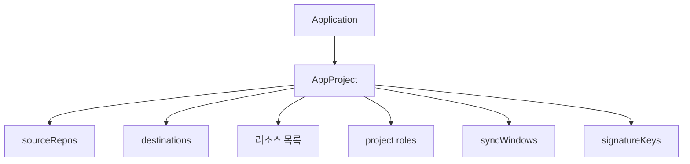

# ArgoCD AppProject와 RBAC

> **AppProject는 ArgoCD의 멀티 테넌시 경계**다. 어떤 Git 리포에서
> 가져올지, 어느 클러스터·네임스페이스로 배포할지, 어떤 리소스 종류를
> 허용할지, **누가 무엇을 할 수 있는지**를 한 CR에서 선언. RBAC은 이 경계
> 위에서 작동하는 **정책 레이어**. AppProject + `argocd-rbac-cm`의
> 두 축을 함께 다뤄야 "프로젝트 분리"가 의미를 갖는다.

- **주제 경계**: 설치·HA는 [ArgoCD 설치](./argocd-install.md).
  Application 스펙은 [ArgoCD App](./argocd-apps.md). 이 글은 **AppProject
  CR과 RBAC 정책**에만 집중
- **현재 기준**: ArgoCD 3.2.10 / 3.3 GA. `sourceNamespaces`, signature
  verification, sync windows 전부 GA. RBAC에서 **scopes에 email 같이
  사용**이 2026 권장

---

## 1. 왜 Project가 필요한가

### 1.1 `default` Project의 위험

ArgoCD는 초기 설치 시 `default` Project를 생성한다. **모든 Git 리포, 모든
클러스터, 모든 namespace, 모든 리소스 종류 허용**. 테스트 환경에서는
편하지만 프로덕션에서는:

- 실수로 `kube-system` namespace 건드림
- 검증되지 않은 fork 리포를 source로 등록 가능
- ClusterRole 같은 고위험 리소스 무제한 생성

**프로덕션 원칙**: `default` Project의 **권한을 전부 제거**하고 팀·환경별
AppProject를 만들어 사용. default를 없애지는 못하지만 sourceRepos·
destinations를 비움으로써 사실상 무력화 가능.

### 1.2 Project가 관장하는 것



- 어떤 Git URL에서 가져올 수 있는가 (`sourceRepos`)
- 어떤 클러스터·namespace로 배포할 수 있는가 (`destinations`)
- 어떤 리소스 종류를 배포할 수 있는가 (`clusterResourceWhitelist`,
  `namespaceResourceBlacklist`)
- 프로젝트 단위 역할 (`roles`)
- 동기 가능 시간대 (`syncWindows`)
- 서명 검증 키 (`signatureKeys`)

---

## 2. AppProject 기본 구조

```yaml
apiVersion: argoproj.io/v1alpha1
kind: AppProject
metadata:
  name: platform
  namespace: argocd
  # 삭제 시 자식 Application 정리 보장
  finalizers:
    - resources-finalizer.argoproj.io
spec:
  description: "Platform Team 공용 프로젝트"

  sourceRepos:
    - https://git.example.com/platform/*
    - https://charts.bitnami.com/bitnami        # Helm chart repo
    - oci://ghcr.io/platform/charts             # OCI chart

  destinations:
    - server: https://kubernetes.default.svc
      namespace: "platform-*"
    - name: prod-a
      namespace: "ingress-system"

  clusterResourceWhitelist:
    - group: rbac.authorization.k8s.io
      kind: ClusterRole
    - group: apiextensions.k8s.io
      kind: CustomResourceDefinition

  namespaceResourceBlacklist:
    - group: ""
      kind: ResourceQuota          # 플랫폼 외 사용자 금지
    - group: ""
      kind: LimitRange

  sourceNamespaces:                 # app-in-any-namespace 허용 ns
    - "platform-*"

  roles:
    - name: ci-deployer
      description: "GitHub Actions runner 용"
      policies:
        - p, proj:platform:ci-deployer, applications, sync, platform/*, allow
        - p, proj:platform:ci-deployer, applications, get,  platform/*, allow
      jwtTokens:
        - iat: 1714000000           # argocd proj role create-token으로 생성
```

### 2.1 `sourceRepos` 패턴

| 패턴 | 의미 |
|---|---|
| `*` | 모든 리포 (기본값, **default Project만**) |
| `https://git.example.com/team-*/*` | 조직 glob |
| `!https://git.example.com/sensitive/*` | 거부 패턴 (deny list) |
| `https://charts.bitnami.com/bitnami` | Helm repo URL |
| `oci://ghcr.io/org/charts` | OCI |

- **거부 패턴은 마지막에**: allow glob 뒤에 `!deny`를 추가해 화이트리스트
  중 일부 제외 표현
- `https://`와 `git@`(SSH) 같은 리포의 두 URL은 **별도 항목**으로 둘 것

### 2.2 `destinations` — server/name + namespace

```yaml
destinations:
  - server: https://kubernetes.default.svc   # URL 직접
    namespace: "prod-*"
  - name: prod-a                              # cluster Secret name
    namespace: "*"                            # 모든 ns
  - name: prod-a
    namespace: "!kube-system"                 # deny
```

- `server`와 `name`은 둘 중 하나만, 둘 다 `"*"`로 전체 허용 가능
- namespace 패턴도 `!` 거부 지원 — `"*"` + `"!kube-system"`로 kube-system만
  제외
- `destinationServiceAccounts` (**alpha**, 3.x 도입): 대상 클러스터에서
  ArgoCD가 어떤 SA로 배포할지 강제 → 최소 권한 적용
  ([App Sync using impersonation](https://argo-cd.readthedocs.io/en/latest/operator-manual/app-sync-using-impersonation/))

```yaml
destinationServiceAccounts:
  - server: https://kubernetes.default.svc
    namespace: platform-prod
    defaultServiceAccount: argocd-deployer    # 해당 ns의 SA
```

Alpha 기능이라 활성화에 controller `--enable-application-set-impersonation`
같은 feature gate 플래그 필요. 프로덕션 전면 도입 전 스테이징 충분 검증.

### 2.3 리소스 화이트/블랙리스트

```yaml
clusterResourceWhitelist:
  - group: "*"
    kind: "*"                    # 모든 cluster-scoped 허용 (default Project 기본)
# 또는 구체적으로
clusterResourceWhitelist:
  - group: apiextensions.k8s.io
    kind: CustomResourceDefinition

namespaceResourceWhitelist: []     # 비어있으면 모두 허용 (암묵 기본)

namespaceResourceBlacklist:
  - group: ""
    kind: ResourceQuota
  - group: ""
    kind: LimitRange
```

**중요 — 기본 동작**:

- **`clusterResourceWhitelist`는 필드 생략 또는 `[]` 둘 다 "전부 차단"**
  (PR #5551로 수정된 이후 일관된 동작). 즉 명시한 것만 허용하는 allow-list
- 반대로 `namespaceResourceWhitelist`가 비어 있으면 **모두 허용**
  (blacklist로 통제하는 모델)
- 따라서 cluster 리소스를 쓸 생각이 없으면 필드를 비우거나 생략,
  쓸 생각이면 명시적으로 허용

3.3에서 **리소스 이름 기반 화이트리스트** 추가 — 특정 이름의 CR만 허용.

```yaml
clusterResourceWhitelist:
  - group: rbac.authorization.k8s.io
    kind: ClusterRole
    resourceNames:                    # 3.3+ 신규 필드 (exact-name 리스트)
      - team-alpha
      - team-beta
```

`resourceNames`는 exact-match 리스트(glob 미지원). 3.3 이전 버전에서
특정 이름 제약이 필요하면 Kyverno/OPA Gatekeeper 등 외부 policy 레이어 필요.

### 2.4 `sourceNamespaces` — app-in-any-namespace와 연결

```yaml
sourceNamespaces:
  - "team-a-*"
  - "team-b"
```

Controller 파라미터 `application.namespaces` 에 포함된 namespace 중
이 Project의 Application이 **실제로 생성될 수 있는 namespace**를 제한.
[ArgoCD App §1.2](./argocd-apps.md) 참조.

---

## 3. syncWindows — 배포 시간 제어

### 3.1 기본 형태

```yaml
syncWindows:
  - kind: allow
    schedule: "0 8 * * 1-5"          # 평일 08시부터
    duration: 10h                     # 10시간 동안
    applications:
      - "*"
    manualSync: true                  # window 밖에도 수동 sync 허용
    timeZone: Asia/Seoul

  - kind: deny
    schedule: "0 20 * * *"            # 매일 20시부터
    duration: 12h                     # 12시간 동안 (다음날 08시까지)
    clusters:
      - prod-*
    namespaces:
      - "*"
    manualSync: false                 # 수동도 차단
    timeZone: UTC
```

### 3.2 매칭 규칙

| 필드 | 매칭 대상 |
|---|---|
| `applications` | Application 이름 패턴 |
| `clusters` | destination cluster 이름/서버 |
| `namespaces` | destination namespace |
| `useAndOperator: true` | 위 세 조건 **AND** (기본 OR) |

평가 순서:

1. **매칭되는 window가 없으면 sync 허용** (기본 open)
2. **deny window가 하나라도 매칭되면 sync 차단**
3. **allow window가 하나라도 정의되어 있으면**, allow 바깥 시간은
   암묵적으로 deny (즉 allow 선언 자체가 "나머지 시간은 금지" 의미)
4. 겹친 여러 allow·deny는 같은 유형끼리 OR

`argocd app sync` 시 window 밖이면 명령 거부 (`manualSync: false` 때).
Auto-sync는 allow window 내에서만 실행.

### 3.3 실제 쓸모

- **프로덕션 배포 동결** (change-freeze) 창문
- **업무 시간 외 자동 배포 차단** (책임자 부재 시 사고 대응 불가)
- **스테이징만 야간 자동 재배포** 허용

---

## 4. signatureKeys — 서명 검증

### 4.1 동기

Git commit이 **악의적으로 바뀌었는지** 검증. 공급망 보안의 최소선.
GPG 서명된 commit/tag만 sync 허용.

### 4.2 설정

```yaml
spec:
  signatureKeys:
    - keyID: ABCDEF1234567890
    - keyID: 0123456789ABCDEF
```

- `keyID`는 GPG 공개키의 16자리 KeyID
- 공개키는 `argocd-gpg-keys-cm` ConfigMap에 등록 (Helm values에 `configs.gpg.keys`)
- 이 Project의 모든 Application은 해당 서명이 확인된 commit/tag만
  source로 사용 가능
- **ArgoCD 내장 GPG 검증은 Git 저장소 기반 소스에만 적용**된다. HTTPS
  Helm chart repo(`https://charts.example.com`)나 OCI registry의
  chart에는 동작하지 않음 (Issue
  [#3833](https://github.com/argoproj/argo-cd/issues/3833) 여전히 open).
  Git 리포에 vendored chart를 두거나, cosign/Kyverno 같은 외부 policy로
  우회

### 4.3 대안 — Sigstore / cosign

GPG는 키 관리가 번거롭다. **cosign + Rekor**(Sigstore) 기반 서명은
키리스(keyless) 모드로 단순. 다만 ArgoCD 본체는 GPG 우선 지원, Sigstore
연동은 [ArgoCD 고급](./argocd-advanced.md)에서 CMP·Kyverno Policy 등
외부 도구와 결합.

---

## 5. Project Roles와 JWT

### 5.1 왜 필요한가

CI 파이프라인에서 `argocd app sync platform/myapp` 한 번만 치려고
**개인 SSO 토큰을 공유**하면 감사 불가. Project Role + JWT로 범위 제한된
토큰을 발급.

### 5.2 역할 정의

```yaml
roles:
  - name: ci-deployer
    description: "GitHub Actions, service account for CI"
    policies:
      - p, proj:platform:ci-deployer, applications, sync, platform/*, allow
      - p, proj:platform:ci-deployer, applications, get,  platform/*, allow
      - p, proj:platform:ci-deployer, applications, action/*, platform/*, allow
    groups:                        # SSO 그룹 연결 (선택)
      - platform-admins
```

- 역할 이름은 project 범위에서 유일. **subject 표기**: `proj:<project>:<role>`
- `policies`는 argocd-rbac-cm과 동일한 CSV 형식
- `groups` 필드로 SSO 그룹 매핑 — 토큰 없이 SSO 로그인만으로 역할 부여

### 5.3 JWT 발급과 폐기

```bash
# 토큰 생성
argocd proj role create-token platform ci-deployer \
  --expires-in 90d -o token

# 발급된 토큰 목록 확인 (iat는 Unix timestamp)
argocd proj role get platform ci-deployer

# 특정 토큰 폐기 — iat 값을 그대로 인자로
argocd proj role delete-token platform ci-deployer 1714000000

# 파이프라인에서 사용
argocd --auth-token $TOKEN app sync platform/myapp
```

- 토큰은 **만료 필수**. "expires-in 없음"(`0`) 금지
- 폐기는 **해당 토큰의 `iat` (issued-at Unix timestamp)** 인자로 — 먼저
  `role get`으로 확인 필요
- 감사 로그에 `iat` 기반 토큰 구분 가능 → rotation 전후 비교 용이

### 5.4 토큰 관리 패턴

| 패턴 | 방식 |
|---|---|
| 고정 CI 파이프라인 | 90일 만료 토큰 + Vault 저장 + 자동 rotation |
| 임시 파이프라인 | Kubernetes ServiceAccount 토큰 projection + OIDC → JWT |
| 개발자 실험 | 개인 SSO, 토큰 발급 금지 |

**2026 실전 패턴**: ArgoCD는 GitHub OIDC Federation을 네이티브 STS 교환
으로 직접 지원하지 않는다. 실제 구현은 **OIDC broker**(예: Dex,
OAuth2-Proxy, 사내 STS-proxy)를 두고 GitHub OIDC 토큰 → broker에서 검증 →
ArgoCD 로그인 토큰 교환. 장기 토큰 제거가 목표면 이 proxy 레이어를
먼저 설계해야 한다.

---

## 6. 글로벌 RBAC — argocd-rbac-cm

### 6.1 두 레이어

| 레이어 | 대상 |
|---|---|
| `argocd-rbac-cm` (ConfigMap) | 글로벌 — admin·클러스터 관리자 |
| AppProject `roles` | Project 범위 — 팀별 자체 관리 |

글로벌이 먼저, 다음에 Project. **Project 관리자에게 `roles` 수정만 허용**
하고 글로벌은 플랫폼 팀이 잠그는 구조가 표준.

### 6.2 정책 CSV 문법

```csv
# argocd-rbac-cm의 policy.csv
p, subject, resource, action, object, effect
g, subject, inherited-role-or-group
```

| 필드 | 예시 |
|---|---|
| `subject` | `role:admin`, `alice@example.com`, `platform-team` |
| `resource` | `applications`, `applicationsets`, `projects`, `clusters`, `repositories`, `certificates`, `accounts`, `gpgkeys`, `exec`, `logs` |
| `action` | `get`, `create`, `update`, `delete`, `sync`, `override`, `action/*`, `*` |
| `object` | `<project>/<app>`, `<project>/*`, `*/*` |
| `effect` | `allow`, `deny` |

- `applicationsets`: ApplicationSet CR 접근 — 개발자에게 Application은
  허용하되 ApplicationSet은 제한하는 분리가 실무 표준
- `exec`: `argocd app exec`(Pod에 sh 진입) 권한. 장애 대응에 편리하지만
  **사실상 원격 코드 실행** 표면이라 deny 기본이 안전
- `logs`: Pod 로그 조회 — 읽기 권한 필요 시 명시적으로 allow

**Project-scoped group binding** (2.14+) — 글로벌 RBAC CSV에서 그룹을
특정 Project의 역할에만 바인딩:

```csv
g, platform-admins, role:team-admin, team-alpha
```

"이 그룹은 team-alpha Project의 `team-admin` 역할만" 의미. 멀티 테넌시
에서 글로벌 role이 불가능한 경우의 표준 대안.

### 6.3 전형적 정책

```yaml
# argocd-rbac-cm (Helm: configs.rbac)
configs:
  rbac:
    scopes: "[groups, email]"
    policy.default: role:readonly
    policy.csv: |
      # 플랫폼 팀 — 전체 admin
      p, role:platform-admin, *, *, *, allow
      g, platform-admins, role:platform-admin

      # 개발 팀 — 해당 Project만
      p, role:dev, applications, *, dev/*, allow
      p, role:dev, applications, create, dev/*, allow
      p, role:dev, applications, action/*, dev/*, allow
      p, role:dev, projects, get, dev, allow
      g, dev-team@example.com, role:dev

      # 전체 read-only (감사)
      p, role:auditor, *, get, *, allow
      g, auditor-team, role:auditor

      # 위험한 액션 차단
      p, role:dev, applications, override, *, deny
      p, role:dev, exec, create, */*, deny
      p, role:dev, clusters, *, *, deny
```

### 6.4 `policy.default`

미매칭 시 기본 역할. 운영 원칙:

| 값 | 특성 |
|---|---|
| `""` (거부) | 가장 엄격. 단 UI 일부 페이지에서 렌더링 실패·리다이렉트 루프 유발 사례 있어 운영 난이도 상승 |
| `role:readonly` | 관람 허용. 대부분의 팀이 선택하는 실무 기본 |
| `role:admin` | **절대 금지** |

**우선순위와 중복 바인딩**: 사용자에 대한 권한 평가는 글로벌 RBAC →
AppProject roles 순으로 합산. 둘 다 allow면 allow, 어느 쪽이든 deny가
있으면 deny 우선. 같은 사람·같은 리소스에 대해 "예상치 못한 권한"이
생기는 경우 대부분 글로벌과 Project 양쪽 중복 바인딩이 원인.

### 6.5 `scopes` 필드

```yaml
scopes: "[groups, email]"      # 2026 권장
```

OIDC JWT의 어떤 claim을 subject로 사용할지. 기본 `[groups]`만인데,
groups가 비어 있는 조직은 email 기반이 필요. `email`을 추가하면
`g, alice@example.com, role:dev` 같이 개별 사용자 매핑 가능.

### 6.6 정책 분할 — `policy.<name>.csv`

단일 `policy.csv`가 수천 줄이 되면 리뷰·진단이 괴롭다. 2.8+부터는
추가 키로 분할 가능.

```yaml
configs:
  rbac:
    policy.csv: |                    # 플랫폼 팀 공통
      p, role:platform, ...
    policy.team-alpha.csv: |          # 팀별
      p, role:team-alpha, applications, *, alpha/*, allow
    policy.team-beta.csv: |
      p, role:team-beta, applications, *, beta/*, allow
```

팀별 별도 ConfigMap·Secret을 Kustomize로 병합하는 식의 GitOps 운영이
가능해짐.

### 6.7 검증 명령

```bash
# 특정 사용자가 특정 액션을 할 수 있는지
argocd admin settings rbac can alice@example.com sync applications/dev/myapp

# 전체 역할 테이블
argocd admin settings rbac validate
```

**CI에 `rbac validate`를 넣어** 정책 실수(문법 오류, 순환 참조)를
머지 전에 잡아야 한다.

---

## 7. SSO 통합 — OIDC Groups Mapping

### 7.1 scopes와 groups

OIDC IdP는 사용자 로그인 시 JWT에 `groups` claim을 실을 수 있다.
ArgoCD는 scope 설정에 따라 이를 읽어 정책 매칭에 사용.

```yaml
# argocd-cm
oidc.config: |
  name: Okta
  issuer: https://example.okta.com
  clientID: 0oa...
  clientSecret: $oidc.okta.clientSecret
  requestedScopes: ["openid", "profile", "email", "groups"]
  requestedIDTokenClaims:
    groups:
      essential: true
```

IdP 쪽에서 **`groups` claim에 해당 조직 그룹을 실어주도록** 설정.
Okta · Azure AD · Google Workspace · Keycloak 모두 동일 패턴.

### 7.2 그룹 이름 네임스페이싱

대규모 조직에서는 그룹이 수천 개. `dev-team` 같은 짧은 이름은 충돌 가능.
**`<org>:<team>:<role>`** 같은 prefix 관례 정착.

```text
acme:platform:admins
acme:team-alpha:developers
acme:auditor
```

정책 파일도 읽기 쉬워진다:

```csv
g, acme:platform:admins, role:platform-admin
g, acme:team-alpha:developers, role:team-alpha-dev
```

### 7.3 GitHub/GitLab OAuth 직접 (Dex 경유)

OIDC가 없거나 제한적인 경우 Dex connector를 사용. 상세는
[ArgoCD 설치 §7](./argocd-install.md). GitHub의 경우 `orgs.teams`가
JWT `groups`에 `org:team-slug` 형태로 실린다.

---

## 8. Global Projects — 공통 정책 상속

### 8.1 동기

팀별 AppProject를 수십 개 만들면 "**모든 Project는 `kube-system`
namespace로 배포 금지**" 같은 공통 규칙을 반복 작성. 유지보수 악몽.

### 8.2 선언

```yaml
# argocd-cm
globalProjects: |
  - projectName: default-safety
    labelSelector:
      matchExpressions:
        - {key: env, operator: Exists}
```

`env` 라벨이 있는 모든 AppProject가 `default-safety` Project의 필드를
상속. 상속되는 필드는 **7개**:

| 필드 | 비고 |
|---|---|
| `sourceRepos` | 둘 다 통과해야 사용 가능 (AND) |
| `destinations` | AND |
| `clusterResourceWhitelist` | AND |
| `clusterResourceBlacklist` | 합집합 deny |
| `namespaceResourceWhitelist` | AND |
| `namespaceResourceBlacklist` | 합집합 deny |
| `syncWindows` | 합집합 평가 |

`roles`는 **상속되지 않는다**. baseline Project에 roles를 넣어도 자식은
참조 못 함.

```yaml
# 상속용 baseline Project
apiVersion: argoproj.io/v1alpha1
kind: AppProject
metadata:
  name: default-safety
  namespace: argocd
spec:
  namespaceResourceBlacklist:
    - {group: "", kind: ResourceQuota}
    - {group: "", kind: LimitRange}
  destinations:
    - {server: '*', namespace: '!kube-system'}
```

### 8.3 주의

- Allow-list 필드(sourceRepos·destinations·*Whitelist)는 **baseline과
  자식 둘 다 통과(AND)해야** 허용. 자식에서 baseline보다 넓히지 못함
- Deny-list 필드(*Blacklist)는 **합집합 deny** — baseline 금지 + 자식
  금지 모두 반영
- Application의 `project` 필드가 상속 Project를 가리키면 안 됨 —
  baseline은 **오직 상속용**

---

## 9. 정책·Project 안티패턴

| 안티패턴 | 왜 문제 | 교정 |
|---|---|---|
| `default` Project를 일상 사용 | 모든 리포·클러스터·ns 허용 | default는 비우고 팀별 Project |
| `policy.default: role:admin` | 미매칭 시 관리자 권한 | `""` 또는 `role:readonly` |
| `*/*, *, *, allow` policy 남발 | 사실상 admin | 필요 action만 |
| 개인 SSO 토큰을 CI에 주입 | 감사 불가, 유출 위험 | Project JWT + 만료 |
| 만료 없는 JWT (`--expires-in 0`) | 유출 시 영구 권한 | 최대 90일 |
| `clusterResourceWhitelist: []` 생략 | 버전별 기본값 혼란 | 필드 명시 + 비움/허용 구체화 |
| 서명 검증 없이 Git 내용 신뢰 | 공급망 공격 | `signatureKeys` 또는 OPA |
| syncWindows 없이 자동 sync on 24/7 | 야간 장애 대응 불가 | deny window로 야간 자동 sync 차단 |
| namespace `*` 허용 + `!kube-system` 의존 | 실수로 kube-system 터치 | 명시적 `platform-*` 식 allowlist |
| RBAC CSV 단일 파일 수천 줄 | 리뷰·디버깅 난해 | `policy.<team>.csv` 분할 |
| SSO `scopes: [groups]`만 | groups 없는 IdP에서 막힘 | `scopes: [groups, email]` |
| Project role `groups` 사용 후 SSO 그룹 정책 미확인 | 인가 누락·초과 | `rbac can` 검증 CI |
| Global Project의 baseline을 직접 Application에 연결 | 정책 의도 이탈 | baseline은 상속 전용 |

---

## 10. 도입 로드맵

1. **default Project 비우기** — sourceRepos·destinations 모두 `""`
2. **팀별 AppProject 생성** — sourceRepos·destinations 최소 허용
3. **namespaceResourceBlacklist** — ResourceQuota, LimitRange 방어
4. **clusterResourceWhitelist** — CRD만 명시 허용부터
5. **Application `project` 필드** 전부 팀 Project로 이동
6. **argocd-rbac-cm** 분할 — `policy.csv` + team별 csv
7. **SSO groups 매핑** — Okta/Azure AD에서 groups claim 설정
8. **Project roles + JWT** — CI 파이프라인 토큰 제한
9. **syncWindows** — 프로덕션 change-freeze 도입
10. **signatureKeys** — 서명된 commit/tag만 허용
11. **globalProjects** — 공통 deny baseline 상속

---

## 11. 관련 문서

- [ArgoCD 설치](./argocd-install.md) — SSO, Dex, Ingress
- [ArgoCD App](./argocd-apps.md) — Application, ApplicationSet,
  sourceNamespaces
- [ArgoCD Sync](./argocd-sync.md) — Sync 옵션, hooks
- [ArgoCD 고급](./argocd-advanced.md) — Sigstore·Kyverno 통합
- [ArgoCD 운영](./argocd-operations.md) — 업그레이드·백업

---

## 참고 자료

- [Projects — User Guide](https://argo-cd.readthedocs.io/en/stable/user-guide/projects/) — 확인: 2026-04-24
- [Project Specification Reference](https://argo-cd.readthedocs.io/en/stable/operator-manual/project-specification/) — 확인: 2026-04-24
- [RBAC Configuration](https://argo-cd.readthedocs.io/en/stable/operator-manual/rbac/) — 확인: 2026-04-24
- [argocd-rbac-cm example](https://argo-cd.readthedocs.io/en/stable/operator-manual/argocd-rbac-cm-yaml/) — 확인: 2026-04-24
- [User Management & SSO](https://argo-cd.readthedocs.io/en/stable/operator-manual/user-management/) — 확인: 2026-04-24
- [Declarative Setup](https://argo-cd.readthedocs.io/en/stable/operator-manual/declarative-setup/) — 확인: 2026-04-24
- [Sync Windows](https://argo-cd.readthedocs.io/en/stable/user-guide/sync_windows/) — 확인: 2026-04-24
- [Signed GPG Keys](https://argo-cd.readthedocs.io/en/stable/user-guide/gpg-verification/) — 확인: 2026-04-24
- [Argo CD Privilege Escalations](https://szabo.jp/2021/05/19/argo-cd-privilege-escalations/) — 확인: 2026-04-24
- [App Sync using impersonation](https://argo-cd.readthedocs.io/en/latest/operator-manual/app-sync-using-impersonation/) — 확인: 2026-04-24
- [Issue #3833 — Helm chart GPG verification](https://github.com/argoproj/argo-cd/issues/3833) — 확인: 2026-04-24
- [PR #5551 — clusterResourceWhitelist empty behavior](https://github.com/argoproj/argo-cd/pull/5551) — 확인: 2026-04-24
