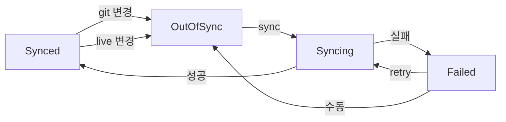
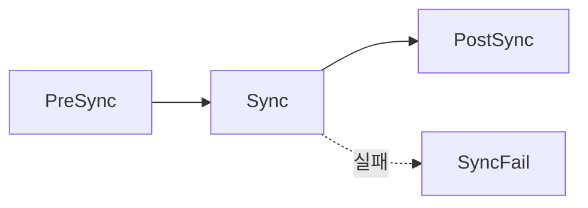

# ArgoCD Sync

> **Sync는 ArgoCD가 실제로 클러스터를 바꾸는 순간**이다. Application은
> "이래야 한다"는 선언이고, Sync는 그 선언을 실제 `kubectl apply` 상당
> 연산으로 **밀어넣는** 행위. auto-sync, self-heal, prune, hooks,
> ServerSideApply, retry — 각각이 프로덕션 장애의 경계선. 이 글은 Sync의
> 동작 모델, 3단계 phase, 20여 가지 SyncOptions, hook 종류와 delete-policy,
> 실패 시 재시도까지 실무 깊이로 정리한다.

- **주제 경계**: Application CR 스펙은 [ArgoCD App](./argocd-apps.md).
  `syncWindows`(시간대 제어)는 [ArgoCD 프로젝트](./argocd-projects.md).
  Progressive Sync(RollingSync)는 App 글 §10. **SLO·에러 버짓 기반
  자동 롤백은 SRE 카테고리** — 여기는 "도구 메커니즘"에만 집중
- **현재 기준**: ArgoCD 3.2.10 / 3.3 GA. **ServerSideApply=true가
  2026 권장 기본**. Auto-sync의 `automated.enabled`는 3.2 신규

---

## 1. Sync의 3가지 상태

### 1.1 상태 머신



| 상태 | 의미 |
|---|---|
| `Synced` | Git = Live, 아무 할 일 없음 |
| `OutOfSync` | Git ≠ Live, sync 필요 |
| `Syncing` | 현재 apply 진행 중 |
| `Failed` / `Error` | apply 실패 |
| `Unknown` | 대상 cluster 접근 불가 등 |

### 1.2 Health와 Sync는 별개

- **Sync**: manifest를 apply했는가
- **Health**: 리소스가 실제로 정상인가 (Pod Ready, Deployment Available)

둘 다 Green이어야 "배포 성공". Sync=Synced여도 Deployment가 CrashLoopBackOff
면 `Health=Degraded`. Health 판정은 리소스 타입별 룰(Pod, Deployment,
Service, 커스텀 CRD) + Lua script 커스터마이즈 — 공식 문서의
[Resource Health Assessment](https://argo-cd.readthedocs.io/en/stable/operator-manual/health/).

---

## 2. Sync 트리거 방식

### 2.1 4가지 경로

| 경로 | 주체 | 트리거 |
|---|---|---|
| **Manual** | 사용자 | `argocd app sync`, UI 버튼 |
| **Auto-sync** | Controller | reconcile 루프가 OutOfSync 감지 |
| **Webhook** | Git → ArgoCD | Git push가 즉시 감지 |
| **API** | CI/CD | gRPC/HTTPS 외부 시스템 |

### 2.2 Reconcile 주기

Auto-sync는 polling + event. 기본 주기:

| 파라미터 | 기본값 | 의미 |
|---|---|---|
| `timeout.reconciliation` | 180s | Git polling 주기 (대규모는 5~10m) |
| `timeout.hard.reconciliation` | 0 (off) | 캐시 무시 강제 reconcile |
| `timeout.health.reconciliation` | 0 | Health만 재계산 주기 |

대규모 환경에서는 180초 주기가 Git provider rate limit에 가깝다 — **webhook
전환 + polling 주기 늘리기** 조합이 2026 표준 ([ArgoCD 설치 §4.5](./argocd-install.md)).

### 2.3 Webhook 연결

Git provider → ArgoCD HTTP endpoint로 이벤트 푸시. polling 지연을
제거하고 rate limit 절감.

```bash
# GitHub Webhook
POST https://argocd.example.com/api/webhook
Content-Type: application/json
X-GitHub-Event: push
X-Hub-Signature-256: sha256=...
```

Secret은 `argocd-secret.webhook.github.secret`. GitLab, Bitbucket, Azure
DevOps, Gogs, Gitea 지원. 구성 상세는
[ArgoCD 운영](./argocd-operations.md).

---

## 3. `syncPolicy.automated` — 자동화의 심장

### 3.1 기본 형태

```yaml
syncPolicy:
  automated:
    enabled: true               # 3.2+ 명시 활성 (기본 true)
    prune: true
    selfHeal: true
    allowEmpty: false
```

| 필드 | 기본 | 의미 |
|---|---|---|
| `enabled` | `true` | Auto-sync on/off (3.2 명시 플래그) |
| `prune` | `false` | Git에서 사라진 리소스를 live에서도 삭제 |
| `selfHeal` | `false` | 외부가 live 수정 시 Git 기준으로 복원 |
| `allowEmpty` | `false` | Git에 리소스 0개여도 sync 허용 (모든 것을 지울 수 있음) |

### 3.2 `prune` — 양날의 검

**왜 위험**: Git에서 YAML 하나 삭제 → 운영 중 워크로드 즉시 제거.
Kustomize overlay 편집 실수로 "몇 초 만에 모든 것이 사라지는" 사고가
대표적.

**안전 장치**:

1. 변경 PR 리뷰·코드 오너 규칙
2. `allowEmpty: false` — **리소스가 0개가 되면 sync 거부**
3. `Prune=false` annotation으로 개별 리소스 보호
4. `PruneLast=true` — 다른 apply 성공 후에만 삭제 진행
5. `PrunePropagationPolicy=foreground` (기본) — 자식까지 정리 확인
6. **`Prune=confirm` / `Delete=confirm` (2.14+)** — 수동 승인 단계

```yaml
# 리소스 수준 prune 제외
metadata:
  annotations:
    argocd.argoproj.io/sync-options: Prune=false
```

### 3.2.1 `Prune=confirm` / `Delete=confirm` — 2026 핵심 안전장치

Git에서 리소스가 사라져도 ArgoCD가 **즉시 삭제하지 않고 수동 승인을
대기**. 실무의 prune 사고를 막는 가장 강력한 장치.

```yaml
syncPolicy:
  syncOptions:
    - Prune=confirm          # 삭제 대상은 대기 상태로 표시
    - Delete=confirm         # Application 삭제 시에도 승인 대기
```

승인은 리소스 annotation으로:

```bash
# 특정 리소스만 삭제 허용
kubectl annotate deployment my-app \
  argocd.argoproj.io/deletion-approved='2026-04-24T10:00:00Z'

# 또는 Application의 PruneConfirm 상태에서 UI/CLI로 승인
argocd app confirm-deletion my-app
```

- 대규모 자동화 환경에서 **"저지선"** 역할
- production/staging에만 선택적 적용 (dev는 `confirm` 없이 즉시)
- CI 자동화와 충돌 — pause 상태가 파이프라인 어딘가에서 감지·승인돼야 함

### 3.3 `selfHeal` — drift 수렴

외부 도구(`kubectl edit`, HPA, injector)가 live를 바꾸면 Git 기준으로
다시 원복. **의도된 drift를 막는 강력한 거버넌스**지만 HPA·cert-manager
같은 합법적 live 수정과 충돌.

해결: **`ignoreDifferences` + `RespectIgnoreDifferences=true`**
([ArgoCD App §5](./argocd-apps.md)).

- `selfHeal: true` + `RespectIgnoreDifferences=true`: HPA가 관리하는
  replicas는 selfHeal이 건드리지 않음
- `argocd-application-controller`의 `--self-heal-timeout-seconds`
  (기본 5초) 동안 selfHeal 완료. 반복 루프 방지
- Helm values에서는 `configs.params`의 **`controller.self.heal.timeout.seconds`**
  키로 설정. ConfigMap 반영이 안 되면 Pod 재시작으로 강제 재로드
  (Issue [#10924](https://github.com/argoproj/argo-cd/issues/10924) 참고)

### 3.4 `enabled: false`로 임시 비활성

3.2+에서는 automated 블록을 유지한 채 `enabled: false`로 자동화 중지
가능 (과거처럼 automated 블록을 삭제할 필요 없음).

```yaml
automated:
  enabled: false           # 핫픽스 동안 수동 모드
  prune: true
  selfHeal: true
```

**⚠️ ApplicationSet 관리 Application 제약**: ApplicationSet이 생성한
자식 Application의 `spec.syncPolicy.automated`를 직접 수정해도 **ApplicationSet이
즉시 덮어쓴다**. 핫픽스로 enabled=false를 기대하면 실패. 해결:

1. ApplicationSet 자체의 template에서 `enabled`를 값으로 받아 분기
2. ApplicationSet에 `syncPolicy.applicationsSync: create-only`로
   수정 권한을 자식에게 이양 ([App 글 §11.2](./argocd-apps.md))
3. 긴급 시 ApplicationSet 일시 삭제 + `preserveResourcesOnDeletion: true`

---

## 4. Sync의 3단계 phase

### 4.1 PreSync → Sync → PostSync



| Phase | 목적 | 예시 |
|---|---|---|
| **PreSync** | 배포 전 준비 | DB migration, 백업 |
| **Sync** | 본 apply | Deployment, Service |
| **PostSync** | 배포 후 검증 | smoke test, 알림 |
| **SyncFail** | 실패 시 정리 | 롤백 트리거, 알림 |

각 phase 내에서 **sync-wave(정수)로 순서 제어** — [ArgoCD App §6](./argocd-apps.md).

### 4.2 단계 간 규칙

- **PreSync 실패 시 Sync 자체가 시작 안 됨**. 애플리케이션 리소스는
  건드리지 않음
- **Sync phase의 모든 리소스가 Healthy 될 때까지 PostSync 대기**
- PostSync 실패는 전체 sync를 fail로 만든다
- SyncFail은 **Sync phase 실패 시에만** 실행 (PreSync/PostSync 실패는 안 감)

---

## 5. Resource Hooks

### 5.1 선언

```yaml
apiVersion: batch/v1
kind: Job
metadata:
  generateName: db-migrate-
  annotations:
    argocd.argoproj.io/hook: PreSync
    argocd.argoproj.io/hook-delete-policy: HookSucceeded
    argocd.argoproj.io/sync-wave: "-10"
spec:
  template:
    spec:
      containers:
        - name: migrate
          image: myapp:migration
          command: ["./migrate.sh"]
      restartPolicy: Never
```

- `hook`: `PreSync`, `Sync`, `PostSync`, `SyncFail` (콤마 구분 다중) —
  phase 값
- **`Skip`은 특수 값**: phase가 아니라 "이 리소스를 sync 대상에서 완전히
  제외" (apply·diff·추적 모두 skip)
- `hook-delete-policy`: 언제 hook 리소스를 삭제할지
- `generateName` 권장 — 매 sync마다 새 이름 (동일 이름 재사용 시 충돌)

### 5.2 `hook-delete-policy`

| 정책 | 동작 |
|---|---|
| `HookSucceeded` | 성공 시 삭제 (실패는 보존, 디버깅용) |
| `HookFailed` | 실패 시 삭제 |
| `BeforeHookCreation` | 다음 sync 시작 시 기존 hook 삭제 후 재생성 (**annotation 없으면 기본**) |

조합 가능: `HookSucceeded,BeforeHookCreation`.

**권장 기본**: `BeforeHookCreation,HookSucceeded`. 실패만 남겨 디버깅 가능.
annotation을 아예 생략해도 암묵적으로 `BeforeHookCreation`이 적용되지만,
의도가 명확하도록 명시 권장.

### 5.3 `Sync` hook vs 일반 리소스

일반 manifest를 `hook: Sync`로 선언하면 ArgoCD가 **Sync phase에 별도
처리** — wave·health 추적 방식이 약간 달라짐. 대부분 필요 없고, **Job은
PreSync/PostSync**, 나머지는 hook annotation 없이 두는 게 표준.

### 5.4 PreSync Job의 함정

```yaml
# 흔한 실수 — Job 이름 고정
metadata:
  name: db-migrate       # ❌ 두 번째 sync에서 "AlreadyExists"
```

- Job은 재실행 불가 (완료된 Job은 변경 불가)
- `generateName` + `BeforeHookCreation` 조합이 정답
- 또는 Job 자체를 삭제하지 않고 **Helm chart의 `hook-weight`로
  chart-level control** 활용

### 5.5 SyncFail hook 예시

```yaml
apiVersion: batch/v1
kind: Job
metadata:
  generateName: rollback-notify-
  annotations:
    argocd.argoproj.io/hook: SyncFail
    argocd.argoproj.io/hook-delete-policy: HookSucceeded
spec:
  template:
    spec:
      containers:
        - name: notify
          image: curlimages/curl
          command:
            - sh
            - -c
            - 'curl -X POST $SLACK_URL -d "Sync failed for $ARGOCD_APP_NAME"'
```

SRE 관점에서는 **자동 롤백 트리거보다 알림·runbook 링크 게시**가 안전.
자동 롤백은 Argo Rollouts의 AnalysisRun으로 정밀 제어.

### 5.6 PreDelete Hooks (3.3+)

3.3에서 **Application 삭제 시 실행되는 hook** 추가. 영구 리소스(PV,
외부 DB) 정리 로직을 선언적으로 표현.

```yaml
metadata:
  annotations:
    argocd.argoproj.io/hook: PreDelete
```

상세는 [ArgoCD 고급](./argocd-advanced.md).

---

## 6. SyncOptions — 20여 가지 옵션

### 6.1 전역 vs 리소스 scope

```yaml
# Application 전역 (syncPolicy)
syncPolicy:
  syncOptions:
    - CreateNamespace=true
    - ServerSideApply=true

# 리소스별 (annotation)
metadata:
  annotations:
    argocd.argoproj.io/sync-options: SkipDryRunOnMissingResource=true,Replace=true
```

### 6.2 핵심 옵션 (2026 권장 기본)

| 옵션 | 기본 | 권장 | 효과 |
|---|---|---|---|
| `CreateNamespace=true` | off | **on** | destination ns 자동 생성 |
| `ServerSideApply=true` | off | **on** | kubectl apply --server-side |
| `ServerSideDiff=true` | off | **on** | managed-fields 기반 정확한 diff (3.x GA) |
| `ApplyOutOfSyncOnly=true` | off | **on (대규모)** | Synced 리소스 재apply 생략 |
| `RespectIgnoreDifferences=true` | off | **on (selfHeal 쓸 때)** | ignore 필드 sync도 skip |
| `PruneLast=true` | off | **on** | 다른 apply 후 prune |
| `PrunePropagationPolicy=foreground` | **foreground** | foreground 유지 | 자식까지 대기하며 삭제 |
| `Prune=confirm` | off | **on (prod)** | 삭제 대기, 수동 승인 필요 (2.14+) |
| `Delete=confirm` | off | **on (prod)** | Application 삭제 승인 (2.14+) |
| `Validate=false` | off | off | kubectl dry-run 스킵 (느릴 때만) |
| `Replace=true` | off | off | `kubectl replace` — 불변 필드 변경 시만 |
| `FailOnSharedResource=true` | off | **on** | 다른 Application이 관리하는 리소스 sync 거부 |
| `SkipDryRunOnMissingResource=true` | off | on (CRD 의존) | CRD 미설치 시 dry-run skip |
| `SkipSchemaValidation=true` | off | off | OpenAPI schema 검증 생략 (CRD 호환 문제 시만) |

**CLI 전용 플래그** (syncOptions 아님):

- `argocd app sync --force` — `kubectl apply --force` 상당, 필드 소유권
  충돌 강제 해소. 표준 SyncOption `Force=true`는 존재하지 않으며
  ([gitops-engine #414](https://github.com/argoproj/gitops-engine/issues/414)
  enhancement 요청 상태), CLI 플래그로만 사용

**`managedNamespaceMetadata` 조합**: `CreateNamespace=true`와 함께
namespace 라벨·annotation을 선언적으로 주입 (예: `istio-injection=enabled`).
[ArgoCD App §4](./argocd-apps.md) 참조.

### 6.3 ServerSideApply — 2026 권장

**Client-side apply (CSA)의 한계**:

- 3-way merge를 annotation `last-applied-configuration`에 저장 → 1MB 넘는
  리소스는 annotation이 터짐
- 여러 controller가 같은 필드를 쓰면 덮어쓰기 경합

**SSA의 이점**:

- Managed fields로 **필드 소유권 추적**
- HPA + ArgoCD 같은 협력이 자연스러움
- 1MB 제한 없음

**주의**:

- 일부 리소스(Secret, Service Account 등)에서 field ownership 경합 발생
  가능
- `RespectIgnoreDifferences` + `ServerSideApply` 조합이 가장 깔끔
- 3.x에서도 기본 off — 명시적으로 `ServerSideApply=true` 설정 필요
- rollback 시 syncPolicy에서 SSA 옵션이 제거되는 이슈
  ([#20183](https://github.com/argoproj/argo-cd/issues/20183))

### 6.4 `ApplyOutOfSyncOnly` — 대규모 필수

기본은 **매 sync마다 모든 리소스 apply**. 1000개 리소스면 그만큼
API call. OutOfSync 표시된 것만 apply로 API 호출량 크게 감소.

- Helm chart 전체 재apply 방지
- 대규모 ApplicationSet (수백 App) 환경에서 controller API burst 완화

### 6.5 `FailOnSharedResource` — 중복 관리 방지

같은 리소스를 두 Application이 동시에 관리하려 할 때 자동 감지.
하나는 Git에, 하나는 다른 리포에 같은 Deployment가 선언됐는지 확인.

- 기본 off (조용히 마지막 sync가 이김)
- on이면 **충돌 감지 시 sync 전체 거부** → 사고 전 단계에서 차단

### 6.6 `PrunePropagationPolicy`

Kubernetes `metadata.deletionPropagation` 옵션과 동일. **ArgoCD 기본은
`foreground`** (공식 문서 기준).

| 값 | 동작 |
|---|---|
| `foreground` (**기본**) | 자식까지 전부 삭제 완료 후 부모 삭제 |
| `background` | 부모 즉시 삭제, 자식은 GC가 정리 — 빠르지만 ghost 가능 |
| `orphan` | 자식을 고아로 남김 |

**권장**: 기본값 `foreground` 유지. `background`는 대규모 StatefulSet
삭제 등 긴 시간이 걸려 CI 타임아웃을 막고 싶을 때 제한적으로.

### 6.7 리소스별 annotation

annotation으로 **특정 리소스에만** 옵션 지정.

```yaml
metadata:
  annotations:
    argocd.argoproj.io/sync-options: Prune=false,Replace=true
    argocd.argoproj.io/compare-options: IgnoreExtraneous
```

| annotation | 의미 |
|---|---|
| `sync-options` | Sync 시 옵션 (콤마 구분) |
| `compare-options: IgnoreExtraneous` | 이 리소스가 외부 추가되어도 OutOfSync로 표시 안 함 |
| `Sync=None` (hook) | sync 대상에서 제외 |
| `argocd.argoproj.io/sync-wave` | 단계 순서 |

---

## 7. Finalizer와 삭제 동작

### 7.1 `resources-finalizer.argoproj.io`

Application CR에 붙이면 **Application 삭제 시 live 리소스도 함께 삭제**.

```yaml
metadata:
  finalizers:
    - resources-finalizer.argoproj.io
```

- 없으면 Application만 지워지고 live 리소스는 남음 (orphan)
- 있으면 cascade 삭제 (foreground propagation)
- **App-of-Apps에서 cascade 함정**은 [ArgoCD 설치 §9.1.1](./argocd-install.md)

### 7.2 삭제 시 순서

1. Application CR에 `deletionTimestamp` 설정
2. Controller가 finalizer 처리 시작
3. live 리소스 삭제 (propagation policy 적용)
4. 모든 리소스 삭제 완료 후 finalizer 제거
5. Application CR 최종 삭제

삭제가 안 끝날 때 흔한 원인:

- 자식 리소스의 finalizer가 pending (예: PV-PVC 정리 대기)
- kubectl의 RBAC 부족으로 Controller가 삭제 명령 실패
- CRD 자체가 제거되어 CR 삭제 불가

**긴급 탈출**: `kubectl patch app <name> -p '{"metadata":{"finalizers":null}}' --type=merge`
— 단 live 리소스는 orphan이 됨.

---

## 8. Retry 전략

### 8.1 `syncPolicy.retry`

```yaml
syncPolicy:
  retry:
    limit: 5                         # 최대 시도 횟수
    backoff:
      duration: 5s                   # 첫 대기
      factor: 2                      # 지수 증가
      maxDuration: 3m                # 최대 대기
```

동작: 실패 시 `duration * factor^attempt` 간격으로 재시도, `maxDuration`
상한. 5·10·20·40·80초 → 3m.

### 8.2 Retry가 잡는 것 / 못 잡는 것

| 실패 유형 | Retry 유효 |
|---|---|
| API 일시 장애 (429, 5xx) | ✔ |
| 네트워크 순간 끊김 | ✔ |
| webhook admission 일시 실패 | ✔ |
| manifest 문법 오류 | ✖ |
| RBAC 부족 | ✖ |
| 리소스 충돌 | ✖ (선언 수정 필요) |

반복 failure는 retry로 가리지 말고 근본 원인 수정. `limit`은 보통 3~5
권장, 너무 크면 장애 시 로그·알림 폭주.

### 8.3 수동 재시도·관측

```bash
# 명령 재시도
argocd app sync my-app --retry-limit 3 --retry-backoff-duration 10s

# 이벤트 관찰
argocd app history my-app
argocd app get my-app --show-operation
```

---

## 9. Diff와 OutOfSync 원인 진단

### 9.1 진단 절차

```bash
# 1. 현재 상태 요약
argocd app get my-app

# 2. Git과 live의 구체적 diff
argocd app diff my-app

# 3. 어떤 리소스가 왜 OutOfSync인지
argocd app get my-app -o json | jq '.status.resources[] | select(.status!="Synced")'

# 4. 개별 리소스의 manifest/lastApplied
argocd app manifests my-app --source live
argocd app manifests my-app --source git
```

### 9.2 흔한 OutOfSync 원인

| 원인 | 해결 |
|---|---|
| HPA replicas 차이 | `ignoreDifferences` + `RespectIgnoreDifferences` |
| Mutating webhook 주입 (sidecar, labels) | `ignoreDifferences` managedFieldsManagers |
| Secret 필드 base64 인코딩 미스매치 | sealed-secrets·ESO 사용 |
| `resourceVersion` 같은 system 필드 | Argo가 자동 무시. 로그 확인 |
| CRD 버전 불일치 | CRD 업데이트 먼저 |
| CSA `last-applied-configuration` 크기 초과 | `ServerSideApply=true` |
| Helm template 출력 불안정 | version lock, 이미지 digest |

### 9.3 `compare-options` annotation

```yaml
metadata:
  annotations:
    argocd.argoproj.io/compare-options: IgnoreExtraneous
```

- `IgnoreExtraneous`: 이 리소스가 "extra"(ArgoCD가 만들지 않은) 상태
  여도 OutOfSync로 보지 않음. Helm이 조용히 만드는 리소스에 유용
- `ServerSideDiff=true`: **Live 서버 dry-run으로 diff** — managed
  fields 기반 정확한 비교. 3.x에서 GA, `ServerSideApply=true`와 짝으로
  권장. webhook·admission이 주입하는 필드를 정확히 구분 가능.
  `RespectIgnoreDifferences`와 함께 쓸 때 required field 처리
  ([#17362](https://github.com/argoproj/argo-cd/issues/17362)) 유의

### 9.4 Diff 단계 vs Apply 단계 옵션 구분

혼동 방지용 정리:

| 단계 | 옵션 | annotation |
|---|---|---|
| Diff (비교) | `ServerSideDiff=true`, `IgnoreExtraneous` | `compare-options` |
| Apply (적용) | `ServerSideApply=true`, `Replace`, `Validate` | `sync-options` |

두 annotation은 **독립적으로** 작동. 둘 다 필요한 리소스는 각각 지정.

---

## 10. 안티패턴

| 안티패턴 | 왜 문제 | 교정 |
|---|---|---|
| `automated.prune: true` + `allowEmpty: true` | 모든 것이 지워질 수 있음 | `allowEmpty: false` (기본) |
| `selfHeal: true` 단독 (ignoreDifferences 없음) | HPA 등과 싸움 | `RespectIgnoreDifferences=true` 추가 |
| CSA 사용 (1MB 넘는 리소스) | annotation 폭발 | `ServerSideApply=true` |
| `ApplyOutOfSyncOnly` 없이 1000+ 리소스 | sync마다 API burst | 옵션 켜기 |
| PreSync Job에 고정 `name` | 두 번째 sync "AlreadyExists" | `generateName` + `BeforeHookCreation` |
| SyncFail hook으로 자동 롤백 시도 | 조건 감지 부정확 | Argo Rollouts Analysis로 정밀 제어 |
| retry `limit: 100` | 장애 시 로그 폭주 | 3~5 |
| Webhook 없이 polling 180s 고정 | 대규모에서 Git rate limit | Webhook + polling 5m |
| `Replace=true` 상시 사용 | `kubectl replace`는 일부 필드 소실 | 실제 필요한 리소스만 annotation |
| 동일 리소스 두 Application이 관리 | 마지막 승리, 드리프트 | `FailOnSharedResource=true` |
| finalizer 없이 Application 삭제 | orphan 리소스 | `resources-finalizer.argoproj.io` |
| finalizer 강제 제거로 삭제 복구 | orphan 누적 | 근본 원인(자식 finalizer) 해결 |
| Helm chart 전체 `hook: Sync` 처리 | wave·health 추적 혼란 | 표준 Sync phase 그대로 |
| `PrunePropagationPolicy: background` + 대규모 StatefulSet | Pod 정리 전 Application 성공 보고 | foreground로 정확 대기 |
| Git push 후 180s + 샤딩 레이스로 놓침 | reconcile이 다음 커밋 overwrite | Webhook |

---

## 11. 도입 로드맵

1. **수동 sync부터** — auto-sync off, PR 단위로 UI 버튼
2. **`automated.enabled: true`** — 단 prune/selfHeal은 off
3. **`selfHeal: true` + `RespectIgnoreDifferences=true`**
4. **`ServerSideApply=true`** — 1MB 미만 리소스부터 시범
5. **`ApplyOutOfSyncOnly=true`** — 대규모 반영 시 API burst 관찰
6. **PreSync Job** — DB migration 같은 선행 작업 선언적 이동
7. **`hook-delete-policy: BeforeHookCreation,HookSucceeded`**
8. **`FailOnSharedResource=true`** — 중복 관리 감지
9. **`prune: true`** — 충분한 리뷰 프로세스 확립 후에만
10. **Webhook 연결** — polling 주기 5m 이상으로
11. **retry 튜닝** — limit 3, backoff 5·15·45초
12. **PreDelete Hooks (3.3+)** — 영구 리소스 정리 로직 선언화

---

## 12. 관련 문서

- [ArgoCD App](./argocd-apps.md) — Application, sync-wave, ignoreDifferences
- [ArgoCD 프로젝트](./argocd-projects.md) — syncWindows (시간대)
- [ArgoCD 고급](./argocd-advanced.md) — PreDelete Hooks, ConfigManagementPlugin
- [ArgoCD 운영](./argocd-operations.md) — Webhook·백업·업그레이드
- [Argo Rollouts](../progressive-delivery/argo-rollouts.md) — 정밀 롤백·Analysis
- [SLO 기반 자동 롤백](../../sre/) — Burn rate·Error budget 연계

---

## 참고 자료

- [Automated Sync Policy](https://argo-cd.readthedocs.io/en/stable/user-guide/auto_sync/) — 확인: 2026-04-24
- [Sync Options](https://argo-cd.readthedocs.io/en/latest/user-guide/sync-options/) — 확인: 2026-04-24
- [Sync Phases and Waves](https://argo-cd.readthedocs.io/en/stable/user-guide/sync-waves/) — 확인: 2026-04-24
- [Resource Hooks](https://argo-cd.readthedocs.io/en/stable/user-guide/resource_hooks/) — 확인: 2026-04-24
- [Server-Side Apply](https://argo-cd.readthedocs.io/en/stable/user-guide/sync-options/#server-side-apply) — 확인: 2026-04-24
- [Server-Side Apply Proposal](https://argo-cd.readthedocs.io/en/stable/proposals/server-side-apply/) — 확인: 2026-04-24
- [Diffing Customization](https://argo-cd.readthedocs.io/en/stable/user-guide/diffing/) — 확인: 2026-04-24
- [Webhook Configuration](https://argo-cd.readthedocs.io/en/stable/operator-manual/webhook/) — 확인: 2026-04-24
- [Issue #20183 — Rollback removes SSA from syncPolicy](https://github.com/argoproj/argo-cd/issues/20183) — 확인: 2026-04-24
- [Issue #16572 — Explicit prune/selfHeal in automated policy](https://github.com/argoproj/argo-cd/issues/16572) — 확인: 2026-04-24
- [Resource deletion with approval proposal](https://argo-cd.readthedocs.io/en/stable/proposals/resource-deletion-with-approval/) — 확인: 2026-04-24
- [Issue #21647 — ApplicationSet managed sync enabled limitation](https://github.com/argoproj/argo-cd/issues/21647) — 확인: 2026-04-24
- [Issue #10924 — self-heal timeout configmap setting](https://github.com/argoproj/argo-cd/issues/10924) — 확인: 2026-04-24
- [Discussion #7852 — hook-delete-policy default](https://github.com/argoproj/argo-cd/discussions/7852) — 확인: 2026-04-24
- [Resource Health Assessment](https://argo-cd.readthedocs.io/en/stable/operator-manual/health/) — 확인: 2026-04-24
