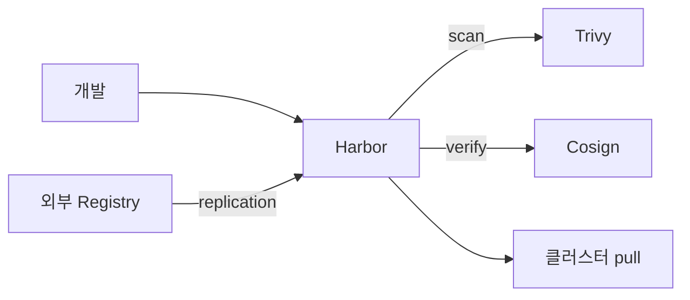
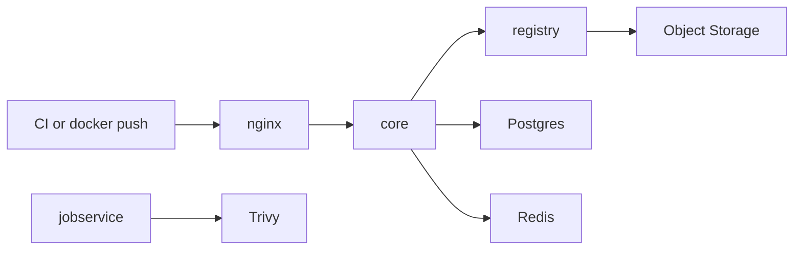

# Harbor

> **Harbor는 CNCF Graduated 오픈소스 OCI 레지스트리**다 (2020-06 graduate).
> 단순 컨테이너 저장소를 넘어 **이미지·Helm 차트·SBOM·서명 등 모든
> OCI Artifact**를 통합 관리. 공급망 보안의 **최전선**에서 pull-through
> proxy, 서명 검증, 취약점 스캔, 레플리케이션을 한 플랫폼에서 제공한다.

- **현재 기준**: Harbor **v2.13.x** (2026). 번들 PostgreSQL 14, Redis 7.2,
  distribution 2.8 백엔드
- **CNCF 지위**: Graduated (2020), 30k+ stars
- **전제**: Kubernetes 1.27+ (Helm 설치) 또는 Linux + Docker Compose
- **OCI Artifact 전반**은 [OCI Artifacts 레지스트리](./oci-artifacts-registry.md)
- **이미지 스캔 CI 통합**은 [이미지 스캔](../devsecops/image-scanning-cicd.md)
- **서명·SLSA**는 [SLSA](../devsecops/slsa-in-ci.md)

---

## 1. 왜 자체 레지스트리인가

### 1.1 Docker Hub·GHCR만 쓰면 안 되나

| 항목 | Public registry (Hub·GHCR) | 자체 Harbor |
|---|---|---|
| Rate limit | 엄격 (익명 100/6h) | 없음 |
| 오프라인·에어갭 | ❌ | ✅ |
| 내부 이미지 공유 | 공개 또는 유료 private | 모두 자체 호스팅 |
| RBAC 세밀도 | 조직 단위 | 프로젝트·역할 단위 |
| 취약점 스캔 자동 | 부분 | ✅ Trivy 기본 |
| 서명 검증 정책 | 옵션 | 프로젝트 단위 enforce |
| 복제·백업 | ❌ | ✅ |
| SBOM·attestation | 제한 | OCI artifact로 통합 |

### 1.2 Harbor의 역할 4가지



1. **Proxy Cache** — Docker Hub·GHCR 이미지를 내부 미러링
2. **Registry** — 자체 빌드 이미지·차트·SBOM 저장
3. **Security Gate** — 스캔·서명 검증 실패 시 pull 차단
4. **Federation** — 여러 Harbor 간 replication으로 DR·지역 배포

---

## 2. 아키텍처

### 2.1 구성 요소

| 컴포넌트 | 역할 | 상태성 |
|---|---|---|
| **nginx** | 프론트엔드 프록시, TLS 종단 | stateless |
| **core** | API·business logic | stateless |
| **portal** | React UI (static) | stateless |
| **registry** (distribution) | 실제 blob 저장·전송 | stateless (스토리지 분리) |
| **jobservice** | 복제·GC·스캔 스케줄 | stateless |
| **trivy** | 취약점 스캔 엔진 | stateless |
| **exporter** | Prometheus 메트릭 | stateless |
| **postgresql** | 메타데이터·RBAC·정책 | **stateful** |
| **redis** | 캐시·작업 큐 | stateful (HA 시 Redis Sentinel/Cluster) |

> 📝 **ChartMuseum은 v2.6에서 deprecated, v2.8에서 제거**. Helm 차트는
> OCI artifact(`oci://registry/project/chart`)로 저장(2026 표준). 아직
> ChartMuseum에 의존 중이면 즉시 이전 필요 — v2.8+ 에는 아예 존재하지 않음.

### 2.2 데이터 흐름 (push/pull)



- blob 업로드는 `registry`가 **object storage**(S3·GCS·Azure Blob·
  Swift·FS)로 직접
- 메타데이터·권한만 Postgres
- scan·GC·replication 작업은 Redis queue → jobservice

---

## 3. 설치

### 3.1 Helm (K8s 권장)

```bash
helm repo add harbor https://helm.goharbor.io
helm install harbor harbor/harbor \
  --namespace harbor --create-namespace \
  --version ~1.17.0 \    # ← Harbor v2.13 대응 차트 (번들 PG 14 기준)
  -f harbor-values.yaml
```

**Chart ↔ Harbor 버전 매트릭스** (일부 발췌):

| Helm chart | Harbor OSS |
|---|---|
| v1.17.x | **v2.13.x** |
| v1.16.x | v2.12.x |
| v1.15.x | v2.11.x |

번들 PostgreSQL은 14, 외부 PG는 **13~16** 범위에서 릴리즈별 매트릭스 확인
(공식 support matrix). 번들 Redis는 7.2.

**프로덕션 최소 values**

```yaml
expose:
  type: ingress
  tls:
    enabled: true
    certSource: secret
    secret:
      secretName: harbor-tls
  ingress:
    className: nginx
    hosts:
      core: harbor.example.com

externalURL: https://harbor.example.com

persistence:
  enabled: true
  imageChartStorage:
    type: s3               # filesystem 금지 (확장성 없음)
    s3:
      region: us-east-1
      bucket: harbor-prod
      rolearn: arn:aws:iam::111:role/harbor-s3

database:
  type: external            # 내부 Postgres는 HA 어려움
  external:
    host: harbor-db.example.com
    port: "5432"
    username: harbor
    existingSecret: harbor-db-auth
    sslmode: require

redis:
  type: external            # 내부 Redis는 single-replica
  external:
    addr: harbor-redis.example.com:6379
    existingSecret: harbor-redis-auth

trivy:
  enabled: true
  replicas: 2
  gitHubToken: ""           # rate limit 완화에 권장

portal: {replicas: 2}
core: {replicas: 2}
jobservice: {replicas: 2}
registry: {replicas: 2}
nginx: {replicas: 2}
exporter: {enabled: true, serviceMonitor: {enabled: true}}

harborAdminPassword: ""     # 설치 후 외부 Secret 주입·초기 로그인 후 변경
```

### 3.2 Operator (선택)

[harbor-operator](https://github.com/goharbor/harbor-operator)는 CR
`HarborCluster`로 선언적 관리. 여러 Harbor 인스턴스 필요한 멀티 테넌트
플랫폼에 유용. 일반 조직은 **Helm + self-management(ArgoCD/Flux)** 가
충분.

### 3.3 Docker Compose (소규모·개발)

Helm이 아닌 환경에서는 공식 installer(`install.sh`)로 VM에 배포. 단일 VM
한계가 분명하므로 prod는 K8s Helm 권장.

---

## 4. 프로젝트·RBAC

Harbor의 **프로젝트(project)**는 namespace와 유사한 테넌시 경계.

### 4.1 역할

| 역할 | 권한 |
|---|---|
| **Limited Guest** | 이미지 pull만 |
| **Guest** | pull + 프로젝트 view |
| **Developer** | pull + push |
| **Maintainer** | Developer + 스캔·retention 정책 |
| **ProjectAdmin** | Maintainer + member 관리 |
| **System Admin** (전역) | 모든 프로젝트 + 시스템 설정 |

### 4.2 SSO (OIDC·LDAP)

```yaml
# values.yaml에 설치 후 UI or API로 설정
# System > Configuration > Authentication
# oidc_endpoint: https://sso.example.com
# oidc_client_id: harbor
# oidc_client_secret: <secret>
# oidc_scope: openid,offline_access,email,groups
# oidc_groups_claim: groups
# oidc_admin_group: harbor-admins
```

**실무 권장**: DB 인증 대신 **OIDC(Keycloak·Okta·Azure AD·Google)** 로
통일. OIDC group → Harbor role 자동 매핑. admin 계정은 break-glass 용도만.

### 4.3 프로젝트 생성·메타

```yaml
# API 예 (Terraform provider도 존재)
POST /api/v2.0/projects
{
  "project_name": "platform",
  "public": false,
  "metadata": {
    "enable_content_trust_cosign": "true",  # Cosign 서명 필수 (v2.13)
    "prevent_vul": "true",                  # CVE 임계 초과 pull 차단
    "severity": "high",
    "auto_scan": "true",                    # push 시 자동 스캔
    "reuse_sys_cve_allowlist": "true"
  },
  "storage_limit": 107374182400         # 100GB quota
}
```

---

## 5. 이미지 스캔 — Trivy 기본 엔진

### 5.1 Scan-on-push

프로젝트 설정 **Automatically scan images on push** 활성 시 push마다
자동 스캔. 결과는 이미지 detail 페이지에 CVE 목록으로.

### 5.2 Block pull by CVE severity

**Deployment security의 핵심 기능** — Critical CVE가 있는 이미지를
pull 못하게 차단.

```text
Project > Configuration > Deployment security > Prevent vulnerable
images from running (Severity: High 이상)
```

- `High` 기준이면 Critical·High 있는 이미지 pull 404
- **CVE Allowlist**: false positive는 프로젝트·시스템 단위 whitelist
- **scan report 유효성**: 기본 scan은 **snapshot**이라 새 CVE 발견돼도
  재스캔 전까지 반영 안됨 → 정기 재스캔 스케줄 필요

### 5.3 Trivy DB 업데이트

Trivy는 매일 CVE DB 업데이트. 에어갭 환경에서는:

```yaml
trivy:
  skipUpdate: false            # 내부망에선 true + DB 미러
  offlineScan: true            # 인터넷 차단 시
  # 또는 미리 pull한 DB를 PVC로 마운트
```

GitHub rate limit에 걸리면 `trivy.gitHubToken`을 부여. 상세는
[이미지 스캔](../devsecops/image-scanning-cicd.md).

---

## 6. Cosign 서명 — 공급망 보안

### 6.1 서명·검증 플로우

1. CI에서 이미지 빌드 후 `cosign sign --key ...` (또는 keyless)
2. 서명이 OCI artifact(`.sig`)로 **같은 repository에 push**
3. Harbor는 서명을 pinned artifact로 인식, replication에 함께 포함
4. Kubernetes는 admission (Kyverno/Connaisseur/Policy Controller)에서
   서명 검증 후에만 pull
5. Harbor 자체의 **Content Trust** 설정으로 서명 없는 이미지 pull 차단
   (프로젝트 단위)

### 6.2 Cosign keyless (권장)

```bash
# GitHub Actions OIDC
cosign sign \
  --yes \
  harbor.example.com/platform/webapp@sha256:abcd...
```

keyless = 장기 키 보관 없이 OIDC 토큰으로 ephemeral 키 서명. Rekor
공개 로그에 기록 → 감사 가능.

### 6.3 Harbor 2.5+ Cosign 복제

v2.5 이후 Cosign 서명(`.sig`)·SBOM·attestation(`.att`)을 **메인 이미지와
함께 자동 replication**. 이전 Notary와 달리 별도 서버 불필요.

> ⚠️ **Notary v1은 Harbor v2.6 deprecated, v2.9에서 완전 제거**. v2.13
> 현재는 Notary 관련 UI·백엔드가 존재하지 않는다. 구형 Notary 서명이
> 남아 있다면 **Cosign으로 재서명** 후 Harbor에 push.

---

## 7. Replication

지역·DR·에어갭 배포에 핵심.

### 7.1 Registry endpoint

```text
Registration > New Endpoint
Provider: Docker Hub / Harbor / ECR / GCR / ACR / Quay / GitHub / ...
```

Harbor는 **AWS ECR, GCP Artifact Registry, Azure Container Registry,
Docker Hub, Quay, GitHub Packages, GitLab, Artifactory** 등 광범위 지원.

### 7.2 Replication policy

```text
Name: prod-to-dr
Source: platform/**
Destination: registry: harbor-dr, namespace: /
Trigger: Event-Based (push 즉시) / Scheduled (cron) / Manual
Filter: name, tag, label, resource (image/chart)
Replicate deletion: 기본 off (실수 파급 방지)
Override: 기본 off (tag 덮어쓰기 금지)
```

**서명·SBOM 함께 복제**: v2.5+는 기본 동작. 옵션 없이 자동.

### 7.3 Pull-through Proxy Cache

```text
New Project > Proxy Cache > Endpoint: docker-hub
```

- Docker Hub rate limit 회피 — 내부 팀이 Harbor만 접근
- Upstream이 지운 이미지도 cache에 남아 있어 안정성↑
- 에어갭 환경에서는 WAN 쪽만 cache 채운 후 허브 차단

**경로 규칙** (자주 막히는 지점):

```bash
# 원본이 library/nginx:1.25
docker pull harbor.example.com/proxy-hub/library/nginx:1.25

# 원본이 prom/prometheus:v2.51.0
docker pull harbor.example.com/proxy-hub/prom/prometheus:v2.51.0
```

첫 경로 세그먼트가 Proxy Cache 프로젝트 이름, 그 뒤에 upstream namespace +
image 그대로. **Proxy Cache 프로젝트에는 직접 push 불가** — read-only.
upstream이 이미지를 삭제하면 cache expire 후 함께 사라진다 (TTL 설정 가능).

### 7.4 Universal OCI Hub 패턴 (2026 트렌드)

Harbor를 **multi-zone signed artifact hub**로 사용:

- 모든 서명된 이미지·차트·SBOM을 한 Harbor에 push
- ArgoCD/Flux가 여러 cluster에서 이 Harbor를 source of truth로
- replication으로 DR region에 미러
- "Gitless GitOps" — Git 없이 OCI artifact가 진리 원천

---

## 8. Retention·Quota·Tag Immutability

### 8.1 Retention Policy

오래된 이미지 자동 정리.

```text
Rules:
  - keep last 10 pulls
  - keep the latest 5 tags matching "v*"
  - keep tags modified within 30 days
Schedule: weekly
Action: retain (유지할 것 정의, 나머지는 제거 대상)
Exclude: dev-*, -rc*
```

**주의**: delete는 "soft"(DB 삭제). 실제 blob은 **Garbage Collection**이
돌아야 제거. v2.1+ **non-blocking GC**가 기본 — readonly 모드 강제 없이
push와 병행 가능. 단 GC 진행 중에는 I/O 부하가 있으므로 저부하 시간대
권장.

### 8.2 Quota

프로젝트별 **storage size** / **artifact count** 제한. CI가 polluting
repo를 만들어 디스크 고갈 방지.

### 8.3 Tag Immutability

특정 tag 패턴을 **변경 불가**로. `v1.0.0` 같은 릴리즈 tag는 고정.

```text
Matching Tags: "v*"
Matching Repositories: "**"
Action: Immutable
```

활성 시 같은 tag로 push 시도하면 거부. **SLSA 등급 상승의 전제 조건**.

### 8.4 Garbage Collection

```text
System > Garbage Collection
Schedule: weekly / bi-weekly
Dry Run: 실제 실행 전 결과 확인
Delete Untagged: 태그 없는 manifest 정리
```

**v2.1+ non-blocking GC**: push는 계속 가능하지만 I/O 부하가 있으므로
저부하 시간대. `Workers` 옵션(1~5)으로 병렬도 조정 — 부하 vs 완료 속도
트레이드오프.

---

## 9. Webhook·Observability

### 9.1 Webhook

프로젝트 이벤트(push, pull, scan completed, quality gate failed 등)를
외부 시스템으로:

```json
{
  "type": "PUSH_ARTIFACT",
  "event_data": {
    "resources": [{"resource_url": "harbor.example.com/platform/webapp:1.4.0"}]
  }
}
```

- ArgoCD Image Updater와 직접 통합 가능
- Slack·MS Teams·PagerDuty 알림
- CI 파이프라인 트리거 (scan 결과가 통과하면 배포)

**인증**: Harbor Webhook은 `Authorization` 헤더(Bearer 토큰)를 지원.
수신 endpoint는 반드시 토큰 검증하고, 공개 인터넷에 노출된다면 mTLS 또는
HMAC 서명 검증이 있는 프록시(API Gateway) 뒤에 둘 것.

### 9.2 메트릭

```text
harbor_core_http_request_total
harbor_core_http_request_duration_seconds
harbor_project_quota_usage_byte
harbor_project_quota_byte
harbor_artifact_scanned_total{status="success|failed"}
harbor_task_queue_size
```

Prometheus ServiceMonitor는 `exporter.enabled: true`로 자동 생성. Grafana
공식 대시보드 [`14482`](https://grafana.com/grafana/dashboards/14482).

### 9.3 감사 로그

System 설정에서 audit log 활성. 모든 API 호출·권한 변경 기록. 컴플라이언스
필요 시 **외부 SIEM으로 forward** (syslog·HTTP).

---

## 10. 고가용성·DR

### 10.1 HA 구성 원칙

| 컴포넌트 | HA |
|---|---|
| PostgreSQL | **외부 관리형** (RDS Multi-AZ, Cloud SQL HA) 또는 Patroni |
| Redis | 외부 관리형 (ElastiCache, Memorystore) 또는 Sentinel |
| Object Storage | S3·GCS·Azure Blob의 내장 HA |
| Stateless 컴포넌트 (core·portal·jobservice·registry·nginx) | replicas ≥ 2 |
| Trivy | replicas ≥ 2 |

### 10.2 백업 대상

| 데이터 | 백업 방법 |
|---|---|
| Postgres | PITR snapshot (RDS·pg_basebackup) |
| Redis | AOF/RDB (장애 시 분석 용도, 필수는 아님) |
| Object storage (blobs) | 버전 관리 + 교차 리전 복제 |
| 인증 설정 (OIDC secret 등) | Terraform state 또는 External Secrets |

### 10.3 DR

- **Replication to DR Harbor** — 다른 리전에 Harbor 인스턴스, 푸시마다 복제
- 또는 **Object storage cross-region replication** + DR cluster에 Harbor
  standby
- 목표: RTO 1h, RPO 15m 수준이 업계 표준

---

## 11. 안티패턴

| 안티패턴 | 왜 문제 | 교정 |
|---|---|---|
| storage: filesystem (PVC) | 확장·백업 어려움, single-node | S3/GCS/Azure Blob |
| 내부 Postgres HA 없이 prod | single-replica, 재시작 시 장애 | 외부 관리형 |
| 내부 Redis single replica | 재시작 시 작업 큐 소실 | Sentinel·Cluster 또는 관리형 |
| `harborAdminPassword` helm values에 평문 | Git·CI 로그에 노출 | External Secrets |
| 모든 프로젝트 public | 내부 이미지 외부 노출 | 기본 private, public 필요 건만 |
| 서명 검증 없이 pull | 공급망 변조 감지 불가 | `enable_content_trust_cosign: true` + 클러스터 admission |
| scan 없이 prod 배포 | CVE 유입 | `auto_scan: true` + `prevent_vul: high` |
| tag immutability 없이 `v1.0.0` push | 같은 tag로 덮어쓰기 → 감사 불가 | 릴리즈 tag immutable |
| retention 정책 없음 | 디스크 무한 증가 | 정기 retention + GC |
| GC를 고부하 시간에 실행 | push 성공하나 I/O 경합으로 지연 | 저부하 시간대 스케줄 |
| Notary v1 계속 사용 | v2.9에서 이미 제거됨 | Cosign 전환 |
| ChartMuseum에 Helm 차트 | v2.6 deprecated · v2.8에서 제거됨 | OCI chart로 push |
| replication에 `replicate deletion` 활성 | 실수로 지운 이미지 DR에도 전파 | 기본 off |
| Harbor에 ingress 직접 노출 (SSO 없이) | 외부 공격 표면 | SSO·IP 제한·WAF |
| Trivy DB 미업데이트 | CVE 탐지 누락 | 자동 업데이트 확인 |
| CVE allowlist를 남용 | 실제 취약점 무시 | 일시적 + 만료 일자 |
| proxy cache 프로젝트 + 쓰기 가능 | cache가 오염 | proxy cache는 read-only |
| Harbor 단일 region으로 전 세계 | latency·장애 blast | 리전별 Harbor + replication |
| 버전 주기 건너뛰기 (v2.10 → v2.13) | Postgres 스키마 마이그레이션 실패 | minor 한 단계씩 |

---

## 12. 도입 로드맵

1. **단일 Harbor on K8s**: Helm 설치, 기본 DB/Redis 내부
2. **외부 Postgres/Redis/S3**: 프로덕션 표준으로 전환
3. **OIDC SSO**: DB 계정 → Keycloak/Okta 통합
4. **프로젝트 구조**: 팀·환경별 project + RBAC
5. **Trivy scan-on-push + prevent_vul**
6. **Cosign 서명 파이프라인**: keyless(GitHub OIDC) + admission
7. **Retention + Quota + Tag immutability**
8. **Replication**: DR·멀티 리전
9. **Proxy Cache**: Docker Hub rate limit 해소
10. **관측**: Prometheus + Grafana 14482 + Slack webhook

---

## 13. 관련 문서

- [OCI Artifacts 레지스트리](./oci-artifacts-registry.md) — OCI 표준 상세
- [이미지 스캔](../devsecops/image-scanning-cicd.md) — Trivy·Grype·CVE 정책
- [SLSA](../devsecops/slsa-in-ci.md) — 서명·attestation·Level 상향
- [Flux 설치](../flux/flux-install.md) — OCIRepository source
- [ArgoCD Image Updater](../argocd/argocd-image-updater.md)

---

## 참고 자료

- [Harbor 공식](https://goharbor.io/) — 확인: 2026-04-25
- [Harbor Docs](https://goharbor.io/docs/main/) — 확인: 2026-04-25
- [Release Notes](https://github.com/goharbor/harbor/releases) — 확인: 2026-04-25
- [Harbor Helm Chart](https://github.com/goharbor/harbor-helm) — 확인: 2026-04-25
- [Making Harbor production-ready — CNCF blog](https://www.cncf.io/blog/2026/02/24/making-harbor-production-ready-essential-considerations-for-deployment/) — 확인: 2026-04-25
- [Harbor + Cosign](https://goharbor.io/docs/main/working-with-projects/working-with-images/sign-images/) — 확인: 2026-04-25
- [Gitless GitOps blog](https://goharbor.io/blog/harbor-as-universal-oci-hub/) — 확인: 2026-04-25
- [harbor-operator](https://github.com/goharbor/harbor-operator) — 확인: 2026-04-25
- [Trivy 공식](https://trivy.dev/) — 확인: 2026-04-25
- [Grafana Dashboard 14482](https://grafana.com/grafana/dashboards/14482) — 확인: 2026-04-25
