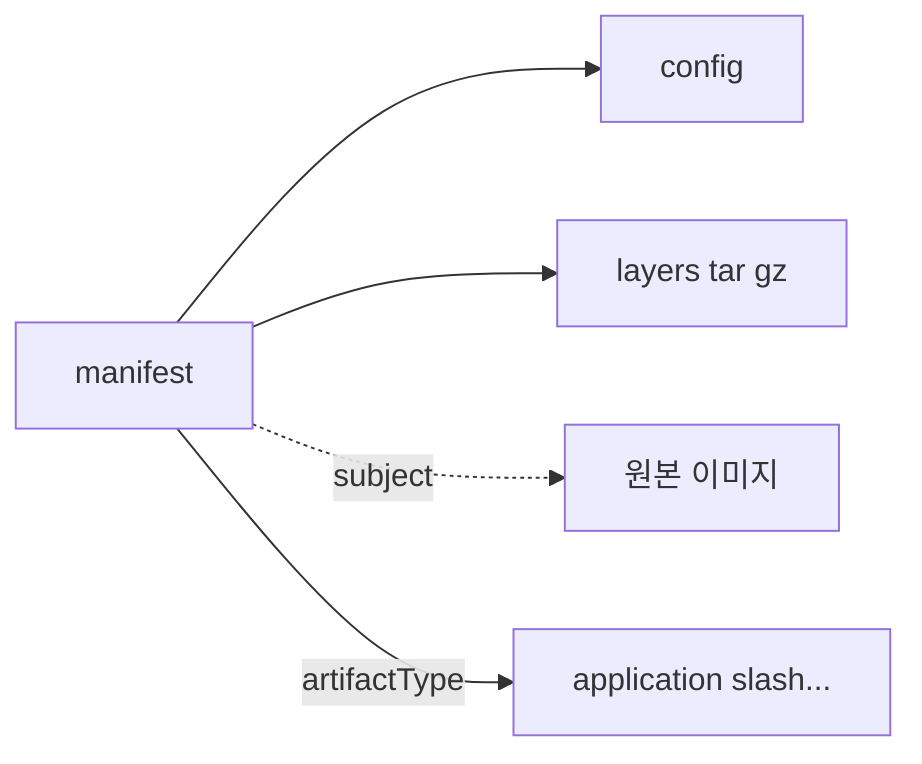

# OCI Artifacts 레지스트리

> **OCI 레지스트리는 이제 "컨테이너 이미지 저장소"가 아니라 "모든 빌드
> 산출물의 허브"**다. OCI **Image Spec v1.1** (2024)부터 `artifactType`
> 필드와 **Referrers API**(`/v2/<name>/referrers/<digest>`)가 표준이 되어
> **이미지·Helm 차트·SBOM·서명·Provenance·정책 번들·ML 모델**까지 한
> 저장소에 연결된 그래프로 저장할 수 있다. Harbor·ECR·GAR·ACR·ghcr.io
> 등 주요 레지스트리가 모두 지원.

- **기준**: OCI **Image Spec v1.1.0** (2024-02 stable), Distribution Spec
  v1.1 (Referrers API)
- **도구**: `oras` CLI (CNCF **Sandbox**, 2021 승인), `cosign` v3 (2025-10 GA),
  `crane`, `skopeo`, `docker buildx`
- **Harbor 구체 운영**은 [Harbor](./harbor.md) 참조. 이 글은 **OCI 표준
  자체**에 집중
- **서명 체계 심화**는 [SLSA](../devsecops/slsa-in-ci.md)

---

## 1. OCI 3대 스펙

OCI(Open Container Initiative)는 Linux Foundation 산하 표준 기구. 세
가지 스펙이 현대 공급망의 뼈대다.

| 스펙 | 관심사 | 핵심 변화 |
|---|---|---|
| **Image Spec** | artifact 구조 (manifest·config·layer) | v1.1에서 `artifactType`, `subject`, Referrers 등장 |
| **Distribution Spec** | registry HTTP API | v1.1에서 Referrers API, mount-cross-repository 개선 |
| **Runtime Spec** | 컨테이너 실행 표준 | OCI hooks, containerd·CRI-O 기본 |

이 글은 **Image + Distribution**에 집중. Runtime은 `container/` 카테고리.

---

## 2. OCI Artifact — 이미지가 아닌 것들

### 2.1 뭐가 OCI Artifact인가

컨테이너 이미지 구조(manifest → config → layers)를 재활용하되, **`artifactType`
필드**로 "이게 무엇인지" 선언.



> ℹ️ **용어 정리**: `mediaType`은 각 구조(manifest·config·layer)의 타입
> 식별자. **`artifactType`**은 Image Spec v1.1에서 도입된 manifest-level
> 필드로 "이 artifact는 무엇인가"를 선언. 일반 컨테이너 이미지는
> `artifactType`을 **설정하지 않음** (manifest mediaType이 이미 이미지임을
> 의미). 아래 표는 대표 예 — "artifactType" 또는 "config.mediaType"에
> 사용되는 문자열을 용도별로 정리.

| 용도 | 사용 위치 | 문자열 |
|---|---|---|
| 컨테이너 이미지 | manifest mediaType | `application/vnd.oci.image.manifest.v1+json` (artifactType 미설정) |
| Helm 차트 | config.mediaType | `application/vnd.cncf.helm.config.v1+json` |
| Flux manifest | layer mediaType | `application/vnd.cncf.flux.content.v1.tar+gzip` |
| Cosign 서명 (v3 Referring Artifact) | manifest artifactType | `application/vnd.dev.cosign.artifact.sig.v1+json` |
| Cosign 서명 layer 본문 | layer mediaType | `application/vnd.dev.cosign.simplesigning.v1+json` |
| CycloneDX SBOM | artifactType | `application/vnd.cyclonedx+json` |
| SPDX SBOM | artifactType | `application/spdx+json` |
| in-toto attestation (Provenance) | artifactType | `application/vnd.in-toto+json` |
| Empty descriptor | config.mediaType | `application/vnd.oci.empty.v1+json` |
| OPA/Kubewarden 정책 | layer mediaType (사례별 상이) | 커뮤니티 관례 — 공식 등록 아님 |
| ML 모델 (ModelPack 등) | manifest artifactType | 표준 진행 중 (`application/vnd.cncf.model.*` 제안) |

**핵심 이점**: 한 레지스트리에서 이미지·정책·SBOM·모델을 **동일 인증·
RBAC·replication·audit로** 관리. 벤더마다 다른 저장소가 필요 없다.

### 2.2 Config 블롭의 역할

이미지: config는 entrypoint·env·labels 등 실행 메타. Artifact: config는
종종 empty descriptor 또는 도구별 메타. 클라이언트가 `artifactType`으로
해석.

---

## 3. Referrers API — 그래프로 연결

### 3.1 문제

"이 이미지의 서명이 어디 있지?" — 과거에는 tag 규칙(`<digest>.sig`)으로
억지로 찾았다. 이 방식은:

- tag 덮어쓰기 취약
- 여러 아티팩트 연결 불가
- replication이 tag를 놓치기 쉬움

### 3.2 해결 — `subject` + Referrers

Image Spec v1.1의 manifest에 **`subject`** 필드: "이 artifact가 무엇에
관한 것인지" 가리키는 digest.

```json
{
  "schemaVersion": 2,
  "mediaType": "application/vnd.oci.image.manifest.v1+json",
  "artifactType": "application/vnd.cyclonedx+json",
  "subject": {
    "mediaType": "application/vnd.oci.image.manifest.v1+json",
    "digest": "sha256:abcd1234...",
    "size": 1234
  },
  "config": { ... },
  "layers": [ ... ]
}
```

**Referrers API**: `GET /v2/<name>/referrers/<digest>` → 해당 digest를
`subject`로 가리키는 모든 manifest 목록 (Image Index 형태).

```bash
curl -H "Accept: application/vnd.oci.image.index.v1+json" \
  https://harbor.example.com/v2/platform/webapp/referrers/sha256:abcd...
```

응답에서 `artifactType` 별로 필터 가능.

### 3.3 Fallback (Distribution Spec 미지원 레지스트리)

레지스트리가 Referrers API 미지원이면 클라이언트는 **`<digest>-<suffix>`
tag 스타일**로 fallback. `oras`, `cosign`이 자동 처리하지만 **Referrers가
훨씬 깔끔**하므로 레지스트리 측 지원 여부를 먼저 확인.

### 3.4 지원 현황 (2026)

| 레지스트리 | Referrers API |
|---|---|
| Harbor 2.8+ | ✅ |
| Docker Hub | 부분 (OCI Artifacts 저장 OK, Referrers API 공식 GA는 미확정) |
| GHCR (GitHub Container Registry) | ✅ |
| AWS ECR | ✅ (2023년 말 배포) |
| GCP Artifact Registry | ✅ |
| Azure ACR | ✅ |
| Quay | ✅ |
| Artifactory | ✅ |
| distribution/distribution (OSS) | ✅ 2.8+ |

---

## 4. ORAS — OCI Registry As Storage

[`oras`](https://oras.land)는 OCI Artifact를 범용으로 push/pull하는 CLI·Go
라이브러리. **CNCF Sandbox** (2021 승인).

### 4.1 임의 파일 push

```bash
# policy.rego 파일을 OPA 정책 artifact로
oras push harbor.example.com/policies/denylist:v1 \
  --artifact-type application/vnd.cncf.openpolicyagent.policy.layer.v1+rego \
  policy.rego:application/vnd.cncf.openpolicyagent.policy.layer.v1+rego

# pull
oras pull harbor.example.com/policies/denylist:v1
```

### 4.2 이미지에 SBOM 붙이기

```bash
# 이미지 digest 얻기
DIGEST=$(docker inspect --format='{{index .RepoDigests 0}}' \
         harbor.example.com/platform/webapp:1.4.0 | cut -d@ -f2)

# Syft로 SBOM 생성
syft harbor.example.com/platform/webapp:1.4.0 -o cyclonedx-json=sbom.json

# subject로 이미지를 가리키며 attach
oras attach \
  harbor.example.com/platform/webapp@$DIGEST \
  --artifact-type application/vnd.cyclonedx+json \
  sbom.json:application/vnd.cyclonedx+json
```

이후 Referrers API로 조회:

```bash
oras discover -o table harbor.example.com/platform/webapp@$DIGEST
```

### 4.3 에어갭 이전

```bash
# 외부 Harbor에서 imagepack 만들기
oras copy --recursive \
  ghcr.io/upstream/app:v1 \
  file://./oras-cache/app-v1

# 에어갭으로 물리 이동 후
oras copy --recursive \
  file://./oras-cache/app-v1 \
  harbor.internal/mirror/app:v1
```

서명·SBOM이 **같이 이동**. 기존 `docker save`는 이미지만, Referrers는
따로 옮겨야 해서 오류가 많았다.

---

## 5. SBOM

### 5.1 표준

| 포맷 | 출처 | 특징 |
|---|---|---|
| **SPDX** | Linux Foundation | ISO/IEC 5962, 규제 친화 |
| **CycloneDX** | OWASP | 보안 중심, VEX·ML-BOM 확장 |
| SWID Tags | ISO | 라이선스·자산 관리 |

CycloneDX가 DevSecOps 실무에서 가장 많이 쓰이고, SPDX는 규제·법무에서
선호. 둘 다 OCI artifactType에 매핑되어 있어 어느 포맷이든 push 가능.

### 5.2 생성·push

```bash
# Syft (Anchore) — 가장 널리 쓰이는 SBOM 생성기
syft packages docker:harbor.example.com/platform/webapp:1.4.0 \
  -o cyclonedx-json=sbom.cdx.json \
  -o spdx-json=sbom.spdx.json

# Docker buildx가 직접 생성·attach (--provenance=mode=max --sbom=true)
docker buildx build \
  --push \
  --provenance=mode=max \
  --sbom=true \
  -t harbor.example.com/platform/webapp:1.4.0 .
```

buildx는 build 시 **자동 SBOM + SLSA Provenance**를 생성해 OCI artifact로
attach. Git ref, commit sha, builder image가 provenance에 기록.

### 5.3 VEX — False Positive 보강

**VEX (Vulnerability Exploitability eXchange)**: "이 CVE는 우리 이미지에
영향 없다"를 artifact로 attach. Trivy·Grype가 이 VEX를 읽어 false positive를
자동 제외.

**VEX 포맷 2종**

| 포맷 | mediaType / predicateType |
|---|---|
| **OpenVEX** (단독 in-toto attestation) | `https://openvex.dev/ns/v0.2.0` (predicate), attestation으로 래핑 |
| **CycloneDX VEX** | `application/vnd.cyclonedx.vex+json` 또는 CycloneDX profile 필드 사용 |

SBOM과 **mediaType이 다르다** — 같은 `application/vnd.cyclonedx+json`으로
push하면 스캐너가 VEX로 인식 못 해 false positive가 그대로 남는다.

```bash
# OpenVEX를 in-toto attestation으로 attach (권장 추세)
cosign attest \
  --predicate vex.json \
  --type "https://openvex.dev/ns/v0.2.0" \
  <image@digest>
```

---

## 6. 서명 — Cosign·Notation

### 6.1 Cosign (Sigstore)

Sigstore는 Linux Foundation 산하. **Cosign v3** (2025-10 GA) 기준. v3부터
tag-based 서명(`.sig` suffix tag)에서 **OCI 1.1 Referring Artifact 포맷**이
기본. 기존 v2 서명 검증은 `--new-bundle-format=false`로 호환 유지 가능.

```bash
# keyless (권장) — GitHub OIDC 사용
cosign sign harbor.example.com/platform/webapp@sha256:abcd...

# 검증
cosign verify \
  --certificate-identity-regexp "^https://github.com/my-org/.+$" \
  --certificate-oidc-issuer "https://token.actions.githubusercontent.com" \
  harbor.example.com/platform/webapp@sha256:abcd...
```

- 서명·attestation·SBOM 모두 OCI artifact로 subject에 attach
- **Rekor** 공개 투명성 로그에 기록 → 부인방지
- **Fulcio**가 ephemeral certificate 발급

### 6.2 Notation (CNCF)

MSFT·ACR 계열이 주도. Notary v2 후신.

```bash
notation sign --key github-actions <image@digest>
notation verify <image@digest>
```

Cosign과 공존 가능 — 레지스트리에는 **두 서명 모두 attach** 가능. 정책
측에서 어떤 서명을 요구할지 선택.

### 6.3 비교

| 축 | Cosign | Notation |
|---|---|---|
| 주도 | Sigstore (LF) | CNCF |
| Keyless | ✅ OIDC + Fulcio | 유사 기능 진행 |
| 투명성 로그 | ✅ Rekor | 옵션 |
| 생태계 | 압도적 (GitHub Actions, GitLab, Jenkins 기본 통합) | ACR·Notary 계열 |
| 선택 | **기본 선택** | Microsoft 스택 |

---

## 7. Provenance — SLSA

OCI artifact로 **빌드 증명서**를 붙인다. in-toto attestation 포맷.

```json
{
  "_type": "https://in-toto.io/Statement/v1",
  "predicateType": "https://slsa.dev/provenance/v1",
  "subject": [{"name": "webapp", "digest": {"sha256": "abcd..."}}],
  "predicate": {
    "buildDefinition": {
      "buildType": "https://github.com/actions/buildx@v1",
      "externalParameters": {...},
      "internalParameters": {...},
      "resolvedDependencies": [...]
    },
    "runDetails": {
      "builder": {"id": "https://github.com/actions/runner/..."},
      "metadata": {"invocationId": "run-12345", "startedOn": "..."}
    }
  }
}
```

`docker buildx build --provenance=mode=max`로 자동 생성. 상세는
[SLSA](../devsecops/slsa-in-ci.md).

---

## 8. 정책으로 "서명·SBOM 있는 것만 배포"

### 8.1 Kubernetes admission

| 도구 | 특징 |
|---|---|
| **Kyverno** | 선언형 정책 CRD, Cosign/Notation 지원 |
| **Sigstore Policy Controller** | Sigstore 공식 K8s admission |
| **Connaisseur** | 다중 서명자 지원 |
| **OPA/Gatekeeper** | Rego 일반 정책 (서명 로직 직접 구현 필요) |

```yaml
# Kyverno 예
apiVersion: kyverno.io/v1
kind: ClusterPolicy
metadata:
  name: verify-image-signature
spec:
  validationFailureAction: Enforce
  rules:
    - name: check-signature
      match:
        any:
          - resources: {kinds: [Pod]}
      verifyImages:
        - imageReferences:
            - "harbor.example.com/platform/*"
          attestors:
            - entries:
                - keyless:
                    subject: "https://github.com/my-org/.+"
                    issuer: "https://token.actions.githubusercontent.com"
                    rekor: {url: https://rekor.sigstore.dev}
```

### 8.2 Harbor 자체 gate

Harbor의 `enable_content_trust_cosign` 프로젝트 메타로 **pull 시점**
차단도 가능 (이중 방어). 자세히는 [Harbor §6](./harbor.md).

---

## 9. 관측·운영 관점

### 9.1 스토리지 비용

- 이미지 + SBOM + 서명 + provenance + VEX = 이미지 1장 ≈ 5~10개 artifact
- **blob deduplication**을 레지스트리가 해주지만, 메타데이터는 각각 저장
- 월별 artifact growth 모니터링, retention policy 필수

### 9.2 replication 복잡도

- **Referrers 그래프 전체**를 복제해야 의미 있음
- Harbor·ECR·GAR·ghcr.io는 Referrers를 자동 동행 복제
- 일부 OSS 구현 (초기 distribution/distribution)은 subject-only 복제 —
  tag 기반 fallback 필요

### 9.3 GC 주의

OCI artifact는 **subject**가 가리키는 이미지와 **별도로** GC 대상이다.
원본 이미지를 지우면 연결된 SBOM·서명은 orphan.

**레지스트리별 정책 상이**:

| 레지스트리 | subject 기반 GC |
|---|---|
| Harbor | orphan artifact 정리 (GC 작업) |
| ECR | manifest-delete cascade 정책 (Referrers 함께 삭제 옵션) |
| GAR | cleanup policy + Referrers 옵션 |
| distribution OSS | `--delete-untagged` 플래그 필요 |

다중 레지스트리 운영자는 **각 레지스트리의 GC 정책을 주기적으로 검증**할 것.

---

## 10. 안티패턴

| 안티패턴 | 왜 문제 | 교정 |
|---|---|---|
| Docker Hub tag 규칙(`<digest>.sig`)에 의존 | Referrers API로 대체됨, fallback 불안정 | Referrers API 사용 |
| SBOM을 이미지 tag에 `<tag>.sbom` 형식 | 덮어쓰기 취약, 복제 놓침 | subject + artifactType |
| SBOM을 별도 스토리지(S3) | RBAC·replication 따로 관리 | 같은 레지스트리에 OCI artifact |
| `docker save` + `scp`로 에어갭 이전 | Referrers 누락 | `oras copy --recursive` |
| Cosign v2로 서명한 이미지를 v3 검증 시도 | 일부 포맷 변경으로 실패 가능 | 일관된 Cosign 버전 |
| 키 기반 서명 + 키를 Git에 커밋 | 전체 공급망 탈취 | keyless OIDC + Fulcio |
| SBOM 생성 없이 SLSA Level 3 선언 | 자가 모순 | buildx `--sbom=true --provenance=mode=max` |
| VEX 없이 false positive 방치 | 알람 피로 → 실제 취약점 놓침 | VEX artifact 부착 |
| Notation·Cosign 혼용인데 검증은 한 쪽만 | 공격자가 서명 안 된 쪽을 악용 | 둘 다 검증하거나 하나로 통일 |
| Provenance에 mode=min만 사용 | 빌드 재현·감사 부족 | `mode=max` 기본 |
| Orphan artifact (subject가 사라진) 방치 | 스토리지 낭비·혼동 | GC로 정리 |
| 서로 다른 tag 의미로 혼용 (`latest`·`v1.0.0`을 같은 digest) | 재현성 붕괴 | tag immutability + 의미 분리 |
| OCI 1.1 미지원 레지스트리를 2026에 선택 | Referrers 안정 동작 불가 | 지원 버전 필수 |
| 가변 tag에 subject — artifact 부착 | 이미지 디지스트 변하면 모든 subject 깨짐 | digest 기반 subject |
| SBOM만 공급하고 서명 없음 | SBOM 자체 변조 가능 | SBOM도 서명 |

---

## 11. 도입 로드맵

1. **OCI 1.1 지원 레지스트리로 이전**: Harbor 2.8+, ECR, GAR, GHCR
2. **`docker buildx` 도입**: `--provenance=mode=max --sbom=true`
3. **Cosign keyless 서명**: GitHub OIDC 또는 GitLab OIDC
4. **Referrers 조회 기본화**: `oras discover`, `cosign verify` 파이프라인
5. **VEX 프로세스**: false positive를 VEX artifact로 공급
6. **Kubernetes admission**: Kyverno·Sigstore Policy Controller
7. **Harbor 프로젝트 정책**: `enable_content_trust_cosign`, `prevent_vul`
8. **에어갭·DR 복제**: `oras copy --recursive` 또는 Harbor replication
9. **정책·ML 모델 OCI화**: 모든 산출물을 레지스트리 일원화
10. **SLSA Level 3+ 로드맵**: [SLSA](../devsecops/slsa-in-ci.md)

---

## 12. 관련 문서

- [Harbor](./harbor.md) — OCI 레지스트리 구체 운영
- [SLSA](../devsecops/slsa-in-ci.md) — 공급망 보안 프레임워크
- [이미지 스캔](../devsecops/image-scanning-cicd.md)
- [Flux 설치 §7](../flux/flux-install.md) — OCIRepository source
- [Flux Helm](../flux/flux-helm.md) — OCI 차트

---

## 참고 자료

- [OCI Image Spec v1.1](https://github.com/opencontainers/image-spec/releases) — 확인: 2026-04-25
- [OCI Distribution Spec](https://github.com/opencontainers/distribution-spec) — 확인: 2026-04-25
- [OCI Artifact 정의](https://github.com/opencontainers/image-spec/blob/main/artifacts-guidance.md) — 확인: 2026-04-25
- [ORAS 공식](https://oras.land/) — 확인: 2026-04-25
- [Sigstore Cosign](https://docs.sigstore.dev/cosign/overview/) — 확인: 2026-04-25
- [Notation 공식](https://notaryproject.dev/) — 확인: 2026-04-25
- [SLSA Provenance v1](https://slsa.dev/provenance/v1) — 확인: 2026-04-25
- [CycloneDX 공식](https://cyclonedx.org/) — 확인: 2026-04-25
- [SPDX 공식](https://spdx.dev/) — 확인: 2026-04-25
- [Kyverno Image Verification](https://kyverno.io/docs/writing-policies/verify-images/) — 확인: 2026-04-25
