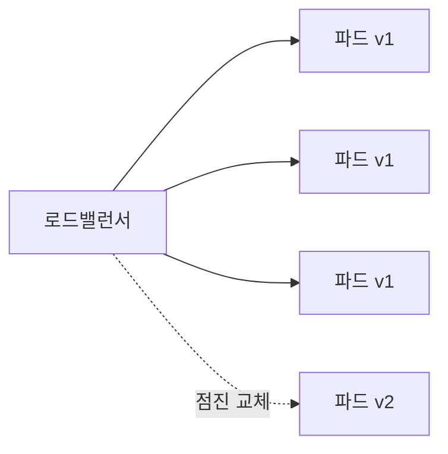
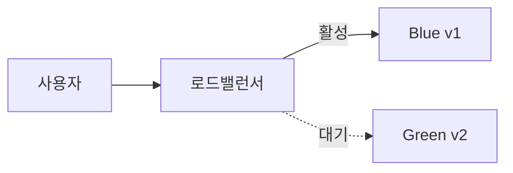
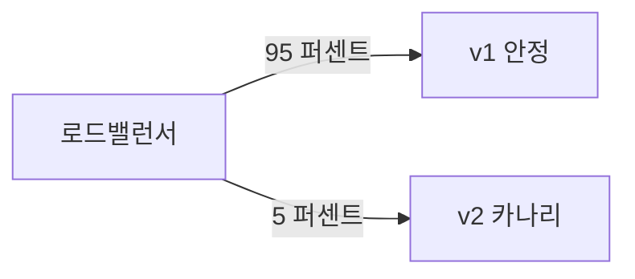
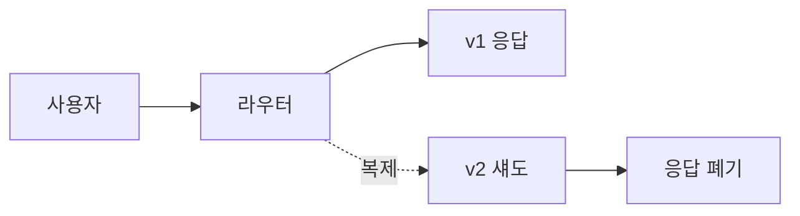
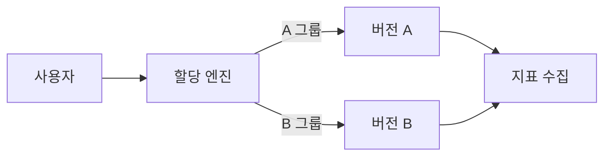
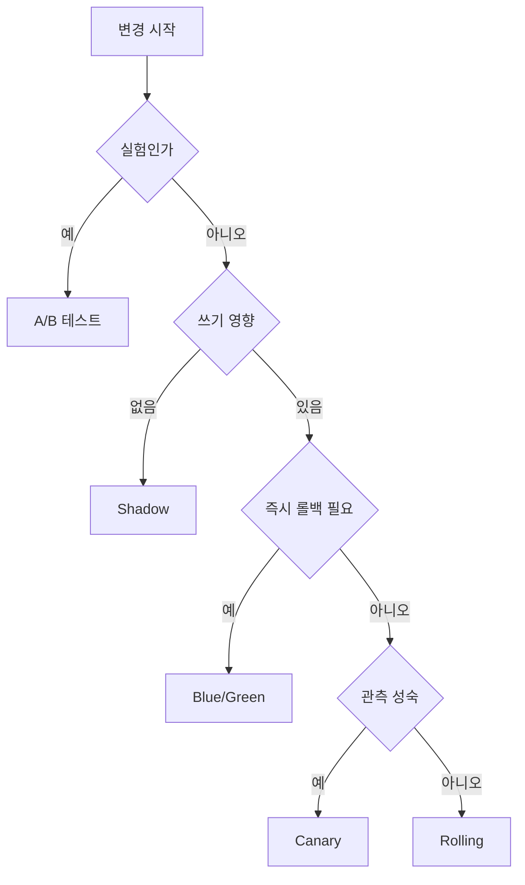

# 배포 전략

> 새 버전을 프로덕션에 도달시키는 **라우팅·노출 방식의 선택**. 전략이 다르면
> 위험 노출면·롤백 속도·인프라 비용·운영 복잡도가 모두 달라진다.
> "기본값 = Rolling"으로 시작해 트래픽·리스크·조직 성숙도에 따라 Canary ·
> Blue/Green · Shadow · A/B로 진화한다.

- **주제 경계**: 이 글은 **CI/CD 관점의 배포 전략** 자체를 다룬다
- **SLO·에러 버짓 기반 자동 롤백** → [`sre/`](../../sre/) 카테고리
- **구현 도구** → [Argo Rollouts](../progressive-delivery/argo-rollouts.md),
  [Flagger](../progressive-delivery/flagger.md),
  [Feature Flag](../progressive-delivery/feature-flag.md),
  [트래픽 분할](../progressive-delivery/traffic-splitting.md)

---

## 1. 배포 전략이 해결하는 문제

배포는 기술적으로 **두 개의 서로 다른 일**이 동시에 일어난다.

| 축 | 질문 |
|---|---|
| Release (릴리즈) | 새 버전이 사용자에게 **언제·얼마나** 노출되는가 |
| Deployment (배포) | 새 버전이 **어느 인프라 위치**에 설치되는가 |

전략 선택은 두 축의 분리를 얼마나 정교하게 할 것인가의 문제다. Feature Flag는
둘을 **완전히 분리**하고, 전통적 Big Bang은 **전혀 분리하지 않는다**. 나머지
전략은 그 사이 어딘가에 있다.

### 핵심 평가 축

| 축 | 설명 |
|---|---|
| 위험 노출 | 문제 발생 시 영향받는 사용자 비율 |
| 롤백 속도 | "원복" 버튼을 누른 뒤 실제 복구까지의 시간 |
| 인프라 비용 | 동시 실행 인스턴스 수의 배수 |
| 운영 복잡도 | 트래픽 분할·DB·세션 처리 난이도 |
| 피드백 품질 | 실사용 트래픽으로 얻는 신호의 정확도 |
| 실험 가능성 | 통계적 비교·가설 검증 가능 여부 |

---

## 2. Rolling (롤링) — 실무 기본값

### 2.1 정의

기존 인스턴스를 **일정 비율씩 새 버전으로 교체**한다. Kubernetes Deployment의
기본 전략이며, `maxSurge`·`maxUnavailable` 파라미터로 교체 속도를 조절한다.



### 2.2 Kubernetes 기본 예시

```yaml
spec:
  strategy:
    type: RollingUpdate           # 그 외 선택지: Recreate (다운타임 허용)
    rollingUpdate:
      maxSurge: 25%               # 동시에 추가 생성 가능한 비율
      maxUnavailable: 0           # 가용성 손실 없이 롤링
```

`Recreate` 전략은 기존 파드를 모두 종료한 뒤 새 버전을 기동한다. 다운타임을
허용하는 배치·개발 환경 또는 `ReadWriteOnce` PVC처럼 **동시 마운트 불가**인
워크로드에서 제한적으로 사용한다.

**주의**: `maxUnavailable: 0` + 빡빡한 PDB + 여유 리소스 부족 조합은 롤링이
영원히 멈추는 대표 패턴이다. 또한 **readinessProbe·preStop hook·
terminationGracePeriodSeconds**가 함께 설계되지 않으면 롤링 중 in-flight
요청이 잘린다. 상세는 [kubernetes/](../../kubernetes/) 리소스 문서 참조.

### 2.3 성질

| 축 | 값 |
|---|---|
| 위험 노출 | 중(점진적 — 첫 파드부터 사용자 트래픽 받음) |
| 롤백 속도 | 중(역방향 롤링 필요) |
| 인프라 비용 | 낮음(약 +maxSurge) |
| 운영 복잡도 | 낮음 |
| 피드백 품질 | 낮음(섞여서 분리 어려움) |

### 2.4 언제 쓰고 언제 쓰면 안 되는가

**쓸 때**: 변경이 작고 빈번한 내부 서비스, 리소스 여유가 제한적.
**쓰면 안 될 때**: 회귀 리스크가 큰 변경, 세션 어피니티가 중요한 경우,
다운스트림 API 스키마 변경. 롤백 시간이 길어 에러가 수 분간 지속된다.

---

## 3. Blue/Green — 즉시 전환·즉시 롤백

### 3.1 정의

동일한 용량의 **두 환경(Blue=현재, Green=신규)**을 유지하다 로드밸런서가
100% 트래픽을 순간 전환한다. 롤백은 LB를 다시 Blue로 돌리면 끝.



### 3.2 성질

| 축 | 값 |
|---|---|
| 위험 노출 | 전환 순간 100%(문제 있으면 즉시 전면 영향) |
| 롤백 속도 | 최고(LB 스위치) |
| 인프라 비용 | 2배(두 환경 병행 유지) |
| 운영 복잡도 | 중(DB·세션·캐시 일관성 관건) |
| 피드백 품질 | 중(Green에서 사전 검증 가능) |

### 3.3 언제 쓰고 언제 쓰면 안 되는가

**쓸 때**: 큰 변경을 한번에 전환해야 하고 롤백이 즉시 필요한 경우(금융·의료
규제 롤백 SLA), 스테이트리스 웹 앱.
**쓰면 안 될 때**: 인프라 비용 예산이 없을 때, Stateful 의존성이 큰 경우
(DB 스키마·메시지 큐 오프셋 등 공유 상태 처리 필요).

### 3.4 공유 데이터 계층 — 실무 최대 함정

"두 환경이라니까 DB도 두 개?" 는 거의 항상 틀린 모델이다. **DB는 공유**하고
**스키마는 Expand/Contract 패턴**으로 단계적으로 바꾸는 것이 표준.


| 단계 | 행동 |
|---|---|
| Expand | 구 스키마와 **호환되게** 새 컬럼·테이블·인덱스 **추가만** |
| Migrate | 양쪽 코드(Blue·Green)가 동시에 동작 가능한 상태 유지 |
| Contract | Green이 안정되고 Blue 제거 후 구 컬럼·제약 **제거** |

**중간 공존 단계의 세부 순서**: 단순히 "양쪽이 돈다"가 아니라 네 개의
서브스텝으로 분화된다.

1. 이중 쓰기(Dual Write): 신·구 컬럼에 동시 기록
2. 백필(Backfill): 기존 행의 신 컬럼을 채우는 배치
3. 읽기 전환: 애플리케이션이 신 컬럼을 읽도록 변경
4. 구 쓰기 제거: 코드에서 구 컬럼 쓰기 제거(배포)

이 네 단계를 각각 별도 배포로 끊어야 안전하다.

**절대 하지 말 것**: `DROP COLUMN`·`ALTER COLUMN TYPE`를 배포와 동시에.
Blue로 롤백 시 신 스키마에 없는 컬럼을 구 코드가 찾아 장애. Liquibase·
Flyway·Atlas 같은 마이그레이션 도구가 이 패턴을 강제한다.

### 3.5 세션·캐시 처리 — 두 번째로 자주 터지는 함정

DB 다음으로 흔한 사고가 세션과 캐시 계층이다.

| 계층 | 위험 | 실무 해법 |
|---|---|---|
| 세션 | Blue→Green 전환 시 로컬 세션 유실 | Redis 등 분산 스토어 공유, 또는 JWT stateless 전환 |
| L1/L2 캐시 | Green 쪽 콜드 캐시로 원본 DB 폭주 | 전환 전 예열(warm-up) 스크립트로 핫 키 조회 |
| CDN·엣지 캐시 | 구·신 응답이 섞여 유저별 상이 | 버전 키를 URL/Vary 헤더에 포함, 캐시 스탬피드 방지 |
| 커넥션 풀 | 전환 직후 연결 러시 | Green을 점진적으로 예열 후 LB 스위치 |

---

## 4. Canary — 점진적 노출과 관측

### 4.1 정의

트래픽의 **작은 비율(보통 1~5%)**만 새 버전(canary)으로 보내며 메트릭을
관찰한다. 이상 없으면 점차 비율을 올려 100%로 승격, 문제 있으면 즉시
되돌린다. "**탄광의 카나리아**"에서 유래.



### 4.2 관측 기반 승격 — Progressive Delivery

단순 시간 지연 승격이 아닌 **메트릭 분석 기반 자동 판정**이 글로벌 표준이다.
이를 Progressive Delivery라 부르며 Argo Rollouts·Flagger가 대표 구현.

| 분석 신호 | 판정 기준 예시 |
|---|---|
| Success rate | HTTP 5xx 비율 < 1% |
| Latency p99 | 기존 대비 +10% 이내 |
| 오류 버짓 소비율 | Burn rate < 2 |
| 비즈니스 KPI | 주문 성공률 드롭 없음 |

Argo Rollouts의 `AnalysisTemplate`, Flagger의 `MetricTemplate`이 이 신호들을
**PromQL·Datadog·New Relic** 쿼리로 정의하고, 파이프라인은 쿼리 결과에 따라
자동 승격·중단·롤백을 수행한다. 이것이 "배포 전략이 관측성과 만나는 지점"이다.

### 4.3 표본 크기와 관찰 윈도우

Canary의 효과는 충분한 표본이 있을 때만 통계적으로 의미가 있다.

| 기준 | 권장값 |
|---|---|
| 최소 관찰 윈도우 | 10~30분(느린 회귀·커넥션 누수 포착) |
| 최소 요청 수 | 수천 건 이상(5xx 0.1% 수준을 감지하려면 수만 건 필요) |
| 단계 스텝 | 1% → 5% → 25% → 50% → 100% 보편 |

QPS가 낮아 5%가 분당 수십 건이라면 Canary는 **판정 불가 영역**이다. 이 경우
내부 스테이징 강화·Shadow·Feature Flag 기반 소규모 노출이 더 적합하다.

### 4.4 성질

| 축 | 값 |
|---|---|
| 위험 노출 | 최저(처음엔 1~5%만 영향) |
| 롤백 속도 | 높음(트래픽 라우팅 되돌리기) |
| 인프라 비용 | 낮음(새 버전 인스턴스만 추가) |
| 운영 복잡도 | 높음(메트릭·분석·자동화 필요) |
| 피드백 품질 | 최고(실사용 트래픽으로 관측) |

### 4.5 언제 쓰고 언제 쓰면 안 되는가

**쓸 때**: 사용자 트래픽이 충분해 최소 관찰 윈도우 동안 유의미한 표본이
쌓이는 서비스, SLO와 관측성이 성숙한 팀.
**쓰면 안 될 때**: QPS가 낮아 5% 표본도 노이즈에 묻히는 서비스, 버전 간
데이터 스키마가 호환되지 않는 변경, 세션 어피니티가 필수인 경우.

### 4.6 Canary ≠ A/B ≠ Feature Flag

| 질문 | 도구 |
|---|---|
| "이게 **안전한가**?" (에러·지연) | Canary |
| "이게 **더 좋은가**?" (전환·매출) | A/B 테스트 |
| "누구한테·언제 **켤 것인가**?" | Feature Flag |

세 도구는 **레이어와 주인이 다르다**. Canary는 인프라·네트워크 계층
(SRE·플랫폼팀), Feature Flag는 애플리케이션 계층(개발·PM), A/B는 실험
플랫폼(데이터·프로덕트). 성숙한 조직은 세 가지를 겹쳐 사용한다: 내부 Feature
Flag로 테스트 → Canary 1~5%로 안전성 확인 → A/B 50:50으로 가치 측정.

---

## 5. Shadow (Traffic Mirroring) — 영향 없는 실측

### 5.1 정의

실사용 트래픽을 **복제**하여 새 버전으로도 흘려보내지만, **응답은 버린다**.
사용자는 전적으로 기존 버전의 응답만 받고, 새 버전은 동일한 부하·동일한
요청 패턴에서 어떻게 동작하는지 관측 대상으로만 쓰인다.



### 5.2 성질

| 축 | 값 |
|---|---|
| 위험 노출 | 0(응답이 사용자에 도달하지 않음) |
| 롤백 속도 | 불필요 |
| 인프라 비용 | 1배 + 섀도 환경(전부 같은 QPS 처리) |
| 운영 복잡도 | 최고(부작용 격리·외부 호출 방지) |
| 피드백 품질 | 최고(실부하 + 제로 리스크) |

### 5.3 쓸 수 있는 조건 — "부작용 없음"이 필수

Shadow는 **읽기 전용 또는 멱등 요청**에만 안전하다. 새 버전이 다음을 하면
즉시 프로덕션에 영향이 간다.

- DB에 쓰기(결제, 재고 차감, 외부 API 호출)
- 메시지 큐·이벤트 버스 발행
- 3rd party 결제·SMS·메일 발송
- 상태 변화를 유발하는 RPC

해결책: 섀도 환경의 다운스트림을 **모킹·스텁·읽기 전용 복제본**으로 대체.
Istio·Linkerd·Envoy·NGINX 모두 `mirror` 기능을 내장하며, **미러 응답은
fire-and-forget으로 폐기**된다. 세부 제어는 도구별로 다르다.

| 도구 | 비율 제어 | 바디·메서드 필터 |
|---|---|---|
| Istio | `mirrorPercentage` | VirtualService에서 `match` 조건으로 메서드 제한 |
| Envoy | `request_mirror_policies[].runtime_fraction` | `filter_state` 기반 선택 |
| NGINX | `split_clients` + `mirror` | `mirror_request_body on/off`로 바디 미러링 여부 |
| Linkerd | Flagger 연동(`canaryAnalysis.mirror`) | 메서드·경로 기반 조건부 미러 |

실무에서는 `GET`만 미러하고 `POST·PUT·DELETE`는 프로덕션만 받도록 라우트
조건을 건다. 또는 섀도 환경의 환경변수로 다운스트림 엔드포인트를 모킹 더블로
교체하는 **테스트 더블 주입** 패턴을 쓴다.

### 5.4 언제 쓰고 언제 쓰면 안 되는가

**쓸 때**: 대대적 리팩토링·엔진 교체·언어 전환 같은 "동작은 같아야 하는"
변경 검증. 예: 레거시 Java → Go 재작성.
**쓰면 안 될 때**: 쓰기 경로가 주된 서비스, 외부 결제가 포함된 흐름.

---

## 6. A/B 테스트 — 릴리즈가 아닌 실험

### 6.1 정의

사용자를 **세그먼트·룰·랜덤 할당**으로 분할해 서로 다른 버전을 보여주고
**비즈니스 지표의 차이**를 통계적으로 비교한다. 목적은 배포 안전이 아니라
**가설 검증**.



### 6.2 Canary와의 결정적 차이

| 축 | Canary | A/B |
|---|---|---|
| 질문 | 안전한가 | 더 나은가 |
| 지표 | 에러율, 지연 | 전환율, 매출, 체류시간 |
| 할당 방식 | 보통 랜덤 일부 | 세그먼트·룰 기반 |
| 수명 | 짧음(수분~수시간) | 김(수일~수주) |
| 종료 조건 | 메트릭 임계 통과 | 통계적 유의성 |
| 주 담당 | SRE·플랫폼 | 프로덕트·데이터 |

### 6.3 구현 위치

A/B 분기는 보통 **애플리케이션 계층**(Feature Flag)이나 **엣지 프록시**
(CDN·API Gateway)에서 이뤄진다. 동일 사용자가 항상 같은 그룹을 받도록
**일관 해시**(sticky)가 필요하다.

### 6.4 실험 설계의 함정

A/B 테스트의 실패 대부분은 수학이 아니라 **실험 설계**에서 온다.

- **엿보기(peeking)**: 매일 결과를 보고 유의해지는 순간 조기 종료 → 거짓
  양성 비율이 설정값을 훨씬 초과한다. 사전에 정한 표본 크기·기간을 지킨다
- **다중 비교**: 지표 10개를 동시에 보면 하나쯤은 우연히 유의해진다.
  본페로니 교정 또는 사전 지정 주지표
- **심슨 역설**: 전체와 세그먼트별 결과가 반대가 된다. 주요 세그먼트 분할
  분석을 병행
- **네트워크 효과**: 소셜·매칭·마켓플레이스에서 A 그룹 행동이 B 그룹에 영향.
  클러스터 단위(지역·그룹)로 할당

### 6.5 언제 쓰고 언제 쓰면 안 되는가

**쓸 때**: 검증할 **가설**이 있고 **통계적 검정력**이 가능한 트래픽.
**쓰면 안 될 때**: 단순 안전성 검증(Canary로 충분), 충분한 표본을 모으기
어려운 B2B 서비스.

---

## 7. 전략 비교 한눈에

| 전략 | 위험 노출 | 롤백 속도 | 비용 | 복잡도 | 대표 사용처 |
|---|---|---|---|---|---|
| Rolling | 중 | 중 | 낮음(+maxSurge) | 낮음 | K8s 기본값·빈번한 작은 변경 |
| Blue/Green | 순간 100% | 최고 | 2배 | 중 | 대형 변경 · 엄격한 롤백 SLA |
| Canary | 최저(1~5%) | 높음 | 낮음 | 높음 | 성숙한 SRE · 관측 기반 승격 |
| Shadow | 0 | 불필요 | 1~2배 | 최고 | 엔진 교체 · 리라이트 검증 |
| A/B | 분할 비율 | 실험 종료 | 중 | 중 | 가설 검증 · 비즈니스 실험 |

---

## 8. 실무 의사결정

### 8.1 "어떤 전략을 쓸까" 의사결정 트리



### 8.2 조합 전략 — 현실의 탑티어 모델

하나만 쓰지 않는다. **계층적으로 조합**하는 것이 현장의 기본이다.

1. **Feature Flag로 감싼 상태로 배포**(릴리즈/배포 분리)
2. **Rolling 또는 Blue/Green으로 인프라 갱신**
3. **Canary로 내부 사용자 → 1% → 5% → 25% → 100% 단계 승격**
4. **A/B로 가치 실험**(원하면)

### 8.3 자동 롤백의 기준

Canary·Progressive Delivery에서 승격·중단의 **자동 판정 조건**은 보통
SLO 기반이다. 이 영역은 SRE 카테고리의 영역이므로 여기서는 링크만.

- Burn rate 기반 빠른·느린 번
- 에러 버짓 소모율
- Multi-window, multi-burn-rate 알람

→ [`sre/`](../../sre/) 카테고리의 SLO·에러 버짓·번 레이트 문서를 참조.

---

## 9. 흔한 실패 패턴

| 실패 패턴 | 원인 | 방지 |
|---|---|---|
| Blue/Green에서 DB 스키마 호환성 붕괴 | 한 번에 DROP·ALTER | Expand/Contract 강제 |
| Canary 표본이 너무 작아 판정 불가 | QPS 부족 | 비율 상향 또는 Feature Flag 전환 |
| Shadow가 외부 결제 호출 중복 | 다운스트림 모킹 누락 | 멱등·읽기 전용 경로 한정 |
| 롤링 중 세션 파편화 | 세션 어피니티 없음 | Sticky 세션 또는 stateless화 |
| "성공"만 보고 승격 | 느린 회귀(메모리 누수·커넥션 풀) 놓침 | 최소 15분 이상 관찰·소크 |
| 롤백은 되지만 데이터 롤백은 안 됨 | 마이그레이션 역방향 없음 | Forward-only migration 문화 |
| A/B를 배포 전략으로 오인 | 가설·표본·해석 부재 | 실험 플랫폼으로 분리 |

---

## 10. 관련 문서

- [Argo Rollouts](../progressive-delivery/argo-rollouts.md) — K8s 네이티브 Progressive Delivery
- [Flagger](../progressive-delivery/flagger.md) — 메트릭 기반 자동 승격
- [Feature Flag](../progressive-delivery/feature-flag.md) — 릴리즈/배포 분리
- [트래픽 분할](../progressive-delivery/traffic-splitting.md) — Istio·Gateway API·Envoy
- [Pipeline as Code](./pipeline-as-code.md) — 이 전략들을 실행하는 파이프라인
- [GitOps 개념](./gitops-concepts.md) — 배포 결과 상태의 Git 기반 관리

---

## 참고 자료

- [Martin Fowler — BlueGreenDeployment](https://martinfowler.com/bliki/BlueGreenDeployment.html) — 확인: 2026-04-24
- [Martin Fowler — CanaryRelease](https://martinfowler.com/bliki/CanaryRelease.html) — 확인: 2026-04-24
- [Martin Fowler — Parallel Change (Expand/Contract)](https://martinfowler.com/bliki/ParallelChange.html) — 확인: 2026-04-24
- [Martin Fowler — FeatureToggle](https://martinfowler.com/articles/feature-toggles.html) — 확인: 2026-04-24
- [Google SRE Workbook — Chapter 16 Canarying Releases](https://sre.google/workbook/canarying-releases/) — 확인: 2026-04-24
- [HashiCorp — Zero-downtime deployments](https://developer.hashicorp.com/well-architected-framework/define-and-automate-processes/deploy/zero-downtime-deployments) — 확인: 2026-04-24
- [Argo Rollouts 공식](https://argoproj.github.io/rollouts/) — 확인: 2026-04-24
- [Flagger 공식](https://flagger.app/) — 확인: 2026-04-24
- [Istio — Traffic Mirroring](https://istio.io/latest/docs/tasks/traffic-management/mirroring/) — 확인: 2026-04-24
- [NGINX ngx_http_mirror_module](https://nginx.org/en/docs/http/ngx_http_mirror_module.html) — 확인: 2026-04-24
- [AWS — Blue/Green 스키마 변경 모범 사례](https://docs.aws.amazon.com/whitepapers/latest/blue-green-deployments/best-practices-for-managing-data-synchronization-and-schema-changes.html) — 확인: 2026-04-24
