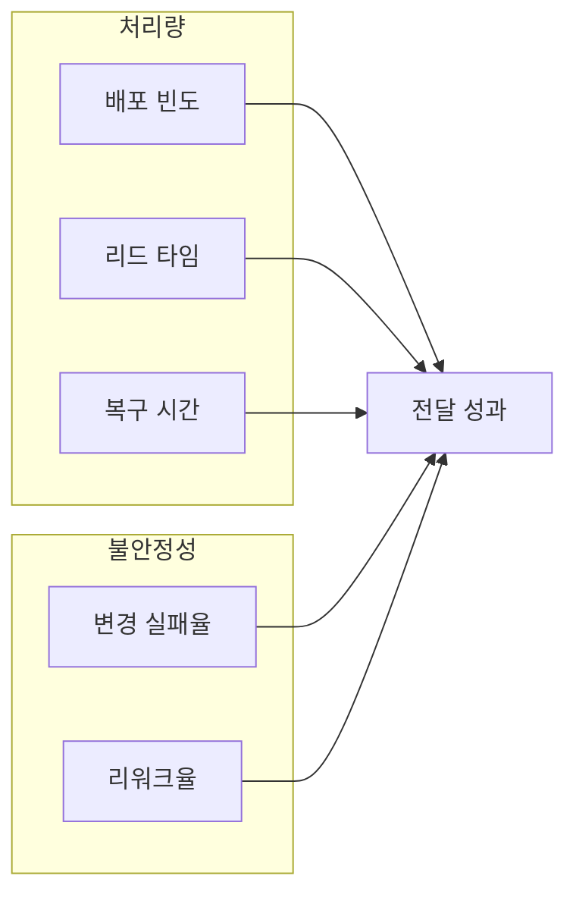
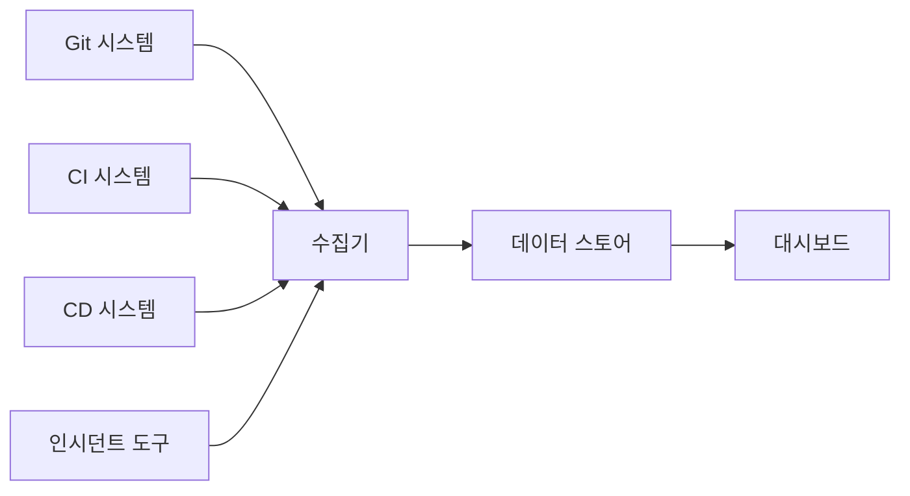

# DORA 메트릭

> DORA(DevOps Research and Assessment)가 10년 이상 연구로 추출한
> **소프트웨어 딜리버리 성과 지표**. 2024년 공식 가이드가 개정되어
> **처리량(Throughput) 3개 + 불안정성(Instability) 2개**의 5메트릭 모델로
> 바뀌었다. 원래 "Four Keys"로 불렸으나 현재는 **Deployment Rework Rate**가
> 정식 5번째 메트릭으로 편입되었고, Failed Deployment Recovery Time은
> 안정성에서 **처리량** 범주로 재분류되었다.

- **출처·권위**: Google Cloud 산하 DORA 팀, *Accelerate*(Nicole Forsgren,
  Jez Humble, Gene Kim) 정전
- **공식 리소스**: [dora.dev](https://dora.dev), 연간 [State of DevOps Report](https://dora.dev/research/)
- **주제 경계**: 이 글은 **메트릭 자체**를 다룬다. SLO·에러 버짓(유사해 보이나
  별개 개념)은 [`sre/`](../../sre/) 카테고리

---

## 1. DORA가 해결한 문제

"DevOps가 좋다"는 주장을 **데이터로 증명한** 것이 DORA의 기여다. 32,000개
이상 조직 데이터로 다음을 통계적으로 확인했다.

- **빠르게 자주 배포하는 팀이 더 안정적이다**(빈도 ↔ 안정성 트레이드오프는
  환상)
- 네 지표가 **함께** 좋을 때만 비즈니스 성과가 오른다
- 조직 문화·리더십·기술 실천이 네 지표를 결정한다

그 이전까지 엔지니어링 성과 측정은 "LoC"·"티켓 수" 같은 활동 지표에 머물러
있었다. DORA는 **성과(outcome) 지표**로 옮겨왔다.

---

## 2. 5개 지표 — 처리량과 불안정성

2024년 DORA 공식 가이드 개정으로 **4키 → 5메트릭** 모델로 전환되었다.
핵심 변화는 두 가지.

- **Deployment Rework Rate**가 정식 5번째 메트릭으로 추가
- **Failed Deployment Recovery Time**이 Stability에서 Throughput으로 이동
- "Stability" 카테고리 명칭이 **"Instability"**로 변경(높은 Rework·CFR =
  불안정성의 신호)



**처리량(Throughput)**: 얼마나 빠르고 자주 가치를 내보내는가 — 복구 속도도
"얼마나 빨리 가치로 되돌아오는가"로 보기에 이 범주.
**불안정성(Instability)**: 변경이 얼마나 깨지고 재작업을 유발하는가.

### 2.1 Deployment Frequency — 배포 빈도

정의: **프로덕션에 성공적으로 배포하는 빈도**. 특정 기간에 배포된 횟수의
평균 또는 중앙값.

| 측정 소스 | 예시 |
|---|---|
| CD 시스템 | ArgoCD sync 성공 이벤트, Jenkins 배포 잡 완료 |
| 레지스트리 | 프로덕션 태그로 승격된 이미지 수 |
| GitOps | main 브랜치 커밋 중 프로덕션 오버레이 변경 건 |
| 관측 도구 | Datadog/Grafana `deployment` 이벤트 |

**함정**: "배포"의 정의를 합의하지 않으면 숫자가 의미를 잃는다. 일반적으로
**고객에게 노출되는 변경**을 1회로 센다. Feature Flag로 감춘 채 올라간
배포를 빈도에 넣을지는 조직마다 다르다.

### 2.2 Lead Time for Changes — 리드 타임

정의: **코드 커밋부터 프로덕션 배포까지 걸리는 시간**. 요구사항 도출이
아니라 **코드 커밋 시점부터 측정**한다는 점이 결정적. 기획·기획 대기
시간을 섞으면 엔지니어링 성과와 제품 의사결정 성과가 뒤섞인다.

| 측정 소스 | 방법 |
|---|---|
| Git | 커밋 타임스탬프 → 배포 이벤트 타임스탬프 차이 |
| PR 플랫폼 | PR 생성·머지·배포 세 시점 체인 |
| 중앙값 사용 | 평균은 아웃라이어에 크게 요동, 중앙값·p90이 실무 표준 |

**원전 정의 vs 실무**: *Accelerate* 원문은 "code is committed"이지만, 단기
브랜치·스쿼시 머지가 표준인 2026년 실무에서는 **PR 머지 시점**을 시작점으로
쓰는 도구가 더 많다(GitHub Insights, GitLab Value Streams 기본값). 조직 내
정의를 먼저 합의한다.

**측정 단위**: 고성능 조직은 시간 단위, 저성능 조직은 주·월 단위까지 분포.

### 2.3 Failed Deployment Recovery Time (FDRT) — 복구 시간

정의: **실패한 배포가 유발한 서비스 영향을 복구하기까지의 시간**. 과거
"MTTR(Mean Time to Recover)"로 불렸으나 2024년 DORA 개정으로 **Failed
Deployment Recovery Time**으로 정의가 조여졌다(인시던트 전반의 복구가
아니라 **배포 기인** 복구에 한정).

**재분류 배경**: 2024 개정에서 FDRT는 Stability → Throughput으로 이동했다.
"리드 타임이 짧은 팀은 긴급 절차 없이도 수정을 빠르게 전개할 수 있다"는
이유로, 복구 속도도 결국 **처리량의 표현**이라는 관점이다.

| 포함 | 미포함 |
|---|---|
| 롤백 완료까지 시간 | 하드웨어 장애 복구 |
| 핫픽스 배포 완료까지 시간 | 외부 의존성(CSP) 장애 |
| 트래픽 차단·회복까지 시간 | 스케일 이슈 자가 해결 |

### 2.4 Change Failure Rate (CFR) — 변경 실패율

정의: **프로덕션 배포 중 장애·롤백·핫픽스를 유발한 비율**. "장애"의 정의는
조직에 맡겨지지만, 2025년 이후 DORA 보고서는 **"실패한 배포"를 명확히
정의**하라고 강조한다.

| 실패로 세는 것 | 세지 않는 것 |
|---|---|
| 즉시 롤백을 유발한 배포 | 사용자 영향 없는 내부 버그 |
| 핫픽스 배포가 필요했던 변경 | 검토 중 되돌린 PR |
| 프로덕션 인시던트 트리거 | 기능 플래그 off로 비활성 |

**측정 소스**: 인시던트 트래커(PagerDuty·Opsgenie) × 배포 이벤트 상관.

### 2.5 Deployment Rework Rate — 리워크율 (2024 추가 5번째 메트릭)

정의: **계획되지 않은 배포**(프로덕션 이슈로 인해 발생한 배포)의 **전체
배포 대비 비율**. CFR과 유사해 보이지만 결이 다르다.

- CFR = 실패한 변경의 비율
- Rework Rate = 계획 외 배포(핫픽스·긴급 수정)의 비율

**왜 추가되었나**: CFR만으로는 "계획된 정기 배포"와 "긴급 재작업"이 구분되지
않는다. Rework Rate는 **조직이 얼마나 자주 불 끄기를 하는가**를 드러낸다.

```text
Rework Rate = 계획 외 배포 수 / 전체 배포 수
```

측정 예: 한 주간 배포 50회 중 5회가 이슈 대응 핫픽스라면 Rework Rate 10%.

---

## 3. 성과 구간과 2025년 전환

### 3.1 전통적인 4단계 분류 (2024년까지)

DORA는 매년 클러스터 분석으로 성과 구간을 도출했다. **고정 임계값이 아니라
그 해 응답자 분포 기반 클러스터**라는 점이 중요하다.

| 지표 | Elite | High | Medium | Low |
|---|---|---|---|---|
| 배포 빈도 | 하루 여러 번 | 일~주 1회 | 주~월 1회 | 월~6개월 1회 |
| 리드 타임 | 1시간 미만 | 1일~1주 | 1주~1개월 | 1~6개월 |
| 변경 실패율 | 0~15% | 0~15% | 0~15% | 46~60% |
| 복구 시간 | 1시간 미만 | 1일 미만 | 1일 미만 | 1주~1개월 |

2024 보고서에서 Elite와 Low의 배경 격차는 **배포 빈도 182배, 복구 속도
2,293배**. 두 집단의 처리량·안정성 모두 상위가 월등함을 재확인했다.

### 3.2 2025년 아키타입 기반 전환

2025 State of DevOps Report는 4단계 분류를 **폐기**하고, 여러 holistic
측정값(burnout·friction·valuable work 시간 포함)을 기반으로 **7개
아키타입**으로 대체했다.

| 아키타입 | 성격 |
|---|---|
| Foundational Challenges | 기초 실천이 정착되지 않은 조직 |
| Legacy Bottleneck | 레거시 시스템이 처리량을 붙잡는 조직 |
| Constrained by Process | 프로세스 과잉이 속도를 저해하는 조직 |
| High Impact, Low Cadence | 영향은 크지만 배포 빈도가 낮음 |
| Stable and Methodical | 느리지만 안정적 |
| Pragmatic Performers | 균형 잡힌 실용적 팀 |
| Harmonious High-Achievers | 모든 축이 건강한 최상위 그룹 |

전환 이유:

- 팀마다 맥락이 너무 달라 단순 분류가 오해 유발
- AI 보조 코딩 보급으로 기존 임계값이 흔들림("AI는 강한 팀을 더 강하게,
  약한 팀을 더 약하게 만드는 증폭기" — 2025 보고서 핵심 메시지)
- "elite = 좋다" 프레임이 본질을 가림

실무 시사점: **4단계는 참고 프레임으로만 유지**하고 자기 조직의 **지표
추세**와 **맥락 기반 아키타입**을 우선 해석한다.

---

## 4. 사용자 경험과 신뢰성 — Reliability의 현 위상

Reliability는 2021년 "5번째 축"으로 도입되었으나, 2024 DORA 공식 가이드
개정 이후 **Four Keys의 정식 5번째 자리는 Rework Rate**가 차지했다.
Reliability는 DORA의 **정식 메트릭에서 빠지고 준메트릭(quasi-metric)**으로
남았다.

그럼에도 실무에서 Reliability를 측정 대시보드에 포함하는 것은 여전히
가치가 크다. 5메트릭이 모두 좋아도 **사용자가 느리거나 에러를 본다**면
딜리버리 성공이 비즈니스 실패로 끝나기 때문이다. SLO·SLI·가용성·지연 등
**사용자 경험 관점 성과**는 DORA 지표를 보완한다.

→ SLO·에러 버짓·번 레이트의 **개념과 수학**은 [`sre/`](../../sre/) 카테고리가
주인공. 여기서는 DORA 5메트릭 대시보드에 Reliability를 추가 축으로 붙일지
결정 근거만 짚는다.

---

## 5. DORA와 GitOps·Pipeline as Code의 관계

| 실천 | 기여하는 지표 | 메커니즘 |
|---|---|---|
| [Pipeline as Code](./pipeline-as-code.md) | Lead Time ↓, CFR ↓, Rework ↓ | PR 리뷰·자동 게이트·린트 |
| [GitOps](./gitops-concepts.md) | FDRT ↓, CFR ↓ | `git revert` 기반 롤백, 드리프트 자동 교정 |
| [배포 전략](./deployment-strategies.md)(Canary·Progressive) | CFR ↓, FDRT ↓, Rework ↓ | 관측 기반 자동 승격·중단 |
| Trunk-based Development | Deployment Frequency ↑, Lead Time ↓ | 단기 브랜치·연속 통합 |
| Feature Flag | CFR ↓, Rework ↓ | 릴리즈·배포 분리, 즉시 off 가능 |
| 자동화된 테스트 | CFR ↓ | 회귀 조기 감지 |
| SLO·관측성 | FDRT ↓ | 감지·진단 가속 |

DORA는 **원인이 아니라 결과 지표**다. 지표를 올리려면 위의 실천(capability)을
강화한다. 지표를 직접 건드리지 않는다.

---

## 6. 측정 방법

### 6.1 필수 데이터 소스



| 지표 | 주 소스 | 연관 소스 |
|---|---|---|
| Deployment Frequency | CD 시스템 배포 이벤트 | Git 태그, 레지스트리 |
| Lead Time | Git 커밋/머지·배포 타임스탬프 체인 | 이슈 트래커 |
| Failed Deployment Recovery Time | 인시던트 오픈·종료 시점 | 배포·롤백 이벤트 |
| Change Failure Rate | 인시던트 트래커 ↔ 배포 이벤트 | 롤백 커밋 |
| Rework Rate | 배포에 계획/비계획 라벨 | 인시던트·핫픽스 브랜치 이름 |

### 6.2 도구 생태계

| 범주 | 대표 도구 |
|---|---|
| 오픈소스 플랫폼 | Google [Four Keys](https://github.com/dora-team/fourkeys), Apache [DevLake](https://devlake.apache.org/) |
| 상용 DevEx 플랫폼 | DX, LinearB, Jellyfish, Swarmia, Sleuth, Faros AI |
| 관측성 연계 | Datadog DORA Metrics, Dynatrace, Grafana DORA 대시보드 |
| CI 플랫폼 내장 | GitLab Value Streams, GitHub Insights |

대부분의 도구는 **GitHub/GitLab + CI/CD + PagerDuty/Jira**를 어댑터로 붙여
자동 계산한다. 데이터 품질은 **배포 이벤트의 정확성·일관성**이 좌우한다.

### 6.3 CNCF [CDEvents](https://cdevents.dev/) 표준 활용

2026년 기준 CDEvents v0.4 배포 이벤트 스키마를 파이프라인이 발행하면 벤더
독립적인 DORA 측정이 가능해진다. Tekton·Jenkins·Argo·Flux가 어댑터 제공.

---

## 7. 흔한 측정 오류

| 오류 | 증상 | 교정 |
|---|---|---|
| "배포" 정의 모호 | 팀마다 다른 숫자 | 프로덕션 사용자 노출 기준으로 통일 |
| Lead Time을 요구사항부터 | 제품 의사결정 시간이 섞임 | 커밋 또는 PR 머지 시점부터 측정 |
| 평균값 사용 | 아웃라이어로 요동 | 중앙값·p90 표준화 |
| 인시던트-배포 매칭 실패 | CFR·FDRT·Rework 계산 불가 | 배포 ID를 인시던트에 태그 |
| 계획/비계획 배포 구분 없음 | Rework Rate 계산 불가 | 커밋·브랜치·배포 이벤트에 라벨 강제 |
| 기능 플래그 배포 포함 여부 불명확 | 숫자 왜곡 | 조직 규칙 명시 |
| 롤백을 "복구"로 카운트 | FDRT 좋아지나 Lead Time 악화 | 복구 시간의 종료 정의 문서화 |
| 환경별 집계 혼용 | 스테이징 배포가 프로덕션 지표에 섞임 | 환경 구분 강제 |

---

## 8. DORA 안티패턴 — 숫자의 함정

지표를 **목표**로 삼는 순간 Goodhart's Law가 발동한다.

### 8.1 게이밍 사례

- **배포 빈도 부풀리기**: 공백 수정 커밋을 배포로 밀어올려 숫자만 증가
- **롤백 남용**: 문제 생기면 즉시 롤백 → FDRT는 좋지만 Lead Time 악화, 가치
  전달 저하
- **인시던트 조기 종료**: 진짜 해결 전 티켓 닫아 FDRT 단축
- **핫픽스를 정기 배포로 위장**: 계획 외 배포를 계획 라벨로 속여 Rework Rate
  낮춤
- **지표 인플레이션**: 지표 계산 로직 자체를 유리하게 변경

### 8.2 구조적 오용

- **개인 평가 도구로 사용**: 가장 위험한 안티패턴. DORA는 **팀·조직 단위**
  지표다. 개인에 적용하면 심리적 안전이 무너지고 반드시 게이밍이 발생
- **비난·처벌 연계**: 낮은 점수 = 제재라는 신호가 주어지면 조직은 솔직한
  측정을 멈춘다
- **단일 지표 집착**: 배포 빈도만 올리면 CFR·Rework이 무너지고, CFR만 낮추면
  리드 타임이 폭발. **다섯 지표는 함께 본다**
- **숫자만 보고 원인 무지**: 지표는 신호일 뿐 **어떻게 개선할지는 지표 밖
  실천**(자동화·테스트·GitOps·문화)에 있다

### 8.3 팀별 비교의 주의

지표는 **팀 내 시계열**로 볼 때 가장 유용하다. 조직 내 팀 간 비교는 컨텍스트
(서비스 성숙도·트래픽·규제)가 달라 오해를 낳는다. 밴드(Elite/High/…)는
**개인적 벤치마크 참고**로 쓴다.

---

## 9. 실무 도입 로드맵

1. **이해관계자 정렬**: 리더십이 "게이밍·개인 평가에 쓰지 않음"을 **공개
   약속**. 이것 없이는 게이밍이 불가피
2. **"배포"·"실패"·"복구" 정의 문서화**: 한 페이지 규정으로 팀 전체 합의
3. **배포 이벤트 표준화**: CI/CD가 공통 스키마(CDEvents 권장)로 배포 이벤트
   발행
4. **데이터 수집 자동화**: Four Keys·DevLake 등 오픈소스로 PoC
5. **대시보드 2단계**: ① 파이프라인 운영자 (주간 추세), ② 리더십 (분기 요약)
6. **해석 루프**: 월간 회고에서 "**수치가 아니라 그 뒤의 실천**"을 논의
7. **개선 실천 선택**: 가장 막힌 지표 1개를 골라 연관 실천 강화 (예:
   Lead Time ↑ → PR 크기 축소, Trunk-based, 자동 테스트)
8. **외부 벤치마크와의 거리 감지**: DORA 연례 보고서 읽기, 업계 맥락 대비
9. **Reliability 보완**: SLO 기반 사용자 경험 지표를 DORA 5메트릭 대시보드
   옆에 나란히 표시(정식 메트릭이 아니라 보완 축)
10. **연 1회 정의 갱신**: 조직 성숙도에 따라 "실패"·"배포"·"계획 외"의 정의
    재조정

---

## 10. 관련 문서

- [Pipeline as Code](./pipeline-as-code.md) — Lead Time·CFR 개선 실천
- [GitOps 개념](./gitops-concepts.md) — MTTR 단축의 구조적 기반
- [배포 전략](./deployment-strategies.md) — Progressive Delivery로 CFR·MTTR 개선
- SLO·에러 버짓·번 레이트(신뢰성 심화) — [`sre/`](../../sre/) 카테고리

---

## 참고 자료

- [DORA 공식 허브](https://dora.dev/) — 확인: 2026-04-24
- [DORA — DORA metrics guide (5메트릭 모델 공식 정의)](https://dora.dev/guides/dora-metrics/) — 확인: 2026-04-24
- [DORA — Software delivery metrics: the four keys (역사)](https://dora.dev/guides/dora-metrics-four-keys/) — 확인: 2026-04-24
- [DORA — Metrics history](https://dora.dev/insights/dora-metrics-history/) — 확인: 2026-04-24
- [CD Foundation — The DORA 4 key metrics become 5](https://cd.foundation/blog/2025/10/16/dora-5-metrics/) — 확인: 2026-04-24
- [Faros AI — Rework Rate: the 5th DORA metric](https://www.faros.ai/blog/5th-dora-metric-rework-rate-track-it-now) — 확인: 2026-04-24
- [Google Cloud — 2025 DORA Report 발표](https://cloud.google.com/blog/products/ai-machine-learning/announcing-the-2025-dora-report) — 확인: 2026-04-24
- [Google Cloud — Use Four Keys](https://cloud.google.com/blog/products/devops-sre/using-the-four-keys-to-measure-your-devops-performance) — 확인: 2026-04-24
- [GitHub — dora-team/fourkeys](https://github.com/dora-team/fourkeys) — 확인: 2026-04-24
- [Apache DevLake](https://devlake.apache.org/) — 확인: 2026-04-24
- [InfoQ — DORA anti-patterns](https://www.infoq.com/articles/dora-metrics-anti-patterns/) — 확인: 2026-04-24
- [Octopus — 2024/25 DORA Report summary](https://octopus.com/devops/metrics/dora-metrics/) — 확인: 2026-04-24
- [RedMonk — DORA 2025 after AI](https://redmonk.com/rstephens/2025/12/18/dora2025/) — 확인: 2026-04-24
- [CDEvents](https://cdevents.dev/) — 확인: 2026-04-24
- 도서: *Accelerate* (Forsgren, Humble, Kim, 2018)
