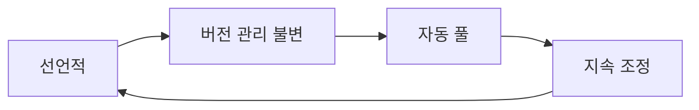
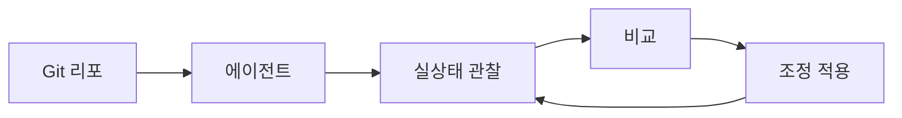
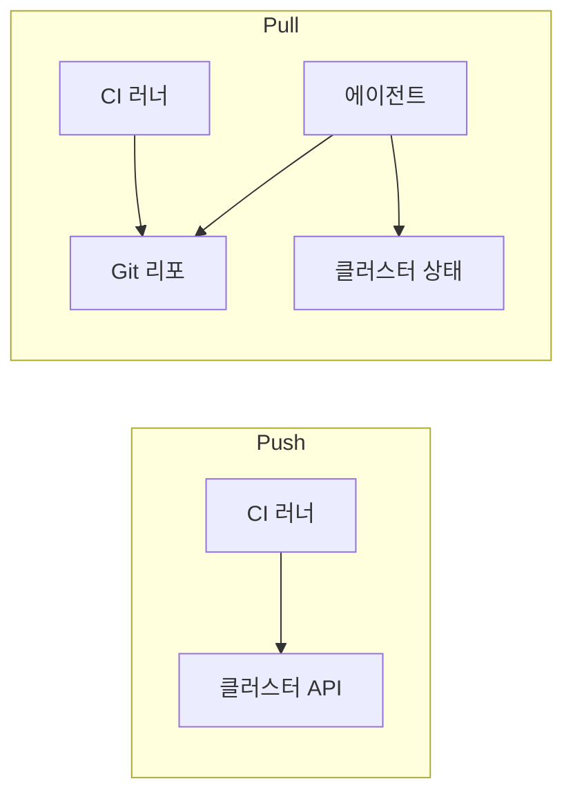
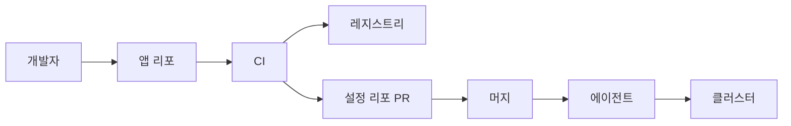

# GitOps 개념

> **Git을 시스템의 희망 상태(desired state)에 대한 단일 진실의 원천(SSOT)**으로
> 삼고, 클러스터 내부 에이전트가 그 상태를 지속적으로 당겨와(pull)
> 실상태와 조정(reconcile)하는 운영 모델. CNCF 산하 OpenGitOps 워킹 그룹이
> **네 가지 원칙**으로 이 정의를 표준화했다.

- **주제 경계**: 이 글은 "**원칙**"을 다룬다. 도구별 심화는
  [ArgoCD](../argocd/argocd-install.md)·[Flux](../flux/flux-install.md) 참조
- **관련 개념**: [Pipeline as Code](./pipeline-as-code.md)(파이프라인 정의의
  버전 관리)가 GitOps의 자매 개념
- **현재 표준**: ArgoCD·Flux 모두 CNCF Graduated(2022 승격)

---

## 1. 왜 GitOps인가

### 1.1 전통 CI/CD의 한계

"CI에서 이미지 빌드 → `kubectl apply` 또는 파이프라인이 원격 클러스터에
배포"라는 **push 모델**은 다음 문제를 안고 있다.

| 문제 | 구체적 증상 |
|---|---|
| 크리덴셜 분산 | 각 CI 러너가 프로덕션 클러스터에 대한 강력한 권한 보유 |
| 드리프트 불가시 | 누군가 `kubectl edit` 하면 Git과 실상태가 어긋남 |
| 롤백이 번거로움 | 이전 파이프라인 수동 재실행 또는 이미지 태그 추적 |
| 감사 추적 분산 | 배포 이벤트가 CI 로그·클러스터 이벤트로 흩어짐 |
| 네트워크 경계 위배 | CI가 클러스터 API에 인바운드 접근 필요 |

GitOps는 이 흐름을 뒤집는다. **CI는 아티팩트만 만들고, 클러스터 내부 에이전트가
Git에서 상태를 당겨와 스스로 조정한다**.

### 1.2 GitOps는 무엇을 약속하는가

- Git = 유일한 배포 진실: "지금 프로덕션에 뭐가 있지?" → `git show HEAD`
- 롤백 = `git revert` + 에이전트 재조정
- 드리프트 = 자동 감지·경고 또는 자동 교정
- 감사 = `git log`가 모든 변경의 단일 기록
- 네트워크 단순화 = 클러스터가 **아웃바운드**만 열어도 동작

---

## 2. OpenGitOps 네 가지 원칙

OpenGitOps 1.0(CNCF App Delivery TAG)이 2022년 정립하고 2026년에도 변경 없는
**정의의 기준**이다.



### 2.1 Declarative — 선언적

시스템의 희망 상태가 **선언적**으로 표현되어야 한다. "어떻게 만드는지"가
아니라 "**무엇이 있어야 하는지**"를 기술한다. YAML·JSON·HCL 등이 표준.

- Kubernetes 매니페스트·Helm 차트·Kustomize 오버레이
- Terraform HCL(IaC 영역과 겹침)
- Crossplane Composition

**비선언 금지**: `kubectl apply -f a.yaml && ./migrate.sh && kubectl scale ...`
같은 절차적 스크립트는 GitOps의 "선언적" 축을 깬다.

### 2.2 Versioned and Immutable — 버전 관리 불변

희망 상태가 **불변성과 완전한 변경 이력**을 보장하는 저장소에 보관되어야
한다. Git이 사실상의 표준(다른 VCS도 가능하나 생태계 도구는 Git 전제).

- 모든 변경은 커밋. 직접 수정 금지(브랜치 보호·PR 필수)
- 태그·브랜치로 환경 승격(dev → staging → prod) 표현
- 서명 커밋으로 무결성 강화 — GPG·SSH 서명(GitHub·GitLab 기본 지원)·
  Sigstore `gitsign`(keyless, OIDC 기반)의 세 갈래가 표준

### 2.3 Pulled Automatically — 자동 풀

에이전트가 **스스로 희망 상태를 Git에서 가져온다**. Git에 push하는 외부
시스템이 클러스터에 배포하지 않는다. 이것이 **pull 모델의 핵심**.

### 2.4 Continuously Reconciled — 지속 조정

에이전트가 실상태를 계속 관찰하고 희망 상태에 맞춘다. 드리프트가 생기면
**자동 감지하거나 자동 교정**한다. 단발성 `kubectl apply`가 아니라 **수렴
루프(control loop)**로 동작한다는 점이 결정적이다.



---

## 3. Pull vs Push 모델

### 3.1 핵심 차이



| 축 | Push (전통) | Pull (GitOps) |
|---|---|---|
| 트리거 | CI가 클러스터로 apply | 에이전트가 Git을 polling/webhook |
| 인증 방향 | CI → 클러스터 | 에이전트 → Git |
| 네트워크 | CI가 클러스터 API에 인바운드 | 클러스터가 Git에 아웃바운드만 |
| 크리덴셜 | 모든 CI 러너에 분산 | 에이전트만 보유(클러스터 내부) |
| 드리프트 감지 | 없음 | 내장 |
| 멀티 클러스터 | N개 크리덴셜 관리 | 각 클러스터가 자립 |
| 단순성 | CI 한 곳에서 끝 | CI/CD 경계 분리 필요 |

### 3.2 Pull이 보안상 더 우수한 이유

**공격면 축소**: Push 모델에선 CI 러너가 프로덕션 클러스터에 대한 관리자급
토큰을 가진다. 러너 하나 침해 = 전 클러스터 침해. Pull 모델에선 에이전트만
권한을 가지고, 그 에이전트는 **클러스터 내부에서 구동**되며 외부에 노출되지
않는다.

**네트워크 경계 단순화**: 온프레미스 방화벽·에어갭 환경에서 특히 큰 이익.
클러스터가 아웃바운드로 Git만 당기면 되기에 **인바운드 규칙이 필요 없다**.
에지 컴퓨팅·멀티 리전 환경에서 Pull이 사실상 유일한 선택.

### 3.3 Pull 모델의 운영 부담

보안 이점이 크지만 공짜는 아니다.

- **에이전트 자체가 HA 대상**: 컨트롤러가 죽으면 배포·드리프트 교정 정지.
  ArgoCD `application-controller` 샤딩, Flux 컨트롤러 복제 필요
- **부트스트랩 순환**: 에이전트가 자기 자신을 GitOps로 관리하려면 최초
  설치 경로가 필요. Cluster API·별도 관리 클러스터가 현실적 해법
- **폭발 반경 집중**: 에이전트 침해 = 모든 앱 재배포 권한 탈취. 에이전트
  네임스페이스·RBAC·토큰을 별도 경계로 취급

### 3.4 Push도 여전히 유효한 경우

- **비-K8s 타겟**: VM·서버리스·SaaS 설정 변경(에이전트를 상주시킬 곳이 없음)
- **일회성 파괴 작업**: DB 복구·수동 마이그레이션 같은 의도적 일회성 명령
- **아주 작은 단일 클러스터**: 에이전트 운영 비용이 이익보다 큰 경우

실무에서는 순수 Pull만 쓰는 경우는 드물다. **빌드·테스트는 Push(CI),
배포는 Pull(GitOps)** 식의 **하이브리드**가 대부분이다.

---

## 4. GitOps에서 CI와 CD의 경계

### 4.1 각자의 역할



| 단계 | 책임 |
|---|---|
| CI | 빌드·테스트·이미지·차트 아티팩트 생성 |
| 중간 | config 리포에 태그·버전 **참조 업데이트**(PR 또는 Image Updater) |
| CD | 에이전트가 config 리포에서 상태를 당겨 클러스터에 조정 |

"CI는 **아티팩트**를 만들고, CD는 **Git의 참조**를 바꾸고, 에이전트가
**실제 적용**한다"가 정석.

### 4.2 App 리포 vs Config 리포 — 일반적 두 갈래

| 모델 | 설명 | 장단 |
|---|---|---|
| 분리 | 앱 코드와 배포 매니페스트를 별 리포 | 권한·감사 분리 명확, PR 흐름 복잡 |
| 통합 | 한 리포에 `src/`와 `deploy/` 공존 | 단순, 작은 조직 적합, 권한 분리 약함 |

대형 조직은 "**앱 리포 N개 + Config 리포 1~소수 개**" 구조를 택한다.
App 리포 CI는 Config 리포에 PR을 만들고, 리뷰를 거쳐 머지되면 에이전트가
반영. **배포 권한 = Config 리포 쓰기 권한**이라는 단순한 관계가 성립한다.

### 4.3 이미지 태그 자동화

이미지 태그를 사람이 Config 리포에 손으로 쓰는 대신 자동화하는 도구.

| 도구 | 방식 |
|---|---|
| ArgoCD Image Updater | 레지스트리 스캔 → Git 쓰기 또는 Argo CM 갱신 |
| Flux Image Automation | ImagePolicy·ImageRepository·ImageUpdateAutomation 3개 CR |
| Renovate | Git PR 기반, Helm values·Kustomize 이미지 태그 업데이트 |

자동화 정책: SemVer 필터(`^1\.\d+\.\d+$`), 채널(`stable`·`preview`),
digest 핀. "모든 latest"는 GitOps가 Immutable을 깨는 전형적 경로.

---

## 5. 대표 구현 — ArgoCD vs Flux

두 도구 모두 CNCF Graduated다. 목적은 같지만 철학이 다르다.

| 축 | ArgoCD | Flux |
|---|---|---|
| 아키텍처 | 중앙 컨트롤 플레인(hub-and-spoke) | 분산 컨트롤러 세트(GitOps Toolkit) |
| UI | 강력한 웹 UI | 주로 CLI, UI는 Weave GitOps 등 별도 |
| 멀티 클러스터 | ApplicationSet, Agent(신규) | 각 클러스터 자립, Flux CLI 부트스트랩 |
| 동기화 정책 | 수동/자동, self-heal 옵션 | 자동, 지속 조정 전제 |
| RBAC | 자체 RBAC 레이어(+ K8s RBAC) | K8s RBAC 위주 |
| 인증 | SSO(OIDC, SAML) | K8s ServiceAccount 중심 |
| 사용 궁합 | 플랫폼팀이 중앙에서 "GitOps as a Service" | 팀별 자립 클러스터, 에지·에어갭 |

**선택 기준 요약**

- 플랫폼 팀이 중앙에서 여러 팀·여러 클러스터에 **일관된 GitOps 제공** → ArgoCD
- 팀이 자기 클러스터를 **자립적으로 운영**, 또는 에지·에어갭 → Flux
- 비교 상세: [ArgoCD](../argocd/argocd-install.md),
  [Flux](../flux/flux-install.md) 자매글 참조

---

## 6. 드리프트와 조정

### 6.1 드리프트의 원천

| 원인 | 예시 |
|---|---|
| 수동 변경 | `kubectl edit`, `kubectl scale` |
| 뮤테이팅 웹훅 | sidecar 주입, 라벨 추가 |
| 컨트롤러 수정 | HPA·VPA가 replicas 변경 |
| 운영자 치환 | 다른 오퍼레이터가 동일 리소스 관리 |
| 시간 기반 | 자동 시크릿 회전, 인증서 갱신 |

### 6.2 세 가지 대응

1. **Warn-only**: 드리프트를 감지하고 알림만 (사람이 판단)
2. **Auto-heal**: 에이전트가 Git 상태로 자동 되돌림
3. **Ignore**: 특정 필드 무시 설정(HPA replicas 등)

**실무 원칙**: `replicas`·HPA 관리 필드·`resourceVersion` 같은 **런타임 변경이
정상**인 필드는 무시 규칙을 **명시적으로** 설정. 무시 규칙은 커멘트로 "왜
무시하는지" 남긴다. 무지성 `ignoreDifferences` 남발은 안티패턴.

### 6.3 조정 주기 튜닝

| 설정 | 흔한 값 | 고려 사항 |
|---|---|---|
| Git polling 간격 | ArgoCD 기본 3분, Flux는 `interval` 필수 필드(예제 1분) | Webhook 연결 시 거의 실시간 |
| 클러스터 재조정 간격 | ArgoCD 3분, Flux 사용자 지정 | 너무 짧으면 API 서버 부하 |
| 동시 애플리케이션 수 | 조직 규모에 따라 | ArgoCD sharding, Flux 인스턴스 분리 |

---

## 7. 시크릿과 GitOps — 원초적 긴장

"모든 상태가 Git에 있어야 한다"와 "시크릿은 평문 금지"는 정면 충돌한다.
글로벌 스탠다드는 **암호화된 시크릿만 Git에 커밋**하거나 **참조만 Git에
두고 실값은 외부 보관소**에서 주입한다.

| 접근 | 도구 | 특징 |
|---|---|---|
| 암호화된 시크릿 커밋 | Sealed Secrets | 클러스터의 개인키로만 복호화 |
| 파일 단위 암호화 | SOPS + age/KMS | Helm·Kustomize 공존 용이 |
| 외부 보관소 참조 | External Secrets Operator + Vault | 실값은 Vault, Git엔 참조 CR |
| CSI 드라이버 | Secret Store CSI Driver | 파일시스템으로 주입, etcd에 없음 |

→ 시크릿 도구의 주인공은 [`security/`](../../security/) 카테고리. 여기서는
"GitOps와의 관계"만 다룬다.

---

## 8. 안티패턴

| 안티패턴 | 증상 | 교정 |
|---|---|---|
| 평문 시크릿 커밋 | `password: abc123`이 Git에 | Sealed Secrets·ESO |
| "한 번만" 수동 수정 | `kubectl edit`로 긴급 수정 후 Git과 어긋남 | self-heal 활성화, 긴급 경로도 PR로 |
| 드리프트 경고 억제 | `ignoreDifferences`를 사유 없이 추가 | 코멘트 강제, 주기 감사 |
| 모노 Config 리포의 권한 일괄 관리 | 전체 쓰기 권한 하나 | CODEOWNERS·폴더별 권한 분리 |
| `latest` 이미지 태그 | Immutable 원칙 붕괴 | Digest 핀 또는 SemVer 고정 |
| 환경별 설정을 브랜치로 관리 | 머지 지옥, cherry-pick | Kustomize 오버레이·Helm values 환경 파일 |
| ArgoCD를 또 다른 ArgoCD가 관리 | 부트스트랩 순환 | 별도 관리 클러스터 또는 Cluster API |
| Config 리포에 앱 빌드 산출물 | 바이너리 체크인, 용량 증가 | 레지스트리 분리, 리포는 선언만 |
| 자동 sync prune 무고려 | 실수 커밋 삭제로 리소스 소실 | 보호 주석, 단계적 승격 |

---

## 9. 리포지토리 구조 패턴

규모와 조직 모델에 따라 갈린다. **정답은 없고** 다만 일관성과 소유권이
분명해야 한다.

### 9.1 소규모 — 단일 Config 리포

```
cluster-config/
├── bootstrap/              # ArgoCD/Flux 자체
├── infrastructure/         # ingress, cert-manager, monitoring
├── apps/
│   ├── team-a/
│   └── team-b/
└── environments/
    ├── dev/
    ├── staging/
    └── prod/
```

### 9.2 환경 승격 — 오버레이 기반

환경별을 **브랜치로 분리**하면 cherry-pick 지옥이 온다. 정답은 **디렉터리
오버레이**(Kustomize overlays 또는 Helm 환경 values). dev → staging → prod
승격이 "이미지 태그 파일 1줄 갱신 PR"로 표현된다.

```
apps/service-x/
├── base/                 # 공통 매니페스트
└── overlays/
    ├── dev/
    │   └── image-tag.yaml    # v1.2.3-rc1
    ├── staging/
    │   └── image-tag.yaml    # v1.2.3-rc1
    └── prod/
        └── image-tag.yaml    # v1.2.2
```

승격 = `overlays/prod/image-tag.yaml`의 태그를 staging과 동일하게 바꾸는 PR.
ArgoCD Image Updater·Renovate·Flux Image Automation이 이 PR을 자동화한다.

### 9.3 Hydrated Manifests 패턴 — 2024~2026 확산 트렌드

Helm·Kustomize를 에이전트가 매번 렌더링하는 대신, **CI가 렌더링 결과를
별도 브랜치/리포에 커밋**해 에이전트는 순수 YAML만 적용하는 패턴. Akuity,
Google `config-sync`, KubeCon 2024~2025 세션들에서 표준화 움직임.

| 장점 | 단점 |
|---|---|
| 실제 적용될 YAML을 PR에서 그대로 리뷰 가능 | 두 개의 Git 경로 유지 |
| 렌더링 에러가 배포 시점이 아닌 CI에서 노출 | 파이프라인 복잡도 증가 |
| 에이전트 리소스 사용량 감소 | 오버레이 투명성이 낮아질 수 있음 |
| OPA·Kyverno 정책 검증이 하이드레이션 단계에서 가능 | 주요 도구(ArgoCD Source Hydrator 등) 기능 성숙도 편차 |

### 9.4 중~대규모 — 앱 리포 + Config 리포 분리

```
app-service-x/              # 앱 리포
├── src/
└── .github/workflows/      # CI: 이미지 빌드, config 리포에 PR

platform-config/            # Config 리포
├── clusters/
│   ├── prod-us-east/
│   └── prod-eu-west/
└── apps/
    └── service-x/
        ├── base/
        └── overlays/
```

CODEOWNERS로 폴더별 리뷰어를 강제. 플랫폼팀은 `clusters/`·`infrastructure/`,
제품팀은 각자의 `apps/<name>/` 소유.

---

## 10. GitOps 도입 로드맵

1. **선언화**: 기존 절차적 배포 스크립트를 Helm·Kustomize로 정리
2. **CI/CD 분리**: CI는 이미지까지만, 배포 호출 제거
3. **Config 리포 분리**: 앱과 배포 매니페스트를 다른 리포 또는 별 디렉터리로
4. **파일럿 팀 1곳 선정**: ArgoCD 또는 Flux 설치, 한 앱만 관리
5. **드리프트 정책 수립**: warn-only로 시작 → 안정되면 self-heal
6. **시크릿 전략 결정**: Sealed Secrets·SOPS·ESO 중 1개 표준화
7. **이미지 자동화**: Image Updater·Flux Image Automation 또는 CI가 직접 PR
8. **부트스트랩 자동화**: 클러스터 생성 즉시 에이전트가 자기 상태 당김
9. **감사·경보 정비**: 동기화 실패·드리프트에 대한 알림 채널 설정
10. **점진 확산**: 다른 팀·다른 클러스터로 표준 패턴 복제

---

## 11. 관련 문서

- [Pipeline as Code](./pipeline-as-code.md) — 파이프라인 정의의 버전 관리
- [배포 전략](./deployment-strategies.md) — GitOps 위에서 실행할 전략
- [DORA 메트릭](./dora-metrics.md) — GitOps가 개선하는 지표
- [ArgoCD 설치](../argocd/argocd-install.md) · [ArgoCD App](../argocd/argocd-apps.md)(ApplicationSet 포함)
- [Flux 설치](../flux/flux-install.md)
- [Image Updater](../argocd/argocd-image-updater.md)
- [Argo Rollouts](../progressive-delivery/argo-rollouts.md)·[Flagger](../progressive-delivery/flagger.md) — GitOps 위 Progressive Delivery
- 시크릿 도구: [security/](../../security/)

---

## 참고 자료

- [OpenGitOps 공식](https://opengitops.dev/) — 확인: 2026-04-24
- [OpenGitOps Principles v1.0.0](https://github.com/open-gitops/documents/blob/v1.0.0/PRINCIPLES.md) — 확인: 2026-04-24
- [OpenGitOps Glossary](https://github.com/open-gitops/documents/blob/main/GLOSSARY.md) — 확인: 2026-04-24
- [Argo CD 공식 문서](https://argo-cd.readthedocs.io/) — 확인: 2026-04-24
- [Flux 공식 문서](https://fluxcd.io/) — 확인: 2026-04-24
- [Codefresh — Top 30 ArgoCD Anti-Patterns](https://codefresh.io/blog/argo-cd-anti-patterns-for-gitops/) — 확인: 2026-04-24
- [Platform Engineering — GitOps patterns & anti-patterns](https://platformengineering.org/blog/gitops-architecture-patterns-and-anti-patterns) — 확인: 2026-04-24
- [CNCF — Add GitOps without throwing out CI tools](https://www.cncf.io/blog/2022/08/10/add-gitops-without-throwing-out-your-ci-tools/) — 확인: 2026-04-24
