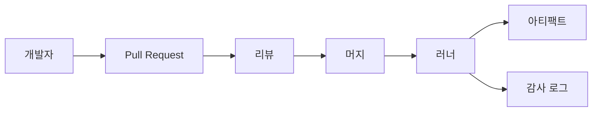
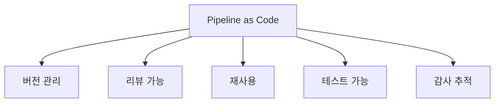

# Pipeline as Code

> CI/CD 파이프라인 정의를 **애플리케이션 소스 리포지토리에 코드로 저장**하고,
> 다른 모든 코드처럼 리뷰·버전 관리·롤백·테스트 대상으로 다루는 실천 방식.
> UI 클릭으로 파이프라인을 구성하던 시대의 "누가 언제 무엇을 바꿨는지 아무도
> 모르는" 문제를 Git 한 군데에 수렴시키는 것이 본질이다.

- **공통 표기**: `.github/workflows/*.yml`, `Jenkinsfile`, `.gitlab-ci.yml`,
  `.tekton/*.yaml`, `azure-pipelines.yml`, `.circleci/config.yml`
- **핵심 속성**: 선언적(Declarative) · 버전 관리(Versioned) · 리뷰 가능(Reviewable)
  · 재사용 가능(Reusable) · 테스트 가능(Testable)
- **관련 개념**: [GitOps](./gitops-concepts.md)(배포 결과 상태를 Git으로 관리) 와
  PaC(파이프라인 *정의* 를 Git으로 관리)는 서로 보완 관계다

---

## 1. 왜 Pipeline as Code인가

### 1.1 UI 기반 파이프라인이 무너지는 지점

수년간 CI/CD는 "GUI로 잡을 만들고, 잡에서 단계를 클릭하고, 저장"이 표준이었다.
팀 하나·서비스 하나·사람 한 명일 때는 충분히 동작한다. 팀이 5개·서비스 30개·
엔지니어 50명으로 커지는 순간, UI 파이프라인은 거의 모든 장애의 출발점이 된다.

| 증상 | UI 파이프라인의 문제 | PaC가 해결하는 방식 |
|---|---|---|
| "누가 언제 바꿨는지 모름" | 변경 이력 없음 | `git log`가 답 |
| "프로덕션과 스테이징 파이프라인이 달라짐" | 수동 동기화 | 같은 템플릿·다른 파라미터 |
| "리뷰 없이 배포 절차가 바뀜" | 저장 = 적용 | Pull Request로 강제 |
| "장애 시 이전 파이프라인으로 되돌릴 수 없음" | 롤백 불가 | `git revert` 가능 |
| "DR 복구 시 파이프라인을 처음부터 다시 구성" | 수동 재현 | 코드로 즉시 복원 |
| "50개 서비스 보안 패치에 50개 PR 필요" | 개별 수정 | 템플릿 1회 수정 |

Copy-paste 파이프라인(서비스 50개 = 거의 같은 YAML 50개)은 DRY 원칙을 정면으로
위반하며, 보안 수정 1건이 50개 PR로 퍼지는 전형적 안티패턴이다.

### 1.2 Git을 단일 진실의 원천(SSOT)으로

PaC의 진짜 이득은 "YAML로 썼다"가 아니라 **모든 변경이 Git 워크플로의 제약을
받는다**는 데 있다.



- 리뷰어는 단계·권한·시크릿 사용처를 사전 검토한다
- CI 자체가 PaC 파일의 린트·검증을 실행한다(파이프라인이 파이프라인을 검증)
- 머지 커밋 = 배포 절차 변경의 공식 감사 기록이다

---

## 2. 선언적(Declarative) vs 명령형(Imperative)

### 2.1 접근 방식의 차이

| 축 | 선언적 | 명령형 |
|---|---|---|
| 표현 | "**무엇(what)**을 원하는지" | "**어떻게(how)** 할지" |
| 문법 | YAML/HCL, 제한된 DSL | 범용 스크립트(Groovy, JS) |
| 구조 | 플랫폼이 강제한 틀 | 자유로운 제어 흐름 |
| 린트·검증 | 스키마 검증 가능 | 실행해야 판단 |
| 학습 곡선 | 낮음 | 언어 학습 필요 |
| 유연성 | 정해진 범위 내 | 거의 무한 |
| 디버깅 | 단계 단위 로그 | 콜 스택 추적 |
| 대표 예 | GitHub Actions, Tekton, Argo Workflows, GitLab CI | Jenkins Scripted, Bash 파이프라인 |

### 2.2 Jenkins — 두 진영이 공존하는 케이스

Jenkins는 Declarative Pipeline과 Scripted Pipeline을 모두 지원한다. 런타임
엔진은 같고 표현 방식만 다르다.

```groovy
// Declarative — 구조가 강제됨, 문법 검증 쉬움
// 프로덕션 Jenkins는 controller 고정 에이전트보다 K8s Plugin 기반
// ephemeral pod agent가 기본값이다 (불변·격리)
pipeline {
  agent {
    kubernetes {
      yaml '''
        spec:
          containers:
            - name: build
              image: eclipse-temurin:21-jdk
      '''
    }
  }
  stages {
    stage('build') { steps { sh './gradlew build' } }
    stage('test')  { steps { sh './gradlew test' } }
  }
  post {
    failure { mail to: 'sre@example.com', subject: 'build failed' }
  }
}
```

```groovy
// Scripted — 완전한 Groovy, 로직 자유도 최대
node('linux') {
  try {
    stage('build') { sh './gradlew build' }
    stage('test')  { sh './gradlew test' }
  } catch (e) {
    mail to: 'sre@example.com', subject: 'build failed'
    throw e
  }
}
```

**선택 기준**

- 단순·반복 파이프라인 → Declarative (대부분의 케이스)
- 복잡한 조건·동적 스테이지·루프가 꼭 필요 → Scripted
- 실무 기본값은 Declarative로 시작 → 한계 닥치면 `script {}` 블록으로
  부분적 명령형 도입 → 전체 Scripted 전환은 최후 수단

### 2.3 왜 대다수 플랫폼이 선언적으로 수렴했는가

- **도구가 이해 가능**: 린터·IDE·정책 엔진(OPA)이 스키마를 읽고 분석한다
- **AI 친화적**: LLM 기반 생성·리뷰·마이그레이션이 쉽다
- **벤더 중립 가능성**: 스키마만 맞추면 다른 러너로 이식 가능(CNCF
  [CDEvents](https://cdevents.dev/)가 추구하는 방향)
- **보안 분석 용이**: 정적 분석으로 권한·시크릿 사용 추적 가능

---

## 3. 파이프라인 정의 파일이 사는 곳

PaC는 "파이프라인 파일이 **애플리케이션 리포지토리 안에** 있다"는 원칙을
공유한다. 플랫폼마다 관례가 정해져 있고, 이 관례를 벗어나면 플랫폼의 자동
감지·웹훅·UI 통합이 모두 깨진다.

| 플랫폼 | 경로 | 파일 형식 |
|---|---|---|
| GitHub Actions | `.github/workflows/*.yml` | YAML |
| GitLab CI | `.gitlab-ci.yml` (루트) | YAML |
| Jenkins | `Jenkinsfile` (루트) | Groovy DSL |
| Tekton (Pipelines-as-Code) | `.tekton/*.yaml` | Tekton YAML |
| Azure Pipelines | `azure-pipelines.yml` (루트) | YAML |
| CircleCI | `.circleci/config.yml` | YAML |
| Buildkite | `.buildkite/pipeline.yml` | YAML |
| Argo Workflows | 리포지토리 자유, 보통 `manifests/` | YAML |

**Tekton Pipelines-as-Code**는 2026년 3월 Tekton 조직 공식 프로젝트로 승격되어,
K8s 네이티브 환경에서 Git Provider(GitHub/GitLab/Bitbucket/Forgejo) 이벤트를
받아 `.tekton/` 디렉터리의 정의를 자동 실행하는 표준 경로를 제시한다.

---

## 4. Pipeline as Code의 핵심 가치

### 4.1 다섯 가지 약속



1. **버전 관리(Versioned)**: 모든 변경이 커밋으로 남는다. 이전 파이프라인으로
   돌아가려면 `git revert` 한 번. UI에는 이 개념 자체가 없다.
2. **리뷰 가능(Reviewable)**: 배포 절차 변경이 PR로 제안되고, 코드 리뷰어가
   보안·비용·성능을 검토한다. "누군가 UI에서 권한을 올렸다"는 사고를 근본
   차단한다.
3. **재사용(Reusable)**: 재사용 워크플로·공통 템플릿·Shared Library로 동일
   단계를 한 곳에서 정의한다. 보안 패치는 템플릿 1개만 수정한다.
4. **테스트 가능(Testable)**: 파이프라인 자체에 대해 lint·Policy Check·
   Dry-run을 돌린다. `actionlint`, `kube-linter`, OPA conftest 등. 로컬
   개발 루프로는 GitHub Actions `act`, GitLab `gitlab-runner exec`, Tekton
   `tkn bundle`, Jenkins `Replay` 기능이 표준. 프로덕션 시크릿 없이
   스테이징 러너에서 PR 파이프라인을 shadow 실행하는 것이 탑티어 조직의
   관례다.
5. **감사 추적(Auditable)**: `git blame`이 "누가 언제 왜" 이 단계를 넣었는지
   즉답한다. 규제 산업(금융·의료·공공)의 SOX/HIPAA/GDPR 감사 대응 기초다.

### 4.2 DevOps 4대 원칙과의 연결

| 원칙 | PaC가 기여하는 지점 |
|---|---|
| Immutable Infrastructure | 파이프라인도 불변·재현 가능 |
| Shift-Left | 보안·품질·정책 검사가 CI 단계에 들어감 |
| GitOps | PaC는 GitOps 문화의 CI 쪽 구현 |
| DORA 메트릭 | PR 기반 변경 = Lead Time 추적 가능, `git revert` = MTTR 단축, 템플릿 린트 = CFR 감소 |

---

## 5. 재사용성 패턴

파이프라인을 재사용하지 않으면 PaC는 단지 "YAML로 적힌 복붙 지옥"이 된다.
플랫폼별로 재사용 수단이 갈린다.

### 5.1 플랫폼별 재사용 수단

| 플랫폼 | 단계 단위 재사용 | 파이프라인 전체 재사용 |
|---|---|---|
| GitHub Actions | Composite Action | Reusable Workflow (`workflow_call`) |
| GitLab CI | `extends` · `!reference` | `include` (file/project/template/remote) |
| Jenkins | Shared Library 함수 | Shared Library 전체 Pipeline |
| Tekton | Task 리소스 | Pipeline 리소스, Remote Resolver |
| Azure Pipelines | `template: steps.yml` | `template: pipeline.yml` |

### 5.2 GitHub Actions — Composite vs Reusable Workflow

```yaml
# Composite Action — 여러 step을 한 묶음으로 재사용
# .github/actions/setup-and-test/action.yml
runs:
  using: composite
  steps:
    - uses: actions/setup-node@v4
      with: { node-version: 20 }
    - run: npm ci && npm test
      shell: bash
```

```yaml
# Reusable Workflow — 잡 전체를 재사용 (호출자에서 on: workflow_call)
# .github/workflows/ci-shared.yml
on:
  workflow_call:
    inputs:
      env: { type: string, required: true }
    secrets:
      registry-token: { required: true }
jobs:
  build:
    runs-on: ubuntu-latest
    steps:
      - uses: actions/checkout@v4
      - run: ./build.sh --env=${{ inputs.env }}
```

| 축 | Composite Action | Reusable Workflow |
|---|---|---|
| 재사용 단위 | step 묶음 | job 묶음 (여러 job 가능) |
| 호출 위치 | `steps:` 내부 | `jobs.<id>.uses:` |
| 시크릿 전달 | 호출자 환경 공유 | `secrets:` 명시적 전달 |
| 병렬성 | 단일 job 내 순차 | 여러 job 병렬 가능 |
| 추천 용도 | 세트업·린트 같은 짧은 반복 | 빌드·배포 파이프라인 표준화 |

**플랫폼 팀 실무 원칙**

- Composite = "공용 Task 템플릿", Reusable = "공용 Pipeline 템플릿". 섞지 않는다
- 프로덕션 사용처는 반드시 **tag 또는 commit SHA로 핀 고정**. `@main` 금지
- 시크릿은 **명시적 전달만 허용**. 2026년 이후 GitHub Actions는 reusable
  workflow의 암묵적 시크릿 상속을 줄이는 방향으로 변경됨

### 5.3 중앙화 타이밍 — "세 번째 사용부터"

템플릿을 성급하게 중앙 레포로 끌어올리면 실험 속도가 떨어진다. Martin
Fowler의 *Refactoring*에서 제시한 **Rule of Three**를 파이프라인 템플릿에
적용한 실무 경험칙:

1. 처음 사용: 로컬에 그대로 작성
2. 두 번째 동일 사용: 가까운 곳에 복사
3. **세 번째 동일 사용부터 중앙 템플릿 추출**

이 시점까지 사용 맥락·파라미터·경계를 충분히 이해하게 되어, 잘못된
추상화(과도 일반화)를 피한다.

---

## 6. 안티패턴과 교정

| 안티패턴 | 증상 | 교정 |
|---|---|---|
| 복붙 파이프라인 | 서비스 50개 = 거의 같은 YAML 50개 | 재사용 워크플로·템플릿 추출 |
| 모놀리식 파이프라인 | 한 번 돌면 45분, flaky 1개가 전체 차단 | 병렬화·아티팩트 경계 분리·캐시(actions/cache, BuildKit, Tekton Workspaces) |
| UI 잔존 설정 | 파일에 없는 환경변수·웹훅·권한 | 전면 PaC 이전, UI 편집 잠금 |
| 시크릿 평문 커밋 | `AWS_SECRET_KEY=...` 커밋 로그에 노출 | Secrets Manager + 환경 참조 |
| 승인 지옥 | 모든 단계에 수동 승인 | SLO·커버리지 기반 자동 게이트 |
| 버전 없는 아티팩트 | `latest` 태그만 존재 | SemVer + 불변 태그 강제 |
| `@main` 참조 | 타인 레포 변경이 우리 빌드 깨뜨림 | SHA·tag 핀, Dependabot으로 주기적 업데이트 |
| 거대한 모놀리식 YAML | 3000줄짜리 파이프라인 파일 | 매트릭스·템플릿·include로 분할 |
| 파이프라인에 비즈니스 로직 | YAML 안에 계산·변환 스크립트 | 앱 리포 내부 스크립트로 추출 |

---

## 7. 보안 관점

### 7.1 반드시 고려할 보안 요소

- **시크릿 관리**: 파이프라인 파일·로그·에러 메시지에 절대 평문 금지. 플랫폼
  네이티브 시크릿(GitHub Actions Secrets, GitLab CI Variables) 또는 외부
  관리(Vault, ESO)만 사용
- **권한 최소화**: `permissions:` 블록을 워크플로 단위로 명시. GitHub Actions
  기본값은 `contents: read`로 낮춰두고 필요한 잡만 올린다
- **OIDC 연합 인증**: 정적 클라우드 크리덴셜 대신 OIDC 토큰으로 단기 자격 증명
  발급 (AWS STS, GCP Workload Identity Federation, Azure AD). `sub` claim을
  반드시 `repo:org/name:environment:prod` 수준으로 좁힌다. 와일드카드
  (`repo:org/*:*`)는 fork PR이 프로덕션 롤을 획득하는 대표 사고 경로다
- **서드파티 액션 핀 고정**: `actions/checkout@v4` 대신 `@<sha>`. 서드파티는
  특히 엄격히
- **SLSA Provenance**: 빌드 결과물에 대한 서명·증명 생성. 공급망 공격 방어의
  최소선
- **Runner 격리**: Self-hosted runner를 PR 트리거에 노출하지 않는다. ARC
  (Actions Runner Controller) 등 ephemeral 러너 사용 권장
- **스크립트 인젝션**: PR 본문·브랜치 이름을 그대로 셸 명령에 삽입하지 않는다
  (`${{ github.event.pull_request.title }}`를 `run:` 블록에 직접 사용하는
  것이 대표적 취약점)
- **캐시 오염(cache poisoning)**: PR 실행에서 캐시에 쓰기 가능하면 이후 main
  빌드가 오염된 의존성을 재사용한다. 쓰기는 보호 브랜치로 제한, 키는 lock
  파일 해시 기반으로 고정. 2024년 이후 공급망 공격의 주요 벡터

→ 상세는 [GHA 보안](../github-actions/gha-security.md)·
[시크릿 스캔](../devsecops/secret-scanning.md)·
[SLSA](../devsecops/slsa-in-ci.md) 참조.

### 7.2 파이프라인에 대한 파이프라인 검증

PaC 파일 자체를 CI가 검증한다. 배포 전 감지되는 문제가 가장 싸다.


| 단계 | 도구 예시 |
|---|---|
| 문법 린트 | `actionlint`, `gitlab-ci-lint`, `jenkins-cli declarative-linter` |
| 정책 검사 | OPA conftest, Checkov, KICS |
| 시크릿 스캔 | gitleaks, TruffleHog |
| 드라이런 | `tkn pipeline start --dry-run`, GitHub `act` |

---

## 8. 운영 체크리스트

### 8.1 새 파이프라인 도입 전 확인

- [ ] 파이프라인 파일이 애플리케이션 리포지토리에 같이 있는가
- [ ] UI에만 존재하는 환경변수·웹훅·권한이 없는가
- [ ] 서드파티 액션·스텝이 commit SHA 또는 tag로 핀 고정되어 있는가
- [ ] 시크릿이 플랫폼 네이티브 시크릿 또는 Vault에서 주입되는가
- [ ] 동일 파이프라인이 3개 이상 서비스에 쓰이면 템플릿으로 추출됐는가
- [ ] `actionlint` 등 린트가 CI에 포함되어 있는가
- [ ] 롤백 전략이 정의되어 있는가 (최소 `git revert` + 재빌드 경로)
- [ ] 실패 알림 채널이 설정되어 있는가 (Slack·Email·On-call)

### 8.2 기존 UI 파이프라인에서 이전할 때

1. **현행 추출**: 플랫폼별 Export 도구 또는 UI 설정을 수기로 YAML화
2. **평행 실행**: 기존 UI 파이프라인과 새 PaC 파이프라인을 동시에 돌려 결과
   비교(7~14일)
3. **컷오버**: 불일치가 해소되면 UI 파이프라인을 비활성화. 삭제는 최소 30일
   유예
4. **UI 편집 금지화**: 조직 정책으로 UI 편집 권한을 읽기 전용으로 전환

| 플랫폼 | UI 편집 차단 수단 |
|---|---|
| GitHub Actions | Repo Settings → Actions → *Restrict who can create classic workflows*, Required reviewers |
| GitLab CI | CI/CD Variables *Protected* 플래그, Push Rules, API 기반 통제 |
| Jenkins | `Job/Configure` 권한 제거, JCasC로 잡 정의 Git 동기화 |
| Tekton | K8s RBAC로 `pipelines.tekton.dev` 리소스 `update`/`patch` 권한 제한 |

---

## 9. 글로벌 스탠다드 동향

- **벤더 중립 이벤트**: CNCF [CDEvents](https://cdevents.dev/) v0.4가 공개되어
  파이프라인 간 이벤트 포맷을 표준화. Jenkins CDF SIG, Tekton Chains, Argo
  Events 등이 송신·수신 어댑터를 제공 시작. 서로 다른 CI/CD 도구 간 호환을
  목표로 한다
- **플랫폼 엔지니어링**: "Paved Road"라 불리는 내부 개발자 플랫폼(IDP)이 PaC
  템플릿을 Self-service로 제공하는 모델이 확산. Backstage Software Templates가
  사실상 표준
- **AI 보조 파이프라인**: 2025~2026년 CI 벤더들이 LLM 기반 실패 요약·
  자동 수정 PR을 제공 시작. 전제는 "파이프라인이 코드로 있다"는 것
- **Actions 보안 강화(2026)**: GitHub Actions는 reusable workflow의 암묵적
  시크릿 상속 제한·SHA 핀 권장·artifact attestation 기본화 방향

---

## 10. 관련 문서

- [GitOps 개념](./gitops-concepts.md) — PaC와 보완 관계인 배포 철학
- [배포 전략](./deployment-strategies.md) — 파이프라인이 선택하는 배포 방식
- [DORA 메트릭](./dora-metrics.md) — PaC가 개선하는 측정 지표
- [GHA 기본](../github-actions/gha-basics.md) · [GHA 고급](../github-actions/gha-advanced.md)
- [Jenkins Pipeline](../jenkins/jenkins-pipeline.md)
- [Tekton](../k8s-native/tekton.md)
- [파이프라인 템플릿](../patterns/pipeline-templates.md)

---

## 참고 자료

- [Jenkins Pipeline Syntax](https://www.jenkins.io/doc/book/pipeline/syntax/) — 확인: 2026-04-24
- [GitHub Actions — Reusing workflow configurations](https://docs.github.com/en/actions/concepts/workflows-and-actions/reusing-workflow-configurations) — 확인: 2026-04-24
- [GitHub Blog — Actions 2026 security roadmap](https://github.blog/news-insights/product-news/whats-coming-to-our-github-actions-2026-security-roadmap/) — 확인: 2026-04-24
- [Tekton — Pipelines-as-Code Joins Tekton (2026-03-19)](https://tekton.dev/blog/2026/03/19/pipelines-as-code-joins-the-tekton-organization/) — 확인: 2026-04-24
- [Pipelines as Code 공식](https://pipelinesascode.com/) — 확인: 2026-04-24
- [GitLab — Best practices to avoid anti-patterns](https://dev.to/zenika/gitlab-ci-10-best-practices-to-avoid-widespread-anti-patterns-2mb5) — 확인: 2026-04-24
- [AWS DevOps Guidance — Anti-patterns for CI](https://docs.aws.amazon.com/wellarchitected/latest/devops-guidance/anti-patterns-for-continuous-integration.html) — 확인: 2026-04-24
- [CDEvents](https://cdevents.dev/) — 확인: 2026-04-24
