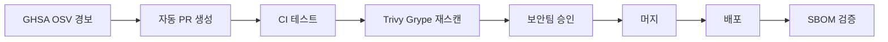

# 의존성 자동 업데이트 — Renovate·Dependabot

> **의존성 업데이트**는 라이브러리·베이스 이미지·GitHub Actions·Terraform
> provider·Helm chart의 버전 변경을 자동으로 감지하고 PR을 생성하는
> 프로세스다. 수동으로 `npm outdated`를 돌리던 시대는 끝났다. **2026년
> 기준 표준 도구는 Renovate (Mend)와 Dependabot (GitHub)**. 두 도구 모두
> 2024~2025년 사이 grouped updates·cooldown·auto-triage 기능을 채워 넣으며
> 성숙했다.
>
> 공급망 공격이 보편화된 시대에 **"자동 업데이트 = 무조건 머지"가 아니다**.
> 최소 release age 게이팅, 그룹 단위 배치, 수동 메이저 승인이 현대 기본값.

- **현재 기준**: Renovate **v43.x** (2026-01-29 v43.0.0 릴리즈 이후), Dependabot 네이티브 (GHES 3.14+ grouped security 지원)
- **상위 카테고리**: CI/CD 운영
- **인접 글**: [SAST/SCA](../devsecops/sast-sca.md),
  [이미지 스캔](../devsecops/image-scanning-cicd.md),
  [SLSA](../devsecops/slsa-in-ci.md),
  [GHA 보안](../github-actions/gha-security.md)

---

## 1. 왜 자동 업데이트인가

### 1.1 수동 업데이트의 한계

| 문제 | 결과 |
|---|---|
| 누구도 `npm outdated`를 주기적으로 돌리지 않음 | 수년 묵은 CVE 방치 |
| 한 번에 메이저 5~10개 점프 | 마이그레이션 공포 → 동결 → 더 오래 방치 |
| EOL 도달 후 긴급 업그레이드 | 장애·보안 사고로 이어짐 |
| 사람마다 버전 기준 불일치 | `package-lock`과 `package.json` 간 표류 |

### 1.2 자동화가 해결하는 것

- **낮은 업데이트 비용** — 작은 diff 반복이 한 번의 대공사보다 안전
- **CVE 노출 시간 단축** — GHSA/OSV 경보 → 자동 PR → 머지까지 시간 지표화
- **공급망 가시성** — 모든 변경이 PR로 기록되어 감사 가능
- **메인테이너 부담 분산** — CODEOWNERS·reviewer 자동 할당

### 1.3 공급망 리스크 반격

2024~2025년 npm `axios`·`nx`·`ua-parser-js` 류 사건 이후, **"즉시
최신 버전 머지"가 오히려 위험**하다는 공감대가 형성됐다. Renovate v42는
`minimumReleaseAge`에 release timestamp를 강제하여 악성 패키지가 퍼지기 전
**3~14일 cooldown**을 두는 것이 기본이 됐다. 단 **Renovate의 `config:best-practices`
기본 cooldown은 `security:minimumReleaseAgeNpm` 프리셋을 통해 npm에만 적용**된다.
Docker·GitHub Actions·Terraform·Go 등 다른 생태계에는 수동으로
`packageRules`로 걸어야 한다. Dependabot도 **2025-07-01 `cooldown` GA**했다
(version-updates 전용, security-updates는 즉시).

> 💡 자동 업데이트 도구를 도입하는 순간 **머지 정책**도 함께 설계해야
> 한다. "자동 생성 + 자동 머지"는 도구가 강제하지 않는 운영자 책임이다.

---

## 2. 도구 비교

### 2.1 핵심 차이 한눈에

| 항목 | Renovate | Dependabot |
|---|---|---|
| 개발사 | Mend (구 WhiteSource) | GitHub |
| 라이선스 | AGPL-3.0 (CLI·App) + Enterprise (유료) | 네이티브 무료 |
| 플랫폼 | GitHub·GitLab·Bitbucket·Azure DevOps·Gitea·Forgejo 등 7+ | GitHub·Azure DevOps(제한) |
| Package manager | **90+** | **30+** |
| 실행 인프라 | Mend Cloud App / Self-hosted CLI / K8s Operator | GitHub Actions (2024-04 GA) |
| 스케줄 | cron + 자연어 ("before 5am on monday") 모두 지원 | daily·weekly·monthly·cron (cron은 2025-04 GA, 7개 ecosystem 한정) |
| 그룹핑 | 내장 + 공식 프리셋 (`group:monorepos`) | `groups` 필드 (GA) + `multi-ecosystem-groups` (2025-07 GA) |
| 커스터마이징 | `packageRules` + `customManagers` 사실상 무제한 | YAML 스키마 범위 내 |
| Dependency Dashboard | 내장 이슈 | 없음 (Security 탭 분산) |
| Cooldown | `minimumReleaseAge` (v42 timestamp 필수화, npm 기본) | `cooldown` (2025-07-01 GA, version-updates only) |
| 메이저 선택권 | `separateMajorMinor`·`separateMinorPatch` 등 세분화 | `ignore` + `update-types` |
| MergeConfidence | Mend Cloud 전용 neutral/low/high/very high 등급 | 없음 |

### 2.2 언제 무엇을 선택하나

| 상황 | 권장 |
|---|---|
| GitHub 단일 플랫폼, 단순한 요구 | **Dependabot** — 설치 불필요, GHSA 직통 |
| 멀티 플랫폼(GitLab·Bitbucket 혼재) | **Renovate** |
| 모노레포 + 워크스페이스별 세밀 제어 | **Renovate** (group:monorepos 자동 인식) |
| Dockerfile·Helm·Terraform·CI YAML 내 비표준 버전 | **Renovate** (customManagers 결정적) |
| 엔터프라이즈 감사·SLA·MergeConfidence | **Mend Renovate Enterprise** |
| 단순 GitHub Actions SHA pinning | 어느 쪽이든 가능, Dependabot 편리 |

> ⚠️ **두 도구를 한 저장소에 동시 사용 금지**. 실제 사고 패턴:
> Dependabot이 `package.json`만 업데이트 → Renovate가 같은 패키지의 다른
> 버전으로 `pnpm-lock.yaml` 재생성 → lock/manifest 표류, PR 번갈아 재생성,
> CI 무한 재실행. 전환 시 **한쪽을 먼저 완전 비활성화 후 config 검증, 그
> 다음 다른 쪽 활성화**.

---

## 3. Renovate — 핵심 config

### 3.1 최소 시작 config

`renovate.json` (또는 `.github/renovate.json5`, `renovate.json5` 권장):

```json5
{
  "$schema": "https://docs.renovatebot.com/renovate-schema.json",
  "extends": [
    "config:best-practices",
    ":dependencyDashboard",
    "group:monorepos",
    "schedule:weekends"
  ],
  "timezone": "Asia/Seoul",
  "prConcurrentLimit": 10,
  "prHourlyLimit": 2
}
```

`config:best-practices`가 자동 적용하는 핵심 요소 (2026-04 기준):

- `config:recommended` 전체 (Dependency Dashboard 내장, `:semanticCommits` 등)
- **`docker:pinDigests`** — Docker 이미지 digest pin
- **`helpers:pinGitHubActionDigests`** — Actions를 SHA digest로 pin
- **`:configMigration`** — deprecated 옵션 자동 마이그레이션 PR
- **`:pinDevDependencies`** — devDep 버전 고정
- **`abandonments:recommended`** — 1년 비활성 패키지 경고
- **`security:minimumReleaseAgeNpm`** — **npm 패키지에만** 3일 cooldown
- **`:maintainLockFilesWeekly`** — lockFile 주간 유지보수

> ⚠️ **주의**:
> - `config:recommended`에 **`group:monorepos`는 포함되지 않음** — 별도
>   추가 필요 (위 예시의 `extends`처럼).
> - `minimumReleaseAge`는 **`config:best-practices`에서 npm 한정**이다.
>   Docker·Actions·Terraform·gomod 등에 cooldown을 걸려면
>   `packageRules`로 명시:
>   ```json5
>   {
>     "packageRules": [
>       {
>         "matchManagers": ["dockerfile", "docker-compose", "kubernetes"],
>         "minimumReleaseAge": "3 days"
>       }
>     ]
>   }
>   ```

### 3.2 `packageRules` 매처

| 매처 | 예시 |
|---|---|
| `matchPackageNames` | `["react", "/^@types//"]` (regex는 slash로 감싸기) |
| `matchDepNames` | alias 인지, 실제 dep 이름 기준 |
| `matchDepTypes` | `["devDependencies", "dependencies", "peerDependencies"]` |
| `matchManagers` | `["npm", "dockerfile", "terraform"]` |
| `matchDatasources` | `["docker", "github-releases", "pypi"]` |
| `matchUpdateTypes` | `["major", "minor", "patch", "pin", "digest"]` |
| `matchCurrentVersion` | `"!/^0/"` (0.x 제외) |
| `matchFileNames` | `["apps/web/**"]` (모노레포 워크스페이스) |
| `matchBaseBranches` | `["main", "release/*"]` |
| `matchCategories` | `["java", "python"]` |
| `matchConfidence` | `["high", "very high"]` (Mend Cloud 전용) |
| `matchCurrentAge` | `"> 30 days"` |
| `matchJsonata` | 임의 JSONata 식 |

### 3.3 실전 config 예시

```json5
{
  "extends": ["config:best-practices"],
  "timezone": "Asia/Seoul",
  "schedule": ["before 5am every weekday", "every weekend"],
  "prConcurrentLimit": 10,
  "prHourlyLimit": 2,
  "branchConcurrentLimit": 20,
  "semanticCommits": "enabled",
  "platformAutomerge": true,
  "packageRules": [
    {
      "description": "Auto-merge dev deps minor/patch",
      "matchDepTypes": ["devDependencies"],
      "matchUpdateTypes": ["minor", "patch"],
      "automerge": true
    },
    {
      "description": "Batch all @types/* together",
      "matchPackageNames": ["/^@types//"],
      "groupName": "types"
    },
    {
      "description": "Batch non-major prod deps weekly",
      "matchDepTypes": ["dependencies"],
      "matchUpdateTypes": ["minor", "patch"],
      "groupName": "prod deps (non-major)",
      "schedule": ["before 5am on monday"]
    },
    {
      "description": "Major = manual review always",
      "matchUpdateTypes": ["major"],
      "automerge": false,
      "labels": ["major-update"],
      "reviewers": ["team:platform"]
    },
    {
      "description": "Pin GitHub Actions to SHA",
      "matchManagers": ["github-actions"],
      "pinDigests": true
    },
    {
      "description": "Node.js — LTS만 허용",
      "matchPackageNames": ["node"],
      "allowedVersions": "/^(20|22|24)/"
    }
  ],
  "vulnerabilityAlerts": {
    "labels": ["security"],
    "schedule": ["at any time"],
    "minimumReleaseAge": null
  },
  "lockFileMaintenance": {
    "enabled": true,
    "schedule": ["before 4am on monday"],
    "automerge": true,
    "minimumReleaseAge": null
  }
}
```

> ⚠️ **v42 회귀 함정**: `config:best-practices`가 npm에 기본 `minimumReleaseAge`
> 를 걸기 때문에 **lockFileMaintenance에도 release timestamp 필터가 상속되어
> 조용히 실행되지 않을 수 있다**. `lockFileMaintenance`를 enable할 때는
> 반드시 `"minimumReleaseAge": null`을 명시하라. 안 그러면 주간 유지보수가
> 멈춘 것을 발견하지 못한다.

### 3.4 Dependency Dashboard

Renovate가 저장소에 단일 GitHub/GitLab 이슈를 생성해 **모든 pending·rate-limited·
closed·error 업데이트를 체크박스로 노출**한다.

| 섹션 | 역할 |
|---|---|
| Pending Approval | `dependencyDashboardApproval: true`로 수동 승인 필요 |
| Awaiting Schedule | schedule 창 대기 중 |
| Rate-Limited | `prHourlyLimit` 초과 |
| Pending Branch Automerge | PR 없이 자동 머지 대기 |
| Edited/Blocked | 사용자가 수정하거나 충돌 |
| Detected dependencies | 전체 탐지 결과 |
| Abandoned Packages | 1년 이상 릴리즈 없는 의존성 (`abandonments:recommended`) |

체크박스 → 해당 업데이트 즉시 재실행·rebase·승인.

### 3.5 Custom Managers

정규식으로 **비표준 파일** (Dockerfile ARG, Makefile, shell script, CI yaml 내
버전 핀)에서 버전을 뽑아낸다.

> 📌 **필드명 변경**: v41 이후 `fileMatch` → `managerFilePatterns`. 기존 config
> 보유 시 `:configMigration` 프리셋이 자동 마이그레이션 PR 생성.

```json5
{
  "customManagers": [
    {
      "customType": "regex",
      "managerFilePatterns": ["/Dockerfile$/", "/\\.ya?ml$/"],
      "matchStrings": [
        "# renovate: datasource=(?<datasource>\\S+) depName=(?<depName>\\S+)( versioning=(?<versioning>\\S+))?\\s+ARG \\S+=\"?(?<currentValue>.+?)\"?\\s"
      ],
      "versioningTemplate": "{{#if versioning}}{{{versioning}}}{{else}}semver{{/if}}"
    }
  ]
}
```

사용 예 (`Dockerfile`):

```dockerfile
# renovate: datasource=github-releases depName=kubernetes/kubectl versioning=semver
ARG KUBECTL_VERSION="1.31.0"
```

Renovate가 위 패턴을 감지해 **GitHub Releases API**로 새 버전 조회 후 PR 생성.

### 3.6 Post-upgrade tasks (self-hosted 전용)

```json5
{
  "postUpgradeTasks": {
    "commands": [
      "pnpm install --lockfile-only",
      "npx -y prettier --write package.json"
    ],
    "fileFilters": ["pnpm-lock.yaml", "package.json"],
    "executionMode": "update"
  },
  "allowedCommands": ["^pnpm install", "^npx -y prettier"]
}
```

**보안 모델 (v43+)**

- **v43 기본값 변경**: post-upgrade 명령이 **더 이상 셸에서 실행되지 않음**.
  셸 메타문자(`|`, `&&`, `>`, `$()`)·파이프·리다이렉션이 자동 차단. 인자 배열로
  파싱되어 직접 실행
- 이전 동작(셸 실행)이 필요하면 `allowShellExecutorForPostUpgradeCommands: true`
  명시, 또는 `allowedUnsafeExecutions`로 특정 커맨드만 예외
- **Mend Cloud App에서는 제한적** — 허용된 task만 실행
- **v40 이후** `allowedCommands`는 **post-compiled 값** 기준 검증
  (템플릿 치환 후 문자열이 allowlist에 맞아야 함)
- codemod 자동 실행 (`go mod tidy`, `cargo update`, `npx @next/codemod@latest`) 가능
- **v43는 Node.js 24.11.0 이상 요구** — Node 22는 지원 중단

### 3.7 Renovate v42·v43 주요 변경 타임라인

| 버전 | 날짜 | 변경 |
|---|---|---|
| v40.0.0 | 2025 초 | Node 20 지원 종료 → 22.13 필수. `allowedCommands` 검증 강화 |
| v42.0.0 | 2025-11-06 | `minimumReleaseAge` release timestamp 필수. `minimumReleaseAgeBehaviour=timestamp-optional`로 이전 동작 복원 가능 |
| v43.0.0 | 2026-01-29 | post-upgrade 셸 실행 기본 차단. Node 24.11+ 요구. `binarySource=docker` deprecate. Gradle Wrapper 자동 실행 중단 (insider attack 방어). "NodeJS" → "node" 이름 통일 |

### 3.8 MergeConfidence (Mend Cloud)

Mend Cloud가 제공하는 **패키지 안정성 등급**. 과거 릴리즈의 회귀율·다운로드
트렌드·adoption 속도 등을 집계해 `neutral`/`low`/`high`/`very high` 배지로
표시.

```json5
{
  "extends": ["mergeConfidence:all-badges"],
  "packageRules": [
    {
      "matchConfidence": ["high", "very high"],
      "matchUpdateTypes": ["minor", "patch"],
      "automerge": true
    },
    {
      "matchConfidence": ["low", "neutral"],
      "dependencyDashboardApproval": true
    }
  ]
}
```

- Mend Cloud(무료 App 포함)에서만 동작. Self-hosted CLI는 토큰 필요
- badges 서버가 **`badges.renovateapi.com` → `developer.mend.io`** 로 이전됨
- automerge 정책과 결합해 "안정적 패키지만 자동 머지" 전략 구현

### 3.9 실행 방식

| 방식 | 용도 |
|---|---|
| **Mend Renovate App** (GitHub) | SaaS, 공개/비공개 리포 무료. 설치만 하면 끝 |
| **Mend Renovate Community Edition** | 무료 self-hosted. GitHub(.com + ES), GitLab Self-Managed |
| **Mend Renovate Enterprise** | 유료. SLA, 고급 감사, MergeConfidence |
| **CLI / Docker image** | `ghcr.io/renovatebot/renovate`. K8s CronJob으로 자체 운영 |
| **GitLab CI 전용** | `.gitlab-ci.yml`에 renovate CLI 잡 추가 — GitLab 자체 호스팅에 흔함 |

---

## 4. Dependabot — 핵심 config

### 4.1 `dependabot.yml` 구조

`.github/dependabot.yml`:

```yaml
version: 2
registries:
  my-npm:
    type: npm-registry
    url: https://npm.pkg.github.com
    token: ${{ secrets.GH_PACKAGES_TOKEN }}
updates:
  - package-ecosystem: "npm"
    directories: ["/frontend", "/backend"]       # 2024 복수 경로 지원
    schedule:
      interval: "weekly"
      day: "monday"
      time: "04:00"
      timezone: "Asia/Seoul"
    registries: ["my-npm"]
    open-pull-requests-limit: 5                  # 기본 5
    cooldown:                                    # 2025-07 확장
      default-days: 3
      semver-major-days: 30
      semver-minor-days: 7
      semver-patch-days: 3
    groups:
      dev-deps:
        applies-to: version-updates
        dependency-type: "development"
        patterns: ["*"]
        update-types: ["minor", "patch"]
      security:
        applies-to: security-updates
        patterns: ["*"]
    ignore:
      - dependency-name: "react"
        update-types: ["version-update:semver-major"]
    labels: ["deps"]
    commit-message:
      prefix: "chore"
      prefix-development: "chore(dev)"
      include: "scope"
    reviewers: ["my-org/frontend"]
    assignees: ["my-org/frontend-lead"]
    rebase-strategy: "auto"
```

### 4.2 지원 ecosystem (2026-04)

| key | 언어/도구 | key | 언어/도구 |
|---|---|---|---|
| `bazel` | Bazel | `helm` | Helm (2025-04~) |
| `bun` | Bun ≥1.1.39 | `julia` | Julia ≥1.10 |
| `bundler` | Ruby | `maven` | Maven |
| `cargo` | Rust | `mix` | Elixir |
| `composer` | PHP | `nix` | Nix |
| `conda` | Conda | `npm` | npm/pnpm/yarn |
| `devcontainers` | Dev Containers | `nuget` | NuGet |
| `docker` | Docker | `opentofu` | OpenTofu |
| `docker-compose` | Docker Compose | `pip` | pip/pipenv/poetry/uv |
| `dotnet-sdk` | .NET SDK | `swift` | Swift SPM |
| `elm` | Elm | `terraform` | Terraform |
| `gitsubmodule` | Git submodule | `gomod` | Go modules |
| `github-actions` | GitHub Actions | `gradle` | Gradle |

### 4.3 Grouped updates

- **2024-03-28 grouped security updates GA**. version-updates는 이전부터 GA
- `applies-to: version-updates | security-updates` (생략 시 version만)
- **`multi-ecosystem-groups` 2025-07-01 GA**: 여러 ecosystem을 단일 PR에 통합

```yaml
multi-ecosystem-groups:
  infrastructure:
    patterns: ["*"]
    ecosystems: ["terraform", "docker", "github-actions"]
    update-types: ["minor", "patch"]

updates:
  - package-ecosystem: "terraform"
    directory: "/"
    schedule: {interval: "weekly"}
    multi-ecosystem-group: "infrastructure"
```

### 4.4 Auto-triage rules

2024-06 GA. 대량 alert를 규칙으로 자동 dismiss/snooze.

- 조건: `severity`, `CVSS`, `CWE`, `CVE ID`, `GHSA ID`, `package name`,
  `ecosystem`, `dependency scope (dev/runtime)`, `manifest path`, `patch availability`
- 조직 단위 preset 지원

예시 규칙:
- `dependency scope: development` + `manifest path: /test/**` → auto-dismiss
- `patch availability: false` + `severity: low` → snooze until patch
- `CVSS >= 9.0` → 즉시 할당, Slack 알림

### 4.5 실행 인프라 — Dependabot on Actions

- **2024-04-22 GA** (Enterprise Cloud), 이후 모든 티어 확장. 모든 Dependabot
  작업이 GitHub Actions 인프라에서 실행
- **Actions minutes에 포함되지 않음** (무료 유지)
- Self-hosted runner·larger runner 지원
- Actions API·webhook으로 실패 감지 가능
- GHES에서는 표준 (Azure 호스팅 Dependabot 폐지)

### 4.6 Cron schedule (2025-04-22 GA)

```yaml
updates:
  - package-ecosystem: "npm"
    directory: "/"
    schedule:
      interval: "cron"
      cronjob: "0 4 * * 1-5"    # 평일 오전 4시 KST
      timezone: "Asia/Seoul"
```

- **지원 ecosystem**: `bundler`, `composer`, `mix`, `maven`, `npm`, `pip`, `uv`
  (2026-04 기준 7개). `github-actions`·`docker`·`terraform`·`gomod` 미지원 —
  이들은 고정값(daily·weekly·monthly) 사용
- 표준 5필드 cron (minute·hour·day·month·weekday)
- `interval: "cron"`과 `cronjob: "..."` 세트로 명시

---

## 5. Automerge — 머지 정책

### 5.1 원칙

1. **CI가 신뢰 가능할 때만** — 단위 테스트 + 린트 + 타입 체크 + SCA 최소 세트
2. **Required status checks 명시 선택** — "Require status checks"만 켜면 불충분.
   반드시 체크 이름 명시 (최소 3~5개)
3. **Patch만 자동, Minor는 선별, Major는 수동**
4. **Dev deps 우선** — 린터·포매터·타입 정의·테스트 러너
5. **Cooldown 필수** — Renovate `minimumReleaseAge: "3 days"`, Dependabot
   `cooldown.default-days: 3`

### 5.2 Renovate automerge

```json5
{
  "packageRules": [
    {
      "matchUpdateTypes": ["minor", "patch", "pin", "digest"],
      "matchCurrentVersion": "!/^0/",
      "automerge": true
    },
    {
      "matchDepTypes": ["devDependencies"],
      "automerge": true
    }
  ],
  "platformAutomerge": true,
  "automergeType": "pr",
  "rebaseWhen": "conflicted"
}
```

- `automergeType: "pr"` (기본) — PR 생성 후 CI 통과 시 자동 머지
- `automergeType: "branch"` — PR 생략, base branch에 direct push (알림 소음↓,
  단 감사 정책 위배 가능)
- `platformAutomerge: true` — 플랫폼 네이티브 auto-merge 기능 사용

### 5.3 Dependabot automerge

`.github/workflows/dependabot-auto-merge.yml`:

```yaml
name: Dependabot auto-merge
on: pull_request
permissions:
  contents: write
  pull-requests: write
jobs:
  automerge:
    runs-on: ubuntu-latest
    if: github.actor == 'dependabot[bot]'
    steps:
      - uses: dependabot/fetch-metadata@dbb049abf0d677abbd7f7eee0375145b417fdd34 # v2.4.0
        id: meta
      - name: Enable auto-merge for patch
        if: steps.meta.outputs.update-type == 'version-update:semver-patch'
        run: gh pr merge --auto --squash "$PR_URL"
        env:
          PR_URL: ${{ github.event.pull_request.html_url }}
          GH_TOKEN: ${{ secrets.GITHUB_TOKEN }}
```

> ⚠️ **중요 주의**:
> - `pull_request_target` 대신 `pull_request` 트리거 사용. `_target`은
>   원격 fork PR에서 secrets 접근 허용 → 공격 벡터
> - 2023-03 이후 **Dependabot PR의 `GITHUB_TOKEN`은 기본 read-only**로
>   다운그레이드됨. `permissions:` 블록에서 `pull-requests: write`,
>   `contents: write` 명시 필수
> - Repository settings → Actions → "Allow GitHub Actions to create and
>   approve pull requests" **활성화 필요** (기본 비활성)
> - Action은 SHA로 pin (§8.9 SLSA 요건)

Dependabot 슬래시 커맨드:
- `@dependabot rebase`
- `@dependabot squash and merge`
- `@dependabot recreate`
- `@dependabot ignore this major version`

---

## 6. 스케줄링과 PR 폭풍 방지

### 6.1 Renovate

| 옵션 | 역할 |
|---|---|
| `prConcurrentLimit` | 열린 PR 개수 한도 (기본 20) |
| `prHourlyLimit` | 시간당 새 PR 한도 (기본 2) |
| `branchConcurrentLimit` | 브랜치 한도 (기본 prConcurrentLimit과 동일) |
| `schedule` | cron 또는 자연어 — `"0 5 * * 1"` 또는 `"before 5am on monday"` |
| `timezone` | IANA tz — `"Asia/Seoul"` |
| `dependencyDashboardApproval` | 수동 승인 게이팅 (체크박스로 승인) |

**"휴가 중 업데이트 없음"** 패턴:
```json5
{
  "schedule": ["before 8am on monday"],
  "dependencyDashboardApproval": true
}
```
긴급 보안 PR만 `vulnerabilityAlerts.schedule: ["at any time"]`로 예외.

### 6.2 Dependabot

| 옵션 | 기본값 |
|---|---|
| `open-pull-requests-limit` | 5 |
| `schedule.interval` | daily·weekly·monthly·quarterly·semiannually·yearly·cron |
| `schedule.cron` | 표준 cron (2025) |
| `groups.patterns` | glob |

Dependabot은 Renovate만큼 세밀한 rate-limit은 없다. **그룹핑**으로 PR 수를
줄이는 것이 주 전략.

### 6.3 CI 비용 절감 패턴

- 그룹핑으로 CI run 수 감소 (모든 patch 한 PR)
- `schedule` off-hour 배치 → 러너 피크 회피
- 모노레포: 워크스페이스별 affected 빌드 (Nx/Turborepo 연계, §11 참조)
- 로컬 캐싱 (Renovate host rules로 private registry mirror)

---

## 7. 보안 업데이트

### 7.1 데이터 소스

| 소스 | 운영 | 용도 |
|---|---|---|
| **GHSA** (GitHub Advisory Database) | GitHub | Dependabot 기본, Renovate 보조 |
| **OSV** (Open Source Vulnerabilities) | Google + OSS | Renovate `osvVulnerabilityAlerts` |
| **NVD** (CVE) | NIST | 교차 참조 |

### 7.2 Renovate `vulnerabilityAlerts`

```json5
{
  "vulnerabilityAlerts": {
    "enabled": true,
    "labels": ["security"],
    "assignees": ["@security-team"],
    "schedule": ["at any time"],
    "minimumReleaseAge": null,
    "platformAutomerge": false
  }
}
```

- **기본적으로 `schedule` 무시** — 보안은 즉시 PR
- `minimumReleaseAge: null`로 cooldown bypass
- `osvVulnerabilityAlerts: true`로 OSV 직접 조회 (CLI 모드)

### 7.3 Dependabot 보안 업데이트

- **자동 활성**: 저장소 설정 → Security → "Dependabot security updates"
- GHSA 경보 도착 → 패치 버전 존재하면 즉시 PR
- **Cooldown이 적용되지 않음** (보안은 즉시)
- grouped security updates (2024-03 GA): 연관 CVE 묶기

### 7.4 Zero-day 대응 워크플로



- break-glass 머지는 branch protection 우회 권한자만
- 배포 후 **SLSA provenance**로 실제 패치 버전이 배포됐는지 확인
- 포스트모템: 단계별 시각 기록으로 **Mean-Time-To-Remediate (MTTR)** 산출

**MTTR 측정 기준점**

| 시각 (T) | 정의 |
|---|---|
| T0 | GHSA/OSV 공개 시각 (advisory `published` 필드) |
| T1 | 봇이 보안 PR을 생성한 시각 |
| T2 | CI 통과 + 리뷰 승인 + 머지 시각 |
| T3 | 해당 패치 버전이 프로덕션에 배포 완료된 시각 |

- **SLO 기준**: 조직별로 다름. Critical(CVSS ≥ 9.0)은 T3 - T0 ≤ 24h가
  엔터프라이즈 표준. SLO·Error Budget 연계는 [SRE](../../sre/) 카테고리 참조
- 자동 업데이트 도구 자체의 품질 지표는 `T1 - T0`
- 조직의 머지 병목 지표는 `T2 - T1`

### 7.5 SCA 결과 연계

[SAST/SCA §6](../devsecops/sast-sca.md) 및
[이미지 스캔 §5](../devsecops/image-scanning-cicd.md) 참조.

- Trivy·Grype SARIF → GitHub Security 탭 통합 → Dependabot alert와 교차
- Renovate `mergeConfidence` (Mend Cloud): 패키지 과거 배포 안정성 지표

---

## 8. 언어·생태계별 특이사항

### 8.1 Node.js (npm/yarn/pnpm/bun)

- Renovate: npm·yarn(1/berry)·pnpm·bun 모두 자동 감지
- `postUpdateOptions: ["yarnDedupeHighest", "pnpmDedupe"]`
- pnpm workspace: `packages/**` 자동 인식
- **pnpm `minimumReleaseAge`** — 2026-04 추가 (pnpm 자체 기능)

### 8.2 Go modules

- `gomod` manager
- `postUpdateOptions: ["gomodTidy", "gomodUpdateImportPaths", "gomodMassage"]`
- `gomodTidy1.17: true`로 specific Go 버전 강제
- Minimum Version Selection(MVS)로 메이저 버전 경로 (`/v2`) 자동 처리

### 8.3 Python

- Renovate: `pip_requirements`, `pipenv`, `poetry`, `pep621`, `pip_setup`
- Dependabot: `pip` (pipenv·poetry·uv·pip-compile 모두 포함)
- lock 파일 재생성: post-upgrade task로 `poetry lock --no-update` 등

### 8.4 Java Maven/Gradle

- parent POM + BOM 체인 자동 해석
- Gradle 버전 카탈로그 (`gradle/libs.versions.toml`) 지원
- Renovate: `gradle-wrapper` 자동 업데이트

### 8.5 Rust/Cargo

- `Cargo.lock`·`Cargo.toml` 직접 업데이트
- `rangeStrategy` 제한적 (Cargo 자체 SemVer 규약)

### 8.6 Docker

- Renovate: `dockerfile`, `docker-compose`, `kubernetes`, `helm-values` managers
- `pinDigests: true` → `nginx:1.27.1@sha256:...` 자동 변환
- Kustomize manager는 기본 `pinDigests: false` — 명시 override 필요

### 8.7 Terraform/OpenTofu

- module과 provider 분리 처리
- `terraform` · `terraform-version` · `terragrunt` managers
- Dependabot: `terraform` + `opentofu`

### 8.8 Helm

- Renovate: `helmv3`, `helm-values`, `helm-requirements`
- Dependabot: `helm` (2025-04 추가)
- `appVersion`은 custom manager + `docker` datasource 조합이 관용구

### 8.9 GitHub Actions

- `github-actions` manager — SHA로 pin 권장 (SLSA L2 요건)
- `helpers:pinGitHubActionDigests` 프리셋: SHA pin, semver 주석은 인라인 유지
  ```yaml
  - uses: actions/checkout@b4ffde65f46336ab88eb53be808477a3936bae11 # v4.1.1
  ```

---

## 9. Private Registries (사내 레지스트리)

엔터프라이즈 환경에서 자동 업데이트 실패의 **가장 흔한 원인**. Artifactory·
Nexus·GHCR·ECR Private·사내 PyPI mirror 등 인증 필요 레지스트리 설정.

### 9.1 Renovate `hostRules`

```json5
{
  "hostRules": [
    {
      "matchHost": "npm.internal.corp",
      "hostType": "npm",
      "username": "ci-bot",
      "encrypted": {
        "password": "wcFMA/xDdHCJB...",   // Mend Cloud PGP로 암호화
        "token": "wcFMA/xDdHCJB..."
      }
    },
    {
      "matchHost": "ghcr.io",
      "hostType": "docker",
      "username": "USERNAME",
      "password": "{{ secrets.GHCR_TOKEN }}"   // self-hosted CLI env
    },
    {
      "matchHost": "artifactory.corp/api/pypi/pypi-remote",
      "hostType": "pypi",
      "token": "{{ secrets.ARTIFACTORY_TOKEN }}"
    }
  ]
}
```

- **Mend Cloud App**: `encrypted` 필드에 PGP 암호화값 저장. `developer.mend.io/encrypt`
  에서 생성
- **Self-hosted CLI**: 환경 변수로 주입 (`RENOVATE_HOST_RULES`)
- `hostType`: `docker`·`npm`·`pypi`·`maven`·`nuget`·`rubygems`·`terraform`·`github`·
  `gitlab`·`bitbucket` 등
- 공통 인증은 `matchHost: "*"`로 광범위 설정 가능하나 권장 안 됨

### 9.2 Dependabot `registries`

```yaml
version: 2
registries:
  private-npm:
    type: npm-registry
    url: https://npm.internal.corp
    username: ci-bot
    password: ${{ secrets.NPM_PASSWORD }}
  private-docker:
    type: docker-registry
    url: https://ghcr.io
    username: ${{ secrets.GHCR_USER }}
    password: ${{ secrets.GHCR_TOKEN }}
  artifactory-pypi:
    type: python-index
    url: https://artifactory.corp/api/pypi/pypi-remote/simple
    token: ${{ secrets.ARTIFACTORY_TOKEN }}
updates:
  - package-ecosystem: "npm"
    directory: "/"
    registries: ["private-npm"]         # 이 update에서 사용
    schedule: {interval: "weekly"}
```

**지원 레지스트리 타입 (2026-04 기준 11종)**:
- `composer-registry`, `docker-registry`, `git`, `hex-organization`,
  `hex-repository`, `maven-repository`, `npm-registry`, `nuget-feed`,
  `python-index`, `rubygems-server`, `terraform-registry`

**Secret 주입**:
- Repository settings → Security → Secrets and variables → **Dependabot**
  (Actions secrets와 **별도 저장소**)
- 조직 단위 Dependabot secret 지원 (2024+)
- 토큰은 최소 권한 (read-only pull)

### 9.3 흔한 함정

| 함정 | 해결 |
|---|---|
| Actions secret에만 저장, Dependabot secret 누락 | Dependabot 전용 secret 설정 |
| 토큰 만료 → Dependabot 조용히 실패 | `@dependabot show <package> ignore conditions` 응답 확인, 로그 주시 |
| private registry만 지정하고 public fallback 없음 | `registries` + public registry 모두 등록 |
| SCA 도구와 token 공유 → rotation 어려움 | 도구별 별도 토큰 + rotation 스크립트 |
| GHES 내부 registry 인증서 자체 서명 | Renovate self-hosted: `NODE_EXTRA_CA_CERTS`, Dependabot: GHES 관리자가 CA 등록 |

---

## 10. GHES (GitHub Enterprise Server)

GHES 운영 시 주요 차이점.

### 10.1 Dependabot 기능 가용성

| 기능 | GHES 지원 |
|---|---|
| version updates | 3.9+ |
| security updates | 3.9+ |
| grouped version updates | 3.11+ |
| **grouped security updates** | **3.14+** (2024) |
| Dependabot on Actions | 표준 (3.14+, Azure 호스팅 폐지) |
| auto-triage rules | 3.14+ |
| cooldown | 3.18+ 예상 |
| multi-ecosystem-groups | 3.18+ 예상 |

### 10.2 Self-hosted runner 요구사항

- Dependabot on Actions는 **runner가 필요** (ephemeral ARC 권장, [ARC 러너](../github-actions/arc-runner.md))
- GitHub-hosted runner 미가용 GHES는 self-hosted 필수
- Dependabot 전용 runner label 권장 (`dependabot-runner`)
- Actions minutes에 포함되지 않지만 **runner 용량**은 소비

### 10.3 조직 단위 정책

- `.github-private` 저장소에 조직 공통 `dependabot.yml` 템플릿
- Auto-triage rules organization preset (2023-10 beta → GA)
- Enterprise policies로 Dependabot 활성화 강제

---

## 11. 모노레포 운영

[모노레포 CI/CD](../patterns/monorepo-cicd.md) 참조. 의존성 업데이트 관점:

### 11.1 Renovate `group:monorepos`

- Nx·Turborepo·Lerna·pnpm workspaces·Rush·Bazel 자동 인식
- `@nx/*`, `@angular/*`, `@aws-sdk/*` 같은 관련 패키지 그룹 자동 묶음
- 워크스페이스별 룰:
  ```json5
  {
    "packageRules": [
      {"matchFileNames": ["apps/web/**"], "reviewers": ["team:web"]},
      {"matchFileNames": ["apps/api/**"], "reviewers": ["team:api"]}
    ]
  }
  ```

### 11.2 Dependabot 모노레포

- `directories:` (복수) 필드로 여러 워크스페이스 단일 항목 처리
- `groups.group-by: dependency-name`으로 cross-directory 그룹

### 11.3 Affected 빌드 연계

- Nx `nx affected`·Turborepo `turbo run --filter=[HEAD^]`으로 PR에서
  변경된 워크스페이스만 빌드·테스트
- CI 비용 절감 + 머지 속도 향상

---

## 12. 라이선스·공급망 정책

### 12.1 라이선스 필터

Renovate·Dependabot 모두 **라이선스 자체 필터는 네이티브 미지원**.

대안:
- `actions/dependency-review-action`의 `allow-licenses` / `deny-licenses`로
  PR 단에서 차단:
  ```yaml
  - uses: actions/dependency-review-action@v4
    with:
      allow-licenses: Apache-2.0, BSD-3-Clause, ISC, MIT
      fail-on-severity: high
  ```
- Syft·license-finder·FOSSA 스캔 결과를 PR label로 반영

### 12.2 공급망 방어 체크리스트

| 항목 | 설정 |
|---|---|
| Cooldown ≥ 3일 | Renovate `minimumReleaseAge: "3 days"` / Dependabot `cooldown.default-days: 3` |
| GitHub Actions SHA pin | `helpers:pinGitHubActionDigestsToSemver` |
| Docker digest pin | `pinDigests: true` |
| Package signature 검증 | npm provenance, PyPI trusted publishing |
| 라이선스 allowlist | `dependency-review-action` |
| SBOM 생성 | Syft → OCI artifact |
| SLSA provenance | [SLSA §4](../devsecops/slsa-in-ci.md) |
| SCA 스캔 | Trivy·Grype PR 게이팅 |

---

## 13. 운영 시나리오

### 13.1 도입 단계

숙련팀 이상적 일정 기준. 엔터프라이즈는 보통 분기 단위(**6~12주 단계별 확장**)가
현실적.

1. **Phase 1 (1~2주)** — Dependency Dashboard만 활성화, PR 생성 없음
   (`dependencyDashboardApproval: true`)
2. **Phase 2 (1~2주)** — devDependencies patch/minor만 허용
3. **Phase 3 (2~3주)** — prod deps patch, grouped, cooldown 3일 적용
4. **Phase 4 (2~3주)** — minor까지 확장, automerge (dev만), required checks
   명시 지정
5. **Phase 5 (4~6주)** — major PR 검토 프로세스 확립, 모노레포 워크스페이스
   룰 세분화, 팀별 owner 배정
6. **Phase 6 (4~8주)** — SCA·라이선스 게이팅·SLSA provenance 통합,
   MTTR 지표 SLO화

### 13.2 메인테이너 공수 분산

- `reviewers`·`assignees`·CODEOWNERS 자동 라우팅
- `reviewersSampleSize` — 팀에서 랜덤 N명 선정
- 그룹핑으로 PR 수를 주당 5~15개 수준 유지
- Dashboard에서 review queue 시각화

### 13.3 흔한 실패 패턴

| 패턴 | 결과 | 해결 |
|---|---|---|
| 전면 automerge | 악성 패키지·회귀 유입 | cooldown + major 수동 |
| 그룹 없이 전면 배포 | PR 수십 개 → 리뷰 포기 | `group:monorepos` + 카테고리별 그룹 |
| Self-hosted runner + post-upgrade 무제한 | RCE 위험 | `allowedCommands` 필수 |
| Required checks 미지정 | 실패 PR automerge | 체크 이름 명시 |
| Dependabot·Renovate 동시 | PR 중복·lock 경쟁 | 한쪽만 |

---

## 14. 체크리스트

- [ ] 도구 선택 근거 명시 (Renovate vs Dependabot)
- [ ] `config:best-practices` 또는 동등 설정 적용
- [ ] Cooldown (`minimumReleaseAge` / `cooldown`) ≥ 3일
- [ ] Required status checks 명시 선택
- [ ] Major는 수동 리뷰 강제
- [ ] devDependencies vs dependencies 차별화
- [ ] 모노레포: 워크스페이스별 owner·group
- [ ] GitHub Actions SHA pin
- [ ] Docker digest pin
- [ ] `vulnerabilityAlerts` / `security-updates` 별도 채널
- [ ] Dependency Dashboard 또는 auto-triage rules로 가시화
- [ ] SCA·라이선스·SLSA 파이프라인 통합
- [ ] 자동 업데이트 MTTR 지표 수집 (경보 → 머지까지)

---

## 참고 자료

- [Renovate Docs — Configuration Options](https://docs.renovatebot.com/configuration-options/) (확인: 2026-04-25)
- [Renovate Docs — Key Concepts: Automerge](https://docs.renovatebot.com/key-concepts/automerge/) (확인: 2026-04-25)
- [Renovate Docs — Dependency Dashboard](https://docs.renovatebot.com/key-concepts/dashboard/) (확인: 2026-04-25)
- [Renovate Docs — Minimum Release Age](https://docs.renovatebot.com/key-concepts/minimum-release-age/) (확인: 2026-04-25)
- [Renovate Docs — Custom Managers (Regex)](https://docs.renovatebot.com/modules/manager/regex/) (확인: 2026-04-25)
- [Renovate Docs — Bot Comparison](https://docs.renovatebot.com/bot-comparison/) (확인: 2026-04-25)
- [Renovate v42 Release](https://github.com/renovatebot/renovate/releases/tag/42.0.0) (확인: 2026-04-25)
- [Renovate v43 Release](https://github.com/renovatebot/renovate/releases/tag/43.0.0) (확인: 2026-04-25)
- [Renovate Docs — config:best-practices Preset](https://docs.renovatebot.com/presets-config/) (확인: 2026-04-25)
- [Renovate Docs — Merge Confidence](https://docs.renovatebot.com/merge-confidence/) (확인: 2026-04-25)
- [GitHub Blog — Dependabot Cooldown GA](https://github.blog/changelog/2025-07-01-dependabot-supports-configuration-of-a-minimum-package-age/) (확인: 2026-04-25)
- [GitHub Blog — Multi-ecosystem Groups GA](https://github.blog/changelog/2025-07-01-single-pull-request-for-dependabot-multi-ecosystem-support/) (확인: 2026-04-25)
- [GitHub Blog — Dependabot Cron GA](https://github.blog/changelog/2025-04-22-dependabot-now-lets-you-schedule-update-frequencies-with-cron-expressions/) (확인: 2026-04-25)
- [GitHub Docs — Dependabot Options Reference](https://docs.github.com/en/code-security/reference/supply-chain-security/dependabot-options-reference) (확인: 2026-04-25)
- [GitHub Docs — Supported Ecosystems](https://docs.github.com/en/code-security/dependabot/ecosystems-supported-by-dependabot/supported-ecosystems-and-repositories) (확인: 2026-04-25)
- [GitHub Docs — Dependabot Security Updates](https://docs.github.com/en/code-security/dependabot/dependabot-security-updates/about-dependabot-security-updates) (확인: 2026-04-25)
- [GitHub Docs — Auto-triage Rules](https://docs.github.com/en/code-security/dependabot/dependabot-auto-triage-rules/about-dependabot-auto-triage-rules) (확인: 2026-04-25)
- [GitHub Blog — Grouped Security Updates GA](https://github.blog/changelog/2024-03-28-dependabot-grouped-security-updates-generally-available/) (확인: 2026-04-25)
- [GitHub Blog — Dependabot on Actions](https://github.blog/changelog/2024-04-22-dependabot-updates-on-actions-for-github-enterprise-cloud-and-free-pro-and-teams-users/) (확인: 2026-04-25)
- [GitHub Blog — Cooldown Expanded](https://github.blog/changelog/2025-07-29-dependabot-expanded-cooldown-and-package-manager-support/) (확인: 2026-04-25)
- [GitHub Blog — Helm Support](https://github.blog/changelog/2025-04-09-dependabot-version-updates-now-support-helm/) (확인: 2026-04-25)
- [dependabot/fetch-metadata](https://github.com/dependabot/fetch-metadata) (확인: 2026-04-25)
- [actions/dependency-review-action](https://github.com/actions/dependency-review-action) (확인: 2026-04-25)
- [OSV — Open Source Vulnerabilities](https://osv.dev/) (확인: 2026-04-25)
