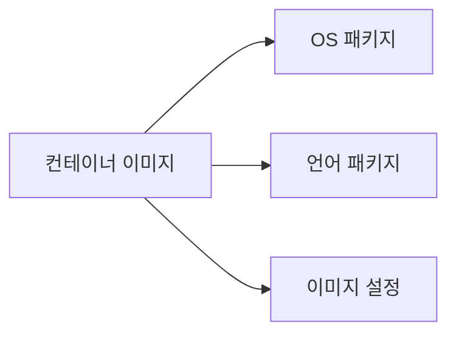

# 이미지 스캔

> **컨테이너 이미지 스캔은 "DevSecOps의 가장 기본적인 게이트"**다. 베이스
> 이미지가 오래됐거나, 앱 의존성이 CVE에 노출되어 있으면 **이미지 build만
> 잘 된다고 안전하지 않다**. 2026 표준은 **빌드 직후 CI에서 1차 스캔**,
> **레지스트리에 push 시 2차 스캔**, **Kubernetes admission에서 3차 게이트**
> 의 3중 방어. 엔진은 Trivy·Grype가 OSS 양강.

- **인접 글**: [SAST·SCA](./sast-sca.md)(코드·의존성),
  [시크릿 스캔](./secret-scanning.md)(시크릿),
  [SLSA](./slsa-in-ci.md)(공급망),
  [Harbor](../artifact/harbor.md)(레지스트리 내장 스캔)
- **CVE 우선순위 엔진**(EPSS·KEV·Reachability·VEX)은 [SAST·SCA §4.3](./sast-sca.md)과 공통

---

## 1. 무엇을 스캔하는가

### 1.1 스캔 대상 3층



| 층 | 예 | 도구 |
|---|---|---|
| **OS 패키지** | `apt`/`apk`/`rpm` — glibc, openssl | Trivy, Grype, Clair |
| **언어 패키지** | `node_modules`, Python wheels, Go modules, Ruby gems, Rust crates, JAR | Trivy, Grype |
| **이미지 설정** | USER 0 (root), privileged, CMD/ENTRYPOINT, ENV secrets | Trivy `--config`, Docker Scout, Docker Bench |

**핵심**: 많은 팀이 1·2번만 본다. **3번(이미지 설정)**은 CIS Docker
Benchmark에 해당하며 runtime 공격면에 직결.

### 1.2 왜 별도 도구인가

- **빌드 시 Dockerfile 변경 감지**: 새 base image가 CVE-hit일 수 있음
- **OS·언어 매니페스트 추출**: Trivy/Grype는 tarball에서 `/var/lib/dpkg/status`,
  `node_modules/.../package.json` 등을 파싱
- **업데이트**: CVE DB는 매일 갱신 — 같은 이미지도 며칠 후 다시 스캔 필요

---

## 2. 엔진 비교

### 2.1 OSS 주요 도구

| 도구 | 출처 | 특징 | 2026 추세 |
|---|---|---|---|
| **Trivy** | Aqua Security | 가장 널리 쓰임. image·fs·repo·K8s·IaC·SBOM·시크릿·라이선스 올인원 | ⭕ **사실상 표준** |
| **Grype** | Anchore | 속도 빠름, Syft(SBOM) 짝궁, policy는 Anchore Enterprise | ⭕ |
| **Docker Scout** | Docker | `docker scout cves`, Docker Desktop 통합, recommendation 우수 | 개발자 경험 |
| **Clair** | Red Hat / Quay | Quay 내장, gRPC API, 오래된 프로젝트 | 레거시 유지 |
| **Snyk Container** | 상용 | Reachability·fix 자동 | 엔터프라이즈 |
| **Anchore Enterprise** | 상용 | 정책 엔진·compliance | 엔터프라이즈 |

### 2.2 Trivy vs Grype — 실무 관점

| 관점 | Trivy | Grype |
|---|---|---|
| 커버리지 | OS + 언어 + IaC + K8s + SBOM | OS + 언어 (+ Syft로 SBOM) |
| 속도 | 빠름 | 빠름 (이미지·환경에 따라 편차) |
| 출력 포맷 | JSON·SARIF·CycloneDX·SPDX·Table | JSON·SARIF·Table |
| DB 업데이트 | GHCR 6h 주기 빌드, 클라이언트 TTL 24h | GitHub Releases |
| Config 스캔 | ✅ `--config` | ❌ 별도 도구 |
| Kubernetes 오퍼레이터 | Trivy Operator | — |
| 멀티 플랫폼 | amd64·arm64 | amd64·arm64 |

**권장**: Trivy를 기본으로, 속도가 중요한 곳 또는 SBOM-first 워크플로우면
Syft + Grype 조합.

---

## 3. CI 통합

### 3.1 GitHub Actions — Trivy

```yaml
name: image-scan
on: [pull_request]
jobs:
  scan:
    runs-on: ubuntu-latest
    permissions:
      contents: read
      security-events: write     # SARIF 업로드
    steps:
      - uses: actions/checkout@v4

      - name: Build image
        run: docker build -t webapp:$GITHUB_SHA .

      - name: Trivy scan
        uses: aquasecurity/trivy-action@0.28.0    # ← branch ref(@master) 금지: 공급망 변조 위험
        with:
          image-ref: webapp:${{ github.sha }}
          severity: CRITICAL,HIGH
          ignore-unfixed: true
          exit-code: "1"              # Gate: 실패로 빌드 중단
          format: sarif
          output: trivy-results.sarif

      - uses: github/codeql-action/upload-sarif@v3
        if: always()
        with:
          sarif_file: trivy-results.sarif
```

### 3.2 이미지가 아직 push 안 됐을 때

Trivy는 **로컬 tarball**을 스캔할 수 있다.

```bash
# 빌드 직후, push 전 (로컬 Docker daemon에서 직접 읽음)
docker build -t webapp:test .
trivy image webapp:test
# 또는 tarball 파일 스캔 (--input은 tar 파일 전용)
docker save webapp:test -o webapp.tar
trivy image --input webapp.tar
```

CI에서 push 전 스캔 → 실패 시 push 자체 안 함 → 레지스트리 오염 방지.

### 3.3 GitLab CI — Grype

```yaml
image-scan:
  stage: security
  image: anchore/grype
  script:
    - grype $REGISTRY/webapp:$CI_COMMIT_SHA -o json > grype-report.json
    - grype --fail-on high $REGISTRY/webapp:$CI_COMMIT_SHA
  artifacts:
    paths:
      - grype-report.json
    # GitLab Ultimate의 Container Scanning 대시보드에 싣고 싶다면
    # Grype JSON을 GitLab Container Scanning 스키마로 변환 후:
    # reports:
    #   container_scanning: gl-container-scanning-report.json
```

**주의**: Grype SARIF를 `reports.sast`에 그대로 꽂으면 **SAST로 분류**돼
Security Dashboard에서 잘못 표시된다. GitLab에서는 `container_scanning`
전용 포맷이 정식 경로.

### 3.4 멀티 플랫폼 이미지

```bash
# linux/amd64, linux/arm64 모두 스캔
trivy image --platform linux/arm64 webapp:v1
```

플랫폼별 베이스 이미지가 다르면 CVE 결과도 다르다. 배포 대상 플랫폼 모두
스캔 필수.

---

## 4. CVE 정책 — 3중 게이트

### 4.1 게이트 1: CI

- **Critical + High**: 무조건 실패. `--exit-code 1 --severity CRITICAL,HIGH`
- **`--ignore-unfixed`**: fix 없는 CVE는 임계 차감 — 소음 감소
- **SARIF 업로드**: GitHub/GitLab Security tab에 이력

### 4.2 게이트 2: 레지스트리

Harbor의 `prevent_vul` 프로젝트 설정 ([Harbor §5.2](../artifact/harbor.md)):

- 새로 push되는 이미지를 Trivy가 자동 스캔
- 임계(High) 초과면 pull 차단 → 클러스터가 이미지 못 가져감

### 4.3 게이트 3: Kubernetes Admission

```yaml
# Kyverno — Trivy Operator의 VulnerabilityReport를 정책으로 (개념 예시)
apiVersion: kyverno.io/v1
kind: ClusterPolicy
metadata:
  name: block-critical-cve
spec:
  validationFailureAction: Enforce
  rules:
    - name: require-no-critical
      match:
        any:
          - resources: {kinds: [Pod]}
      context:
        - name: criticalCount
          apiCall:
            urlPath: "/apis/aquasecurity.github.io/v1alpha1/namespaces/{{request.namespace}}/vulnerabilityreports"
            jmesPath: "items[0].report.summary.criticalCount || `0`"
      validate:
        message: "Critical CVE detected"
        deny:
          conditions:
            any:
              - key: "{{ criticalCount }}"
                operator: GreaterThan
                value: 0
```

> ⚠️ **개념 예시**. VulnerabilityReport CRD의 실제 필드 구조와 이미지별
> 다중 report 매칭은 환경마다 다르다. 공식 [Trivy + Kyverno 튜토리얼](https://trivy.dev/docs/dev/tutorials/kubernetes/kyverno/)
> 의 검증된 정책 템플릿을 출발점으로 사용할 것.

**Trivy Operator** 사용 시 `VulnerabilityReport` CRD가 cluster의 모든
이미지 스캔 결과를 저장. Kyverno·OPA·Sigstore Policy Controller가
이걸 읽어 Pod admission에서 차단.

### 4.4 우선순위 — CVSS를 넘어

[SAST/SCA §4.3](./sast-sca.md)과 동일. CVSS만 보면 차단 폭발. KEV +
EPSS + Reachability + VEX 조합.

```bash
# Trivy는 VEX 문서로 exploitable 여부 필터링 지원
trivy image --vex ./vex-dir --ignore-status will_not_fix \
  webapp:v1
```

**KEV 필터링**: Trivy에 별도 플래그는 없다. JSON 출력 + CISA KEV 카탈로그를
JOIN하거나 VEX 문서로 exploit 여부를 별도 선언하는 후처리 파이프라인이
표준.

---

## 5. 이미지 자체 hardening

스캔만으로는 부족. **이미지를 작고·비루트로·minimal하게** 만들어 CVE
표면을 줄인다.

### 5.1 Distroless·Chainguard·Docker Hardened Images

| 이미지 | 특징 |
|---|---|
| **Distroless** (`gcr.io/distroless/*`) | shell·package manager 없음, OS 취약점 거의 0 |
| **Chainguard Images** | daily rebuild, 대부분 CVE 0, SLSA·SBOM 기본 |
| **Wolfi (Chainguard OSS)** | **glibc 기반**(Alpine의 musl과 다름) + apk 패키지 관리 |
| **Docker Hardened Images (DHI)** | 2025-05 상용 출시, 2025-12 Apache 2.0 오픈소스화 → 대부분 이미지 무료 |
| **Alpine** (주의) | 작지만 musl libc·apk 고유 CVE |
| **Google Container-Optimized OS** | GKE 노드용 |

### 5.2 Dockerfile 베스트 프랙티스 (보안 관점)

```dockerfile
# 멀티 스테이지로 빌드 산출물만
FROM golang:1.22 AS build
WORKDIR /src
COPY . .
RUN CGO_ENABLED=0 go build -o /app ./cmd/api

# distroless 최종 이미지
FROM gcr.io/distroless/static:nonroot
COPY --from=build /app /app
USER nonroot:nonroot                      # root 방지
EXPOSE 8080
ENTRYPOINT ["/app"]
```

- `FROM <tag>@sha256:...` digest pin으로 재현성
- `USER nonroot`로 root 실행 금지
- 멀티 스테이지로 빌드 도구 제거
- `COPY --chown=nonroot:nonroot` 파일 권한 최소화

### 5.3 이미지 설정 스캔

```bash
trivy config Dockerfile
trivy image --scanners config webapp:v1
```

- `USER root` 탐지
- `apt install` 캐시 미삭제
- hardcoded `ENV SECRET`
- latest tag 사용

---

## 6. 레지스트리·재스캔 주기

### 6.1 "한 번 스캔"으로는 부족

오늘 Critical 0이었던 이미지도 내일 새 CVE 발견이면 Critical. **레지스트
리의 모든 이미지를 주기 재스캔**.

| 레지스트리 | 재스캔 |
|---|---|
| Harbor | 스케줄러로 주 1회 전체 재스캔 |
| ECR | `ECR Enhanced Scanning` (AWS Inspector v2) — 이미지 push 시 + 주기 |
| GAR | Artifact Analysis — 매 push + 지속 모니터링 |
| ACR | Microsoft Defender for Containers |
| GHCR | Dependabot만, container 이미지 자동 스캔 제한적 |

### 6.2 Trivy Operator — 클러스터 전체

```bash
helm install trivy-operator aquasecurity/trivy-operator \
  -n trivy-system --create-namespace \
  --set trivy.ignoreUnfixed=true
```

- 클러스터의 **모든 Deployment·Pod** 이미지를 발견 즉시 스캔
- 결과는 `VulnerabilityReport` CRD로 저장
- `ConfigAuditReport`, `ExposedSecretReport`, `ClusterComplianceReport`도
  동시 수집 (misconfig·leaked secrets·CIS benchmark)

---

## 7. 에어갭 환경

인터넷 차단 환경의 과제: CVE DB 업데이트.

### 7.1 Trivy DB 미러

```bash
# 외부에서 DB 다운로드
trivy image --download-db-only

# DB를 tar로 포장
tar -czf trivy-db.tar.gz ~/.cache/trivy/db/

# 내부망에 옮긴 후
mkdir -p ~/.cache/trivy/db
tar -xzf trivy-db.tar.gz -C ~/.cache/trivy/

# 이후 --skip-db-update로 외부 호출 차단
trivy image --skip-db-update webapp:v1
```

### 7.2 Java DB

Trivy는 Java 취약점용 별도 DB(`trivy-java-db`). Java 이미지 많으면
같은 방식으로 미러. Harbor v2.13+은 `trivy.skipJavaDBUpdate`도 지원.

### 7.3 GitHub 미러 주기

Trivy CVE DB는 **GitHub Container Registry 호스팅**, **6시간마다 빌드·
업로드**되고 클라이언트 기본 TTL은 24h. 에어갭에서는 DB 주기 동기화
자동화 필수 (최악의 경우 2주 이상 stale DB는 false negative 발생).

---

## 8. 관측·보고

### 8.1 Trivy Operator → Prometheus

```yaml
# Trivy Operator values
operator:
  metricsBindAddress: ":8080"
  serviceMonitor:
    enabled: true
```

주요 메트릭

| 메트릭 | 의미 |
|---|---|
| `trivy_image_vulnerabilities{severity}` | severity별 카운트 |
| `trivy_image_exposedsecrets` | 이미지 내 leaked secret 수 |
| `trivy_resource_configaudits{severity}` | misconfig 수 |

### 8.2 Grafana Dashboard

공식 대시보드 [`17813`](https://grafana.com/grafana/dashboards/17813).
CVE 추세·namespace·image별 hotspot 시각화.

### 8.3 알림

- **일일 디지스트**: Slack·Email로 전일 발견된 Critical CVE 목록
- **신규 KEV 즉시**: CISA KEV 업데이트 → 해당 CVE 있는 이미지 페이징
- **재스캔 실패**: Trivy Operator가 스캔 실패하면 관측 누락 — 자체 알람

---

## 9. 안티패턴

| 안티패턴 | 왜 문제 | 교정 |
|---|---|---|
| `latest` tag 사용 | 재현성 없음, 스캔 추적 불가 | digest pin (`@sha256:...`) |
| 이미지 스캔 없이 push | 레지스트리에 취약 이미지 누적 | CI Gate |
| push 후 스캔만 | CI에서 빠른 실패 기회 상실 | push 전 `--input` 스캔 |
| 모든 severity로 block | Low/Info까지 차단, 개발 속도 급락 | Critical+High만 |
| `ignore-unfixed` 없음 | 고칠 수 없는 CVE로 무한 실패 | `ignore-unfixed: true` |
| 단일 시점 스캔 | 새 CVE 발견 시 알림 못 받음 | Trivy Operator + 주기 재스캔 |
| 이미지 설정 스캔 생략 | `USER root` 그대로 prod | `trivy image --scanners config` |
| root user 이미지 | privilege escalation 공격면 | `USER nonroot` + distroless |
| large base image (Ubuntu full) | CVE 표면 10배 | distroless·Chainguard·Wolfi |
| 빌드 결과 이미지에 secret | 로그·레지스트리 누출 | build secret + secret 스캐너 |
| Trivy DB stale | false negative | `--skip-db-update` 쓸 땐 주기 동기화 |
| 에어갭인데 `--skip-db-update` 안 함 | 스캔 실패로 건너뜀 | 명시적 에어갭 flag |
| Admission gate 없이 CI만 의존 | 우회된 이미지가 prod로 | Kyverno·OPA + VulnerabilityReport |
| 스캔 결과를 PR에 안 띄움 | 개발자가 결과 확인 안 함 | SARIF + Security tab |
| VEX·Reachability 없이 CVSS만 | 알람 피로 | [SAST/SCA §4.3](./sast-sca.md) |
| 멀티 플랫폼 빌드인데 한 arch만 스캔 | 다른 arch CVE 놓침 | 모든 `--platform` 스캔 |
| ECR `PULL_REGISTRY_AUTH_TOKEN` CI에 평문 | 레지스트리 탈취 | OIDC + IAM Role |
| GitHub Actions `@master` 브랜치 참조 | 공급망 변조(Trivy 2026-03 CVE-2026-33634 전례) | 버전 태그 또는 commit digest pin |
| Grype SARIF → GitLab `reports.sast` | SAST로 오분류 | `container_scanning` 스키마로 변환 |

---

## 10. 도입 로드맵

1. **Trivy CI Gate**: PR 빌드 이미지 Critical/High 차단
2. **SARIF 업로드**: GitHub Security tab 연결
3. **Base image 교체**: Distroless·Chainguard로
4. **Config 스캔**: Dockerfile `trivy config` 추가
5. **Trivy Operator**: 클러스터 지속 감시
6. **Harbor `prevent_vul`**: 레지스트리 게이트
7. **Kyverno admission**: `VulnerabilityReport` 기반 Pod 차단
8. **우선순위 엔진**: VEX·EPSS·KEV·Reachability
9. **에어갭 DB 미러**: 주기 자동화
10. **SBOM·서명 연계**: Syft + Cosign ([SLSA](./slsa-in-ci.md))

---

## 11. 관련 문서

- [SAST·SCA](./sast-sca.md) — 코드·의존성 스캔
- [시크릿 스캔](./secret-scanning.md) — 이미지·코드 시크릿
- [SLSA](./slsa-in-ci.md) — 공급망 보안
- [Harbor](../artifact/harbor.md) — 레지스트리 내장 스캔
- [OCI Artifacts 레지스트리](../artifact/oci-artifacts-registry.md)

---

## 참고 자료

- [Trivy 공식](https://trivy.dev/) — 확인: 2026-04-25
- [Trivy Operator](https://aquasecurity.github.io/trivy-operator/) — 확인: 2026-04-25
- [Grype 공식](https://github.com/anchore/grype) — 확인: 2026-04-25
- [Syft 공식](https://github.com/anchore/syft) — 확인: 2026-04-25
- [Docker Scout](https://docs.docker.com/scout/) — 확인: 2026-04-25
- [Chainguard Images](https://images.chainguard.dev/) — 확인: 2026-04-25
- [Distroless](https://github.com/GoogleContainerTools/distroless) — 확인: 2026-04-25
- [Kyverno Image Verification](https://kyverno.io/docs/writing-policies/verify-images/) — 확인: 2026-04-25
- [CIS Docker Benchmark](https://www.cisecurity.org/benchmark/docker) — 확인: 2026-04-25
- [CISA KEV Catalog](https://www.cisa.gov/known-exploited-vulnerabilities-catalog) — 확인: 2026-04-25
- [EPSS — FIRST.org](https://www.first.org/epss/) — 확인: 2026-04-25
