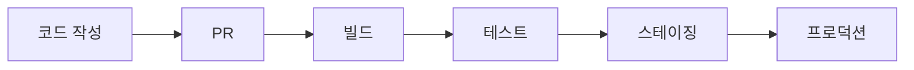
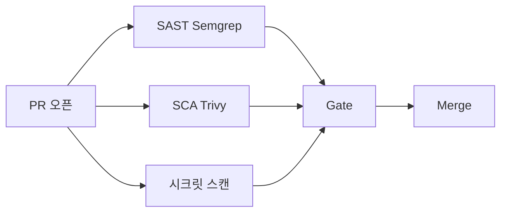

# SAST · SCA

> **SAST(Static Application Security Testing)는 소스 코드**, **SCA
> (Software Composition Analysis)는 의존성**의 취약점을 찾는다. 둘은
> Shift-Left Security의 가장 기본적인 두 축으로, **PR 단위로 차단**하지
> 않으면 프로덕션까지 흘러간다. 2026 기준 Semgrep·CodeQL·Snyk·SonarQube
> 같은 도구가 CI에 통합되어 초 단위 피드백을 제공한다.

- **상위 개념**: Shift-Left, Secure SDLC, DevSecOps
- **인접 글**: [이미지 스캔](./image-scanning-cicd.md),
  [시크릿 스캔](./secret-scanning.md), [SLSA](./slsa-in-ci.md)
- **도구 상세 비교는 카탈로그가 아닌 "선택·통합 원칙"에 집중**
  (CLAUDE.md 경계)

---

## 1. 5가지 테스트의 위치

### 1.1 용어 정리

| 약어 | 풀이 | 대상 | 언제 |
|---|---|---|---|
| **SAST** | Static Application Security Testing | 소스 코드 (빌드 전) | PR·커밋 |
| **SCA** | Software Composition Analysis | 의존성 (package-lock, go.sum 등) | PR·주기 |
| **DAST** | Dynamic AST | 실행 중인 앱 (HTTP 요청) | 스테이징·야간 |
| **IAST** | Interactive AST | 테스트 중 런타임 계측 | 테스트 환경 |
| **RASP** | Runtime Application Self-Protection | 프로덕션 런타임 방어 | prod 실행 |

### 1.2 Secure SDLC 매핑



| 단계 | 실행할 테스트 |
|---|---|
| PR | **SAST + SCA + 시크릿 스캔** |
| 빌드 | 이미지 스캔 (다음 글) |
| 테스트 | IAST |
| 스테이징 | DAST |
| 프로덕션 | RASP |

**핵심**: SAST·SCA는 **가장 왼쪽**. PR 단위에서 초 단위 피드백을 주지
못하면 개발자가 "보안은 게으르고 귀찮다"고 느끼게 됨 → 우회 문화.

---

## 2. SAST — 정적 코드 분석

### 2.1 탐지하는 것

| 유형 | 예 |
|---|---|
| Injection | SQL injection, Command injection, LDAP injection |
| Authentication | 하드코딩 패스워드, 세션 고정 |
| Data exposure | 평문 로그에 PII |
| XSS | DOM XSS, Reflected XSS |
| Insecure deserialization | Java·Python pickle |
| Crypto misuse | ECB 모드, MD5, 고정 IV |
| Path traversal | `../../` |
| SSRF, open redirect |  |

### 2.2 엔진 종류

| 분류 | 특징 | 대표 도구 |
|---|---|---|
| **Pattern-based** | regex·AST 기반 룰 | Semgrep CE, Bandit, gosec |
| **Dataflow (Taint) 분석** | source → sink 추적 | CodeQL, Snyk Code, Fortify |
| **Semantic** | 컴파일러 IR 분석 | SonarQube, Coverity |
| **AI-assisted** | LLM + rule | Snyk Code(DeepCode), Rafter, ZeroPath |

**2026 실무 선택**

| 상황 | 권장 |
|---|---|
| OSS, 초 단위 피드백 | **Semgrep CE** (30+ 언어) |
| GitHub 기반, 공개 repo 무료 | **CodeQL** (약 10개 언어, semantic) |
| 엔터프라이즈, 종합 | Snyk Code / SonarQube EE |
| 품질 메트릭 포함 | SonarQube |
| Python·Go·Ruby 특화 | Bandit / gosec / Brakeman |

### 2.3 False Positive와 트레이드오프

SAST의 근본 난제: **정답을 보장하려면 노이즈를 감수**해야 함.

- **Pattern-based**: 속도 빠름, 언어 중립, **false positive 많음**
- **Dataflow**: 정밀하지만 **분석 시간 길고** 복잡한 런타임 추적 한계
- **Semantic**: 컴파일 필요 → 빌드 의존, 느림
- **AI-assisted**: 맥락 이해 우수, **비결정적·환각 위험**

**실무 원칙**: 한 도구로 모두 해결하려 하지 말 것. Semgrep(빠른 피드백) +
CodeQL(주기적 깊이 분석) 조합이 흔한 2026 패턴.

### 2.4 CI 통합 — Semgrep 예

```yaml
# .github/workflows/sast.yml
name: SAST
on: [pull_request]
jobs:
  semgrep:
    runs-on: ubuntu-latest
    container: semgrep/semgrep
    steps:
      - uses: actions/checkout@v4
      - run: semgrep ci --config=p/default --config=p/owasp-top-ten
        env:
          SEMGREP_APP_TOKEN: ${{ secrets.SEMGREP_APP_TOKEN }}
```

- `semgrep ci`는 **PR에서 새로 추가된 findings만** 보고 (differential scan)
- 공식 rulesets: `p/default`, `p/security`, `p/owasp-top-ten`, 언어별 (`p/python`)
- SARIF 출력 → GitHub Security tab 업로드

### 2.5 CodeQL 예

```yaml
- uses: actions/checkout@v4            # 소스 먼저 받아야 init이 분석 가능
- uses: github/codeql-action/init@v3
  with:
    languages: javascript-typescript, python  # 통합 식별자 (java-kotlin 등)
    queries: security-and-quality
- uses: github/codeql-action/autobuild@v3
- uses: github/codeql-action/analyze@v3
```

- GitHub에서 제공, **공개 repo는 무제한 무료**
- 결과는 Security tab에 자동 — Dependabot과 같은 UI
- custom query는 CodeQL CLI로 작성

---

## 3. SCA — 의존성 스캔

### 3.1 무엇을 보는가

| 항목 | 예 |
|---|---|
| **CVE 매칭** | `log4j-core:2.14.1` → CVE-2021-44228 (Log4Shell) |
| **License 호환성** | GPL 계열을 상용 제품에 |
| **Deprecated / unmaintained** | 1년 이상 release 없음 |
| **Transitive dependencies** | 직접 의존성이 아닌 하위 의존성 |
| **Malicious packages** | 공격자 등록한 패키지 (`colors.js` 같은) |

### 3.2 데이터 소스

- **NVD** (National Vulnerability Database) — 기본
- **GitHub Advisory Database** — OSS 생태계 속보 빠름
- **OSV.dev** (Google) — 언어 ecosystem 통합
- 각 벤더 자체 DB (Snyk DB, WhiteSource·Mend, Sonatype)

GitHub Advisory·OSV는 CVE 이전에 취약점이 발표되는 경우가 많아 **빠른
탐지에 유리**.

### 3.3 대표 도구

| 도구 | 소스 | 특징 |
|---|---|---|
| **Dependabot** | GitHub 내장 | 자동 PR, advisory DB 통합 |
| **Renovate** | OSS + SaaS | 가장 유연, monorepo·custom schedule 강점 |
| **Trivy** | OSS (Aqua) | SBOM·이미지·의존성 통합 |
| **Grype** | OSS (Anchore) | 빠른 스캐너, Syft와 조합 |
| **Snyk Open Source** | 상용 + free tier | IDE 통합·fix PR 자동 |
| **Mend (ex WhiteSource)** | 상용 | 엔터프라이즈 라이선스 관리 |
| **OWASP Dependency-Check** | OSS | Java 중심·NVD 기반 |
| **osv-scanner** | OSS (Google) | OSV.dev 기반, 언어 중립 |

### 3.4 CI 통합 — Trivy 예

```yaml
- uses: aquasecurity/trivy-action@master
  with:
    scan-type: 'fs'
    scan-ref: '.'
    severity: 'CRITICAL,HIGH'
    ignore-unfixed: true
    format: 'sarif'
    output: 'trivy-results.sarif'
- uses: github/codeql-action/upload-sarif@v3
  with: {sarif_file: 'trivy-results.sarif'}
```

- `ignore-unfixed: true` — fix가 없는 CVE는 일단 보류 (소음 감소)
- SARIF 업로드로 GitHub Security tab 통합
- **주의**: `severity`는 **출력 필터**이지 exit code 조건이 아니다. 빌드
  실패 게이트는 `--exit-code 1 --severity CRITICAL,HIGH` 조합 필요

### 3.5 의존성 자동 업데이트 vs 스캔

- **Dependabot/Renovate**: 자동 PR — 업그레이드로 해결
- **Trivy/Grype**: 스캔 — 발견만, 조치는 수동

두 축을 **같이** 쓰는 게 정답. Renovate로 버전 PR + Trivy로 CVE 임계 차단.
상세 [의존성 업데이트](../dependency/dependency-updates.md) 참조.

### 3.6 Monorepo·Lockfile 함정

- **lockfile(`package-lock.json`, `go.sum`, `Pipfile.lock`)**이 scan 대상.
  lockfile 없으면 "어떤 버전이 실제 설치될지" 불명 → 스캔 정확도↓
- Monorepo에서는 lockfile이 여러 개 — 도구가 재귀 스캔 지원하는지 확인
- `node_modules`·`vendor/` 같은 설치본은 스캔하지 말 것 (lockfile만으로
  충분, I/O 낭비)

---

## 4. 정책·게이트

### 4.1 Quality Gate 조건

```text
예시:
- Critical CVE 0
- High CVE ≤ 5
- SAST Critical 0
- 신규(이번 PR) SAST High ≤ 0
- License: 비허용 라이선스 없음
- coverage ≥ 70%
```

GitHub Branch Protection rules 또는 GitLab MR approval에 연결 — **통과
못 하면 merge 불가**.

### 4.2 Allowlist (Triage)

모든 CVE·finding을 고칠 수 없다. 의도적 유예:

```yaml
# .trivyignore.yaml (Trivy 0.51+ 권장 — 만료일 자동 인식)
vulnerabilities:
  - id: CVE-2023-12345
    statement: "exploit 조건(특정 API 활성) 부합하지 않음"
    expired_at: 2026-12-31
```

인라인 주석만 있는 기존 `.trivyignore`는 만료일을 파서가 **인식하지 못한다**.
YAML 포맷으로 전환해 **도구가 만료일을 강제**하도록 하는 게 실무 표준.

```yaml
# .semgrepignore / semgrep exclude
nosemgrep: rule-id
```

**원칙**

- **만료 일자 명시** — 영구 allowlist 금지
- **이유 코멘트 필수**
- 분기 1회 재검토

### 4.3 우선순위 엔진 — CVSS를 넘어서

모든 Critical CVE를 동일 우선순위로 보면 **allowlist 폭발**이 필연. 2026
글로벌 표준은 **실제 악용 가능성**을 반영한 다층 우선순위.

| 지표 | 의미 | 출처 |
|---|---|---|
| **CVSS** | 이론적 심각도 | NVD |
| **EPSS** | 30일 내 exploit 발생 확률 | FIRST.org |
| **KEV** | 이미 현장에서 exploit 확인 | CISA |
| **Reachability** | 우리 코드가 실제로 취약 함수를 호출하는가 | Snyk Reachability, Endor, Semgrep SCA, Socket |
| **VEX** | "이 제품에는 영향 없음" 자기 선언 | OpenVEX, CycloneDX VEX |

**실무 Gate 권장**

```text
차단: KEV 포함 OR EPSS > 0.5
경고+SLA: Critical + Reachability=true
백로그: 나머지 Critical·High
```

CVSS Critical 일괄 차단은 이상론. 2026 업계는 위 3~4개 축 결합이 표준.

### 4.4 Shift-Left의 실패 패턴

| 안티패턴 | 결과 |
|---|---|
| PR마다 CVE 100개 보고 | 개발자 무시 → 진짜 중대 CVE도 섞임 |
| 빌드 실패 조건 없음 | 보고만 쌓임 |
| 빌드 실패 조건이 너무 엄격 | 개발자가 `--no-verify` 우회 |
| 결과를 개발자 UI(PR)에 안 띄움 | 별도 대시보드 보러 가지 않음 |
| triage 프로세스 없음 | allowlist가 무한 증식 |

**2026 권장**: "새로 추가된 Critical/High만 차단", 기존 issue는 별도 백로그.

---

## 5. DevSecOps 통합 패턴

### 5.1 PR 단계



세 스캔을 **병렬**로 실행 (5분 이내 피드백).

### 5.2 Nightly / Weekly

- **CodeQL semantic** 분석 — 시간 오래 걸림
- 전체 repository deep scan
- 라이선스 컴플라이언스 전수 조사
- Dependabot/Renovate 주간 묶음 PR

### 5.3 Release 단계

- SBOM 생성·OCI artifact로 attach
- SLSA Provenance 생성
- Image scanning ([이미지 스캔](./image-scanning-cicd.md))
- Cosign 서명

---

## 6. 보고·대시보드

### 6.1 SARIF — 표준 포맷

**SARIF (Static Analysis Results Interchange Format)**: OASIS 표준.
도구 간 결과 호환·플랫폼 통합에 필수.

```json
{
  "version": "2.1.0",
  "$schema": "https://schemastore.azurewebsites.net/schemas/json/sarif-2.1.0.json",
  "runs": [{
    "tool": {"driver": {"name": "semgrep"}},
    "results": [{
      "ruleId": "python.lang.security.audit.exec-detected",
      "level": "error",
      "message": {"text": "Avoid exec()"},
      "locations": [{"physicalLocation": {...}}]
    }]
  }]
}
```

GitHub Security tab, GitLab SecureUI, DefectDojo, Jira 등 거의 모든 대시
보드가 SARIF를 입력으로 받는다.

### 6.2 ASPM (Application Security Posture Management)

여러 스캐너 결과를 통합·디듀프·우선순위화하는 상위 레이어:

- DefectDojo (OSS)
- OX Security / Apiiro / Cycode (상용)
- Snyk AppRisk / Wiz Code

**고려 시점**: 스캐너 3개 이상 + 팀 5개 이상에서 findings 관리가 병목
일 때.

---

## 7. 안티패턴

| 안티패턴 | 왜 문제 | 교정 |
|---|---|---|
| SAST·SCA 없이 배포 | 알려진 CVE 그대로 prod | 최소 한 쌍 도입 |
| scan을 nightly 전용 | PR에 피드백 없음 → 개발 흐름 밖 | PR 단계에 배치 |
| 모든 severity 차단 | low·info까지 blocker, 생산성 파괴 | critical·high만 차단 |
| lockfile 없이 SCA | 어떤 버전 스캔하는지 불명 | lockfile 커밋 강제 |
| node_modules·vendor/ 커밋 후 스캔 | 중복·I/O 낭비 | lockfile만 스캔 |
| allowlist 무한 증식 | 유예 CVE가 prod에 | 만료일 + 분기 재검토 |
| SARIF 업로드 없이 스캐너 자체 UI | 개발자가 결과 못 봄 | GitHub/GitLab Security tab 통합 |
| Dependabot만 + SCA 스캔 없음 | fix PR 못 만드는 CVE 놓침 | Trivy·osv-scanner 병행 |
| Snyk·SonarQube 토큰 repo에 평문 | 전체 findings·소스 노출 | Actions Secrets + OIDC |
| 한 언어 도구로 모든 언어 스캔 | 정확도·지원 저하 | 언어별 권장 도구 조합 |
| 도구 교체 시 기존 finding 소실 | 장기 추적 깨짐 | ASPM으로 통합 |
| 빌드 깨짐 = 일단 `--skip` | 신뢰도 붕괴 | 실패 시 triage 프로세스로 |
| AI-assisted 결과를 무비판 수용 | false positive·hallucination | 개발자 리뷰 필수 |
| private registry 패키지 스캔 미지원 | 내부 라이브러리 CVE 놓침 | registry 인증 설정 |

---

## 8. 도입 로드맵

1. **현 상태 진단**: 현재 CI에 있는 스캐너, 결과 처리 프로세스 파악
2. **SCA 먼저**: Trivy·Dependabot 조합으로 의존성부터 (ROI 가장 빠름)
3. **SAST 도입**: Semgrep CE로 시작 (5분 설정)
4. **Gate 정책**: "새 critical/high는 차단"으로 시작
5. **Secret 스캔**: gitleaks·trufflehog (별도 [시크릿 스캔](./secret-scanning.md))
6. **License 스캔**: 법무·컴플라이언스와 협의
7. **CodeQL 주간**: 깊이 분석
8. **SARIF·GitHub Security tab** 통합
9. **DAST 스테이징**: ZAP·Burp
10. **ASPM 검토**: findings 100+ / 주 / 팀에서 병목 시

---

## 9. 관련 문서

- [이미지 스캔](./image-scanning-cicd.md) — Trivy·Grype 이미지 CVE
- [시크릿 스캔](./secret-scanning.md) — 코드·Git history 시크릿
- [SLSA](./slsa-in-ci.md) — 공급망 보안 프레임워크
- [의존성 업데이트](../dependency/dependency-updates.md) — Dependabot·Renovate
- [GHA 보안](../github-actions/gha-security.md)

---

## 참고 자료

- [OWASP — SAST](https://owasp.org/www-community/Source_Code_Analysis_Tools) — 확인: 2026-04-25
- [OWASP — SCA](https://owasp.org/www-community/Component_Analysis) — 확인: 2026-04-25
- [NIST SP 800-218 SSDF](https://csrc.nist.gov/publications/detail/sp/800-218/final) — 확인: 2026-04-25
- [Semgrep Docs](https://semgrep.dev/docs/) — 확인: 2026-04-25
- [CodeQL Docs](https://codeql.github.com/docs/) — 확인: 2026-04-25
- [SonarQube Docs](https://docs.sonarsource.com/sonarqube/) — 확인: 2026-04-25
- [Trivy 공식](https://trivy.dev/) — 확인: 2026-04-25
- [OSV.dev](https://osv.dev/) — 확인: 2026-04-25
- [GitHub Advisory Database](https://github.com/advisories) — 확인: 2026-04-25
- [SARIF Spec](https://docs.oasis-open.org/sarif/sarif/v2.1.0/sarif-v2.1.0.html) — 확인: 2026-04-25
- [DefectDojo](https://www.defectdojo.com/) — 확인: 2026-04-25
