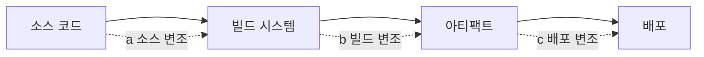

# SLSA — 공급망 보안 프레임워크

> **SLSA (Supply-chain Levels for Software Artifacts, "살사"로 발음)**는
> OpenSSF가 관리하는 공급망 보안 표준이다. **"이 아티팩트를 어떻게, 누가,
> 어디서 빌드했는가"**를 검증 가능한 **provenance**로 증명한다. 2023년
> v1.0, 2026년 기준 v1.1 spec. SolarWinds·Codecov·Log4Shell 사건 이후
> **Google·Microsoft·GitHub이 공동 채택**했다.

- **현재 기준**: SLSA **v1.1** (2025 수정), Build track Level 0~3
- **관련 도구**: `slsa-github-generator`, `actions/attest-build-provenance`,
  `slsa-verifier`, Cosign, Rekor
- **상위 카테고리**: [OCI Artifacts 레지스트리](../artifact/oci-artifacts-registry.md)
  (provenance 저장), [Harbor](../artifact/harbor.md)
- **인접 글**: [SAST/SCA](./sast-sca.md),
  [이미지 스캔](./image-scanning-cicd.md), [시크릿 스캔](./secret-scanning.md)

---

## 1. 왜 SLSA인가

### 1.1 공급망 공격 시나리오



| 공격 지점 | 사례 |
|---|---|
| (a) 소스 | 악성 PR 머지, 의존성 typosquatting |
| (b) 빌드 | SolarWinds — 빌드 서버 침투 후 컴파일 단계에 backdoor 주입 |
| (c) 배포 | 레지스트리 공격, 중간자 |

### 1.2 SLSA가 해결하려는 것

- **빌드 지점 투명성**: 누가, 어떤 소스·파라미터로, 어떤 도구로 빌드했는가
- **비위변조 가능 증거**: 빌드 이후 누구도 수정할 수 없는 서명된 증명
- **단계적 성숙도**: Level 0~3 로 점진 상향 — 현실적 도입 경로
- **검증 가능**: 운영자가 배포 직전 증명을 검증 가능

---

## 2. SLSA v1.1 구조

### 2.1 Track 구조

SLSA v1.0부터 **track 개념** 도입:

| Track | 대상 | 상태 |
|---|---|---|
| **Build** | 빌드 무결성 | ✅ v1.0 spec (L0~L3) |
| **Source** | 소스 코드 무결성 | v1.2 draft에서 재통합 (v1.0/v1.1은 deferred) |
| **Dependencies** | 의존성 무결성 | 계획 |

**2026년 현업에서 "SLSA 레벨"은 Build track**을 의미. Source/Dependencies는
아직 성숙도가 낮음.

### 2.2 Build Levels

| Level | 요구사항 | 위협 |
|---|---|---|
| **L0** | 없음 | 기본 상태, 보장 없음 |
| **L1** | **Provenance 존재**. 서명·검증 불필요 | 실수·디버깅에 유용 |
| **L2** | **서명된 provenance** + **hosted build platform** 사용 | 빌드 후 변조 방지 |
| **L3** | **강화된 빌드 플랫폼** — build 간 격리, signing key는 사용자 코드와 분리 | 빌드 중 삽입 공격 방지 |

> 💡 v0.1에 있었던 "L4"는 v1.0에서 **제거**. L3가 현재 최고 단계.

### 2.3 각 Level이 막는 것

```text
L0 → L1: "이 아티팩트 어떻게 빌드됐지?" 추적 가능
L1 → L2: "Provenance 자체가 변조됐나?" → 서명으로 방지
L2 → L3: "빌드 과정에서 악성 코드 주입됐나?" → 격리로 방지
```

---

## 3. Provenance — SLSA의 핵심 산출물

### 3.1 in-toto attestation

SLSA Provenance는 **in-toto attestation** 포맷. Statement는 JSON,
서명 envelope은 **DSSE (Dead Simple Signing Envelope)** 표준.

```json
{
  "_type": "https://in-toto.io/Statement/v1",
  "predicateType": "https://slsa.dev/provenance/v1",
  "subject": [{
    "name": "webapp",
    "digest": {"sha256": "abcd1234..."}
  }],
  "predicate": {
    "buildDefinition": {
      "buildType": "https://actions.github.io/buildtypes/workflow/v1",
      "externalParameters": {
        "workflow": {
          "ref": "refs/heads/main",
          "repository": "https://github.com/my-org/webapp",
          "path": ".github/workflows/release.yml"
        }
      },
      "internalParameters": {...},
      "resolvedDependencies": [
        {"uri": "git+https://github.com/my-org/webapp", "digest": {"gitCommit": "abc..."}}
      ]
    },
    "runDetails": {
      "builder": {"id": "https://github.com/actions/runner/github-hosted"},
      "metadata": {
        "invocationId": "https://github.com/my-org/webapp/actions/runs/12345",
        "startedOn": "2026-04-25T10:00:00Z",
        "finishedOn": "2026-04-25T10:05:00Z"
      }
    }
  }
}
```

### 3.2 핵심 필드

| 필드 | 의미 |
|---|---|
| `subject` | 이 provenance가 설명하는 아티팩트 (digest로 식별) |
| `buildDefinition.buildType` | 빌드 방식 식별자 (GitHub Actions·Buildkite·Tekton 등) |
| `externalParameters` | 사용자가 지정한 입력 (소스, 워크플로) |
| `internalParameters` | 빌드 플랫폼 내부 파라미터 |
| `resolvedDependencies` | 실제 사용된 의존성의 digest |
| `builder.id` | 빌드 플랫폼 신원 |
| `metadata.invocationId` | 빌드 실행 식별자 (감사 링크) |

### 3.3 저장 — OCI Artifact로

Provenance는 **OCI artifact**로 이미지에 attach (subject 필드 사용).
[OCI Artifacts §3](../artifact/oci-artifacts-registry.md) 참조.

---

## 4. GitHub Actions로 Build L3 도달

2026 현재 Build L3을 가장 쉽게 달성하는 경로는 **GitHub Actions + artifact
attestations**.

### 4.1 `actions/attest-build-provenance` (권장)

```yaml
name: release
on:
  push:
    tags: ['v*']

permissions:
  contents: read
  packages: write
  id-token: write          # OIDC — Sigstore keyless
  attestations: write      # attestation 생성 권한

jobs:
  build:
    runs-on: ubuntu-latest
    outputs:
      digest: ${{ steps.push.outputs.digest }}
    steps:
      - uses: actions/checkout@v4

      - uses: docker/login-action@v3
        with:
          registry: ghcr.io
          username: ${{ github.actor }}
          password: ${{ secrets.GITHUB_TOKEN }}

      - uses: docker/setup-buildx-action@v3

      - name: Build & push
        id: push
        uses: docker/build-push-action@v6    # outputs.digest 안정적 추출
        with:
          context: .
          push: true
          tags: ghcr.io/${{ github.repository }}:${{ github.ref_name }}

      - uses: actions/attest-build-provenance@v2   # 최신 major 사용
        with:
          subject-name: ghcr.io/${{ github.repository }}
          subject-digest: ${{ steps.push.outputs.digest }}
          push-to-registry: true
```

**이 액션이 하는 일**

1. Sigstore Fulcio에서 GitHub OIDC 토큰으로 ephemeral cert 발급
2. in-toto provenance 생성 (워크플로, commit, builder 정보 포함)
3. Cosign으로 서명, Rekor 투명성 로그에 기록
4. `push-to-registry: true`면 OCI artifact로 attach

### 4.2 Level 평가

| 요구 | 달성 여부 |
|---|---|
| Provenance 존재 | ✅ attest-build-provenance |
| Provenance 서명 | ✅ Sigstore keyless (Fulcio + Rekor) |
| Hosted builder | ✅ GitHub-hosted runner |
| Build 간 격리 | ✅ GitHub-hosted runner는 ephemeral VM |
| Signing key isolation | ✅ OIDC + ephemeral cert — 사용자 코드는 private key 미접근 |

**이 구성은 Build L3 달성 가능**. 단 **모든** 아래 조건 충족이 필요 —
자동 L3 아님:

- **`id-token: write`·`attestations: write`** permission 최소 원칙, job 단위 선언
- **Self-hosted runner 사용 시 L3 불충분** — runner가 persistent면 빌드 간
  격리 깨짐. ephemeral runner (ARC, CircleCI isolated) 필요
- **Reusable workflow를 SHA로 pin** — `@main`·`@v1` 같은 mutable ref는
  provenance forgeability 위험
- **Sigstore TUF root 주기 갱신** — verifier가 stale trust root를 신뢰하면
  검증 우회 가능
- Provenance **Unforgeability**와 **Isolation Strength=Strong** 요건은
  SLSA spec `BUILD_L3` 단락 기준으로 운영자가 직접 확인

### 4.3 `slsa-framework/slsa-github-generator` (구 방식)

`attest-build-provenance` 전에 쓰이던 reusable workflow. 지금도 유효하나
GitHub 공식 action이 더 간단. 특수한 builder(Go, Node, Rust 등 언어별
고정 빌더)가 필요하면 slsa-framework 생태계 사용.

```yaml
jobs:
  build:
    permissions:
      id-token: write
      contents: read
      actions: read
    uses: slsa-framework/slsa-github-generator/.github/workflows/generator_generic_slsa3.yml@v2.0.0
    with:
      base64-subjects: "${{ needs.artifact.outputs.hashes }}"
```

---

## 5. 다른 빌드 플랫폼

### 5.1 GitLab CI

GitLab은 **Cosign + in-toto** 조합을 직접 구성해야 한다.

```yaml
provenance:
  stage: provenance
  image: ghcr.io/sigstore/cosign/cosign:v3.0.0
  script:
    - cosign attest --yes \
        --predicate provenance.json \
        --type slsaprovenance1 \
        $REGISTRY/webapp@$DIGEST
```

**Cosign v3 주의**: `--new-bundle-format` 기본 활성, `.sigstore.json` 단일
bundle 포맷, OCI 1.1 Referring Artifact로 attach. 구 v2 bundle을 검증하는
경우 `--new-bundle-format=false` 옵션 명시.

### 5.2 Tekton Chains

Tekton Pipeline의 TaskRun/PipelineRun이 끝나면 **Chains controller**가
provenance 생성·서명·attach. Kubernetes-native CI에 특화.

```yaml
# Tekton Chains 활성 (cluster-wide)
artifacts.taskrun.format: in-toto
artifacts.taskrun.storage: oci
transparency.enabled: "true"        # Rekor 사용
```

### 5.3 Google Cloud Build / AWS CodeBuild

- GCB: Artifact Registry에 빌드 시 SLSA Build L3 provenance 자동 생성
  (관리형 hosted builder)
- AWS: CodeBuild + CodePipeline의 경우 in-toto provenance는 사용자가 직접
  생성. Amazon Inspector + ECR enhanced scanning과 조합

---

## 6. 검증

Provenance가 있어도 **배포 시점에 검증**하지 않으면 의미 없다.

### 6.1 `slsa-verifier`

```bash
# GitHub Actions 빌드 결과 검증
slsa-verifier verify-image \
  ghcr.io/my-org/webapp@sha256:abcd... \
  --source-uri github.com/my-org/webapp \
  --source-tag v1.4.0
```

성공하면 "이 이미지는 지정 워크플로로 빌드됐고 tag도 정확"함을 증명.

### 6.2 `cosign verify-attestation`

```bash
cosign verify-attestation \
  --type slsaprovenance \
  --certificate-identity-regexp "^https://github.com/my-org/.+$" \
  --certificate-oidc-issuer "https://token.actions.githubusercontent.com" \
  ghcr.io/my-org/webapp@sha256:abcd...
```

### 6.3 Kubernetes Admission

[OCI Artifacts §8](../artifact/oci-artifacts-registry.md) Kyverno·Sigstore
Policy Controller 예시와 결합.

```yaml
# Kyverno — SLSA provenance 검증 후에만 Pod 생성
apiVersion: kyverno.io/v1
kind: ClusterPolicy
metadata:
  name: require-slsa-provenance
spec:
  rules:
    - name: verify-provenance
      match:
        any: [{resources: {kinds: [Pod]}}]
      verifyImages:
        - imageReferences: ["ghcr.io/my-org/*"]
          attestations:
            - type: https://slsa.dev/provenance/v1
              attestors:
                - entries:
                    - keyless:
                        subject: "^https://github.com/my-org/.+$"
                        issuer: "https://token.actions.githubusercontent.com"
              conditions:
                - all:
                    - key: "{{ predicate.buildDefinition.externalParameters.workflow.ref }}"
                      operator: Equals
                      value: "refs/heads/main"
```

---

## 7. SBOM·서명·Provenance의 관계

혼동되는 셋의 역할:

| 산출물 | 질문 | 누가 | 언제 |
|---|---|---|---|
| **Cosign 서명** | "이 아티팩트 서명했다" | 빌드자 | 빌드 직후 |
| **SBOM** | "무엇이 들어있나" | 스캐너 (Syft, buildx) | 빌드 직후 |
| **Provenance** | "어떻게 빌드됐나" | 빌드 플랫폼 | 빌드 직후 |
| **VEX** | "이 CVE는 영향 없다" | 유지보수자 | 취약점 공개 후 |

세 개가 **모두 OCI artifact**로 같은 이미지에 attach. `docker buildx
build --provenance=mode=max --sbom=true --push` 한 번에 생성 가능.

**VEX 표준**: **OpenVEX** (`https://openvex.dev/ns/v0.2.0`)과 **CSAF VEX**
가 양대 표준. OpenVEX는 in-toto attestation의 predicate로 그대로 attach 가능
— `cosign attest --type https://openvex.dev/ns/v0.2.0 ...`.

---

## 8. Source Track (v1.2 draft)

빌드만큼 **소스 단계 무결성**도 중요. v1.0/v1.1에서 deferred였으나
**v1.2 draft**에서 Source track이 재통합되었다.

| Level (draft) | 요구 |
|---|---|
| L1 | 변경 이력 유지 (Git) |
| L2 | 서명된 commit (GPG, Sigstore gitsign) |
| L3 | 2인 리뷰, branch protection, signed PR |
| L4 | 추적 가능한 authorship (BYOIDP 등) |

**실무 조합**

- Git commit signing: `git config commit.gpgsign true` 또는 Sigstore `gitsign`
- GitHub/GitLab branch protection: 2 reviewer, signed commits required
- Tag protection: release tag 보호

---

## 9. Build L3 도입 로드맵

1. **L0 → L1**: CI 빌드에서 `actions/attest-build-provenance` 추가 (5분)
2. **L1 → L2**: hosted runner 사용 확인 (self-hosted면 ephemeral로 전환)
3. **L2 → L3**: OIDC ID token 권한 최소화, workflow `permissions:` 명시
4. **검증**: `slsa-verifier`를 배포 파이프라인에 추가
5. **Admission**: Kyverno·Sigstore Policy Controller
6. **SBOM 통합**: `buildx --sbom=true` 또는 Syft
7. **Cosign 서명**: keyless + Rekor
8. **VEX**: 운영 중 CVE 대응 체계
9. **Source L2**: commit signing 의무화
10. **조직 전체 확장**: reusable workflow로 다른 repo에도 전파

---

## 10. 안티패턴

| 안티패턴 | 왜 문제 | 교정 |
|---|---|---|
| provenance 생성하되 검증 안 함 | 그냥 "서명 있는 파일" 존재만, 공격 감지 불가 | 배포 파이프라인에 verify |
| Self-hosted runner로 L3 주장 | persistent runner는 격리 부족 | ARC ephemeral 또는 GitHub-hosted |
| workflow `permissions: write-all` | OIDC 토큰·attestation 과대 권한 | 최소 `id-token: write`, `attestations: write` |
| `actions/attest-build-provenance` action을 `@main` 브랜치 | 공급망 변조 | 버전 태그 또는 digest pin |
| provenance subject를 tag로 (digest 아님) | tag 교체로 검증 우회 | 반드시 digest |
| Cosign 서명 없이 provenance만 | provenance 자체 변조 가능 | Cosign + Rekor |
| Sigstore Fulcio 검증 없이 keyless | 누구의 OIDC인지 확인 안 됨 | `certificate-identity-regexp` 필수 |
| Source track 무시 | 빌드가 안전해도 소스가 오염 가능 | 2-reviewer + branch protection |
| L3 달성했다고 SBOM 생략 | Provenance는 "누가·어떻게"만, "무엇이"는 SBOM | 둘 다 |
| 구 v0.2 provenance 포맷 | 지금은 v1.0/v1.1 표준 | 최신 `predicateType` |
| provenance에 secrets 평문 | 공개 OCI registry에 노출 | minimal provenance, secrets 필드 stripping |
| externalParameters에 민감 정보 | CI env 그대로 들어감 | sanitize |
| reusable workflow 버전을 `@main` | 변조 위험 | commit SHA pin (특히 공용 action) |
| `attestations: write`를 모든 job에 | 권한 확산 | build job에만 부여 |

---

## 11. 관련 문서

- [OCI Artifacts 레지스트리](../artifact/oci-artifacts-registry.md) — provenance 저장·검증
- [Harbor](../artifact/harbor.md) — Cosign·서명 통합
- [이미지 스캔](./image-scanning-cicd.md) — SBOM·VEX 생성
- [SAST/SCA](./sast-sca.md)
- [시크릿 스캔](./secret-scanning.md)
- [GHA 보안](../github-actions/gha-security.md) — OIDC·permissions

---

## 참고 자료

- [SLSA 공식](https://slsa.dev/) — 확인: 2026-04-25
- [SLSA v1.0 Spec](https://slsa.dev/spec/v1.0/) — 확인: 2026-04-25
- [SLSA Build Levels](https://slsa.dev/spec/v1.0/levels) — 확인: 2026-04-25
- [SLSA Provenance v1](https://slsa.dev/spec/v1.0/provenance) — 확인: 2026-04-25
- [in-toto Attestation Framework](https://in-toto.io/) — 확인: 2026-04-25
- [actions/attest-build-provenance](https://github.com/actions/attest-build-provenance) — 확인: 2026-04-25
- [GitHub Artifact Attestations 블로그](https://github.blog/enterprise-software/devsecops/enhance-build-security-and-reach-slsa-level-3-with-github-artifact-attestations/) — 확인: 2026-04-25
- [slsa-framework/slsa-github-generator](https://github.com/slsa-framework/slsa-github-generator) — 확인: 2026-04-25
- [slsa-framework/slsa-verifier](https://github.com/slsa-framework/slsa-verifier) — 확인: 2026-04-25
- [Sigstore 공식](https://docs.sigstore.dev/) — 확인: 2026-04-25
- [Tekton Chains](https://tekton.dev/docs/chains/) — 확인: 2026-04-25
- [Source Track 초안](https://slsa.dev/spec/draft/source-requirements) — 확인: 2026-04-25
