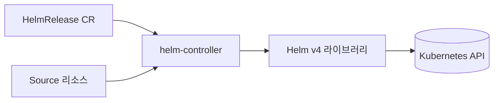

# Flux Helm

> **`helm-controller`는 Helm 패키지 매니저를 Kubernetes 컨트롤러로
> 감싼 것**이다. `helm install` / `helm upgrade`를 사람이 치는 대신
> `HelmRelease` CR로 선언하면 controller가 reconcile loop에서
> 대행한다. Flux v2.8부터 내부 Helm 라이브러리가 **v4로 전환**되어
> Server-Side Apply(SSA)와 kstatus 기반 health check가 기본이 됐다.
> 프로덕션에서는 **Source 모델 선택, values 병합 순서, drift detection,
> remediation 전략, CRD 수명 관리**를 반드시 이해해야 한다.

- **현재 기준**: Flux v2.8.0 (2026-02-24), helm-controller 내부 Helm v4,
  `HelmRelease v2` API
- **전제**: [Flux 설치](./flux-install.md)가 완료된 클러스터
- **Helm 차트 제작 자체**는 `kubernetes/` 카테고리의 Helm 글 참조. 여기서는
  **배포 측(GitOps)**만 다룬다

---

## 1. 개념 — helm-controller가 하는 일

### 1.1 Helm CLI와의 관계



| 단계 | `helm` CLI | `helm-controller` |
|---|---|---|
| 차트 fetch | `helm pull` | `source-controller`가 Artifact로 서빙 |
| template | `helm template` | 내부 라이브러리로 실행 |
| install/upgrade | `helm install/upgrade` | Server-Side Apply (v2.8+) |
| history | `helm history` | Helm Secret (storage driver) 그대로 사용 |
| rollback | `helm rollback` | `remediation` 정책으로 자동 |
| uninstall | `helm uninstall` | `HelmRelease` 삭제 → `uninstall` 정책 |

**중요**: Helm storage driver(기본 Secret)를 그대로 사용하므로 `helm`
CLI로도 release 조회·rollback 가능하다. 단, **직접 `helm upgrade`하면
drift detection이 즉시 되돌린다** — CLI는 디버깅 전용.

### 1.2 Helm v4 전환의 의미 (v2.8)

| 변화 | 영향 |
|---|---|
| **SSA 기본 활성** | field ownership 정확, `kubectl apply --server-side`와 충돌 감소 |
| **kstatus 기반 wait** | Helm v3의 heuristic 대신 표준 status로 판정. Operator CRD·Job 대응 정확 |
| **Lookup 함수 SSA 인식** | Helm chart의 `lookup`이 SSA 리소스도 정상 조회 |
| **Chart API v3** | 최근 chart는 자동 지원, 일부 구형 chart(Chart.yaml `apiVersion: v1`)는 `dependencies` 처리가 달라져 재빌드 필요할 수 있음 |
| **CancelHealthCheckOnNewRevision** | 긴 health check 중 새 revision이 오면 즉시 취소·재진입 → MTTR 단축 |
| **`v2beta2` API 제거** | v2.7 이전에서 올라오면 `flux migrate` 필수 ([Flux 설치 §11](./flux-install.md)) |

**실무 포인트**: 기존 HelmRelease는 변경 없이 동작하지만, **chart 안에서
`kubectl apply --server-side`와 혼용**하던 운영 습관이 있다면 v4의 field
ownership 검증에 걸릴 수 있다. 충돌 시 `force: true`로 해결. postRenderers로
patch하는 경우에도 동일 — helm-controller 소유 field를 덮으면 SSA conflict.

---

## 2. Source 모델 — 4가지 경로

HelmRelease는 차트 Source를 **`chart.spec`** (차트 템플릿) 또는
**`chartRef`** (Source 객체 참조) 중 하나로 지정한다.

### 2.1 네 가지 경로 비교

| 경로 | Source | 적합 | 2026 권장 |
|---|---|---|---|
| A. HelmRepository HTTP + `chart` | `type: default` (HTTP/S) | 레거시·공개 차트 repo | 유지 |
| B. HelmRepository OCI + `chart` | `type: oci` | OCI 레지스트리의 차트 **이름 prefix** | ⭕ |
| C. OCIRepository + `chartRef` | `OCIRepository` 자체가 단일 차트 | 단일 차트, 서명·SBOM 포함 | ⭕ **권장** |
| D. GitRepository + `chart` | Git 디렉터리의 `Chart.yaml` | 내부 차트 개발 | 개발·모노레포 |

**핵심 차이**: **HelmRepository `type: oci`는 OCI URL을 "접두사"로 두고
차트 이름을 append**한다. 예: `oci://ghcr.io/org/charts` + chart `webapp` =
`oci://ghcr.io/org/charts/webapp`. 반면 **OCIRepository는 OCI artifact
자체가 단일 차트**다. 단일 차트·서명 검증·SBOM 통합에는 OCIRepository가
우위.

### 2.2 A. HelmRepository HTTP

```yaml
apiVersion: source.toolkit.fluxcd.io/v1
kind: HelmRepository
metadata:
  name: podinfo
  namespace: apps
spec:
  interval: 5m
  url: https://stefanprodan.github.io/podinfo
  timeout: 90s
---
apiVersion: helm.toolkit.fluxcd.io/v2
kind: HelmRelease
metadata:
  name: podinfo
  namespace: apps
spec:
  interval: 10m
  chart:
    spec:
      chart: podinfo
      version: "~6.8.0"       # semver range 가능
      sourceRef:
        kind: HelmRepository
        name: podinfo
      interval: 5m            # 차트 버전 폴링
  values:
    replicaCount: 2
```

**주의**: `chart.spec.interval`(차트 버전 폴링)과 `HelmRelease.interval`
(release reconcile)는 **다른 개념**. 전자는 새 chart 버전 탐지, 후자는
drift correction 주기.

### 2.3 B. HelmRepository OCI

```yaml
apiVersion: source.toolkit.fluxcd.io/v1
kind: HelmRepository
metadata:
  name: company-charts
  namespace: apps
spec:
  type: oci               # ← OCI repository 모드
  url: oci://ghcr.io/my-org/charts
  provider: generic       # aws, azure, gcp로 Workload Identity
  interval: 1m            # 필드 필수지만 OCI 타입에선 reconcile이 일어나지 않음
  # OCI HelmRepository는 "credential/URL prefix 저장소" 역할만 — Artifact 미생성
---
apiVersion: helm.toolkit.fluxcd.io/v2
kind: HelmRelease
metadata:
  name: webapp
  namespace: apps
spec:
  interval: 10m
  chart:
    spec:
      chart: webapp         # → oci://ghcr.io/my-org/charts/webapp 자동 조합
      version: "1.4.x"
      sourceRef:
        kind: HelmRepository
        name: company-charts
```

### 2.4 C. OCIRepository + `chartRef` — 2026 권장

```yaml
apiVersion: source.toolkit.fluxcd.io/v1
kind: OCIRepository
metadata:
  name: webapp-chart
  namespace: apps
spec:
  interval: 5m
  url: oci://ghcr.io/my-org/charts/webapp
  ref:
    semver: ">=1.4.0 <2.0.0"
  verify:                       # ← 차트 서명 검증
    provider: cosign
    matchOIDCIdentity:
      - issuer: "^https://token.actions.githubusercontent.com$"
        subject: "^https://github.com/my-org/charts/.*$"
  layerSelector:
    mediaType: "application/vnd.cncf.helm.chart.content.v1.tar+gzip"
    operation: copy
---
apiVersion: helm.toolkit.fluxcd.io/v2
kind: HelmRelease
metadata:
  name: webapp
  namespace: apps
spec:
  interval: 10m
  releaseName: webapp
  chartRef:
    kind: OCIRepository
    name: webapp-chart
```

**이 방식의 이점**

- **Cosign/Notation 서명 검증 내장** (`spec.verify`) — 공급망 공격 차단
- **Digest 기반 reconcile** — OCIRepository는 digest를 version에 append
  하므로 같은 semver 내 content 변경도 감지
- **SBOM·Provenance를 OCI artifact로 함께 배포 가능** — SLSA와 자연 통합
- **rate limit 없음** — ghcr.io·ECR·GAR이 Helm HTTP repo보다 안정

### 2.5 D. GitRepository

```yaml
apiVersion: helm.toolkit.fluxcd.io/v2
kind: HelmRelease
metadata:
  name: internal-app
  namespace: apps
spec:
  interval: 10m
  chart:
    spec:
      chart: ./charts/internal-app   # Git 내 경로
      sourceRef:
        kind: GitRepository
        name: platform-charts
```

**장점**: 차트 개발 중 version bump 없이 PR만으로 반영. **단점**:
immutable 버전 개념이 없으므로 운영 환경에는 비권장.

---

## 3. Values — 병합 순서와 재사용

Values 주입은 **HelmRelease의 복잡도가 가장 집중되는 영역**이다.

### 3.1 병합 순서

| 우선순위 | 소스 |
|---|---|
| 1 (가장 낮음) | chart `values.yaml` |
| 2 | `valuesFrom[0]` ConfigMap/Secret |
| 3 | `valuesFrom[N]` (순차 덮어쓰기) |
| 4 (가장 높음) | inline `spec.values` |

**뒤에 오는 것이 앞을 덮어쓴다**. `values`(inline)가 가장 우선.

### 3.2 valuesFrom — 외부 소스

```yaml
spec:
  values:
    replicaCount: 3               # 최우선
  valuesFrom:
    - kind: ConfigMap
      name: common-values          # cluster 전체 공통
    - kind: ConfigMap
      name: env-values             # 환경별 오버라이드
      valuesKey: values.yaml       # key 이름 (기본 values.yaml)
    - kind: Secret
      name: secret-values          # 민감 정보
      optional: false
    - kind: Secret
      name: optional-override
      optional: true               # 없어도 에러 아님
```

**패턴**: `common` → `env` → `team` → `app` 순서로 `valuesFrom` 체인을
구성. inline `values`는 "이 HelmRelease만의 override"로 최소화.

### 3.3 ConfigMap 변경 자동 반영

**기본적으로 helm-controller는 valuesFrom이 참조하는 ConfigMap/Secret의
변경을 감지하지 않는다** — 다음 reconcile interval이 돌아도 release는
그대로. **label 부착이 사실상 필수**:

```yaml
apiVersion: v1
kind: ConfigMap
metadata:
  name: env-values
  labels:
    reconcile.fluxcd.io/watch: Enabled   # ← 이 라벨 있어야 변경 감지
```

**대안**: controller에 `--watch-configs-label-selector=owner!=helm` 같은
flag를 주면 모든 ConfigMap/Secret을 watch. 수백 개 ConfigMap이 있는
cluster에서는 부하가 크므로 **label 부착 방식을 기본값**으로 권장.

### 3.4 `postRenderers` — 차트를 건드리지 않는 수정

차트 PR을 기다리지 않고 prod에서 하나만 바꿔야 할 때 사용.

```yaml
spec:
  postRenderers:
    - kustomize:
        patches:
          - target:
              kind: Deployment
              name: webapp
            patch: |
              - op: add
                path: /spec/template/spec/tolerations
                value:
                  - key: "dedicated"
                    operator: "Equal"
                    value: "webapp"
                    effect: "NoSchedule"
        images:
          - name: ghcr.io/my-org/webapp
            newTag: "1.4.2-hotfix"
```

Kustomize patch·image override·namespace 재지정이 **차트 수정 없이**
가능. **차트가 values로 노출 안 한 항목**을 바꾸는 탈출구.

단, 남용하면 "왜 이 값이 이렇게 됐는가" 추적이 어려워지므로 **hotfix·
cluster-specific tweak**에만 쓰고, 반복되면 upstream chart에 values로
승격시킬 것.

---

## 4. 생명 주기 — install / upgrade / rollback

### 4.1 두 축을 분리해서 이해하기

helm-controller 실패 처리는 **두 가지 개념**이 겹쳐 있어 혼동이 잦다.
분리해서 보자.

**축 ①: Reconcile 전략 (`install.strategy.name` / `upgrade.strategy.name`)**

| 값 | 동작 | 적합 |
|---|---|---|
| `RemediateOnFailure` **(default)** | 실패 시 즉시 remediation 수행 (rollback 또는 uninstall) | Stateless 앱 |
| `RetryOnFailure` | 실패해도 현재 상태 유지, `retryInterval`마다 재시도 | Stateful·DB·Operator |

**축 ②: Remediation 동작 (`install.remediation.*` / `upgrade.remediation.*`)**
— 실패 후 "무엇을" 할지.

| 필드 | install 허용값 | upgrade 허용값 |
|---|---|---|
| `strategy` | `uninstall` (유일/기본) | **`rollback` 또는 `uninstall`** |
| `retries` | 실패 허용 횟수 | 동일 |
| `remediateLastFailure` | — | 마지막 시도 실패에도 remediation 수행 |

**주의**: install에는 rollback이 없다 (아직 이전 release가 없으므로).
upgrade만 rollback 선택 가능.

```yaml
spec:
  install:
    strategy:                    # 축 ①
      name: RetryOnFailure
      retryInterval: 5m
    remediation:                 # 축 ②
      retries: 3
      # strategy: uninstall (기본, 생략 가능)
    disableWait: false
    crds: Create                 # Skip, Create, CreateReplace
  upgrade:
    strategy:                    # 축 ①
      name: RemediateOnFailure
    remediation:                 # 축 ②
      retries: 3
      remediateLastFailure: true
      strategy: rollback         # ← upgrade 전용: rollback or uninstall
    cleanupOnFail: true
    force: false
```

### 4.2 Rollback 세부 동작 튜닝

`spec.rollback`은 독립 트리거가 아니라 **`upgrade.remediation.strategy:
rollback` + `retries > 0`** 조건으로 rollback이 발동할 때의 세부 동작을
제어하는 블록이다.

```yaml
spec:
  rollback:
    recreate: false              # true면 Pod 재생성 강제
    force: false
    disableHooks: false
    disableWait: false
    cleanupOnFail: true
    disableOpenAPIValidation: false
```

**흔한 실수**: `rollback.cleanupOnFail: false` + 실패 반복 → 실패
리소스가 쌓여 namespace가 더러워진다. 기본 `true` 유지 권장.

### 4.3 Test — Helm chart test 통합

```yaml
spec:
  test:
    enable: true
    ignoreFailures: false        # test 실패하면 release도 실패로
    timeout: 5m
```

`Chart.yaml`의 `templates/tests/`가 release 설치 후 자동 실행. CI 파이프
라인에 smoke test를 통합하는 가장 간단한 수단.

### 4.4 Uninstall

```yaml
spec:
  uninstall:
    keepHistory: false           # release history 유지 여부
    disableHooks: false
    deletionPropagation: background   # background, foreground, orphan
```

`HelmRelease` CR을 삭제하면 `uninstall` 정책대로 처리.

### 4.5 CRD 수명 관리

Helm의 고전적 난제. `install.crds` / `upgrade.crds` 선택지:

| 값 | 동작 |
|---|---|
| `Skip` (default for upgrade) | CRD 건드리지 않음 — **대부분 안전한 기본값** |
| `Create` (default for install) | 없으면 생성, 있으면 그대로 |
| `CreateReplace` | apply로 교체 — 스키마 변경 반영 |

**실무 원칙**: **CRD는 HelmRelease에 포함시키지 말 것**. Kustomization을
따로 두고 `dependsOn`으로 순서 보장. 차트가 CRD를 포함해도 `Skip`·
`Skip`으로 두고 외부 Kustomization으로 관리하면 차트 upgrade 시 CRD
스키마 손상 위험이 사라진다.

---

## 5. Drift Detection — Flux의 Helm 차별점

Helm CLI는 drift를 감지하지 못한다(누가 `kubectl edit`해도 `helm`은
모름). helm-controller의 **drift detection**은 이 공백을 채운다.

### 5.1 모드

```yaml
spec:
  driftDetection:
    mode: enabled                # disabled, warn, enabled
    ignore:
      - paths: ["/spec/replicas"]
        target:
          kind: Deployment
      - paths: ["/spec/template/spec/containers/0/resources"]
        target:
          kind: Deployment
          name: webapp
```

| 모드 | 동작 |
|---|---|
| `disabled` (default) | drift 무시 |
| `warn` | 이벤트·메트릭만 발생, 수정 안 함 |
| `enabled` | SSA로 자동 되돌림 |

### 5.2 반드시 ignore할 필드

| 필드 | 관리자 |
|---|---|
| `/spec/replicas` (Deployment) | HPA |
| `/spec/resources` (Pod) | VPA |
| `/status/*` | Kubernetes controller |
| `/metadata/generation`, `/metadata/resourceVersion` | API server |
| PodDisruptionBudget `/spec/minAvailable` | Karpenter 등 노드 스케일러 |

HPA가 `replicas`를 20으로 올렸는데 drift detection이 차트의 `3`으로
되돌리면 **프로덕션 장애**. HPA가 있는 Deployment는 반드시 ignore.

### 5.3 드리프트 감지의 진짜 가치

- **수동 `kubectl edit`·`kubectl apply`로 인한 변경 자동 복원** — 감사 대응
- **차트의 `lookup` 의존성 ≠ cluster 실제 상태 불일치 탐지**
- **새 field가 차트에 추가될 때 기존 release에도 SSA로 전파** — `helm
  upgrade` 수동 실행 없이도 drift correction으로 반영

---

## 6. 의존성 — `dependsOn`

`Kustomization.dependsOn`과 동일 원리. Ready가 될 때까지 다음 release는
install 시도조차 안 한다.

```yaml
# postgres → backend → frontend 순서
apiVersion: helm.toolkit.fluxcd.io/v2
kind: HelmRelease
metadata:
  name: backend
  namespace: apps
spec:
  dependsOn:
    - name: postgres
      namespace: apps            # 다른 namespace도 가능
---
apiVersion: helm.toolkit.fluxcd.io/v2
kind: HelmRelease
metadata:
  name: frontend
  namespace: apps
spec:
  dependsOn:
    - name: backend
      namespace: apps
```

**주의**: `dependsOn`은 "Ready 여부만" 본다. "3분 기다리기"는 불가 —
필요하면 init Job이나 migration 패턴을 별도 설계.

---

## 7. 멀티 테넌시·RBAC

[Flux 설치 §9](./flux-install.md)의 원칙이 그대로 적용된다.

```yaml
spec:
  serviceAccountName: tenant-a-helm    # 테넌트 SA로 impersonate
  targetNamespace: tenant-a            # install 대상 namespace
  storageNamespace: tenant-a           # Helm Secret 저장 namespace
```

| 필드 | 용도 |
|---|---|
| `releaseName` | Helm release 이름. 기본값: `targetNamespace`가 설정되면 `<targetNamespace>-<name>`, 없으면 `<name>`. 53자 초과 시 SHA-256 해시로 자동 축약 → 릴리스 이름이 불가예측해지므로 명시 권장 |
| `targetNamespace` | 리소스 설치 대상 |
| `storageNamespace` | Helm release Secret 위치 (감사·권한 분리) |
| `serviceAccountName` | reconcile 시 impersonate할 SA |

> ⚠️ **`releaseName` 변경 = 재설치**. 기존 release를 uninstall 후 새
> 이름으로 install하므로 stateful 앱은 데이터 손실 위험. 운영 중 release
> 이름은 바꾸지 말 것.
>
> ⚠️ **`storageNamespace` 변경**: 기존 release의 storageNamespace를 바꾸면
> 새 namespace에서 "release not found"로 재설치가 일어난다. 마이그레이션은
> (a) Helm release Secret 수동 이동 (`kubectl get secret ... -o yaml |
> sed ... | kubectl apply -n <new-ns>`) 또는 (b) downtime 수용 후
> uninstall → install 중 선택.

**Workload Identity (v2.8)**: `chartRef` OCIRepository·HelmRepository
OCI에서 `provider: aws|azure|gcp`로 장기 자격증명 없이 private registry
pull 가능.

---

## 8. 원격 클러스터에 배포

Flux 자체는 한 cluster에서 여러 cluster에 배포할 수도 있다 (단, 표준은
**cluster마다 Flux 설치 + pull**).

```yaml
spec:
  kubeConfig:
    secretRef:
      name: prod-b-kubeconfig
      key: value
  # 또는 Workload Identity 기반
  # configMapRef:
  #   name: prod-b-auth
```

**제약**: `helm-controller`가 target cluster의 CRD·RBAC·리소스를 모두
볼 수 있어야 한다. 네트워크 egress·control plane 접근 설계 필수. 장애
blast radius가 크므로 **cluster마다 Flux 설치**가 기본 권장 경로.

---

## 9. 관측 — 어디를 봐야 하는가

### 9.1 상태 확인

```bash
# 전체 HelmRelease
flux get helmreleases -A

# 특정 release 상세
flux logs --follow --tail=100 --kind=HelmRelease --name=webapp -n apps

# Helm storage 그대로 조회
helm -n apps history webapp
helm -n apps get values webapp
```

### 9.2 핵심 메트릭 (helm-controller)

| 메트릭 | 의미 |
|---|---|
| `gotk_reconcile_condition{kind="HelmRelease",type="Ready"}` | Ready 상태 |
| `gotk_reconcile_duration_seconds{kind="HelmRelease"}` | reconcile 소요 시간 |
| `gotk_suspend_status{kind="HelmRelease"}` | 수동 suspend 여부 |
| `controller_runtime_reconcile_errors_total{controller="helmrelease"}` | 내부 에러 |

**Prometheus 알람 예시**

```yaml
- alert: HelmReleaseNotReady
  expr: max by (exported_namespace, name) (gotk_reconcile_condition{kind="HelmRelease",type="Ready",status="False"}) == 1
  for: 10m
  labels: {severity: critical}
```

### 9.3 이벤트 알림

```yaml
apiVersion: notification.toolkit.fluxcd.io/v1beta3
kind: Alert
metadata:
  name: helm-failures
  namespace: flux-system
spec:
  providerRef: {name: slack}
  eventSeverity: error
  eventSources:
    - kind: HelmRelease
      name: "*"
  exclusionList:
    - "no changes detected"
```

---

## 10. 안티패턴

| 안티패턴 | 왜 문제 | 교정 |
|---|---|---|
| `HelmRelease`로 CRD까지 포함 | chart upgrade 시 스키마 손상·CRD 삭제 가능 | CRD는 별도 Kustomization + `dependsOn` |
| `chart.spec.version: "*"` | 무제한 upgrade, 호환성 폭발 | `"~1.4.0"` 등 semver range |
| `install.strategy: RemediateOnFailure` + DB chart | 실패 시 uninstall로 데이터 증발 | DB는 `RetryOnFailure` |
| `values`에 시크릿 평문 | Git·audit log에 노출 | `valuesFrom` Secret + ESO/SOPS |
| `driftDetection: enabled` + HPA ignore 없음 | HPA가 올린 replicas 되돌림 → 장애 | `ignore: /spec/replicas` |
| `postRenderers`로 영구 설정 관리 | 추적 어려움, 차트 업그레이드 시 drift | upstream chart values로 승격 |
| `HelmRepository type: default`로 개인 GitHub Pages | rate limit·인증 제약 | OCIRepository + `verify` 권장 |
| OCIRepository `verify` 없음 | 공급망 공격 감지 불가 | Cosign + OIDC identity 검증 |
| ConfigMap 바꿨는데 반영 안 됨 | watch label 미부착 | `reconcile.fluxcd.io/watch: Enabled` |
| `helm upgrade` CLI 병행 사용 | drift detection이 즉시 revert, 운영 혼선 | CLI는 read-only 디버깅만 |
| `test.enable: true` + long test | 매 reconcile마다 test 실행으로 부하 | smoke test만, 긴 검증은 별도 파이프라인 |
| cluster·team values 모두 inline `values`에 | 환경 분리 무너짐, Git diff 폭발 | `valuesFrom` 체인 (common → env → team) |
| `uninstall.keepHistory: true` 방치 | 반복 생성으로 Secret 누적 | 의도 없으면 false |
| `storageNamespace` 미지정 | 기본 namespace에 모든 release Secret 집중 | 테넌트·환경별 분리 |
| `chartRef`와 `chart` 둘 다 사용 | 스펙 오류 — 하나만 허용 | 둘 중 하나 |
| `RetryOnFailure` + retryInterval 짧게 (`30s`) | API rate limit·log 폭발 | 최소 5m |
| 운영 중 `releaseName` 변경 | uninstall → install로 데이터 손실 | 처음부터 명시적으로 고정 |
| `install.remediation.strategy: rollback` 지정 | install에는 rollback 없음 (이전 release 부재) — spec 오류 | upgrade에만 rollback, install은 uninstall |

---

## 11. 도입 로드맵

1. **첫 HelmRelease**: public HelmRepository(HTTP) + podinfo로 개념 숙지
2. **valuesFrom 구조**: common → env → app Chain 구성
3. **OCIRepository 전환**: 내부 차트를 GHCR·ECR로 푸시, `chartRef` 사용
4. **서명 검증**: Cosign keyless(GitHub OIDC) + `spec.verify`
5. **Drift Detection 활성**: warn → enabled 단계 전환, HPA 필드 ignore
6. **dependsOn 체인**: DB → app → ingress 순서
7. **CRD 분리**: HelmRelease에서 CRD 빼고 별도 Kustomization
8. **멀티 테넌시**: `serviceAccountName`·`storageNamespace` 분리
9. **관측**: Grafana 대시보드 + Alert CR + Slack
10. **SLSA 통합**: OCI 차트에 SBOM·provenance attach

---

## 12. 관련 문서

- [Flux 설치](./flux-install.md) — 부트스트랩·Kustomization
- [GitOps 개념](../concepts/gitops-concepts.md)
- [ArgoCD Sync](../argocd/argocd-sync.md) — ArgoCD와 Helm 처리 비교
- [SLSA](../devsecops/slsa-in-ci.md) — OCI 차트 서명·attestation

---

## 참고 자료

- [HelmRelease CRD v2](https://fluxcd.io/flux/components/helm/helmreleases/) — 확인: 2026-04-25
- [HelmRepository CRD](https://fluxcd.io/flux/components/source/helmrepositories/) — 확인: 2026-04-25
- [OCIRepository CRD](https://fluxcd.io/flux/components/source/ocirepositories/) — 확인: 2026-04-25
- [Manage Helm Releases 가이드](https://fluxcd.io/flux/guides/helmreleases/) — 확인: 2026-04-25
- [Flux v2.8.0 블로그 (Helm v4)](https://fluxcd.io/blog/2026/02/flux-v2.8.0/) — 확인: 2026-04-25
- [helm-controller GitHub](https://github.com/fluxcd/helm-controller) — 확인: 2026-04-25
- [Helm v4 릴리즈 노트](https://github.com/helm/helm/releases) — 확인: 2026-04-25
