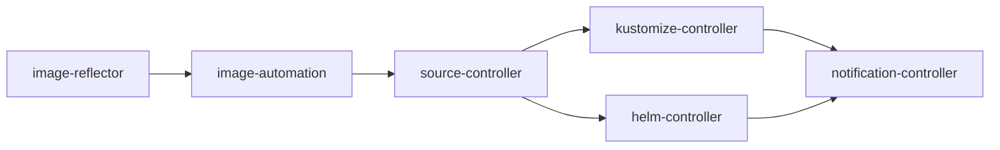
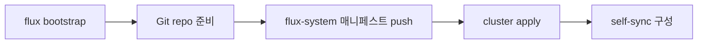

# Flux 설치

> **Flux는 CNCF Graduated GitOps 툴킷**이다. ArgoCD가 "하나의 컨트롤러 + UI"
> 라면, Flux는 **코어 4개 + 옵션 2개**의 독립 컨트롤러(source·kustomize·helm·
> notification + image-reflector·image-automation)를 조합해 쓰는 툴킷 지향이다.
> 설치는 `flux bootstrap`으로 끝나지만, 프로덕션에서는 **GitOps 부트스트랩
> 원칙, 멀티 테넌시, Kustomization 의존성·Health Check, Source 재사용,
> 업그레이드 경로**를 설계해야 한다.

- **현재 기준**: Flux v2.8.0 GA (2026-02-24). Helm v4 기본, kstatus 기반 health
  check, CEL 표현식, Cosign v3 통합
- **전제**: Kubernetes **N-2 지원 정책** — v2.8은 1.32 이상 요구, 실용 권장은
  1.33~1.35 안정 릴리즈, `kubectl`, Git 저장소 접근 권한, 클러스터 관리자 권한
- **GitOps 개념** 배경은 [GitOps 개념](../concepts/gitops-concepts.md),
  ArgoCD와의 비교는 [ArgoCD 설치](../argocd/argocd-install.md) 참조

---

## 1. 아키텍처

### 1.1 컨트롤러 구성

Flux는 단일 바이너리가 아니라 **코어 4 + 옵션 2** 컨트롤러가 Kubernetes
리소스로 협력한다.



| 컨트롤러 | 역할 | 필수 | 상태성 |
|---|---|---|---|
| `source-controller` | Git/OCI/Helm/Bucket artifact fetch·캐시 | ✅ | stateless (Artifact는 in-cluster HTTP 제공) |
| `kustomize-controller` | Kustomization reconcile, SSA, prune | ✅ | stateless |
| `helm-controller` | HelmRelease reconcile (Helm v4) | ✅ | stateless |
| `notification-controller` | 이벤트 fan-out, Webhook receiver | ✅ | stateless |
| `image-reflector-controller` | 이미지 태그 스캔 (`ImageRepository` / `ImagePolicy`) | 옵션 | stateless |
| `image-automation-controller` | 새 태그를 Git에 커밋 (`ImageUpdateAutomation`). 매니페스트에 `# {"$imagepolicy": "ns:policy"}` 마커 사용 | 옵션 | stateless |

**ArgoCD와의 핵심 차이 3가지**

1. **UI가 기본 제공되지 않는다** — CLI + Kubernetes API만이 계약. Weave GitOps
   또는 Headlamp 플러그인으로 UI 추가 가능
2. **Pull 전용·Agentless** — 각 클러스터에 Flux가 자체 설치되어 **외부에서
   자격증명을 갖지 않는다**. ArgoCD hub-and-spoke와 정반대 모델
3. **컨트롤러별 분리 배포** — image-automation만 쓰지 않을 수도, notification
   만 추가 배포할 수도 있다

### 1.2 Artifact 흐름

1. `GitRepository` / `OCIRepository` / `Bucket` 리소스가 원본 가리킴
2. `source-controller`가 fetch·checksum·tar.gz 패키징 → **in-cluster HTTP**
   (`http://source-controller.flux-system/...`)로 노출
3. `kustomize-controller` / `helm-controller`가 HTTP로 Artifact 다운로드
4. Kustomize build 또는 Helm template → Kubernetes에 **Server-Side Apply**
5. `wait` / `healthChecks` / `healthCheckExprs`로 rollout 완료 대기
6. 이벤트를 `notification-controller`가 Slack·Webhook·Git PR 코멘트로 전달

---

## 2. 설치 방식 선택

Flux는 **4가지 공식 경로**가 있다. 조직 성숙도에 따라 선택.

| 방식 | 적합 | 장점 | 단점 |
|---|---|---|---|
| **`flux bootstrap`** | **대부분 조직의 정답** | Git 저장소 자동 생성·동기화, self-management | PAT·SSH 키 관리 필요 |
| Terraform `flux_bootstrap_git` | IaC 일관 운영 | `terraform apply`로 클러스터·Flux 동시 프로비저닝 | state 관리, drift 위험 |
| **Flux Operator** | 선언적 제어 원하는 플랫폼 팀 | CR(`FluxInstance`)로 Flux 자체 관리, 멀티 인스턴스 | 추가 추상화 |
| `flux install` / `kubectl apply` / `helm install` | 로컬 검증·학습 | 가장 빠름 | **GitOps 아님**, 프로덕션 비권장 |

**2026 권장 조합**: `flux bootstrap` (최초) → 이후 자기 자신을 Kustomization
으로 관리(self-management). 대규모 플랫폼은 `Flux Operator`로 전환 고려.

### 2.1 Flux Operator vs flux bootstrap

2025년부터 권장되기 시작한 [Flux Operator](https://fluxcd.control-plane.io/)는
**ControlPlane**이 관리하는 Operator로, Flux 자체를 `FluxInstance` CR로
선언적으로 관리한다.

```yaml
apiVersion: fluxcd.controlplane.io/v1
kind: FluxInstance
metadata:
  name: flux
  namespace: flux-system
spec:
  distribution:
    version: "2.8.x"
    registry: ghcr.io/fluxcd
    artifact: "oci://ghcr.io/controlplaneio-fluxcd/flux-operator-manifests"
  cluster:
    type: kubernetes
    multitenant: true
    networkPolicy: true
  sync:
    kind: OCIRepository
    url: "oci://ghcr.io/my-org/flux-tenant"
    ref: "latest"
    path: "clusters/prod"
```

**선택 기준**

| 상황 | 권장 |
|---|---|
| 단일 클러스터, 소·중규모 | `flux bootstrap` |
| 멀티 클러스터, 중앙 정책 필요 | Flux Operator |
| Flux 자체를 OCI 이미지로 배포 | Flux Operator (`distribution.artifact`) |
| 완전 에어갭 환경 | Flux Operator (`registry` 사설 미러) |

이 글에서는 **`flux bootstrap` 경로**를 중심으로 다룬다. Operator는 별도
공식 문서 참조.

---

## 3. 최소 설치 (검증·학습용)

GitOps 없이 Flux 동작만 확인하는 경로.

```bash
# CLI 설치 (macOS/Linux)
curl -s https://fluxcd.io/install.sh | sudo bash

# 전제 조건 확인
flux check --pre

# 로컬 설치 (Git 연동 없음)
flux install
```

**이 시점의 상태**

- `flux-system` 네임스페이스에 코어 4개(source·kustomize·helm·notification)
  Deployment. `--components-extra`로 image-reflector·image-automation 추가
- GitRepository·Kustomization **없음** — GitOps 동작 안 함
- `flux get all` 출력이 비어 있음

> ⚠️ `flux install`은 **프로덕션 금지**. Flux 자체가 Git에 없으므로 설정
> 변경이 drift로 남고, `flux bootstrap`으로 전환할 때 복잡한 마이그레이션
> 필요.

---

## 4. `flux bootstrap` — 프로덕션 표준

**Flux의 핵심 철학**: Flux 자체를 Flux가 관리한다. `bootstrap` 명령은 이
부트스트랩을 자동화한다.

### 4.1 bootstrap이 하는 일



1. Git 저장소에 `clusters/<NAME>/flux-system/` 디렉터리 생성
2. Flux 컨트롤러 매니페스트(`gotk-components.yaml`) 커밋
3. 현재 cluster에 `kubectl apply`로 컨트롤러 설치
4. `GitRepository` + `Kustomization`(`flux-system`) 생성 → **Flux가 자신의
   Git 디렉터리를 reconcile**
5. SSH 키(또는 PAT)를 cluster Secret으로 저장

### 4.2 GitHub bootstrap (권장 경로)

```bash
# 1) GitHub Fine-grained PAT 생성
#    권한: Contents(RW), Administration(RW), Metadata(RO)
export GITHUB_TOKEN=github_pat_...

# 2) bootstrap
flux bootstrap github \
  --owner=my-org \
  --repository=fleet-infra \
  --branch=main \
  --path=clusters/prod-a \
  --personal=false \
  --private=true
```

**주요 플래그**

| 플래그 | 용도 | 권장 |
|---|---|---|
| `--path` | cluster별 디렉터리 | 반드시 cluster마다 분리 |
| `--personal` | 개인 리포 여부 | 조직 리포면 `false` |
| `--branch` | 동기화 브랜치 | 프로덕션은 `main`, 보호 브랜치 |
| `--components-extra` | image-reflector·image-automation 포함 | 이미지 자동 업데이트 시 |
| `--version` | Flux 버전 pin | `v2.8.0` 등 명시 권장 |
| `--network-policy` | default-deny NP 생성 | **프로덕션 필수**, 기본 `true` |
| `--token-auth` | PAT 기반 인증 유지 | 기본은 SSH 키 자동 생성 |

**GitHub App 인증 (v2.8+)**: PAT 대신 GitHub App installation을 쓰면
rate limit이 3배(15,000 req/h/installation)로 올라가고 자격증명 수명도
짧아진다.

```bash
flux bootstrap github \
  --owner=my-org --repository=fleet --path=clusters/prod \
  --app-id=<APP_ID> --app-installation-id=<INSTALL_ID> \
  --app-private-key-file=./flux-app.pem
```

대규모 조직·여러 cluster의 rate limit 공유 문제를 해결하는 2026 권장 패턴.

### 4.3 GitLab / Bitbucket / Azure DevOps

```bash
# GitLab
flux bootstrap gitlab --owner=my-group --repository=fleet --path=clusters/prod

# Bitbucket Server
flux bootstrap bitbucket-server --owner=proj --username=ci --repository=fleet

# Azure DevOps (generic git로 처리)
flux bootstrap git \
  --url=https://dev.azure.com/org/proj/_git/fleet \
  --username=ci --password="$AZURE_PAT" \
  --path=clusters/prod
```

### 4.4 Generic `flux bootstrap git` — 자체 Git 서버

사설 GitLab·Gitea·Gogs·GitHub Enterprise·Bitbucket Data Center 등.

```bash
flux bootstrap git \
  --url=ssh://git@git.internal.example.com/platform/fleet.git \
  --branch=main \
  --path=clusters/prod \
  --private-key-file=./identity \
  --password="$KEY_PASSPHRASE"
```

CA가 사설이면 `--ca-file=ca.crt`, HTTP 프록시 뒤면 `HTTPS_PROXY` 환경변수.

### 4.5 Terraform bootstrap — IaC 일관성

```hcl
provider "flux" {
  kubernetes = { config_path = "~/.kube/config" }
  git = {
    url = "ssh://git@github.com/my-org/fleet.git"
    ssh = { username = "git", private_key = file("~/.ssh/flux") }
  }
}

resource "flux_bootstrap_git" "this" {
  path               = "clusters/prod-a"
  components_extra   = ["image-reflector-controller",
                        "image-automation-controller"]
  network_policy     = true
  version            = "v2.8.0"
  cluster_domain     = "cluster.local"
  log_level          = "info"
}
```

`terraform apply` 한 번에 클러스터 + Flux 설치. 주의점 2가지:

1. **Flux 매니페스트 변경이 Terraform state drift로 남는다** — self-management
   활성 후에는 Terraform에서 `version`·`components`만 관리하는 게 실무 패턴
2. **`flux_bootstrap_git`가 drift 복구 중 SSH deploy key를 재생성**하면
   기존 key Secret이 날아갈 수 있다. `embedded_manifests = true`로 manifest를
   state에 포함시키거나, SSH key는 외부(Vault/1Password) 주입으로 state
   밖에 둘 것

---

## 5. Git 저장소 레이아웃

Flux 공식 권장 **Mono repo** 구조. `clusters/`는 각 클러스터의 root
Kustomization이 가리키는 디렉터리.

```text
fleet-infra/
├── clusters/
│   ├── prod-a/
│   │   ├── flux-system/            # bootstrap이 생성
│   │   │   ├── gotk-components.yaml
│   │   │   ├── gotk-sync.yaml
│   │   │   └── kustomization.yaml
│   │   ├── infrastructure.yaml     # 인프라 Kustomization
│   │   └── apps.yaml               # 앱 Kustomization
│   ├── prod-b/
│   └── staging/
├── infrastructure/
│   ├── base/
│   │   ├── cert-manager/
│   │   ├── ingress-nginx/
│   │   └── external-secrets/
│   └── overlays/
│       ├── prod/
│       └── staging/
└── apps/
    ├── base/
    └── overlays/
```

**이 구조의 장점**

- cluster별로 다른 버전·오버레이를 `clusters/<NAME>/`에 집중
- `infrastructure/`, `apps/`는 여러 cluster가 공유
- `flux-system/kustomization.yaml`에 추가 리소스 한 줄만 넣으면 반영

**안티패턴**: cluster별 repo를 따로 만드는 것. drift 추적·PR 리뷰·템플릿
재사용이 모두 어려워진다.

---

## 6. 컨트롤러별 리소스·튜닝

### 6.1 기본 리소스 (Flux v2.8)

| 컨트롤러 | requests | limits |
|---|---|---|
| `source-controller` | 50m/64Mi | 1/1Gi |
| `kustomize-controller` | 100m/64Mi | 1/1Gi |
| `helm-controller` | 100m/64Mi | 1/1Gi |
| `notification-controller` | 100m/64Mi | 1/1Gi |
| `image-reflector-controller` | 100m/64Mi | 1/1Gi |
| `image-automation-controller` | 100m/64Mi | 1/1Gi |

**규모 가이드**

| Kustomization 수 | kustomize-controller | source-controller |
|---|---|---|
| ~50 | 기본값 유지 | 기본값 유지 |
| 50~500 | limits CPU 2, Memory 2Gi | limits 2Gi (Git 캐시) |
| 500~2000 | replicas 2 + sharding | limits 4Gi |
| 2000+ | Flux Operator + 샤드 분리 | OCIRepository 우선 |

### 6.2 Patch로 리소스 조정

bootstrap 결과물에 커스텀 patch를 얹는 표준 방법. **`gotk-components.yaml`
· `gotk-sync.yaml`은 bootstrap이 덮어쓰므로 직접 수정 금지** — 같은
`flux-system/kustomization.yaml`의 `patches:` 블록에 추가하거나 별도 patch
파일을 두고 `resources:`로 참조한다.

```yaml
# clusters/prod-a/flux-system/kustomization.yaml
apiVersion: kustomize.config.k8s.io/v1beta1
kind: Kustomization
resources:
  - gotk-components.yaml
  - gotk-sync.yaml
patches:
  - target: {kind: Deployment, name: "(kustomize-controller|source-controller)"}
    patch: |
      - op: replace
        path: /spec/template/spec/containers/0/resources
        value:
          requests: {cpu: 200m, memory: 256Mi}
          limits:   {cpu: 2,    memory: 2Gi}
  - target: {kind: Deployment, name: source-controller}
    patch: |
      - op: add
        path: /spec/template/spec/containers/0/args/-
        value: --storage-adv-addr=source-controller.$(RUNTIME_NAMESPACE).svc.cluster.local.:80
```

commit → push → Flux가 자동 반영. "Flux가 Flux를 업그레이드"한다.

### 6.3 HA 구성 — Active-Passive가 전부

기본 Flux는 **single replica**다. **모든 컨트롤러가 leader-election 기반
Active-Passive** — non-leader replica는 readiness probe를 의도적으로
실패시켜 Artifact HTTP 트래픽까지 받지 않도록 설계됐다. replicas를 올리는
것은 **failover 속도 개선** 목적이지 수평 확장이 아니다.

```yaml
# patch — failover 목적의 replicas 증가
- target: {kind: Deployment, name: kustomize-controller}
  patch: |
    - op: replace
      path: /spec/replicas
      value: 2
```

| 컨트롤러 | 복수 replica 효과 |
|---|---|
| `source-controller` | failover 전용. Artifact HTTP도 leader만 서빙 |
| `kustomize-controller` | failover 전용 |
| `helm-controller` | failover 전용 |
| `notification-controller` | failover 전용 |
| `image-*` | failover 전용 |

**실제 확장 수단 = 샤딩**. 컨트롤러에 `--watch-label-selector`를
지정하면 해당 label이 붙은 리소스만 reconcile. 예: label 기준으로 3개
shard (shard: a/b/c)로 컨트롤러 3개를 띄워 부하 분산. ArgoCD의
application-controller 샤딩과 유사한 2026 운영 패턴.

```yaml
# Shard A 전용 controller
- target: {kind: Deployment, name: kustomize-controller-a}
  patch: |
    - op: add
      path: /spec/template/spec/containers/0/args/-
      value: --watch-label-selector=sharding.fluxcd.io/key=a
```

Kustomization·GitRepository 쪽에는 `labels: {sharding.fluxcd.io/key: a}`를
명시. **대규모(수백 Kustomization+) 전용 기법** — 소·중규모는 샤딩 불필요.

---

## 7. Source 리소스 — Git·OCI·Bucket·Helm

모든 Kustomization·HelmRelease는 반드시 Source를 참조한다.

### 7.1 GitRepository

```yaml
apiVersion: source.toolkit.fluxcd.io/v1
kind: GitRepository
metadata:
  name: webapp
  namespace: apps
spec:
  interval: 1m
  url: https://github.com/my-org/webapp
  ref:
    branch: main      # 또는 tag, semver, commit
  secretRef:
    name: git-credentials
  ignore: |
    /*
    !/deploy
```

| 필드 | 용도 |
|---|---|
| `ref.branch` / `ref.tag` / `ref.semver` / `ref.commit` | 참조 방법 |
| `ignore` | `.sourceignore` — Artifact에 제외할 파일 |
| `include` | 다른 GitRepository Artifact 병합 (mono repo 조각) |
| `verify` | Git commit cosign·GPG 서명 검증 |

### 7.2 OCIRepository (권장 추세)

Git보다 **OCI 레지스트리**에 매니페스트를 올리는 방식이 2025+ 권장 경로다.
rate limit 없음, 버전·서명·SBOM이 OCI artifact로 통합.

```yaml
apiVersion: source.toolkit.fluxcd.io/v1
kind: OCIRepository
metadata:
  name: webapp
  namespace: apps
spec:
  interval: 5m
  url: oci://ghcr.io/my-org/webapp-manifests
  ref:
    semver: ">=1.0.0 <2.0.0"
  verify:
    provider: cosign
    secretRef:
      name: cosign-pub
  layerSelector:
    mediaType: "application/vnd.cncf.flux.content.v1.tar+gzip"
```

> ⚠️ Flux v2.8부터 `source.toolkit.fluxcd.io/v1beta2`는 **CRD에서 제거**
> 되었다. 반드시 `v1` 사용. 이전 매니페스트는 `flux migrate` 명령으로 일괄
> 이관(§11.1).

**이 방식의 이점**

- Git provider rate limit 해방 (GitHub Actions 러너 수백 대가 pull해도 OK)
- `flux push artifact oci://ghcr.io/my-org/webapp-manifests:1.2.3 --path ./deploy`
  로 CI에서 직접 업로드
- Cosign keyless 서명 + SLSA provenance 검증 (`spec.verify`)
- Kubernetes 1.35 계열 CSI 없이도 in-memory로 해결

### 7.3 Bucket (S3·GCS·Azure Blob)

```yaml
apiVersion: source.toolkit.fluxcd.io/v1
kind: Bucket
metadata:
  name: charts
  namespace: flux-system
spec:
  interval: 10m
  provider: generic      # aws, gcp, azure, generic
  bucketName: k8s-manifests
  endpoint: s3.amazonaws.com
  region: us-east-1
  secretRef:
    name: s3-credentials
```

멀티 CI에서 S3에 manifest tar를 올리는 파이프라인과 결합.

### 7.4 HelmRepository

Helm 차트 소스. [Flux Helm](./flux-helm.md)에서 상세.

### 7.5 Source 재사용 원칙

| 안티패턴 | 올바른 방법 |
|---|---|
| 앱마다 GitRepository 1개씩 | 같은 리포는 **하나의 GitRepository** + 여러 Kustomization이 다른 `path` 사용 |
| Kustomization마다 토큰 Secret 중복 | Secret을 `flux-system`에 두고 `secretRef` 재사용 |
| interval 10s (과도 폴링) | 최소 1m, 실시간성 필요하면 **Webhook Receiver** |

---

## 8. Kustomization — reconcile 단위

### 8.1 기본 스펙

```yaml
apiVersion: kustomize.toolkit.fluxcd.io/v1
kind: Kustomization
metadata:
  name: webapp
  namespace: apps
spec:
  interval: 1h             # drift 탐지 주기
  retryInterval: 2m        # 실패 재시도
  timeout: 5m              # 전체 reconcile 타임아웃
  prune: true              # Git에서 사라지면 cluster에서도 제거
  wait: true               # 모든 리소스 Ready까지 대기
  targetNamespace: apps
  sourceRef:
    kind: GitRepository
    name: webapp
  path: ./deploy/prod
  serviceAccountName: flux-apps   # 멀티 테넌시 RBAC
```

### 8.2 Health Check — kstatus 기반

Flux v2.8부터 기본 엔진이 **kstatus**(Kubernetes 표준 status 조건)로
통일. 커스텀 리소스가 `status.conditions` + `observedGeneration`을 따르면
자동으로 Ready 판정.

**세 방식은 상호 배타** — `wait: true`가 있으면 `healthChecks`는 무시된다.

**방법 1 — `wait: true`**: 모든 reconcile 리소스를 자동 체크 (가장 단순,
소·중규모 권장).

**방법 2 — 개별 `healthChecks`** (`wait` 끄고 사용): 선별적 체크로 큰
Kustomization에서 특정 리소스만 게이트로 삼고 싶을 때.

```yaml
spec:
  wait: false            # ← healthChecks 사용 시 명시적 false
  healthChecks:
    - apiVersion: apps/v1
      kind: Deployment
      name: backend
      namespace: apps
    - apiVersion: batch/v1
      kind: Job
      name: db-migrate
      namespace: apps
```

**방법 3 — `healthCheckExprs` (CEL, v2.8)**: 표준 status를 따르지 않는 CRD용.

```yaml
spec:
  healthChecks:
    - apiVersion: custom.io/v1
      kind: MyResource
      name: example
  healthCheckExprs:
    - apiVersion: custom.io/v1
      kind: MyResource
      current: "status.phase == 'Ready'"
      inProgress: "status.phase == 'Provisioning'"
      failed: "status.phase == 'Failed'"
```

### 8.3 `dependsOn` — 순서 제어

```yaml
# apps.yaml
spec:
  dependsOn:
    - name: infrastructure    # 인프라 먼저
    - name: cert-manager
      namespace: cert-manager
```

**dependsOn은 "Ready 상태 전파"가 아니라 "apply 순서 보장"**. 상위
Kustomization이 `Ready=True`일 때까지 하위는 apply를 시작하지 않는다.
`readyExpr`(v2.8+)로 CEL 조건 추가 가능.

**흔한 실수**

- `dependsOn`에 자신을 넣으면 영원히 reconcile 안 됨 → `flux suspend/resume`
- 순환 의존성 → `ReconciliationSucceeded` 이벤트 미발생, controller가 감지

### 8.4 CancelHealthCheckOnNewRevision (v2.8)

기존에는 health check가 timeout까지 꽉 차야 "실패"였다. v2.8부터 **새
리비전이 도착하면 진행 중인 health check가 즉시 취소**된다.

```yaml
# 기본 활성 (feature gate)
# --feature-gates=CancelHealthCheckOnNewRevision=true
```

MTTR이 극적으로 줄어든다 — 배포 실패 → 즉시 수정 push → 이전 health check
대기 없이 새 리비전 검증 시작.

### 8.5 Post-build 변수 치환

```yaml
spec:
  postBuild:
    substitute:
      cluster_env: prod
    substituteFrom:
      - kind: ConfigMap
        name: cluster-vars
      - kind: Secret
        name: cluster-secret-vars
        optional: false
```

매니페스트 안에서 `${cluster_env}` 형태로 참조. 환경별 오버라이드에
Kustomize overlay 대신 쓰면 구조가 단순해진다. **Strict mode**
(`--feature-gates=StrictPostBuildSubstitutions=true`)로 정의 누락을
컴파일 타임에 잡는 걸 프로덕션 기본값으로 권장.

### 8.6 Prune 안전 장치

```yaml
# Kustomization에서 prune 활성이어도 특정 리소스는 보호
metadata:
  annotations:
    kustomize.toolkit.fluxcd.io/prune: disabled
```

PersistentVolumeClaim, DB 관련 리소스, namespace 같이 **실수로 삭제되면
데이터 손실**이 나는 리소스에 반드시 annotation. Helm chart의 lookup에서는
자동 적용되지 않으니 수동 관리.

---

## 9. 멀티 테넌시

Flux의 강점 — 테넌트별 ServiceAccount 기반 impersonation.

### 9.1 원칙

- Platform team이 `flux-system`을 cluster-admin 권한으로 운영
- 각 테넌트에 namespace + ServiceAccount (`flux-apps`) + Role·RoleBinding
- 테넌트의 Kustomization은 `serviceAccountName: flux-apps`로 **자기 권한으로**
  apply — cluster-admin 권한 상속 금지

### 9.2 구조

```yaml
# tenant-a/tenant-rbac.yaml
apiVersion: v1
kind: ServiceAccount
metadata:
  name: flux-apps
  namespace: tenant-a
---
apiVersion: rbac.authorization.k8s.io/v1
kind: RoleBinding
metadata:
  name: flux-apps
  namespace: tenant-a
subjects:
  - kind: ServiceAccount
    name: flux-apps
    namespace: tenant-a
roleRef:
  apiGroup: rbac.authorization.k8s.io
  kind: ClusterRole
  name: edit             # 또는 custom Role
---
# tenant-a/kustomization.yaml (플랫폼 팀이 관리)
apiVersion: kustomize.toolkit.fluxcd.io/v1
kind: Kustomization
metadata:
  name: tenant-a
  namespace: flux-system
spec:
  sourceRef:
    kind: GitRepository
    name: tenant-a       # 테넌트 소유 repo
  path: ./deploy
  targetNamespace: tenant-a
  serviceAccountName: flux-apps   # ← 테넌트 SA로 impersonate
  decryption:
    provider: sops
    secretRef: {name: sops-age}
```

### 9.3 `--no-cross-namespace-refs=true` — 필수 하드닝

플래그를 켜지 않으면 테넌트 A의 Kustomization이 **테넌트 B의 GitRepository
나 Secret을 참조**할 수 있다. 프로덕션은 무조건 활성:

```yaml
# Kustomization patch
- target: {kind: Deployment, name: "(kustomize|helm|notification|image-reflector|image-automation)-controller"}
  patch: |
    - op: add
      path: /spec/template/spec/containers/0/args/-
      value: --no-cross-namespace-refs=true
```

**이 플래그 없이는 멀티 테넌트를 운영하지 말 것**. CIS-유사 하드닝 표준.

### 9.4 `--default-service-account=flux-apps`

Kustomization/HelmRelease에서 `spec.serviceAccountName`이 비어 있으면
컨트롤러가 지정한 SA로 **자동 대체**하는 플래그. 테넌트가 SA를 깜빡해도
cluster-admin 권한으로 apply되지 않게 하는 1차 방어선.

```yaml
# controller patch
- op: add
  path: /spec/template/spec/containers/0/args/-
  value: --default-service-account=flux-apps
```

**주의**: 이 플래그는 "SA 비어 있을 때 기본값 주입"이고 "명시 거부"는
아니다. 테넌트가 명시적으로 다른 SA를 지정하면 그대로 사용된다. 완전
격리는 **테넌트 SA 권한을 RBAC로 좁히기 + `--no-cross-namespace-refs`
+ Kustomization을 담는 namespace에 플랫폼 팀만 write 가능하도록 RBAC**
세 가지를 모두 조합해야 한다.

---

## 10. 네트워크·보안 하드닝

### 10.1 NetworkPolicy — bootstrap 기본 제공

`--network-policy=true`(기본)면 bootstrap이 `flux-system` namespace에
**default-deny + 허용 리스트**를 자동 생성.

```yaml
# 자동 생성 (요약)
# - flux-system → flux-system: 전체 허용
# - flux-system → kube-dns: UDP/TCP 53
# - flux-system → egress: 전체 (Git·Helm·OCI fetch 필요)
```

실무 강화:

- Cilium/Calico로 **FQDN egress 제한**: `github.com`, `ghcr.io`, 사설 Git 호스트만
- `kustomize-controller`에 `--no-remote-bases=true` — 원격 base URL 로딩 차단
  (공급망 공격 표면 축소)
- 외부 Webhook Receiver는 **Ingress + 토큰(`spec.secretRef`) + Git provider
  서명 검증**을 모두 사용. IP 허용 리스트는 provider IP 풀이 변경되면 깨짐

```yaml
# Receiver — GitHub push 이벤트
apiVersion: notification.toolkit.fluxcd.io/v1
kind: Receiver
metadata:
  name: webapp
  namespace: flux-system
spec:
  type: github
  events: ["ping", "push"]
  secretRef: {name: github-webhook-token}   # x-hub-signature HMAC
  resources:
    - apiVersion: source.toolkit.fluxcd.io/v1
      kind: GitRepository
      name: webapp
      namespace: apps
```

### 10.2 Pod Security

기본 manifest 자체가 `runAsNonRoot: true`, `readOnlyRootFilesystem: true`,
`allowPrivilegeEscalation: false`, `seccompProfile: RuntimeDefault`,
`capabilities.drop: [ALL]` 상태. 오버라이드 금지.

### 10.3 Secret·자격증명 관리

| 자격증명 | 저장 위치 | 보안 강화 |
|---|---|---|
| Git 접근 토큰·SSH 키 | `flux-system/Secret` | ESO + Vault 주입 |
| Webhook 서명 키 | Receiver Secret | ESO 주입, 30일 rotate |
| SOPS 복호화 키 | `age`/`gpg`는 Secret, KMS는 키 ID만 | **awskms/gcpkms/azurekeyvault 직접 지원** — 장기 키 저장 없이 Workload Identity로 호출 |
| 컨테이너 레지스트리 자격증명 | `imagePullSecret` 또는 OCIRepository `secretRef` | IRSA/GKE WI/Azure WI (v2.8+) |

**Flux v2.8 Workload Identity**: OCIRepository·ImageRepository·Bucket·
SOPS가 cloud provider IAM을 직접 호출. 장기 토큰·키 파일을 cluster Secret
에 저장할 필요가 없어지는 2026 표준.

**ESO · Vault · SOPS 도구별 상세는 [security/](../../security/)에서 다룬다**.
Flux 관점에서는 어떤 도구를 주입받아도 `decryption` / `secretRef` 인터페이스는
동일.

### 10.4 OCI 서명 검증

```yaml
apiVersion: source.toolkit.fluxcd.io/v1
kind: OCIRepository
spec:
  verify:
    provider: cosign       # 또는 notation
    matchOIDCIdentity:
      - issuer: "^https://token.actions.githubusercontent.com$"
        subject: "^https://github.com/my-org/webapp/.github/workflows/.*$"
```

Cosign v3 keyless(GitHub OIDC) 기본 지원. 공급망 보안 강화.

---

## 11. 업그레이드

Flux는 **컨트롤러 + CRD 버전이 함께 이동**한다.

### 11.1 권장 절차 — v2.7 이전 → v2.8

v2.8은 2.0 이후 **가장 큰 호환성 이벤트**다(`v1beta2`/`v2beta2` 3개 API
제거). 단순 bootstrap 재실행으로 끝나지 않는다.

```bash
# 1) CLI 먼저 업그레이드
brew upgrade fluxcd/tap/flux
flux version --client

# 2) 설치 전 사전 점검 (--pre는 설치 전 전용)
flux check

# 3) ★ Git 매니페스트 API 이관 (v2.7 이전에서 오는 경우 필수)
#    v1beta2 → v1로 자동 rewrite. clusters/ 루트에서 실행
cd fleet-infra
flux migrate -f .
git add -A && git commit -m "chore: migrate Flux APIs to v1"
git push

# 4) ★ 클러스터 etcd 스토리지 버전 이관 (제거된 API 정리 전)
flux migrate

# 5) bootstrap 재실행 — 새 버전으로 컨트롤러 매니페스트 갱신
flux bootstrap github --owner=my-org --repository=fleet \
  --path=clusters/prod --version=v2.8.0

# 6) Git에 commit된 결과를 Flux가 자기 자신에게 apply
flux reconcile kustomization flux-system --with-source
```

**`flux migrate` 두 가지 용도**

| 모드 | 동작 | 실행 위치 |
|---|---|---|
| `flux migrate -f <dir>` | Git의 deprecated API manifest를 v1로 rewrite | 로컬 Git 작업 디렉터리 |
| `flux migrate` (no args) | 클러스터의 CRD 스토리지 버전 마이그레이션 | 클러스터 |

4번 단계를 건너뛰면 **bootstrap 5번 단계에서 CRD가 old 버전 리소스를
디코딩 실패**하며 막힌다.

### 11.2 업그레이드 원칙

1. **Minor 버전은 한 단계씩**: v2.6 → v2.8 금지, v2.6 → v2.7 → v2.8
2. **CRD deprecation 체크**: v2.8은 `v1beta2`/`v2beta2` 3개 API 제거.
   [릴리즈 노트](https://github.com/fluxcd/flux2/releases)의 breaking
   changes 필독
3. **staging 클러스터 선행**: `clusters/staging/` 먼저 bump → 1주 관찰 → prod
4. **Helm v4 전환 주의**: v2.8에서 helm-controller 내부 Helm이 v4로 변경.
   HelmRelease API 호환이지만 일부 chart post-render·CRD 처리 변경

### 11.3 롤백

```bash
# 이전 버전으로 bootstrap 재실행 (마이너 버전 skip 전이라면)
flux bootstrap github ... --version=v2.7.5
```

단, **`flux migrate`를 실행한 이후에는 단순 bootstrap 재실행으로
롤백 불가**. 제거된 API의 CRD가 없어 old 버전 매니페스트를 apply할 수
없기 때문. 유일한 복구 경로는 **etcd 스냅샷 복원**이므로 업그레이드 직전에
반드시 스냅샷을 떠둘 것. 이 비대칭이 mino 점프 업그레이드 금지의 실질적
이유다.

---

## 12. 설치 직후 검증 체크리스트

```bash
# 1. 컨트롤러 Pod Running
kubectl -n flux-system get pods

# 2. CRD 버전
kubectl get crd -l app.kubernetes.io/part-of=flux

# 3. flux-system 자체 Kustomization Ready
flux get kustomizations -A

# 4. Git 소스 fetch 성공
flux get sources git -A

# 5. 이벤트 확인
flux events -A --since=5m

# 6. 메트릭 스크레이핑 (각 컨트롤러 :8080/metrics)
kubectl -n flux-system port-forward svc/source-controller 8080
curl -s localhost:8080/metrics | grep gotk_reconcile

# 7. 종합 상태 확인 (--pre는 설치 전에만 씀)
flux check
```

**프로덕션 SLI 3종 권장 알람**

| 메트릭 | 의미 | 알람 |
|---|---|---|
| `gotk_reconcile_condition{type="Ready",status="False"}` | reconcile 실패 상태 | 5분 이상 지속 시 page |
| `gotk_suspend_status` | 수동 suspend 여부 | 임계 리소스에 set 되면 warn |
| `controller_runtime_reconcile_errors_total` | 컨트롤러 내부 에러 비율 | rate 5m 기준 `>0.1` warn |

Grafana 공식 대시보드: [Flux Cluster Stats](https://grafana.com/grafana/dashboards/16714).
`observability/` 카테고리의 Prometheus·알람 설정 글과 조합해 SLO로 승격 권장.

**알림 설정 권장**: `Alert` + `Provider` CR로 Slack·Webhook에 배포 이벤트
전달. `notification-controller`는 기본 설치에 포함.

```yaml
apiVersion: notification.toolkit.fluxcd.io/v1beta3
kind: Provider
metadata:
  name: slack
  namespace: flux-system
spec:
  type: slack
  channel: flux-alerts
  secretRef: {name: slack-webhook}
---
apiVersion: notification.toolkit.fluxcd.io/v1beta3
kind: Alert
metadata:
  name: prod-events
  namespace: flux-system
spec:
  providerRef: {name: slack}
  eventSeverity: error
  eventSources:
    - kind: Kustomization
      name: "*"
```

---

## 13. 안티패턴

| 안티패턴 | 왜 문제 | 교정 |
|---|---|---|
| `flux install`을 프로덕션에 사용 | Flux 자체가 Git 밖에 → GitOps 위반 | `flux bootstrap` |
| cluster마다 Git 리포 분리 | 공통 인프라 재사용 불가, 유지보수 파편화 | mono repo + `clusters/<name>` |
| 동일 Git 참조를 GitRepository마다 분리 | 폴링 중복, rate limit 소진 | 하나의 GitRepository + 여러 Kustomization path |
| `interval: 30s` 같은 과도 폴링 | Git provider 차단, controller CPU | 최소 1m + Webhook Receiver |
| Kustomization `wait` / `healthChecks` 없음 | 실패한 rollout 감지 못함, 다음 dependsOn 진행 | `wait: true` 기본값 |
| `--no-cross-namespace-refs` 미활성 | 테넌트 격리 무력화 | 하드닝 필수 |
| `serviceAccountName` 누락 | 테넌트가 cluster-admin 권한으로 apply | `--default-service-account` 플래그 |
| `prune: true` + 민감 리소스 annotation 없음 | Git에서 일시 삭제 = 데이터 손실 | `kustomize.toolkit.fluxcd.io/prune: disabled` |
| SOPS 키를 Git에 평문 저장 | 완전 노출 | ESO + Vault/KMS + Workload Identity |
| Flux 버전 미지정 bootstrap | latest 암시적 업그레이드 | `--version=v2.8.0` 명시 |
| minor 2단계 이상 점프 업그레이드 | CRD·API 변경 실패 | 한 단계씩 |
| Flux 자체를 kubectl apply로 수동 수정 | 다음 reconcile에서 roll back | 모든 변경은 Git PR |
| image-automation controller 활성인데 Git write 권한 주지 않음 | 이미지 태그 업데이트 실패 | PAT Contents RW 부여 |
| OCIRepository에 `verify` 없음 | 공급망 변조 감지 못함 | Cosign + OIDC identity 검증 |
| `notification-controller` receiver를 외부 노출 X | push-mode webhook 불가 | Ingress + signature verification |

---

## 14. 도입 로드맵

1. **단일 노드 검증**: `flux install` + 간단한 Kustomization으로 개념 이해
2. **Bootstrap 전환**: `flux bootstrap github`로 cluster별 Git 구조 확립
3. **Kustomization 분리**: `infrastructure` → `apps` 순 `dependsOn`
4. **멀티 테넌시 하드닝**: `--no-cross-namespace-refs`,
   `--default-service-account`, 테넌트별 SA/Role
5. **Webhook Receiver**: Git provider에서 push 이벤트로 즉시 reconcile
6. **Notification**: Slack + PR comment (v2.8) 알림 설정
7. **OCIRepository 전환**: rate limit·서명 검증 위해 OCI로 manifest 배포
8. **ImageRepository/ImageUpdateAutomation**: 이미지 자동 업데이트 파이프라인
9. **Cosign + SLSA**: OCIRepository `verify`로 공급망 보안
10. **Flux Operator 검토**: 멀티 클러스터·초대규모 시 Operator 도입

---

## 15. 관련 문서

- [Flux Helm](./flux-helm.md) — HelmRelease, chart source, values
- [GitOps 개념](../concepts/gitops-concepts.md) — pull vs push, 원칙
- [ArgoCD 설치](../argocd/argocd-install.md) — ArgoCD와 비교
- [SLSA](../devsecops/slsa-in-ci.md) — OCIRepository 서명 검증 상세

---

## 참고 자료

- [Flux 공식 문서 — Installation](https://fluxcd.io/flux/installation/) — 확인: 2026-04-25
- [Flux Bootstrap](https://fluxcd.io/flux/installation/bootstrap/) — 확인: 2026-04-25
- [Kustomization CRD](https://fluxcd.io/flux/components/kustomize/kustomizations/) — 확인: 2026-04-25
- [Flux v2.8.0 GA 블로그](https://fluxcd.io/blog/2026/02/flux-v2.8.0/) — 확인: 2026-04-25
- [fluxcd/flux2 Releases](https://github.com/fluxcd/flux2/releases) — 확인: 2026-04-25
- [Flux Operator — ControlPlane](https://fluxcd.control-plane.io/) — 확인: 2026-04-25
- [Flux Roadmap](https://fluxcd.io/roadmap/) — 확인: 2026-04-25
- [Multi-tenancy Guide](https://fluxcd.io/flux/installation/configuration/multitenancy/) — 확인: 2026-04-25
- [Upgrade Guide](https://fluxcd.io/flux/installation/upgrade/) — 확인: 2026-04-25
- [Terraform Flux Provider](https://registry.terraform.io/providers/fluxcd/flux/latest/docs) — 확인: 2026-04-25
