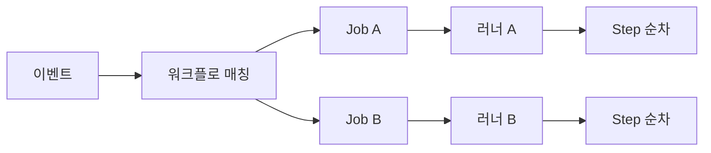

# GHA 기본

> **GitHub Actions(GHA)는 이벤트 주도형 CI/CD 엔진**. 레포지토리에서
> 발생한 이벤트가 워크플로를 트리거하고, 러너에서 잡(Job) 단위로
> 병렬 실행된다. 이 글은 **워크플로·잡·스텝·매트릭스**의 정확한
> 의미론, 러너·이벤트·컨텍스트·표현식·동시성·환경의 작동 원리,
> 그리고 2026-04 기준 최신 변경사항(Node 20 EOL, ARM64 일반화,
> 가격 개편)까지 글로벌 스탠다드 깊이로 정리한다.

- **현재 기준**: **ubuntu-latest = ubuntu-24.04**, JavaScript
  Action 기본 **Node 20** — Node 20은 **2026-04-30 EOL**로 공지
  되어 이후 러너가 단계적으로 **Node 24**로 전환. 당장은
  `FORCE_JAVASCRIPT_ACTIONS_TO_NODE24=true`로 선행 검증 가능
- **Artifact 주의**: `actions/upload-artifact@v4` / `download-artifact@v4`는
  **이름 중복 불가·immutable**(v3와 breaking). 같은 잡이 매트릭스로
  같은 artifact 이름을 올리면 409 에러 → 이름에 `matrix.*` 포함
- **주제 경계**: 이 글은 "단일 워크플로를 쓰는 법". 재사용·
  Composite·캐시는 [GHA 고급](./gha-advanced.md), OIDC·권한은
  [GHA 보안](./gha-security.md), K8s 기반 ephemeral 러너는
  [ARC 러너](./arc-runner.md)
- **가격**: 2026-01-01 호스티드 러너 가격 인하(최대 39%),
  ARM64 standard 러너 private repo 지원, Actions 플랫폼 수수료
  `$0.002/min` 도입

---

## 1. 실행 모델 한눈에

### 1.1 용어의 층위

| 레이어 | 단위 | 스코프 |
|---|---|---|
| Event | 트리거 | 레포·조직 단위 |
| Workflow | `.github/workflows/*.yml` 한 파일 | 하나의 트리거 묶음 |
| Job | 러너에 예약되는 단위 | 하나의 VM/컨테이너 |
| Step | Job 안의 순차 실행 단위 | 같은 파일시스템 공유 |
| Action | Step에서 호출하는 재사용 로직 | 외부 레포·OCI 이미지 |

**핵심 원칙**:

- **Job 간은 독립 러너** — 같은 워크플로여도 파일시스템·환경변수
  공유 안 됨. 공유하려면 `outputs`·artifact·cache 중 선택
- **Step 간은 같은 러너** — `$GITHUB_ENV`·`$GITHUB_OUTPUT`·
  작업 디렉터리 공유
- **Workflow 간은 완전 분리** — `workflow_call`·`workflow_run`·
  `repository_dispatch`로만 연결

### 1.2 실행 흐름



한 워크플로가 매칭되면 GHA는 **Job DAG**를 구성하고, 의존성이
없는 잡은 병렬로 러너에 디스패치한다. `needs:`로 의존성을 주면
DAG 순서가 정해진다.

---

## 2. 워크플로 파일 구조

### 2.1 최소 스켈레톤

```yaml
# .github/workflows/ci.yml
name: CI                       # UI 표시용 (생략 시 파일 경로)
run-name: "CI #${{ github.run_number }} by ${{ github.actor }}"

on:                            # 트리거
  push:
    branches: [main]
  pull_request:

permissions:                   # GITHUB_TOKEN 범위 — 최소화 원칙
  contents: read

concurrency:                   # 동일 그룹 내 중복 실행 제어
  group: ${{ github.workflow }}-${{ github.ref }}
  cancel-in-progress: true

defaults:                      # 모든 Job에 상속
  run:
    shell: bash

env:                           # 워크플로 전역 env
  NODE_ENV: test

jobs:
  build:
    runs-on: ubuntu-latest
    timeout-minutes: 10
    steps:
      - uses: actions/checkout@v5
      - uses: actions/setup-node@v5
        with:
          node-version: 22
          cache: npm
      - run: npm ci
      - run: npm test
```

### 2.2 파일 위치와 탐색 규칙

- `.github/workflows/*.yml` (또는 `.yaml`) — 하위 디렉터리 무시,
  평면 구조만 인식
- 파일명은 **유일 식별자 아님** — UI·API는 `name` 필드로 구분.
  `name`이 같으면 UI에서 섞여 보인다
- 워크플로 수정은 **해당 브랜치에 파일이 있어야** 실행. main에
  merge 전까지는 PR에서만 트리거 (default branch 제약은 일부
  이벤트에만 해당)

---

## 3. 이벤트(Event) — 트리거

### 3.1 자주 쓰는 이벤트

| 이벤트 | 용도 | 비고 |
|---|---|---|
| `push` | 브랜치/태그 푸시 | `branches`·`tags`·`paths` 필터 |
| `pull_request` | PR 생성·갱신·머지 | fork PR은 secret 제한 |
| `pull_request_target` | fork PR에서 secret 필요 시 | **base 브랜치 권한**으로 실행 → 보안 주의 |
| `workflow_dispatch` | 수동 실행 (UI·API) | `inputs` 정의 |
| `schedule` | cron | UTC, 지연 수 분 발생 가능 |
| `workflow_call` | 재사용 워크플로 호출 | [GHA 고급](./gha-advanced.md) |
| `workflow_run` | 다른 워크플로 완료 후 연쇄 | **호출되는 워크플로 파일이 default branch에 있어야** 트리거 |
| `release` | 릴리스 생성·발행 | 태그 기반 배포에 유용 |
| `issues`·`issue_comment` | 이슈·코멘트 이벤트 | ChatOps 구현 |
| `repository_dispatch` | 외부 시스템 트리거 | `POST /dispatches` API |

### 3.2 필터로 불필요 실행 차단

```yaml
on:
  push:
    branches:
      - main
      - "release/**"           # glob 지원
    branches-ignore:           # branches와 동시 사용 금지
      - "gh-pages"
    paths:
      - "src/**"
      - "!src/**/*.md"         # 부정 패턴 (negation)
    tags:
      - "v*.*.*"
  pull_request:
    types: [opened, synchronize, reopened, ready_for_review]
```

**주의**:

- `branches`와 `branches-ignore`는 **같은 이벤트에서 동시 사용 불가**
  — 둘 중 하나만 선택
- `paths`와 `paths-ignore`도 마찬가지로 **동시 지정 불가**
- `paths` 필터는 **머지 커밋 기준** — PR에 여러 커밋이 있어도
  머지 후 diff로 판정

### 3.3 `workflow_dispatch` inputs

```yaml
on:
  workflow_dispatch:
    inputs:
      environment:
        description: "배포 환경"
        type: choice
        options: [dev, staging, prod]
        default: dev
      version:
        description: "릴리스 태그"
        type: string
        required: true
      dry-run:
        type: boolean
        default: true
```

UI·`gh workflow run`·API에서 입력 받을 수 있다. `type: choice`가
2023년 이후 정식, 이전의 `string` + 정규식 검증보다 안전하다.

### 3.4 `pull_request` vs `pull_request_target`

| 축 | `pull_request` | `pull_request_target` |
|---|---|---|
| 체크아웃 기본 | PR의 **HEAD** | base 브랜치의 **BASE** |
| Secret 접근 | fork PR은 **불가** | **가능** (위험) |
| `GITHUB_TOKEN` 권한 | 읽기 전용 (fork) | 쓰기 가능 |
| 쓰임 | 일반 CI | 라벨·댓글·fork PR 메타 처리 |

**경고**: `pull_request_target`에서 `checkout`을 `ref:
${{ github.event.pull_request.head.sha }}`로 바꾸면 **fork의
악성 코드가 secret에 접근** 가능. PR 코드를 실행해야 한다면
일반 `pull_request` + `environment` 승인 게이트를 쓰는 게 안전.

---

## 4. 잡(Job) — 러너 단위 실행

### 4.1 필수 키

```yaml
jobs:
  build:
    runs-on: ubuntu-latest     # 필수 — 러너 지정
    # runs-on: [self-hosted, linux, x64]   # 레이블 AND
    needs: [lint]              # 선행 잡 (DAG)
    if: github.event_name == 'push'
    timeout-minutes: 15        # 기본 360분, 반드시 줄일 것
    continue-on-error: false
    environment:               # 승인·secret 스코프
      name: production
      url: https://app.example.com
    permissions:               # 잡 스코프 (워크플로 전역보다 우선)
      contents: read
      id-token: write
    concurrency:               # 잡 단위 동시성
      group: deploy-${{ matrix.env }}
      cancel-in-progress: false
    outputs:                   # 다음 잡에 넘길 값
      image-tag: ${{ steps.meta.outputs.tag }}
    strategy:                  # 매트릭스
      matrix:
        node: [20, 22, 24]
    steps:
      - ...
```

### 4.2 잡 의존성과 출력

```yaml
jobs:
  build:
    runs-on: ubuntu-latest
    outputs:
      artifact-name: ${{ steps.pack.outputs.name }}
    steps:
      - id: pack
        run: echo "name=app-${{ github.sha }}" >> "$GITHUB_OUTPUT"

  deploy:
    needs: build
    runs-on: ubuntu-latest
    steps:
      - run: echo "${{ needs.build.outputs.artifact-name }}"
```

- `outputs`는 **문자열만**. 복잡한 구조는 JSON 문자열로 직렬화
- 크기 제한: **1MB** 미만. 큰 값은 artifact로
- `needs`는 **배열로 여러 잡** 지정 가능, 실패 시 기본적으로 skip

### 4.3 조건부 실행과 실패 처리

```yaml
jobs:
  test:
    runs-on: ubuntu-latest
    steps:
      - run: make test

  notify:
    needs: test
    if: ${{ always() && needs.test.result == 'failure' }}
    runs-on: ubuntu-latest
    steps:
      - run: ./scripts/slack-notify.sh
```

| 상태 함수 | 의미 |
|---|---|
| `success()` | 이전 스텝/잡 모두 성공 (기본) |
| `failure()` | 이전 중 하나라도 실패 |
| `always()` | 취소·실패 무관하게 실행 |
| `cancelled()` | 워크플로 취소됨 |

`if: always()`가 없으면 실패 시 후속 잡은 **자동 skip**된다.

---

## 5. 스텝(Step) — 잡 안의 순차 실행

### 5.1 run vs uses

```yaml
steps:
  # 1. 셸 명령 직접 실행
  - name: Build
    id: build
    run: |
      make build
      echo "version=$(cat VERSION)" >> "$GITHUB_OUTPUT"
    shell: bash                  # pwsh, cmd, python, sh 가능
    working-directory: ./app
    env:
      CGO_ENABLED: "0"
    timeout-minutes: 5

  # 2. Action 호출
  - name: Cache deps
    uses: actions/cache@v4       # 반드시 SHA 핀 권장 — 보안 글 참조
    with:
      path: ~/.npm
      key: npm-${{ hashFiles('package-lock.json') }}
```

### 5.2 스텝 출력·환경변수·요약

스텝 간 데이터 전달은 **환경변수 파일 세 가지**로 이뤄진다.

| 변수 | 파일 | 용도 |
|---|---|---|
| `$GITHUB_OUTPUT` | 스텝 출력 | `steps.<id>.outputs.<k>` |
| `$GITHUB_ENV` | env 세팅 | 다음 스텝부터 env로 |
| `$GITHUB_PATH` | PATH 추가 | 설치한 바이너리 노출 |
| `$GITHUB_STEP_SUMMARY` | 잡 요약 | Markdown → UI 표시 |

```bash
# 스텝 안에서
echo "image=ghcr.io/org/app:${{ github.sha }}" >> "$GITHUB_OUTPUT"
echo "DATABASE_URL=postgres://..." >> "$GITHUB_ENV"
echo "$HOME/.local/bin" >> "$GITHUB_PATH"
echo "### 테스트 결과" >> "$GITHUB_STEP_SUMMARY"
echo "- 통과: 42" >> "$GITHUB_STEP_SUMMARY"
```

**주의**: 로그에 `echo "::set-output"` 형식은 **2023년 제거됨**.
파일 기반 `$GITHUB_OUTPUT`만 유효.

### 5.3 Action 참조 방식

```yaml
- uses: actions/checkout@v5                     # 태그 (major)
- uses: actions/checkout@a81bbbf8298c0fa03ea29cdc473d45769f953675  # SHA
- uses: ./.github/actions/my-local-action       # 로컬 경로
- uses: docker://ghcr.io/org/my-action:1.2.3    # 컨테이너
```

| 방식 | 안정성 | 보안 |
|---|---|---|
| `@v5` (major 태그) | 자동 패치 | 레포 소유자가 태그 이동 가능 |
| `@<40-char SHA>` | 불변 | 권장 — 공급망 공격 방어 |
| `@main` | 불안정 | 금지 |
| 로컬 경로 | 레포 내 | 코드 리뷰로 감사 |

SHA 핀은 의존성 관리 측면에서 번거롭지만, 보안 표준(SLSA,
OpenSSF Scorecard)에서 요구한다. Dependabot이 SHA 갱신을
자동 PR로 올려준다. 상세는 [GHA 보안](./gha-security.md).

### 5.4 Composite Action vs Reusable Workflow — 짧은 결정표

| 상황 | 선택 |
|---|---|
| 여러 스텝을 **하나의 액션처럼** 묶고 싶다 (같은 러너) | Composite Action |
| 조직 전반의 **잡·매트릭스·Environment 포함한 전체** 재사용 | Reusable Workflow |
| 러너 분기·Secret 상속 필요 | Reusable Workflow |
| 러너 안에서 셸 조각만 묶으면 충분 | Composite Action |

상세 문법·캐시와의 결합은 [GHA 고급](./gha-advanced.md).

---

## 6. 러너(Runner) — 실행 환경

### 6.1 GitHub 호스티드 러너

| 레이블 | 이미지 | vCPU·RAM | 비용 배수 |
|---|---|---|---|
| `ubuntu-latest` = `ubuntu-24.04` | Ubuntu 24.04 LTS | 4·16 | 1× |
| `ubuntu-22.04` | Ubuntu 22.04 LTS | 4·16 | 1× |
| `ubuntu-24.04-arm` | Ubuntu 24.04 ARM64 | 4·16 | 1× |
| `windows-latest` = `windows-2022` | Windows Server 2022 | 4·16 | 2× |
| `macos-latest` = `macos-14` | macOS 14 (Apple Silicon) | 3·7 | 10× |

- **ubuntu-latest**는 주기적으로 이동. 안정성이 중요하면
  `ubuntu-24.04`처럼 **고정 버전** 사용
- ARM64 standard 러너는 **2026-01 private repo까지 일반화**
- **비용 배수**: Linux 1× 기준, Windows 2×, macOS 10× — 월 한도
  계산 시 `사용 분 × 배수`

### 6.2 Larger 러너 (유료)

표준을 넘는 vCPU·RAM·디스크가 필요하면 Larger runner를 조직 설정에
등록해 `runs-on: [self-hosted, larger, 16-core]` 식으로 호출.
2026년부터 **GPU 러너**(NVIDIA T4, A10G)도 GA.

### 6.3 Custom Runner Images (2026-04 GA)

```yaml
runs-on:
  group: default
  labels: [ubuntu-24.04]
snapshot: "my-org/images:node22-preinstalled@v3"   # 2026-04 GA
```

조직 이미지를 **스냅샷 핀**해 종속성 설치 시간을 줄인다. Custom
image는 조직 관리자가 OS + 도구를 미리 베이킹한 VM 이미지.

### 6.4 Self-hosted 러너 개요

```yaml
runs-on: [self-hosted, linux, x64, gpu]           # 레이블 AND
```

- 조직·레포·그룹 스코프에 등록
- **public repo에 self-hosted 금지** — fork PR이 임의 코드 실행
- **ephemeral 모드**(한 잡 실행 후 종료) 필수. 상주 러너는
  크로스-잡 오염 위험
- K8s 위에서 관리하려면 [ARC 러너](./arc-runner.md) 참조

### 6.5 서비스 컨테이너와 잡 컨테이너

```yaml
jobs:
  itest:
    runs-on: ubuntu-latest
    container:                  # 잡을 컨테이너에서 실행
      image: node:22-alpine
      options: --user 1001
    services:                   # 사이드카 컨테이너
      postgres:
        image: postgres:16
        env:
          POSTGRES_PASSWORD: pw
        ports: ["5432:5432"]
        options: >-
          --health-cmd pg_isready
          --health-interval 10s
          --health-timeout 5s
          --health-retries 5
    steps:
      - uses: actions/checkout@v5
      - run: psql postgresql://postgres:pw@postgres:5432/postgres -c "SELECT 1"
```

- `container:` — 잡 전체가 해당 이미지 안에서 실행
- `services:` — Docker 네트워크로 연결된 사이드카 (DB·Redis·Kafka)
- 2026-03부터 **`entrypoint`·`command` override** 지원으로
  이미지 기본값을 워크플로에서 교체 가능

---

## 7. 컨텍스트와 표현식

### 7.1 표현식 문법

```yaml
if: ${{ github.event_name == 'push' && github.ref == 'refs/heads/main' }}
```

- `${{ ... }}` 안에서 연산자·함수·컨텍스트 접근
- `if:` 필드는 `${{ }}` 생략 가능 (단일 표현식일 때)
- 문자열 보간: `${{ env.VERSION }}` → 치환 후 셸에 그대로 들어감
  → **셸 인젝션 주의**. 신뢰 안 되는 입력은 env로 감싸 eval
  경계를 막는다 (상세는 [GHA 보안](./gha-security.md))

### 7.2 주요 컨텍스트

| 컨텍스트 | 대표 필드 |
|---|---|
| `github` | `event_name`·`ref`·`sha`·`actor`·`repository` |
| `env` | 워크플로·잡·스텝 env 병합 결과 |
| `vars` | 레포·환경·조직 **Variable** (Settings → Variables) |
| `secrets` | 레포·환경·조직 **Secret** |
| `job` | `status`·`container.id`·`services.*` |
| `steps` | `steps.<id>.outcome`·`outputs.<k>` |
| `runner` | `os`·`arch`·`name`·`temp`·`tool_cache` |
| `needs` | `needs.<jobId>.outputs.<k>`·`result` |
| `matrix` | 현재 매트릭스 조합 값 |
| `strategy` | `fail-fast`·`job-index`·`job-total` |
| `inputs` | `workflow_dispatch`·`workflow_call` 입력 |

### 7.3 자주 쓰는 내장 함수

| 함수 | 용도 |
|---|---|
| `contains(list, item)` | 포함 여부 |
| `startsWith(str, prefix)`·`endsWith` | 접두·접미 |
| `format('str {0}', 'x')` | 포맷 |
| `fromJSON(str)`·`toJSON(obj)` | JSON 변환 (동적 매트릭스 필수) |
| `hashFiles('**/package-lock.json')` | 파일 SHA256 해시 |
| `success()`·`failure()`·`always()`·`cancelled()` | 상태 함수 |

```yaml
- if: ${{ contains(github.event.pull_request.labels.*.name, 'deploy') }}
  run: ./deploy.sh
```

---

## 8. 매트릭스(Matrix) 전략

### 8.1 기본형 — 조합 곱

```yaml
strategy:
  fail-fast: true              # 기본 true — 하나 실패 시 나머지 취소
  max-parallel: 4              # 병렬 상한
  matrix:
    os: [ubuntu-latest, windows-latest, macos-latest]
    node: [20, 22, 24]
# → 3 × 3 = 9개 잡
```

- `fail-fast: false`가 자주 쓰임 — 모든 OS·버전의 결과를 보고
  싶을 때
- `max-parallel`은 **비용·할당량 제어**에 유용 (큰 매트릭스에서 필수)

### 8.2 include / exclude

```yaml
strategy:
  matrix:
    os: [ubuntu-latest, windows-latest]
    node: [20, 22]
    exclude:
      - os: windows-latest
        node: 20
    include:
      - os: macos-latest       # 기존 조합에 없는 새 행 추가
        node: 22
        experimental: true     # 추가 변수까지 세팅
```

- `exclude` → 곱 연산에서 제거
- `include` → 기존 조합과 **매칭되면 필드 추가**, 완전 새 조합이면
  **행 추가**. 규칙은 직관과 달라 복잡한 매트릭스는 **드라이런 필수**
  (`act`·matrix 출력 스텝으로 검증)

### 8.3 동적 매트릭스 (fromJSON)

```yaml
jobs:
  detect:
    runs-on: ubuntu-latest
    outputs:
      services: ${{ steps.set.outputs.services }}
    steps:
      - uses: actions/checkout@v5
      - id: set
        run: |
          SERVICES=$(ls services | jq -Rcs 'split("\n")[:-1]')
          echo "services=$SERVICES" >> "$GITHUB_OUTPUT"

  build:
    needs: detect
    strategy:
      matrix:
        service: ${{ fromJSON(needs.detect.outputs.services) }}
    runs-on: ubuntu-latest
    steps:
      - run: ./build.sh ${{ matrix.service }}
```

모노레포에서 **변경된 서비스만 빌드**하는 전형적 패턴. 상세는
`patterns/monorepo-cicd` 글 참조.

### 8.4 매트릭스 주의사항

- **매트릭스 잡은 서로 독립 러너** — 파일 공유 안 됨
- `concurrency` 그룹에 `${{ matrix.* }}` 포함시켜야 다른 조합이
  서로 취소하지 않음
- 총 조합 수 **256개 상한**. 초과 시 잡이 생성 안 됨

---

## 9. 동시성(Concurrency)과 환경(Environment)

### 9.1 Concurrency — 중복 실행 제어

```yaml
concurrency:
  group: ${{ github.workflow }}-${{ github.ref }}
  cancel-in-progress: true
```

| 설정 | 효과 |
|---|---|
| `group` | 같은 그룹은 직렬화 |
| `cancel-in-progress: true` | 새 실행이 들어오면 기존을 취소 |
| `cancel-in-progress: false` | 큐잉 — 순차 실행 |

**패턴**:

- PR CI: `group: pr-${{ github.ref }}`, `cancel: true` — 연속 push
  시 불필요한 빌드 중단
- 프로덕션 배포: `group: deploy-prod`, `cancel: false` — 배포는
  겹치지 않게 직렬화하되 취소는 금지

### 9.2 Environment — 승인·Secret 스코프

```yaml
jobs:
  deploy:
    environment:
      name: production
      url: ${{ steps.deploy.outputs.url }}
    runs-on: ubuntu-latest
    steps:
      - id: deploy
        run: ./deploy.sh
```

Settings → Environments에서 설정:

- **Required reviewers** — 수동 승인 게이트
- **Wait timer** — N분 지연 후 시작
- **Deployment branches** — 특정 브랜치/태그만 허용
- **Environment secrets / variables** — 프로덕션 전용 자격증명

Environment는 **배포 이력**·**진행중 배포 취소**·**보호 규칙**을
한 번에 제공해 SRE 관점의 게이트로 가장 권장된다.

---

## 10. 권한(Permissions) 기초

```yaml
permissions:
  contents: read               # checkout에 필요
  pull-requests: write         # PR 코멘트
  id-token: write              # OIDC → 클라우드 AssumeRole
  packages: write              # GHCR push
```

- **기본**: 조직 설정에 따라 `contents: write` 포함되거나
  `contents: read`만. 조직은 **최소 권한 기본값** 강제 권장
- **`permissions: {}`**로 완전히 빈 설정을 주면 모든 범위 차단
- `GITHUB_TOKEN`은 **잡 시작 시 발급·잡 종료 시 자동 만료**
  (최대 24h 유효) — 영구 PAT를 Secret으로 넣는 관행은 금지

상세(OIDC 페더레이션, 스코프 목록, Artifact Attestation 등)는
[GHA 보안](./gha-security.md).

---

## 11. 디버깅과 관찰

### 11.1 실행 로그·스텝 디버그

```yaml
env:
  ACTIONS_STEP_DEBUG: true     # 스텝 내부 디버그 로그
  ACTIONS_RUNNER_DEBUG: true   # 러너 자체 디버그
```

- 보안: Secret으로 세팅해야 포크 PR에서 노출 안 됨
- `::debug::`·`::warning::`·`::error::`·`::notice::` 워크플로 명령
  으로 구조화 로그 출력

### 11.2 로컬 재현

| 도구 | 특징 |
|---|---|
| [`nektos/act`](https://github.com/nektos/act) | 로컬 Docker로 워크플로 실행 |
| GitHub CLI `gh run` | CI 실행 조회·재실행·취소 |
| `gh workflow run` | `workflow_dispatch` 트리거 |

`act`는 러너 이미지 호환성 한계가 있어 **1차 검증용**. 최종 검증은
PR 브랜치에 커밋 → Actions 실행이 표준.

### 11.3 Job Summary와 Annotation

- `$GITHUB_STEP_SUMMARY`에 Markdown을 쓰면 **잡 실행 페이지 상단**
  요약 섹션에 렌더링
- 테스트 실패 라인에 `::error file=src/a.js,line=12::Oops` 출력
  → PR Diff 위에 인라인 Annotation으로 표시

---

## 12. 흔한 실수와 안티패턴

| 안티패턴 | 문제 | 대안 |
|---|---|---|
| `uses: org/action@main` | 임의 시점 코드 실행 | `@v3` 또는 SHA |
| Workflow 전역 `permissions: write-all` | 과도 권한 | 잡 단위 최소 권한 |
| Secret을 `run:` 안에 `${{ secrets.X }}`로 직접 삽입 | 로그·셸 인젝션 | `env:`로 감싸 bash 변수화 |
| 동일 그룹 concurrency에 matrix 키 생략 | 매트릭스끼리 취소 | `matrix.*` 포함 |
| `timeout-minutes` 미설정 | 6시간 헛돌이 | 잡마다 현실적 상한 |
| self-hosted에 public repo 연결 | fork PR RCE | ephemeral + private 한정 |
| `ubuntu-latest` 고정 신뢰 | 이미지 이동 시 깨짐 | 고정 버전 + 주기적 갱신 PR |

---

## 13. 플랫폼 한계 (현장에서 부딪히는 수치)

| 항목 | 상한 |
|---|---|
| 워크플로 파일당 잡 수 | 256 |
| 매트릭스 조합 수 | 256 |
| 잡당 스텝 수 | 1,000 |
| 워크플로 실행 시간 | 최대 35일 (기본 6시간) |
| 잡 실행 시간 | 호스티드 러너 기본 **6시간** |
| Job outputs 크기 | 잡당 합계 **1MB** |
| `repository_dispatch` payload | **64KB** |
| Secret 하나 크기 | **48KB** |
| Artifact 보존 기간 | 기본 90일 (조직 설정 가능) |
| Cache 보존·크기 | **7일 미사용 시 eviction**, 레포당 **10GB** |
| Cache 스코프 | **branch 격리** — base branch의 cache만 fallback |
| 동시 실행 잡 수 | 플랜별 차등(Free 20·Team 60·Enterprise 180 등) |

Cache는 base branch의 키에 fallback되지만 **다른 브랜치의
cache는 읽지 못함**. 10GB 초과 시 LRU 방식으로 가장 오래된 것
부터 삭제. 상세 전략은 [GHA 고급](./gha-advanced.md).

---

## 14. 학습 체크포인트

- [ ] 워크플로·잡·스텝·액션의 스코프 차이를 설명할 수 있다
- [ ] `$GITHUB_OUTPUT`·`$GITHUB_ENV`·`$GITHUB_PATH` 용도를 구분한다
- [ ] `pull_request`와 `pull_request_target`의 보안 차이를 안다
- [ ] `needs` + `outputs`로 잡 DAG를 설계한다
- [ ] 매트릭스 `include`/`exclude`의 병합 규칙을 안다
- [ ] `concurrency`로 배포 직렬화와 CI 취소를 구분해 설정한다
- [ ] Environment로 승인 게이트와 배포 이력을 묶을 수 있다
- [ ] 러너 비용 배수(Linux 1× / Windows 2× / macOS 10×)를 기억한다

---

## 참고 자료

- [Workflow syntax — GitHub Docs](https://docs.github.com/actions/using-workflows/workflow-syntax-for-github-actions) (2026-04 확인)
- [Events that trigger workflows](https://docs.github.com/actions/writing-workflows/choosing-when-your-workflow-runs/events-that-trigger-workflows)
- [Contexts reference](https://docs.github.com/en/actions/reference/workflows-and-actions/contexts)
- [GitHub-hosted runners reference](https://docs.github.com/en/actions/reference/runners/github-hosted-runners)
- [Actions runner pricing (2026)](https://docs.github.com/en/billing/reference/actions-runner-pricing)
- [GitHub Actions: Early April 2026 updates](https://github.blog/changelog/2026-04-02-github-actions-early-april-2026-updates/)
- [arm64 standard runners GA in private repos (2026-01)](https://github.blog/changelog/2026-01-29-arm64-standard-runners-are-now-available-in-private-repositories/)
- [Deprecation of Node 20 on GitHub Actions runners](https://github.blog/changelog/2025-09-19-deprecation-of-node-20-on-github-actions-runners/)
- [Using concurrency, expressions, and a test matrix](https://docs.github.com/en/actions/examples/using-concurrency-expressions-and-a-test-matrix)
