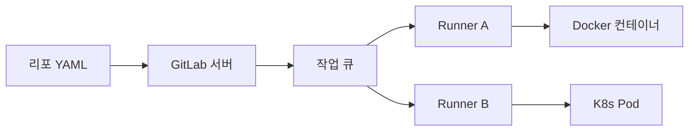
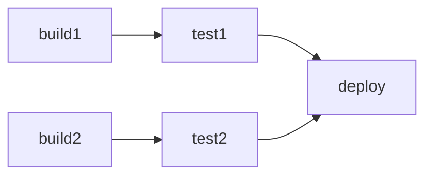

# GitLab CI/CD

> **GitLab 단일 애플리케이션에 내장된 CI/CD**. `.gitlab-ci.yml` 하나로
> 파이프라인·러너·환경·아티팩트·시큐리티 스캔·배포까지 통합 관리한다.
> GitHub Actions와 설계 철학이 다른 **스테이지 우선 모델**에서 출발해
> DAG(`needs`)·parent-child·CI/CD Components로 확장된 구조를 갖는다.

- **주제 경계**: 이 글은 GitLab CI의 **핵심 모델**을 다룬다.
  GitOps 배포 연계는 [ArgoCD](../argocd/argocd-install.md)·
  [Flux](../flux/flux-install.md)로, DevSecOps 스캔 통합은
  [SAST/SCA](../devsecops/sast-sca.md)로 분리했다
- **현재 기준**: GitLab 18.10 (2026-04), CI/CD Components GA (17.0),
  Fleeting 기반 Docker Autoscaler·Instance Executor 정식 (17.0~)
- **자매글**: [GHA 기본](../github-actions/gha-basics.md) —
  GitHub Actions와의 모델 비교

---

## 1. 아키텍처 한눈에

### 1.1 세 축

GitLab CI는 **파이프라인 정의 → GitLab 인스턴스 → 러너**의 세 축으로
움직인다. `.gitlab-ci.yml`은 리포지토리 루트에 있고, GitLab 인스턴스가
파이프라인을 생성·스케줄링하며, 실제 실행은 **GitLab Runner**라는 별도
에이전트가 담당한다.



- **GitLab 서버**: 파이프라인 DAG 계산, 작업 디스패치, UI·아티팩트·환경 관리
- **Runner**: 긴 폴링으로 작업을 가져와 **executor**에 위임
- **Executor**: Docker·Kubernetes·Shell 등 실제 실행 환경

### 1.2 GitHub Actions와의 모델 차이

| 축 | GitLab CI | GitHub Actions |
|---|---|---|
| 기본 단위 | `stage` 순차, job 병렬 | job DAG (`needs`) |
| 재사용 블록 | CI/CD Components (17.0 GA) | Reusable workflow·Composite action |
| 러너 관리 | self-hosted가 기본 개념 | GitHub-hosted가 기본, self-hosted 옵션 |
| 권한 모델 | 프로젝트/그룹 RBAC · 보호 환경 | Environment + required reviewers |
| 조건 표현 | `rules:` + CI 변수 | `if:` + `github.*` 컨텍스트 |

**결정적 차이**: GitHub Actions는 job DAG이 기본이고 stage 개념이 없다.
GitLab은 stage가 **레거시 기본값**이고, 최신 파이프라인은 `needs`로 stage
경계를 뛰어넘는 DAG를 만든다. 둘을 오가는 사람은 이 발상 차를 기억한다.

---

## 2. `.gitlab-ci.yml`의 뼈대

### 2.1 최소 예제

```yaml
stages: [build, test, deploy]

build:
  stage: build
  image: golang:1.23
  script:
    - go build ./...
  artifacts:
    paths: [bin/]

test:
  stage: test
  image: golang:1.23
  script:
    - go test ./...
  needs: [build]

deploy:
  stage: deploy
  image: alpine
  script:
    - ./deploy.sh
  environment:
    name: production
    url: https://app.example.com
  rules:
    - if: $CI_COMMIT_TAG
```

이 파일 하나가 세 축을 만든다.

- `stages`: 실행 순서(선형). 앞 stage 완료 후 다음 stage 시작
- **job** (`build`·`test`·`deploy`): stage에 소속된 실제 작업
- **`needs`**: stage 경계를 무시하는 DAG 의존성

### 2.2 전역 키워드

`.gitlab-ci.yml` 최상위에서 모든 job에 적용되는 설정.

| 키워드 | 용도 |
|---|---|
| `stages` | stage 정의·순서 |
| `default` | 모든 job의 기본값 (`image`, `tags`, `cache`, `retry`) |
| `variables` | 전역 CI 변수 |
| `workflow` | **파이프라인 자체**의 실행 여부 제어 |
| `include` | 외부 YAML·컴포넌트 포함 |
| `cache` | 전역 캐시 설정 |

### 2.3 job 키워드 (핵심만)

| 키워드 | 역할 |
|---|---|
| `script` | 실제 명령 시퀀스 |
| `before_script`·`after_script` | 전후 훅 |
| `stage` | 소속 stage (생략 시 `test`) |
| `tags` | 러너 매칭 레이블 |
| `image`·`services` | Docker 실행 시 이미지 |
| `needs` | job 수준 의존성 (DAG) |
| `rules` | 실행 여부·조건 |
| `artifacts`·`cache` | 산출물·캐시 |
| `environment` | 배포 대상 지정 |
| `retry`·`timeout` | 재시도·시간 제한 |
| `parallel` | 병렬 실행 (fan-out) |
| `resource_group` | 동시 실행 직렬화(뮤텍스) |
| `interruptible` | 새 커밋 시 자동 취소 허용 |
| `id_tokens` | OIDC JWT 발급 |

### 2.4 재사용 — `extends` · `!reference` · YAML anchors

GitLab CI에는 **세 가지 재사용 문법**이 있고 각자 용도가 다르다.
컴포넌트(§8)와 include(§8.4)가 "파일 간" 재사용이라면 이 절은 "파일 내"
재사용이다.

**`extends` — 가장 흔한 선택**

```yaml
.build_base:
  image: golang:1.23
  cache:
    key: {files: [go.sum]}
    paths: [.gocache]
  script: ["go build ./..."]

build_linux:
  extends: .build_base
  variables:
    GOOS: linux

build_darwin:
  extends: [.build_base, .macos_runner]
```

- `.`으로 시작하는 hidden job은 단독 실행되지 않음 (템플릿)
- 다중 상속 가능 (배열). 왼쪽 → 오른쪽 머지
- **해시는 머지, 배열은 덮어쓰기** — `script`를 확장하려면 `!reference` 필요

**`!reference` — 배열까지 참조**

```yaml
.auth:
  before_script:
    - aws configure set ...

deploy:
  before_script:
    - echo "preparing"
    - !reference [.auth, before_script]
    - ./deploy.sh
```

- 최대 **10단계 깊이** 중첩 가능
- `extends`가 덮어쓰는 배열 컨텍스트에서 유일한 해법
- 공식 문서가 YAML anchor보다 `!reference` 우선 권장

**YAML anchors (`&`/`*`) — 같은 파일 내에서만**

```yaml
.common: &common
  retry: 2

build: {<<: *common, script: [...]}
```

- 익숙한 표준 YAML 문법이지만 **include로 가져온 파일 간 공유 불가**
- 조직 표준 템플릿으로 옮길 일이 많다면 anchor는 피하고 `extends`·
  `!reference`·Component로 통일하는 편이 확장성 있음

---

## 3. Stages·Jobs·Needs — 세 가지 파이프라인 형태

### 3.1 Basic — stage 순차

가장 단순한 모델. stage 내부는 병렬, stage 간은 순차. 한 job이라도
실패하면 다음 stage 진입을 막는다.



장점은 멘탈 모델이 단순하고 소규모 프로젝트에 충분하다는 것.
단점은 **stage의 slowest가 전체를 지연**시킨다는 점. `build1`이 끝나도
`build2`가 끝날 때까지 `test1`은 대기한다.

### 3.2 DAG — `needs`로 stage 해제

`needs: [build1]`을 붙이면 해당 job은 **stage 순서 대신** 의존성이 풀리는
즉시 시작한다. stage는 UI 그룹핑으로만 기능한다.

```yaml
test1:
  stage: test
  needs: [build1]
  script: ...

test2:
  stage: test
  needs: [build2]
  script: ...
```

- `needs` 최대 50개 (인스턴스 설정으로 확장 가능)
- `needs: []`는 "의존성 없음" — 파이프라인 시작 즉시 실행
- `needs`로 받은 job의 아티팩트는 기본으로 **다운로드**됨 (명시적 `artifacts: false` 가능)

**고급 `needs` 필드**

| 필드 | 의미 |
|---|---|
| `needs: [{job: build, optional: true}]` | rules로 skip되어도 파이프라인 미파괴 |
| `needs: [{job: test, artifacts: false}]` | 의존은 있으나 아티팩트 다운로드 생략 |
| `needs: [{project, ref, job, artifacts: true}]` | 다른 프로젝트 job의 아티팩트 당김 |
| `needs: [{pipeline: $PARENT_PIPELINE_ID, job}]` | Multi-project에서 상위 파이프라인 job 참조 |

`optional: true`는 **rules로 조건부 스킵되는 의존 job**에 필수. 없으면
"dependent job missing"으로 파이프라인 전체가 붉어진다.

**트레이드오프**: DAG은 빠르지만 의존성 그래프가 복잡해지면 "왜 이 job이
먼저 시작되지?"를 추적하기 어렵다. 큰 파이프라인은 parent-child로
쪼개는 편이 가독성이 낫다.

### 3.3 Parent-Child — 모노레포·컴포넌트 분리

부모 파이프라인이 자식 파이프라인을 `trigger`로 띄운다. 자식은 **별도
파이프라인**으로 UI에 표시되며 자기 stage·job·상태를 갖는다.

```yaml
frontend:
  stage: build
  trigger:
    include: frontend/.gitlab-ci.yml
    strategy: depend

backend:
  stage: build
  trigger:
    include: backend/.gitlab-ci.yml
    strategy: depend
```

- `strategy: depend`: 부모가 자식 결과를 기다림 (기본은 fire-and-forget)
- `include`로 자식 YAML 경로 지정
- 중첩 깊이 **2단계까지** (자식의 자식은 가능, 손자의 손자는 불가)
- `rules: changes:`와 결합해 **변경된 컴포넌트만** 자식 파이프라인 기동

**적합한 경우**: 모노레포(프론트·백·인프라), 수십 개 마이크로서비스,
파이프라인 YAML이 수백 줄을 넘는 경우.

### 3.4 Multi-Project — 프로젝트 경계 넘기

다른 프로젝트의 파이프라인을 트리거. 마이크로서비스의 **순차 배포**
또는 **업스트림 공유 라이브러리 → 다운스트림 재빌드** 시나리오.

```yaml
trigger_downstream:
  stage: integrate
  trigger:
    project: group/downstream-app
    branch: main
    strategy: depend
```

| 비교 축 | Parent-Child | Multi-Project |
|---|---|---|
| 스코프 | 같은 프로젝트 | 다른 프로젝트 |
| 권한 | 부모 프로젝트 권한 그대로 | 트리거 토큰·CI_JOB_TOKEN |
| UX | 한 파이프라인 뷰에 묶여 표시 | 프로젝트별로 분리 |
| 용도 | 모노레포 분할 | 서비스 간 계약·릴리즈 연쇄 |

---

## 4. Dynamic Child Pipelines — 런타임 생성

**정적 YAML이 아니라 스크립트가 YAML을 생성**해 자식을 띄우는 기법.
매트릭스·변경 감지·언어별 디스커버리 등에 결정적이다.

### 4.1 기본 구조

```yaml
generate:
  stage: prepare
  script:
    - ./scripts/generate-pipeline.py > generated.yml
  artifacts:
    paths: [generated.yml]

child:
  stage: trigger
  needs: [generate]
  trigger:
    include:
      - artifact: generated.yml
        job: generate
    strategy: depend
```

생성 job이 아티팩트로 YAML을 내보내고, 트리거 job이 그 아티팩트를
`include`한다. 이후는 일반 자식 파이프라인과 동일하다.

### 4.2 전형적 활용 사례

| 시나리오 | 생성 로직 |
|---|---|
| 모노레포 변경 감지 | `git diff` → 변경된 디렉터리만 job 생성 |
| 언어·버전 매트릭스 | `matrix.yml` 파일 읽어 N개 job 전개 |
| Terraform 워크스페이스 | `terraform workspace list` → 워크스페이스별 plan |
| Helm 차트 N개 | `charts/` 스캔 → 차트별 lint·package job |

### 4.3 제약과 주의

- 동적 child pipeline의 `include:`에서는 **런타임 CI 변수 사용이 제한됨**
  (프로젝트 레벨 사전 정의 변수 일부만 허용). 일반 include와의 차이에 주의
- 생성 job의 아티팩트가 비어 있으면 자식 파이프라인이 비어 생성됨 —
  "변경 없음"을 명시적으로 처리할 것
- 디버깅은 UI에서 생성된 YAML 아티팩트를 직접 다운받아 확인
- 중첩은 **2단계까지** — 손자의 자식은 불가

---

## 5. Rules & Workflow — 실행 조건

### 5.1 `rules` 평가 모델

job은 **rules 배열을 위에서 아래로** 순차 평가하며 **첫 매치**가 실행
여부를 결정한다. 매치된 rule의 `when:`이 `never`면 skip, `on_success`(기본)·
`always`·`manual`·`delayed`면 실행.

```yaml
deploy_prod:
  script: ./deploy.sh prod
  rules:
    - if: $CI_COMMIT_BRANCH == "main" && $CI_PIPELINE_SOURCE == "push"
      when: manual
    - if: $CI_COMMIT_TAG
      when: on_success
    - when: never
```

### 5.2 자주 쓰는 조건 변수

| 변수 | 의미 |
|---|---|
| `$CI_PIPELINE_SOURCE` | `push`·`merge_request_event`·`schedule`·`web` 등 |
| `$CI_COMMIT_BRANCH` | 현재 브랜치 이름 (MR 파이프라인에선 빔) |
| `$CI_COMMIT_TAG` | 태그 이름 |
| `$CI_MERGE_REQUEST_IID` | MR 번호 |
| `$CI_OPEN_MERGE_REQUESTS` | 이 브랜치에 열린 MR 존재 여부 |
| `$CI_COMMIT_MESSAGE` | 커밋 메시지 (skip ci 플래그 체크) |

### 5.3 `changes:` — 파일 변경 기반

모노레포 핵심 도구. 해당 경로가 바뀌었을 때만 job 실행.

```yaml
terraform_plan:
  script: terraform plan
  rules:
    - changes:
        - terraform/**/*.tf
        - terraform/**/*.tfvars
```

주의: `changes`는 git diff 대상 범위가 **파이프라인 트리거 컨텍스트**에
따라 달라진다. MR 파이프라인은 MR 범위, branch 파이프라인은 직전 커밋
범위. 브랜치 처음 push에서는 `changes`가 의도와 다르게 평가될 수 있으므로
**`compare_to` 키로 명시적 기준 브랜치** 지정을 권장.

```yaml
rules:
  - changes:
      compare_to: refs/heads/main
      paths: ["src/**/*"]
```

### 5.4 Workflow — 파이프라인 자체의 실행

job 필터보다 **먼저** 평가된다. 파이프라인 자체를 만들지 말지 결정.

```yaml
workflow:
  name: '$CI_COMMIT_BRANCH → $CI_PIPELINE_SOURCE'
  rules:
    - if: $CI_PIPELINE_SOURCE == "merge_request_event"
    - if: $CI_COMMIT_BRANCH == "main"
    - if: $CI_COMMIT_TAG
    - when: never
  auto_cancel:
    on_new_commit: interruptible
    on_job_failure: all
```

- `auto_cancel`: 새 커밋이 오면 구 파이프라인을 자동 취소 (비용 절감)
- `CI_OPEN_MERGE_REQUESTS`로 **브랜치/MR 중복 파이프라인** 방지

```yaml
workflow:
  rules:
    - if: $CI_PIPELINE_SOURCE == "push" && $CI_OPEN_MERGE_REQUESTS
      when: never
    - if: $CI_PIPELINE_SOURCE == "merge_request_event"
    - if: $CI_COMMIT_BRANCH
```

### 5.5 `only`/`except` — 쓰지 말 것

레거시 키워드. GitLab이 **`rules`로의 이전을 공식 권고**하며 같은 job에
혼용하면 예측 불가. 기존 파이프라인에 남아 있다면 전환이 곧 유지보수성
개선이다.

### 5.6 Scheduled Pipelines

cron 기반 주기 실행. **nightly 리그레션, 인프라 drift 감지, 토큰·인증서
로테이션, 주간 보안 스캔**이 전형 용도.

- 생성 위치: 프로젝트 → Build → Pipeline schedules
- cron 타임존·보호 브랜치만 스케줄 가능 (비보호 브랜치는 UI에서 차단)
- **스케줄마다 변수 오버라이드** 가능 — `NIGHTLY=1` 같은 플래그로
  정기 job만 분기

```yaml
nightly_integration:
  script: ./tests/nightly.sh
  rules:
    - if: $CI_PIPELINE_SOURCE == "schedule" && $NIGHTLY == "1"

drift_check:
  script: terraform plan -detailed-exitcode
  rules:
    - if: $CI_PIPELINE_SOURCE == "schedule" && $DRIFT_CHECK == "1"
```

스케줄 소유자는 **보호 브랜치에 배포할 수 있는 역할**이어야 함.
소유자 계정이 퇴사·비활성화되면 스케줄이 자동 정지되므로 로봇 계정
또는 서비스 계정 소유를 권장.

### 5.7 트리거 방식 전체

| 소스 | `$CI_PIPELINE_SOURCE` | 특징 |
|---|---|---|
| push | `push` | 일반 commit push |
| MR event | `merge_request_event` | MR open/update/sync |
| tag | `push`(tag이면 `$CI_COMMIT_TAG`) | 릴리즈 파이프라인 |
| schedule | `schedule` | cron |
| web | `web` | UI "Run pipeline" 버튼 |
| api | `api` | REST API / Trigger Token |
| pipeline | `pipeline` | 다른 파이프라인이 `trigger`로 호출 |
| parent_pipeline | `parent_pipeline` | parent-child 자식 |
| external_pull_request_event | `external_pull_request_event` | GitHub 연동 리포 |

---

## 6. Runners & Executors

### 6.1 Runner 스코프

러너는 등록된 스코프에 따라 세 종류로 나뉜다.

| 스코프 | 가용 범위 | 관리 | 전형적 용도 |
|---|---|---|---|
| Instance (Shared) | 인스턴스 전체 | 관리자 | SaaS의 공용 러너 풀 |
| Group | 그룹 하위 프로젝트 | 그룹 오너 | 팀·사업부 단위 전용 러너 |
| Project | 단일 프로젝트 | 프로젝트 메인테이너 | 전용 시크릿·특수 환경 필요 |

러너는 `tags`로 매칭된다. job이 `tags: [gpu]`를 달면 해당 태그를 가진
러너가 실행한다. 태그 미매칭은 **영구 대기**가 되므로 `default: tags`로
기본값을 걸거나 `allow_untagged: true`로 태그 없는 러너가 집어가게 한다.

### 6.2 Executor — 러너가 job을 실행하는 방법

| Executor | 상태 | 용도 |
|---|---|---|
| **Kubernetes** | 활성·권장 | K8s 클러스터에서 job마다 Pod 생성 |
| **Docker** | 활성 | 컨테이너 격리, Docker 데몬 필요 |
| **Docker Autoscaler** | 활성·권장 | Fleeting 기반 클라우드 오토스케일 |
| **Instance** | 활성 | VM 전체 자원 필요 시, 오토스케일 |
| Shell | 유지보수 | 러너 호스트에서 직접 실행 |
| SSH | 유지보수 | 원격 호스트에 SSH |
| VirtualBox/Parallels | 유지보수 | VM 기반 빌드 |
| Custom | 유지보수 | 사용자 정의 드라이버 |
| Docker Machine | **deprecated 17.5** | Docker Autoscaler로 이전 |

**2025~2026 전환 포인트**: Docker Machine이 17.5에서 종료되며 **Fleeting
기반 Docker Autoscaler / Instance Executor**가 유일한 오토스케일 공식 경로가
되었다. AWS·GCP·Azure 플러그인이 있고 AWS가 가장 성숙하다.

### 6.3 Kubernetes Executor 핵심

```toml
[runners.kubernetes]
namespace = "gitlab-runner"
image = "ubuntu:22.04"
pull_policy = ["if-not-present"]
allowed_images = ["registry.example.com/*:*"]
allowed_services = ["registry.example.com/*:*"]
cpu_request = "500m"
memory_request = "512Mi"
service_account = "gitlab-runner"
helper_image_flavor = "ubuntu"
[runners.kubernetes.pod_security_context]
  run_as_non_root = true
  run_as_user = 1000
  fs_group = 1000
[runners.kubernetes.build_container_security_context]
  allow_privilege_escalation = false
  [runners.kubernetes.build_container_security_context.capabilities]
    drop = ["ALL"]
[runners.kubernetes.node_selector]
  "workload" = "gitlab-ci"
[[runners.kubernetes.node_tolerations]]
  key = "ci-only"
  operator = "Equal"
  value = "true"
  effect = "NoSchedule"
```

- job 1개 = Pod 1개. `build` 컨테이너 + services + helper
- 아티팩트·캐시·Git은 `helper` 컨테이너가 처리
- **Pod 오버헤드** 때문에 초단위 job은 overhead가 커짐 — 충분히 배칭

**멀티테넌트 Shared Runner에서 필수 설정**

| 설정 | 역할 |
|---|---|
| `allowed_images` / `allowed_services` | 악성 임의 이미지 실행 차단 |
| `pull_policy` | `always`는 비용↑, `never`는 구 이미지, 운영은 `if-not-present` 권장 |
| `pod_security_context` | `run_as_non_root`, UID/GID 명시 |
| `build_container_security_context` | `capabilities.drop: ALL`, privilege escalation 차단 |
| `node_selector` / `node_tolerations` | CI 전용 노드 풀 격리 |
| `namespace` per runner | 팀/테넌트 분리 |
| `service_account` + RBAC | 클러스터 내부 권한 최소화 |

### 6.4 자기 호스팅 vs GitLab SaaS

| 축 | Self-hosted Runner | GitLab SaaS Runner |
|---|---|---|
| 관리 부담 | 러너 인프라·업데이트 직접 | 없음 |
| 비용 | 인프라 비용 | 분당 과금(무료 티어 한도) |
| 네트워크 | 사내 리소스 접근 용이 | 사내 접근에 VPN/프록시 필요 |
| 보안 | 격리 수준 자체 통제 | GitLab 표준 정책 |
| 성능·캐시 | 로컬 캐시 유리 | 세션별 컨테이너 |

**실무 패턴**: 프론트·오픈소스 빌드는 SaaS 러너, 프로덕션 배포·보안 job은
self-hosted 전용 러너(보호 환경에 매핑)로 분리.

---

## 7. Environments & Deployments

### 7.1 환경 기본

`environment` 키워드로 job을 **배포 이벤트**로 승격시킨다.

```yaml
deploy_staging:
  script: ./deploy.sh staging
  environment:
    name: staging
    url: https://staging.example.com
    deployment_tier: staging
```

- 배포 이벤트는 프로젝트 Environments 페이지에 기록됨
- `url`은 MR·배포 뷰에 live 링크로 표시
- **롤백**은 이전 성공 배포를 선택해 재실행

### 7.2 동적 환경 — Review Apps

브랜치마다 격리된 일회용 환경. `$CI_COMMIT_REF_SLUG`로 이름 충돌 방지.

```yaml
review:
  stage: deploy
  script: ./deploy-review.sh $CI_COMMIT_REF_SLUG
  environment:
    name: review/$CI_COMMIT_REF_SLUG
    url: https://$CI_COMMIT_REF_SLUG.review.example.com
    on_stop: stop_review
    auto_stop_in: 1 week
  rules:
    - if: $CI_MERGE_REQUEST_IID

stop_review:
  stage: deploy
  script: ./teardown.sh $CI_COMMIT_REF_SLUG
  environment:
    name: review/$CI_COMMIT_REF_SLUG
    action: stop
  when: manual
  rules:
    - if: $CI_MERGE_REQUEST_IID
      when: manual
```

- `on_stop`: MR 머지·브랜치 삭제 시 리소스 정리
- `auto_stop_in`: 방치 환경을 기간 경과 시 자동 중단
- Review Apps는 쿠버네티스 Ingress 템플릿과 Kustomize/Helm 조합으로 구성

### 7.3 Deployment Tiers

`deployment_tier` 값 5종: `production`·`staging`·`testing`·`development`·
`other`. 환경 이름과 무관하게 **티어 단위로 보호 정책**을 적용.

```yaml
deploy_prod:
  environment:
    name: prod-ap-northeast-2
    deployment_tier: production
```

그룹 레벨 Protected Environments에서 "모든 `production` 티어" 기준으로
승인자·배포자 역할을 한 번에 적용할 수 있다.

### 7.4 Protected Environments & Manual Approvals

운영 환경은 **배포 권한**과 **승인 규칙**을 분리해 설정.

| 설정 | 내용 |
|---|---|
| Allowed to deploy | 배포를 **트리거**할 수 있는 역할/그룹 |
| Approval rules | N명 승인 필요, 특정 역할만 승인 가능 |
| Deployment freeze | cron 기반 배포 금지 시간대 |

프로덕션 배포는 일반적으로 `when: manual` + Protected Environment
승인 규칙 2중 게이트로 걸어 "실수로는 못 누른다"를 만든다.

### 7.5 환경별 시크릿

환경 스코프 CI 변수로 **프로덕션 시크릿을 프로덕션 job에만** 노출.
Settings → CI/CD → Variables에서 `Environments: production` 지정.
이로써 dev 파이프라인은 절대 프로덕션 시크릿을 읽을 수 없다.

### 7.6 `resource_group` — 동시 배포 직렬화

같은 환경에 배포하는 파이프라인이 **두 개 이상 겹치면** IaC 상태 파일·
스키마 마이그레이션·쿠버네티스 배포가 경합한다. `resource_group`은
임의의 문자열을 뮤텍스처럼 사용해 같은 이름을 가진 job을 직렬 실행.

```yaml
deploy_prod:
  script: ./deploy.sh
  environment: {name: production}
  resource_group: production
```

`process_mode`로 대기 정책 선택.

| 모드 | 의미 |
|---|---|
| `unordered` (기본) | FIFO 없이 하나가 끝나면 임의 선택 |
| `oldest_first` | 오래된 대기자 먼저 (FIFO) |
| `newest_first` | 최신 대기자 먼저 — 구 배포 건너뛰기 |

**실무 권장**: 프로덕션은 `oldest_first`로 순서 보장, 리뷰앱 같은 멱등
환경은 `newest_first`로 최신만 반영해 대기열 급증 방지.

### 7.7 GitLab Pages 배포

`pages`라는 **예약 job**으로 정적 사이트를 GitLab 호스팅에 배포.

```yaml
pages:
  stage: deploy
  script:
    - npm run build
  pages: true
  publish: dist
  rules:
    - if: $CI_COMMIT_BRANCH == $CI_DEFAULT_BRANCH
```

- `publish:`(구 `artifacts: paths:`)가 배포 루트
- Parallel Deploy로 브랜치별 프리뷰 배포 가능(`pages.path_prefix`)
- `pages.expire_in`으로 미사용 배포 자동 만료(18.x)
- Pages Access Control로 비공개 게시 가능

---

## 8. CI/CD Components & Catalog

### 8.1 개념 — Reusable Workflow의 GitLab판

**GitLab 17.0(2024-05) GA**. `include`의 상위 버전 — 버전·입력 스펙·
Catalog 게시까지 통합된 재사용 단위.

```yaml
include:
  - component: gitlab.com/my-org/sast-scan/run@~latest
    inputs:
      severity: high
      stage: test
```

- `@` 뒤: 버전 (sha, 태그, 브랜치, `~latest`)
- `inputs`: 컴포넌트가 노출한 타입 안전 파라미터

### 8.2 컴포넌트 만들기

```
my-component/
├── README.md
├── templates/
│   └── run.yml              # 또는 run/template.yml
└── .gitlab-ci.yml           # 컴포넌트 자체 테스트
```

```yaml
# templates/run.yml
spec:
  inputs:
    severity:
      default: medium
      options: [low, medium, high, critical]
    stage:
      default: test
---
scan-job:
  stage: $[[ inputs.stage ]]
  script:
    - ./scan.sh --severity $[[ inputs.severity ]]
```

입력값은 `$[[ inputs.x ]]` 문법으로 참조 — **일반 CI 변수 `$CI_*`와
다른 치환 단계**다. 파이프라인 생성 시점에 하드코딩된 값처럼 치환된다.

### 8.3 Catalog 게시

- 프로젝트 설정에서 "CI/CD Catalog project" 토글
- `release` 키워드로 SemVer 릴리즈 생성 (`1.0.0`)
- 공개 프로젝트면 gitlab.com Catalog에 노출 ([gitlab.com/explore/catalog](https://gitlab.com/explore/catalog))
- 프로젝트당 최대 100개 컴포넌트 (18.5부터 30 → 100 확장)

### 8.4 Secure Templates & Auto DevOps

GitLab은 번들 템플릿을 `include: template:`로 제공한다. 가장 흔한
두 축은 **Secure 스캔 템플릿**과 **Auto DevOps**.

**Secure Templates**

```yaml
include:
  - template: Security/SAST.gitlab-ci.yml
  - template: Security/Dependency-Scanning.gitlab-ci.yml
  - template: Security/Container-Scanning.gitlab-ci.yml
```

- 숨겨진 job(예: `.sast-analyzer`)을 상속해 **언어 자동 감지**
- 필요 시 `variables:`나 `rules:`로 특정 분석기만 활성화·끄기
- 결과는 `sast`·`dependency_scanning` 리포트로 Security Dashboard 연동
- 상세는 [SAST/SCA](../devsecops/sast-sca.md)·
  [이미지 스캔](../devsecops/image-scanning-cicd.md) 참조

**Auto DevOps**

`include: template: Auto-DevOps.gitlab-ci.yml` 한 줄로 빌드·테스트·스캔·
배포까지 **zero-config** 파이프라인이 구성된다. 소규모 팀의 초기 진입
또는 "CI 문화 부재 상태"에서 출발점으로 유효. 조직이 성숙하면 Auto
DevOps 내부 job을 단계적으로 커스텀 파이프라인으로 이전한다.

### 8.5 Component vs Include vs Template

| 재사용 방식 | 특징 | 적합한 규모 |
|---|---|---|
| `include: local` | 같은 리포의 YAML 병합 | 한 프로젝트 내부 |
| `include: project` | 다른 GitLab 프로젝트의 YAML 병합 | 조직 공용 템플릿 |
| `include: remote` | 임의 URL | 공개 템플릿 (지양) |
| `include: template` | GitLab 번들 (SAST, License 등) | 공식 스캐너 |
| `include: component` | 버전·입력 스펙·Catalog | **신규 표준** |

신규 재사용 블록은 **Component로 작성**이 2026 권장. 기존 `include: project`
템플릿을 서서히 컴포넌트로 이전하는 조직이 다수.

### 8.6 `include`와 `rules`·`inputs` 조합

- `include:` 각 타입은 18.x부터 `rules:`를 지원 — 브랜치/조건에 따라
  특정 include를 선택적으로 병합 가능
- `include:` 단계에서 **일부 프로젝트 레벨 변수**는 사용 가능(`$CI_PROJECT_PATH`
  등 사전 정의 변수). 하지만 **동적 child pipeline의 `include`**(§4.3)에서는
  변수 사용이 여전히 제한됨
- `inputs:`는 `include: component:` 외에도 `include: project:`·`local:`·
  `remote:`에 함께 붙일 수 있다 (17.x+ 확대)

```yaml
include:
  - project: my-org/templates
    file: deploy.yml
    inputs:
      target: production
      image: $CI_REGISTRY_IMAGE
    rules:
      - if: $CI_COMMIT_BRANCH == "main"
```

---

## 9. Artifacts & Cache

### 9.1 둘의 차이

| 축 | Artifacts | Cache |
|---|---|---|
| 생존 기간 | 파이프라인·잡 간 전달, 보존 기간 존재 | job 간 가속 목적 |
| 업로드 위치 | GitLab 서버 (중앙) | 러너 로컬 또는 원격(S3/GCS) |
| 불변성 | 불변 | 자주 덮어쓰기 |
| 용도 | 빌드 산출물, 테스트 리포트, MR 비교 | 의존성(`node_modules`, `.m2`) |

**주의**: node_modules·Go 모듈을 `artifacts`로 두는 실수가 흔하다.
그건 **cache**다. Artifacts에 넣으면 매 파이프라인이 GitLab 서버에
수백 MB를 업로드·다운로드한다.

### 9.2 Cache 키 전략

```yaml
cache:
  key:
    files: [package-lock.json]
    prefix: $CI_JOB_IMAGE
  fallback_keys:
    - cache-$CI_COMMIT_REF_SLUG
    - cache-main
  paths: [node_modules/]
  policy: pull-push
  when: on_success
```

- `key: files`: 지정 파일 해시가 같으면 같은 캐시 적중
- `fallback_keys`: 키 miss 시 구 캐시로 fallback — **cold cache 방지**
- `policy`: `pull-push`(기본), `pull`(readonly), `push`(쓰기만)
  - 포크 빌드·신뢰 낮은 MR은 `pull` 전용으로 **오염 방지**
- `when`: `on_success`(기본) / `always` / `on_failure`
- 분산 캐시는 **S3/GCS**에 저장해 러너 간 공유 (`[runners.cache]`)

**자주 쓰는 패턴**

| 패턴 | 효과 |
|---|---|
| `prefix: $CI_JOB_IMAGE` | 이미지 버전별로 캐시 분리 |
| `fallback_keys: [cache-$CI_DEFAULT_BRANCH]` | 새 브랜치가 main 캐시를 cold start에 활용 |
| `policy: push`만 쓰는 warm-up job | 주기 스케줄로 공용 캐시 갱신 |
| `unprotect: true` | 보호 브랜치와 비보호 브랜치 캐시 공유 |

### 9.3 Artifacts 리포트

단순 파일 저장 외에 **GitLab이 해석하는 구조화 리포트**.

| 리포트 | 용도 |
|---|---|
| `junit` | 테스트 결과를 MR 위젯·파이프라인 뷰에 표시 |
| `coverage_report` | 커버리지 XML (`cobertura`) |
| `dotenv` | 다운스트림 job·환경 URL에 변수 주입 |
| `sast`·`dast`·`container_scanning` | DevSecOps 대시보드 |
| `dependency_scanning`·`license_scanning` | SCA 결과 |

Dotenv는 특히 강력하다 — 빌드 job이 이미지 digest를 `DIGEST=sha256:...`로
출력하면 다음 job이 변수로 받을 수 있다.

---

## 10. 변수와 시크릿과 OIDC

### 10.0 Predefined CI/CD Variables

GitLab이 **자동 주입**하는 변수. 파이프라인 전역에서 사용 가능하고,
이미지 태깅·URL 생성·디버깅에 필수다.

**Commit / Ref**

| 변수 | 의미 |
|---|---|
| `$CI_COMMIT_SHA` / `$CI_COMMIT_SHORT_SHA` | 커밋 SHA 전체/8자 |
| `$CI_COMMIT_REF_NAME` / `$CI_COMMIT_REF_SLUG` | 브랜치·태그 이름 / URL-safe 슬러그 |
| `$CI_COMMIT_BRANCH` | 브랜치 파이프라인일 때 브랜치 이름 |
| `$CI_COMMIT_TAG` | 태그 파이프라인일 때 태그 이름 |
| `$CI_COMMIT_MESSAGE` | 커밋 메시지 |
| `$CI_DEFAULT_BRANCH` | 기본 브랜치 (보통 `main`) |

**Project**

| 변수 | 의미 |
|---|---|
| `$CI_PROJECT_DIR` | 러너가 소스를 체크아웃한 절대 경로 |
| `$CI_PROJECT_PATH` | 그룹/프로젝트 경로 |
| `$CI_PROJECT_URL` | 프로젝트 웹 URL |
| `$CI_REGISTRY` | 프로젝트용 레지스트리 호스트 |
| `$CI_REGISTRY_IMAGE` | 프로젝트 내장 레지스트리 이미지 경로 |

**Pipeline / Job**

| 변수 | 의미 |
|---|---|
| `$CI_PIPELINE_ID` / `$CI_PIPELINE_IID` | 인스턴스 전역 ID / 프로젝트 내 번호 |
| `$CI_PIPELINE_SOURCE` | 트리거 종류 (§5.7) |
| `$CI_PIPELINE_URL` | 파이프라인 웹 URL |
| `$CI_JOB_ID` / `$CI_JOB_NAME` | job 고유 ID / 이름 |
| `$CI_JOB_URL` | job 웹 URL (실패 알림에 유용) |
| `$CI_JOB_TOKEN` | 이 job이 GitLab API에 쓰는 임시 토큰 (§10.3) |

**Environment / User / Server**

| 변수 | 의미 |
|---|---|
| `$CI_ENVIRONMENT_NAME` / `$CI_ENVIRONMENT_SLUG` | `environment.name` / URL-safe |
| `$CI_ENVIRONMENT_TIER` | `deployment_tier` 값 |
| `$CI_SERVER_URL` / `$CI_SERVER_HOST` | GitLab 인스턴스 URL / 호스트 |
| `$GITLAB_USER_LOGIN` | 파이프라인을 기동한 사용자 |
| `$GITLAB_USER_EMAIL` | 사용자 이메일 |

전체 목록은 공식 문서 [Predefined CI/CD variables](https://docs.gitlab.com/ci/variables/predefined_variables/) 참조.

### 10.1 ID Tokens — CI_JOB_JWT의 후계자

**CI_JOB_JWT·CI_JOB_JWT_V2는 폐기(deprecated)**. 2026 표준은 `id_tokens:`
키워드로 job마다 원하는 aud의 JWT를 발급.

```yaml
aws_deploy:
  id_tokens:
    AWS_TOKEN:
      aud: https://sts.amazonaws.com
  script:
    - aws sts assume-role-with-web-identity
        --role-arn $ROLE_ARN
        --role-session-name gitlab
        --web-identity-token $AWS_TOKEN
```

- OIDC 인증으로 **장기 키 없이** AWS/GCP/Azure/Vault 접근
- `aud`는 신뢰 당사자 설정에 맞춘 감사자(audience)
- 한 job에서 여러 토큰 발급 가능 (`AWS_TOKEN`, `VAULT_TOKEN` 등)

### 10.2 Vault 연동

```yaml
read_secret:
  id_tokens:
    VAULT_ID_TOKEN:
      aud: https://vault.example.com
  secrets:
    DB_PASSWORD:
      vault: kv/data/app/prod#password
      token: $VAULT_ID_TOKEN
  script:
    - echo "uses $DB_PASSWORD"
```

Vault 측에 GitLab OIDC discovery URL을 신뢰 공급자로 등록하면
JWT 교환으로 짧은 수명 토큰을 받아 시크릿을 읽는다.
→ 자세한 전략은 [security/](../../security/) 참조.

### 10.3 토큰 종류 — `CI_JOB_TOKEN` 외

GitLab에는 **4종류의 토큰**이 있고 각자 수명·권한·용도가 다르다.

| 토큰 | 수명 | 권한 | 용도 |
|---|---|---|---|
| **CI_JOB_TOKEN** | 해당 job 동안만 | 프로젝트·허용 대상 리소스 | job 내부에서 API·Registry·패키지 접근 |
| **Trigger Token** | 수동 회수까지 | 파이프라인 트리거만 | 외부 시스템이 파이프라인 기동 |
| **Project / Group Access Token** | 최대 1년(설정) | 역할 기반 (Developer/Maintainer 등) | 외부 CI·배포 자동화의 GitLab API 호출 |
| **Personal Access Token** | 사용자 설정 | 사용자 권한 전체 | 개인 스크립트, 테스트 |

**`CI_JOB_TOKEN` 활용 예**

```yaml
push_image:
  script:
    - docker login -u $CI_REGISTRY_USER -p $CI_JOB_TOKEN $CI_REGISTRY
    - docker push $CI_REGISTRY_IMAGE:$CI_COMMIT_SHORT_SHA
```

**Job Token 스코프 허용 목록 (16.3+)**

기본적으로 `CI_JOB_TOKEN`은 **자기 프로젝트**에만 사용 가능.
다른 프로젝트의 파이프라인을 트리거하거나 아티팩트를 당기려면
대상 프로젝트의 **CI/CD → Token Access → Allowlist**에 소스 프로젝트를
추가해야 한다. 이로써 "한 프로젝트 침해 = 모든 프로젝트 배포 가능"
사고를 차단한다.

- 16.3 이전: 모든 프로젝트에서 CI_JOB_TOKEN 사용 가능 (과도한 권한)
- 16.3+: 허용 목록 필수 (신규 프로젝트 기본값)
- 18.x: 세밀한 권한(Scope) 지정 가능 — API read·write, Container read·write 등

**장기 토큰 최소화 원칙**: Project/Group Access Token은 **사람이 볼 일**이
있을 때만. 자동화는 **ID Tokens(OIDC)**로 대체.

### 10.4 CI/CD Variables 보호

| 플래그 | 의미 |
|---|---|
| Protected | 보호 브랜치/태그에서만 노출 |
| Masked | 로그에서 마스킹 (최소 길이·문자 제약) |
| Expanded | `$VAR` 참조 치환 여부 |
| Environment scope | 특정 환경에서만 노출 |

**3종 세트 필수**: 프로덕션 시크릿은 Protected + Masked +
Environment `production`. 이 조합을 안 걸면 dev 브랜치가 prod 키를
로그에 뱉는 사고가 일어난다.

### 10.5 Group·Instance 레벨 상속

변수는 **Project → Group → Instance** 순으로 상속된다. 같은 이름이면
**하위가 상위를 덮어씀**. 플랫폼팀은 그룹 레벨에 공통 변수를 두고,
프로젝트는 오버라이드만. 상속 깊이를 UI에서 시각화해 준다.

---

## 11. Merge Request Pipelines

### 11.1 네 가지 MR 파이프라인 모드

| 모드 | 실행 대상 | `$CI_MERGE_REQUEST_EVENT_TYPE` | 티어 |
|---|---|---|---|
| **Branch Pipeline** | MR source 브랜치 HEAD | (없음, `push`) | 전 티어 |
| **Detached MR Pipeline** | source HEAD, MR 컨텍스트 보유 | `detached` | 전 티어 |
| **Merged Results Pipeline** | source + target 임시 병합 | `merged_result` | 상위 티어 |
| **Merge Train** | 앞선 MR과 가상 순차 병합 | `merge_train` | 상위 티어 |

"Detached MR 파이프라인"은 **브랜치 push에 붙은 일반 파이프라인이 아닌**,
MR 이벤트가 만든 별도 파이프라인이라는 의미의 공식 용어다. MR이 없으면
이 모드 자체가 존재하지 않는다.

### 11.2 워크플로 — 중복 방지

Branch push와 MR 파이프라인이 **둘 다 뜨는** 흔한 실수.

```yaml
workflow:
  rules:
    - if: $CI_PIPELINE_SOURCE == "merge_request_event"
    - if: $CI_COMMIT_BRANCH && $CI_OPEN_MERGE_REQUESTS
      when: never
    - if: $CI_COMMIT_BRANCH
```

"MR 있으면 MR 파이프라인만, 없으면 브랜치 파이프라인만" 규칙.
이 패턴이 사실상의 표준.

### 11.3 Merge Train

MR들을 **순차적으로 가상 머지**해 병렬 CI를 유지하면서도 "머지 후 빌드
실패" 사태를 차단. GitLab 상위 티어 기능(공식 문서 참조).
대형 모노레포에서 하루 수십 MR이 경합하는 경우 유효하나, 작은 팀에는 과잉.

---

## 12. 성능 튜닝

### 12.1 병목 감지

- **Stages 시각화** (Pipeline 뷰): 어느 stage가 critical path인지
- **Job duration timeline**: 가장 긴 job이 전체 지연의 원인
- Runner metrics (`/metrics` 엔드포인트): 큐 대기 시간

### 12.2 자주 쓰는 기법

| 기법 | 효과 |
|---|---|
| `needs`로 DAG 재구성 | stage 경계 제거로 전체 시간 단축 |
| Cache 키 세밀화 (`files:`) | 잘못된 캐시 적중 방지 |
| `interruptible: true` | 새 커밋 시 구 파이프라인 자동 취소 |
| `parallel: N` | fan-out 병렬화 (테스트 분할) |
| `parallel: matrix:` | 매트릭스 조합 병렬 |
| Partial clone / Shallow clone | 거대 리포 `GIT_DEPTH: 20` |
| Docker layer caching | BuildKit + `--cache-from` |
| Split long stages | parent-child로 분리 후 병렬 |

### 12.3 `interruptible`과 Auto-cancel

```yaml
default:
  interruptible: true

deploy_prod:
  interruptible: false   # 배포는 중단 불가

workflow:
  auto_cancel:
    on_new_commit: interruptible
    on_job_failure: all
```

새 커밋이 push되면 이전 파이프라인을 자동 취소. CI 비용 절감의
**가장 간단한 승리**. 단 **배포 job은 제외** — 중간에 끊기면 인프라가
어중간한 상태로 남는다.

**전파 규칙 (흔한 실수 주의)**

- `auto_cancel.on_new_commit: interruptible`은 **`interruptible: true` job만**
  취소 대상
- 파이프라인에 **하나라도 `interruptible: false`인 job**이 실행 중/완료면,
  그 이후 순번의 interruptible job까지 취소에서 제외될 수 있음
- 의도: "이미 돌이킬 수 없는 배포가 시작된 후에는 나머지도 끝까지"
- 회피: 배포는 **별도 파이프라인(parent-child 또는 downstream)**으로 분리하고,
  빌드·테스트 파이프라인 전체를 interruptible로

**Auto-cancel 옵션**

| 옵션 | 의미 |
|---|---|
| `on_new_commit: conservative` | 기본값 — job이 시작 안 한 것만 취소 |
| `on_new_commit: interruptible` | 진행 중 interruptible job까지 취소 |
| `on_new_commit: none` | 취소 없음 |
| `on_job_failure: all` | 한 job 실패 시 나머지 취소 |
| `on_job_failure: none` | 실패해도 계속 |

---

## 13. 실전 안티패턴

| 안티패턴 | 증상 | 교정 |
|---|---|---|
| `only`/`except`와 `rules` 혼용 | 의도와 다른 실행 | 전부 `rules`로 통일 |
| 모든 job에 `tags: [shared]` | 전용 러너 못 쓰고 SaaS만 씀 | `default: tags`로 환경별 분리 |
| 프로덕션 시크릿을 Masked만 | 로그 필터만 있고 브랜치 제약 없음 | Protected + Env scope 동시 적용 |
| `artifacts`에 `node_modules` | 수백 MB 업로드, 느려짐 | `cache`로 전환 |
| `latest` 이미지 태그 | 재현성 없음 | 다이제스트 핀 또는 고정 태그 |
| 모든 job 같은 stage | 병렬 오케스트레이션 실종 | `stages` 3~6개로 분리 |
| DAG 과잉 (`needs` 남발) | 순서 파악 불가 | parent-child로 분할 |
| Docker Machine 유지 | 17.5 이후 EOL | Docker Autoscaler로 이전 |
| CI_JOB_JWT 그대로 사용 | deprecated, 향후 제거 | `id_tokens:`로 전환 |
| Review App에 `on_stop` 없음 | MR 머지 후 리소스 유실 | 반드시 teardown job |
| Workflow 규칙 없음 | branch + MR 중복 파이프라인 | 표준 workflow 패턴 적용 |
| 모든 파이프라인 Ops에 맡김 | 팀 확장성 없음 | CI/CD Components로 위임 |
| `resource_group` 없음 | 동시 배포가 IaC/DB 상태 깨뜨림 | 환경별 resource_group 지정 |
| `needs:optional` 미지정 | 조건부 스킵 job이 다운스트림 파괴 | optional: true |
| 포크 MR에 `policy: pull-push` | 캐시 오염·시크릿 유출 | 포크는 `policy: pull` 전용 |
| 공개 프로젝트에서 MR에 시크릿 노출 | 악성 PR로 토큰 탈취 | Protected + MR에선 시크릿 제공 안 함 |

---

## 14. GitLab CI vs GitHub Actions vs Jenkins — 선택 가이드

| 축 | GitLab CI | GitHub Actions | Jenkins |
|---|---|---|---|
| 설치 형태 | GitLab 내장 | GitHub 내장 | 독립 설치 |
| 파이프라인 정의 | `.gitlab-ci.yml` (선언적) | `.github/workflows/*.yml` (선언적) | Jenkinsfile (Groovy DSL) |
| 재사용 | Components 17.0 (Catalog, SemVer) | Reusable workflow·Composite action | Shared Library (Groovy) |
| 재사용 타입 시스템 | `spec:inputs` 정적 | `inputs:` 정적 + `env` | Groovy 자유·동적 |
| 조건 표현 | `rules:` + CI 변수 (다층 게이트) | `if:` + `github.*` 컨텍스트 | when·stage conditions, Groovy |
| 러너 모델 | Shared+Self-hosted 전제 | GitHub-hosted 기본 | Agent 직접 구성 |
| K8s 러너 | Kubernetes Executor (공식) | ARC (Actions Runner Controller) | Kubernetes Plugin |
| SaaS | GitLab.com | GitHub.com | x (자기 호스팅 필수) |
| SCM 트리거 모델 | GitLab 전용 | GitHub 전용 | 모든 SCM (다중) |
| OIDC | ID Tokens (`aud` 유연) | OIDC Provider 내장 | 플러그인 (aws-codebuild 등) |
| GitOps 연계 | Auto DevOps, Agent for K8s | OIDC + ArgoCD/Flux | 외부 도구 필수 |
| 보안·컴플라이언스 | 단일 벤더 통합 대시보드 | Security tab + GHAS | 플러그인 조합 (편차 큼) |
| 보안 패치 주기 | 월 1회 + 패치 릴리즈 | 상시 | LTS 12주, 주간 |

**선택 기준**
- **GitLab 조직**: 파이프라인·Registry·패키지·보안이 **단일 벤더 내장**
- **GitHub 조직**: 생태계 규모 최대, Reusable workflow 성숙, Marketplace
- **온프레/에어갭/다양한 SCM 혼용**: Jenkins + CloudBees CI가 여전히 유효
- **동적 DSL 필요**: Jenkins의 Scripted Pipeline이 유일한 Turing-complete 선택

---

## 15. 도입 로드맵

1. **파이프라인 1개 최소화**: `.gitlab-ci.yml`로 build·test만
2. **Workflow 규칙 정리**: MR/branch 중복 제거, auto_cancel
3. **DAG 전환**: stage 순차 → `needs` 기반 병렬
4. **러너 전략 결정**: SaaS + self-hosted 용도별 분리, 태그 정책
5. **환경 모델링**: dev/staging/prod + Review Apps, on_stop 필수
6. **보호 환경 + 승인 규칙**: 프로덕션 배포 2중 게이트
7. **OIDC 도입**: `id_tokens`로 AWS/Vault 연결, 장기 키 제거
8. **시크릿 Scope 정비**: Protected + Masked + Env 3종 세트
9. **대형화 → parent-child**: 모노레포·마이크로서비스 분리
10. **Components 표준화**: 중복 템플릿을 컴포넌트로, 버전 관리
11. **DevSecOps 통합**: SAST/SCA/컨테이너 스캔을 include template
12. **관측**: 러너 메트릭, 파이프라인 duration SLO 설정

---

## 16. 관련 문서

- [Pipeline as Code](../concepts/pipeline-as-code.md) — 선언적 파이프라인 철학
- [GHA 기본](../github-actions/gha-basics.md) — 모델 비교 대상
- [GitOps 개념](../concepts/gitops-concepts.md) — CI/CD 경계
- [배포 전략](../concepts/deployment-strategies.md) — 프로덕션 배포 패턴
- [DORA 메트릭](../concepts/dora-metrics.md) — 파이프라인 성과 측정
- [ArgoCD](../argocd/argocd-install.md)·[Flux](../flux/flux-install.md) — GitLab 외부 CD

---

## 참고 자료

- [GitLab CI/CD Pipelines 공식](https://docs.gitlab.com/ci/pipelines/) — 확인: 2026-04-24
- [Pipeline Architectures](https://docs.gitlab.com/ci/pipelines/pipeline_architectures/) — 확인: 2026-04-24
- [Parent-child Pipelines](https://docs.gitlab.com/ee/ci/pipelines/parent_child_pipelines.html) — 확인: 2026-04-24
- [Downstream Pipelines](https://docs.gitlab.com/ee/ci/pipelines/downstream_pipelines.html) — 확인: 2026-04-24
- [`rules` / Job rules](https://docs.gitlab.com/ci/jobs/job_rules/) — 확인: 2026-04-24
- [`workflow` keyword](https://docs.gitlab.com/ci/yaml/workflow/) — 확인: 2026-04-24
- [Environments](https://docs.gitlab.com/ci/environments/) — 확인: 2026-04-24
- [Protected Environments](https://docs.gitlab.com/ci/environments/protected_environments/) — 확인: 2026-04-24
- [CI/CD Components](https://docs.gitlab.com/ci/components/) — 확인: 2026-04-24
- [CI/CD Catalog](https://gitlab.com/explore/catalog) — 확인: 2026-04-24
- [Runner Executors](https://docs.gitlab.com/runner/executors/) — 확인: 2026-04-24
- [Kubernetes Executor](https://docs.gitlab.com/runner/executors/kubernetes/) — 확인: 2026-04-24
- [Runner Autoscaling (Fleeting)](https://docs.gitlab.com/runner/runner_autoscale/) — 확인: 2026-04-24
- [OIDC / ID Tokens](https://docs.gitlab.com/ci/secrets/id_token_authentication/) — 확인: 2026-04-24
- [HashiCorp Vault Integration](https://docs.gitlab.com/ci/secrets/hashicorp_vault/) — 확인: 2026-04-24
- [`CI_JOB_TOKEN` 및 Token Access](https://docs.gitlab.com/ci/jobs/ci_job_token/) — 확인: 2026-04-24
- [Predefined CI/CD Variables](https://docs.gitlab.com/ci/variables/predefined_variables/) — 확인: 2026-04-24
- [Pipeline Schedules](https://docs.gitlab.com/ci/pipelines/schedules/) — 확인: 2026-04-24
- [`resource_group`](https://docs.gitlab.com/ci/resource_groups/) — 확인: 2026-04-24
- [`interruptible` / auto-cancel](https://docs.gitlab.com/ci/yaml/#interruptible) — 확인: 2026-04-24
- [Merge Request Pipelines](https://docs.gitlab.com/ci/pipelines/merge_request_pipelines/) — 확인: 2026-04-24
- [`!reference` 태그](https://docs.gitlab.com/ci/yaml/yaml_optimization/#reference-tags) — 확인: 2026-04-24
- [`extends`](https://docs.gitlab.com/ci/yaml/#extends) — 확인: 2026-04-24
- [`cache:fallback_keys`](https://docs.gitlab.com/ci/yaml/#cachefallback_keys) — 확인: 2026-04-24
- [Auto DevOps](https://docs.gitlab.com/topics/autodevops/) — 확인: 2026-04-24
- [GitLab Pages 파이프라인](https://docs.gitlab.com/user/project/pages/getting_started/pages_from_scratch/) — 확인: 2026-04-24
- [GitLab 18 Release Notes](https://docs.gitlab.com/releases/18/) — 확인: 2026-04-24
- [GitLab 18.10 Release](https://about.gitlab.com/releases/2026/03/19/gitlab-18-10-released/) — 확인: 2026-04-24
- [GitLab Duo Agent Platform (18.8)](https://about.gitlab.com/releases/2026/01/15/gitlab-18-8-released/) — 확인: 2026-04-24
