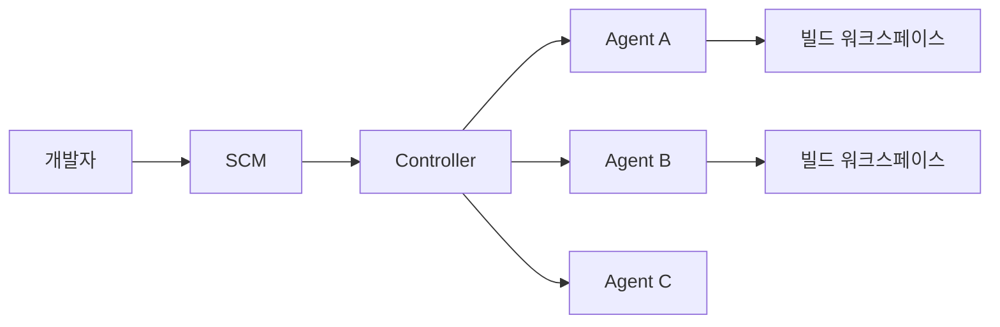
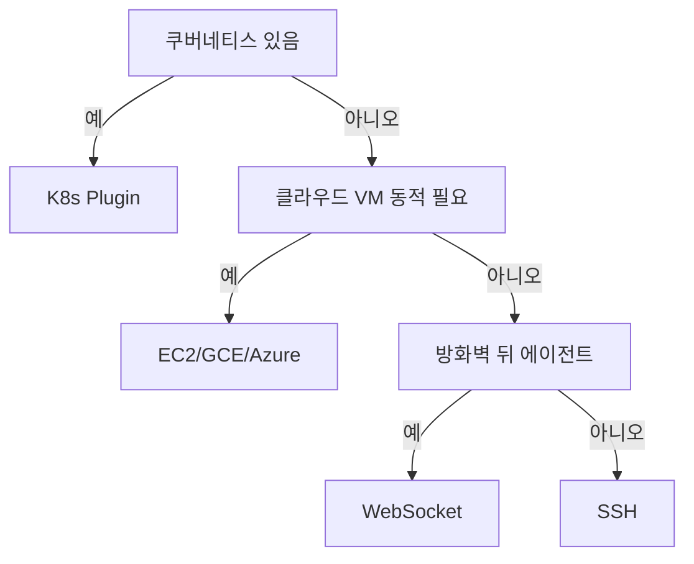

# Jenkins 기본

> **Jenkins는 20년 가까이 쓰인 오픈소스 CI 서버**다. GitHub Actions·
> GitLab CI가 CI를 SCM 벤더에 귀속시키는 흐름과 달리, Jenkins는
> **모든 SCM·모든 인프라와 중립적**으로 연결된다. 이 글은 파이프라인
> 문법 이전에, **플랫폼 자체**(컨트롤러, 에이전트, 보안, JCasC, 백업)를
> 글로벌 스탠다드 수준으로 정리한다.

- **주제 경계**: 본 글은 Jenkins **플랫폼**만. Jenkinsfile·Declarative vs
  Scripted·Shared Library·K8s 플러그인 파이프라인 활용은 자매글
  [Jenkins Pipeline](./jenkins-pipeline.md)
- **현재 기준**: Jenkins LTS 2.541.x (2026-02 릴리즈 라인). 2.555.1부터
  **Java 21/25 필수**, 2.541.x는 Java 11을 지원하는 마지막 LTS
- **여전히 유효한 이유**: 플러그인 2,000+, 모든 SCM·모든 인프라 대응,
  온프레미스·에어갭 환경의 사실상 표준

---

## 1. Jenkins의 위치와 한계

### 1.1 왜 아직 Jenkins인가

| 이유 | 설명 |
|---|---|
| SCM 중립 | GitHub·GitLab·Bitbucket·SVN·Perforce 무관 |
| 인프라 중립 | 베어메탈·VM·K8s·윈도우·ARM 전부 |
| 플러그인 생태계 | 2,000+ 플러그인, 거의 모든 시스템 연동 |
| 온프레미스 네이티브 | 에어갭·내부망·규제 환경에 그대로 설치 |
| 자유도 | Groovy DSL의 Turing-complete 표현력 |
| 기업 축적 | 10~20년 쌓인 Jenkinsfile·Shared Library 자산 |

### 1.2 반대로 Jenkins의 약점

| 약점 | 완화 방안 |
|---|---|
| 플러그인 품질 편차 | CloudBees 지원 목록, 커뮤니티 검증 플러그인만 사용 |
| 플러그인 의존성 지옥 | Plugin Installation Manager Tool + `plugins.txt` 고정 |
| 기본 보안이 느슨 | JCasC 초기화, Matrix Auth·Role Strategy 강제 적용 |
| 단일 컨트롤러 장애 | 주기 백업 + 재구축 절차, CloudBees HA는 상용 |
| 동적 확장 어려움 | Kubernetes Plugin + ephemeral agent 전환 |
| 설정 표류 | 모든 설정을 JCasC YAML로 SCM화 |

### 1.3 비교 맥락

| 축 | Jenkins | GitLab CI | GitHub Actions |
|---|---|---|---|
| SCM 결합도 | 없음 (중립) | GitLab 전용 | GitHub 전용 |
| 파이프라인 정의 | Jenkinsfile (Groovy) | `.gitlab-ci.yml` | `.github/workflows/*.yml` |
| 호스팅 | 자기 호스팅이 기본 | SaaS + 자기 호스팅 | SaaS + self-hosted runner |
| 재사용 단위 | Shared Library (Groovy) | CI/CD Components | Reusable workflow |
| 설정 IaC | JCasC (YAML) | 내장 (리포 YAML) | 내장 (리포 YAML) |
| UI·UX | 낙후 (Blue Ocean 2025~ 종료 단계) | 최신·통합 | 최신·통합 |
| 라이선스·비용 | OSS 무료 (운영 비용) | Free/Premium/Ultimate | Free/Team/Enterprise |

→ GitLab CI 세부: [GitLab CI](../gitlab-ci/gitlab-ci.md),
GitHub Actions: [GHA 기본](../github-actions/gha-basics.md)

---

## 2. 컨트롤러·에이전트 아키텍처

### 2.1 두 역할



- **Controller**(구 master): 설정·job 정의·스케줄링·UI·플러그인·보안
- **Agent**(구 slave): 실제 빌드 실행. 컨트롤러에서 분산 실행

**Controller에서 빌드를 실행하지 말 것**은 2020년대 후반 들어 반복 강조된
원칙이다. 빌드가 컨트롤러 디스크·메모리·플러그인 상태를 오염시키고,
악성 Jenkinsfile이 컨트롤러 권한을 탈취할 수 있다. Jenkins는 이를
막으려 `Built-In Node`의 실행자 수를 **0으로 설정**할 것을 권장한다.

### 2.2 Java·LTS·라이선스

| 축 | 정보 |
|---|---|
| 라이선스 | MIT |
| LTS 릴리즈 주기 | 약 12주 |
| Weekly 릴리즈 주기 | 매주 |
| 최신 LTS (2026-04) | 2.541.2 계열 |
| Java 요구 (Controller + Agent) | LTS 2.541.x: Java 11/17/21, 2.555.1+: **Java 21/25만** (Java 11/17 드롭) |

운영 조직은 **LTS 외 사용 금지**. Weekly는 검증 플러그인 릴리즈 일정
맞추려는 플러그인 메인테이너용이다. LTS 업그레이드도 2버전 건너뛰지
말고 순차 진행.

**2026 Java 전환 주의**: 많은 조직이 현재 Java 17을 쓰고 있는데,
**2.555.1부터는 Java 17도 드롭**되고 21/25만 지원된다. 2.541.x가
Java 17 지원 **마지막 LTS**이므로 업그레이드 경로를 2.541 → 2.555에서
Java 21 준비까지 함께 완료해야 한다.

### 2.3 Folders — Jenkins의 네임스페이스

**CloudBees Folders Plugin**(OSS, 사실상 표준)은 Jenkins에 **multi-tenant
단위**를 도입한다. 폴더는 단순 UI 그룹이 아니라 job 경로·크리덴셜·
환경변수·권한 스코프·JCasC 단위를 묶는다.

```
team-alpha/
├── service-x/
│   ├── main              # Multibranch
│   └── feature-*
└── credentials/          # 폴더 스코프 크리덴셜
team-beta/
└── service-y/
```

- 폴더 경로가 Role-Based Strategy의 **정규식 패턴**과 정확히 맞물림
  (`team-alpha/.*`)
- 폴더별 환경변수(`Folder Properties`)로 팀 공용 설정 공유
- 대규모 조직은 **1팀 = 1 최상위 폴더** 규칙을 강제

### 2.4 JENKINS_HOME 디렉터리

컨트롤러의 **상태 전체**가 한 디렉터리에 있다. 이것이 Jenkins의 저주이자
축복이다 — 백업은 단순하나 디렉터리 부패가 곧 클러스터 장애.

```text
$JENKINS_HOME/
├── config.xml                    # 글로벌 설정 (JCasC로 대체 권장)
├── jenkins.model.JenkinsLocationConfiguration.xml
├── secrets/                      # 암호화 키·마스터 키
│   └── hudson.util.Secret        # ⚠ 백업 포함 주의
├── jobs/                         # 모든 job 설정·빌드 이력
│   └── <job-name>/
│       ├── config.xml
│       └── builds/
├── plugins/                      # 설치된 플러그인 (.jpi/.hpi)
├── updates/                      # 업데이트 센터 메타데이터
├── users/                        # 로컬 사용자 (SSO 없을 때)
├── workspace/                    # Built-In Node용 (사용 지양)
├── nodes/                        # 에이전트 정의
└── fingerprints/                 # 아티팩트 추적
```

**백업 주의**: `secrets/hudson.util.Secret`은 모든 크리덴셜을 복호화하는
마스터 키. 백업에 포함하되 **같은 암호화 키로 별도 보호**해야 한다.
이 키가 유출되면 저장된 모든 비밀이 평문으로 복호화된다.

---

## 3. 에이전트 연결 방식

Jenkins는 **4가지 에이전트 연결 방식**을 지원한다. 네트워크 토폴로지와
보안 요구가 선택을 결정한다.

### 3.1 SSH — 가장 오래되고 단순

컨트롤러가 **outbound SSH**로 에이전트 호스트에 접속. 에이전트 쪽에는
JDK·SSH 서버·jenkins 사용자만 있으면 됨. 베어메탈·VM·레거시 환경에서
전통적 선택.

- 장점: 단순, 디버깅 쉬움 (`ssh` 그대로 접속 가능)
- 단점: 컨트롤러가 에이전트로 **인바운드 할 수 있어야** 함 (방화벽 문제),
  SSH 키 회전 부담

### 3.2 Inbound (JNLP) — 에이전트가 먼저 접속

에이전트가 컨트롤러의 **50000 포트**(또는 설정값)로 TCP 연결을 연다.
에이전트가 방화벽 뒤·Windows·컨테이너인 경우의 표준.

- 장점: 에이전트 측 방화벽 규칙 최소화 (outbound만)
- 단점: 별도 TCP 포트 운영, 컨테이너·쿠버네티스 환경에서 설정 번거로움

**Agent Protocol 주의**: JNLP1·JNLP2·JNLP3는 이미 제거되었고 **JNLP4-connect**
만 지원된다. 오래된 커스텀 에이전트 이미지를 업그레이드 없이 계속
사용하다가 LTS 업그레이드 때 **에이전트 재접속 실패**로 파이프라인이
전면 중단되는 장애가 흔하다. 공식 `jenkins/inbound-agent` 이미지를
주기 갱신.

### 3.3 WebSocket — 2020년대 권장

JNLP의 후계. **HTTPS(443) 한 포트로** 에이전트가 컨트롤러에 연결.
프록시·방화벽·CDN·Ingress와 자연스럽게 공존.

- 장점: 포트 하나 (443), 프록시·NGINX·ALB에 그대로 얹힘
- 단점: WebSocket 지원 프록시 필요 (대부분 기본 지원)
- **신규 설치는 WebSocket 권장**

### 3.4 Kubernetes Plugin — 동적 에이전트

Pod를 job마다 띄우고 종료. **사실상 표준 클라우드 네이티브 패턴**.

```yaml
# Pod Template 예시 (JCasC)
jenkins:
  clouds:
    - kubernetes:
        name: "k8s"
        serverUrl: "https://kubernetes.default.svc"
        namespace: "jenkins-agents"
        jenkinsUrl: "http://jenkins.jenkins.svc:8080"
        connectTimeout: 10
        readTimeout: 20
        containerCapStr: "50"
        templates:
          - name: "jnlp-agent"
            label: "linux-build"
            containers:
              - name: "jnlp"
                image: "jenkins/inbound-agent:3327.v868139a_d00b_0-7-jdk21"
              - name: "maven"
                image: "maven:3.9.9-eclipse-temurin-21"
                command: "sleep"
                args: "99d"
```

- 장점: 무한 확장, 리소스 격리, 빌드마다 깨끗한 환경
- 단점: Pod 기동 overhead(수 초~수십 초), 이미지 캐시 전략 필수
- 파이프라인에서 `agent { kubernetes { ... } }`로 Pod 템플릿 선택

### 3.5 Cloud 플러그인 — 그 외 동적 프로비저닝

| 플러그인 | 대상 |
|---|---|
| Amazon EC2 | EC2 spot/on-demand 동적 생성 |
| Amazon ECS / Fargate | 컨테이너 기반 에이전트 |
| Google Compute Engine | GCE 인스턴스 |
| Azure VM Agents | Azure VM |
| Nomad | HashiCorp Nomad 기반 |
| Docker | 단일 Docker 호스트의 컨테이너 에이전트 |

클라우드별 플러그인은 **스케일업·다운 정책**·**유휴 idle 시간**·
**프로비저닝 동시성 한계**를 각자 가진다. EC2 spot 회수 시 재시도 정책
설정을 잊으면 배포 중간에 파이프라인이 깨진다.

### 3.6 선택 가이드



---

## 4. 플러그인 관리

### 4.1 플러그인의 양면

Jenkins의 플러그인 생태계는 장점인 동시에 **가장 큰 운영 리스크**다.
플러그인이 서로 호환되지 않으면 컨트롤러가 부팅을 거부한다.

### 4.2 `plugins.txt`와 Plugin Installation Manager Tool (PIMT)

**런타임 설치 UI 대신 빌드 타임에 고정**. 이것이 2026 표준.

```
# plugins.txt
configuration-as-code:1775.v810dc950b_514
credentials:1446.v2c5e6e87d06f
matrix-auth:3.2.6
kubernetes:4273.v1f9d2f9ad9b_8
workflow-aggregator:608.v67378e9d3db_1
git:5.9.0
```

```bash
# 컨트롤러 이미지 빌드 시
jenkins-plugin-cli --plugin-file plugins.txt --war /jenkins.war
```

- 버전을 **반드시 고정** — 미고정 시 UI 수동 업그레이드 의존
- 의존성은 PIMT가 자동 resolve (명시하지 않은 의존성도 설치됨)
- 플러그인 업그레이드는 **스테이징 인스턴스에서 먼저 검증**

### 4.3 플러그인 선택 기준

| 기준 | 의미 |
|---|---|
| CloudBees 공식 지원 목록 | 상용 공급자가 검증한 플러그인 |
| 최근 릴리즈 (6개월 이내) | 유지보수 중인지 확인 |
| Jenkins Tiered Plugin Support | 티어 A/B/C 등급 |
| 설치 수 | 커뮤니티 검증 신호 (수만 이상) |
| GitHub 이슈 응답 속도 | 장애 시 해결 가능성 |

**지양**: "archived" 태그·최근 2년 업데이트 없음·단일 개발자 관리·
중요 CVE 미처리.

---

## 5. Configuration as Code (JCasC)

### 5.1 왜 JCasC인가

**UI 클릭은 재현 불가능**. 장애 복구·다지역 배포·감사에서 매번 손해다.
JCasC는 Jenkins 전체 설정을 **YAML 1장**에 담아 SCM으로 버전 관리.

```yaml
# jenkins.yaml
jenkins:
  systemMessage: "Managed by JCasC"
  numExecutors: 0
  mode: EXCLUSIVE
  securityRealm:
    oidc:
      clientId: ${OIDC_CLIENT_ID}
      clientSecret: ${OIDC_CLIENT_SECRET}
      wellKnownOpenIDConfigurationUrl: https://idp.example.com/.well-known/openid-configuration
  authorizationStrategy:
    roleBased:
      roles:
        global:
          - name: admin
            permissions: [Overall/Administer]
            assignments: [platform-team]
          - name: developer
            permissions:
              - Overall/Read
              - Job/Build
              - Job/Read
            assignments: [authenticated]
  clouds:
    - kubernetes: ...

unclassified:
  location:
    url: https://jenkins.example.com/
  gitHubConfiguration:
    apiRateLimitChecker: ThrottleForNormalize
```

### 5.2 어디에 두고 어떻게 로드

- 컨트롤러 부팅 시 환경변수 `CASC_JENKINS_CONFIG` 경로에서 읽음
- 디렉터리·파일·URL·리스트 전부 허용 (여러 파일 병합)
- 재적용은 "Manage Jenkins → Configuration as Code → Reload"
- CI에서 **YAML lint + `--config-check`** 먼저 돌려 반영

### 5.3 시크릿 주입

`${VAR}` 표현식으로 환경변수·파일에서 치환. **평문 YAML에 비밀 금지**.

| 방식 | 용도 |
|---|---|
| 환경변수 | 짧은 토큰, 로컬 개발 |
| 파일 경로 (`${readFile:/run/secrets/...}`) | 쿠버네티스 Secret 마운트 |
| Vault + init container | 런타임에 Vault가 YAML 조각 삽입 |
| External Secrets Operator | 쿠버네티스 Secret으로 Vault/AWS SM 값 동기화 |

**주의**: `systemMessage: "${SENSITIVE_VAR}"` 처럼 **전역 노출 컨텍스트에**
치환을 걸면 모든 로그인 사용자에게 값이 보인다. JCasC 문서도 명시 경고.

### 5.4 JCasC로 관리하지 않는 것

| 영역 | 이유 | 대안 |
|---|---|---|
| Job 정의 | Jenkinsfile이 SCM에 있으니 중복 | Jenkinsfile + Multibranch Pipeline |
| 플러그인 설치 | JCasC는 설치 기능 없음 | PIMT로 이미지 빌드 시 |
| 빌드 이력 | 영구 데이터 | 백업 |
| 사용자 비밀번호 | 민감 정보 | 외부 IdP (OIDC/LDAP/SAML) |

### 5.5 점진 도입 순서

1. **보안·크리덴셜**: 인증·권한·외부 IdP부터
2. **클라우드·에이전트**: 쿠버네티스 Pod Template 등 자주 손대는 부분
3. **Shared Library 등록**: 조직 공통 라이브러리
4. **Tool Installations**: JDK·Maven·Node 버전
5. **전역 환경변수·URL**: `unclassified` 섹션

각 단계에서 YAML → Export → 적용 → 검증 순으로.

---

## 6. 인증과 인가

### 6.1 Security Realm — 누구인가

| 방식 | 용도 |
|---|---|
| Jenkins own database | 초기 테스트만, 프로덕션 금지 |
| LDAP / Active Directory | 기업 디렉터리 연동 |
| **OIDC** | Okta·Auth0·Keycloak·Azure AD (권장) |
| SAML 2.0 | 기업 SSO |
| GitHub / GitLab OAuth | SCM 단일 로그인 |

프로덕션 환경의 표준은 **OIDC**. SSO + MFA를 IdP에 일임.

**LDAP/AD 운영 포인트**

기업 온프레미스 환경은 여전히 LDAP가 주력이다. JCasC 예시:

```yaml
securityRealm:
  ldap:
    configurations:
      - server: ldaps://ad.example.com:636
        rootDN: "DC=example,DC=com"
        userSearchBase: "OU=Users,DC=example,DC=com"
        userSearch: "sAMAccountName={0}"
        groupSearchBase: "OU=Groups,DC=example,DC=com"
        groupSearchFilter: "(&(cn={0})(objectclass=group))"
        managerDN: "CN=jenkins,OU=Service,DC=example,DC=com"
        managerPasswordSecret: ${LDAP_BIND_PASSWORD}
```

- **StartTLS보다 LDAPS(636)** 권장 — 초기 핸드셰이크도 암호화
- Bind 계정은 **read-only 서비스 계정**, 최소 권한
- `groupSearchFilter`로 그룹 소속을 Jenkins 역할에 매핑
- AD 환경에선 `Active Directory Plugin`이 LDAP 플러그인보다 AD 특성 반영
  우수 (중첩 그룹·도메인 신뢰)

### 6.2 Authorization Strategy — 뭘 할 수 있나

| 전략 | 특징 |
|---|---|
| Logged-in users can do anything | 금지 — 내부 유저가 관리자 |
| Matrix Authorization | 전역 매트릭스, 세밀 |
| Project-based Matrix | 프로젝트별 override |
| **Role-Based Strategy** (role-strategy plugin) | 그룹 기반, 가장 유연 |

**권장 패턴**

- Global roles: `admin`, `developer`, `viewer`
- Item roles: 정규식으로 폴더·job 스코프 매핑
- Node roles: 에이전트 라벨별 권한 (예: `prod-*` 에이전트는 `release-team`만)

```yaml
authorizationStrategy:
  roleBased:
    roles:
      global:
        - name: admin
          permissions: [Overall/Administer]
          assignments: [platform-team]
      items:
        - name: team-alpha-dev
          pattern: "team-alpha/.*"
          permissions:
            - Item/Build
            - Item/Read
            - Item/Workspace
          assignments: [team-alpha]
```

### 6.3 CSRF Protection

Jenkins는 상태 변경 요청에 **crumb(토큰) 검증**. 최신 Jenkins는 기본 활성.

- **절대 비활성화하지 말 것** — 오래된 문서·블로그에 disable 예시가 흔함
- API 스크립트는 `/crumbIssuer/api/json`에서 crumb를 먼저 받음
- LTS 2.235 이후 Strict Transport Security·SameSite 쿠키도 기본 활성

### 6.4 Agent → Controller 보안

에이전트는 **네트워크적으로 컨트롤러 외부**이고 악성 Jenkinsfile이
에이전트에서 실행될 수 있으므로, 컨트롤러에 대한 접근을 제한해야 한다.

- `Agent → Controller Security` 기본 활성: 에이전트가 컨트롤러 FS 접근 금지
- `hudson.remoting.ClassFilter` 룰 — 직렬화 공격 차단
- `Resource Root URL` 설정: 아카이브 다운로드를 별도 도메인으로 분리해
  컨트롤러 세션 탈취 방지
- `-Dhudson.model.DirectoryBrowserSupport.CSP=...`: 아카이브 HTML의
  스크립트 실행 정책을 CSP로 통제
- `sandbox: true`(Pipeline): Groovy Script Security로 위험 API 차단

### 6.5 Script Console과 Jenkins CLI — RCE 표면

두 기능은 임의 Groovy 실행이 가능해 **사실상 Remote Code Execution**
경로다. 2026년에도 CLI WebSocket 엔드포인트에서 DNS rebinding을 이용한
보안 권고가 발행된 만큼 경계가 필요.

| 기능 | 위험 | 대응 |
|---|---|---|
| Manage Jenkins → Script Console | 컨트롤러 프로세스 권한으로 Groovy 실행 | Administer 역할 최소화, 감사 로그 필수 |
| Jenkins CLI (WebSocket/HTTP) | 원격 Groovy, 설정 변경 | `/manage/cli/`에 접근 제한, 가능하면 비활성 |
| `/script` API | 스크립트 직접 전송 | API 토큰 분리, 네트워크 레벨 차단 |

**권장 패턴**

- Script Console 사용은 **장애 대응 전용**, 평시 변경은 JCasC로
- Script 실행 시도를 Audit Trail로 실시간 알림
- 네트워크 레이어에서 `/script`·`/scriptText` 경로를 운영자 IP로 제한

---

## 7. 크리덴셜 관리

### 7.1 Credentials Plugin 모델

Jenkins는 중앙 **Credentials Store**에 비밀을 저장하고, 파이프라인·job이
ID로 참조. 저장소는 스코프로 분리된다.

| 스코프 | 접근 가능 범위 |
|---|---|
| System | 컨트롤러 전역 |
| Global | 모든 job |
| Folder | 특정 폴더 하위 job |
| User | 해당 사용자의 job |

**원칙**: 크리덴셜은 **폴더 스코프로 최소화**. 팀/프로젝트 폴더에
팀 고유 크리덴셜을 두고, `Global`에는 진짜 공용 값(예: 공용 Docker
레지스트리 읽기 전용 계정)만.

### 7.2 크리덴셜 타입

| 타입 | 용도 |
|---|---|
| Username + Password | 레지스트리, DB, 구형 API |
| Secret text | 토큰·API 키 |
| Secret file | 인증서·kubeconfig |
| SSH Username with private key | Git SCM, SSH 에이전트 |
| Certificate | X.509 |
| AWS / GCP / Azure 자격증명 | 각 클라우드 SDK 통합 |

### 7.3 외부 시크릿 백엔드

**런타임에 Vault/AWS/GCP에서 당기는** 구조가 2026 표준.

| 통합 | 방식 |
|---|---|
| HashiCorp Vault Plugin | JWT/AppRole로 Vault에서 kv 읽기 |
| AWS Secrets Manager Credentials | AWS SM → Jenkins credentials ID로 노출 |
| GCP Secret Manager | 유사 |
| Azure Key Vault | 유사 |

**Vault + OIDC Provider Plugin**

Jenkins가 **자기 자신이 OIDC Provider**가 되어 job별 JWT를 발급하고,
Vault가 이 JWT를 검증해 짧은 수명의 시크릿을 반환한다. GitLab CI의
`id_tokens`와 같은 개념의 Jenkins판.

- Vault Plugin 371.v884a (Q4 2025) 이후 job-specific policy·token caching
  지원
- **장기 토큰 저장이 없어짐** — 유출 반경 최소화
- 마이그레이션 경로: AppRole → JWT/OIDC (HashiCorp 공식 권장)

### 7.4 안티패턴

- Jenkins 내부 DB에 프로덕션 시크릿 평문 저장
- `withCredentials` 바깥에서 `env`에 시크릿 노출 (로그 유출)
- 마스터 키(`hudson.util.Secret`) 백업 시 같은 위치에 평문 보관
- "Global" 스코프에 모든 크리덴셜 몰아넣기

---

## 8. 고가용성과 복구

### 8.1 HA가 어려운 이유

Jenkins 컨트롤러는 **상태를 공유 FS에 쓴다**. 두 컨트롤러가 동시에 같은
`$JENKINS_HOME`을 쓰면 인덱스가 깨진다. 따라서 **활성 컨트롤러는 항상 1개**.

### 8.2 가능한 구성

| 구성 | 설명 | 복구 시간 |
|---|---|---|
| Cold standby | 주기 백업 + 수동 재구성 | 수 시간 |
| Warm standby | NFS 공유 + 헬스체크·수동 전환 | 분 단위 |
| Active/Passive (CloudBees HA 상용) | 페일오버 자동화, Hazelcast 동기화 | 분 단위 (재접속) |
| **Active/Active** (CloudBees CI, 2024~) | 동시 활성 복제본, Hazelcast 이벤트 버스 | 무중단 |

OSS Jenkins만으로는 **Cold/Warm**이 현실적 한계. 미션크리티컬에서
무중단이 필요하면 CloudBees CI 또는 **각 팀 독립 컨트롤러로 장애
격리**가 대안.

### 8.3 Operations Center — 다중 컨트롤러 관리

조직 규모가 크면 팀·도메인별로 **컨트롤러를 쪼갠다**. CloudBees의
Operations Center는 여러 컨트롤러에 **공통 설정·RBAC·라이선스**를
중앙 관리. OSS에도 유사한 패턴으로 팀별 컨트롤러 + JCasC 표준 YAML을
GitOps로 배포하는 구조가 가능하다.

### 8.4 Active/Active의 제약

- 파일시스템은 **POSIX 단일 파일 일관성**을 제공하는 NFS 필수
- 플러그인 일부는 멀티 복제본을 가정하지 않음 — 호환 목록 확인
- 빌드 로그·캐시는 여전히 공유 FS에 집중 — IOPS 병목 주의

---

## 9. 백업과 재해 복구

### 9.1 백업 대상

```text
필수:
  $JENKINS_HOME/config.xml
  $JENKINS_HOME/jobs/*/config.xml
  $JENKINS_HOME/plugins/
  $JENKINS_HOME/secrets/
  $JENKINS_HOME/users/
  $JENKINS_HOME/nodes/
  $JENKINS_HOME/credentials.xml
  $JENKINS_HOME/*.xml (jenkins.*.xml)

선택 (크기·RPO 따라):
  $JENKINS_HOME/jobs/*/builds/     # 빌드 이력
  $JENKINS_HOME/workspace/          # Built-In Node 미사용 시 제외
```

### 9.2 도구

| 도구 | 특징 |
|---|---|
| **ThinBackup 플러그인** | 설정만 백업, 스케줄·세대 관리, 가장 일반적 |
| FS 스냅샷 (LVM·EBS·ZFS) | 일관성 최고, 가장 빠름 |
| rsync + cron | 단순 스크립트, 세밀 제어 |
| CloudBees Backup | 상용, 클라우드 스토리지 직접 통합 |

### 9.3 복구 리허설

백업은 **복구가 검증된 것만** 의미가 있다. 분기 1회 실제 복구 연습:

1. 임시 컨트롤러 인스턴스 기동
2. `$JENKINS_HOME` 복원
3. 같은 버전의 Jenkins·플러그인 설치
4. 부팅 → JCasC 로드 → 크리덴셜 복호화 확인
5. 샘플 job 빌드 성공 확인

이 리허설이 **"secrets 키 누락"·"플러그인 버전 불일치"**를 적시에
드러낸다. 실제 장애 때 발견하면 너무 늦다.

### 9.4 RPO / RTO 설계

| 등급 | RPO | RTO | 전략 |
|---|---|---|---|
| Tier 1 | < 5분 | < 15분 | FS 스냅샷 + 대기 컨트롤러 + IaC |
| Tier 2 | < 1시간 | < 2시간 | ThinBackup 1시간 주기, JCasC 재구성 |
| Tier 3 | < 24시간 | < 8시간 | 일 1회 백업, 수동 복구 |

---

## 10. 모니터링과 관측

### 10.1 Prometheus 플러그인

**Metrics + Prometheus 플러그인 조합**이 표준. `/prometheus` 엔드포인트가
exported.

| 주요 메트릭 | 의미 |
|---|---|
| `jenkins_queue_size_value` | 대기 중인 빌드 |
| `jenkins_queue_stuck` | 에이전트 없어 멈춘 빌드 |
| `jenkins_executor_in_use_value` | 실행 중 executor |
| `jenkins_executor_free_value` | 유휴 executor |
| `jenkins_node_online_value` | 온라인 에이전트 수 |
| `jenkins_builds_duration_seconds` | job별 duration histogram |
| `jenkins_builds_failed_build_count` | 실패 누계 |
| JVM 메트릭 (`jvm_memory_*`, `jvm_gc_*`) | 컨트롤러 JVM |

Grafana 공식 대시보드 ID `9524`가 널리 쓰인다.

### 10.2 알람 축

| 지표 | 임계값 예시 |
|---|---|
| Queue stuck > 5분 | 에이전트 프로비저닝 장애 |
| Executor 사용률 > 80% (5분) | 에이전트 부족 |
| JVM heap > 80% | 리크 의심, GC 튜닝 또는 재시작 |
| 디스크 `JENKINS_HOME` > 85% | 빌드 이력 정리 |
| Controller 5xx 비율 > 1% | 플러그인 장애, 업그레이드 실수 |

### 10.3 로깅과 Audit Trail

- Jenkins 자체 로그: `$JENKINS_HOME/logs/` (컨테이너면 stdout)
- 빌드 로그: `jobs/<name>/builds/<id>/log`
- JCasC 로그: 부팅 로그에 적용 결과 추적

**Audit Trail — 감사 로그 (규제 환경 필수)**

SOC2·ISO 27001·PCI·금융 규제 환경에서는 "누가 언제 무엇을 변경했는지"
**불변 감사 기록**이 요구된다. Jenkins 기본 로그는 이 요구를 충족하지
않는다. `Audit Trail` 플러그인이 표준 해법.

```yaml
# JCasC: AuditTrail 플러그인 설정
unclassified:
  audit-trail:
    logBuildCause: true
    pattern: ".*/(?:configSubmit|doDelete|.*script.*|createItem|.*restart).*"
    loggers:
      - syslog:
          syslogServerHostname: siem.example.com
          syslogServerPort: 514
          appName: jenkins
          messageHostname: jenkins-prod-1
```

- **SIEM으로 실시간 전달**이 핵심 — Splunk·Elastic·Chronicle
- Jenkins 내부에만 저장하면 admin이 지울 수 있어 **불변성 부재**
- Syslog / 파일 / 콘솔 출력 동시 설정 가능
- 패턴은 `configSubmit`·`script`·`doDelete` 등 설정 변경·RCE 경로 전부 캡처

**조직의 최소 컴플라이언스 패턴**

| 축 | 목표 |
|---|---|
| 전달 | SIEM으로 실시간 forward |
| 보존 | 원본 로그 1년+, Jenkins 외부 시스템에 보관 |
| 인증 | Audit 로그에 대한 쓰기 권한을 Jenkins가 갖지 않음 (append-only) |
| 알람 | `/scriptText`·크리덴셜 export·Admin 권한 부여는 즉시 알림 |

### 10.4 DORA 메트릭 연계

파이프라인 결과·duration을 [DORA 메트릭](../concepts/dora-metrics.md)
4축(배포 빈도·리드 타임·변경 실패율·MTTR)으로 집계. Prometheus 지표를
가공하거나 Jenkins Audit·빌드 이력 DB를 별도 분석 파이프라인으로.

---

## 11. 플랫폼 튜닝 — JVM과 Pipeline Durability

수백 파이프라인·수십 GB 힙 규모로 가면 기본값이 병목이 된다. Jenkins
공식 2026-02 블로그가 **JVM 기본 플래그 현대화**를 재정의했고,
Pipeline Durability는 동일 파이프라인의 **I/O 부하를 2~6배** 결정한다.

### 11.1 JVM 튜닝 (2026 표준)

```bash
# 권장 플래그 (컨테이너·VM 공통)
-XX:+UseG1GC
-XX:MaxRAMPercentage=60
-XX:InitialRAMPercentage=20
-XX:+AlwaysPreTouch
-XX:+UseStringDeduplication
-XX:+ParallelRefProcEnabled
-Xlog:gc*,gc+age=trace,safepoint:file=/var/jenkins_home/logs/gc-%t.log:utc,time,uptime:filecount=5,filesize=100M
-Djava.awt.headless=true
```

| 플래그 | 의미 |
|---|---|
| `MaxRAMPercentage=60` | 컨테이너 메모리의 60%를 JVM heap — 나머지는 native/메타스페이스 |
| `InitialRAMPercentage=20` | heap pre-allocate로 초기 응답 안정화 |
| `UseG1GC` | 대규모 heap의 현대 표준 GC |
| `+AlwaysPreTouch` | 기동 시 전체 heap touch로 runtime 페이지 폴트 방지 |
| `+UseStringDeduplication` | Jenkins의 대량 중복 문자열 절감 |
| `gc` 로그 | GC 원인 분석 필수 |

**구식 `-Xms/-Xmx` 고정값 금지**: 컨테이너 메모리 제한과 불일치해
OOMKilled 발생 또는 heap 낭비. `MaxRAMPercentage`로 **컨테이너 메모리
한도에 자동 적응**.

### 11.2 Pipeline Durability

Pipeline 실행 상태(프로그램 카운터·환경·스테이지 흐름)를 디스크에
**언제 얼마나 자주** 기록할지 결정. I/O 부하와 "컨트롤러 재시작 시
파이프라인 재개 가능성"의 트레이드오프.

| 레벨 | I/O | 재시작 시 재개 | 추천 용도 |
|---|---|---|---|
| `MAX_SURVIVABILITY` | 최대 | 가능 | 긴 릴리즈 파이프라인, 감사 필수 |
| `SURVIVABLE_NONATOMIC` | 중간 | 대부분 가능 | 기본값, 범용 |
| `PERFORMANCE_OPTIMIZED` | 최소 | 부분 (최근 스테이지 유실 가능) | PR CI, 짧고 반복 재실행 가능한 것 |

**JCasC로 전역 설정**

```yaml
unclassified:
  flowDurabilityHint:
    globalDefaultFlowDurabilityLevel: PERFORMANCE_OPTIMIZED
```

**PR 빌드는 PERFORMANCE_OPTIMIZED, 릴리즈는 MAX_SURVIVABILITY**로
파이프라인마다 오버라이드하는 것이 현실적. 이 한 옵션만으로 I/O가
2~6배 감소하는 사례가 흔하다.

### 11.3 기타 성능 포인트

| 영역 | 포인트 |
|---|---|
| `JENKINS_HOME` 스토리지 | SSD/NVMe, **fsync 비용** 낮은 FS (XFS/ext4) |
| 빌드 이력 | `Discard Old Builds`로 주기 정리 (일수·개수 동시 설정) |
| Plugin 수 | 사용하지 않는 플러그인 제거 — 부팅 속도·공격 표면 축소 |
| Multibranch 스캔 주기 | 과도한 SCM polling 피하기, webhook 우선 |
| Groovy CPS 직렬화 | 파이프라인 변수로 거대 객체 들고 있지 말 것 |
| Agent 재사용 vs ephemeral | 기동 overhead vs 격리, 조직 정책에 따라 |

---

## 12. 업그레이드 전략

### 11.1 기본 절차

1. Changelog 검토 — 최소 LTS 2~3 버전 치 공지
2. 스테이징 컨트롤러에 **같은 플러그인·JCasC**로 재현
3. 업그레이드 후 "Manage Jenkins → System Information" 경고 확인
4. 대표 파이프라인 샘플 (Freestyle + Pipeline + Multibranch) 스모크 테스트
5. 피크 시간 외 프로덕션 배포, 롤백 이미지 준비

### 11.2 Java 전환 (2.555.1+)

- **Java 11 → 21/25** 전환이 2026 상반기 LTS에서 강제됨
- 컨트롤러와 모든 에이전트 **동일 메이저** 필수
- 사내 포크 플러그인이 있다면 Java 21/25에서 빌드 가능한지 검증
- 쿠버네티스 Pod Template의 `jnlp` 이미지 태그를 `*-jdk21` 또는 `*-jdk25`로

### 11.3 플러그인 업그레이드

- **한 번에 다 올리지 말 것** — 도메인별로 나눠 적용
- Plugin Installation Manager의 `--available-updates` 산출물을 먼저 검토
- 의존성 충돌은 PIMT가 보고 → 해결 가능한 최소 조합 선택
- 유지보수가 끝난 플러그인은 **대체 플러그인으로 이전** 먼저

---

## 13. 안티패턴

| 안티패턴 | 증상 | 교정 |
|---|---|---|
| Controller에서 빌드 실행 | 보안·성능·확장성 동시 붕괴 | Built-In Node executor=0 |
| 플러그인 UI 설치 후 방치 | 버전 표류, 재현 불가 | `plugins.txt` + PIMT |
| UI에서 클릭으로 설정 | 재현·감사·롤백 불가 | JCasC로 SCM화 |
| "Logged-in users can do anything" | 내부 사용자가 admin 권한 | Role-Based Strategy |
| CSRF 비활성화 | RCE 취약 | 절대 금지, 기본값 유지 |
| Master key를 일반 백업에 포함 | 유출 시 전체 시크릿 평문화 | 별도 암호화 백업 |
| Freestyle job 고집 | 버전 관리·리뷰 불가 | Pipeline으로 마이그레이션 |
| 한 컨트롤러에 수천 job | 부팅 1시간·UI 응답 지연 | Operations Center 또는 팀별 분할 |
| `sandbox: false` 상시 | 임의 Groovy 실행 허용 | `sandbox: true` + ScriptApproval |
| Windows·Mac 에이전트 없음 | 플랫폼 빌드 불가 | Inbound/WebSocket 에이전트 구성 |
| OSS에서 Active/Active 환상 | OSS 단일 컨트롤러 원칙 위배 (Active/Active는 CloudBees 상용) | Cold/Warm + 팀별 분리 |
| Script Console·CLI 상시 개방 | RCE 표면 확대 | Administer 역할 최소화 + 네트워크 차단 |
| `-Xms/-Xmx` 고정값 | 컨테이너 한도와 불일치 | `MaxRAMPercentage` |
| Pipeline Durability 기본값 방치 | 대규모 조직에서 I/O 포화 | PR은 PERFORMANCE_OPTIMIZED |
| 최신 LTS 아닌 Weekly 운영 | 12주마다 깨짐 | LTS만 |
| `latest` 이미지 태그 에이전트 | 재현성 없음 | 다이제스트 또는 고정 태그 |
| Blue Ocean 신규 도입 | 2025~ 유지보수 종료 단계 | 기본 UI 또는 Jenkins Dashboard v2 |
| `JENKINS_HOME` 로컬 디스크 | 인스턴스 교체 시 유실 | EBS/PV/NFS에 분리 |
| 로컬 DB에 크리덴셜 보관 | 회전·감사 어려움 | Vault·AWS SM 플러그인 |
| 빌드 이력 무한 보관 | 디스크 폭주 | Discard Old Builds 정책 |

---

## 14. 플랫폼 도입 로드맵

1. **컨테이너 이미지 빌드**: Jenkins + `plugins.txt` + JCasC를 Dockerfile에
2. **쿠버네티스 배포**: **Helm 차트** 또는 **Jenkins Operator** 중 선택
   - Helm: 성숙·설정 자유도 높음, 업그레이드 수동
   - Jenkins Operator (CRD 기반): 선언적 Jenkins 인스턴스·Seed Jobs 자동화,
     `Jenkins` CR 하나로 재현 가능, 사용자 규모는 Helm보다 작음
   - PVC로 `JENKINS_HOME` 영속, RWO면 단일 컨트롤러, 공유는 RWX
3. **OIDC 인증**: IdP(Keycloak/Okta/AAD) 연동, MFA 강제
4. **RBAC**: Role-Based Strategy, 폴더 기반 권한 분리
5. **Kubernetes Plugin**: 에이전트 동적 프로비저닝
6. **크리덴셜 외부화**: Vault·AWS SM 플러그인으로 런타임 조회
7. **Audit Trail + SIEM**: 감사 로그를 불변 저장소로 전달
8. **백업 자동화**: ThinBackup 또는 FS 스냅샷 + 분기 복구 리허설
9. **모니터링**: Prometheus + Grafana 9524 대시보드 + 알람
10. **JVM·Durability 튜닝**: MaxRAMPercentage, globalDefaultFlowDurabilityLevel
11. **업그레이드 체계**: LTS 전용, 스테이징 검증, Changelog 리뷰
12. **파이프라인 표준화**: Shared Library + Jenkinsfile
    ([Jenkins Pipeline](./jenkins-pipeline.md))
13. **OIDC Provider → Vault**: 장기 토큰 제거, job별 JWT
14. **DORA 메트릭 수집**: Prometheus → Grafana → SLO

---

## 15. 관련 문서

- [Jenkins Pipeline](./jenkins-pipeline.md) — Jenkinsfile, Shared Library, K8s 플러그인
- [Pipeline as Code](../concepts/pipeline-as-code.md) — 선언적 파이프라인 철학
- [GitLab CI](../gitlab-ci/gitlab-ci.md) · [GHA 기본](../github-actions/gha-basics.md) — 비교
- [DORA 메트릭](../concepts/dora-metrics.md) — 파이프라인 성과 측정
- [GitOps 개념](../concepts/gitops-concepts.md) — Jenkins + ArgoCD 조합
- 시크릿 도구 상세: [security/](../../security/)

---

## 참고 자료

- [Jenkins LTS Changelog](https://www.jenkins.io/changelog-stable/) — 확인: 2026-04-24
- [Upgrading to Jenkins LTS 2.555.x (Java 21/25)](https://www.jenkins.io/doc/upgrade-guide/2.555/) — 확인: 2026-04-24
- [Configuration as Code 공식](https://www.jenkins.io/projects/jcasc/) — 확인: 2026-04-24
- [JCasC 플러그인](https://plugins.jenkins.io/configuration-as-code/) — 확인: 2026-04-24
- [Managing Security](https://www.jenkins.io/doc/book/security/managing-security/) — 확인: 2026-04-24
- [Role-Based Authorization Strategy](https://plugins.jenkins.io/role-strategy/) — 확인: 2026-04-24
- [Matrix Authorization Strategy](https://plugins.jenkins.io/matrix-auth/) — 확인: 2026-04-24
- [Kubernetes Plugin](https://plugins.jenkins.io/kubernetes/) — 확인: 2026-04-24
- [HashiCorp Vault Plugin](https://plugins.jenkins.io/hashicorp-vault-plugin) — 확인: 2026-04-24
- [OpenID Connect Provider Plugin](https://plugins.jenkins.io/oidc-provider/) — 확인: 2026-04-24
- [ThinBackup Plugin](https://plugins.jenkins.io/thinBackup/) — 확인: 2026-04-24
- [Backing-up / Restoring Jenkins](https://www.jenkins.io/doc/book/system-administration/backing-up/) — 확인: 2026-04-24
- [Prometheus Metrics Plugin](https://plugins.jenkins.io/prometheus/) — 확인: 2026-04-24
- [CloudBees CI High Availability](https://docs.cloudbees.com/docs/cloudbees-ci/latest/ha/) — 확인: 2026-04-24
- [CloudBees Active/Active HA](https://docs.cloudbees.com/docs/cloudbees-ci/latest/ha/ha-fundamentals) — 확인: 2026-04-24
- [Scaling Pipelines (Durability)](https://www.jenkins.io/doc/book/pipeline/scaling-pipeline/) — 확인: 2026-04-24
- [Tuning Jenkins Java Settings for Higher Performance](https://www.jenkins.io/blog/2026/02/06/tuning-java-settings-for-higher-performance/) — 확인: 2026-04-24
- [Audit Trail Plugin](https://plugins.jenkins.io/audit-trail) — 확인: 2026-04-24
- [CloudBees Folders Plugin](https://plugins.jenkins.io/cloudbees-folder/) — 확인: 2026-04-24
- [Jenkins Operator](https://www.jenkins.io/projects/jenkins-operator/) — 확인: 2026-04-24
- [Jenkins Security Advisory 2026-03-18](https://www.jenkins.io/security/advisory/2026-03-18/) — 확인: 2026-04-24
- [Plugin Installation Manager Tool](https://github.com/jenkinsci/plugin-installation-manager-tool) — 확인: 2026-04-24
