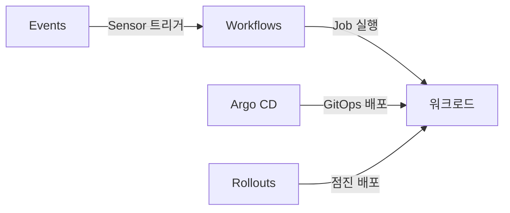
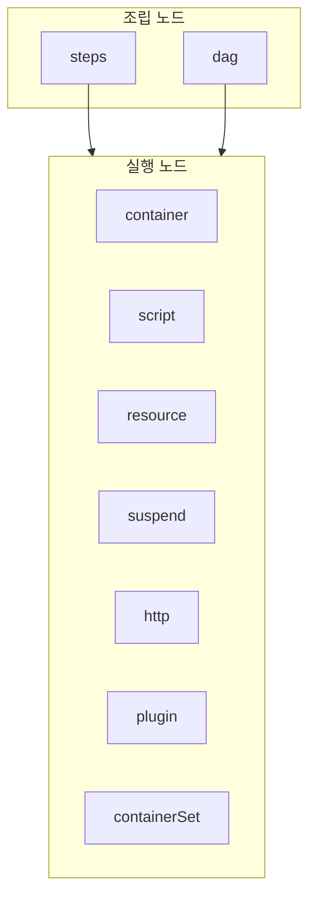
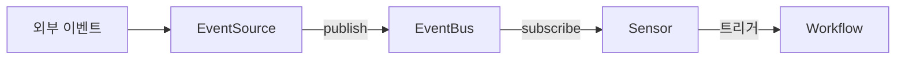

# Argo Workflows

> **Argo Workflows는 CNCF Graduated "K8s 네이티브 범용 워크플로 엔진"**.
> 겉보기에 Tekton과 닮았지만 설계 지향이 다르다 — Tekton이 **CI/CD에
> 최적화된 빌딩 블록**이라면, Argo Workflows는 **DAG·병렬·데이터
> 파이프라인**에 강점이 있는 범용 엔진으로 ML 트레이닝·데이터 ETL·
> 인프라 자동화까지 아우른다. 이 글은 v4.0 API 기준 Workflow·DAG·
> Steps·Template, Artifact 저장소 드라이버, withItems/withParam으로
> 동적 팬아웃, Argo Events(EventSource·EventBus·Sensor)까지 2026-04
> 최신 버전으로 정리한다.

- **현재 기준** (2026-04): **v4.0.5 / v3.7.14** (CVE-2026-40886 수정
  포함). v4.0 GA는 2026-02-04, 하위 지원은 **v3.7.x LTS**. Argo는
  **CNCF Graduated (2022-12-06)**, Argo Workflows / CD / Rollouts /
  Events 4종이 같은 조직(argoproj)
- **v4.0 주요 변경**:
  - **Artifact Driver Plugin** (gRPC 기반) — 임의 저장소 드라이버
    작성 (Executor Plugin(v3.3+)과는 별개)
  - **CRD CEL 검증**으로 apply 단계에서 오류 감지
  - archived workflows `nameFilter` (prefix·contains·exact)
  - 설정 **핫리로드** (controller-configmap 변경 시 재시작 불필요)
  - **Python SDK deprecated → Hera 권장**
  - `synchronization` 블록의 **단수 `mutex`/`semaphore` 제거**
    → **복수형 `mutexes`/`semaphores`**만 허용 (복수형은 v3.6 도입)
  - `argo convert` 마이그레이션 CLI (3.x → 4.0 스키마 자동 변환)
- **주제 경계**: 이 글은 "Argo Workflows로 워크플로 작성·실행".
  GitOps 배포는 [ArgoCD](../argocd/argocd-apps.md), 같은 K8s 네이티브
  CI인 [Tekton](./tekton.md)과 비교, 점진적 배포는
  [Argo Rollouts](../progressive-delivery/argo-rollouts.md)
- **언제 Argo Workflows를 고르는가**: **DAG가 복잡**하거나 **병렬 팬
  아웃이 많은** 워크플로 — ML 트레이닝, 데이터 배치, 대규모 백필, CI
  중에서도 매트릭스가 큰 경우. 단순 CI라면 Tekton·GHA가 더 단순

---

## 1. Argo Workflows의 위치

### 1.1 다른 워크플로 엔진과의 차이

| 축 | Argo Workflows | Tekton | Airflow | Kubeflow Pipelines |
|---|---|---|---|---|
| 도메인 | 범용 워크플로 | CI/CD 빌딩 블록 | 데이터 배치 스케줄링 | ML 파이프라인 |
| 실행 단위 | **K8s Pod** | K8s Pod | VM·워커·K8s | Argo Workflows 기반 |
| 정의 | YAML (CRD) | YAML (CRD) | Python DSL | Python SDK → Argo |
| DAG 표현 | **native `dag` 템플릿** | `runAfter`·result 의존 | Python 함수 호출 | Argo로 컴파일 |
| Artifact | **S3·GCS·Azure·HTTP·Git native** | Workspace (PVC) | XCom (≤48KB) | S3·GCS |
| 이벤트 | **Argo Events** (별도) | Triggers | 스케줄러·sensor | KFP Pipelines SDK |
| 주 사용처 | ML·데이터·CI 혼합 | CI/CD | ETL·DW | ML 전용 |

핵심 포지셔닝: **"DAG + Artifact + Kubernetes"** 3박자가 맞물려야
할 때. Python 없이 YAML만으로 대규모 병렬 워크플로를 돌리는 게
원래 설계 목적이다.

### 1.2 4개 Argo 프로젝트의 역할



- **Argo Workflows**: 워크플로 엔진 (본 글)
- **Argo Events**: 이벤트 소스·센서·버스 (§7)
- **Argo CD**: GitOps 배포
- **Argo Rollouts**: Canary·Blue/Green

단일 벤더 잠금이 아니라 **독립 프로젝트**들 — 필요한 것만 조합 가능.

---

## 2. 핵심 리소스 — Workflow·Template

### 2.1 리소스 종류

| 리소스 | 스코프 | 용도 |
|---|---|---|
| `Workflow` | Namespace | **1회 실행 인스턴스** (TaskRun + PipelineRun 합친 것) |
| `WorkflowTemplate` | Namespace | 재사용 템플릿 |
| `ClusterWorkflowTemplate` | Cluster | 클러스터 전역 재사용 (ClusterRole처럼) |
| `CronWorkflow` | Namespace | 크론 스케줄링 (robfig/cron) |
| `WorkflowEventBinding` | Namespace | Argo Server webhook API로 Workflow 생성 |

### 2.2 "Template"이라는 단어의 3가지 의미

Argo Workflows에서 **template**은 문맥마다 다른 대상을 가리킨다.
입문자가 가장 혼동하는 지점:

| 의미 | 예시 | 해설 |
|---|---|---|
| **1. Workflow 안의 작업 정의** | `spec.templates: [{name: hello, ...}]` | 가장 흔한 의미 |
| **2. 재사용 가능한 리소스** | `WorkflowTemplate` / `ClusterWorkflowTemplate` CRD | 여러 Workflow에서 참조 |
| **3. CronWorkflow의 Workflow 스펙** | `cronWorkflow.spec.workflowSpec` | 주기적으로 생성될 Workflow의 템플릿 |

이 글에서 소문자 `template`은 (1)을 가리킨다.

### 2.3 최소 Workflow

```yaml
apiVersion: argoproj.io/v1alpha1
kind: Workflow
metadata:
  generateName: hello-           # 실행마다 고유 이름 생성
spec:
  entrypoint: main               # 시작 template
  templates:
    - name: main
      container:
        image: alpine:3.20
        command: [echo]
        args: ["Hello Argo"]
```

**API 버전 주의**: Argo Workflows는 여전히 `argoproj.io/v1alpha1`
(이름만 알파, 실제로는 수년간 stable). Argo CD와 다름.

---

## 3. Template 9가지 타입



| 타입 | 역할 | 언제 |
|---|---|---|
| `container` | 컨테이너 1개 실행 | 가장 기본 — 기존 이미지 사용 |
| `script` | 컨테이너 + inline script | Python·bash 한 줄 실행 |
| `resource` | 임의 K8s 리소스 apply·delete·patch | Deployment 생성, Job 실행 |
| `suspend` | 대기·승인 게이트 | 수동 승인·타이머 |
| `steps` | **list of lists** 순차·병렬 | 단순 직렬 워크플로 |
| `dag` | **의존성 그래프** | 복잡한 DAG |
| `http` | Pod 없이 외부 HTTP 호출 (v3.3+) | REST API·webhook 호출 |
| `plugin` | **Executor Plugin** 호출 (v3.3+) | Jira·Slack·SageMaker 등 외부 연동 |
| `containerSet` | **단일 Pod 안 여러 컨테이너 DAG** | 사이드카 조합·GPU 공유 |

### 3.1 container — 가장 기본

```yaml
templates:
  - name: build
    inputs:
      parameters:
        - name: image
    container:
      image: "{{inputs.parameters.image}}"
      command: [make]
      args: [build]
```

### 3.2 script — inline 코드

```yaml
templates:
  - name: gen-numbers
    script:
      image: python:3.12
      command: [python]
      source: |
        import json, random
        items = [{"id": i, "val": random.random()} for i in range(10)]
        print(json.dumps(items))
    outputs:
      parameters:
        - name: result
          valueFrom:
            path: /tmp/result       # 기본: stdout → result 파라미터
```

**script의 stdout**은 자동으로 `outputs.result`에 담긴다 (48KB 제한은
Airflow XCom 수준 소형 데이터 공유용).

### 3.3 resource — K8s 객체 조작

```yaml
templates:
  - name: create-job
    resource:
      action: create
      successCondition: status.succeeded > 0
      failureCondition: status.failed > 0
      manifest: |
        apiVersion: batch/v1
        kind: Job
        metadata:
          generateName: batch-
        spec:
          template:
            spec:
              containers:
                - name: worker
                  image: myapp:latest
              restartPolicy: Never
```

직접 Pod를 띄우지 않고 **다른 K8s 리소스를 만드는** 템플릿. Job·
Deployment·외부 CRD(예: SparkApplication, TFJob) 트리거에 유용.

### 3.4 suspend — 승인 게이트

```yaml
templates:
  - name: approval
    suspend: {}        # 영구 대기

  - name: wait-5m
    suspend:
      duration: "5m"   # 5분 후 자동 재개
```

수동 재개:

```bash
argo resume workflow-xxx
# 또는 Argo UI에서 "Resume" 클릭
```

Slack·PR 댓글에서 승인 버튼으로 argo API를 호출하는 패턴이 흔하다.

### 3.5 http — Pod 없이 외부 API 호출

v3.3+부터 **HTTP 요청 하나를 위해 Pod를 띄우지 않는다**:

```yaml
templates:
  - name: notify
    http:
      url: "https://hooks.slack.com/services/..."
      method: POST
      timeoutSeconds: 10
      headers:
        - name: Content-Type
          value: application/json
      body: |
        {"text": "Build {{workflow.status}}: {{workflow.name}}"}
      successCondition: "response.statusCode < 400"
```

외부 전용 `argo-agent` Pod 하나가 HTTP 템플릿 여러 개를 처리 → **Pod
생성 오버헤드 없음**. 알림·승인 요청·외부 API 호출 표준.

### 3.6 plugin — Executor Plugin

v3.3+ 도입. **Argo가 모르는 시스템**(Jira, ServiceNow, SageMaker,
Snowflake 등)을 Workflow에 꽂는 확장 포인트:

```yaml
templates:
  - name: create-jira
    plugin:
      jira:
        project: "CI"
        summary: "Build {{workflow.name}} failed"
        description: "{{workflow.failures}}"
```

Plugin은 **ConfigMap으로 선언한 gRPC 컨테이너**. argo-agent가 호출
하고 결과를 outputs로 반환. v4.0의 **Artifact Driver Plugin**(저장소
전용)과는 별개 개념.

### 3.7 containerSet — 단일 Pod 안의 DAG

동일 Pod 안에서 **여러 컨테이너를 DAG로 실행**. 각 컨테이너가 같은
volume·네트워크·GPU를 공유:

```yaml
templates:
  - name: train-eval
    containerSet:
      volumeMounts:
        - name: workdir
          mountPath: /work
      containers:
        - name: download
          image: data-loader
        - name: train
          image: trainer
          dependencies: [download]
        - name: evaluate
          image: evaluator
          dependencies: [train]
    volumes:
      - name: workdir
        emptyDir: {}
```

**왜**:

- GPU가 붙은 Pod 하나를 **연속 재사용** (trainer → evaluator)
- volume·네트워크 없이도 바로 공유 (emptyDir)
- DAG 단위 팬아웃보다 **Pod 생성 오버헤드 제거**

### 3.8 Lifecycle Hooks — template 단위 onExit

Workflow 전역 `onExit`(§10)와 별개로 **template마다** 훅 정의 가능:

```yaml
templates:
  - name: build
    hooks:
      exit:
        template: cleanup
      running:
        expression: "nodeStatus.phase == 'Running'"
        template: slack-started
      failed:
        expression: "nodeStatus.phase == 'Failed'"
        template: slack-failed
    container:
      image: builder
```

각 노드 완료·실패·시작 시점에 **훅 template이 호출**. 대규모
파이프라인에서 노드별 세밀한 알림·취합·retry coordination에 유용.

### 3.9 Intermediate Parameters — suspend로 UI 입력 받기

suspend 템플릿에 **런타임 입력**을 UI에서 받을 수 있다:

```yaml
templates:
  - name: approval
    inputs:
      parameters:
        - name: approval-reason
          description: "승인 사유"
          default: ""
    suspend: {}
    outputs:
      parameters:
        - name: approval-reason
          valueFrom:
            supplied: {}           # 사용자가 UI에서 입력
```

승인 게이트에서 "누가·왜" 승인했는지를 Workflow outputs에 기록하는
표준 패턴.

---

## 4. 조립 방식 — Steps vs DAG

**Steps와 DAG은 목적이 다르다**. 둘 다 템플릿을 조립하지만 표현력이
달라, 실무에서 섞어 쓴다.

### 4.1 Steps — "list of lists"

```yaml
templates:
  - name: build-pipeline
    steps:
      - - name: lint              # 바깥 리스트 (순차 실행)
          template: lint
        - name: unit-test         # 안쪽 리스트 (병렬 실행)
          template: unit-test
      - - name: build
          template: build
          arguments:
            parameters:
              - name: commit
                value: "{{steps.lint.outputs.parameters.commit}}"
      - - name: deploy-stg
          template: deploy
          when: "{{workflow.parameters.env}} == staging"
```

- **바깥 리스트 = 순차**
- **안쪽 리스트 = 병렬**
- 이전 그룹의 결과는 `{{steps.X.outputs.parameters.Y}}`로 접근
- 복잡한 의존성은 표현 한계 — DAG가 더 깔끔

### 4.2 DAG — 의존성 그래프

```yaml
templates:
  - name: build-pipeline
    dag:
      tasks:
        - name: lint
          template: lint
        - name: unit-test
          template: unit-test        # lint와 병렬 (dependencies 없음)
        - name: build
          template: build
          dependencies: [lint, unit-test]
        - name: deploy-stg
          template: deploy
          dependencies: [build]
          when: "{{workflow.parameters.env}} == staging"
        - name: deploy-prod
          template: deploy
          dependencies: [build]
          when: "{{workflow.parameters.env}} == production"
```

**장점**: 실무 CI/CD 그래프를 자연스럽게 표현. dependencies가 없는
노드는 자동으로 병렬. `depends:` 필드로는 **논리 조건**도 지원
(`build.Succeeded && !skip.Done`).

### 4.3 depends 문법 — DAG 고급

```yaml
dag:
  tasks:
    - name: A
      template: work
    - name: B
      template: work
      depends: "A.Succeeded || A.Skipped"
    - name: C
      template: cleanup
      depends: "A.Failed || B.Failed"
```

지원 상태: `Succeeded`, `Failed`, `Errored`, `Skipped`, `Omitted`,
`Daemoned`, `AnyFailed`, `AllFailed`. `&&`, `||`, `!`로 조합.

**dependencies vs depends**:

- `dependencies: [A, B]` → 둘 다 성공해야 (레거시 동작)
- `depends: "A && B"` → 같은 뜻
- `depends: "A || B"` → 하나만 성공해도 실행 (dependencies로는 표현 불가)

---

## 5. 파라미터·출력 흐름

### 5.1 Parameters

```yaml
spec:
  arguments:
    parameters:
      - name: message
        value: hello
  entrypoint: main
  templates:
    - name: main
      inputs:
        parameters:
          - name: message
      container:
        image: alpine:3.20
        command: [sh, -c]
        args: ["echo {{inputs.parameters.message}}"]
```

**치환 계층**:

| 스코프 | 접근 |
|---|---|
| Workflow 전역 | `{{workflow.parameters.X}}` |
| Step 입력 | `{{inputs.parameters.X}}` |
| 이전 Step 결과 | `{{steps.Y.outputs.parameters.X}}` |
| 이전 DAG 결과 | `{{tasks.Y.outputs.parameters.X}}` |
| 런타임 컨텍스트 | `{{workflow.name}}`, `{{workflow.status}}` |

### 5.2 Outputs

```yaml
outputs:
  parameters:
    - name: commit-sha
      valueFrom:
        path: /tmp/sha                    # 파일 내용
  artifacts:
    - name: binary
      path: /workspace/app               # 디렉터리 → artifact 저장소로 업로드
```

- **Parameters**: 작은 문자열 (수십 KB 이하, etcd 부담)
- **Artifacts**: **수 MB~GB** 바이너리·디렉터리 — S3·GCS 경유

### 5.3 Result (script의 stdout)

```yaml
- name: get-items
  template: gen-numbers
- name: process
  template: worker
  arguments:
    parameters:
      - name: item
        value: "{{steps.get-items.outputs.result}}"
```

`script`의 stdout은 `outputs.result`에 담겨 체이닝하기 편하다.

---

## 6. 동적 팬아웃 — withItems·withParam

Argo Workflows의 가장 큰 강점. **런타임에 결정되는 리스트**로
팬아웃이 가능.

### 6.1 withItems — 정적 리스트

```yaml
- name: sleep-many
  steps:
    - - name: sleep
        template: sleep
        arguments:
          parameters:
            - name: seconds
              value: "{{item}}"
        withItems: [1, 2, 3, 4, 5]      # 5개 병렬 Pod
```

object도 가능:

```yaml
withItems:
  - {name: alice, role: admin}
  - {name: bob, role: user}

# 참조
value: "{{item.name}}"
```

### 6.2 withParam — 동적 리스트

```yaml
- name: dynamic-fanout
  dag:
    tasks:
      - name: generate
        template: gen-items            # outputs.result = JSON array
      - name: worker
        template: process
        dependencies: [generate]
        arguments:
          parameters:
            - name: item
              value: "{{item}}"
        withParam: "{{tasks.generate.outputs.result}}"
```

**JSON 배열만 받는다** — 객체 리스트가 일반적 패턴.

### 6.3 Fan-in — 결과 취합

`withItems`/`withParam`이 끝나면 다음 Task가 자동으로 **JSON 배열
형태의 aggregated outputs**를 받는다:

```yaml
- name: aggregate
  template: reduce
  dependencies: [worker]
  arguments:
    parameters:
      - name: results
        value: "{{tasks.worker.outputs.parameters.score}}"
      # → JSON 배열: ["0.3", "0.7", "0.5", ...]
```

### 6.4 동시성 제어

팬아웃이 1000개면 동시 1000 Pod는 위험. `parallelism`으로 제한:

```yaml
spec:
  parallelism: 50                    # Workflow 전체 동시 Pod ≤ 50
  templates:
    - name: fanout
      parallelism: 10                # 이 template 안에서만 ≤ 10
```

더 정교한 제한은 **synchronization** (§11.3).

---

## 7. Artifact — 대용량 데이터

### 7.1 왜 네이티브 artifact가 중요한가

Tekton은 Workspace = PVC. Argo는 **"S3에 올리고 내리고"**를
기본값으로 둔다. 두 접근의 차이:

| 축 | PVC 기반 | Artifact 기반 |
|---|---|---|
| 크기 | StorageClass 의존 | 사실상 무제한 |
| AZ/노드 제약 | RWO PVC = 같은 노드 | 없음 |
| 재실행 | PVC 재사용 | 저장소에서 다시 |
| 장기 보관 | 별도 복사 | 이미 object store에 |
| 비용 | PVC 블록 스토리지 | object (저렴) |
| 지연 | 로컬 파일시스템 | 네트워크 |

ML·데이터 파이프라인처럼 **대용량·장기 보관**이 중요하면 artifact,
빠른 공유가 중요하면 PVC. Argo는 둘 다 지원.

### 7.2 저장소 드라이버

| 드라이버 | 버전 | streaming |
|---|---|---|
| S3 (AWS·MinIO·R2) | v1~ | v3.4+ |
| GCS | v2~ | v3.4+ |
| Azure Blob | v3.2+ | v3.4+ |
| OSS (Alibaba) | v3.0+ | v3.6+ |
| HTTP | v1~ | v3.5+ |
| Git | v1~ | - |
| HDFS | v2~ | - |
| Artifactory | v1~ | v3.5+ |
| **Plugin (gRPC)** | **v4.0+** | 구현 나름 |

**Streaming** (v3.4+): 대용량 artifact를 **Pod에 내려받지 않고
파일 시스템 인터페이스로 제공** → 메모리·디스크 절약. 장시간
트레이닝·대용량 체크포인트에 유용.

### 7.3 설정 예 (S3)

```yaml
# artifact-repositories ConfigMap (namespace scope)
apiVersion: v1
kind: ConfigMap
metadata:
  name: artifact-repositories
  annotations:
    workflows.argoproj.io/default-artifact-repository: default-v1
data:
  default-v1: |
    s3:
      endpoint: s3.amazonaws.com
      bucket: my-argo-artifacts
      region: us-east-1
      insecure: false
      useSDKCreds: true          # IRSA·Workload Identity
      keyFormat: "{{workflow.namespace}}/{{workflow.name}}/{{pod.name}}"
```

`useSDKCreds: true`면 **IRSA (AWS)** · **Workload Identity (GCP)** ·
**Azure AD Workload Identity**가 자동 적용되어 access key 안 둔다.

### 7.4 입출력 Artifact

```yaml
templates:
  - name: build
    outputs:
      artifacts:
        - name: binary
          path: /out/app
          # 기본: s3://my-argo-artifacts/default-v1/{workflow}/{pod}/binary.tgz

  - name: deploy
    inputs:
      artifacts:
        - name: binary
          path: /in/app
          from: "{{steps.build.outputs.artifacts.binary}}"
```

### 7.5 Artifact GC (v3.4+)

```yaml
spec:
  artifactGC:
    strategy: OnWorkflowDeletion     # 또는 OnWorkflowCompletion
    podMetadata: {}
    serviceAccountName: argo-artifact-gc
```

Workflow 삭제·완료 시점에 artifact를 **object storage에서도 삭제**.
설정 안 하면 object store가 무한히 쌓인다 — 기본이 "지우지 않음"
이라는 점이 초보 실수의 단골.

---

## 8. Argo Events — 이벤트 → Workflow

### 8.1 구조

Argo Workflows 본체에는 이벤트 트리거가 없다. **Argo Events**라는
**별개 프로젝트**가 이벤트 수신·필터·분기를 담당한다.



3개 핵심 리소스:

| 리소스 | 역할 |
|---|---|
| **EventSource** | 외부 이벤트 수신 → CloudEvents로 정규화 |
| **EventBus** | 전송 계층 (NATS JetStream · Kafka · NATS Streaming) |
| **Sensor** | 이벤트 필터·분기 → Workflow·기타 K8s 리소스 생성 |

### 8.2 EventSource 카탈로그

20+ 소스 지원 — 주요 그룹:

| 그룹 | 예 |
|---|---|
| Git | `github`, `gitlab`, `bitbucket`, `gitea` |
| 메시지 큐 | `kafka`, `amqp`, `pulsar`, `nats`, `redis` |
| 클라우드 | `aws-sns`, `aws-sqs`, `gcp-pubsub`, `azure-events-hub` |
| 저장소 | `minio`, `s3` (put/delete) |
| 스케줄·커스텀 | `calendar`, `webhook`, `resource` (K8s watch) |

```yaml
# GitHub webhook 수신
apiVersion: argoproj.io/v1alpha1
kind: EventSource
metadata:
  name: github
spec:
  service:
    ports:
      - port: 12000
        targetPort: 12000
  github:
    example:
      repositories:
        - owner: example
          names: [repo1, repo2]
      webhook:
        endpoint: /push
        port: "12000"
        method: POST
      events: [push, pull_request]
      apiToken:
        name: github-access
        key: token
      webhookSecret:
        name: github-secret
        key: secret
```

### 8.3 EventBus — NATS JetStream 권장

```yaml
apiVersion: argoproj.io/v1alpha1
kind: EventBus
metadata:
  name: default
spec:
  jetstream:
    version: latest
    replicas: 3              # HA
    persistence:
      storageClassName: ssd
      accessMode: ReadWriteOnce
      volumeSize: 10Gi
```

| 옵션 | 특성 | 권장 |
|---|---|---|
| **NATS JetStream** | 영속 큐·replay·at-least-once | **프로덕션 기본** |
| NATS Streaming (STAN) | **2023-06 EOL, 사용 금지** | ❌ |
| Kafka | 기존 Kafka 사용 중 | 통합 재사용 |

**At-least-once 보장**: Sensor의 `triggers[].atLeastOnce: true` +
NATS JetStream 조합으로 "정확히 한 번"에 가까운 의미 (중복 실행은
Workflow 쪽 idempotency로 방지).

### 8.4 Sensor — 필터와 트리거

```yaml
apiVersion: argoproj.io/v1alpha1
kind: Sensor
metadata:
  name: build-on-push
spec:
  dependencies:
    - name: github-push
      eventSourceName: github
      eventName: example
      filters:
        data:
          - path: body.ref
            type: string
            value: ["refs/heads/main"]
          - path: body.repository.full_name
            type: string
            value: ["example/repo1"]

  triggers:
    - template:
        name: start-build
        k8s:
          operation: create
          source:
            resource:
              apiVersion: argoproj.io/v1alpha1
              kind: Workflow
              metadata:
                generateName: build-
              spec:
                workflowTemplateRef:
                  name: build
                arguments:
                  parameters:
                    - name: commit
                      value: ""   # 아래 parameters에서 주입
          parameters:
            - src:
                dependencyName: github-push
                dataKey: body.head_commit.id
              dest: spec.arguments.parameters.0.value
```

**필터 종류**:

| 필터 | 역할 |
|---|---|
| `data` | payload 필드 값 매칭 (JSONPath + 연산자) |
| `exprs` | **govaluate 표현식** (v1.7+, 복합 조건) |
| `dataLogicalOperator` | data filter 조합 (`and`/`or`) |
| `context` | CloudEvents context 필터 |
| `time` | 시간대 제한 |
| `script` | Lua 스크립트 |

**트리거 대상**: Workflow, ArgoCD Sync, HTTP, AWS Lambda, Azure
Functions, Slack, Kafka publish, custom K8s resource — 30+ 타입.

### 8.5 왜 Tekton Triggers 대신 Argo Events인가

| 상황 | 권장 |
|---|---|
| Tekton 사용 중 + GitHub 이벤트만 | **Tekton Triggers** (간단) |
| Argo Workflows 사용 중 | **Argo Events** |
| 이벤트가 webhook 외(Kafka, SQS, S3) | **Argo Events** 압도적 |
| 멀티 소스 fan-in·fan-out | **Argo Events** (의존성 조합) |

---

## 9. CronWorkflow — 스케줄링

```yaml
apiVersion: argoproj.io/v1alpha1
kind: CronWorkflow
metadata:
  name: nightly-backfill
spec:
  schedules:
    - "0 2 * * *"                 # 02:00 UTC
  timezone: "Asia/Seoul"          # tzdata 있는 경우
  concurrencyPolicy: Forbid       # Allow | Forbid | Replace
  startingDeadlineSeconds: 300
  successfulJobsHistoryLimit: 5
  failedJobsHistoryLimit: 3
  workflowSpec:
    entrypoint: backfill
    templates:
      - name: backfill
        container:
          image: myapp:latest
          command: [backfill]
```

- v3.7+부터 `schedule` → **`schedules` 배열**로 변경 (여러 스케줄
  공존). v4.0에서 **구 `schedule` 필드 제거**
- `timezone`: 컨트롤러 Pod에 tzdata 존재해야. Alpine 기반이면
  `apk add tzdata` 필요
- `concurrencyPolicy: Replace` — 이전 실행을 kill하고 새로 시작
  (중복 방지)
- **`stopStrategy` (v3.6+)**: expression 기반 자동 중단 — 누적
  실패 횟수·성공률 임계치에 도달하면 CronWorkflow 자체 suspend

```yaml
spec:
  stopStrategy:
    expression: "cronworkflow.failed >= 5 || cronworkflow.succeeded >= 100"
```

---

## 10. Exit Handler — onExit

```yaml
spec:
  entrypoint: main
  onExit: cleanup           # 성공·실패·취소 모두 실행

  templates:
    - name: main
      # ...

    - name: cleanup
      steps:
        - - name: notify
            template: slack
            arguments:
              parameters:
                - name: status
                  value: "{{workflow.status}}"
                - name: failures
                  value: "{{workflow.failures}}"
```

**onExit에서 접근 가능한 전역**:

- `{{workflow.status}}` — Succeeded/Failed/Error
- `{{workflow.failures}}` — 실패 노드 JSON 배열
- `{{workflow.duration}}` — 초
- `{{workflow.outputs.parameters.X}}` — 전역 output
- `{{workflow.annotations.X}}` — Workflow annotation

Tekton의 `finally`와 같은 역할. 알림·정리·메트릭 푸시의 정석.

---

## 11. 운영 — 성능·동시성·재시도

### 11.1 재시도 전략

```yaml
templates:
  - name: flaky
    retryStrategy:
      limit: "3"
      retryPolicy: "Always"        # OnError | OnFailure | OnTransientError | Always
      backoff:
        duration: "10s"
        factor: "2"                # 지수: 10s → 20s → 40s
        maxDuration: "5m"
      expression: |
        lastRetry.exitCode != 1 && !(lastRetry.message contains "OOM")
    container:
      image: myapp:latest
```

- `retryPolicy: OnTransientError` — 403/500 같은 일시 오류만
- `expression` (v3.4+) — **런타임 조건으로 재시도 여부 결정**
  (exit code·duration·message 기반). 초기엔 govaluate, **v3.6+부터
  CEL로 전환** 중 — 버전별 문법 차이 주의
- **backoff는 지수** (Tekton과 달리 지원)

### 11.2 Parallelism — 글로벌·Workflow·Template

| 레이어 | 설정 | 효과 |
|---|---|---|
| Controller | `parallelism` in config | 클러스터 전체 동시 Workflow |
| Controller | `namespaceParallelism` | 네임스페이스별 |
| Workflow | `spec.parallelism` | 이 Workflow 동시 Pod |
| Template | `template.parallelism` | 이 template 안 동시 Pod |

### 11.3 Synchronization — 세마포어·뮤텍스

여러 Workflow 간 동시성 제어. `spec.synchronization` 블록은 v3.6
이전부터 존재했지만 **단수 필드(`semaphore`/`mutex`)가 v3.6에서
복수형(`semaphores`/`mutexes`)으로 대체**되고 v4.0에서 **단수는
완전히 제거**됐다 — 여러 제약을 동시 적용 가능.

```yaml
# ConfigMap에 값 정의
apiVersion: v1
kind: ConfigMap
metadata:
  name: argo-sync-config
data:
  db-connections: "10"

---
# Workflow에서 참조
spec:
  synchronization:
    semaphores:                   # ← 복수형만 유효 (v4.0)
      - configMapKeyRef:
          name: argo-sync-config
          key: db-connections
    mutexes:
      - name: deploy-prod         # 전역 mutex (동시 1개)
```

**Database-backed Semaphore (v4.0+)**: ConfigMap 기반은 컨트롤러
reconcile 주기에 의존 — 고빈도·정확 제어가 어렵다. v4.0부터는
외부 DB(PostgreSQL·MySQL)를 세마포어 저장소로 사용 가능:

```bash
argo semaphore create --configmap-name argo-workflows-controller-configmap \
  --name api-quota --limit 50
```

DB 기반은 **원자적 lease** 관리라 경합 상황에서도 정확하다.

### 11.4 Memoization — 캐시

```yaml
- name: expensive
  memoize:
    key: "{{inputs.parameters.input-hash}}"
    maxAge: "1h"
    cache:
      configMap:
        name: argo-memo
  container:
    image: myapp
```

같은 key면 **결과를 ConfigMap에서 재사용**. Idempotent step
(테스트·빌드 결과)에 유용.

### 11.5 TTL·Pod GC

```yaml
spec:
  ttlStrategy:
    secondsAfterCompletion: 3600    # 완료 1시간 뒤 Workflow 삭제
    secondsAfterSuccess: 600        # 성공만 10분 뒤
    secondsAfterFailure: 86400      # 실패는 하루 유지

  podGC:
    strategy: OnPodCompletion       # Pod 단위 즉시 정리
    # 또는 OnWorkflowSuccess, OnWorkflowCompletion
```

기본은 **"Workflow·Pod 영원히 유지"**. etcd·Pod 누적으로 클러스터
장애의 흔한 원인 → 모든 Workflow에 ttlStrategy·podGC 필수.

---

## 12. 보안

### 12.1 Emissary Executor (유일한 선택)

과거 Argo Workflows는 여러 executor(pns, k8sapi, kubelet, docker)를
지원했으나, **v3.4부터 `emissary`가 기본이자 유일**. 2026년 기준
다른 executor는 deprecated·제거.

**emissary의 이점**:

- 외부 서비스 통신 없음 (privileged 아님, **non-root 이미지 사용 가능**)
- Docker socket·kubelet API 접근 없음
- Pod spec 수정만으로 동작 (sidecar 없음, emptyDir의 바이너리)

**Non-root 이미지 전환** (하드닝): 기본 `argoexec:<ver>` 이미지는
호환성 때문에 root로 동작한다. 프로덕션에서는 **`argoexec:<ver>-
nonroot`** (UID 8737) 이미지로 바꾸고 Pod Security Standard
`restricted`를 강제할 것. 전환은 controller-configmap의 `images.executor`
설정으로.

### 12.2 WorkflowTemplate Reference Mode

조직에서 **관리자가 승인한 템플릿만** 쓰게 하려면:

```yaml
# argo-workflows-controller-configmap
workflowTemplateReferencing: Strict      # Strict 단일 옵션
```

- `Strict`: 사용자는 `workflowTemplateRef`만 쓸 수 있음. 임의
  template 정의 금지
- 추가 격리 축(네임스페이스·SA·레이블 제한)은 **별도 RBAC·
  `workflowDefaults`·NetworkPolicy 조합**으로 구성

### 12.3 필수 보안 패치 (2026)

| CVE | 영향 | 수정 버전 |
|---|---|---|
| **CVE-2026-28229** | WorkflowTemplate/ClusterWorkflowTemplate 내용이 Bearer 토큰만 있으면 조회 → **내재된 Secret manifest 유출** | 4.0.3 / 3.7.12 |
| **CVE-2026-31892** | Strict 모드에서도 Workflow 레벨 `podSpecPatch`가 WorkflowTemplate 보안을 우회 | 4.0.2 / 3.7.11 |
| **CVE-2026-40886** | `podGCFromPod()` array index → **Controller 영구 DoS** | 4.0.5 / 3.7.14 |

**결론**: **v4.0.5 / v3.7.14 이상 필수**. 구 버전 유지 중이면
즉시 업그레이드. `argo convert` 명령으로 YAML 스키마 자동 마이그레이션
가능.

### 12.4 RBAC·Service Account

```yaml
spec:
  serviceAccountName: build-sa       # Workflow 전역
  templates:
    - name: deploy
      serviceAccountName: deploy-sa  # 특정 template만
```

Argo Workflows는 **Pod에 SA 주입**만 하고, RBAC 자체는 K8s 표준.
최소 권한 원칙:

- Controller SA: Workflow/Pod 관리 권한만
- 사용자 Workflow SA: 실제 하는 일에 필요한 권한만
- artifact GC SA: object storage 권한 (IRSA·WI 권장)

### 12.5 네트워크·이미지

- Workflow 실행 Pod는 워크로드 네임스페이스 격리 (NetworkPolicy)
- Artifact repository 접근은 egress 화이트리스트
- Image policy: cosign 서명 검증 (Kyverno/policy-controller)

---

## 13. 관측성

### 13.1 메트릭

Controller는 **Prometheus endpoint**(기본 `:9090/metrics`) 제공:

| 메트릭 | 의미 |
|---|---|
| `argo_workflows_count` | 상태별 Workflow 수 |
| `argo_workflows_duration_seconds` | 완료 시간 histogram |
| `argo_workflows_pod_count` | Pod 상태 분포 |
| `argo_workflows_queue_depth_count` | Controller 큐 길이 |
| `argo_workflows_workers_busy` | 워커 사용률 |

### 13.2 Custom Metrics — Workflow/Template 레벨

```yaml
spec:
  metrics:
    prometheus:
      - name: training_duration_seconds
        help: "Training runtime"
        labels:
          - key: model
            value: "{{workflow.parameters.model}}"
        gauge:
          value: "{{workflow.duration}}"
          realtime: true
        when: "{{status}} == Succeeded"
```

- **Workflow 메트릭**: 완료 시점
- **Template 메트릭**: 각 노드 완료 시점
- **realtime: true**: 실행 중에도 주기 푸시 (데몬 기반 장시간 Pod)

### 13.3 Archived Workflows

기본 Workflow는 etcd에 보관 → 대량이면 etcd 부담. **Controller**가
PostgreSQL·MySQL 백엔드로 완료된 Workflow를 **아카이브**하고, argo-
server는 이를 UI·API로 조회만 담당한다:

```yaml
# argo-workflows-controller-configmap (controller가 쓴다)
persistence:
  archive: true
  archiveTTL: 180d
  postgresql:
    host: postgres
    port: 5432
    database: argo
```

v4.0의 `nameFilter` (prefix/contains/exact)로 아카이브된 Workflow
검색 UX 개선.

---

## 14. Hera — Python SDK

v4.0부터 **공식 Python SDK deprecated**, **Hera**(argoproj-labs)가
권장 대체. Argo Workflows YAML을 Python으로 생성:

```python
from hera.workflows import Workflow, DAG, script

@script()
def lint():
    import subprocess
    subprocess.check_call(["make", "lint"])

@script()
def test():
    import subprocess
    subprocess.check_call(["make", "test"])

with Workflow(generate_name="build-", entrypoint="main") as w:
    with DAG(name="main"):
        lint_t = lint()
        test_t = test()
        test_t >> lint_t    # dependency

w.create()                  # 또는 w.to_yaml()
```

**언제 Hera**: 파라미터·조건·팬아웃이 Python 로직에 의존할 때
(ML 실험 스윕, 템플릿 생성). 단순 CI YAML만 쓴다면 불필요.

---

## 15. 비교 — Tekton vs Argo Workflows

| 축 | Tekton | Argo Workflows |
|---|---|---|
| 주 도메인 | CI/CD | 범용 워크플로 (ML·Data·CI) |
| 핵심 단위 | Task·Pipeline | Template (6 타입) |
| DAG | `runAfter`·result | **`dag` + `depends` 표현식** |
| 동적 팬아웃 | Matrix (파라미터만) | **withItems·withParam + JSON** |
| Artifact | Workspace (PVC) | **S3·GCS·Azure native + streaming** |
| 이벤트 | Triggers + CEL | **Argo Events** (EventSource 20+) |
| 조건 분기 | `when` (AND) | `when` 식 + DAG `depends` |
| 승인 게이트 | Custom Task | **`suspend` 내장** |
| SLSA 서명 | **Chains 내장** (자동 provenance) | **내장 없음** — cosign·Kyverno·Sigstore 조합 |
| Python | ❌ | Hera SDK |
| UI | Dashboard (읽기) | Argo UI (재실행·리트라이·시각화) |
| 커뮤니티 | 플랫폼 엔지니어링 (CI 한정) | **넓음 — CI·ML·데이터** |

**선택 기준**:

- **CI만** + 공급망 서명 중요 → Tekton + Chains
- **ML·데이터** 섞임 + 대용량 artifact → Argo Workflows
- **복잡 DAG** + 동적 팬아웃 → Argo Workflows
- 단순 CI + GitHub 이벤트만 → **Tekton 또는 GHA**가 더 단순

실무에서는 **병존**이 흔하다 — CI는 Tekton·GHA, 데이터·ML은 Argo
Workflows, 둘 다 배포는 ArgoCD.

---

## 16. Do & Don't

### 16.1 설계

| Do | Don't |
|---|---|
| `WorkflowTemplate`으로 템플릿 재사용 | 매번 Workflow에 inline |
| DAG `depends`로 논리 조합 | 억지로 `steps`에 쥐어짜기 |
| 대용량은 `artifacts` | `parameters`에 거대 JSON |
| `parallelism` + `synchronization` | 팬아웃 제한 없이 1000 Pod |
| `ttlStrategy` + `podGC` 필수 | 기본값(영구 보관) |
| `artifactGC` 전략 명시 | object storage 무한 증가 |

### 16.2 보안

| Do | Don't |
|---|---|
| `workflowTemplateReferencing: Strict` | 사용자 자유 submit |
| **v4.0.5·v3.7.14 이상** (CVE-2026-40886 등 수정) | 구 버전 유지 |
| IRSA·Workload Identity | access key Secret |
| Emissary + **nonroot 이미지** | 레거시 executor · root 이미지 |
| `serviceAccountName` 최소 권한 | `default` SA |
| ClusterWorkflowTemplate만 참조하는 멀티테넌트 설계 | inline template 자유 허용 |

### 16.3 자주 겪는 문제

| 증상 | 원인 | 해결 |
|---|---|---|
| Workflow가 etcd를 채움 | ttlStrategy 없음 | 완료 후 TTL + 아카이브 |
| `outputs.result` 너무 큼 | 48KB 제한 | artifact로 교체 |
| `withParam`이 파싱 실패 | JSON 아님 | `gen-items`가 JSON array 반환하는지 |
| Pod 계속 running | emissary + podSpecPatch 충돌 | v3.7+로 업그레이드 |
| Artifact 404 | useSDKCreds·bucket 권한 | IRSA role trust policy 확인 |
| CronWorkflow 시간 틀림 | tzdata 없음 | 컨트롤러 이미지에 설치 |
| Workflow 승인 안 됨 | suspend template 누락 | `suspend: {}` template 정의 |

---

## 참고 자료

- [Argo Workflows 공식 문서](https://argo-workflows.readthedocs.io/) (확인: 2026-04-25)
- [Argo Workflows v4.0 Release Blog](https://blog.argoproj.io/argo-workflows-4-0-rc2-70def0d672ef) (확인: 2026-04-25)
- [New features in v4.0.0](https://argo-workflows.readthedocs.io/en/latest/new-features/) (확인: 2026-04-25)
- [Core Concepts](https://argo-workflows.readthedocs.io/en/latest/workflow-concepts/) (확인: 2026-04-25)
- [WorkflowTemplate 공식](https://argo-workflows.readthedocs.io/en/latest/workflow-templates/) (확인: 2026-04-25)
- [ClusterWorkflowTemplate](https://argo-workflows.readthedocs.io/en/latest/cluster-workflow-templates/) (확인: 2026-04-25)
- [Retries](https://argo-workflows.readthedocs.io/en/latest/retries/) (확인: 2026-04-25)
- [Exit handlers](https://argo-workflows.readthedocs.io/en/latest/walk-through/exit-handlers/) (확인: 2026-04-25)
- [Cron Workflows](https://argo-workflows.readthedocs.io/en/latest/cron-workflows/) (확인: 2026-04-25)
- [Artifact Repository 설정](https://argo-workflows.readthedocs.io/en/latest/configure-artifact-repository/) (확인: 2026-04-25)
- [Loops (withItems·withParam)](https://argo-workflows.readthedocs.io/en/latest/walk-through/loops/) (확인: 2026-04-25)
- [Argo Events 공식](https://argoproj.github.io/argo-events/) (확인: 2026-04-25)
- [Argo Events EventBus](https://argoproj.github.io/argo-events/eventbus/eventbus/) (확인: 2026-04-25)
- [Practical Argo Workflows Hardening](https://blog.argoproj.io/practical-argo-workflows-hardening-dd8429acc1ce) (확인: 2026-04-25)
- [HTTP Template](https://argo-workflows.readthedocs.io/en/latest/http-template/) (확인: 2026-04-25)
- [Executor Plugin](https://argo-workflows.readthedocs.io/en/latest/executor_plugins/) (확인: 2026-04-25)
- [Container Set Template](https://argo-workflows.readthedocs.io/en/latest/container-set-template/) (확인: 2026-04-25)
- [Lifecycle Hooks](https://argo-workflows.readthedocs.io/en/latest/lifecyclehook/) (확인: 2026-04-25)
- [Intermediate Parameters](https://argo-workflows.readthedocs.io/en/latest/intermediate-inputs/) (확인: 2026-04-25)
- [Synchronization](https://argo-workflows.readthedocs.io/en/latest/synchronization/) (확인: 2026-04-25)
- [Argo Workflows Deprecations](https://argo-workflows.readthedocs.io/en/latest/deprecations/) (확인: 2026-04-25)
- [CVE-2026-28229 Advisory](https://advisories.gitlab.com/pkg/golang/github.com/argoproj/argo-workflows/v4/CVE-2026-28229/) (확인: 2026-04-25)
- [CVE-2026-31892 Advisory](https://osv.dev/vulnerability/BIT-argo-workflows-2026-31892) (확인: 2026-04-25)
- [CVE-2026-40886 Advisory](https://dailycve.com/argo-workflows-unchecked-array-index-cve-2026-40886-critical/) (확인: 2026-04-25)
- [Hera Python SDK](https://hera.readthedocs.io/) (확인: 2026-04-25)
