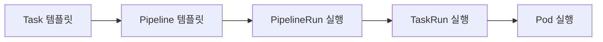
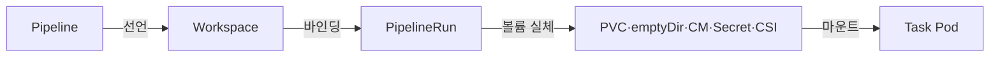
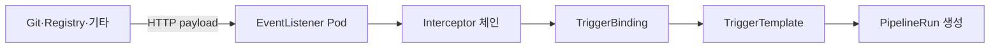
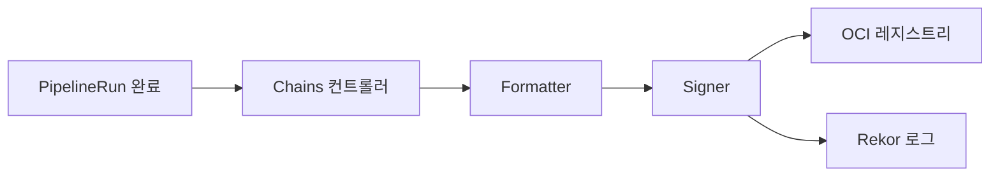

# Tekton

> **Tekton은 CNCF Graduated "CI/CD 빌딩 블록"**. Jenkins·GHA처럼 완성된 CI
> 제품이 아니라, **Task / Pipeline / TaskRun / PipelineRun**을 K8s CRD로
> 제공하는 **프레임워크**다. 워크플로 엔진은 직접 갈아 끼울 수 있고,
> UI·트리거·서명 등은 별개 컴포넌트(Triggers, Chains, Dashboard,
> Pipelines-as-Code)를 조합해 구축한다. 이 글은 v1 API 기준 Task·Pipeline
> 작성법, Trigger의 CEL 인터셉터, Resolver, Chains의 SLSA 증명,
> Pipelines-as-Code까지 2026-04 최신 버전으로 정리한다.

- **현재 기준** (2026-04): **Pipelines v1.10.2 (2026-03-18)**, LTS는 **v1.9
  (2026-01-30)**. Pipelines API는 **`tekton.dev/v1` GA** —
  `v1beta1`은 유지되지만 신규는 모두 `v1`. **Triggers는 여전히
  `triggers.tekton.dev/v1beta1`이 현행 stable** (별도 프로젝트라
  v1 GA 일정 따로 추적). OpenCensus → **OpenTelemetry** 메트릭 전환
  (v1.10), **StepAction CRD GA** (v1.0~), **sidecar-logs results**
  (기본 4KB → 최대 1.5MB)
- **구성 요소**: Pipelines(엔진) · **Triggers**(이벤트 → PipelineRun)
  · **Chains**(SLSA 증명) · Dashboard · CLI(`tkn`) · Operator · Hub ·
  Catalog · **Pipelines-as-Code**(2026-03 tektoncd org 편입)
- **주제 경계**: 이 글은 "Tekton으로 파이프라인 작성·실행". GitOps
  배포는 [ArgoCD](../argocd/argocd-apps.md), GitHub 이벤트 기반
  호스티드 CI는 [GHA 기본](../github-actions/gha-basics.md),
  서명·attestation의 일반 개념은
  [SLSA in CI](../devsecops/slsa-in-ci.md)
- **언제 Tekton을 고르는가**: K8s가 이미 런타임이고, **파이프라인 자체를
  플랫폼 팀이 만드는 내부 제품**이 필요할 때. 팀 단위에서 `.yml` 한 번
  쓰는 CI가 목적이라면 GHA·GitLab CI가 더 빠름

---

## 1. 왜 K8s 네이티브 CI인가

### 1.1 전통 CI와의 대비

| 축 | Jenkins·GHA·GitLab | Tekton |
|---|---|---|
| 실행 단위 | 러너(VM·컨테이너) | **K8s Pod** |
| 파이프라인 정의 | 제품 DSL (`.yml`·`Jenkinsfile`) | **K8s CRD** |
| 상태 저장 | 제품 DB | **etcd + Pod logs** |
| 스케일 | 제품 고유 큐·러너 풀 | **K8s 스케줄러** |
| 확장 | 플러그인 | CRD·커스텀 컨트롤러·Resolver |
| 멀티테넌시 | 프로젝트·조직 | **Namespace + RBAC** |

핵심 차이는 **"파이프라인 실행이 K8s 객체 하나"**라는 점이다.
`kubectl get pipelinerun` 이 정식 운영 도구고, `kubectl logs`가
실행 로그 조회 수단이며, NetworkPolicy·ResourceQuota·PodSecurity가
그대로 CI에 적용된다.

### 1.2 트레이드오프

- **장점**: K8s 생태계 재사용, 플랫폼 팀이 내부 CI 제품을 쌓기 쉬움,
  워크로드와 같은 클러스터·같은 격리 모델
- **단점**: 완성된 CI UX가 없음 (UI·트리거·알림·PR 연동은 직접 조립),
  `.yml` 한 파일이 아니라 여러 CRD 조합을 이해해야 함
- **채택 현실**: Google Cloud Build, Jenkins X, Red Hat OpenShift
  Pipelines, IBM Cloud Continuous Delivery가 Tekton 기반. 팀 단위에서
  단독 채택은 드묾 — 대부분 플랫폼 제품의 엔진으로

---

## 2. 핵심 리소스 5종



| 리소스 | 역할 | 성격 |
|---|---|---|
| `Task` | Step 묶음 템플릿 | **인증 자원** (작성 단위) |
| `Pipeline` | Task DAG 템플릿 | **인증 자원** |
| `TaskRun` | Task 1회 실행 | **런타임 자원** |
| `PipelineRun` | Pipeline 1회 실행 → N개 TaskRun | **런타임 자원** |
| `Step` | Task 안의 컨테이너 1개 | Pod의 컨테이너로 매핑 |
| `StepAction` | Step 1개를 독립 리소스로 패키징 (v1.0 GA) | 재사용·원격 참조 단위 |
| `CustomRun` | Pod 아닌 임의 컨트롤러 실행 (승인 게이트, Kueue 대기 등) | 런타임 자원 |

**Conformance 규칙**: Tekton 호환 구현은 **TaskRun·PipelineRun의
CRUD**는 반드시 제공해야 하고, Task·Pipeline은 권장. 즉 런타임
자원이 "표준"이고 템플릿은 공유 수단.

**Pod 매핑** — Tekton의 실제 실행 모델:

- 1 TaskRun = 1 Pod
- N Step = Pod의 **일반 containers N개가 동시 생성** (init container
  아님). Tekton entrypoint 바이너리가 주입되어 **`-wait_file` /
  `-post_file` 파일 신호**로 Step을 **순차 실행**한다
- Sidecar = Pod의 sidecar 컨테이너 (Step 실행 중 병렬 구동, nop
  override로 종료)

이 매핑이 가장 중요한 설계 제약이다:

- Step 간 파일 공유는 **emptyDir**로 자동 (`/tekton/*`)
- Step 간 환경 전달은 `/tekton/results`·`/tekton/steps/` 파일
- 대용량 데이터·Task 간 공유는 **Workspace** (PVC·ConfigMap·Secret·
  emptyDir 중 선택)
- **Results 크기**: 기본은 **Termination Message 4KB 공유**, v1.10
  시점 `results-from: sidecar-logs` feature flag 활성화로 **최대
  1.5MB까지 확장** 가능. 그 이상은 Workspace로 이관

---

## 3. Task 작성

### 3.1 기본 구조

```yaml
apiVersion: tekton.dev/v1
kind: Task
metadata:
  name: git-clone
spec:
  description: "git 레포를 workspace에 클론"
  params:
    - name: url
      type: string
    - name: revision
      type: string
      default: main
  workspaces:
    - name: output
      description: 클론 대상
  results:
    - name: commit
      description: 체크아웃한 커밋 SHA
      type: string
  steps:
    - name: clone
      image: cgr.dev/chainguard/git:latest
      workingDir: $(workspaces.output.path)
      script: |
        #!/usr/bin/env sh
        set -eu
        git clone --depth=1 --branch "$(params.revision)" \
          "$(params.url)" .
        printf '%s' "$(git rev-parse HEAD)" \
          > "$(results.commit.path)"
```

**꼭 이해해야 하는 4가지 치환**:

| 치환 | 언제 | 주의 |
|---|---|---|
| `$(params.X)` | params 값 | **type 불일치 시 런타임 에러** |
| `$(workspaces.X.path)` | 마운트 경로 | 선언 안 된 ws 참조 시 reject |
| `$(results.X.path)` | result 쓰기 파일 경로 | **문자열 · 어레이 · object** |
| `$(context.taskRun.name)` | 런타임 컨텍스트 | 이름·네임스페이스·재시도 횟수 |

### 3.2 Step의 선택지

```yaml
steps:
  # (A) command + args — 이미지의 ENTRYPOINT 대체
  - name: unit-test
    image: golang:1.23
    command: [go]
    args: [test, ./...]

  # (B) script — 임시 스크립트 파일 생성 후 /bin/sh로 실행
  - name: prepare
    image: alpine:3.20
    script: |
      #!/bin/sh
      set -eu
      echo "prep"

  # (C) 파일 workingDir + env
  - name: with-env
    image: node:20
    workingDir: $(workspaces.source.path)
    env:
      - name: NODE_ENV
        value: production
    command: [npm]
    args: [ci]
```

**script vs command**: script는 편의, command가 정석. script는
shell wrapper가 생기고 exit code 전파에 미묘한 차이가 있을 수
있어, 엄밀한 제어가 필요하면 command 사용.

### 3.3 StepAction (v1.0 GA) — Step의 재사용

Task는 Step 묶음이지만, **한 Step만 따로 공유하고 싶을 때**가 흔하다
(git clone, SBOM 생성, 이미지 서명 등). v1.0부터 **StepAction** CRD
가 GA로 승격됐다.

```yaml
# StepAction 정의 — Task와 독립 자원
apiVersion: tekton.dev/v1beta1
kind: StepAction
metadata:
  name: clone-with-depth
spec:
  params:
    - name: url
    - name: depth
      default: "1"
  image: cgr.dev/chainguard/git:latest
  script: |
    git clone --depth=$(params.depth) $(params.url) .

---
# Task에서 참조
apiVersion: tekton.dev/v1
kind: Task
spec:
  steps:
    - name: clone
      ref:          # ← StepAction 참조
        name: clone-with-depth
      params:
        - name: url
          value: $(params.repo-url)
```

**왜 중요한가**:

- Task 전체가 아니라 Step 단위로 공유 → 조합 유연성
- `ref`에 **Resolver 사용 가능** (git·bundle·hub) → 원격 StepAction
- 보안 스캔·서명·OpenTelemetry init 같은 **공통 Step을 조직 수준 라이브러리**
  로 관리

### 3.4 Step 고급 기능

| 기능 | 설정 | 용도 |
|---|---|---|
| `timeout` | `steps[].timeout: 5m` | Step 단위 타임아웃 (Task도 별도) |
| `onError` | `continue` \| `stopAndFail` | 실패해도 후속 Step 실행 |
| `workingDir` | 경로 | 고정 디렉터리 지정 |
| `securityContext` | 표준 K8s | runAsUser, capabilities 등 |
| `computeResources` | CPU/Mem | Step마다 다른 limit (v1에서 Step 단위로 승격) |
| `displayName` | 문자열 | Dashboard 표시용 (v1.9) |

**Step 단위 resources (v1)**: v1beta1에서는 Task 전체로 주어졌지만
v1에서는 **Step마다 독립**(`computeResources`). 실제 Pod 계산은
K8s 일반 규칙대로 **모든 container의 requests가 합산**되어 스케줄
되므로, Step 수가 많을수록 Pod 전체 요구량이 커진다. Tekton은
LimitRange default가 있을 때만 **"기본값을 Step 수로 나누는"** 보정을
하되 **limit은 조정하지 않는다**. 즉 `computeResources`를 모든 Step에
명시해야 과대 스케줄이 피해진다.

### 3.5 Sidecar

```yaml
sidecars:
  - name: docker-daemon
    image: docker:24-dind
    securityContext:
      privileged: true
    volumeMounts:
      - name: dind-storage
        mountPath: /var/lib/docker
steps:
  - name: build
    image: docker:24
    env:
      - name: DOCKER_HOST
        value: tcp://localhost:2375
    script: |
      docker build -t myapp .
```

Sidecar는 **Step 시작 전에 구동, Step 종료 후 자동 정지**. Tekton이
nop 이미지로 sidecar PID 1을 교체해 Pod를 종료시키는 트릭을 쓴다.
DinD·Buildkit·테스트용 DB·로컬 레지스트리가 전형적 용도지만,
**Kaniko·Buildah·Buildkit rootless**가 더 안전한 빌드 선택지이므로
DinD는 레거시 유지·호환 목적일 때만.

---

## 4. Pipeline — Task DAG

### 4.1 기본 구조

```yaml
apiVersion: tekton.dev/v1
kind: Pipeline
metadata:
  name: build-and-deploy
spec:
  params:
    - name: repo-url
    - name: image
  workspaces:
    - name: shared-data
    - name: docker-credentials
  tasks:
    - name: fetch-source
      taskRef:
        name: git-clone
      params:
        - name: url
          value: $(params.repo-url)
      workspaces:
        - name: output
          workspace: shared-data

    - name: run-tests
      runAfter: [fetch-source]
      taskRef:
        name: golang-test
      workspaces:
        - name: source
          workspace: shared-data

    - name: build-image
      runAfter: [run-tests]
      taskRef:
        name: buildah
      params:
        - name: IMAGE
          value: $(params.image):$(tasks.fetch-source.results.commit)
      workspaces:
        - name: source
          workspace: shared-data
        - name: dockerconfig
          workspace: docker-credentials

  finally:
    - name: notify
      taskRef:
        name: slack-notify
      params:
        - name: status
          value: $(tasks.build-image.status)
```

### 4.2 의존성 지정 방법 (3가지)

| 방법 | 구문 | 예 |
|---|---|---|
| `runAfter` | 명시적 전제 Task | `runAfter: [fetch-source]` |
| Result 참조 | 묵시적 의존 | `$(tasks.X.results.Y)` |
| Workspace 참조 | 묵시적 의존 | ws만 공유해도 의존 생성 안 됨 — 주의 |

**가장 흔한 실수**: Workspace 공유만으로는 순서가 보장되지
않는다. 순서가 필요하면 반드시 `runAfter` 또는 result 참조.

### 4.3 When expressions — 조건부 실행

```yaml
tasks:
  - name: deploy-prod
    when:
      - input: $(params.env)
        operator: in
        values: [production]
      - input: $(tasks.run-tests.results.passed)
        operator: in
        values: ["true"]
    taskRef:
      name: argocd-sync
```

- `when`은 **AND** 결합 (OR은 별도 Task나 CEL 사용)
- **Array 값 지원** (v1.9): `values: ["main", "release-*"]`
- `when`이 false면 **skip 상태** → 후속 `runAfter`에 영향 (기본
  skip도 "완료"로 간주)

**`when` vs CEL**: `when`은 문자열 비교 수준. 복잡한 로직은
**CEL 인터셉터**(Trigger 단계)나 **Custom Task**로 해결.

### 4.4 Finally — 항상 실행

```yaml
finally:
  - name: cleanup
    taskRef:
      name: kubectl-delete
    params:
      - name: manifest
        value: $(tasks.deploy.results.manifest)
```

`finally` Task는:

- 앞 단계 성공·실패·cancel 무관 실행 (타임아웃으로 끊긴 경우도 일부)
- **다른 `tasks`와 finally 간 의존 불가**
- `tasks.X.status` 접근 가능 (`Succeeded`·`Failed`·`None`)
- 알림·정리·리소스 해제의 정석 위치

### 4.5 Matrix — 파라미터 팬아웃 (v1 GA)

```yaml
tasks:
  - name: test-matrix
    matrix:
      params:
        - name: version
          value: [1.21, 1.22, 1.23]
        - name: platform
          value: [linux/amd64, linux/arm64]
    taskRef:
      name: golang-test
```

**6개 TaskRun이 병렬 생성** (3×2). Result를 emit하려면 Task의 result가
문자열이어야 하고, 이후 참조할 때는 `$(tasks.test-matrix.results.Y[*])`
또는 `[N]`.

### 4.6 Pipelines-in-Pipelines (TEP-0056, v1.9 stable)

```yaml
tasks:
  - name: subpipeline
    pipelineRef:
      name: reusable-build
```

`taskRef` 대신 `pipelineRef`. 큰 파이프라인을 재사용 가능한 블록으로
쪼갤 때 유용 — 단, depth 제한과 디버깅 난이도 때문에 2단계까지 권장.

### 4.7 Custom Task — Pod가 아닌 확장 지점

일반 Task는 결국 Pod를 돌린다. 하지만 **"Pod 없이" 파이프라인
중간에 끼워야 하는 동작**이 있다:

- 수동 **승인 게이트** (PR 승인 버튼)
- **Kueue**·외부 큐잉 시스템이 슬롯을 줄 때까지 대기
- 외부 SaaS의 승인·스캔 결과 기다리기
- ML 트레이닝 job을 Kubeflow·Volcano에 위임

이런 확장 포인트가 **Custom Task**다. Pipeline에서 선언은 `taskRef`
대신 `apiVersion`·`kind`를 임의 지정:

```yaml
tasks:
  - name: wait-approval
    taskRef:
      apiVersion: approval.example.com/v1
      kind: ApprovalTask
    params:
      - name: approvers
        value: [sre-lead, secops-lead]
```

Tekton 컨트롤러는 동일한 이름의 **CustomRun** 리소스를 생성하고,
해당 CRD를 watch하는 **별도 컨트롤러**가 `status.conditions`에
완료를 기록하면 파이프라인이 진행된다. Kueue 통합(TEP-0164)도
이 메커니즘을 사용한다.

---

## 5. Workspace — 데이터 공유의 정석

### 5.1 왜 Workspace인가

Task와 Pod의 생명주기가 독립적이므로, Task 간 파일 공유는 **명시적으로
외부 볼륨**을 통해야 한다. Tekton은 이를 Workspace 추상화로 정리:



### 5.2 볼륨 선택 기준

| 타입 | 크기·지속성 | 용도 |
|---|---|---|
| `emptyDir` | 노드 ephemeral | 단일 Pod 안, PipelineRun은 불가 |
| `volumeClaimTemplate` | StorageClass 기반 PVC | **Pipeline 간 공유 기본값** |
| `persistentVolumeClaim` | 기존 PVC | 여러 PipelineRun이 공유 (주의) |
| `configMap` / `secret` | etcd value 한도(≈1MiB) | 설정·자격 증명 주입 (read-only) |
| `csi` | 외부 CSI | Vault, AWS Secrets Manager 등 |

**기본 권장**: `volumeClaimTemplate` + ReadWriteOnce + 10Gi.
`volumeClaimTemplate`은 PipelineRun의 `ownerReference`에 바인딩
되어 **PipelineRun 삭제 시 함께 정리**된다. PipelineRun을 유지한 채
PVC만 비우고 싶다면 `persistentVolumeClaim` 방식으로 수동 GC.

**Optional Workspace (v1 stable)**:

```yaml
workspaces:
  - name: docker-credentials
    optional: true        # 바인딩 없어도 검증 통과
steps:
  - name: push
    script: |
      if [ -d "$(workspaces.docker-credentials.path)" ]; then
        docker login --username user --password-stdin ...
      fi
```

익명 빌드·선택적 서명 등 같은 Task를 여러 모드로 재사용할 때 필수.

### 5.3 Affinity Assistant

Pipeline이 여러 Task를 돌릴 때, **RWO PVC는 한 노드에 고정**되어야
한다. Tekton은 `affinity-assistant`라는 이름의 StatefulSet을 자동
생성해 같은 PipelineRun의 모든 TaskRun을 **같은 노드에 배치**
(기본 동작).

- 비활성화: `disable-affinity-assistant: "true"` in feature flags
- RWX PVC나 네트워크 볼륨(EFS, NFS)이면 비활성화해도 무방
- **AZ 경계를 넘는 PV는 실패** → RWO는 EBS처럼 AZ local일 때만

### 5.4 Workspace 격리 (보안)

```yaml
steps:
  - name: clone
    image: git
    workspaces:
      - name: creds
  - name: build
    image: go
    # creds 안 씀 → 마운트 안 됨
workspaces:
  - name: creds
    mountPath: /creds
    readOnly: true
```

Step·Sidecar가 **선언한 경우에만** workspace 마운트. 민감한 자격
증명은 필요한 Step에만 노출 — credential leakage 최소화.

---

## 6. Params·Results — 데이터 흐름

### 6.1 타입

```yaml
params:
  - name: tag
    type: string
  - name: flags
    type: array
    default: ["-v", "-race"]
  - name: config
    type: object
    properties:
      cpu: {type: string}
      mem: {type: string}
```

- **String**: 기본. `$(params.X)`
- **Array**: `$(params.X[*])` (스프레드), `$(params.X[0])` (인덱스)
- **Object** (stable): `$(params.config.cpu)`

### 6.2 Result 제한

- 문자열 크기 제한: **Termination Message 4KB 공유** → 모든 result 합산
  4KB 미만 유지
- 파일로 쓸 때: `echo -n` (trailing newline 주의)
- **큰 데이터는 반드시 Workspace** (SBOM, JUnit XML, 이미지 digest 리스트)

### 6.3 재사용 패턴

```yaml
# 참조 체인
value: $(tasks.build.results.digest)

# 어레이 에뮬레이트
value: ["$(tasks.scan.results.cves[*])"]

# object 필드
value: $(tasks.config.results.cfg.cpu)
```

---

## 7. Triggers — 이벤트에서 PipelineRun

### 7.1 목적과 구조

Pipeline 자체는 "어떻게"만 정의한다. "언제"(PR 생성, push, webhook
수신 등)를 Pipeline에 연결하는 것이 **Triggers**의 역할.



- **EventListener**: HTTP 서버 Pod + Service (ClusterIP 또는 Ingress 노출)
- **Interceptor**: payload 검증·필터·변환 (GitHub, GitLab, CEL, Bitbucket,
  Slack, webhook signature)
- **TriggerBinding**: HTTP payload → 파라미터 추출
- **TriggerTemplate**: 추출된 파라미터로 PipelineRun/TaskRun 템플릿 채움

### 7.2 CEL 인터셉터

**CEL** = Common Expression Language (Google 공통 표현식, K8s admission
webhook·Envoy·OPA에도 쓰임). Tekton Triggers는 CEL로 payload 필터·
변환을 한다.

```yaml
apiVersion: triggers.tekton.dev/v1beta1
kind: EventListener
metadata:
  name: github-listener
spec:
  triggers:
    - name: push-to-main
      interceptors:
        # 1. GitHub 서명 검증 (공식 인터셉터)
        - ref:
            name: github
          params:
            - name: secretRef
              value:
                secretName: github-webhook-secret
                secretKey: token
            - name: eventTypes
              value: ["push", "pull_request"]

        # 2. CEL로 추가 필터
        - ref:
            name: cel
          params:
            - name: filter
              value: >
                body.ref == 'refs/heads/main' &&
                body.repository.full_name == 'org/repo' &&
                !body.head_commit.message.startsWith('[skip ci]')
            - name: overlays
              value:
                - key: short_sha
                  expression: "body.head_commit.id.truncate(7)"
                - key: branch
                  expression: "body.ref.split('/')[2]"

      bindings:
        - ref: github-push-binding
      template:
        ref: build-template
```

**CEL filter 규칙**:

- `filter` 식이 **true**일 때만 Trigger 실행
- `overlays`는 payload에 **계산된 필드 추가** → TriggerBinding에서
  `$(extensions.short_sha)`로 참조
- 주요 함수: `truncate`, `split`, `matches` (regex), `parseURL`,
  `base64.decode`, `compareHostname`

**체이닝**: 인터셉터는 순서대로 실행, 앞 인터셉터의 결과가 뒤로
전달. GitHub 서명 검증 → CEL 필터 → payload 보강 → 다음 CEL의
보강된 필드 사용.

### 7.3 GitHub App vs Webhook

| 축 | Webhook (per-repo) | GitHub App |
|---|---|---|
| 설정 | 레포마다 webhook URL | 조직·앱 단위 단일 |
| 권한 | webhook URL이 곧 권한 | fine-grained scopes |
| 페이로드 서명 | secret 공유 | 앱 개인키 |
| 확장성 | 레포 수에 비례 | 조직 규모 무관 |

**Pipelines-as-Code**는 GitHub App 모델을 강하게 권장 — 레포마다
EventListener 설정을 반복하지 않아도 `.tekton/` 디렉터리 발견으로
자동 동작.

### 7.4 EventListener 운영 주의

- EventListener Pod는 **항상 실행**(Deployment). 트래픽 몰리면 HPA
  필요
- 기본은 ClusterIP → Ingress·LoadBalancer·Route(OpenShift) 노출 필요
- **Webhook replay**: 수신 payload를 로깅·큐잉해서 실패 시 재처리
  패턴이 필요하면 Knative Eventing·NATS JetStream·Kafka를 중간에
  두는 편
- **인터셉터 Pod**(`tekton-triggers-core-interceptors`)는 별도
  Deployment — 여기가 죽으면 모든 EventListener가 실패

---

## 8. Resolver — 원격 Task·Pipeline 참조

### 8.1 왜 Resolver인가

`taskRef.name: foo`는 **같은 namespace**의 Task만 참조한다. 이
네임스페이스 제약을 풀고, Git·OCI·Hub 등에서 동적으로 불러오는
것이 Resolver.

**ClusterTask는 2024년에 deprecated** → Resolver로 이관이 공식 경로.

### 8.2 Resolver 4종

| Resolver | 참조 대상 | 캐시 | 대표 용도 |
|---|---|---|---|
| `git` | Git 저장소의 YAML | v1.9부터 지원 | 팀 공통 Task 레포 |
| `bundles` | OCI 이미지 속 YAML | 지원 | 버전 고정·무결성 중요 |
| `cluster` | 다른 네임스페이스 CRD | 지원 | ClusterTask 대체 |
| `hub` | Tekton/Artifact Hub | 지원 | 공식 카탈로그 재사용 |
| `http` | 임의 HTTP URL | 지원 | 단순 공유 — response size·timeout 제한 설정 필수 |

### 8.3 사용 예

```yaml
# Git Resolver
- name: clone
  taskRef:
    resolver: git
    params:
      - name: url
        value: https://github.com/org/tekton-tasks.git
      - name: revision
        value: v1.2.0           # 태그·SHA·브랜치
      - name: pathInRepo
        value: tasks/git-clone.yaml

# Bundle Resolver
- name: buildah
  taskRef:
    resolver: bundles
    params:
      - name: bundle
        value: registry.example.com/tekton-tasks:v1.2.0
      - name: name
        value: buildah
      - name: kind
        value: task

# Hub Resolver
- name: lint
  taskRef:
    resolver: hub
    params:
      - name: catalog
        value: tekton
      - name: type
        value: artifact
      - name: name
        value: golangci-lint
      - name: version
        value: "0.2"
```

### 8.4 운영 권장

- **프로덕션은 `bundles` + digest 고정** — Git은 force-push·브랜치
  이동 위험, Hub는 외부 가용성 의존
- 내부 Hub 구축 = Artifact Hub·Tekton Hub 셀프호스팅 + CI에서 Task
  검증·서명 후 푸시
- `http` Resolver는 과거 **unbounded response DoS** 취약점 사례
  이후 response size·timeout·허용 호스트 제한을 ConfigMap(
  `resolvers-feature-flags`)에서 반드시 설정

---

## 9. Tekton Chains — SLSA 증명

### 9.1 역할

Chains는 **TaskRun·PipelineRun 완료 시 자동으로** in-toto attestation
(SLSA Provenance)을 생성·서명·저장한다. 파이프라인 **코드를 수정할
필요가 없다**는 것이 핵심.



### 9.2 어디까지 SLSA Level? (v1.0 기준)

SLSA v1.0 스펙은 **Build L1~L3** 세 단계만 정의한다 (과거 v0.1의
"Level 4"는 현행 스펙에 없음). Tekton + Chains 조합은:

- **Build L1**: 기본 설치만으로 — provenance 자동 생성·서명 충족
- **Build L2**: 인증된 빌드 서비스(Chains) + 위변조 방지 — 키 안전
  보관(KMS·keyless), 사용자가 provenance 위조 불가 조건 충족 시
- **Build L3**: 빌드 플랫폼 격리·위조 방지 — Tekton + Chains +
  **hermetic build**(네트워크 차단)·builder isolation 추가 구성 필요

### 9.3 키 관리 옵션

| 방식 | 명령 | 특징 |
|---|---|---|
| `x509` | cosign 생성 키 | Secret에 private key (기본) |
| `kms` | `gcpkms://`, `awskms://`, `azurekms://`, `hashivault://` | 프로덕션 표준 |
| `keyless` | Fulcio + OIDC | **키 없음**, SA 토큰으로 단기 인증서 |

**Keyless (Sigstore)**: 프로덕션 권장. 관리할 private key 자체가
없어지고, Rekor에 공개 로그로 남아 누구든 검증 가능.

```yaml
# ConfigMap: chains-config (가장 흔한 프로덕션 조합: OCI + Rekor)
data:
  artifacts.taskrun.format: "in-toto"
  artifacts.taskrun.storage: "oci"
  artifacts.pipelinerun.format: "slsa/v1"
  artifacts.pipelinerun.storage: "oci"
  artifacts.oci.storage: "oci"
  transparency.enabled: "true"
  transparency.url: "https://rekor.sigstore.dev"
  signers.x509.fulcio.enabled: "true"
  signers.x509.fulcio.address: "https://fulcio.sigstore.dev"
  signers.x509.identity.token.issuer: "https://token.actions.githubusercontent.com"
```

### 9.4 검증

```bash
# 1. 서명 검증 (cosign)
cosign verify \
  --certificate-identity-regexp ".*@example\.com" \
  --certificate-oidc-issuer https://accounts.google.com \
  ghcr.io/org/myapp@sha256:abcd...

# 2. attestation 검증 (provenance)
cosign verify-attestation \
  --type slsaprovenance \
  --certificate-identity-regexp ".*" \
  --certificate-oidc-issuer https://accounts.google.com \
  ghcr.io/org/myapp@sha256:abcd... \
  | jq -r '.payload' | base64 -d | jq '.predicate.builder'

# 3. 정책 검증 (policy-controller / Kyverno)
# → 서명 없는 이미지 거부, builder id 화이트리스트
```

---

## 10. Pipelines-as-Code — Git 중심 워크플로

### 10.1 무엇을 해결하는가

기본 Tekton은 Task·Pipeline YAML을 클러스터에 `kubectl apply` 한
뒤, Triggers로 연결한다. 이는 GitHub Actions처럼 "레포에 `.yml` 넣고
끝"과 거리가 있다.

**Pipelines-as-Code (PaC)** 가 이 차이를 메꾼다:

- **`.tekton/` 디렉터리**에 Pipeline·PipelineRun YAML 배치
- push·PR 이벤트 시 **Git에서 직접 가져와** PipelineRun 생성
- GitHub App · GitLab · Bitbucket · Gitea · Forgejo 지원
- **ChatOps**: PR 댓글로 `/test`, `/retest`, `/cancel`
- `[skip ci]` 커밋 메시지로 건너뛰기

### 10.2 구조

```
repo/
├── .tekton/
│   ├── build.yaml          # PipelineRun (annotations로 매칭 규칙)
│   └── lint.yaml
└── src/
```

```yaml
# .tekton/build.yaml
apiVersion: tekton.dev/v1
kind: PipelineRun
metadata:
  name: build
  annotations:
    pipelinesascode.tekton.dev/on-event: "[push, pull_request]"
    pipelinesascode.tekton.dev/on-target-branch: "[main, release-*]"
    pipelinesascode.tekton.dev/max-keep-runs: "5"
    pipelinesascode.tekton.dev/task: "[git-clone, golang-test, buildah]"
spec:
  pipelineSpec:
    tasks:
      - name: fetch
        taskRef: {name: git-clone}
        # ...
```

**핵심 annotation**:

| annotation | 역할 |
|---|---|
| `on-event` | 이벤트 매칭 (push, pull_request, comment) |
| `on-target-branch` | 대상 브랜치 필터 |
| `on-cel-expression` | CEL로 복합 조건 (위 둘을 대체) |
| `task` | **인라인 `pipelineSpec`**에서 Task 이름만 쓸 때 PaC Resolver가 Hub·Git에서 자동으로 가져옴 (외부 `pipelineRef`에는 동작 안 함) |
| `max-keep-runs` | 자동 prune |

### 10.3 언제 PaC, 언제 그냥 Triggers?

| 상황 | 권장 |
|---|---|
| GitHub·GitLab 모노레포·멀티레포 표준 CI | **PaC** |
| Git 이벤트 외 (레지스트리 push, cron) | **Triggers** (또는 둘 조합) |
| 엔터프라이즈 커스텀 큐잉·우선순위 | Triggers + 커스텀 Resolver |
| 멀티 팀이 직접 파이프라인 작성 | **PaC** (GitOps-friendly) |

---

## 11. 재시도·타임아웃·취소

### 11.1 재시도

```yaml
# Task 레벨 (TaskRun 실패 시)
apiVersion: tekton.dev/v1
kind: Task
spec:
  steps:
    - name: flaky-test
      retries: 3      # ← v1에서 Task가 아니라 PipelineTask에 설정
```

```yaml
# Pipeline에서 PipelineTask에 설정하는 것이 올바른 위치
tasks:
  - name: flaky-test
    retries: 3
    taskRef: {name: my-test}
```

- `retries`는 **실패 TaskRun을 재시도**. 취소는 재시도 대상 아님
- 재시도 간 지연은 컨트롤러 reconcile 주기 (지수 backoff 없음)
- 재시도 횟수는 `$(context.taskRun.retry-count)`로 Step에서 참조

### 11.2 타임아웃 — 3단계

```yaml
# PipelineRun 전체
spec:
  timeouts:
    pipeline: 1h        # 전체
    tasks: 40m          # 모든 Tasks 합
    finally: 10m        # finally 블록
```

생략 시 기본은 1시간. finally 타임아웃을 별도로 주는 것이 중요 —
cleanup이 최소 보장 시간을 갖도록.

### 11.3 취소·강제 중단

```bash
# TaskRun·PipelineRun을 "Cancelled"로 표시
kubectl patch pipelinerun build-1 \
  --type=merge -p '{"spec":{"status":"Cancelled"}}'

# 시그널 보내되 finally는 실행
kubectl patch pipelinerun build-1 \
  --type=merge -p '{"spec":{"status":"CancelledRunFinally"}}'

# 즉시 정지 (finally 포함)
kubectl patch pipelinerun build-1 \
  --type=merge -p '{"spec":{"status":"StoppedRunFinally"}}'
```

---

## 12. 권한·보안

### 12.1 ServiceAccount 주입

```yaml
apiVersion: tekton.dev/v1
kind: PipelineRun
spec:
  taskRunTemplate:
    serviceAccountName: build-sa
  # 또는 Task별
  taskRunSpecs:
    - pipelineTaskName: deploy
      serviceAccountName: deploy-sa
```

SA의 image pull secrets·mounted secrets가 **자동으로 Pod에 적용**.
Git 인증은 SA에 연결된 Secret에 `tekton.dev/git-0` annotation을
붙이면 Git URL 매칭 자동.

### 12.2 PodSecurity·Secret 관리

| 영역 | 방법 |
|---|---|
| 네임스페이스 PSS | `pod-security.kubernetes.io/enforce: restricted` |
| 이미지 풀 | SA의 `imagePullSecrets` |
| 빌드 자격 증명 | Workspace + `secret` volume (read-only) |
| 외부 Secret 저장소 | External Secrets Operator → Secret 자동 동기화 |
| 서명 키 | KMS · Sigstore keyless 권장 (위 §9.3) |

**Task authored 원칙** (Tekton 공식 권고):

- Step·Sidecar가 **실제로 쓰는 workspace만** 명시
- `readOnly: true` 기본
- `runAsNonRoot: true`, `readOnlyRootFilesystem: true` 가능한 곳 모두

### 12.3 네트워크 제어

- EventListener Pod는 외부 노출 → **인증(Signature 검증 인터셉터)
  없는 raw webhook 절대 금지**
- Pipeline Pod는 ArtifactRepo·Registry·Git 외부 통신 → NetworkPolicy
  로 egress 화이트리스트
- **Hermetic build** (v1 feature gate): `execution-mode-feature-flag:
  enable-api-fields=alpha`와 `hermetic` 활성화로 네트워크 차단 Task
  구동 가능 → SLSA L3 자격

---

## 13. 관측성 (v1.10 OpenTelemetry)

v1.10에서 OpenCensus → **OpenTelemetry** 전면 전환:

| 메트릭 | 타입 | 의미 |
|---|---|---|
| `tekton_pipelines_controller_pipelinerun_duration_seconds` | histogram | PR 완료 시간 |
| `tekton_pipelines_controller_taskrun_count` | counter | TR 개수 |
| `tekton_pipelines_controller_running_pipelineruns` | gauge | 동시 실행 수 |
| `tekton_pipelines_controller_pipelinerun_taskrun_duration_seconds` | histogram | TR 완료 시간 |

**권장 대시보드 축**:

- **Lead time**: PipelineRun start → complete p50/p95
- **Failure rate**: 상태 `Failed` / 전체
- **Queue wait**: PipelineRun 생성 ↔ 첫 TaskRun 시작 (스케줄러·리소스 부족 지표)
- **Retry rate**: retries 발생 빈도 → flaky Task 색출

트레이스: OTel Collector + Jaeger·Tempo·Honeycomb. Step 단위 span이
아니라 TaskRun·PipelineRun span 수준.

---

## 14. 운영 권장 — Do & Don't

### 14.1 설계

| Do | Don't |
|---|---|
| Task는 **단일 책임** — clone, test, build, push 분리 | 만능 "everything" Task |
| `resolver: bundles` + digest 고정 | 네임스페이스 내 `taskRef.name` 직참조 (공유 안 됨) |
| Workspace는 `volumeClaimTemplate` | `persistentVolumeClaim` 공유 (경쟁 상태) |
| params 기본값·검증 명시 | 모든 파라미터 필수, 빈 문자열 허용 |
| finally에 알림·정리 | Pipeline 끝에 같은 코드 복사 |

### 14.2 보안

| Do | Don't |
|---|---|
| EventListener에 signature 인터셉터 필수 | 평문 webhook 신뢰 |
| Chains + keyless로 모든 이미지 서명 | "나중에" |
| SA 단위 권한 최소화 | `default` SA에 cluster-admin |
| Hermetic Task로 빌드 격리 | 빌드 Step에서 임의 네트워크 호출 |
| Resolver는 `bundles` digest | `http` resolver 무제한 사용 |

### 14.3 규모

- **한 네임스페이스 PR/분 ≥ 수백**이면 controller HPA + Kueue 통합
  (TEP-0164) 검토
- **Kueue 큐잉 패턴** — PipelineRun을 생성 즉시 실행하지 않고 큐에
  대기시킬 때:

  ```yaml
  apiVersion: tekton.dev/v1
  kind: PipelineRun
  metadata:
    labels:
      kueue.x-k8s.io/queue-name: ci-queue
  spec:
    status: "PipelineRunPending"   # ← 생성 시 Pending 고정
    pipelineRef: {name: build}
  ```

  Kueue 컨트롤러가 슬롯 배정 시 `status`를 비워 실행 시작. GPU
  노드·제한된 빌드 풀을 공유할 때 유용
- 수백 레포 운영 시 **PaC + GitHub App + Hub 내재화** 조합
- **PipelineRun 이력은 기본 prune 없음** → **tektoncd/results**
  (별도 서브프로젝트)로 장기 저장·API 조회, 외부 GC(CronJob)로
  오래된 PR 삭제
- PVC 누적 시 `volumeClaimTemplate`의 `ownerReference` 확인 —
  PipelineRun 삭제 시 함께 삭제되는지가 관건

### 14.4 디버깅 — Breakpoint onFailure

Tekton만의 K8s 네이티브 디버깅 기능:

```yaml
apiVersion: tekton.dev/v1
kind: TaskRun
spec:
  debug:
    breakpoints:
      onFailure: enabled   # Step 실패 시 컨테이너가 "살아서" 멈춤
```

Step이 실패하면 Pod가 정리되지 않고 **정지된 상태로 유지**된다.
`kubectl exec`로 들어가 파일시스템·params·workspace를 직접 확인:

```bash
kubectl exec -it tr-xxx-pod -c step-build -- /bin/sh

# 디버깅이 끝난 뒤:
/tekton/debug/scripts/debug-continue       # 성공 처리하고 다음 Step
/tekton/debug/scripts/debug-fail-continue  # 실패 처리하고 다음 Step
```

Jenkins의 "replay"·GHA의 "rerun with debug logging"과 다른 —
**실행 중인 컨테이너 안에 들어가는** 디버깅.

### 14.5 일상 운영 커맨드 (`tkn` CLI)

```bash
# PipelineRun 실행 + 스트리밍 로그
tkn pipeline start build \
  --param repo-url=https://github.com/org/repo \
  --workspace name=shared-data,volumeClaimTemplateFile=pvc.yaml \
  --showlog

# 마지막 실행 재실행 (파라미터 그대로)
tkn pipeline start build --last

# TaskRun 로그 follow
tkn taskrun logs -f -L

# Task를 OCI bundle로 푸시
tkn bundle push registry.example.com/tekton-tasks:v1.2.0 \
  -f tasks/git-clone.yaml -f tasks/buildah.yaml

# Pipelines-as-Code PR 로그
tkn pac logs -n pac-ci

# 오래된 PipelineRun 정리
tkn pipelinerun delete --keep 20
```

### 14.6 자주 겪는 문제

| 증상 | 원인 | 해결 |
|---|---|---|
| TR이 Pending만 지속 | 노드 부족·Affinity Assistant 제약 | `describe` 확인, PVC AZ 일치 |
| Result 접근 시 `empty` | Step이 `printf` 없이 종료·4KB 초과 | sidecar-logs 활성화 또는 Workspace 이관 |
| Step OOMKilled | Step에 `computeResources` 누락 | Step마다 limit 명시 |
| Pod 스케줄 실패(requests 과대) | Step 다수에 requests 중복 합산 | 필요한 Step만 requests 지정 |
| PR 완료 안 됨 | Sidecar가 stop 거부 | nop 이미지 override |
| Trigger 매칭 안 됨 | 인터셉터 체인 중간 reject | EL Pod 로그 + `tkn pac logs` |
| PipelineRun 이력이 etcd를 채움 | 기본 prune 없음 | `tektoncd/results` 배포 + 외부 GC |

---

## 15. 다른 K8s 네이티브 CI와의 비교

| 축 | Tekton | Argo Workflows | GitHub Actions(ARC) |
|---|---|---|---|
| 주 용도 | CI/CD 빌딩 블록 | 범용 워크플로 (ML·데이터 포함) | 호스티드 CI의 K8s 러너 |
| 모델 | Task·Pipeline CRD | Workflow CRD (DAG·Steps) | Runner가 GHA job 수신 |
| DAG 표현 | `runAfter`·result 의존 | 명시적 `dependencies` | GHA `needs:` |
| 캐시·Artifact | Workspace (PVC) | S3·GCS·MinIO native | GHA cache backend |
| 이벤트 | Triggers·PaC | Argo Events (Sensor) | GitHub |
| 공급망 서명 | **Chains** 내장 | 별도 구성 | attestation v1 |
| GUI | Dashboard (읽기 전용) | Argo UI (템플릿·재실행) | GitHub UI |
| 적합도 | 플랫폼 팀이 내부 CI 제품을 쌓을 때 | **데이터·ML 파이프라인** 또는 CI | GHA 생태계 재사용 |

→ [Argo Workflows](./argo-workflows.md), [ARC 러너](../github-actions/arc-runner.md)

---

## 참고 자료

- [Tekton 공식 문서](https://tekton.dev/docs/) (확인: 2026-04-25)
- [Tekton Pipelines v1.10.0 Release Blog](https://tekton.dev/blog/2026/02/27/tekton-pipelines-v1.10.0-observability-evolved/) (확인: 2026-04-25)
- [Tekton Pipelines v1.9.0 LTS Release Blog](https://tekton.dev/blog/2026/02/02/tekton-pipelines-v1.9.0-lts-continued-innovation-and-stability/) (확인: 2026-04-25)
- [Pipelines-as-Code Joins Tekton (2026-03)](https://tekton.dev/blog/2026/03/19/pipelines-as-code-joins-the-tekton-organization/) (확인: 2026-04-25)
- [Tekton Pipeline API Spec](https://tekton.dev/docs/pipelines/pipeline-api/) (확인: 2026-04-25)
- [Tekton Triggers EventListeners](https://tekton.dev/docs/triggers/eventlisteners/) (확인: 2026-04-25)
- [Tekton Triggers CEL Interceptor](https://tekton.dev/docs/triggers/interceptors/) (확인: 2026-04-25)
- [Tekton Chains SLSA Provenance](https://tekton.dev/docs/chains/slsa-provenance/) (확인: 2026-04-25)
- [Tekton Resolvers — Getting Started](https://tekton.dev/docs/pipelines/resolution-getting-started/) (확인: 2026-04-25)
- [Pipelines-as-Code 공식 사이트](https://pipelinesascode.com/) (확인: 2026-04-25)
- [tektoncd/pipeline releases](https://github.com/tektoncd/pipeline/releases) (확인: 2026-04-25)
- [StepActions 공식 문서](https://tekton.dev/docs/pipelines/stepactions/) (확인: 2026-04-25)
- [Custom Tasks / CustomRun](https://tekton.dev/docs/pipelines/customruns/) (확인: 2026-04-25)
- [Debugging TaskRuns (breakpoint onFailure)](https://tekton.dev/docs/pipelines/debug/) (확인: 2026-04-25)
- [Compute Resources in Tekton](https://tekton.dev/docs/pipelines/compute-resources/) (확인: 2026-04-25)
- [Container Contract (Step 실행 모델)](https://tekton.dev/docs/pipelines/container-contract/) (확인: 2026-04-25)
- [Triggers API](https://tekton.dev/docs/triggers/triggers-api/) (확인: 2026-04-25)
- [Supply Chain Security](https://tekton.dev/docs/concepts/supply-chain-security/) (확인: 2026-04-25)
- [SLSA Build Levels v1.0](https://slsa.dev/spec/v1.0/levels) (확인: 2026-04-25)
- [tektoncd/results (장기 저장)](https://github.com/tektoncd/results) (확인: 2026-04-25)
