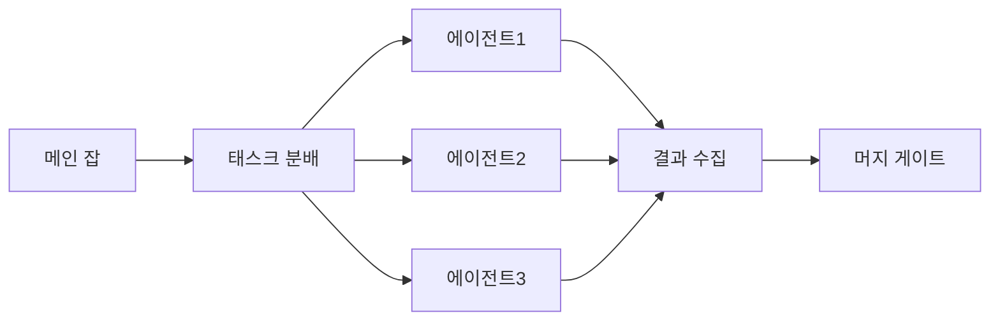
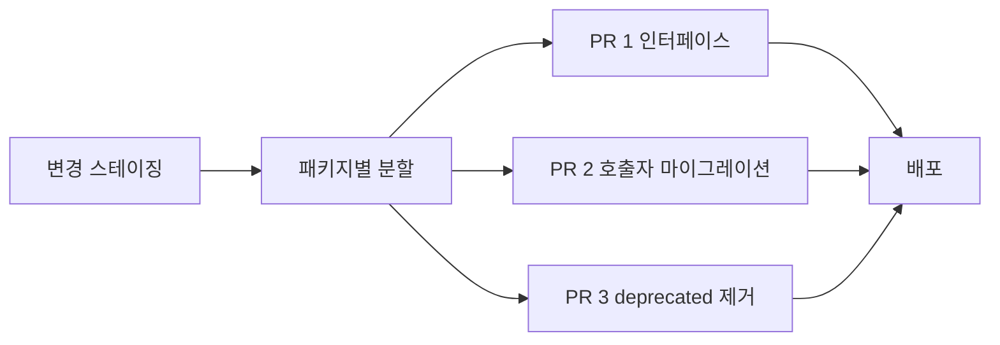

# 모노레포 CI/CD — Bazel·Nx·affected 감지

> **모노레포 CI/CD**의 본질은 "코드 변경이 일부인데 어떻게 전체를 다시
> 빌드하지 않을 것인가"다. 답은 세 가지 — **그래프 기반 affected 감지**,
> **원격 캐시(Remote Cache)**, **분산 태스크 실행(DTE)**. 이 세 가지가
> 빠지면 모노레포는 곧 "PR CI 1시간"의 악몽이 된다.
>
> 2026년 기준 **JS/TS는 pnpm workspaces + Turborepo/Nx**, **다언어 대규모는
> Bazel 9 / Buck2 / Pants**, **JVM은 Gradle + Develocity**가 기본값.
> false-negative(누락된 테스트)를 막기 위해 **nightly full sweep**과
> **implicit dep 선언**을 반드시 병행한다.

- **현재 기준**: Bazel 9.0 LTS (2026-01), Nx 22.x, Turborepo 2.x,
  Pants 2.x, Buck2 OSS, moon v1.x
- **상위 카테고리**: CI/CD 운영
- **인접 글**: [테스트 전략](../testing/test-strategy.md),
  [파이프라인 템플릿](./pipeline-templates.md),
  [의존성 업데이트](../dependency/dependency-updates.md),
  [SemVer·Changelog](../release/semver-and-changelog.md)

---

## 1. Mono vs Poly repo

### 1.1 정의

| 형태 | 특징 |
|---|---|
| **Google 스타일 모노레포** | Piper 단일 리포, 86TB+·20억+ 라인, CitC·TAP·Rosie |
| **Meta 스타일 모노레포** | Sapling/Mononoke VCS + Buck2 |
| **현대 OSS 모노레포** | Git + 워크스페이스(pnpm/Cargo/go.work) + 그래프 도구(Nx·Turborepo·Bazel) |
| **폴리레포** | 서비스·라이브러리별 독립 Git 리포 |
| **하이브리드 (meta-repo)** | 도메인별 제한 모노레포 (frontend-mono, platform-mono) |

### 1.2 트레이드오프

| 축 | 모노레포 | 폴리레포 |
|---|---|---|
| 다중 프로젝트 원자 리팩토링 | ✅ 단일 PR | 크로스 리포 PR 협력 필요 |
| 의존성 일관성 | one-version rule | 버전 드리프트 |
| CI 인프라 요구 | 그래프·캐시·DTE 필수 | 리포별 격리 단순 |
| 릴리스 정책 | 독립/고정 선택 | 기본 독립 |
| 권한 관리 | CODEOWNERS·path ACL | 리포 ACL 단순 |
| 빌드 도구 의존 | Bazel·Nx·Turborepo 필요 | 표준 도구로 충분 |
| 코드 검색·발견성 | 우수 | 분산 |
| 대규모 조직 확장 | Google·Meta 증명 | 경계 명확 |

### 1.3 Conway's Law 관점

| 조직 크기 | 권장 |
|---|---|
| < 20명 | 폴리레포 (모노레포 오버헤드가 이익보다 큼) |
| 20~200명 | 하이브리드 (도메인 모노레포) |
| 200명+ | 모노레포 수렴 경향 |

**2026년 재인식**: "모노레포가 항상 옳다"는 2020년대 초 분위기가 가라앉음.
**조직·도구 성숙도가 갖춰져야** 모노레포가 이득. 작은 팀에는 폴리레포가
여전히 단순·안전.

---

## 2. 도구 지형 (2026-04)

| 도구 | 주 언어 | 특징 | 2026 상태 |
|---|---|---|---|
| **Bazel** | 다언어 | Google, 원격 실행, hermetic | **9.0 LTS (2026-01), Bzlmod 필수** |
| **Nx** | JS/TS + 다언어 | 그래프·플러그인·Nx Cloud | **22.x Agent Skills + Self-Healing CI** |
| **Turborepo** | JS/TS | 캐싱 + 단순 | **2.x Go→Rust 점진적 이식 완료 (2024-02), `--affected` 지원 (2.1+)** |
| **Pants** | Python·Go·Java·Scala·Kotlin·Shell | Rust 엔진 + Python rules | 2.x, OSS 커뮤니티 주도 |
| **Buck2** | 다언어 | Meta, Rust, Starlark | OSS 활발, Sapling 연계 |
| **Rush** | JS/TS | Microsoft, 엔터프라이즈 | 안정 유지 |
| **Lage** | JS/TS | Microsoft 경량 | 사내·OSS 혼용 |
| **Gradle + Develocity** | JVM | Build Cache + Test Distribution | Gradle Enterprise → Develocity 리브랜드 |
| **moon** | JS·Rust·Go·Ruby 등 | Rust 작성, 자동 툴체인 관리 | v1.x, moonbase 유료 |

### 2.1 선택 가이드

| 상황 | 추천 |
|---|---|
| JS/TS 단순 모노레포 | **Turborepo** + pnpm workspaces |
| JS/TS + 플러그인 풍부 | **Nx** |
| 대규모 다언어 + 엔터프라이즈 | **Bazel** (또는 **Buck2**) |
| Python 중심 다언어 | **Pants** |
| JVM 중심 | **Gradle + Develocity** |
| Meta 출신·영향 | **Buck2** |
| 작은 조직 자동 툴체인 | **moon** |

---

## 3. Bazel 9 심화

### 3.1 9.0 주요 변화 (2026-01)

- **Bzlmod 필수** — WORKSPACE 코드 완전 제거. `--enable_workspace` no-op
- Starlark API 정리
- Java 21, Python 3.12 기본
- `rules_oci`가 `rules_docker` 완전 대체

### 3.2 Bzlmod (MODULE.bazel)

```python
# MODULE.bazel
module(name = "my_monorepo", version = "0.1.0")

bazel_dep(name = "rules_go", version = "0.50.1")
bazel_dep(name = "rules_oci", version = "2.0.0")
bazel_dep(name = "rules_python", version = "0.34.0")

go_deps = use_extension("@gazelle//:extensions.bzl", "go_deps")
go_deps.from_file(go_mod = "//:go.mod")
```

WORKSPACE 대비:
- 전이 의존성 자동 해결 (npm처럼)
- 버전 충돌 MVS(Minimum Version Selection)
- **Bazel Central Registry** (`registry.bazel.build`)

### 3.3 Remote Execution (RBE)

```bash
bazel build //... \
  --remote_executor=grpcs://remote.buildbuddy.io \
  --remote_cache=grpcs://remote.buildbuddy.io \
  --remote_timeout=3600 \
  --jobs=200
```

| RBE 서비스 | 특징 |
|---|---|
| **BuildBuddy** | OSS 프론트엔드 + 유료 RBE, 트레이싱·분석 |
| **EngFlow** | 상업 RBE, 하이브리드·GPU |
| **Google RBE** | GCP 내부 서비스 |
| **Bazelisk self-hosted** | 자체 REAPI 서버 (bazel-remote, buildbarn) |

### 3.4 Test size·timeout

| size | 기본 CPU | 기본 RAM | 기본 타임아웃 |
|---|---|---|---|
| small | 1 | 20MB | 60s |
| medium | 1 | 100MB | 300s |
| large | 1 | 300MB | 900s |
| enormous | 1 | 800MB | 3600s |

[테스트 전략 §1.1](../testing/test-strategy.md) 참조.

### 3.5 rules 생태계

| rules | 용도 |
|---|---|
| `rules_go` (bazel-contrib) | Go |
| `rules_python`·`aspect_rules_py` | Python |
| `rules_oci` | OCI 이미지 (docker 미의존, hermetic) |
| `rules_img` | 이미지 빌드 (신규) |
| `rules_nodejs` | Node.js |
| `rules_java` | Java |
| `rules_rust` | Rust |

### 3.6 Hermetic Builds

- 샌드박스 + 선언된 입력만 → 재현 가능
- 네트워크 격리: `--sandbox_default_allow_network=false`,
  `--incompatible_sandbox_hermetic_tmp`
- 환경 변수 엄격화: `--incompatible_strict_action_env`
- 동일 입력 → 동일 출력 → cache 신뢰
- Build Event Protocol (BEP) / Build Event Service (BES)로 빌드 이벤트
  스트리밍 → BuildBuddy·EngFlow 관측성 통합

---

## 4. Nx 심화

### 4.1 Nx 22 주요 변화 (2026)

- **Agent Skills** — 포터블 AI 에이전트 역량 (MCP 기반)
- **Terminal UI (fullscreen TUI)** — 다중 태스크 실시간 뷰
- **Self-Healing CI** — 실패 분석 → 수정 제안 → 검증 → 적용 (50%+ 성공률)
- Rust 재작성 완료로 cold start 개선

### 4.2 핵심 명령

```bash
nx affected -t test           # 변경 영향 테스트
nx affected -t build          # 변경 영향 빌드
nx graph                      # 의존성 그래프 시각화
nx release                    # 버전·changelog·퍼블리시
nx run-many -t test           # 모든 프로젝트
nx show projects              # 프로젝트 목록
```

### 4.3 nx.json 구조

```json
{
  "namedInputs": {
    "default": ["{projectRoot}/**/*", "sharedGlobals"],
    "production": [
      "default",
      "!{projectRoot}/**/*.spec.ts",
      "!{projectRoot}/src/test-setup.ts"
    ],
    "sharedGlobals": ["{workspaceRoot}/pnpm-lock.yaml"]
  },
  "targetDefaults": {
    "build": {
      "cache": true,
      "dependsOn": ["^build"],
      "inputs": ["production", "^production"]
    },
    "test": {
      "cache": true,
      "inputs": ["default", "^production"]
    }
  },
  "release": {
    "projects": ["packages/*"],
    "version": {"conventionalCommits": true}
  }
}
```

- **`namedInputs`**: affected·cache 키의 재료
- **`targetDefaults`**: 태스크별 기본값
- **`dependsOn: ["^build"]`**: 의존성을 먼저 빌드

### 4.4 Nx Cloud — Remote Cache + DTE

```yaml
- uses: nrwl/nx-set-shas@v4
- run: npx nx affected -t lint test build --parallel=3
  env:
    NX_CLOUD_ACCESS_TOKEN: ${{ secrets.NX_CLOUD_ACCESS_TOKEN }}
```

- **Remote cache**: task output 공유
- **DTE (Nx Agents)**: 태스크를 여러 머신에 지능 분배
- **Self-Healing**: 실패 → AI 분석 → PR 제안

### 4.5 Implicit Dependencies

```json
{
  "name": "web",
  "implicitDependencies": ["api-types"],
  "namedInputs": {
    "default": ["{projectRoot}/**/*", "!{projectRoot}/**/*.md"]
  }
}
```

그래프에 자동 감지되지 않는 관계 (동적 import, 환경 변수 의존, config
파일) 를 **명시 선언**해 affected 누락 방지.

---

## 5. Turborepo 심화

### 5.1 2.x 주요 변화

- **Go→Rust 점진적 이식 완료 (2024-02)** — cold start 30~40% 단축.
  Vercel은 "rewrite"가 아닌 **incremental porting**이라고 공식 명시
- **`--affected` 플래그 (2.1+)**: Git 기준선 대비 실행
- `pipelines.json` → **`turbo.json`** 이름 변경
- Turbopack 연계 (Next.js)

### 5.2 turbo.json

```json
{
  "$schema": "https://turbo.build/schema.json",
  "tasks": {
    "build": {
      "dependsOn": ["^build"],
      "outputs": ["dist/**", ".next/**", "!.next/cache/**"],
      "cache": true
    },
    "test": {
      "dependsOn": ["build"],
      "outputs": ["coverage/**"]
    },
    "lint": {},
    "dev": {"cache": false, "persistent": true}
  }
}
```

### 5.3 Filter·Affected

```bash
# 특정 패키지 + 변경 의존성
turbo run build --filter="@acme/ui...[HEAD^1]"

# 변경 기준선 대비
turbo run test --affected

# prune: 패키지 + 의존성만 남긴 작업 디렉터리 (Docker 빌드용)
turbo prune @acme/web --docker
```

### 5.4 Remote Cache

```bash
# Vercel 호스팅
turbo login && turbo link

# Self-hosted (ducktors/turborepo-remote-cache, 기타)
TURBO_API=https://cache.internal \
TURBO_TOKEN=$CACHE_TOKEN \
TURBO_TEAM=acme \
TURBO_REMOTE_CACHE_SIGNATURE_KEY=$SIGN_KEY \
turbo run build
```

- **Signature key**로 cache 무결성 서명 — poisoning 방지
- Fork PR에서는 **read-only** (secret 미노출)

### 5.5 한계

- TS/JS 중심 — 다언어 태스크는 runner로 래핑 필요
- 의존성 그래프가 Nx만큼 풍부하지 않음
- `turbo release` 없음 (changesets와 조합)

---

## 6. Affected Detection 전략

### 6.1 방식 비교

| 방식 | 도구 | 장점 | 리스크 |
|---|---|---|---|
| **Git diff** | Nx, Turborepo, Lage | 빠름, 단순 | implicit dep 누락 가능 |
| **Project Graph** | Bazel, Buck2, Pants | 정확한 의존성 추적 | 그래프 구성 비용 |
| **파일 경로 필터** | GitHub Actions `paths:` | 설정 단순 | 오탐·누락 모두 |

### 6.2 False-Negative 보상

**affected가 놓친 회귀를 어떻게 잡을 것인가** — 모든 모노레포의 과제.

| 전략 | 실행 주기 |
|---|---|
| **Nightly full sweep** | 1일 1회 전체 빌드·테스트 |
| **Dependency update PR 시 전체 재빌드** | Renovate/Dependabot lock 파일 변경 |
| **Cold build periodic** | 주 1회 캐시 비활성 전체 실행 |
| **Release pipeline full sweep** | 릴리스 직전 |

### 6.3 Implicit Dep 대책

| 원인 | 해결 |
|---|---|
| 동적 `import()` | `implicitDependencies` 명시 |
| 환경 변수 의존 | `inputs`에 env 추가 |
| 설정 파일 공유 | `sharedGlobals`에 포함 |
| 플러그인 |  `implicitDependencies` |
| 테스트 fixture | `namedInputs`에 포함 |

---

## 7. Remote Cache — 공유 캐싱

### 7.1 도구별 지원

| 모노레포 도구 | 캐시 기술 |
|---|---|
| **Bazel** | HTTP / gRPC (REAPI) / S3-compatible |
| **Nx** | Nx Cloud (또는 self-hosted OSS `@nx/gcs` 등) |
| **Turborepo** | Vercel 호스팅 / Self-hosted (`ducktors/turborepo-remote-cache`) |
| **Gradle** | Develocity Build Cache 또는 `gradle-build-cache` OSS |
| **moon** | moonbase (유료) / S3 |

### 7.2 Self-hosted 옵션

```yaml
# bazel-remote (Docker)
services:
  bazel-remote:
    image: buchgr/bazel-remote-cache:latest
    command:
      - --max_size=100
      - --dir=/data
    ports: ["9090:9090", "9092:9092"]
    volumes:
      - cache-data:/data
```

### 7.3 보안

| 위협 | 대응 |
|---|---|
| **Cache poisoning** | Turborepo `TURBO_REMOTE_CACHE_SIGNATURE_KEY`, Bazel content-addressable (SHA256) |
| **Fork PR에서 쓰기** | `--remote_upload_local_results=false` in PR, GHA secret 제한 |
| **Token 유출** | Fine-grained token, 주기 rotation, read-only fallback |
| **의도치 않은 캐시 공유** | env var를 cache key에 포함 (`NODE_ENV`, `API_URL`) |
| **Prod·non-prod 캐시 혼합** | 환경별 cache namespace 분리 (예: `team`·`branch` scope) |
| **PR 별 캐시 격리** | Turborepo `--token` scope, Nx Cloud `--skip-nx-cache` 옵션 |

### 7.4 지표

| 지표 | 목표 |
|---|---|
| Cache hit rate (warm) | ≥ 80% |
| P50 download | < 100ms |
| P95 download | < 500ms |
| Cache size | 정기 정리 (TTL) |

---

## 8. Distributed Task Execution (DTE)

### 8.1 원리

수백~수천 개 태스크를 여러 머신에 분산. PR CI를 10분 이내로 압축.



### 8.2 도구별

| 도구 | DTE |
|---|---|
| **Bazel RBE** | 액션 단위 분산, 수천 CPU로 스케일 |
| **Nx Cloud DTE (Agents)** | CPU/RAM 기반 지능 스케줄, continuous feeding |
| **Gradle Test Distribution (Develocity)** | 테스트 분산 |
| **Buck2** | 원격 실행 지원 |
| **Pants** | 로컬 다중 프로세스 + 원격 실행 |

### 8.3 GitHub Actions Nx DTE 예시

```yaml
jobs:
  main:
    runs-on: ubuntu-latest
    steps:
      - uses: actions/checkout@v4
      - uses: nrwl/nx-set-shas@v4
      - run: npx nx-cloud start-ci-run --stop-agents-after="build"
      - run: npx nx affected -t lint test build

  agents:
    runs-on: ubuntu-latest
    strategy:
      matrix:
        agent: [1, 2, 3, 4]
    steps:
      - uses: actions/checkout@v4
      - run: npx nx-cloud start-agent
```

---

## 9. CI 파이프라인 패턴

### 9.1 3단 구조

| 단계 | 실행 범위 | 목적 |
|---|---|---|
| **PR CI** | affected만 | 빠른 피드백 (10~15분) |
| **Main CI** | affected + 크리티컬 패스 | 머지 후 재검증 |
| **Nightly** | full sweep | false-negative·flake 감지 |

### 9.2 GitHub Actions + Nx 예시

```yaml
name: CI
on:
  pull_request:
  push:
    branches: [main]
  schedule:
    - cron: '0 17 * * *'      # 매일 02:00 KST (17:00 UTC)

jobs:
  main:
    if: github.event_name != 'schedule'
    runs-on: ubuntu-latest
    steps:
      - uses: actions/checkout@v4
        with:
          fetch-depth: 0      # affected detection은 전체 history 필요
      - uses: nrwl/nx-set-shas@v4
      - uses: pnpm/action-setup@v4
      - uses: actions/setup-node@v4
        with:
          node-version: '22'
          cache: 'pnpm'
      - run: pnpm install --frozen-lockfile
      - run: npx nx affected -t lint test build --parallel=3
    env:
      NX_CLOUD_ACCESS_TOKEN: ${{ secrets.NX_CLOUD_ACCESS_TOKEN }}

  nightly:
    if: github.event_name == 'schedule'
    runs-on: ubuntu-latest
    steps:
      - uses: actions/checkout@v4
      - uses: pnpm/action-setup@v4
      - uses: actions/setup-node@v4
        with:
          node-version: '22'
          cache: 'pnpm'
      - run: pnpm install --frozen-lockfile
      - run: npx nx run-many -t test build
    env:
      NX_CLOUD_ACCESS_TOKEN: ${{ secrets.NX_CLOUD_ACCESS_TOKEN }}
```

### 9.3 affected matrix 패턴

```yaml
- id: affected
  run: |
    echo "projects=$(npx nx show projects --affected --json)" >> $GITHUB_OUTPUT

- strategy:
    matrix:
      project: ${{ fromJson(needs.affected.outputs.projects) }}
  runs-on: ubuntu-latest
  steps:
    - run: npx nx test ${{ matrix.project }}
```

### 9.4 Fan-out / Fan-in

- **Fan-out**: affected 프로젝트를 matrix로 분산
- **Fan-in**: 결과를 집계 잡에서 gate

---

## 10. Artifact·Release 전략

### 10.1 독립 버전 (Independent)

| 도구 | 용도 |
|---|---|
| **Changesets** | `.changeset/*.md`로 의도 선언 |
| **Nx Release** | `nx release version`·`changelog`·`publish` |
| **release-please manifest** | 다언어 모노레포 |

[SemVer·Changelog §10](../release/semver-and-changelog.md) 참조.

### 10.2 Container image 빌드

```yaml
- id: affected-apps
  run: |
    echo "apps=$(npx nx show projects --affected --type app --json)" >> $GITHUB_OUTPUT

- strategy:
    matrix:
      app: ${{ fromJson(needs.affected.outputs.apps) }}
  steps:
    - uses: docker/build-push-action@v6
      with:
        context: .
        file: apps/${{ matrix.app }}/Dockerfile
        tags: ghcr.io/org/${{ matrix.app }}:${{ github.sha }}
```

### 10.3 K8s manifest

- 공통 base (Kustomize) + 서비스별 overlay
- ArgoCD ApplicationSet으로 배포 분리 —
  [ArgoCD App](../argocd/argocd-apps.md) 참조

---

## 11. Git Scale — 대규모 리포 기술

수백 GB 모노레포는 Git 자체가 병목. 다음 기술을 조합해야 한다.

### 11.1 Git LFS (Large File Storage)

- 미디어·바이너리·테스트 데이터셋
- `.gitattributes`로 패턴 매칭
- 별도 LFS 서버에 저장, Git 객체에는 포인터만

```
*.psd filter=lfs diff=lfs merge=lfs -text
*.bin filter=lfs diff=lfs merge=lfs -text
```

### 11.2 Partial Clone

```bash
git clone --filter=blob:none https://...        # 트리만, blob은 lazy
git clone --filter=tree:0 https://...           # 커밋만, tree·blob은 lazy
```

- Clone 시간 90%+ 단축 가능
- CI에서 fetch-depth 제어와 결합

### 11.3 Sparse Checkout

```bash
git sparse-checkout init --cone
git sparse-checkout set apps/web libs/shared
```

- Worktree 크기 제한 — 작업 영역만
- **cone mode** 권장 (성능 + UX)

### 11.4 Shallow Clone과 affected의 충돌

```yaml
- uses: actions/checkout@v4
  with:
    fetch-depth: 0      # affected detection은 전체 history 필요
```

- `fetch-depth: 1` (default in some) → `nx affected` 등 base SHA 누락
- **반드시 `fetch-depth: 0`** + `nrwl/nx-set-shas`로 base 추정

### 11.5 Microsoft Scalar (구 VFS for Git)

- VFS for Git은 **archived** — Microsoft는 **Scalar** 사용
- partial clone + sparse-checkout cone + commit-graph + multi-pack-index
- Windows Office 같은 초대규모 리포 대상

### 11.6 Sapling·Mononoke (Meta)

- Git 호환 클라이언트 + 자체 서버 백엔드
- 수십 TB·수억 commit 환경에서도 즉시 응답
- OSS — 외부 도입 사례 증가

### 11.7 Submodule·Subtree·Vendored

| 방식 | 용도 | 단점 |
|---|---|---|
| **submodule** | 외부 라이브러리 참조 유지 | 추적·CI 복잡, `git status` 표류 |
| **subtree** | 외부 코드 자체 흡수 + 양방향 sync | merge 충돌 관리 |
| **vendored** | 단순 카피 | 업스트림 sync 수동 |
| **Bazel `http_archive`** | URL+SHA로 외부 의존성 | Bazel 한정 |

**모노레포 기본 권장**: 외부 코드는 **vendor 또는 패키지 매니저로**, submodule은 **피한다**.

---

## 12. CODEOWNERS·권한·머지 큐

### 12.1 CODEOWNERS 패턴

```
# 우선순위: 뒤의 규칙이 이김
*                       @org/platform
apps/web/**             @org/web @org/platform
apps/api/**             @org/api
libs/shared/**          @org/platform @org/web @org/api
.github/CODEOWNERS      @org/security      # 자체 변경 보호
```

- **Branch protection + Required reviewers**로 강제
- `apps/web/**`는 `@org/web` 승인 필수
- CODEOWNERS 파일 자체는 **별도 owner** 지정 → 우회 변경 차단

### 12.2 도구별 owner 모델

| 도구 | 메커니즘 |
|---|---|
| GitHub | `.github/CODEOWNERS` |
| GitLab | `Code Owners` (Premium+) |
| Rush | `ownership.json` |
| Nx | `@nx/owners` 플러그인 |
| Bazel | `package_group` + visibility |

### 12.3 Merge Queue

PR 수가 많은 모노레포는 **머지 직전 affected 재계산**이 필요:

| 도구 | 특징 |
|---|---|
| **GitHub Merge Queue** | 네이티브, 큐에 들어갈 때 base 재계산 |
| **Graphite Merge Queue** | stack PR + 머지 큐 |
| **Aviator** | 우선순위 큐, 자동 rebase |
| **Mergify** | 정책 기반 머지 |

> ⚠️ 머지 큐 없이 PR 동시 머지 → **각 PR이 다른 base에서 머지** →
> affected 커버리지 누락. 큐가 base를 동기화해 affected 정확도 유지.

---

## 13. Cross-cutting Change

모노레포의 강점이자 함정. "Logger 인터페이스 변경" 같은 **수십~수백
패키지 동시 변경**.

### 13.1 도구

| 도구 | 용도 |
|---|---|
| **codemod / jscodeshift** | JS/TS AST 변환 |
| **comby** | 언어 중립 구조 패턴 |
| **ast-grep (`sg`)** | Tree-sitter 기반 다언어 |
| **Google Rosie** | 내부 (퍼블릭 X) |
| **Meta SKE** | 내부 |
| AI 코드 변경 에이전트 | Claude Code, Cursor, Devin 등 |

### 13.2 Staging-and-land 전략



- **Step 1**: 새 인터페이스 추가 (호환성 유지)
- **Step 2**: 호출자 마이그레이션 (자동 codemod)
- **Step 3**: 구 인터페이스 제거

big-bang 머지는 머지 충돌·롤백 곤란. **3단 PR**이 표준.

### 13.3 자동화 워크플로

```bash
# 1. codemod 실행
sg run -p '$old.foo($args)' -r '$old.bar($args)' \
  --lang ts apps/

# 2. affected 빌드·테스트
nx affected -t build test

# 3. 패키지별 분할 PR 생성 (Graphite·Sapling)
```

---

## 14. 언어별 워크스페이스

| 언어 | 도구 |
|---|---|
| **JS/TS** | **pnpm workspaces** (사실상 표준), npm workspaces, yarn workspaces, Bun |
| **Go** | `go.work` (1.18+), multi-module, Bazel `rules_go` |
| **Python** | **Pants** (다언어), **uv workspace** (2024+), Poetry groups |
| **Rust** | `[workspace]` in Cargo.toml, 공유 lockfile·target |
| **Java/Kotlin** | Gradle multi-module + Develocity, Maven multi-module, Bazel |
| **다언어 혼합** | Bazel, Buck2, Pants (Python 주축), moon |

### 11.1 pnpm workspaces (JS/TS 표준)

```yaml
# pnpm-workspace.yaml
packages:
  - 'apps/*'
  - 'packages/*'
  - '!**/test/**'
```

- `workspace:*` 프로토콜로 내부 의존성 참조
- 릴리스 시 실제 버전으로 치환 (changesets가 처리)

### 11.2 Go workspaces

```
// go.work
go 1.22
use (
    ./apps/api
    ./apps/web
    ./libs/shared
)
```

### 11.3 Cargo workspaces

```toml
# Cargo.toml (root)
[workspace]
members = ["apps/*", "libs/*"]
resolver = "2"

[workspace.dependencies]
tokio = "1.40"
serde = "1.0"
```

---

## 15. CI 성능 지표

| 지표 | Elite | Good | 경고 |
|---|---|---|---|
| PR CI P50 | ≤10분 | ≤15분 | >30분 |
| PR CI P95 | ≤20분 | ≤30분 | >60분 |
| Cache hit rate (warm) | ≥80% | ≥60% | <40% |
| Affected 정확도 (false-negative) | <1% | <5% | >10% |
| Full sweep 주기 | 1회/일 | 1회/주 | 불규칙 |
| Cold build | 문서화된 baseline | baseline의 2배 | baseline 3배+ |
| Warm build | Cold의 1/10 | 1/5 | 1/3 |
| Flaky test rate | <1% | <2% | >5% |

> 📌 **Affected 정확도 측정법**: nightly full sweep 결과와 PR affected
> 결과를 비교 — full에서 실패하고 affected에서 통과한 테스트 = false-negative.
> 비율을 주별 리포트로 추적.

**Flaky test 처리**:
- Nx: `targetDefaults.test.options.retries: 2` (CI only)
- Bazel: `--flaky_test_attempts=2` 또는 `flaky = True` per target
- Develocity: **Predictive Test Selection** + Test Distribution
- 자세한 격리 전략은 [테스트 전략 §4.4](../testing/test-strategy.md)

---

## 16. 흔한 함정

| 함정 | 원인 | 해결 |
|---|---|---|
| Root 파일 변경 → 전체 재빌드 | `package.json`·`tsconfig.base.json`이 모든 프로젝트 input | `namedInputs` 세분화, sharedGlobals 분리 |
| implicit dep로 누락된 테스트 | 그래프에 없는 연결 | `implicitDependencies` 명시 + nightly full sweep |
| 캐시 키 env 누락 | `NODE_ENV`·`API_URL` 변경해도 같은 해시 | `inputs`에 env 추가 |
| Lock 파일 업데이트 → 전체 affected | `pnpm-lock.yaml` 변경 = 모든 것 | Renovate group·minimumReleaseAge로 PR 수 제한 |
| Docker-in-Docker 캐시 무효화 | 매 실행 새 컨테이너 | BuildKit 캐시 mount, 원격 cache export |
| Fork PR에서 캐시 쓰기 | 공격자 secret 노출 | read-only fallback, workflow 분리 |
| Go workspace + Bazel 혼용 | replace directive 충돌 | `gazelle` 업데이트 자동화, go.work 금지 or 관리 규칙 |
| Windows·Mac 러너 캐시 키 공유 | 플랫폼 차이 | OS·arch를 cache key에 포함 |

---

## 17. 글로벌 사례

### 17.1 Google

- **Piper** 단일 리포 + **CitC** workspace + **Bazel**
- **TAP** (Test Automation Platform): 지속적 테스트
- **Critique** code review, **Rosie** 대규모 변경
- "One Version Rule" — 각 라이브러리 한 버전만

### 17.2 Meta

- **Sapling** VCS + **Mononoke** 서버
- **Buck2** 빌드, **Diffusion** code review
- Rust로 Buck2 재작성 → 오픈소스화

### 17.3 Microsoft

- Windows 리포: **Git + Scalar** (구 VFS for Git, archived → Scalar 전환)
- JS/TS: **Rush + Lage**
- Azure DevOps가 주 CI 플랫폼

### 17.4 Vercel·Nrwl

- **Turborepo** self dogfood + Vercel Remote Cache
- **Nx + Nx Cloud** 자체 플랫폼

### 17.5 Shopify

- Ruby 모놀리스 + **Sorbet** 타입
- `spin` 내부 CLI — 개발 환경 분 단위 프로비저닝
- [테스트 전략 §11.5](../testing/test-strategy.md)

### 17.6 Uber

- **Bazel + Go** 모노레포 (최대 Go 리포 중 하나)
- `rules_go`에 대규모 기여

---

## 18. 체크리스트

**구조**
- [ ] 조직 크기·도구 성숙도에 맞는 선택 (모노 vs 폴리 vs 하이브리드)
- [ ] 워크스페이스 도구 설정 (pnpm·go.work·Cargo·Gradle)
- [ ] one-version rule 명시 (모노레포)

**도구**
- [ ] 빌드/태스크 도구 선택 (Bazel·Nx·Turborepo·Pants 등)
- [ ] Remote cache 구성 (공유 + signature key)
- [ ] DTE 도입 (수백 프로젝트 이상)
- [ ] implicit deps 명시 선언

**CI**
- [ ] 3단 구조 (PR affected / Main / Nightly full sweep)
- [ ] PR CI ≤15분
- [ ] Cache hit rate ≥80%
- [ ] Fork PR 쓰기 금지
- [ ] Cache key에 env·OS·arch 포함

**릴리스**
- [ ] 독립 vs 고정 정책 결정
- [ ] changesets·Nx Release·release-please 중 선택
- [ ] Affected container image만 빌드·푸시

**보안**
- [ ] CODEOWNERS path-based
- [ ] Cache poisoning 방어 (signature)
- [ ] Secret은 main 워크플로만

---

## 19. 안티패턴

| 안티패턴 | 결과 |
|---|---|
| "모노레포니까 무조건 좋다" | 작은 팀 오버헤드 > 이익 |
| affected 없이 모든 PR에 전체 재빌드 | PR CI 1시간+ → 개발 속도 저하 |
| nightly full sweep 없이 affected만 | 누락된 회귀 프로덕션 유출 |
| implicit dep 무시 | 테스트 누락, 빌드 깨짐 |
| cache 없이 분산 빌드 | 비용 폭증 |
| 모든 패키지 고정 버전 | 불필요한 bump, 사용자 혼란 |
| docker-in-docker 캐시 미설정 | 매 빌드 이미지 레이어 재생성 |
| Root 파일 input 무분별 | 전체 재빌드 유발 |

---

## 참고 자료

- [monorepo.tools — 도구 비교](https://monorepo.tools/) (확인: 2026-04-25)
- [Bazel 9.0 Release](https://blog.bazel.build/2026/01/20/bazel-9.html) (확인: 2026-04-25)
- [Bazel Bzlmod Migration](https://bazel.build/external/migration) (확인: 2026-04-25)
- [BuildBuddy](https://www.buildbuddy.io/) (확인: 2026-04-25)
- [EngFlow](https://www.engflow.com/) (확인: 2026-04-25)
- [rules_oci](https://github.com/bazel-contrib/rules_oci) (확인: 2026-04-25)
- [Nx 2026 Roadmap](https://nx.dev/blog/nx-2026-roadmap) (확인: 2026-04-25)
- [Nx Self-Healing CI](https://nx.dev/docs/features/ci-features/self-healing-ci) (확인: 2026-04-25)
- [Nx Distribute Task Execution](https://nx.dev/ci/features/distribute-task-execution) (확인: 2026-04-25)
- [Nx Release](https://nx.dev/docs/guides/nx-release) (확인: 2026-04-25)
- [Turborepo Remote Caching](https://turborepo.dev/docs/core-concepts/remote-caching) (확인: 2026-04-25)
- [Turborepo run reference](https://turborepo.dev/docs/reference/run) (확인: 2026-04-25)
- [turborepo-remote-cache (OSS)](https://github.com/ducktors/turborepo-remote-cache) (확인: 2026-04-25)
- [Turborepo Rust 재작성](https://vercel.com/blog/finishing-turborepos-migration-from-go-to-rust) (확인: 2026-04-25)
- [moon](https://moonrepo.dev/moon) (확인: 2026-04-25)
- [Pants](https://www.pantsbuild.org/) (확인: 2026-04-25)
- [Buck2](https://buck2.build/) (확인: 2026-04-25)
- [Uber Go Monorepo with Bazel](https://www.uber.com/blog/go-monorepo-bazel/) (확인: 2026-04-25)
- [Shopify Adopting Sorbet](https://shopify.engineering/adopting-sorbet) (확인: 2026-04-25)
- [pnpm workspaces](https://pnpm.io/workspaces) (확인: 2026-04-25)
