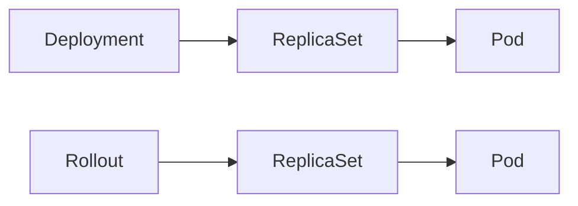
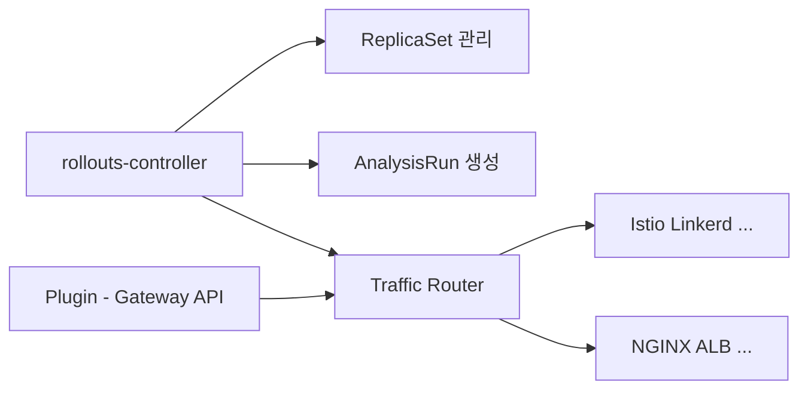
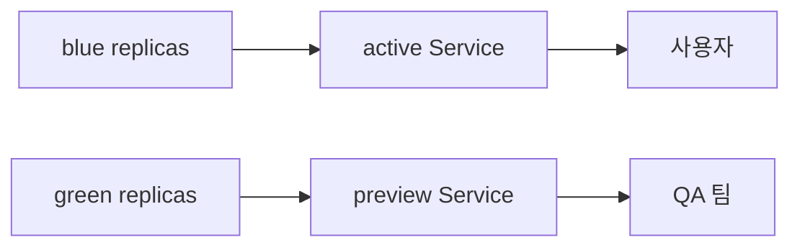

# Argo Rollouts

> **Deployment는 "Rolling Update 하나"만 지원한다**. Progressive Delivery —
> Canary, Blue-Green, Traffic Mirroring, 메트릭 기반 자동 판정 — 은
> Deployment를 **Rollout**이라는 CR로 대체해야 가능하다. Argo Rollouts는
> Deployment의 drop-in 대체재로 시작해 **Service Mesh·Ingress 트래픽 분할 +
> AnalysisTemplate 메트릭 게이트 + 자동 롤백**을 패키지로 제공한다.

- **현재 기준**: Argo Rollouts **v1.9.0** (2026-03-20 GA). Gateway API
  플러그인, managedRoutes, `status.selector` HPA 호환 수정
- **전제**: Kubernetes 1.29+, Service Mesh 또는 Ingress Controller(선택)
- **배포 전략 개념**은 [배포 전략](../concepts/deployment-strategies.md),
  **SLO 기반 자동 롤백 이론**은 `sre/`. 이 글은 **Rollouts 구현·운영**에 집중

---

## 1. 개념 — Deployment vs Rollout

### 1.1 왜 Deployment로는 안 되는가

Kubernetes 기본 `Deployment`는 **Rolling Update**만 제공한다.

| 필요한 기능 | Deployment | Rollout |
|---|---|---|
| Rolling Update | ✅ | ✅ |
| 트래픽 비율 점진 증가 (5→25→50→100%) | ❌ | ✅ |
| Pause 후 수동 승급 | ❌ | ✅ |
| 메트릭 기반 자동 중단·롤백 | ❌ | ✅ |
| Blue-Green (preview → cutover) | 수동 | ✅ |
| Traffic Mirroring (shadow) | ❌ | ✅ |
| Header 기반 A/B 테스트 | ❌ | ✅ |
| ReplicaSet 보존하여 즉시 롤백 | 제한적 | ✅ |

### 1.2 Rollout은 Deployment의 drop-in 대체



- `Rollout` CR 스펙의 90%가 `Deployment` 스펙과 동일 (template, selector,
  replicas, strategy 틀)
- 차이는 `strategy` 밑에 `canary` 또는 `blueGreen` 두 선택지

**전환 경로 2가지**

| 방식 | 요약 | 적합 |
|---|---|---|
| `spec.template` 직접 복사 | Deployment 삭제 후 Rollout 생성. selector 유지하면 기존 ReplicaSet 그대로 인수 | 소규모·단기 전환 |
| **`workloadRef`** (v1.1+) | `Rollout.spec.workloadRef`가 기존 Deployment를 참조. Deployment를 scale 0으로 만들지 않고 점진 전환, 실패 시 Deployment 복구 쉬움 | **대규모·점진 전환 권장** |

```yaml
# workloadRef 방식
apiVersion: argoproj.io/v1alpha1
kind: Rollout
metadata:
  name: webapp
spec:
  replicas: 10
  workloadRef:
    apiVersion: apps/v1
    kind: Deployment
    name: webapp
    scaleDown: onsuccess    # progressing/never/onsuccess
  strategy:
    canary:
      steps: [...]
```

`scaleDown: onsuccess`로 전환 성공 후에만 기존 Deployment를 0으로 내림 —
zero-downtime + 롤백 안전장치.

### 1.3 Rollout phase 상태 전이

운영자가 가장 자주 질문하는 "지금 왜 이 상태인가"의 지도.

| phase | 의미 | 다음 전이 |
|---|---|---|
| `Progressing` | 새 ReplicaSet 기동·step 진행 중 | Healthy / Degraded / Paused |
| `Paused` | step의 `pause` 또는 수동 pause | Progressing (promote) / Aborted |
| `Healthy` | 모든 step 완료, stable = canary | 새 revision 감지 시 Progressing |
| `Degraded` | `progressDeadlineSeconds` 초과 또는 AnalysisRun 실패 | `promote --full` / `undo` 후 복구 |
| `Completed` (짧게) | 단 한 revision 존재, 정상 | Healthy와 거의 동일 취급 |

전이 디버깅: `kubectl argo rollouts get rollout <name> --watch`로 실시간
확인. `status.conditions` + `status.message`가 이유를 상세히 기록.

### 1.4 아키텍처



- **rollouts-controller**: Rollout·Experiment·AnalysisRun reconcile
- **metrics-plugin**: Prometheus·Datadog·NewRelic·CloudWatch·Wavefront·
  Graphite·Kayenta·Web(HTTP)·Job 질의로 AnalysisRun 평가
- **trafficrouting-plugin**: 각 mesh·ingress 별 API 호출 (v1.9부터 플러그인
  아키텍처가 1st-class — Gateway API는 외부 플러그인)
- **argo-rollouts-kubectl plugin** + **Dashboard**(`kubectl argo rollouts
  dashboard`): 운영자 UI

---

## 2. 설치

```bash
# Helm 권장
helm repo add argo https://argoproj.github.io/argo-helm
helm install argo-rollouts argo/argo-rollouts \
  -n argo-rollouts --create-namespace \
  --set dashboard.enabled=true \
  --set controller.metrics.enabled=true \
  --set controller.metrics.serviceMonitor.enabled=true

# kubectl plugin (로컬 CLI)
curl -LO https://github.com/argoproj/argo-rollouts/releases/download/v1.9.0/kubectl-argo-rollouts-linux-amd64
chmod +x kubectl-argo-rollouts-linux-amd64
sudo mv kubectl-argo-rollouts-linux-amd64 /usr/local/bin/kubectl-argo-rollouts
```

**프로덕션 필수 설정**

| 항목 | 이유 |
|---|---|
| `controller.metrics.enabled: true` | Prometheus 스크레이프 |
| `controller.replicas: 2` + `leaderElection` | HA |
| NetworkPolicy: egress to API server, Prometheus, Mesh control plane | default-deny 전제 |
| `controller.resources.limits` | 대형 cluster에서 OOM 방지 |

---

## 3. Canary 전략

프로덕션에서 가장 많이 쓰이는 패턴.

### 3.1 기본 형태 — replica 비율 방식 (no traffic routing)

```yaml
apiVersion: argoproj.io/v1alpha1
kind: Rollout
metadata:
  name: webapp
spec:
  replicas: 10
  strategy:
    canary:
      steps:
        - setWeight: 20      # 새 pod 2개 (20%)
        - pause: {duration: 5m}
        - setWeight: 50
        - pause: {duration: 10m}
        - setWeight: 100
  selector:
    matchLabels: {app: webapp}
  template:
    metadata:
      labels: {app: webapp}
    spec:
      containers:
        - name: webapp
          image: ghcr.io/my-org/webapp:v2
```

**replica 기반 한계**: `setWeight: 20` = replica 2/10 = 20% 트래픽
**근사치**. 실제 트래픽은 Service의 iptables/IPVS 부하 분산에 달려 있어
정확하지 않다. 정밀 제어는 §5 **trafficRouting** 필요.

### 3.1.1 maxSurge / maxUnavailable

Canary rollout 중 ReplicaSet 크기 변화를 제어.

```yaml
spec:
  strategy:
    canary:
      maxSurge: "25%"          # 전체 replicas 대비 초과 허용 비율
      maxUnavailable: 0        # unavailable pod 허용 (default 0)
```

- `maxSurge`를 크게 (`50%`) 두면 전환이 빠르지만 node 리소스 스파이크
- `maxUnavailable: 0`은 가용성 보장 — `1`로 두면 전환이 부드럽지만
  availability 일시 감소
- 기존 Deployment 운영 감각 그대로 적용 가능

### 3.2 canary + stable Service

```yaml
spec:
  strategy:
    canary:
      canaryService: webapp-canary    # 새 pod만 선택
      stableService: webapp-stable    # 기존 pod만 선택
      trafficRouting:
        nginx:
          stableIngress: webapp-ingress
      steps:
        - setWeight: 10
        - pause: {duration: 10m}
        - analysis:
            templates:
              - templateName: success-rate
        - setWeight: 50
        - pause: {duration: 10m}
        - setWeight: 100
```

- **canaryService / stableService**는 Service 객체 2개. controller가 pod-template-hash
  selector를 자동 주입해 canary·stable만 선택하도록 만든다
- 이 Service 2개를 traffic router(Ingress·Mesh)가 weight 지정으로 분배

### 3.3 Canary Step 종류

| Step | 동작 |
|---|---|
| `setWeight: N` | 트래픽/replica N% 캐나리 |
| `pause: {duration: 5m}` | 5분 대기 후 다음 step |
| `pause: {}` | **무기한 pause** — `kubectl argo rollouts promote` 필요 |
| `analysis: {templates: [...]}` | AnalysisTemplate 실행, 실패 시 abort |
| `experiment: ...` | 별도 ReplicaSet을 spawn해 병렬 비교 |
| `setCanaryScale: {replicas: N}` | canary ReplicaSet 크기를 절대값 N으로 고정 (weight와 분리) |
| `setCanaryScale: {weight: N}` | canary 크기를 전체 replica의 N% 로 설정 (트래픽 weight와 다른 개념) |
| `setCanaryScale: {matchTrafficWeight: true}` | 트래픽 weight에 scale 동기화 (기본 동작) |
| `setHeaderRoute: ...` | 특정 헤더(cookie·user-agent·geo) 트래픽만 canary로 |
| `setMirrorRoute: ...` | 트래픽을 canary에 **mirror**(응답 버리고 shadow) |
| `plugin: {name: ...}` | 사용자 정의 step (v1.9+) |

### 3.4 `dynamicStableScale` — 비용 최적화

기본적으로 canary와 stable을 **둘 다 full replica** 로 유지한다(canary 50%
시 stable 10 + canary 5 = 15 pod). `dynamicStableScale: true`는 **canary
가 늘면 stable을 비례 축소**.

```yaml
spec:
  strategy:
    canary:
      dynamicStableScale: true
```

**주의**: dynamicStableScale 켜면 HPA와 상호작용이 복잡해진다. 최근 버전에서
`status.selector`가 stable 기준으로 좁혀지며 HPA 계산이 안정화되고 있으나,
**HPA 병용 시 dynamicStableScale 미사용이 기본 권장**. 반드시 써야 한다면
staging에서 HPA 스케일 스파이크를 먼저 관찰할 것.

---

## 4. Blue-Green 전략

새 버전을 **전량 배포 후 한 번에 전환**. 검증 시간이 필요한 stateful·
long-startup 앱에 적합.

```yaml
apiVersion: argoproj.io/v1alpha1
kind: Rollout
metadata:
  name: webapp
spec:
  replicas: 10
  strategy:
    blueGreen:
      activeService: webapp-active      # 현재 prod 트래픽
      previewService: webapp-preview    # 새 버전 검증용
      autoPromotionEnabled: false       # 수동 승급
      autoPromotionSeconds: 3600        # 또는 N초 후 자동
      scaleDownDelaySeconds: 300        # 전환 후 blue 유지 (롤백 안전장치)
      prePromotionAnalysis:
        templates:
          - templateName: smoke-test
      postPromotionAnalysis:
        templates:
          - templateName: success-rate
```

### 4.1 동작 흐름



1. 새 ReplicaSet(green)이 full replica로 기동
2. `previewService`가 green을 선택 → QA·smoke test
3. `prePromotionAnalysis` 성공 → 자동/수동 승급
4. `activeService`가 green을 가리키도록 selector 변경 (즉시 cutover)
5. `postPromotionAnalysis` 성공 → `scaleDownDelaySeconds` 후 blue 축소
6. 실패 시 `activeService`는 아직 blue를 가리키므로 **zero-downtime 롤백**

### 4.2 Blue-Green 주의

- **리소스 2배** — blue·green이 동시에 full replica. 클러스터 용량 확인
- **`scaleDownDelaySeconds`** 너무 짧게(`10s`) 두면 롤백 시 blue가 이미 사라짐
- **Stateful 앱** — DB migration이 blue↔green 호환 안 되면 블루그린 의미 없음
- **세션 쿠키** — cutover 후 기존 세션이 green에 없으면 사용자 재로그인 필요

---

## 5. Traffic Routing — 정밀 제어

replica 비율 방식은 **근사치**. 정밀 제어에는 service mesh 또는 ingress
controller의 **weight API**를 Rollouts가 호출한다.

### 5.1 지원 백엔드

| 백엔드 | 정밀도 | 비고 |
|---|---|---|
| **Istio** | 1% 단위 | VirtualService.http[].route[].weight — 가장 성숙 |
| **Linkerd** | SMI TrafficSplit | linkerd-viz 메트릭과 조합 쉬움 |
| **AWS ALB** | 1% 단위 | TargetGroupBinding + ALB Controller |
| **NGINX Ingress** | 1% 단위 | canary annotation |
| **SMI** (generic) | — | **CNCF가 spec archived** → Gateway API plugin 권장 |
| **App Mesh / Ambassador / Traefik** | 각 API | — |
| **Gateway API plugin** (v1.9+) | 표준 `HTTPRoute` | 2026 권장 경로 |
| **Apisix · Contour · Plugin 시스템** | 플러그인 | 커뮤니티 |

### 5.2 Istio 예시

```yaml
# Rollout
spec:
  strategy:
    canary:
      canaryService: webapp-canary
      stableService: webapp-stable
      trafficRouting:
        istio:
          virtualService:
            name: webapp-vsvc
            routes: [primary]
      steps:
        - setWeight: 5
        - pause: {duration: 2m}
        - setWeight: 25
        - pause: {duration: 5m}
        - setWeight: 50
        - setWeight: 100
---
apiVersion: networking.istio.io/v1
kind: VirtualService
metadata:
  name: webapp-vsvc
spec:
  hosts: [webapp.example.com]
  gateways: [public-gw]
  http:
    - name: primary
      route:
        - destination: {host: webapp-stable}
          weight: 100                  # Rollouts가 동적으로 조정
        - destination: {host: webapp-canary}
          weight: 0
```

### 5.3 Gateway API (v1.9 권장 경로)

CNCF 공식 Ingress/L7 표준. Rollouts v1.9+의 플러그인으로 지원.

```bash
# 플러그인 설치
helm install argo-rollouts argo/argo-rollouts \
  --set controller.trafficRouterPlugins[0].name=gatewayAPI \
  --set controller.trafficRouterPlugins[0].location=https://github.com/argoproj-labs/rollouts-plugin-trafficrouter-gatewayapi/releases/...
```

```yaml
spec:
  strategy:
    canary:
      canaryService: webapp-canary
      stableService: webapp-stable
      trafficRouting:
        plugins:
          argoproj-labs/gatewayAPI:
            httpRoute: webapp-route
            namespace: apps
```

Mesh 종속성을 피하면서 canary 가능 — 2026 권장 추세.

### 5.4 Header·Mirror Route (v1.8+)

특정 헤더 트래픽만 canary로 — A/B 테스트·내부 사용자 dogfooding.

```yaml
- setHeaderRoute:
    name: internal-only
    match:
      - headerName: X-User-Role
        headerValue:
          exact: "employee"
- setMirrorRoute:                 # shadow
    name: shadow-prod
    percentage: 100
    match:
      - method: {exact: POST}
```

**Mirror**: 응답은 버리므로 side effect 있는 POST에 주의. 읽기 쿼리
부하 테스트·regression 검증에 이상적.

### 5.5 `managedRoutes` (v1.9)

`setHeaderRoute` · `setMirrorRoute`가 만드는 route의 우선순위를 명시적
관리. VirtualService에 남은 stale route를 Rollouts가 정리.

```yaml
trafficRouting:
  managedRoutes:
    - name: internal-only
    - name: shadow-prod
```

**우선순위 = 선언 순서**. 순서가 틀리면 의도치 않은 route가 먼저 매칭.

---

## 6. AnalysisTemplate — 메트릭 기반 게이트

**Progressive Delivery의 핵심**. "실패하는 배포를 자동으로 abort"가 Rollouts
의 존재 이유.

### 6.1 기본 구조

```yaml
apiVersion: argoproj.io/v1alpha1
kind: AnalysisTemplate
metadata:
  name: success-rate
  namespace: apps
spec:
  args:
    - name: service
  metrics:
    - name: success-rate
      interval: 1m            # 쿼리 주기
      count: 5                # 최대 5회
      successCondition: result[0] >= 0.99
      failureLimit: 2         # 실패 2회면 AnalysisRun 실패
      provider:
        prometheus:
          address: http://prometheus.monitoring:9090
          query: |
            sum(rate(http_requests_total{service="{{args.service}}",code!~"5.."}[2m]))
            /
            sum(rate(http_requests_total{service="{{args.service}}"}[2m]))
```

### 6.2 Rollout에서 참조

```yaml
spec:
  strategy:
    canary:
      steps:
        - setWeight: 25
        - pause: {duration: 5m}
        - analysis:
            templates:
              - templateName: success-rate
              - templateName: latency-p99
            args:
              - name: service
                value: webapp-canary.apps.svc.cluster.local
      # background analysis — 전체 rollout 동안 병렬 실행
      analysis:
        templates:
          - templateName: error-rate
        startingStep: 2    # step 2부터 시작
```

### 6.3 분석 유형

| 유형 | 설명 | 예시 |
|---|---|---|
| **Inline analysis** (step) | 해당 step에서만 실행, 실패 시 즉시 abort | 특정 weight 도달 후 검증 |
| **Background analysis** | 전체 rollout 동안 병렬, 실패 시 abort | error rate 지속 감시 |
| **pre/postPromotionAnalysis** (Blue-Green) | 승급 전/후 | smoke test, warm-up |

### 6.4 메트릭 Provider

| Provider | 용도 |
|---|---|
| `prometheus` | 오픈소스 표준, PromQL |
| `datadog` | DD 쿼리 언어 |
| `newRelic` | NRQL |
| `cloudWatch` | AWS |
| `wavefront`, `graphite` | 각 SaaS |
| `kayenta` | Spinnaker의 자동 canary 분석 엔진 |
| `web` | HTTP GET 응답으로 판정 (JSON path) |
| `job` | Kubernetes Job 실행, exit code 0 = 성공 |

### 6.5 쿼리 설계 원칙

```promql
# (A) 절대값 임계 — 안좋은 설계
# sum(rate(errors[5m])) > 10

# (B) 비율 — 권장
sum(rate(errors[5m])) / sum(rate(requests[5m])) < 0.01

# (C) 비교 (canary vs stable) — 권장
(canary_error_rate) - (stable_error_rate) < 0.005
```

- **절대값은 트래픽 변화에 약하다** — 비율 또는 canary/stable 비교 사용
- **쿼리 범위 `[5m]` 이상** — 너무 짧으면 노이즈로 실패
- **failureLimit > 1** — 일시 spike 허용, 연속 실패만 abort

### 6.6 실패·Inconclusive·Error 제어

AnalysisRun은 **3가지 결과**가 있다.

| 결과 | 의미 | 설정 |
|---|---|---|
| **Successful** | 모든 metric이 `successCondition` 만족 | 자동 다음 step |
| **Failed** | `failureLimit` 초과 — 즉시 abort | `failureLimit` (default 0) |
| **Inconclusive** | 애매 — abort도 promote도 안 함 | `inconclusiveLimit` |
| **Error** | metric provider 자체 오류 (Prometheus 장애 등) | `consecutiveErrorLimit` (default 4) |

```yaml
spec:
  metrics:
    - name: success-rate
      successCondition: result[0] >= 0.99
      failureCondition: result[0] < 0.95
      failureLimit: 3              # 3회 실패 허용
      inconclusiveLimit: 5         # 5회 inconclusive 허용
      consecutiveErrorLimit: 4     # Prometheus 4회 연속 에러면 AnalysisRun Error
```

**프로덕션 원칙**

- `consecutiveErrorLimit`을 0으로 두지 말 것 — Prometheus 재시작으로 배포
  abort되는 사고. 기본 4 유지
- **Inconclusive** 는 manual review를 유도하는 설계 — CI 파이프라인은
  Inconclusive 시 Slack 알림 + `kubectl argo rollouts promote` 수동 승인

### 6.7 `dryRun` — 학습 모드

새 metric을 도입할 때 실제 abort 없이 결과만 기록.

```yaml
metrics:
  - name: new-slo
    dryRun:
      - metricName: new-slo
    successCondition: ...
```

로그·이벤트에 결과가 남지만 rollout은 abort하지 않는다. 임계값 튜닝에
필수.

### 6.8 Kayenta·SLO 연동

고도화하면 [sre/](../../sre/)의 **SLO Burn Rate**를 `analysis`로 사용
가능. Multi-window(5m·1h burn rate) 조합으로 "배포 때문에 error budget
소진 속도가 N배 빨라지면 abort" — 2026 글로벌 표준.

---

## 7. Experiment — 병렬 비교 실험

Canary가 "점진 전환"이라면 Experiment는 **별도 ReplicaSet을 임시로 띄워
비교**. release 전 실험용.

```yaml
apiVersion: argoproj.io/v1alpha1
kind: Experiment
metadata:
  name: ml-model-v2-compare
spec:
  duration: 1h
  templates:
    - name: baseline
      replicas: 1
      selector: {matchLabels: {app: ml, variant: baseline}}
      template: ... # v1 이미지
    - name: candidate
      replicas: 1
      selector: {matchLabels: {app: ml, variant: candidate}}
      template: ... # v2 이미지
  analyses:
    - name: accuracy-compare
      templateName: ml-accuracy
```

Canary step 안에서도 사용 가능:

```yaml
steps:
  - experiment:
      duration: 30m
      templates:
        - name: baseline
        - name: canary
      analyses:
        - name: a11y
          templateName: success-rate
```

---

## 8. 롤백·Abort·Promote

### 8.1 명령어

```bash
# 일시 정지 (무기한 pause와 동일 효과)
kubectl argo rollouts pause webapp

# 재개 / 다음 step으로
kubectl argo rollouts promote webapp

# 전체 즉시 승급 (step 건너뛰기) — 주의
kubectl argo rollouts promote webapp --full

# Abort — canary 제거, stable 유지
kubectl argo rollouts abort webapp

# 이전 ReplicaSet으로 완전 롤백
kubectl argo rollouts undo webapp
kubectl argo rollouts undo webapp --to-revision=3

# 상태
kubectl argo rollouts get rollout webapp --watch
```

### 8.2 자동 abort 조건

| 조건 | 동작 |
|---|---|
| AnalysisRun `Failed` / `Error` | 즉시 abort |
| `progressDeadlineSeconds` 초과 | `Degraded` 상태, abort |
| 수동 `kubectl argo rollouts abort` | 즉시 abort |

### 8.3 abortScaleDownDelaySeconds

Abort 시 canary ReplicaSet을 **바로 삭제하지 않고** 유지. 문제 원인 조사
후 빠른 재시도 가능.

```yaml
spec:
  strategy:
    canary:
      scaleDownDelaySeconds: 30        # 정상 승급 후 stable 축소 지연
      abortScaleDownDelaySeconds: 600  # abort 후 canary 유지 — 디버깅
```

---

## 9. ArgoCD 통합

`argoproj.io/Rollout`은 Deployment의 대체재지만, ArgoCD는 기본적으로
"Health=Progressing"을 rolling update로만 해석한다. **Argo Rollouts
Health Check Lua**를 ArgoCD에 등록하면 Rollout의 실제 상태(Paused·
Healthy·Degraded)가 ArgoCD UI에 정확히 표시된다.

```yaml
# argocd-cm (ConfigMap)
data:
  resource.customizations.health.argoproj.io_Rollout: |
    hs = {}
    if obj.status ~= nil and obj.status.phase ~= nil then
      if obj.status.phase == "Healthy" then hs.status = "Healthy"
      elseif obj.status.phase == "Degraded" then hs.status = "Degraded"
      elseif obj.status.phase == "Paused" then hs.status = "Suspended"
      else hs.status = "Progressing" end
    else hs.status = "Progressing" end
    return hs
```

ArgoCD에는 **오래전부터(2.0+) 이 health check이 내장**되어 있어 일반 환경은
별도 설정 불필요. ArgoCD UI에서 Rollout sync wave·promote 버튼도 제공.

---

## 10. 관측·알림

### 10.1 핵심 메트릭 (rollouts-controller)

| 메트릭 | 의미 |
|---|---|
| `rollout_info{phase=...}` | 리소스 메타 + 현재 phase 라벨 — alert·SLO의 1차 소스 |
| `analysis_run_phase` | AnalysisRun 결과 |
| `rollout_events_total` | 이벤트 카운터 |
| `controller_clientset_k8s_request_total` | API 호출량 |

**Prometheus 알람 예시**

```yaml
- alert: RolloutStuckPaused
  expr: rollout_info{phase="Paused"} == 1
  for: 1h
  annotations:
    summary: "Rollout {{$labels.namespace}}/{{$labels.name}} paused > 1h"

- alert: RolloutDegraded
  expr: rollout_info{phase="Degraded"} == 1
  for: 10m
  labels: {severity: critical}
```

### 10.2 Notification (공식 notifications-engine)

```yaml
apiVersion: v1
kind: ConfigMap
metadata:
  name: argo-rollouts-notification-configmap
  namespace: argo-rollouts
data:
  service.slack: |
    token: $slack-token
  template.app-rolled-back: |
    message: "Rollout {{.rollout.metadata.name}} ROLLED BACK"
  trigger.on-rollout-aborted: |
    - when: rollout.status.phase == 'Degraded'
      send: [app-rolled-back]
```

### 10.3 Dashboard

`kubectl argo rollouts dashboard` → `localhost:3100`. 프로덕션은 Ingress
+ SSO 권장.

---

## 11. 안티패턴

| 안티패턴 | 왜 문제 | 교정 |
|---|---|---|
| trafficRouting 없이 `setWeight: 5` | 실제 트래픽 ≠ 설정 weight (replica 수에 종속) | Istio·ALB·Gateway API 플러그인 |
| AnalysisTemplate 없는 Canary step | 그냥 대기 후 승급 — 롤백 판단 자동화 없음 | 최소 success-rate + latency 2개 |
| `failureLimit: 1` + 변동성 큰 메트릭 | 일시 spike로 abort, 배포 실패율↑ | `failureLimit: 3`, 쿼리 window 길게 |
| `progressDeadlineSeconds` 기본 600s 방치 | 대형 앱·canary 10 step은 1h+ | 예상 시간 + 여유로 1800s~3600s |
| Blue-Green `scaleDownDelaySeconds: 0` | 전환 직후 이슈 발생해도 blue 이미 없음 | 최소 300s (5분) |
| Canary `autoPromotionEnabled: true` + analysis 없음 | 자동 승급에 메트릭 게이트가 없음 = 의미 없는 canary | analysis 필수 |
| Mirror Route를 POST에 적용 (side effect) | DB 중복 write, 결제 중복 | GET/read-only에만 Mirror |
| AnalysisTemplate Prometheus 절대값 | 트래픽 변화에 취약 | 비율 또는 canary vs stable 비교 |
| `setHeaderRoute` 후 `managedRoutes` 미설정 | VirtualService에 stale route 쌓임 | v1.9 managedRoutes 명시 |
| `dynamicStableScale: true` + HPA | 계산이 꼬여 pod count 진동 | 동시 사용 금지 |
| Rollout과 Deployment 동시 존재 (같은 selector) | 두 controller가 같은 ReplicaSet 소유권 경쟁 | Deployment 완전 삭제 후 Rollout만 |
| ReplicaSet `revisionHistoryLimit: 0` | 롤백 불가 (바로 이전 ReplicaSet 삭제) | 최소 5 |
| canary analysis 쿼리가 canary·stable 구분 안 함 | 전체 메트릭에 묻혀 문제 감지 실패 | Service·pod label로 분리 쿼리 |
| Rollout 이미 있는데 `kubectl rollout restart` | Deployment 명령은 Rollout에 무효 | `kubectl argo rollouts restart` |
| Kayenta·복잡한 analysis를 canary 첫 step에 | 초기 5% 트래픽으로 의미 있는 통계 불가 | 트래픽 25~50% 이후에 |
| Experiment duration 없음 | 영원히 남아 리소스 소모 | `spec.duration` 명시 |

---

## 12. 도입 로드맵

1. **Deployment → Rollout 전환**: 기존 manifest를 `kind: Rollout`으로,
   `strategy: canary: {steps: [...]}` 추가
2. **수동 promote 경험**: `pause: {}` 무기한 → `kubectl argo rollouts
   promote`로 체감
3. **AnalysisTemplate**: success-rate + latency-p99 PromQL 2개부터
4. **trafficRouting 도입**: Gateway API plugin 또는 NGINX/Istio
5. **Background analysis**: 전체 rollout 동안 error rate 감시
6. **Notification**: Slack Webhook 연결 (abort 알림)
7. **Blue-Green**: stateful·cold-start 긴 앱 대상
8. **Experiment**: ML 모델·알고리즘 A/B 테스트
9. **SLO Burn Rate analysis**: multi-window 쿼리로 error budget 보호
10. **ArgoCD 통합**: Rollout Health 자동 반영, sync wave

---

## 13. 관련 문서

- [Flagger](./flagger.md) — Flux 진영 대안
- [Feature Flag](./feature-flag.md) — 배포와 릴리즈 분리
- [트래픽 분할](./traffic-splitting.md) — Istio·Gateway API·Envoy 상세
- [배포 전략](../concepts/deployment-strategies.md) — Blue/Green·Canary 이론
- [ArgoCD Sync](../argocd/argocd-sync.md) — Rollout Health Lua 통합

---

## 참고 자료

- [Argo Rollouts 공식 문서](https://argo-rollouts.readthedocs.io/en/stable/) — 확인: 2026-04-25
- [Rollout Spec Reference](https://argo-rollouts.readthedocs.io/en/stable/features/specification/) — 확인: 2026-04-25
- [Canary 전략](https://argo-rollouts.readthedocs.io/en/stable/features/canary/) — 확인: 2026-04-25
- [Blue-Green 전략](https://argo-rollouts.readthedocs.io/en/stable/features/bluegreen/) — 확인: 2026-04-25
- [Traffic Management](https://argo-rollouts.readthedocs.io/en/stable/features/traffic-management/) — 확인: 2026-04-25
- [Analysis · AnalysisTemplate](https://argo-rollouts.readthedocs.io/en/stable/features/analysis/) — 확인: 2026-04-25
- [Experiment](https://argo-rollouts.readthedocs.io/en/stable/features/experiment/) — 확인: 2026-04-25
- [v1.9.0 GitHub Releases](https://github.com/argoproj/argo-rollouts/releases) — 확인: 2026-04-25
- [Gateway API plugin](https://github.com/argoproj-labs/rollouts-plugin-trafficrouter-gatewayapi) — 확인: 2026-04-25
- [Notifications](https://argo-rollouts.readthedocs.io/en/stable/generated/notification-services/overview/) — 확인: 2026-04-25
