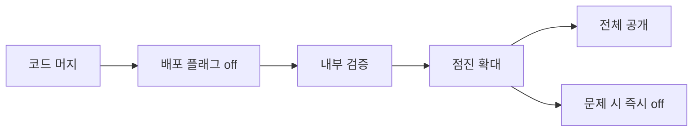
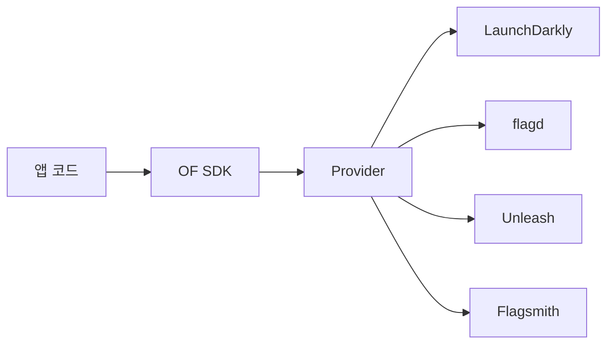
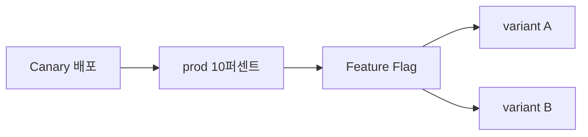

# Feature Flag

> **Feature Flag는 "배포(deploy)와 릴리즈(release)를 분리"하는 기법**이다.
> 코드를 프로덕션에 배포하되, 실제 기능 노출은 런타임 플래그로 제어한다.
> Canary·Blue-Green이 **인프라 레벨의 Progressive Delivery**라면, Feature
> Flag는 **애플리케이션 레벨의 Progressive Delivery** — 사용자·세그먼트·
> 비율별로 기능을 점진 개방, 문제 시 즉시 kill switch.

- **표준**: [OpenFeature](https://openfeature.dev/) (CNCF Incubating, 2023-12)
  — 벤더 중립 SDK·Provider API
- **참조 구현**: [flagd](https://flagd.dev/) (CNCF, OpenFeature의 in-cluster
  flag daemon)
- **상용·오픈소스 제품**: LaunchDarkly, Flagsmith, Unleash, Split,
  ConfigCat, Harness, DevCycle, PostHog, GrowthBook, FeatBit, Flipt
- **배포 전략과의 관계**: [배포 전략](../concepts/deployment-strategies.md),
  인프라 Canary는 [Argo Rollouts](./argo-rollouts.md)/[Flagger](./flagger.md)
- **SLO 관점 운영**(언제 kill switch를 당길 것인가)은 `sre/` 참조만, 도구
  설명은 여기서만

---

## 1. 개념

### 1.1 왜 Feature Flag인가

전통적 배포 모델은 **코드 머지 → 빌드 → 배포 → 기능 즉시 노출**로 이어져
"배포 = 릴리즈"가 붙어 있다. 배포 자체가 사용자 노출 시점이라 위험하다.

Feature Flag를 도입하면 **배포와 릴리즈가 분리**된다.



**핵심 이점 4가지**

| 이점 | 실례 |
|---|---|
| **Dark Launch** | 기능이 코드에는 있지만 off. 성능만 프로덕션에서 측정 |
| **Targeted Rollout** | 특정 조직·지역·계정 등급에 먼저 공개 |
| **Kill Switch** | 장애 시 재배포 없이 10초 내 차단 |
| **A/B Testing** | 두 구현을 동시 운영, 비즈니스 메트릭 비교 |

### 1.2 Flag의 "수명" 4단계

| 단계 | 목적 | 수명 |
|---|---|---|
| **Release flag** | 점진 배포 | 수일~수주 → 제거 |
| **Experiment flag** | A/B·실험 | 수주 → 제거 |
| **Ops flag (kill switch)** | 운영 토글 | 영구 |
| **Permission flag (entitlement)** | 구독 등급별 기능 | 영구 |

**실무 원칙**: release/experiment flag는 반드시 **removal PR 예약**.
남으면 "flag debt" — 조건 분기가 쌓여 코드가 더러워진다.

### 1.3 Feature Flag vs Config

| | Feature Flag | Config |
|---|---|---|
| 변경 빈도 | 높음 (시간·분 단위) | 낮음 (배포 단위) |
| 변경 주체 | 비개발자 포함 | 개발자·운영자 |
| 대상 | 사용자 세그먼트 | 환경 |
| 평가 | 매 요청마다 | 시작 시 로드 |
| 예 | "검색 v2 노출 비율 5%" | "DB host" |

---

## 2. OpenFeature — 벤더 중립 표준

### 2.1 왜 표준이 필요한가

LaunchDarkly·Split·Unleash·Flagsmith 각자 **고유 SDK**가 있어 이전이
어려웠다. OpenFeature는 **SDK 표준 + Provider 플러그인 모델**로 이 문제를
해결.



### 2.2 구성 요소

| 계층 | 책임 |
|---|---|
| **Evaluation API (SDK)** | `client.getBooleanValue("flag", default)` 등 통일된 호출 |
| **Provider** | 벤더별 통신·평가 로직 (HTTP, gRPC, SDK wrap) |
| **Evaluation Context** | 사용자·요청 메타데이터 (`userId`, `plan`, `country`...) |
| **Hook** | before/after/error/finally 라이프사이클 주입 (로깅·텔레메트리·컨텍스트 보강) |
| **Event** | provider ready / flag changed / error 콜백 |

### 2.3 SDK 지원

Java, JS/TS (Node·Browser), Go, Python, .NET, Ruby, PHP, Swift, Kotlin,
Rust, C++. **가이드라인 있는 공식 SDK** 상태.

### 2.4 Provider 에코시스템

| Provider | 소스 |
|---|---|
| **flagd** | CNCF 레퍼런스 (in-cluster, gRPC) |
| LaunchDarkly | 공식 |
| Flagsmith | 공식 |
| Unleash | 공식 |
| Split | 공식 |
| ConfigCat · DevCycle · Harness · PostHog · Flipt · GO Feature Flag · GrowthBook · FeatBit | 공식 또는 커뮤니티 |

**실무 의미**: 벤더 lock-in을 피하려면 **애플리케이션 코드는 OpenFeature
SDK만** 호출. Provider 교체는 provider 인스턴스 1줄 교체로 끝.

### 2.5 코드 예시 (Go)

```go
import (
    "context"

    "github.com/open-feature/go-sdk/openfeature"
    flagd "github.com/open-feature/go-sdk-contrib/providers/flagd/pkg"
)

func main() {
    openfeature.SetProvider(flagd.NewProvider())
    client := openfeature.NewClient("app")

    evalCtx := openfeature.NewEvaluationContext(
        "user-42",                // targetingKey
        map[string]any{           // attributes
            "country": "KR",
            "plan":    "enterprise",
        },
    )

    show, _ := client.BooleanValue(context.TODO(), "new-search", false, evalCtx)
    if show {
        // 새 기능
    }
}
```

`flagd.NewProvider()`를 `launchdarkly.NewProvider(key)` 또는
`unleash.NewProvider(url)`로 바꿔도 나머지 코드는 동일.

---

## 3. flagd — CNCF 레퍼런스 구현

### 3.1 특징

- **OpenFeature와 같은 SIG가 관리하는 "reference" 구현**
- **in-process** 또는 **sidecar·standalone** 모드 선택
- gRPC·HTTP로 평가 요청 수신
- **JSON schema 기반 flag 정의** — Git으로 관리 가능
- Kubernetes Operator (`openfeature-operator`)로 `FeatureFlag` CRD 지원

### 3.2 Flag 정의 예 (JSON)

```json
{
  "flags": {
    "new-search": {
      "state": "ENABLED",
      "variants": {
        "on": true,
        "off": false
      },
      "defaultVariant": "off",
      "targeting": {
        "fractional": [
          ["on", 10],
          ["off", 90]
        ]
      }
    },
    "max-items": {
      "state": "ENABLED",
      "variants": {
        "default": 20,
        "vip": 100
      },
      "defaultVariant": "default",
      "targeting": {
        "if": [
          {"==": [{"var": "plan"}, "enterprise"]},
          "vip",
          "default"
        ]
      }
    }
  }
}
```

- **JsonLogic**으로 targeting 룰 표현 — 범용 표현식
- **Fractional**: 안정적인 % 기반 bucketing (userId 해시 → 같은 사용자가 같은
  variant)
- `state: DISABLED`는 즉시 kill switch

### 3.3 FeatureFlag CRD (openfeature-operator)

```yaml
apiVersion: core.openfeature.dev/v1beta1
kind: FeatureFlag
metadata:
  name: demo
  namespace: apps
spec:
  flagSpec:
    flags:
      new-search:
        state: ENABLED
        variants: {on: true, off: false}
        defaultVariant: off
        targeting:
          fractional: [["on", 10], ["off", 90]]
---
# Sidecar를 애플리케이션 Pod에 주입
apiVersion: core.openfeature.dev/v1beta1
kind: FeatureFlagSource
metadata:
  name: demo
spec:
  sources:
    - source: apps/demo
      provider: kubernetes
```

Deployment에 **두 annotation 모두** 있어야 operator가 **flagd sidecar 자동
주입**. 애플리케이션은 `localhost:8013`으로 gRPC 호출.

```yaml
# Deployment 주입 annotation
metadata:
  annotations:
    openfeature.dev/enabled: "true"
    openfeature.dev/featureflagsource: "apps/demo"  # <ns>/<FeatureFlagSource name>
```

`FeatureFlagSource.spec.sources[].provider`의 유효값: `kubernetes` (기본 —
FeatureFlag CRD watch), `filepath`, `http`, `grpc`, `flagd-proxy`.
`source` 값은 `<namespace>/<FeatureFlag name>` 형식.

### 3.4 언제 flagd를 쓰는가

- **자체 호스팅** — 외부 SaaS 의존 불가
- **저지연** — sidecar면 네트워크 RTT 0
- **Git-native** — FeatureFlag를 Git으로 관리, ArgoCD/Flux로 배포
- **단점**: UI 없음 (Flagsmith·Unleash 대비). 비개발자 플래그 조작 제한

---

## 4. 상용·오픈소스 제품 비교

| 제품 | 라이선스 | Self-host | 특징 |
|---|---|---|---|
| **LaunchDarkly** | 상용 | ❌ (SaaS) | 시장 표준, enterprise-grade targeting, 실험 플랫폼 통합 |
| **Flagsmith** | OSS (BSD-3) + SaaS | ✅ | OpenFeature 공동 창시, UI 완성도 |
| **Unleash** | OSS (Apache 2) + Enterprise | ✅ | strategies·constraints DSL, Gitops 친화 |
| **Split** | 상용 | ❌ | Harness 인수(2024), 실험·통계 중심 |
| **ConfigCat** | 상용 | ❌ | SMB 가격 경쟁력 |
| **Harness Feature Flags** | 상용 | ❌ | Harness 파이프라인 통합 |
| **PostHog** | OSS + SaaS | ✅ | 제품 분석 통합 |
| **DevCycle** | 상용 | ❌ | edge CDN 기반 저지연 |
| **GrowthBook** | OSS (MIT) + SaaS | ✅ | 실험·통계 강점 |
| **Flipt** | OSS (MIT) | ✅ | Go 구현, 경량 |
| **FeatBit** | OSS (MIT) + SaaS | ✅ | 오픈 대시보드 |

### 4.1 선택 기준

| 기준 | 추천 |
|---|---|
| 최단 도입, 규모 상관 없음 | LaunchDarkly / Flagsmith SaaS |
| 온프레·에어갭 | Unleash / Flagsmith / flagd |
| OpenFeature 완벽 호환 필수 | flagd / Flagsmith / Unleash |
| 비개발자 UI 중심 | LaunchDarkly / Flagsmith |
| Git-native, 도구 최소 | flagd + openfeature-operator |
| 실험·통계 중심 | Split / GrowthBook / LaunchDarkly |
| 예산 최소 | Flipt / flagd (OSS) |

**CLAUDE.md 경계**: 구체 벤더의 "어느 기능이 좋다"는 카탈로그는 이 글
범위가 아니다. OpenFeature 표준을 따르면 제품 변경 비용이 최소화된다는
원칙을 기억할 것.

---

## 5. Targeting — 누구에게 flag를 켤 것인가

### 5.1 Targeting 전략

| 전략 | 설명 | 예 |
|---|---|---|
| **Boolean toggle** | 전체 on/off | kill switch |
| **User targeting** | 특정 userId | 내부 직원 테스트 |
| **Segment** | 속성 기반 (plan, country, role) | enterprise 플랜만 |
| **Percentage rollout** | 사용자 ID 해시 → 비율 | 5%씩 확대 |
| **Multivariate** | 2개 이상 변종 | A/B/C 실험 |
| **Scheduled** | 시간 기반 | 특정 날짜에 open |
| **Prerequisite** | 다른 flag가 true일 때만 | 기본 기능 활성 후 고급 기능 |

### 5.2 안정적 Bucketing

percentage rollout의 핵심: **같은 사용자가 매 요청마다 같은 variant**.

```
hash(userId + flagKey) % 100 < rolloutPercentage ? "on" : "off"
```

- `userId`만 쓰면 flag 바뀔 때마다 같은 사용자가 같은 bucket에 몰림
  → `flagKey`를 함께 해싱
- **stateless** — 각 인스턴스가 독립 계산 가능 (중앙 상태 불필요)

### 5.3 Evaluation Context 설계

```go
evalCtx := openfeature.NewEvaluationContext("user-42",
    map[string]any{
        "country":      "KR",
        "plan":         "enterprise",
        "app_version":  "1.4.2",
        "experiment":   "search-v2",
        "region":       "ap-northeast-2",
        "shop_segment": "premium",
    })
```

- **targetingKey** (= userId)는 반드시 stable — email·account id 권장
- **민감정보 금지** — Provider에 따라 외부 SaaS로 전송될 수 있음 (GDPR·
  개인정보). in-process flagd는 로컬 평가라 전송되지 않지만 cloud provider
  (LaunchDarkly·Split 등)는 context를 서버로 보낸다
- 세그먼트 기준은 **비즈니스 언어로 정의** ("plan", "country") — "user_flag_7"
  같은 내부 ID는 쓰지 말 것

---

## 6. Progressive Delivery와의 통합

### 6.1 두 축의 결합



두 축은 **직교(orthogonal) 제어**다. 인프라(Canary) 100% 배포 이후에도 Flag로
기능을 점진 확대하는 흐름도 표준 — 실제로 많은 팀이 "코드는 Canary 없이
전체 배포 + 기능은 Flag로 점진 확대"를 채택한다.

- **Canary**: 새 버전 코드를 10% 트래픽에 노출
- **Feature Flag**: 그 안에서 **특정 사용자·비율에만** 새 기능 분기

Canary 메트릭이 악화되면 Rollouts/Flagger가 **코드 전체 롤백**, Flag만
문제면 flag off로 **코드는 유지하며 기능만 차단**.

### 6.2 SLO 기반 자동 kill switch

`sre/`의 SLO Burn Rate가 임계 초과하면 flag를 자동 off. LaunchDarkly·
Flagsmith·Unleash 모두 **API**가 있어 Prometheus alertmanager → webhook →
flag off 파이프라인 구성 가능.

```yaml
# alertmanager receiver
receivers:
  - name: flag-kill
    webhook_configs:
      - url: https://ld.example.com/api/flags/new-search/off
        send_resolved: false
        http_config:
          authorization:
            type: Bearer
            credentials_file: /etc/secrets/ld-token
```

**의사 결정 원칙**: "코드 배포 롤백 vs flag off"는 **flag off가 항상 먼저**.
flag off는 초 단위, 배포 롤백은 분 단위.

**자동 kill switch의 안전 장치 3가지**

1. **fast-burn 알람에만 연결** — 1h 기준 burn rate 14.4× 같은 고빈도
   소진에만. low-burn은 사람의 판단
2. **flag별 receiver 분리** — alertmanager가 임의 flag를 off하지 않도록
   `webhook_configs`에서 URL 파라미터화 금지
3. **auto-off 후 반드시 Slack PagerDuty 알림** — human-in-the-loop. flag가
   자동 off된 상태로 방치되면 "왜 기능이 안 되지" 추적이 어려워진다

**Flag propagation 지연**: provider마다 다르다.

| 모델 | 지연 | 예 |
|---|---|---|
| Streaming (SSE/WebSocket) | 수 초 | LaunchDarkly streaming, Flagsmith realtime |
| Watch (Kubernetes) | 1~2초 | flagd + FeatureFlag CRD |
| Polling (HTTP) | polling interval (30s~5m) | 대부분 기본 모드 |
| Client-side SDK (mobile/web) | refetch interval + 재시작 | 앱 업데이트 주기 의존 |

**Mobile 앱의 kill switch는 수 분~수 시간 지연**이 현실. 필수면 백엔드
API에서 차단을 병행.

---

## 7. GitOps와 Feature Flag

### 7.1 Flag도 Git에 둘 것

```text
gitops/
└── apps/webapp/
    ├── deployment.yaml
    ├── canary.yaml
    └── feature-flags.yaml    # FeatureFlag CRD 또는 JSON
```

- **flagd + openfeature-operator**: 완전 GitOps. ArgoCD/Flux로 배포
- **Unleash**: `--import-file`로 초기 seeding, 이후 변경은 UI 또는 Terraform
  Provider
- **LaunchDarkly / Flagsmith**: Terraform Provider·API 있으나 UI가 primary
  source of truth 편

**하이브리드 패턴**: long-lived ops flag·permission은 Git, 단기 release·
experiment flag는 UI.

### 7.2 변경 이력·감사

모든 상용 제품이 audit log 제공. **컴플라이언스 요구 사항**이 있다면
flag toggle을 audit log → SIEM 연동.

---

## 8. 안티패턴

| 안티패턴 | 왜 문제 | 교정 |
|---|---|---|
| 벤더 SDK 직접 호출 | lock-in, 교체 비용 큼 | OpenFeature SDK 사용 |
| `if flag:` 중첩 다단 | 코드가 조건 지옥 | 초기 분기 점 최소화, strategy pattern |
| flag 제거 PR 예약 없이 생성 | flag debt 누적 | 생성 시 "제거 일자" 라벨 + 티켓 |
| rollout %에 random() 사용 | 사용자마다 매번 다른 variant → 깨진 UX | `hash(userId+flagKey)` bucketing |
| targetingKey에 PII | GDPR·개인정보 위반 | 내부 ID + 최소 속성 |
| 새 release flag를 default `true`로 | SDK·provider 장애 시 미완성 기능이 전 사용자에 노출 | release는 default `false` (fail-closed) |
| kill switch·permission flag를 default `false`로 | provider 장애 시 모든 사용자가 기존 기능 잃음 | kill switch는 default `true` (fail-open) |
| flag 1000개 + 조건 50개 | 평가 성능·가독성 붕괴 | 월간 cleanup, 월별 flag 수 SLO |
| ops flag(kill switch)를 experiment과 같은 곳에 | 실수 off 위험 | 네임스페이스·태그 분리 |
| kill switch 없이 신기능 배포 | 장애 시 롤백만 가능 | flag 없이 배포 금지 |
| flag off 후 코드 제거 지연 | dead code·매출 손실 기회 | off 후 14일 이내 removal PR |
| A/B 테스트인데 임의 bucket | 통계적 유효성 깨짐 | 전용 실험 플랫폼 (Split·GrowthBook) |
| evaluate 결과 미기록 | 실험 결과 측정 불가 | hook으로 이벤트 → 분석 DB |
| flagd에 민감 flag (prod 시크릿) 저장 | flagd는 flag 저장소, secret 저장소 아님 | Secrets는 ESO/Vault |
| 클라이언트 사이드에 entitlement flag 평가 | 사용자가 조작 가능 | 서버에서만 평가 |
| LaunchDarkly token을 repo에 | 유출 시 모든 flag 조작 가능 | ESO + 자동 rotate |

---

## 9. 도입 로드맵

1. **OpenFeature SDK**: 한 서비스에 SDK 붙이기 (no-op provider부터)
2. **제품 선정**: 비개발자 UI 필요 여부·self-host 여부로 2~3개 후보 POC
3. **첫 flag**: release flag 하나, 내부 유저 대상 (`userId`)
4. **Percentage rollout**: stable bucketing 확인 (재요청해도 같은 variant)
5. **Kill switch**: ops flag 운영, SLO alert와 webhook 연결
6. **Segment**: plan·country·role targeting
7. **Evaluation Context 표준화**: 모든 서비스 동일 속성 set
8. **Hook**: 모든 flag 평가를 telemetry로 수집 (Datadog·OTel)
9. **GitOps**: flagd + openfeature-operator 또는 Terraform Provider
10. **Flag cleanup 프로세스**: 월간 retrospective + removal PR 자동화

---

## 10. 관련 문서

- [배포 전략](../concepts/deployment-strategies.md) — Dark Launch·A/B
- [Argo Rollouts](./argo-rollouts.md) — 인프라 Canary와 조합
- [Flagger](./flagger.md) — 인프라 Canary와 조합
- [트래픽 분할](./traffic-splitting.md)

---

## 참고 자료

- [OpenFeature 공식](https://openfeature.dev/) — 확인: 2026-04-25
- [OpenFeature Spec](https://openfeature.dev/specification/) — 확인: 2026-04-25
- [flagd 공식](https://flagd.dev/) — 확인: 2026-04-25
- [openfeature-operator](https://github.com/open-feature/open-feature-operator) — 확인: 2026-04-25
- [CNCF — OpenFeature Incubating](https://www.cncf.io/blog/2023/12/19/openfeature-becomes-a-cncf-incubating-project/) — 확인: 2026-04-25
- [LaunchDarkly Docs](https://docs.launchdarkly.com/) — 확인: 2026-04-25
- [Flagsmith Docs](https://docs.flagsmith.com/) — 확인: 2026-04-25
- [Unleash Docs](https://docs.getunleash.io/) — 확인: 2026-04-25
- [Martin Fowler — Feature Toggles](https://martinfowler.com/articles/feature-toggles.html) — 확인: 2026-04-25
