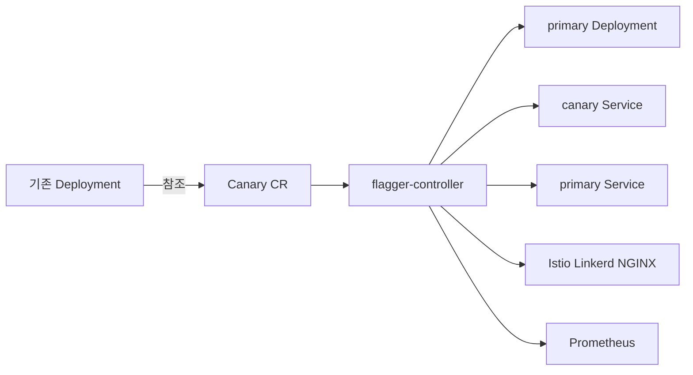

# Flagger

> **Flagger는 Flux 진영의 Progressive Delivery Operator**다. Flux 프로젝트의
> 서브프로젝트로서 Flux는 2022년 CNCF Graduated. Argo Rollouts와 기능은
> 겹치지만 **철학이 다르다**:
> Rollouts는 Deployment를 Rollout CR로 대체하는 반면, **Flagger는 기존
> Deployment는 그대로 두고 Canary CR이 바깥에서 primary/canary를 관리**한다.
> 이 모델 덕분에 기존 Helm chart·Deployment 수정 없이 도입 가능하다.

- **현재 기준**: Flagger v1.42+ (2026), Flux 프로젝트 산하
- **전제**: Kubernetes 1.27+, **Service Mesh 또는 Ingress Controller 필수**
  (App Mesh, Istio, Linkerd, Kuma, OSM, Contour, Gloo, NGINX, Skipper,
  Traefik, APISIX, Gateway API)
- [Argo Rollouts](./argo-rollouts.md)와의 비교는 §13
- 배포 전략 개념은 [배포 전략](../concepts/deployment-strategies.md),
  SLO 기반 평가는 `sre/`

---

## 1. 개념 — 왜 Flagger인가

### 1.1 Argo Rollouts와의 근본 차이

| 축 | Argo Rollouts | Flagger |
|---|---|---|
| 배포 객체 | `Rollout` CR (Deployment 대체) | 기존 `Deployment` + `Canary` CR |
| 도입 시 기존 chart 수정 | ✅ 필요 (Deployment → Rollout) | ❌ 불필요 (Canary CR 추가만) |
| Traffic Routing | 선택 (직접 replica weight 가능) | **필수** (mesh/ingress 없으면 동작 불가) |
| 분석 엔진 | AnalysisTemplate (step별) | Canary에 metrics 내장, 매 interval 자동 평가 |
| Weight 제어 | 수동 step 정의 | `maxWeight`·`stepWeight` 자동 증분 |
| 선호 생태계 | ArgoCD | Flux |
| CNCF 상태 | Argo 프로젝트의 일부 (2022 Graduated) | Flux 프로젝트의 일부 (2022 Graduated) |
| 부가 도구 | kubectl-argo-rollouts, Dashboard | flagger-loadtester, Grafana 대시보드 |

**요약**: Rollouts는 "배포 전략을 스펙으로 세밀하게 선언"하고, Flagger는
"임계값과 mesh만 주면 알아서 canary한다".

### 1.2 아키텍처



1. 사용자는 `foo` Deployment와 `Canary` CR만 생성
2. flagger-controller가 **`foo-primary` Deployment, Service, 메시 리소스
   자동 생성** — 실제 prod 트래픽은 primary가 받음
3. `foo` Deployment에 새 이미지 push → controller가 **canary = 새 버전**
   으로 간주
4. mesh VirtualService·HTTPRoute의 weight를 `stepWeight`씩 증가, 각
   interval마다 metric 쿼리로 판정
5. 통과하면 최종 weight 도달 → primary에 canary spec 복사(`promote`) →
   canary는 다시 0 replica

---

## 2. 설치

```bash
# Helm (Istio 환경 예시)
helm repo add flagger https://flagger.app
helm upgrade -i flagger flagger/flagger \
  --namespace=istio-system \
  --set crd.create=true \
  --set meshProvider=istio \
  --set metricsServer=http://prometheus.monitoring:9090

# 로드테스터 (선택)
helm upgrade -i flagger-loadtester flagger/loadtester \
  --namespace=test
```

### 2.1 meshProvider 값

| 값 | 대상 |
|---|---|
| `istio` | Istio |
| `linkerd` | Linkerd + SMI |
| `appmesh` | AWS App Mesh |
| `kuma` | Kuma |
| `osm` | Open Service Mesh (archived) |
| `nginx` | NGINX Ingress |
| `contour` | Contour (HTTPProxy) |
| `gloo` | Gloo Edge |
| `skipper` | Skipper |
| `traefik` | Traefik |
| `apisix` | APISIX |
| `gatewayapi` (+ `:v1alpha2`/`:v1beta1`/`:v1` 서픽스) | Gateway API. **컨트롤러가 HTTPRoute v1을 지원하면 `:v1` 권장** |
| `knative` | Knative Serving |

**Gateway API 선택이 2026 권장 경로**. Mesh 종속성 최소화.

### 2.2 Prometheus 필수

Flagger의 기본 metric (`request-success-rate`, `request-duration`)은
**Prometheus 쿼리로 동작**한다. Prometheus가 없으면 metric-less mode로
running만 하고 판정 없이 승급 — 사실상 무의미. [Observability](../../observability/)
카테고리의 Prometheus 설치가 선행 조건.

---

## 3. Canary CR — 최소 구성

```yaml
apiVersion: flagger.app/v1beta1
kind: Canary
metadata:
  name: webapp
  namespace: apps
spec:
  targetRef:
    apiVersion: apps/v1
    kind: Deployment
    name: webapp
  autoscalerRef:                 # HPA가 있으면 참조
    apiVersion: autoscaling/v2
    kind: HorizontalPodAutoscaler
    name: webapp
  progressDeadlineSeconds: 600
  service:
    port: 8080
    targetPort: 8080
    portName: http
    gateways: [public-gw.istio-system.svc.cluster.local]
    hosts: [webapp.example.com]
  analysis:
    interval: 1m                 # 매 interval마다 평가
    threshold: 5                 # 5회 실패 = 롤백
    maxWeight: 50                # 최대 50%까지만 canary
    stepWeight: 10               # 10%씩 증가
    stepWeightPromotion: 100     # 통과 후 primary 전환 step
    metrics:
      - name: request-success-rate
        thresholdRange: {min: 99}
        interval: 1m
      - name: request-duration
        thresholdRange: {max: 500}
        interval: 1m
    webhooks:
      - name: smoke-test
        type: pre-rollout
        url: http://flagger-loadtester.test/
        timeout: 15s
        metadata:
          type: bash
          cmd: "curl -sf http://webapp-canary.apps:8080/healthz"
      - name: load-test
        type: rollout
        url: http://flagger-loadtester.test/
        timeout: 5s
        metadata:
          cmd: "hey -z 1m -q 10 -c 2 http://webapp-canary.apps:8080/"
```

Controller가 자동 생성하는 리소스:

- `webapp-primary` Deployment (정상 prod, 실 트래픽 처리)
- `webapp` Service (→ primary)
- `webapp-primary` Service
- `webapp-canary` Service
- Istio `VirtualService` (weight 동적 조정)

**원본 Deployment 동작**: 초기화 시점에 Flagger가 원본 `webapp` Deployment를
**scale 0으로 내려**놓고 primary를 prod에 세운다. 이후 사용자가 `webapp`
Deployment에 새 이미지를 push(= scale up 복귀)하면 그 ReplicaSet이 "canary"
로 간주되어 분석이 시작된다.

**지원 targetRef**: `Deployment`, `DaemonSet`. **`StatefulSet`은 비지원** —
PVC·순차 ordinal 때문에 Flagger의 primary/canary 복제 모델과 맞지 않는다.
Stateful 워크로드는 Operator 고유의 배포 기능 사용 권장.

**`progressDeadlineSeconds` 산정**: `interval × (maxWeight/stepWeight) +
여유시간`. 위 예시는 `1m × 5 + initialization = 약 10분` 필요. 기본 600s.
짧으면 정상 진행 중에도 deadline exceeded.

---

## 4. 전략 3종

### 4.1 Canary (기본)

```yaml
analysis:
  maxWeight: 100
  stepWeight: 10
  stepWeightPromotion: 100
```

- 10% → 20% → ... → 100% 증가
- 각 interval에 metric threshold 만족해야 다음 step
- `stepWeightPromotion`은 성공 후 primary 전환 시 사용 (100이면 한 번에)

### 4.2 A/B Testing (Header·Cookie 매칭)

```yaml
analysis:
  iterations: 10                 # 10회 iteration 후 승급
  threshold: 2
  match:
    - headers:
        x-canary:
          exact: "insider"
    - headers:
        cookie:
          regex: "^(.*?;)?(canary=always)(;.*)?$"
  metrics: [...]
```

특정 사용자만 canary로 라우팅 → N iteration 동안 metric이 통과하면 승급.
**가중치 기반 Canary와 달리 트래픽 % 이동 없음** — 필터 기반.

### 4.3 Blue-Green (mesh 있을 때)

```yaml
analysis:
  iterations: 10
  threshold: 2
  metrics: [...]
```

`maxWeight`·`stepWeight` 없이 `iterations`만 있으면 Blue-Green 모드.
Canary가 full replica로 올라간 뒤 `iterations` 동안 검증 후 한 번에 cutover.
**Mesh 없는 환경**(예: Ingress Controller만)에서는 Blue-Green **Mirroring**
모드가 있다:

```yaml
analysis:
  iterations: 10
  mirror: true                   # shadow — 응답 버림
  metrics: [...]
```

---

## 5. 메트릭 — 기본 + Custom

### 5.1 내장 메트릭

| 이름 | 의미 | 계산 |
|---|---|---|
| `request-success-rate` | HTTP 2xx/3xx 비율 | `sum(rate(istio_requests_total{...,response_code!~"5.."}[interval])) / sum(rate(istio_requests_total{...}[interval]))` |
| `request-duration` | p99 지연 (ms) | `histogram_quantile(0.99, ...)` |

내부적으로 mesh/ingress마다 metric 이름이 다르다 — Flagger가 자동 매핑.

### 5.2 MetricTemplate — 커스텀 메트릭

Kayenta·Datadog·NewRelic·Prometheus·Graphite·StackDriver·CloudWatch·
Splunk Observability(2026 추가) 등 지원.

```yaml
apiVersion: flagger.app/v1beta1
kind: MetricTemplate
metadata:
  name: error-rate
  namespace: apps
spec:
  provider:
    type: prometheus
    address: http://prometheus.monitoring:9090
    headers:                     # 2026: custom header (auth token 등)
      - name: Authorization
        valueFrom:
          secretKeyRef: {name: prom-token, key: token}
  query: |
    100 - sum(
      rate(
        http_requests_total{
          kubernetes_namespace="{{ namespace }}",
          kubernetes_pod_name=~"{{ target }}-[0-9a-zA-Z]+(-[0-9a-zA-Z]+)*",
          status!~"5.."
        }[{{ interval }}]
      )
    ) / sum(
      rate(
        http_requests_total{
          kubernetes_namespace="{{ namespace }}",
          kubernetes_pod_name=~"{{ target }}-[0-9a-zA-Z]+(-[0-9a-zA-Z]+)*"
        }[{{ interval }}]
      )
    ) * 100
---
# Canary에서 참조
spec:
  analysis:
    metrics:
      - name: error-rate
        templateRef:
          name: error-rate
          namespace: apps
        thresholdRange: {max: 1}
        interval: 1m
```

**변수**: `{{ namespace }}`, `{{ target }}`, `{{ interval }}`, `{{ variables.X }}`.

### 5.3 SLO Burn Rate 메트릭

SRE의 multi-window burn rate를 그대로 쓸 수 있다.

```promql
# 5m × 1h 조합 burn rate
max(
  (1 - slo:availability:5m) / (1 - 0.999),
  (1 - slo:availability:1h) / (1 - 0.999)
)
```

canary에만 적용하려면 `{deployment="{{ target }}"}` 필터.

---

## 6. Webhook — 외부 검증·작업 주입

### 6.1 Hook 종류 (8종)

| 타입 | 실행 시점 | 실패 시 |
|---|---|---|
| `confirm-rollout` | rollout 시작 전 | 블록 — 사람이 승인할 때까지 |
| `pre-rollout` | canary 첫 가중치 이동 전 | abort |
| `rollout` | **매 step 평가 시** (loadtester에 가장 많이 사용) | abort |
| `confirm-traffic-increase` | **각 가중치 증가 직전** — 단계별 수동 승인 게이트 | 블록 |
| `confirm-promotion` | primary 승급 직전 | 블록 |
| `post-rollout` | 승급·abort 후 | 경고만 |
| `rollback` | 문제 감지로 롤백 트리거 시 | — |
| `event` | rollout 이벤트 알림 | — |

**HTTP 응답 규약**: Flagger는 webhook 응답을 **HTTP 200만 성공**으로 간주.
그 외 status code와 timeout은 모두 실패 → abort/블록. webhook 서버를 직접
구현하면 이 규약을 반드시 따를 것.

### 6.2 flagger-loadtester — 합성 트래픽

Canary 분석의 난제: **실제 트래픽이 canary로 흐르지 않으면 metric이
meaningless**. `flagger-loadtester`가 canary endpoint에 합성 트래픽을
발생시킨다.

```yaml
webhooks:
  - name: acceptance-test
    type: pre-rollout
    url: http://flagger-loadtester.test/
    timeout: 30s
    metadata:
      type: bash
      cmd: "curl -sf http://webapp-canary.apps:8080/"
  - name: load-test
    type: rollout
    url: http://flagger-loadtester.test/
    timeout: 5s
    metadata:
      cmd: "hey -z 1m -q 10 -c 2 http://webapp-canary.apps:8080/"
  - name: stress-test
    type: rollout
    url: http://flagger-loadtester.test/
    timeout: 5s
    metadata:
      cmd: "k6 run --vus 50 --duration 30s /tests/stress.js"
```

지원 도구: `hey`, `wrk`, `k6`, `bombardier`, 일반 `bash`. k6는 스크립트를
ConfigMap으로 주입 가능.

### 6.3 확인(Confirm) Hook — 수동 승인 게이트

```yaml
webhooks:
  - name: confirm
    type: confirm-rollout
    url: http://webhook.internal/approve
    timeout: 1h
```

404·200 제외 응답이 오면 canary가 대기. 인간 승인 UI·PagerDuty 승인 등
통합.

---

## 7. 승급·롤백·일시정지

### 7.1 CLI

Flagger는 별도 CLI 대신 kubectl로 조작:

```bash
# 상태 확인
kubectl -n apps get canaries
kubectl -n apps describe canary webapp

# 재분석 강제 트리거
kubectl -n apps annotate canary webapp flagger.app/restart=true --overwrite

# 일시 정지 (수동 분석 중)
kubectl -n apps patch canary webapp --type=merge -p '{"spec":{"suspend":true}}'

# 재개
kubectl -n apps patch canary webapp --type=merge -p '{"spec":{"suspend":false}}'

# analysis 건너뛰기 (긴급 hotfix)
kubectl -n apps patch canary webapp --type=merge -p '{"spec":{"skipAnalysis":true}}'
```

### 7.2 상태 전이

| Phase | 의미 |
|---|---|
| `Initializing` | primary 리소스 생성 중 |
| `Initialized` | 첫 배포 대기 |
| `Waiting` | targetRef가 변경되지 않음 |
| `Progressing` | 분석·weight 증가 중 |
| `Promoting` | canary → primary 복사 |
| `Finalising` | primary 전환 정리 |
| `Succeeded` | 완료 |
| `Failed` | 실패 — threshold 초과 |
| `Terminated` | CR 삭제 |

**Failed → 자동 rollback**: canary replica 축소, primary 유지. 트래픽은
다시 100% primary로.

### 7.3 승급 완료 후 문제 발견 시

Flagger의 자동 롤백은 **분석 중**에만 작동한다. `Succeeded` 상태로 전환된
뒤에 버그가 발견되면 **자동 롤백 없다**. 이 경우는 **역방향 canary**:

1. 이전 버전 이미지 태그로 `targetRef` Deployment 이미지 되돌림 (`kubectl
   set image`, Helm rollback, ArgoCD/Flux revert commit 중 하나)
2. Flagger가 "새 버전(=이전 안정판)"으로 간주하고 다시 canary 분석 시작
3. 이전 버전은 이미 검증됐으므로 빠르게 통과

긴급 상황이면 `spec.skipAnalysis: true`로 analysis 없이 즉시 primary 전환.
단 메트릭 검증 없이 전환하므로 정말 급한 경우에만.

---

## 8. Flux와의 통합

### 8.1 Canary·MetricTemplate을 Git으로

`flagger.app/v1beta1` 리소스는 다른 매니페스트와 동일하게 GitOps 대상.

```text
apps/webapp/
├── deployment.yaml
├── service.yaml          # Flagger가 덮어쓰므로 최소 정의
├── hpa.yaml
├── canary.yaml           # 여기가 핵심
└── metric-templates.yaml
```

Flux `Kustomization`에 `wait: true`를 걸면 Canary가 Ready(Succeeded 또는
Initialized)까지 대기 → 다음 dependsOn이 트리거.

### 8.2 Notification

Flagger는 Slack·MS Teams·Discord·Rocket·Generic Webhook 알림 내장.

```yaml
# flagger values.yaml
slack:
  url: https://hooks.slack.com/services/...
  channel: deployments
  user: flagger
  proxy: ""
```

이벤트(`promotion`, `abort`, `rollback`)마다 메시지. Flux notification-
controller와 별도로 Flagger 자체 설정이 더 풍부.

---

## 9. 관측

### 9.1 핵심 메트릭

| 메트릭 | 의미 |
|---|---|
| `flagger_canary_status` | 현재 상태 (0=Succeeded, 1=Failed, 2=Progressing...) |
| `flagger_canary_weight` | 현재 canary weight |
| `flagger_canary_total` | 배포 카운터 (phase 라벨) |
| `flagger_canary_duration_seconds` | 분석 총 시간 histogram |
| `flagger_canary_metric_analysis` | metric 분석 결과 (name, phase) |

**Prometheus 알람**

```yaml
- alert: FlaggerCanaryFailed
  expr: flagger_canary_total{phase="failed"} > 0
  for: 5m
  annotations:
    summary: "Canary {{$labels.name}} rolled back"
```

### 9.2 Grafana 대시보드

공식 대시보드 ID [`11223`](https://grafana.com/grafana/dashboards/11223)
— canary weight, success rate, request duration 시각화.

---

## 10. 안티패턴

| 안티패턴 | 왜 문제 | 교정 |
|---|---|---|
| Mesh·Ingress 없이 Flagger 사용 | trafficRouting 불가, canary가 아닌 단순 롤링 | Istio/Linkerd/Gateway API 선행 |
| Prometheus 없이 설치 | metric 쿼리 실패 → 모든 analysis skip | observability 선행 |
| `skipAnalysis: true` 상시화 | Progressive Delivery의 의미 상실 | 긴급 hotfix에만 |
| `threshold: 1` + 변동성 큰 메트릭 | 일시 spike로 abort | 3~5 권장 |
| `maxWeight: 100` + loadtester 없음 | 합성 트래픽 없으면 canary로 실트래픽 유입 안 될 수 있음 | 최소 acceptance-test + load-test |
| Deployment service annotations 직접 편집 | Flagger가 덮어씀 | Canary CR spec.service로 관리 |
| HPA 직접 관리 (autoscalerRef 없이) | primary-canary scale 불일치 | autoscalerRef 명시 |
| Istio VirtualService 수동 수정 | 다음 reconcile에서 덮어써짐 | Canary CR spec만 |
| Blue-Green에 `maxWeight` 지정 | 모드 충돌, 예기치 않은 canary 동작 | iterations만 |
| A/B 매칭 헤더 운영 의존 (`x-canary: true`) | 클라이언트가 cache에 저장 | cookie + 짧은 TTL |
| MetricTemplate Prometheus 절대값 | 트래픽 변화에 민감 | 비율 또는 canary vs primary 비교 |
| confirm hook timeout 5s | 사람이 승인하기 전에 timeout | 1h 이상 |
| `loadtester`를 별도 namespace에 두고 NetworkPolicy 없음 | 공격자가 임의 cmd 실행 | namespace 격리 + NP + RBAC |
| Flagger와 Argo Rollouts 동시 설치 | mesh 리소스 소유권 분쟁 | 하나만 |
| post-rollout 실패를 무시 | cache invalidate·warmup 실패 놓침 | log·alert 연결 |
| 대규모 Canary CR 수백 개에서 Prometheus rate limit | PromQL 쿼리 과다 | `interval` 늘리거나 federation |
| Flagger 버전 pin 없음 | minor 자동 업그레이드로 CRD 변경 | Helm `--version` 명시 |

---

## 11. 도입 로드맵

1. **Mesh/Ingress 선행**: Istio·Linkerd·NGINX·Gateway API 중 택
2. **Prometheus 준비**: ServiceMonitor·mesh metric 수집 확인
3. **첫 Canary**: `maxWeight: 20 / stepWeight: 10 / threshold: 3`부터
4. **loadtester**: 합성 트래픽으로 canary endpoint에 부하
5. **Webhook 추가**: pre-rollout acceptance + rollout load + confirm
6. **MetricTemplate**: 앱 고유 SLO 쿼리 도입
7. **Slack 알림**: 배포·rollback 이벤트
8. **A/B 실험**: header/cookie 기반 실사용자 실험
9. **Blue-Green (iterations)**: stateful 앱 대상
10. **Flux 통합**: Canary·MetricTemplate을 Git으로, dependsOn으로 순서

---

## 12. 언제 Flagger 대신 Argo Rollouts?

| 기준 | Flagger 유리 | Argo Rollouts 유리 |
|---|---|---|
| GitOps 스택 | **Flux** | ArgoCD |
| Mesh 표준화 안됨 | ❌ 필수 | ✅ replica 기반 가능 |
| 기존 Helm chart 수정 원치 않음 | **✅** | ❌ Rollout으로 전환 |
| Step을 촘촘히 세밀 제어 | 제한적 | **✅ 각 step 커스텀** |
| Traffic Mirroring | Blue-Green mode | **✅ setMirrorRoute 세밀** |
| A/B 실험 | **✅ match 필드** | ✅ setHeaderRoute |
| CNCF 성숙도 | Flux (Graduated, 2022) | Argo (Graduated, 2022) |
| 대시보드 UI | Grafana만 | **✅ 전용 Dashboard** |

**철학**: 기존 앱을 최소 침습으로 canary 하려면 Flagger, 배포 전략
DSL을 세밀히 다루려면 Rollouts.

---

## 13. 관련 문서

- [Argo Rollouts](./argo-rollouts.md) — 대안
- [트래픽 분할](./traffic-splitting.md) — mesh·Gateway API 세부
- [Flux 설치](../flux/flux-install.md) — Flux와 자연 통합
- [배포 전략](../concepts/deployment-strategies.md)

---

## 참고 자료

- [Flagger 공식 문서](https://docs.flagger.app/) — 확인: 2026-04-25
- [Flagger GitHub](https://github.com/fluxcd/flagger) — 확인: 2026-04-25
- [Canary CRD Reference](https://docs.flagger.app/usage/how-it-works) — 확인: 2026-04-25
- [MetricTemplate](https://docs.flagger.app/usage/metrics) — 확인: 2026-04-25
- [Webhooks](https://docs.flagger.app/usage/webhooks) — 확인: 2026-04-25
- [Istio Canary](https://docs.flagger.app/tutorials/istio-progressive-delivery) — 확인: 2026-04-25
- [Gateway API Canary](https://docs.flagger.app/tutorials/gatewayapi-progressive-delivery) — 확인: 2026-04-25
- [CHANGELOG](https://github.com/fluxcd/flagger/blob/main/CHANGELOG.md) — 확인: 2026-04-25
- [Grafana Dashboard 11223](https://grafana.com/grafana/dashboards/11223) — 확인: 2026-04-25
