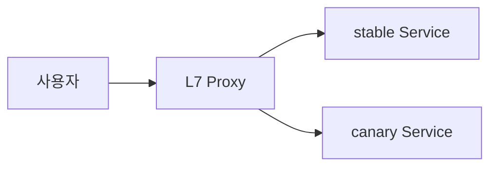
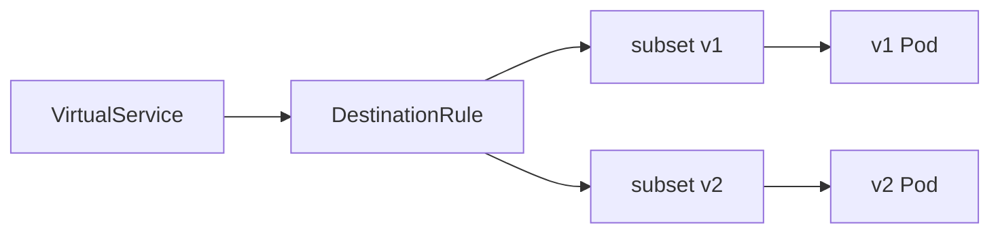
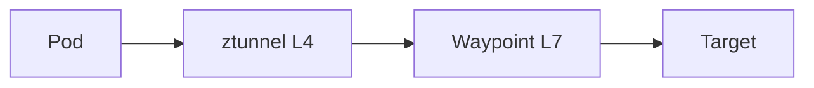

# 트래픽 분할

> **Progressive Delivery의 엔진**은 결국 **트래픽 분할** — 사용자 요청의
> 일부만 새 버전으로 보내고, 나머지는 안정 버전으로 유지하는 기능이다.
> Argo Rollouts·Flagger는 이 기능을 **선언적으로 표현**하지만, 실제
> 분할 로직은 **Gateway API·Istio VirtualService·Envoy·NGINX Ingress**
> 같은 L7 데이터 플레인이 수행한다. 이 글은 **데이터 플레인 레벨의 트래픽
> 분할 원리와 구체 설정**을 다룬다.

- **2026 표준 추세**: **Kubernetes Gateway API v1 GA**(2023-10)가
  VirtualService·Ingress를 흡수. Istio·Envoy Gateway·Cilium·Kong·Contour·
  Traefik 모두 구현체 제공
- **네트워크 카테고리의 mesh 상세**는 [network/](../../network/), 여기서는
  **Progressive Delivery를 위한 분할 기능**에 집중
- **상위 레이어 연동**은 [Argo Rollouts](./argo-rollouts.md),
  [Flagger](./flagger.md)

---

## 1. 개념 — 왜 데이터 플레인이 필요한가

### 1.1 Service·Ingress의 한계

Kubernetes 표준 `Service`는 **kube-proxy(iptables/IPVS)**로 부하 분산.
**weight 개념 없음** — 모든 엔드포인트에 균등 분배.

**replica 기반 근사치** (Deployment v1 3개 + v2 1개 = 25% 캐나리)는
부정확:

- iptables 라운드 로빈이 완벽히 균등하지 않음 (특히 keepalive·HTTP/2)
- pod restart 시 weight 급변
- client-side keepalive가 긴 경우 한 pod에 트래픽 집중

**정밀 분할**은 L7 proxy가 가중치 기반 라우팅을 수행해야 가능.

### 1.2 데이터 플레인 옵션



| 데이터 플레인 | 위치 | 2026 표준 |
|---|---|---|
| **Gateway API 구현체** (Envoy Gateway, Istio, Cilium, Kong, Contour) | Cluster 경계 L7 | ⭕ **권장** |
| **Istio** (VirtualService) | Cluster 내부 Sidecar + Ingress | 기존 Istio 사용자 |
| **Linkerd** (SMI TrafficSplit, GAMMA HTTPRoute) | Cluster 내부 Sidecar | 기존 Linkerd 사용자 |
| **NGINX Ingress** (canary annotation) | Ingress Controller | 레거시 유지 |
| **AWS ALB** (TargetGroupBinding weight) | 클라우드 LB | AWS native |
| **Envoy** (직접 xDS) | Sidecar·Front Proxy | 저수준 제어 |
| **Ambient Mesh** (Istio ztunnel + Waypoint) | Node L4 + 서비스별 L7 | **Istio 1.24 GA** (2024-11), 1.22 Beta |

---

## 2. Gateway API — 2026 표준 경로

### 2.1 리소스 3층 구조

| 리소스 | 역할 | 소유자 |
|---|---|---|
| **GatewayClass** | 구현체 (Envoy Gateway, Istio 등) 선언 | 인프라 팀 |
| **Gateway** | Listener(포트·TLS·hostname) | 플랫폼 팀 |
| **HTTPRoute** / `TLSRoute` / `GRPCRoute` / `TCPRoute` | 라우팅·weight·filter | 앱 팀 |

**역할 분리**가 Ingress보다 명확 — 플랫폼 팀이 Gateway를, 앱 팀이 HTTPRoute를
관리. "어느 팀이 TLS 인증서를 붙이는가"의 모호성 해소.

### 2.2 Weight 기반 분할

```yaml
apiVersion: gateway.networking.k8s.io/v1
kind: HTTPRoute
metadata:
  name: webapp-route
  namespace: apps
spec:
  parentRefs:
    - name: public-gw
      namespace: gateway-system
  hostnames: [webapp.example.com]
  rules:
    - matches:
        - path: {type: PathPrefix, value: /}
      backendRefs:
        - name: webapp-stable
          port: 8080
          weight: 90
        - name: webapp-canary
          port: 8080
          weight: 10
```

**중요 사실**

- `weight`는 **비율**이 아니라 **proportional** — 합계가 분모. `90 + 10`
  = 100이므로 실질적으로 %와 같지만, `9 + 1`도 결과 동일
- `weight: 0`은 **해당 backend로 보내지 않음** — 롤백 시 canary를 0으로
- **단일 backend면 weight 무관** 100%
- `weight`를 **모두 0**으로 두면 구현체에 따라 **500 또는 503** 발생 —
  0은 "제외"를 의미하며, 모두 0이면 해석 가능한 backend가 없다는 뜻

### 2.3 Match 기반 라우팅 (A/B 테스트)

```yaml
spec:
  rules:
    # 내부 직원은 무조건 canary
    - matches:
        - headers:
            - name: x-user-role
              value: "employee"
      backendRefs:
        - name: webapp-canary
          port: 8080
    # 나머지는 stable
    - matches:
        - path: {type: PathPrefix, value: /}
      backendRefs:
        - name: webapp-stable
          port: 8080
```

**match 종류**: `path`(Exact/PathPrefix/RegularExpression), `headers`,
`queryParams`, `method`.

> ⚠️ **Header spoofing 주의**: 위 예제의 `x-user-role: employee`를 외부
> 사용자가 임의 헤더로 보낼 수 있다. 프로덕션에서는 (a) 인증 프록시·sidecar
> 뒤에서만 신뢰하거나, (b) `RequestHeaderModifier`로 수신 요청의 민감
> 헤더를 **먼저 strip**한 뒤 인증 로직이 다시 부여하도록 구성.

### 2.4 Filter — 변형

```yaml
rules:
  - matches: [...]
    filters:
      - type: RequestHeaderModifier
        requestHeaderModifier:
          add:
            - name: x-canary
              value: "true"
      - type: URLRewrite
        urlRewrite:
          path: {type: ReplacePrefixMatch, replacePrefixMatch: /v2}
      - type: RequestMirror
        requestMirror:
          backendRef: {name: shadow-svc, port: 8080}
    backendRefs: [...]
```

**filter 종류**

| Filter | 용도 |
|---|---|
| `RequestHeaderModifier` | 요청 헤더 add/set/remove |
| `ResponseHeaderModifier` | 응답 헤더 수정 |
| `RequestRedirect` | 301/302 리다이렉트 |
| `URLRewrite` | path·hostname 재작성 |
| `RequestMirror` | Traffic mirror (shadow) |
| `ExtensionRef` | 구현체별 확장 (예: Istio의 `EnvoyFilter`) |

### 2.5 Timeout·Retry (v1.5 Standard, 2026-03)

Gateway API v1.5에서 **timeouts와 retries가 Standard(Stable) 채널로 승격**.
구현체가 `HTTPRoute` v1.5 이상을 conformance 통과했는지 확인하면 그대로
사용 가능.

```yaml
spec:
  rules:
    - timeouts:
        request: 30s
        backendRequest: 10s
      retry:
        codes: [500, 502, 503]
        attempts: 3
        backoff: 500ms
      backendRefs: [...]
```

### 2.6 구현체 선택

| 구현체 | 특징 | 적합 |
|---|---|---|
| **Envoy Gateway** | upstream Envoy, CNCF 프로젝트 | 중립·mesh 없이 Gateway만 필요 |
| **Istio** | mesh 기능 동시 사용 | Istio 유저 |
| **Cilium** | eBPF 기반, 성능 우위 | eBPF 스택 |
| **Kong Gateway Operator** | API gateway 기능 강점 (플러그인) | 엔터프라이즈 API 관리 |
| **Contour** | VMware 주도, 검증된 Envoy 기반 | 단순성 선호 |
| **Traefik** | 설정 간결, 문서 쉬움 | SMB |
| **Amazon VPC Lattice / ALB Gateway API Controller** | AWS 네이티브 | EKS |

**2026 권장**: 새 시스템은 **Gateway API 우선**. Istio를 이미 쓰면
VirtualService 유지도 가능하나 신규 규칙은 Gateway API로.

---

## 3. Istio VirtualService + DestinationRule

### 3.1 아키텍처



- **VirtualService**: "어디로 보낼지" — weight, match, retry, timeout
- **DestinationRule**: "받은 쪽을 어떻게 취급할지" — subset(버전 라벨),
  load balancing, mTLS, connection pool

**둘은 짝** — VirtualService가 subset을 참조하려면 DestinationRule이
먼저 존재해야 한다. 순서 어기면 **503**.

### 3.2 Weight 기반 분할

```yaml
apiVersion: networking.istio.io/v1
kind: DestinationRule
metadata:
  name: webapp
  namespace: apps
spec:
  host: webapp
  subsets:
    - name: v1
      labels: {version: v1}
    - name: v2
      labels: {version: v2}
  trafficPolicy:
    connectionPool:
      tcp: {maxConnections: 100}
      http: {http2MaxRequests: 1000, maxRequestsPerConnection: 10}
    outlierDetection:
      consecutive5xxErrors: 5
      interval: 30s
      baseEjectionTime: 30s
---
apiVersion: networking.istio.io/v1
kind: VirtualService
metadata:
  name: webapp
  namespace: apps
spec:
  hosts: [webapp.example.com]
  gateways: [public-gw]
  http:
    - route:
        - destination:
            host: webapp
            subset: v1
          weight: 90
        - destination:
            host: webapp
            subset: v2
          weight: 10
      retries:
        attempts: 3
        perTryTimeout: 2s
        retryOn: 5xx,gateway-error,connect-failure
      timeout: 10s
      mirrorPercentage:
        value: 100
      mirror:
        host: webapp
        subset: shadow
```

**Istio 고유 기능**

- `mirror` + `mirrorPercentage` — shadow 트래픽 비율 지정
- `retries.retryOn` — 재시도 조건 세밀
- `trafficPolicy.outlierDetection` — circuit breaker
- `corsPolicy`, `headers`, `rewrite`, `fault` (장애 주입 테스트)

### 3.3 VirtualService vs Gateway API

| 축 | VirtualService | HTTPRoute |
|---|---|---|
| 범위 | Istio 전용 | 공식 표준, 구현체 다수 |
| Weight | `weight: N` (0~100 합) | `weight: N` (proportional) |
| Match | `match:` 배열 | `matches:` 배열 |
| Retry | 세밀 (`retryOn`·per-try timeout) | **v1.5 Standard** (codes·attempts·backoff) |
| Mirror | `mirror` + `mirrorPercentage` | `RequestMirror` filter |
| Fault injection | ✅ | ❌ (구현체 확장 필요) |
| Circuit breaker | DestinationRule `outlierDetection` | 구현체 extension |

**전환 전략**: Istio 1.22+ `istioctl experimental precheck`가 VirtualService
→ HTTPRoute 변환 지원. 고급 기능(fault injection, circuit breaker)이 필요한
규칙은 당분간 VirtualService 유지 + 단순 라우팅은 HTTPRoute로 점진 이동.

---

## 4. NGINX Ingress

Argo Rollouts와 Flagger가 가장 많이 쓰는 조합 중 하나.

### 4.1 Canary annotation

```yaml
# stable Ingress
apiVersion: networking.k8s.io/v1
kind: Ingress
metadata:
  name: webapp
  namespace: apps
spec:
  ingressClassName: nginx
  rules:
    - host: webapp.example.com
      http:
        paths:
          - path: /
            pathType: Prefix
            backend:
              service: {name: webapp-stable, port: {number: 8080}}
---
# canary Ingress (같은 host·path, 별도 리소스)
apiVersion: networking.k8s.io/v1
kind: Ingress
metadata:
  name: webapp-canary
  namespace: apps
  annotations:
    nginx.ingress.kubernetes.io/canary: "true"
    nginx.ingress.kubernetes.io/canary-weight: "10"
    # 또는 header·cookie 기반
    # nginx.ingress.kubernetes.io/canary-by-header: "x-canary"
    # nginx.ingress.kubernetes.io/canary-by-cookie: "canary"
spec:
  ingressClassName: nginx
  rules: [...]
```

**우선순위**: header > cookie > weight. header/cookie가 매치하면 weight를
무시하고 canary로.

### 4.2 NGINX의 한계

- **canary Ingress는 한 개만** 존재 가능 (동일 host·path 기준). 3-way 분할
  (stable·canary·experiment) 불가
- `canary-weight`는 **1% 단위** 정확도지만, 내부 부하 분산이 완벽히 균등
  하지 않음
- NetworkPolicy와의 상호작용 확인 필요 (Ingress controller가 별도 namespace
  에 있으면 egress 허용)

---

## 5. AWS ALB + Gateway API

EKS에서 관리형 LB 쓸 때 2026 표준.

```yaml
apiVersion: gateway.networking.k8s.io/v1
kind: Gateway
metadata:
  name: public-gw
  namespace: gateway-system
spec:
  gatewayClassName: aws-alb
  listeners:
    - name: https
      protocol: HTTPS
      port: 443
      tls:
        certificateRefs:
          - name: webapp-cert
---
apiVersion: gateway.networking.k8s.io/v1
kind: HTTPRoute
metadata:
  name: webapp
  namespace: apps
spec:
  parentRefs: [{name: public-gw, namespace: gateway-system}]
  hostnames: [webapp.example.com]
  rules:
    - backendRefs:
        - name: webapp-stable
          port: 8080
          weight: 90
        - name: webapp-canary
          port: 8080
          weight: 10
```

내부적으로 **ALB가 TargetGroup 2개를 Weighted Forwarding**으로 분배.
canary service의 EndpointSlice를 TargetGroup에 자동 동기화.

---

## 6. Ambient Mesh — Istio 1.24 GA 이후

기존 Istio는 **pod마다 sidecar**. Ambient Mesh는 **Node L4 (ztunnel) +
서비스별 L7 (Waypoint)** 구조로 재설계.



| 계층 | 제공 |
|---|---|
| ztunnel (DaemonSet) | mTLS, 네트워크 레벨 보안 |
| Waypoint (ServiceAccount·namespace별 proxy) | L7 라우팅, weight, retry, header match |

**Progressive Delivery 관점 장점**

- **Waypoint는 Gateway API `Gateway` 리소스로 배포** — 기본 구현은 Istio
  자체 proxy(Envoy 기반)이고, Envoy Gateway·kgateway 등 다른 Gateway API
  구현체를 Waypoint로 쓰는 "sandwich model"도 가능 → HTTPRoute와 자연 통합
- sidecar 리소스 오버헤드 없음 (수만 pod에서 유의미)
- 앱에 mesh를 "껐다 켰다" 가능 (namespace label `istio.io/dataplane-mode:
  ambient`)

**제한**: 아직 일부 고급 기능(`EnvoyFilter`)이 ambient에서 제한. 프로덕션
도입은 **Istio 1.24 GA 이후** 기준으로 기존 sidecar와 점진 마이그레이션.

---

## 7. 세션 고정과 Connection Draining

### 7.1 Session Affinity — 같은 사용자는 같은 backend로

트래픽 분할의 흔한 함정: 한 세션 안에서 stable·canary를 왕복하면 상태
불일치(로그인 풀림·장바구니 초기화). 해결은 **sticky session**.

| 데이터 플레인 | 방법 |
|---|---|
| Gateway API | `sessionPersistence` (GEP-1619, v1.1 experimental) |
| Istio | DestinationRule `loadBalancer.consistentHash` (source IP·header·cookie) |
| NGINX | annotation `nginx.ingress.kubernetes.io/affinity: cookie` |
| ALB | Target Group stickiness |

```yaml
# Istio — 쿠키 기반
spec:
  host: webapp
  trafficPolicy:
    loadBalancer:
      consistentHash:
        httpCookie:
          name: "sess"
          ttl: 0s
```

**주의**: consistentHash는 각 subset 내부의 endpoint 결정에 쓰인다. subset
간 weight 분할은 별도이므로 "canary로 처음 라우팅된 사용자를 canary에만
유지"하려면 **VirtualService의 `match` + 쿠키**를 직접 설계하거나 상위
레이어(Flagger A/B 모드)를 사용.

### 7.2 Connection Draining — Weight 변경 직후 5xx 방지

Keep-alive HTTP/2 연결이 오래 유지되면 weight를 바꿔도 기존 연결이
백엔드를 바꾸지 않는다. Pod가 사라지는 순간 5xx 스파이크.

| 튜닝 포인트 | 값 |
|---|---|
| Pod `terminationGracePeriodSeconds` | 60 이상 |
| `preStop` hook | `sleep 15` (Service endpoint 제거 시간 확보) |
| Istio DR `connectionPool.http.maxRequestsPerConnection` | 10 (주기적 재수립) |
| Istio DR `connectionPool.http.idleTimeout` | 60s |
| `proxy-read-timeout` (NGINX) | 60s |

**2분 weight transition 동안 5xx spike 0**을 목표로 하면 위 조합이 필요.

---

## 8. Traffic Mirroring — Shadow

### 8.1 의미

새 버전으로 **요청 복사본** 전송, 응답은 버림. 트래픽 증가 없이
성능·호환성 실험.

### 8.2 구현별 예

**Gateway API (`RequestMirror` filter)**

```yaml
filters:
  - type: RequestMirror
    requestMirror:
      backendRef: {name: shadow-svc, port: 8080}
```

**Istio**

```yaml
http:
  - route:
      - destination: {host: webapp, subset: v1}
    mirror: {host: webapp, subset: v2}
    mirrorPercentage: {value: 100}
```

**NGINX** (제한적)

```yaml
annotations:
  nginx.ingress.kubernetes.io/mirror-target: http://shadow.apps.svc.cluster.local:8080
  nginx.ingress.kubernetes.io/mirror-host: shadow.example.com
```

### 8.3 Shadow의 함정

- **Side effect가 있는 요청**(POST, PUT) — DB 중복 write, 결제 중복. 일반적
  read-only에만 적용
- **Downstream에 영향 2배** — mirror target이 호출하는 DB·외부 API도 부하
  증가
- **대역폭 2배** — 큰 payload는 비용 고려
- **Host 헤더**: Istio는 mirror 대상 Host에 자동으로 `-shadow` suffix 추가
  (예: `webapp-shadow`) — 원본 앱이 Host를 체크하면 혼란 유발
- **Primary 지연 전파 여부**: Istio는 fire-and-forget(primary 응답에 영향
  없음). 일부 구현체는 응답 대기 — 문서 확인 필수

---

## 9. 관측·디버깅

### 9.1 mesh·Gateway 메트릭

| 메트릭 | Provider |
|---|---|
| `istio_requests_total` | Istio |
| `envoy_cluster_upstream_rq_total` | Envoy |
| `nginx_ingress_controller_requests` | NGINX |
| `gateway_api_controller_*` | 각 구현체 |

**Flagger·Rollouts가 읽는 기본 쿼리**는 위 메트릭 기반. Prometheus
ServiceMonitor 필수.

### 9.2 디버깅

```bash
# Istio
istioctl proxy-config routes <pod> --name=80 -o json
istioctl x describe service webapp
istioctl analyze -n apps

# Envoy Gateway
kubectl get envoyproxy -n envoy-gateway-system -o yaml
envoyctl proxy-config route <gateway-pod>

# Gateway API 상태
kubectl describe gateway public-gw
kubectl describe httproute webapp
# → status.conditions로 Accepted/ResolvedRefs 확인
```

### 9.3 부하·지연 테스트

- `hey`, `wrk`, `k6`, `bombardier` — flagger-loadtester도 이들 포함
- `envoy_cluster_upstream_rq_time` histogram으로 p99 지연 관찰
- weight 변경 직후 **일시적 5xx spike 가능** — TCP 연결 재수립이 원인.
  `trafficPolicy.connectionPool.http.maxRequestsPerConnection: 10`으로 완화

---

## 10. 안티패턴

| 안티패턴 | 왜 문제 | 교정 |
|---|---|---|
| Service replica 수로 "weight 근사" | 부정확 + pod restart로 급변 | L7 proxy weight |
| Istio VirtualService만 만들고 DestinationRule 없음 | subset 참조 실패, 503 | DR 선행 |
| Istio VirtualService weight 합이 100 ≠ | Istio가 normalize — 예상과 다른 비율 | 합 100으로 명시 작성 |
| Gateway API `weight: 0` 병행 사용 | 0은 "제외" — 의도치 않은 503 | 최소 1 유지, 제거 시 backend 목록에서 삭제 |
| NGINX canary Ingress 2개 이상 | NGINX는 1개만 지원, 뒤 것이 무시됨 | Gateway API·Istio로 전환 |
| canary에 HPA 없이 고정 replica | 트래픽 급증 시 OOM | canary도 HPA |
| 모든 요청 mirror POST | DB·결제 중복 | GET/read-only만 |
| mesh sidecar 없는 pod에 canary 규칙 | 규칙 무효 | sidecar injection 확인 |
| Retry 합계가 timeout보다 큼 | tail latency 폭발 | `attempts × perTryTimeout < timeout` |
| Gateway API `hostnames` 누락 | Gateway listener와 매칭 안 됨 | listener·route hostname 일치 |
| Gateway API weight 합이 0 | 503 Service Unavailable | 최소 하나 > 0 |
| Istio `retryOn: "5xx"` 만 | gateway-error·connect-failure 놓침 | `5xx,gateway-error,connect-failure,refused-stream` |
| `outlierDetection` 없이 Canary 장애 배포 | 이상 pod 계속 트래픽 받음 | DestinationRule에 outlierDetection |
| Cluster-local canary Service 외부 노출 | LoadBalancer 비용 낭비 | Ingress·Gateway만 노출 |
| Ambient + 구형 EnvoyFilter 그대로 사용 | 일부 기능 미동작 | 호환 확인 후 이전 |
| NetworkPolicy default-deny에 gateway egress 누락 | Canary 503 | gateway namespace egress 허용 |

---

## 11. 도입 로드맵

1. **현재 데이터 플레인 파악**: NGINX·Istio·Gateway API 중 무엇이 있는가
2. **Gateway API 도입 검토**: 새 규칙부터 HTTPRoute로 작성
3. **첫 Canary**: weight 90/10 수동 조정 실험
4. **자동화**: Argo Rollouts·Flagger 연결
5. **Match 기반 A/B**: 내부 직원 헤더로 실험
6. **Mirror**: read-only 부하 테스트
7. **Retry·Timeout 기본값**: 앱별 SLO에 맞춰
8. **Circuit breaker**: outlierDetection 또는 구현체 extension
9. **Ambient 검토**: Istio 1.22+ 환경에서 sidecar → ambient
10. **관측 통합**: Prometheus + Grafana dashboard + alerting

---

## 12. 관련 문서

- [Argo Rollouts](./argo-rollouts.md) — 상위 레이어
- [Flagger](./flagger.md) — 상위 레이어
- [배포 전략](../concepts/deployment-strategies.md)
- [Feature Flag](./feature-flag.md) — 애플리케이션 레벨 분할

---

## 참고 자료

- [Kubernetes Gateway API 공식](https://gateway-api.sigs.k8s.io/) — 확인: 2026-04-25
- [HTTPRoute Traffic Splitting](https://gateway-api.sigs.k8s.io/guides/traffic-splitting/) — 확인: 2026-04-25
- [Gateway API Implementations](https://gateway-api.sigs.k8s.io/implementations/) — 확인: 2026-04-25
- [Istio VirtualService](https://istio.io/latest/docs/reference/config/networking/virtual-service/) — 확인: 2026-04-25
- [Istio DestinationRule](https://istio.io/latest/docs/reference/config/networking/destination-rule/) — 확인: 2026-04-25
- [Istio Gateway API](https://istio.io/latest/docs/tasks/traffic-management/ingress/gateway-api/) — 확인: 2026-04-25
- [Istio Ambient Mesh](https://istio.io/latest/docs/ambient/overview/) — 확인: 2026-04-25
- [NGINX Ingress Canary](https://kubernetes.github.io/ingress-nginx/user-guide/nginx-configuration/annotations/#canary) — 확인: 2026-04-25
- [Envoy Gateway](https://gateway.envoyproxy.io/) — 확인: 2026-04-25
- [AWS Gateway API Controller](https://www.gateway-api-controller.eks.aws.dev/) — 확인: 2026-04-25
