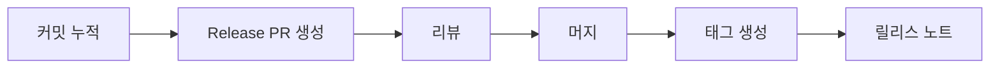
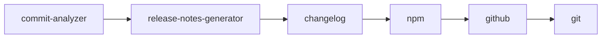
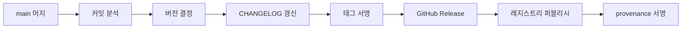

# SemVer·Changelog — 릴리스 자동화

> **릴리스 자동화**는 "버전 번호를 손으로 올리지 않는다"는 원칙에서
> 출발한다. **Conventional Commits**로 의도를 기록하고 → **SemVer**로
> 버전을 결정하고 → **Changelog**로 사용자에게 변경을 알리고 →
> **Git Tag + GitHub Release**로 공식화하는 파이프라인이 2026년
> 기본값.
>
> 2025년 이후 **Trusted Publishing (OIDC)** 이 npm·PyPI·RubyGems·
> crates.io에 모두 GA되면서 장기 토큰 없이 CI에서 직접 퍼블리시하는
> 것이 새로운 표준. SLSA provenance·Cosign 서명·SBOM 첨부까지
> 릴리스 한 트랜잭션 안에 넣는다.

- **현재 기준**: Conventional Commits 1.0.0, SemVer 2.0.0,
  Keep a Changelog 1.1.0, semantic-release v24, release-please Action v4
  (Node 20 런타임 → Node 24 전환 진행 중), changesets/action v1,
  goreleaser v2.15, Nx Release (Nx 20+)
- **상위 카테고리**: CI/CD 운영
- **인접 글**: [SLSA](../devsecops/slsa-in-ci.md),
  [OCI Artifacts](../artifact/oci-artifacts-registry.md),
  [GHA 보안](../github-actions/gha-security.md),
  [의존성 업데이트](../dependency/dependency-updates.md)

---

## 1. Semantic Versioning (SemVer) 2.0.0

### 1.1 구조

```
MAJOR.MINOR.PATCH[-pre-release][+build-metadata]
```

| 컴포넌트 | 증가 조건 | 예시 |
|---|---|---|
| **MAJOR** | 하위 호환성 깨는 API 변경 | `1.4.2` → `2.0.0` |
| **MINOR** | 하위 호환 기능 추가 | `1.4.2` → `1.5.0` |
| **PATCH** | 하위 호환 버그 수정 | `1.4.2` → `1.4.3` |
| **pre-release** | 정식 전 식별자 | `1.5.0-alpha`, `1.5.0-rc.1` |
| **build metadata** | 빌드 정보 (precedence 무시) | `1.5.0+20260425.abc` |

- leading zero 금지 (`01.0.0` ✗)
- 숫자 비교: `1.9.0 → 1.10.0 → 1.11.0` (사전식 아님)
- build metadata는 **precedence 계산에서 무시** — 버전 식별에만

### 1.2 Pre-release 순서

```
1.0.0-alpha < 1.0.0-alpha.1 < 1.0.0-alpha.beta
  < 1.0.0-beta < 1.0.0-beta.2 < 1.0.0-rc.1 < 1.0.0
```

- 점(`.`)으로 구분된 식별자들을 왼→오 비교
- 숫자끼리 숫자 비교, 알파벳끼리 사전식
- 숫자 < 알파벳 (`1.0.0-1 < 1.0.0-alpha`)
- prefix 같을 때 더 긴 쪽이 높음

### 1.3 0.x.x 특수 규칙

- 초기 개발 단계. 언제든지 변경 가능
- 공개 API 안정성 **보장 없음**
- SemVer 호환 강제 없음
- 1.0.0 릴리스가 "API 안정 선언"

### 1.4 대안 — CalVer·ZeroVer

| 방식 | 형식 | 사용 사례 |
|---|---|---|
| **CalVer** | `YY.MM` 또는 `YYYY.N.P` | Ubuntu (`24.04`, `26.04` LTS), JetBrains (`2025.2.2`), pip, Black |
| **ZeroVer** | `0.x.x` 영구 | FastAPI, 유틸리티 라이브러리 (농담 반·실재 반) |

**PEP 2026 승인** — **Python 3.26부터 CalVer** (`3.YY.micro`). 2026년
출시, 2031 EOL. 버전 번호에 연도 의미 부여.

**SemVer가 맞지 않는 경우**:
- 문서 사이트·연속 배포 SaaS (내부 버전 숨김)
- 날짜가 의미 있는 도구 (OS, IDE)
- API 안정성이 핵심이 아닌 도구

---

## 2. Conventional Commits 1.0.0

### 2.1 구조

```
<type>[optional scope]: <description>

[optional body]

[optional footer(s)]
```

```
feat(auth): add OIDC provider support

Adds support for OIDC discovery endpoints and
dynamic client registration.

Closes #1234
BREAKING CHANGE: `auth.config.provider` 구조가 변경됨
```

### 2.2 표준 type

| type | SemVer 영향 | 용도 |
|---|---|---|
| **feat** | MINOR (spec) | 새 기능 |
| **fix** | PATCH (spec) | 버그 수정 |
| `docs` | none | 문서만 |
| `style` | none | 포맷팅·세미콜론 |
| `refactor` | none | 리팩토링 (기능 변경 없음) |
| `perf` | none (도구별 PATCH 관행) | 성능 개선 |
| `test` | none | 테스트만 |
| `build` | none | 빌드 시스템·의존성 |
| `ci` | none | CI 설정 |
| `chore` | none | 유지보수 |
| `revert` | 상황별 | 롤백 |

> 📌 **spec 필수 SemVer 매핑**은 **`feat`(MINOR)·`fix`(PATCH)**만.
> `perf` 등 나머지는 도구(preset)별 관행 — semantic-release `angular`
> preset은 `perf`를 PATCH로 매핑, release-please는 기본 none.
> 도구의 실제 매핑을 **반드시 확인하고 명시적으로 설정**할 것.

### 2.3 Breaking Change 두 가지 표기

```
# 1) type 뒤 !
feat(api)!: remove deprecated /v1 endpoint

# 2) footer (BREAKING CHANGE 또는 BREAKING-CHANGE)
feat(api): remove deprecated /v1 endpoint

BREAKING CHANGE: /v1 경로 제거. /v2로 전환 필요.
```

둘 다 **MAJOR 트리거** (`type`과 무관).

### 2.4 Scope 설계

- 단일 패키지: `feat(auth):`, `fix(parser):`
- 모노레포: **패키지명**을 scope로 — `feat(ui-kit):`, `fix(api-gateway):`
- 생략 가능 — 범위가 광범위하면 scope 없이

### 2.5 시행 도구

| 계층 | 도구 | 비고 |
|---|---|---|
| 로컬 훅 | **commitlint** (`@commitlint/cli` + `@commitlint/config-conventional`) | commit-msg 훅 |
| 훅 매니저 | **husky v9** (Node) / **lefthook** (Go, 대규모) | [테스트 전략 §5.3](../testing/test-strategy.md) |
| PR lint | `amannn/action-semantic-pull-request@v5` | **squash merge 환경 권장** |
| 자동 머지 | Mergify, GitHub Auto-merge | CI 통과 + 승인 시 |

### 2.6 Squash Merge 정책과의 관계

현대 GitHub 리포지토리 다수가 **squash merge 기본**. 이 경우:

- 개별 커밋 메시지는 자유
- **PR 제목이 최종 커밋 메시지**가 됨
- → **PR title에만 Conventional Commits 강제**가 실무적

```yaml
# .github/workflows/pr-title.yml
on:
  pull_request:
    types: [opened, edited, synchronize]
jobs:
  lint:
    runs-on: ubuntu-latest
    steps:
      - uses: amannn/action-semantic-pull-request@v5
        with:
          validateSingleCommit: true
        env:
          GITHUB_TOKEN: ${{ secrets.GITHUB_TOKEN }}
```

---

## 3. Keep a Changelog 1.1.0

### 3.1 6개 표준 섹션

| 섹션 | 내용 |
|---|---|
| **Added** | 새 기능 |
| **Changed** | 기존 기능 변경 |
| **Deprecated** | 곧 제거될 기능 |
| **Removed** | 제거된 기능 |
| **Fixed** | 버그 수정 |
| **Security** | 취약점 수정 |

### 3.2 구조

```markdown
# Changelog

All notable changes to this project will be documented in this file.
The format is based on [Keep a Changelog](https://keepachangelog.com/en/1.1.0/),
and this project adheres to [Semantic Versioning](https://semver.org/spec/v2.0.0.html).

## [Unreleased]

### Added
- 새 feature X

## [1.5.0] - 2026-04-25

### Added
- OIDC provider 지원

### Fixed
- 메모리 누수 (#1234)

### Security
- CVE-2026-12345 패치

[Unreleased]: https://github.com/org/repo/compare/v1.5.0...HEAD
[1.5.0]: https://github.com/org/repo/compare/v1.4.2...v1.5.0
```

### 3.3 원칙

- **사람을 위한 것** — machine-readable은 부수적
- 최신 버전 위
- **ISO 8601 날짜** (`YYYY-MM-DD`)
- 버전별 **비교 링크** 하단
- `Unreleased` 섹션 상시 유지 → 릴리스 시점에 버전 섹션으로 이동

---

## 4. 도구 지형 (2026-04)

| 도구 | 생태계 | 방식 | 강점 | 약점 |
|---|---|---|---|---|
| **semantic-release** | JS 중심, 다언어 플러그인 | commit 분석 → 즉시 릴리스 | 단일 패키지 자동화 최강 | 모노레포 공식 지원 없음 |
| **release-please** | Google, 다언어 | **Release PR 기반** — 머지 시 릴리스 | 모노레포·다언어 강함, 검토 가능 | PR 관리 오버헤드 |
| **changesets** | pnpm·Turborepo 모노레포 | 개발자가 `.changeset` 작성 | 의도 명시, 독립 버전 | 개발자 교육 필요 |
| **Nx Release** | Nx 모노레포 | `nx release` 내장 (Nx 20+) | Nx 프로젝트 그래프 활용 | Nx 생태계 한정 |
| **goreleaser** | Go + Rust/Zig/Python/TS | 태그 → 빌드·패키징·배포 | 1 YAML로 전부, SLSA 내장 | 릴리스 도구 (버전 결정 별도) |
| **commit-and-tag-version** | JS | 로컬 bump + tag | 간단, CI 없이 가능 | 수동 트리거 |
| **release-drafter** | GitHub 네이티브 | PR label 기반 draft | 간단 | SemVer 자동 결정 약함 |

> 📌 `standard-version`은 2022-05 **deprecated**. 후계는
> `commit-and-tag-version` (절대 버전 포크).

### 4.1 선택 가이드

| 상황 | 추천 |
|---|---|
| 단일 JS/Node 패키지 | **semantic-release** |
| 모노레포 + pnpm/Turborepo | **changesets** |
| 모노레포 + 다언어 + Google 스타일 | **release-please** |
| Nx 모노레포 | **Nx Release** |
| Go 프로젝트 (바이너리·컨테이너 배포) | **goreleaser** |
| 단순 GitHub-only 팀 | **release-drafter** (보조) |

---

## 5. release-please 심화

### 5.1 모드

- **단일 패키지**: 리포 루트 config
- **manifest 모드** (다언어·모노레포): 권장

### 5.2 manifest 설정

`release-please-config.json`:

```json
{
  "release-type": "node",
  "include-v-in-tag": true,
  "packages": {
    "packages/web": {"release-type": "node"},
    "packages/api": {"release-type": "node"},
    "infra/terraform": {"release-type": "terraform-module"},
    "tools/cli": {"release-type": "go"}
  },
  "plugins": [
    {"type": "node-workspace"},
    {"type": "linked-versions",
     "groupName": "front",
     "components": ["web", "ui-kit"]}
  ]
}
```

`.release-please-manifest.json` (자동 유지):

```json
{
  "packages/web": "1.5.0",
  "packages/api": "2.1.3",
  "infra/terraform": "0.12.0",
  "tools/cli": "0.8.1"
}
```

### 5.3 워크플로



- 머지 후 `chore(main): release x.y.z` PR이 자동 생성/갱신
- 승인·머지 시 tag + GitHub Release + CHANGELOG 일괄 처리

### 5.4 주요 옵션

| 옵션 | 용도 |
|---|---|
| `release-type` | `node`·`python`·`go`·`rust`·`java`·`helm`·`terraform-module`·`simple` 등 |
| `release-as` | 원하는 버전 강제 (CalVer도) |
| `bump-minor-pre-major` | 0.x에서 `feat`을 PATCH로 (대체로 false 권장) |
| `changelog-sections` | 섹션 커스터마이징 |
| `prerelease` | pre-release 모드 |

### 5.5 GitHub Action

```yaml
- uses: googleapis/release-please-action@v4
  with:
    config-file: release-please-config.json
    manifest-file: .release-please-manifest.json
```

googleapis·terraform-google-modules·nodejs 등 Google 생태계 표준.

---

## 6. Changesets 심화

### 6.1 워크플로

1. 개발자: `pnpm changeset` → `.changeset/xxx.md` 생성
2. 머지 시 `changesets/action`이 **Version Packages PR** 자동 생성
3. Version PR 머지 시 `changeset publish`로 npm 퍼블리시

### 6.2 `.changeset/xxx.md` 예시

```markdown
---
"@my-org/ui-kit": minor
"@my-org/web": patch
---

UI Kit에 Button 컴포넌트 추가.
Web은 의존성 bump만.
```

### 6.3 config

`.changeset/config.json`:

```json
{
  "access": "public",
  "baseBranch": "main",
  "updateInternalDependencies": "patch",
  "fixed": [["@my-org/ui-kit", "@my-org/ui-icons"]],
  "linked": [["@my-org/core", "@my-org/plugin"]],
  "ignore": ["@my-org/examples"]
}
```

- `fixed`: 같이 bump (그룹 내 동일 버전)
- `linked`: 한 쪽 major → 다른 쪽도 major
- `ignore`: 릴리스 제외 (internal)

### 6.4 Pre-release

```bash
pnpm changeset pre enter beta
# 이후 changesets는 beta.N으로 나감
pnpm changeset pre exit
```

### 6.5 GitHub Action

```yaml
- uses: changesets/action@v1
  with:
    publish: pnpm release
    version: pnpm version-packages
    createGithubReleases: true
  env:
    NPM_TOKEN: ${{ secrets.NPM_TOKEN }}
    GITHUB_TOKEN: ${{ secrets.GITHUB_TOKEN }}
```

출력:
- `published` (bool)
- `publishedPackages` — JSON 배열 `[{"name": "...", "version": "..."}]`

---

## 7. semantic-release 심화

### 7.1 플러그인 파이프라인



### 7.2 `.releaserc`

```json
{
  "branches": [
    "main",
    {"name": "next", "channel": "next", "prerelease": true},
    {"name": "beta", "channel": "beta", "prerelease": true}
  ],
  "plugins": [
    "@semantic-release/commit-analyzer",
    "@semantic-release/release-notes-generator",
    ["@semantic-release/changelog", {"changelogFile": "CHANGELOG.md"}],
    ["@semantic-release/npm", {"npmPublish": true}],
    ["@semantic-release/github", {"successComment": false}],
    ["@semantic-release/git", {
      "assets": ["CHANGELOG.md", "package.json"],
      "message": "chore(release): ${nextRelease.version} [skip ci]"
    }]
  ]
}
```

### 7.3 브랜치 ↔ dist-tag 기본 매핑

| 브랜치 | 동작 | npm dist-tag |
|---|---|---|
| `main` / `master` | 정식 릴리스 | `latest` |
| `N.N.x` / `N.x` | 유지보수 | 브랜치명 |
| `next` | 차기 메이저 preview | `next` |
| `next-major` | 다음 major | `next-major` |
| `beta` | 프리릴리스 | `beta` |
| `alpha` | 프리릴리스 | `alpha` |

### 7.4 v24 요구사항

- Node.js **22.14.0+** (Node 20은 2026-04-30 EOL)
- conventional-changelog v8+

### 7.5 Monorepo 한계

- **공식 지원 없음**. 워크어라운드:
  - `multi-semantic-release`
  - `semantic-release-monorepo` (폴더별 개별 실행)
  - 패키지별 독립 workflow
- 모노레포라면 **changesets·release-please·Nx Release** 권장

---

## 8. goreleaser — Go 릴리스 표준

### 8.1 최소 `.goreleaser.yaml`

```yaml
version: 2
project_name: mycli
builds:
  - env: [CGO_ENABLED=0]
    goos: [linux, darwin, windows]
    goarch: [amd64, arm64]
archives:
  - formats: [tar.gz]
    name_template: "{{ .ProjectName }}_{{ .Version }}_{{ .Os }}_{{ .Arch }}"
checksum:
  name_template: 'checksums.txt'
sboms:
  - artifacts: archive
signs:
  - cmd: cosign
    artifacts: all
    args: ["sign-blob", "--oidc-issuer=https://token.actions.githubusercontent.com",
           "--output-signature", "${artifact}.sig",
           "--yes", "${artifact}"]
dockers:
  - image_templates: ["ghcr.io/org/mycli:{{ .Version }}"]
```

**1 YAML로 처리**: 빌드 · 아카이브 · 체크섬 · SBOM(Syft) · 서명
(Cosign/Sigstore) · Docker · Homebrew tap · Scoop · Nix · Winget ·
SLSA provenance.

### 8.2 CI 통합

```yaml
- uses: goreleaser/goreleaser-action@v6
  with:
    version: "~> v2"
    args: release --clean
  env:
    GITHUB_TOKEN: ${{ secrets.GITHUB_TOKEN }}
```

- `goreleaser check`로 config lint
- `--snapshot`으로 dry-run

---

## 9. Git Tag·GitHub Release 자동화

### 9.1 Annotated vs Lightweight

| 형식 | 명령 | 용도 |
|---|---|---|
| **annotated** | `git tag -a v1.0.0 -m "..."` | **릴리스 표준** — 태거·날짜·메시지·서명 |
| lightweight | `git tag v1.0.0` | 임시/로컬 |

### 9.2 Tag 서명

**GPG 서명**:
```bash
git tag -s v1.0.0 -m "Release v1.0.0"
git config --global tag.gpgsign true
```

**Sigstore gitsign (keyless)**:
```bash
git config --global gpg.x509.program gitsign
git config --global gpg.format x509
git config --global tag.gpgsign true
git tag -s v1.0.0 -m "Release v1.0.0"
```

- GPG 키 관리 불필요
- GitHub/Google OIDC로 Fulcio 인증서 발급
- Rekor 투명성 로그 자동 기록

### 9.3 GitHub Release 자동 노트

`.github/release.yml`:

```yaml
changelog:
  categories:
    - title: 🚀 Features
      labels: [feat, feature, enhancement]
    - title: 🐛 Bug Fixes
      labels: [fix, bug]
    - title: 🔒 Security
      labels: [security]
    - title: 📚 Documentation
      labels: [docs]
  exclude:
    labels: [duplicate, invalid, wontfix]
```

```bash
gh release create v1.0.0 \
  --generate-notes \
  --verify-tag \
  dist/*.tar.gz
```

---

## 10. Monorepo 버전 전략

### 10.1 Fixed vs Independent

| 전략 | 의미 | 예 |
|---|---|---|
| **Fixed (Locked)** | 모든 패키지 같은 버전 | Babel 초기, Jest 초기 |
| **Independent** | 패키지별 독립 버전 | changesets 기본, Nx Release 기본 |

### 10.2 도구 조합

| 조합 | 적합성 |
|---|---|
| **Turborepo + Changesets** | JS/TS 모노레포 최다 채택 |
| **Nx + Nx Release** | Nx 20+ 공식, 프로젝트 그래프 기반 |
| **release-please manifest** | 다언어 모노레포 (`node-workspace`·`cargo-workspace` 플러그인) |
| **Lerna** | Nrwl이 유지 (Nx 엔진). 신규 도입은 Nx Release 권장 |

### 10.3 Nx Release 예시

```bash
nx release version     # 버전 결정 + CHANGELOG
nx release changelog   # 변경로그만
nx release publish     # npm/registry 퍼블리시
```

- Nx 프로젝트 그래프 + conventional commits 분석
- fixed·independent 모두 지원

---

## 11. Pre-release 전략

### 11.1 단계

| 단계 | 용도 |
|---|---|
| `alpha` | 내부·기능 불안정 |
| `beta` | 기능 동결, 외부 테스트 |
| `rc` | Release Candidate, 출시 후보 |

### 11.2 npm dist-tag

| tag | 의미 |
|---|---|
| `latest` | 정식 릴리스 (기본 `npm install`) |
| `next` | 차기 메이저 preview |
| `beta` | 베타 |
| `alpha` | 알파 |
| `canary` | 연속 배포 (cutting edge) |

### 11.3 RC 관행

1. Minor 동결 → RC1 (`1.5.0-rc.1`)
2. 1~2주 외부 테스트
3. 회귀 발견 시 RC2, RC3...
4. 무이슈 → GA (`1.5.0`)

---

## 12. Breaking Change 관리

### 12.1 Deprecation 주기

| 프로젝트 | 정책 |
|---|---|
| Kubernetes | GA API 12개월·3 릴리스 중 긴 쪽, minor 3개 동시 지원 |
| Angular | 1~2 minor 경고 후 제거 |
| React | 주요 버전 사이 codemod 제공 |
| Node.js | LTS 30개월 지원 |

### 12.2 Migration 지원

- `UPGRADING.md` 또는 `docs/migrations/X-to-Y.md`
- **Codemod 제공**:
  - `react-codemod`
  - `@next/codemod`
  - `ng update`
  - `@angular/cli` schematics
- Deprecation warning은 **코드에서 출력**, 제거된 버전에서만 에러

### 12.3 API 버전 관리

| 방식 | 장점 | 단점 |
|---|---|---|
| URL path (`/v1/`, `/v2/`) | 캐시·라우팅·관찰 용이 | 버전 전환 명시적 |
| Header (`Accept: application/vnd.api+json; version=2`) | Content Negotiation 표준 | 디버깅 어려움 |
| Query param (`?version=2`) | 간단 | REST 캐시 약함 |

프로덕트 API는 **URL path**가 2026년 지배적.

---

## 13. 공급망 연계 — Trusted Publishing

### 13.1 변경 흐름

**2023~2025년 사이 주요 레지스트리가 OIDC Trusted Publishing을 GA**:

| 레지스트리 | GA 시점 |
|---|---|
| PyPI | 2023-04 |
| RubyGems | 2023-12 |
| **npm** | **2025-07-31** |
| crates.io | 2025-07 |

**효과**: 장기 API 토큰 폐지. CI에서 OIDC 토큰으로 직접 퍼블리시.

### 13.2 npm provenance

```yaml
permissions:
  id-token: write
  contents: read
steps:
  - uses: actions/setup-node@v4
    with:
      node-version: '22'
      registry-url: 'https://registry.npmjs.org'
  - run: npm ci
  - run: npm publish --provenance --access public
```

- npm CLI **11.5.1+**, Node **22.14.0+**
- Sigstore (Fulcio + Rekor) 기반 attestation 자동 생성
- `npm view <pkg>`에 attestation 정보 노출

> 📌 **2025-07 GA 이후**: Trusted Publishing으로 퍼블리시하면
> `--provenance`를 **명시하지 않아도 기본 첨부**. 명시적 플래그는
> 과도기 호환용. Trusted publisher 등록 필요 (npmjs.com → 패키지
> Settings → Trusted Publishing).

### 13.2.1 Pre-publish 검증

`npm pack --dry-run` 으로 tarball 내용 검증 (가장 흔한 실수 방지):

```bash
npm pack --dry-run           # 포함 파일 목록
npm publish --dry-run        # 퍼블리시 시뮬레이션
```

CI에 포함 권장:
```yaml
- run: npm pack --dry-run 2>&1 | tee pack-output.txt
- run: |
    if grep -q '\.env' pack-output.txt; then
      echo "ERROR: .env detected in tarball"
      exit 1
    fi
```

`package.json`의 `files` 필드와 `.npmignore`를 명시해 불필요한 파일
(소스맵, 테스트, `.env`, `dist-dev/` 등) 포함 방지.

### 13.3 PyPI Trusted Publishing

```yaml
permissions:
  id-token: write
jobs:
  publish:
    environment: pypi
    steps:
      - uses: actions/setup-python@v5
      - run: python -m build
      - uses: pypa/gh-action-pypi-publish@release/v1
```

PyPI에서 Trusted publisher 등록 (repository + workflow + environment).

### 13.4 Cosign·SBOM

```yaml
- name: Sign image
  run: |
    cosign sign \
      --oidc-issuer=https://token.actions.githubusercontent.com \
      --yes \
      ghcr.io/org/app@${{ steps.build.outputs.digest }}

- name: Generate SBOM
  uses: anchore/sbom-action@v0
  with:
    image: ghcr.io/org/app:${{ github.ref_name }}
    format: spdx-json

- name: Attest SBOM
  run: |
    cosign attest --predicate sbom.json \
      --type spdxjson \
      --yes \
      ghcr.io/org/app@${{ steps.build.outputs.digest }}
```

자세한 SLSA provenance는 [SLSA §4](../devsecops/slsa-in-ci.md) 참조.

---

## 14. CI 파이프라인 통합

### 14.1 표준 흐름



### 14.2 예시 — release-please + npm provenance

```yaml
name: release
on:
  push:
    branches: [main]

permissions:
  contents: write
  pull-requests: write
  id-token: write

jobs:
  release-please:
    runs-on: ubuntu-latest
    outputs:
      released: ${{ steps.rp.outputs.release_created }}
    steps:
      - id: rp
        uses: googleapis/release-please-action@v4

  publish:
    needs: release-please
    if: needs.release-please.outputs.released == 'true'
    runs-on: ubuntu-latest
    steps:
      - uses: actions/checkout@v4
      - uses: actions/setup-node@v4
        with:
          node-version: '22'
          registry-url: 'https://registry.npmjs.org'
      - run: npm ci
      - run: npm publish --provenance --access public
```

### 14.3 SBOM·Attestation

```yaml
- uses: actions/attest-build-provenance@v2
  with:
    subject-path: dist/*.tgz

- uses: actions/attest-sbom@v2
  with:
    subject-path: dist/*.tgz
    sbom-path: sbom.spdx.json
```

---

## 15. 릴리스 롤백·복구

### 15.1 원칙 — 불변성

- **Git tag는 재사용 금지** — tag는 immutable
- **Registry에 퍼블리시된 버전 덮어쓰기 금지** — npm/PyPI/OCI 모두
  동일 버전 재업로드 불가 (또는 강력히 제한)
- 잘못된 릴리스는 **앞으로 나아가는 방식**으로 수정 → 새 patch 버전
  (`1.5.0` 문제 → `1.5.1`로 수정)

### 15.2 npm

| 상황 | 조치 |
|---|---|
| 최근 72시간 내 | `npm unpublish <pkg>@<ver>` (조건 엄격, 다른 패키지 depend 시 불가) |
| 72시간 초과 | `npm deprecate <pkg>@<ver> "reason"` — 설치 시 경고, 실설치는 가능 |
| 보안 취약점 | GHSA publish + `npm deprecate` + 다음 버전으로 fix |

72시간 룰은 npm 정책 핵심. **절대 공개 패키지를 unpublish 자주 사용
하지 말 것** — 의존 트리 파괴.

### 15.3 GitHub Release·Tag

```bash
# Release 삭제 (UI 또는 CLI)
gh release delete v1.5.0 --cleanup-tag

# tag만 삭제
git push --delete origin v1.5.0
git tag -d v1.5.0
```

삭제한 tag 번호 **재사용 금지** — 캐시·CDN·SBOM·SLSA provenance가
해당 버전을 참조 중일 수 있음.

### 15.4 OCI Registry

- Container image tag 덮어쓰기는 레지스트리별로 다름
- **digest는 immutable** — tag는 이동해도 digest는 고정
- 프로덕션은 **digest로 참조** (tag 아님): `ghcr.io/org/app@sha256:...`
- 잘못된 이미지는 새 태그로 교체, 이전 태그는 두거나 "badtag" 주석 추가

### 15.5 보안 회수(Security Hold) 플로우


- [의존성 업데이트 §7.4 MTTR](../dependency/dependency-updates.md) 참조
- Cosign 서명은 원본 유지 — verification이 실패하면 다운로드 중단

### 15.6 무한 루프 방지

`[skip ci]` 또는 `paths-ignore`로 release bot의 자체 트리거 방지:

```yaml
on:
  push:
    branches: [main]
    paths-ignore:
      - 'CHANGELOG.md'
      - '**/package.json'
```

semantic-release `@semantic-release/git` 플러그인의 기본
`"chore(release): ${nextRelease.version} [skip ci]"` 메시지가 표준.

---

## 16. 엔터프라이즈·OSS 사례

### 15.1 Angular (원조)

- **Conventional Commits 2017년 공개** — 생태계 표준의 기원
- 자체 changelog 도구 → 커뮤니티로 전파

### 15.2 Google

- **release-please** 제작·유지
- googleapis (수백 개), terraform-google-modules, nodejs 등에 적용
- 내부 모노레포 릴리스 관행을 오픈소스로 포팅

### 15.3 Kubernetes

- SemVer 엄격 준수
- **minor 3개 동시 지원** (2026-04 현재 1.33/1.34/1.35 — 1.36은 2026-08 예정)
- **Cherry-pick** 정책: newest → older 순서
- `release-note` 라벨 기반 자동 CHANGELOG

### 15.4 HashiCorp

- 리포 루트 `CHANGELOG.md` + `.changelog/` 디렉토리 (PR마다 개별 파일)
- `go-changelog`로 집계
- Keep a Changelog 6 섹션 변형

### 15.5 Rust·Go 생태계

- **Rust**: `cargo-release` + `git-cliff` (changelog 생성기)
- **Go**: **goreleaser**가 사실상 표준 — 1 YAML로 빌드·패키징·서명·퍼블리시

---

## 17. 체크리스트

**기본**
- [ ] SemVer 2.0.0 준수 (또는 CalVer 명시적 선언)
- [ ] Conventional Commits 1.0.0
- [ ] Keep a Changelog 1.1.0 6 섹션

**자동화**
- [ ] 커밋 분석 → 버전 결정 자동화 (도구 선택)
- [ ] CHANGELOG.md 자동 생성·유지
- [ ] 주 브랜치 머지 시 release 자동 트리거
- [ ] dry-run 모드로 CI 검증

**모노레포**
- [ ] Fixed vs Independent 결정
- [ ] 내부 의존성 자동 bump 전파

**공급망**
- [ ] Trusted Publishing (OIDC) 사용 — 장기 토큰 폐지
- [ ] Tag GPG 또는 gitsign 서명
- [ ] npm `--provenance` / PyPI Trusted Publishers
- [ ] Cosign 서명 + SBOM + SLSA provenance

**정책**
- [ ] Breaking Change 1~2 minor 예고
- [ ] Migration guide + codemod 제공
- [ ] minor N개 동시 지원 정책 공표
- [ ] Squash merge 환경은 PR title lint

---

## 18. 안티패턴

| 안티패턴 | 문제 |
|---|---|
| 0.x 영구 박제 | 안정 선언 회피. 사용자가 프로덕션 배포 주저 |
| build metadata를 precedence에 사용 | spec 위반. 다른 도구들과 충돌 |
| 수동 CHANGELOG 유지 | 표류·누락. 자동 생성으로 전환 |
| Conventional Commits 없이 semantic-release 도입 | 커밋 메시지 분석 실패 → 릴리스 멈춤 |
| `standard-version` 계속 사용 | 2022-05 deprecated. `commit-and-tag-version`으로 이관 |
| 장기 npm/PyPI API 토큰 사용 | 2025 이후 OIDC Trusted Publishing 표준. 토큰 유출 위험 |
| annotated 아닌 lightweight tag로 릴리스 | 태거·날짜·메시지·서명 부재 |
| Breaking Change를 `feat`로 표기 | SemVer major bump 누락, 사용자 파괴 |

---

## 참고 자료

- [Semantic Versioning 2.0.0](https://semver.org/spec/v2.0.0.html) (확인: 2026-04-25)
- [Conventional Commits 1.0.0](https://www.conventionalcommits.org/en/v1.0.0/) (확인: 2026-04-25)
- [Keep a Changelog 1.1.0](https://keepachangelog.com/en/1.1.0/) (확인: 2026-04-25)
- [CalVer](https://calver.org/) (확인: 2026-04-25)
- [PEP 2026](https://peps.python.org/pep-2026/) (확인: 2026-04-25)
- [semantic-release](https://github.com/semantic-release/semantic-release) (확인: 2026-04-25)
- [release-please](https://github.com/googleapis/release-please) (확인: 2026-04-25)
- [release-please manifest mode](https://github.com/googleapis/release-please/blob/main/docs/manifest-releaser.md) (확인: 2026-04-25)
- [changesets](https://github.com/changesets/changesets) (확인: 2026-04-25)
- [changesets/action](https://github.com/changesets/action) (확인: 2026-04-25)
- [Nx Release](https://nx.dev/docs/guides/nx-release) (확인: 2026-04-25)
- [goreleaser](https://goreleaser.com/) (확인: 2026-04-25)
- [commit-and-tag-version](https://github.com/absolute-version/commit-and-tag-version) (확인: 2026-04-25)
- [commitlint](https://commitlint.js.org/) (확인: 2026-04-25)
- [action-semantic-pull-request](https://github.com/amannn/action-semantic-pull-request) (확인: 2026-04-25)
- [npm Trusted Publishing GA](https://github.blog/changelog/2025-07-31-npm-trusted-publishing-with-oidc-is-generally-available/) (확인: 2026-04-25)
- [PyPI Trusted Publishers](https://docs.pypi.org/trusted-publishers/) (확인: 2026-04-25)
- [Sigstore gitsign](https://github.com/sigstore/gitsign) (확인: 2026-04-25)
- [GitHub CLI — gh release](https://cli.github.com/manual/gh_release_create) (확인: 2026-04-25)
- [Kubernetes Patch Releases](https://kubernetes.io/releases/patch-releases/) (확인: 2026-04-25)
