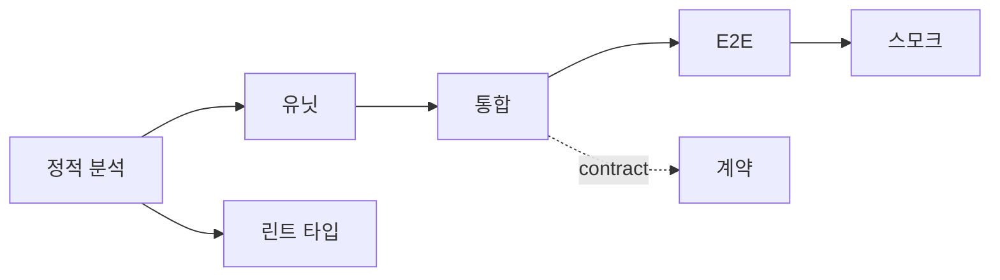
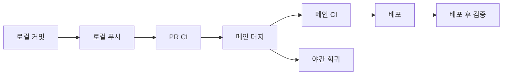

# 테스트 전략 — Unit·Integration·E2E·Contract 배분

> **테스트 전략**은 "어떤 테스트를 얼마나 쓸 것인가"만이 아니라,
> **CI 파이프라인의 어느 스테이지에 어느 테스트를 배치할 것인가**까지
> 포함한다. 2026년 기준 JS/TS 생태계는 **Testing Trophy**, 마이크로서비스는
> **Testing Honeycomb**, Bazel 기반 대규모 코드베이스는 **Google
> Small/Medium/Large** 분류를 차용한다.
>
> 피라미드는 여전히 교육적으로 유효하지만, "Unit 중심 + 나머지 조금"
> 구성은 현대 마이크로서비스·UI 복잡도에 맞지 않다. **Integration이
> 가장 두꺼워야 한다**는 Kent C. Dodds의 주장이 2026년 사실상 업계
> 기본값. AI가 Unit 테스트를 무한 생성하는 시대일수록 mutation score
> 로 품질을 걸러야 한다.

- **현재 기준**: Vitest 4.1 (2025-10-22 v4.0 릴리즈) / Jest 30, Playwright 1.49+,
  Pact Spec v4 · Pact-JS v15.x, Testcontainers Cloud GA
- **상위 카테고리**: CI/CD 운영
- **인접 글**: [Pipeline as Code](../concepts/pipeline-as-code.md),
  [GHA 고급](../github-actions/gha-advanced.md),
  [배포 전략](../concepts/deployment-strategies.md),
  [모노레포 CI/CD](../patterns/monorepo-cicd.md)
- **경계**: Chaos·카오스 엔지니어링은 [SRE](../../sre/)가 주인공 →
  본 글은 CI 스테이지 배치만 다룸. Feature Flag는
  [Feature Flag](../progressive-delivery/feature-flag.md) 참조.

---

## 1. 테스트 모델 — 피라미드에서 트로피까지

### 1.1 네 가지 모델 비교

| 모델 | 제안자 | 구성 | 적합한 상황 |
|---|---|---|---|
| **Testing Pyramid** | Mike Cohn (2009), Martin Fowler 정리(2012) | Unit(큼) > Integration > E2E(작음) | 단일 애플리케이션, 순수 로직 중심 |
| **Testing Trophy** | Kent C. Dodds (2021) | Static → Unit → **Integration(큼)** → E2E | 현대 JS/TS, 프론트엔드 |
| **Testing Honeycomb** | André Schaffer (Spotify 엔지니어, 2018) | Impl Detail(작음) - **Integrated(큼)** - Integration Contract | 마이크로서비스 다수 |
| **Small/Medium/Large/Enormous** | Google (2006) | 리소스·격리 레벨별 분류 | Bazel 기반 모노레포 |

### 1.2 2026년 지배적 관점 — Trophy/Honeycomb

- **Trophy 핵심**: "버그의 대부분은 통합 경계에서 발생한다. Unit 100개
  로 커버하지 못하는 것을 Integration 1개가 잡는다."
- **Honeycomb 핵심**: 마이크로서비스는 서비스 간 상호작용이 핵심 복잡도.
  내부 구현(implementation detail) 테스트를 줄이고 **실제 통합
  (Integrated)** 과 **경계 계약(Integration Contract)** 에 집중.
- **Google 분류**는 여전히 Bazel `size` 속성으로 살아 있음 — RAM·타임아웃
  자동 할당:

| size | 기본 RAM | 기본 타임아웃 |
|---|---|---|
| small | 20MB | 60s |
| medium | 100MB | 300s |
| large | 300MB | 900s |
| enormous | 800MB | 3600s |



### 1.3 AI 시대의 재조명

- AI 코드 생성이 **Unit 테스트를 무한 양산** — coverage는 쉽게 80%
  넘지만 **의미 있는 assertion인지 불분명**
- **Mutation testing** (Stryker·PIT·mutmut·cargo-mutants)이
  "테스트의 테스트"로 재주목. 60% 미만이면 AI 생성 테스트를 믿을 수 없음
- Trophy/Honeycomb으로 무게 중심이 더 기울어짐 — "의미 있는 Integration을
  사람이 설계"

### 1.4 안티패턴

| 안티패턴 | 증상 | 비용 |
|---|---|---|
| **Ice Cream Cone** | E2E·수동 바닥이 제일 무거움 | 피드백 지연, flake 폭증, 유지비 40~50% |
| **Cupcake** | 레이어 간 중복 과다 검증 | 테스트 변경 코스트 폭증 (Thoughtworks) |
| **Test Double 남용** | 모든 의존성 mock | 프로덕션 통합 버그 유출 |
| **Snapshot 남용** | 렌더 트리 전체 snapshot | 의미 없는 diff, 습관적 update |
| **100% coverage 추구** | getter/setter까지 모두 커버 | 핵심 분기를 놓치면서 비용 폭증 |
| **Flaky 방치** | retry로 숨김 | 팀 신뢰 붕괴 |

---

## 2. 테스트 유형별 정의

### 2.1 범주 정리

| 유형 | 실행 시간 | 격리 | 도구 예시 | CI 배치 |
|---|---|---|---|---|
| Static | 밀리초 | N/A | ESLint, TypeScript, Sorbet, mypy, Ruff | pre-commit + PR |
| Unit | 1~10ms | 프로세스 내 | Vitest, Jest, pytest, JUnit | pre-commit + PR |
| Component | 10~100ms | DOM 격리 | RTL, Vue Test Utils, Storybook Test Runner | PR |
| Integration | 100ms~수 s | Testcontainers, in-memory | Testcontainers, pytest + DB, Spring Boot Test | PR |
| Contract | 수 s | 브로커 검증 | Pact, Spring Cloud Contract, Schemathesis | PR + can-i-deploy |
| E2E (smoke) | 수 초 | 전체 스택 | Playwright 핵심 경로 | PR |
| E2E (full) | 분 | 전체 스택 | Playwright 전체 | main/nightly |
| Regression | 분 | 전체 스택 | E2E·Integration 축적 | nightly |
| Performance | 분~시간 | 부하 환경 | k6, Gatling, Locust | nightly/weekly |
| Smoke (post-deploy) | 수 초 | 프로덕션 엔드포인트 | curl·Playwright minimal | release 직후 |
| Chaos | 시간 | 실험 환경 | LitmusChaos, Chaos Mesh | 스테이징 상시 (SRE 영역) |

### 2.2 Unit vs Integration 경계

**Unit**:
- 외부 I/O 없음 (DB·네트워크·파일 시스템 제외)
- 순수 함수, 단일 클래스
- 테스트 더블(mock/stub)은 **경계**에만

**Integration**:
- 실제 DB·queue·외부 API(Testcontainers로 띄움)
- 여러 모듈 간 협력
- "mock하면 우리가 뭘 테스트했는지 모른다"는 Trophy 원칙

경계가 흐릿할 때 **Integration 쪽으로 기울여라** — 2026년 기본 권고.

---

## 3. Contract Testing — 마이크로서비스 필수

### 3.1 왜 Contract인가

MS 개수 N에 대해 E2E 조합은 O(N²), contract는 각 쌍 선형 O(N):

- MS 2개 → Contract 선택적
- **MS 3개 이상** → Contract 필수
- MS 10+ → Contract 없이는 변경 불가능

### 3.2 Consumer-Driven Contract (Pact)


- **Consumer 측**: "이 요청 → 이 응답" 기대를 테스트로 작성 → pact JSON 생성
- **Broker**: Pact Broker(OSS) 또는 **PactFlow**(SmartBear, 2022-04 인수)
- **Provider 측**: pact 파일로 자동 검증. 실패 시 빌드 차단
- **`can-i-deploy` CLI**: "X 버전 consumer와 Y 버전 provider를 동시에
  배포해도 되나?" 게이트

### 3.3 Bi-Directional Contract Testing

PactFlow 변형. Provider가 OpenAPI 스펙만 제공, Consumer는 pact만 제출.
브로커가 두 문서를 **대조 검증**. 레거시 provider에 도입 저마찰.

### 3.4 OpenAPI 기반 도구

| 도구 | 용도 |
|---|---|
| **Schemathesis** | OpenAPI/GraphQL에서 **property-based test** 자동 생성, 퍼징 |
| **Prism** (Stoplight) | OpenAPI mock 서버 + 검증 |
| **Dredd** | 스펙 ↔ 실제 응답 비교 |
| **Spectral** | OpenAPI lint |
| **oasdiff** | OpenAPI breaking change 감지 |

### 3.5 gRPC·Protobuf

- **Buf**가 표준. `buf breaking`이 PR CI에서 스키마 회귀 차단
- Schemathesis는 gRPC 지원 제한적 — Buf + 자체 integration test가 관용구

### 3.6 JVM 생태계

- **Spring Cloud Contract**: Groovy/YAML DSL → provider stub + consumer
  test 자동 생성
- **Pact-JVM**: JVM 전반 지원

### 3.7 Schema Registry (이벤트)

Kafka 등 비동기 메시지의 contract:

- Confluent Schema Registry, Apicurio
- 호환성 모드 (`BACKWARD`·`FORWARD`·`FULL`)가 곧 계약
- Avro·Protobuf·JSON Schema 지원

---

## 4. E2E — 현실적 배분

### 4.1 Flakiness 실태

- 일반적 E2E **flake rate 5~15%**
- **2% 초과 → 격리 대상** (업계 컨센서스)
- 전체 테스트 공수의 **40~50%**가 E2E 유지보수

### 4.2 Playwright vs Cypress (2026)

| 지표 | Playwright | Cypress |
|---|---|---|
| npm 주당 다운로드 | ~33M | ~6.5M |
| 채택률 (State of JS 2025) | 45.1% | 14.4% |
| 만족도 | 91% | 72% |
| 멀티 브라우저 | Chromium·WebKit·Firefox | Chromium 기반 |
| 병렬 격리 | 실제 격리 | 워커 기반 |
| CI 실행 예시 (동일 스위트) | 42초 | 100초 |
| 메모리 (워커) | 기본 대비 1/50 수준 | — |

2024~2026년 사이 **Playwright가 사실상 표준**. Cypress는 기존 구축
자산을 유지하는 팀에서 잔류.

> 💡 **Selenium**은 **Grid + BrowserStack/Sauce Labs 통합**이 필요한
> 레거시·다중 브라우저 매트릭스에서 여전히 유효. Selenium 4.27+
> BiDi API는 Playwright와 기능 격차 좁히는 중.

### 4.3 병렬 실행 (Sharding)

```yaml
jobs:
  e2e:
    strategy:
      fail-fast: false
      matrix:
        shard: [1, 2, 3, 4]
    steps:
      - run: npx playwright test --shard=${{ matrix.shard }}/4
```

- Jest/Vitest `--shard=i/N`, pytest-xdist `-n auto`, Playwright
  `--shard=i/N` 공식 지원
- 12분 스위트 → 4 shard로 3분. GitHub Actions matrix와 결합

### 4.4 재실행 전략

```ts
// playwright.config.ts
export default defineConfig({
  retries: process.env.CI ? 2 : 0,
  reporter: [['html'], ['json', { outputFile: 'results.json' }]]
});
```

- CI only retries: 로컬은 즉시 실패로 피드백
- `retries: 2`는 네트워크 blip 커버. **flake 은폐 방지**: retried test
  통계를 별도 추적 → 2% 초과 시 격리
- Trunk.io, Harness ML, BuildPulse, Bitbucket Auto-quarantine 등이
  자동 격리 제공

### 4.5 Test Isolation

- **Transaction rollback** 우선 — 테스트마다 BEGIN·ROLLBACK
- **Disposable container** — Testcontainers로 테스트별 새 DB
- Playwright `test.use({ storageState: ... })` — 로그인 상태 공유
- **Parallel-safe seed** — 테스트마다 고유 tenant·namespace

### 4.6 Visual Regression

- Playwright `toHaveScreenshot()` 내장
- Percy, Chromatic (Storybook), Argos — SaaS baseline 관리
- 스냅샷 diff threshold는 **픽셀 ≤ 0.2%** 권장

### 4.7 Preview Environment 위의 E2E

PR마다 Kubernetes namespace·Bunnyshell·Signadot로 환경 발사 →
E2E smoke → 머지. 2026년 베스트 프랙티스.

**Preview env의 현실적 한계**

| 문제 | 대응 |
|---|---|
| 비용 폭증 (PR 수 × 24h 기준) | TTL 기반 자동 gc, idle 시 shut down |
| Secret 노출 위험 (PR 작성자 권한) | 임시 token, Vault dynamic secret, CODEOWNERS로 민감 PR 분리 |
| Stateful dep (RDS, Kafka 등) | Namespace는 격리되지만 공용 DB는 네임스페이스/tenant 분리 설계 |
| 외부 API rate limit | PR에서 외부 API는 contract + mock, preview는 내부 스택만 |
| 초기 부팅 3~10분 | 사전 warm pool, nix-shell 캐시 |

### 4.8 Flakiness 원인 분류

개별 flake의 원인을 먼저 분류해야 교정이 가능. Google SRE Testing 챕터
기반 표준 분류:

| 카테고리 | 증상 | 해결 |
|---|---|---|
| **Time-dependent** | 시간대·타임존·sleep 의존 | Freezegun·fake timer, 명시적 wait |
| **Order-dependent** | 테스트 순서에 의존 | 격리 강화 (fresh container), 의도적 순서 랜덤화 |
| **Resource** | CPU/메모리/디스크 경합 | 타임아웃 증가는 금지. 워커 수 조정 |
| **Network** | 외부 API·flaky DNS | mock / record-replay(Polly.js, VCR) |
| **Concurrency** | race·dead-lock | 명시적 동기화·deterministic concurrency primitive |
| **Nondeterministic seed** | 무작위 데이터 | seed 고정 or property-based로 전환 |

격리(quarantine) 전에 **원인 분류 라벨** 부여 → 주별 리포트 → 가장 많은
카테고리부터 수정.

---

## 5. CI 파이프라인 배치 — 스테이지별

### 5.1 표준 흐름

| 단계 | 포함 테스트 | 예산 |
|---|---|---|
| **pre-commit** | lint + format + typecheck + affected unit | 60초 |
| **pre-push** | 전체 unit + affected integration | 5분 |
| **PR CI** | lint → typecheck → unit → integration → component → contract → **E2E smoke** | **10~15분** |
| **Main CI** | full E2E + contract provider 검증 + performance 회귀 + security scan | 30~60분 |
| **Nightly** | full regression + chaos + long perf + mutation testing | 시간 제약 없음 |
| **Release** | smoke + health check + synthetic monitoring | 수 분 |

### 5.2 예산 근거

- **PR CI 10분** = DORA Elite 수준 DevEx. **15분 초과** → 개발자
  컨텍스트 스위치 → 배칭 → 큰 PR → 리뷰 품질 저하
- 개발자는 하루의 **약 18%**를 CI 대기에 소비 (Harness 2024 리서치)

### 5.3 Shift-Left (pre-commit·pre-push)

| 도구 | 언어 | 특징 |
|---|---|---|
| **lefthook** | Go | 모노레포·다언어, 병렬, ~10배 빠름 |
| **husky** + **lint-staged** | Node | Node 단일 프로젝트 표준 |
| **pre-commit** | Python | 언어 중립, 풍부한 훅 생태계 |

```yaml
# lefthook.yml 예시
pre-commit:
  parallel: true
  commands:
    lint:
      glob: "*.{ts,tsx,js,jsx}"
      run: pnpm biome check {staged_files}
    typecheck:
      run: pnpm tsc --noEmit
    unit-affected:
      run: pnpm nx affected -t test --uncommitted
```

### 5.4 Main 보호 + 게이트

- Required status checks 명시 선택 (이름 하나하나 체크)
- **Pact `can-i-deploy`**로 contract 호환성 게이트
- **Codecov patch coverage** (변경 라인만) ≥ 80%
- 모든 PR에 **작성자 본인 외 리뷰어 1명 이상** (CODEOWNERS)

### 5.5 DB/Schema 마이그레이션 테스트

마이크로서비스·모놀리스 CI에서 빼놓기 쉬우나 필수 스테이지.

| 도구 | 언어 | 역할 |
|---|---|---|
| **Atlas** (`atlas migrate`) | 언어 중립 | 선언적 스키마 diff, lint, destructive 차단 |
| **Flyway / Liquibase** | JVM 주력 | 버전드 migration + verify |
| **Alembic** | Python | autogenerate + manual review |
| **pgTAP** | PostgreSQL | SQL 단위 테스트 |
| **sqlc / sqlx prepare** | Go/Rust | 컴파일 타임 SQL 검증 |

CI 배치:
- **PR CI**: `atlas migrate lint` + dry-run (`atlas schema diff`)
- **PR CI**: forward/backward 호환성 테스트 (이전 버전 코드 + 신 스키마)
- **Release**: migration 자동 적용 + 트랜잭션 보호 (Atlas `apply --atomic`)
- **Post-deploy**: 스키마 drift 감지 (schedule job)

### 5.6 Security 게이트 CI 배치

[DevSecOps](../devsecops/) 카테고리가 주인공. CI 파이프라인 배치 관점:

| 스캐너 | 스테이지 | 실패 조건 |
|---|---|---|
| Secret scan (gitleaks, trufflehog) | **pre-commit + PR CI** | 시크릿 발견 즉시 |
| SAST (CodeQL, Semgrep) | PR CI | High+ 신규 발견 |
| SCA (Trivy, Grype, Snyk) | PR CI | 패치 가능한 Critical/High |
| 이미지 스캔 (Trivy) | Main CI (빌드 후) | Critical + fixable |
| IaC 스캔 (Checkov, tfsec) | PR CI | 정책 위반 |
| SBOM (Syft) | Main CI | 생성 + 서명 |
| Sigstore (Cosign) | Main CI (배포 전) | 서명 누락 |
| License policy | PR CI | deny 목록 매치 |

자세한 설정은 [SAST/SCA](../devsecops/sast-sca.md),
[이미지 스캔](../devsecops/image-scanning-cicd.md),
[시크릿 스캔](../devsecops/secret-scanning.md),
[SLSA](../devsecops/slsa-in-ci.md) 참조.

### 5.5 스테이지 흐름



---

## 6. 실행 속도·비용

### 6.1 파이프라인 예산 기준 (2026)

| 단계 | Elite | Good | 경고 |
|---|---|---|---|
| PR CI | ≤10분 | ≤15분 | >30분 |
| Main CI | ≤30분 | ≤60분 | >90분 |
| Deploy after main | ≤15분 | ≤30분 | >60분 |
| Flake rate | ≤1% | ≤2% | >5% |

### 6.2 Parallel Sharding

```bash
# Jest / Vitest
npx vitest run --shard=1/4
# pytest
pytest -n auto          # pytest-xdist
# Playwright
npx playwright test --shard=2/4
# Go
go test -parallel 8 ./...
```

### 6.3 Test Impact Analysis (TIA)

변경 영향 범위만 실행.

| 도구 | 원리 |
|---|---|
| **Nx `nx affected -t test`** | 의존 그래프 + git diff |
| **Turborepo remote cache** | 해시 기반 결과 캐싱 |
| **Bazel** | incremental + remote cache + RBE |
| **Gradle build cache** | task 결과 재사용 |
| **Maven incremental** | 모듈별 diff |
| **Launchable / Harness** | ML 기반 TIA (상용) |

> ⚠️ **TIA의 false-negative 함정**: 의존 그래프에 누락된 implicit dependency
> (런타임 dynamic import, 파일 시스템 의존, 환경 변수 간접 의존 등)는
> 변경 영향에서 skip되어 **회귀가 프로덕션까지 유출**될 수 있다. Google TAP
> 의 보상 전략: **nightly full sweep**으로 전체 테스트 실행해 TIA 게이트가
> 놓친 회귀 포착. Elite 팀은 PR=TIA / main=TIA / nightly=full 3단 구조.

### 6.4 Vitest 4 vs Jest 30 (2026)

| 항목 | Vitest 4 (2025-10-22 릴리즈) | Jest 30 (2025-06) |
|---|---|---|
| Cold start | ~5.6배 빠름 | 기준 |
| Watch 모드 | ~28배 빠름 | 기준 |
| 메모리 | 57% 절감 | 기준 |
| Browser Mode | **stable (v4 graduate)** | — |
| Visual Regression | **내장 + Playwright trace 통합** | Playwright 별도 |
| 호환성 | Jest API 대부분 호환 | ESM 완전 지원 (30) |

- **신규 프로젝트**: **Vitest 4 기본**. Browser Mode stable로 브라우저 컴포넌트
  테스트도 한 runner로
- **대규모 Jest 프로젝트**(10만+ 테스트, 복잡한 `jest.mock()` factory,
  CommonJS): Jest 30 잔류 정당
- 마이그레이션 공수: 1~3일 (대부분)

### 6.5 Flaky Test Quarantine

```yaml
# 격리 태그 기반 두 단계 실행
- run: pnpm test -- --grep-invert @flaky
- run: pnpm test -- --grep @flaky || true   # 격리 테스트는 실패 허용
```

- **즉시 격리 → 오너 지정 → SLA(예: 2주) 내 수정 or 삭제**
- retry로 숨기지 말 것 — 은폐는 "어차피 빨갛지 뭐" 문화로 이어짐
- Trunk.io·BuildPulse·Bitbucket Auto-quarantine 등 자동화

---

## 7. 품질 지표

### 7.1 Coverage

| 지표 | 의미 | 권장 |
|---|---|---|
| Line coverage | 실행된 라인 | ≥80% (참고값) |
| Branch coverage | 실행된 분기 | ≥70% |
| **Patch coverage** | 변경된 라인 coverage | **≥80% (게이트)** |
| **Mutation score** | 변이를 잡아낸 비율 | ≥60% |

- Codecov `patch coverage`가 전체 coverage보다 **실효성 높음**
- 100% 추구 지양. getter/setter·generated code는 제외 대상

### 7.2 Mutation Testing

```bash
# JS/TS
npx stryker run
# Java
mvn org.pitest:pitest-maven:mutationCoverage
# Python
mutmut run
# Rust
cargo mutants
```

- "테스트의 테스트" — AI 생성 테스트의 **품질 안전망**
- 전면 적용은 느림. **비즈니스 크리티컬 경로**부터
- 60% 미만이면 테스트가 많아도 실효 의심

### 7.3 기타 지표

- **피라미드 비율 모니터링**: 유형별 개수·실행 시간 비율 대시보드. Trophy
  형태에서 벗어나면 경보
- **Flakiness rate**: 동일 커밋 재실행 시 결과 불일치율
  - 전체 ≤2%, 개별 테스트 ≤1%
- **Time to Green (TTG, a.k.a. Broken Build Duration)**: main이 빨간
  상태로 머무는 평균 지속 시간 — DORA MTTR(프로덕션 인시던트 복구)과
  구분
  - Elite ≤1시간
- **Test duration p50/p95**: p95가 p50의 2배 초과 시 특정 테스트 편향
- **Test bootstrap 시간**: 모듈 로딩·DB 준비 오버헤드 — Vitest로 해결

---

## 8. 언어·프레임워크별 표준 (2026)

| 언어 | Unit/Integration | E2E/Browser | Contract/API | 성능 |
|---|---|---|---|---|
| **JS/TS** | **Vitest 4** (신규 기본), Jest 30, RTL | **Playwright** | Pact-JS, Schemathesis | k6, Artillery |
| **Python** | pytest + pytest-xdist, pytest-asyncio | Playwright Python | Pact-Python, **Schemathesis** | Locust, k6 |
| **Go** | `go test`, **testcontainers-go**, Ginkgo/Gomega | chromedp, Playwright-Go | Pact-Go | k6, vegeta |
| **Java** | JUnit 5, **Testcontainers**, Spring Boot Test | Playwright Java, Selenide | **Spring Cloud Contract**, Pact-JVM | Gatling, JMeter |
| **Rust** | `cargo test`, proptest, **cargo-nextest** | Playwright wrapper | pact_consumer | criterion |
| **C#/.NET** | **xUnit**, NUnit, MSTest | Playwright .NET | PactNet | NBomber, k6 |
| **Kotlin** | Kotest, JUnit 5, MockK | Playwright Kotlin | Pact-JVM, Spring Cloud Contract | Gatling |

### 8.1 주요 선택 근거

- **Vitest**: Vite 생태계 + ESM 네이티브 + 압도적 속도
- **Playwright**: 멀티 브라우저 + 병렬 격리 + trace viewer
- **Pact**: CDC 사실상 표준. PactFlow는 SmartBear가 유지
- **Testcontainers**: JVM/Go/Node/Python GA 안정, .NET/Rust 성숙 단계
- **cargo-nextest**: Rust 테스트 3배 빠름, process-per-test 격리

---

## 9. Testcontainers (2026)

### 9.1 Testcontainers Cloud

**Docker Inc.가 AtomicJar를 2023-12-11 인수**. Testcontainers Cloud는
로컬 Docker 대신 클라우드 엔진 사용.

| 용도 | 이점 |
|---|---|
| 개발자 로컬 | Apple Silicon에서 x86 이미지 빠르게 |
| CI | 러너 리소스 절약, 병렬성 ↑ |

### 9.2 Ryuk — 고아 컨테이너 정리

- 사이드카로 실행, 테스트 종료 후 자동 cleanup
- **rootless Podman·macOS VM에서 종종 실패** → `TESTCONTAINERS_RYUK_DISABLED=true`

### 9.3 CI에서 Docker 런타임

| 환경 | 방식 |
|---|---|
| GitHub Actions | docker socket 기본 제공 |
| GitLab CI | `DOCKER_HOST=tcp://docker:2375` 또는 K8s executor + rootless |
| ARC (Kubernetes 러너) | **rootless DinD + Buildah/Podman** 조합이 2026 보안 기본선 |

### 9.4 Reusable Containers

```java
static PostgreSQLContainer<?> db = new PostgreSQLContainer<>("postgres:17")
    .withReuse(true);
```

- `testcontainers.reuse.enable=true` + `.withReuse(true)`
- **로컬**: iteration 속도 대폭 개선
- **CI**: 비활성화 — 격리 보장 우선

### 9.5 Rootless·Podman

- 공식 지원 (Testcontainers 1.19+)
- `DOCKER_HOST=unix:///run/user/$UID/podman/podman.sock`
- 34%의 조직이 **dev=Docker / CI=Podman / prod=containerd** 혼용
  (2026 설문)

---

## 10. AI 테스트 (2025~2026)

### 10.1 Playwright MCP

Microsoft가 공개한 **Model Context Protocol 서버**. Copilot·Claude·Cursor
가 실제 브라우저 세션을 제어하며 테스트 생성·디버깅·셀프힐링. GitHub
Copilot Coding Agent에 기본 내장.

### 10.2 AI 테스트 생성 도구

| 도구 | 특징 |
|---|---|
| TestDino | 리포팅 + flake 감지 |
| ZeroStep | 자연어 실행 (`ai("click the login button")`) |
| Bug0 | Gemini 2.5 Pro 기반 |
| Octomind | 자율 플로우 탐색 |
| AgentQL | `page.get_by_ai()` 셀렉터 |
| Auto Playwright | 스크립트 없이 자연어 |

### 10.3 Meta Sapienz

2024년 논문 이후 Meta 내부에서 Android 앱 AI 테스트 생성 실사용 확대.
LLM + search-based testing.

### 10.4 Copilot Autofix

GitHub Advanced Security 기능. CodeQL 발견 취약점을 AI가 패치 제안
(2024 GA). 테스트 실패 자동 수정 확장 중.

### 10.5 AI 테스트 신뢰도 기준

- **Mutation score로 검증** — AI가 작성했어도 mutation 잡으면 OK
- **Self-healing locator의 근본 원인 은폐 위험** → 변경 로그 필수,
  변경률 대시보드
- AI 생성 assertion은 "무엇을 검증하는가"가 의도와 일치하는지
  **사람이 최종 승인**
- AI 테스트 → 사람 리뷰 → 머지, 절대 우회 금지

---

## 11. 엔지니어링 조직 사례

### 11.1 Google

- **Small/Medium/Large/Enormous** 분류 + Bazel `size` 속성 → CI 타임아웃·
  자원 자동 할당
- **TAP (Test Automation Platform)**: 변경 영향 테스트만 선별 실행
- "Testing on the Toilet" 내부 뉴스레터로 테스트 문화 전파

### 11.2 Netflix

- E2E 최소화. **production canary + observability + Chaos Monkey/ChAP**
  로 대체
- "Testing in production" 문화 (LaunchDarkly + feature flag)
- 단 Netflix 엔지니어들도 "소규모 팀은 자동화 테스트·롤백부터" 선 그음

### 11.3 Spotify

- **Testing Honeycomb** 원조. 마이크로서비스 수백 개 → Integration 중심
- Backstage 플러그인 테스트 표준 공개

### 11.4 Meta

- **Sapienz** (LLM + search-based)
- **Infer** (정적 분석)
- **Jest** (Meta 제작), 내부에서 지속 사용

### 11.5 Shopify

- **Sorbet** Ruby 타입 체크를 Trophy의 Static 레이어로 활용
- `spin` 내부 CLI로 분 단위 통합 환경 프로비저닝

---

## 12. 체크리스트

**파이프라인**
- [ ] PR CI ≤15분 (Elite ≤10분)
- [ ] 테스트 유형별 스테이지 분리 (pre-commit / PR / main / nightly)
- [ ] Required status checks 명시 선택
- [ ] Patch coverage 게이트 ≥80%
- [ ] Pact `can-i-deploy` 게이트 (MS 3+)

**품질**
- [ ] Flake rate ≤2% (초과 시 격리·오너·SLA)
- [ ] Mutation testing 크리티컬 경로 ≥60%
- [ ] 피라미드/트로피 비율 대시보드
- [ ] Time to Green (broken main) ≤1시간

**효율**
- [ ] TIA (Nx affected·Bazel incremental·Turborepo cache)
- [ ] Parallel sharding (테스트 분산)
- [ ] Vitest 도입 (JS/TS 신규)
- [ ] Testcontainers reusable (로컬) / fresh (CI)

**Contract**
- [ ] MS 3+ → Pact 또는 Spring Cloud Contract
- [ ] OpenAPI spec lint (Spectral·oasdiff)
- [ ] Buf breaking 차단 (Protobuf)
- [ ] Schema Registry 호환성 모드 (Avro/Protobuf) 설정
- [ ] DB schema migration lint (Atlas·Flyway·Alembic)

**Security (devsecops/ 참조)**
- [ ] Secret scan pre-commit + PR
- [ ] SAST·SCA·IaC 스캔 PR 게이트
- [ ] 이미지 스캔 Main CI
- [ ] SBOM + Cosign 서명 Main CI

**E2E**
- [ ] Playwright 병렬 shard
- [ ] Preview env에서 E2E smoke
- [ ] Critical path 10~30개로 압축
- [ ] Visual regression (필요 시)

---

## 13. 흔한 실패와 교정

| 실패 | 교정 |
|---|---|
| Unit 100% · Integration 거의 없음 | Trophy/Honeycomb로 전환. Integration 우선 증설 |
| 모든 의존성 mock → 프로덕션 버그 | 경계에만 mock. 내부는 실제 실행 |
| Snapshot 남발 → 습관적 update | 행동 기반 assertion으로 전환 |
| 100% coverage 게이트 | patch coverage + mutation score로 전환 |
| E2E PR CI full 실행 → 15분 초과 | smoke만 PR, full은 main/nightly |
| retry 3번으로 flake 숨김 | retry 통계 추적 → 격리 → 수정 or 삭제 |
| contract 없이 MS 5개 통합 | Pact 도입. 외부 E2E는 critical path만 |
| AI 테스트 무검증 머지 | Mutation score + 사람 리뷰 강제 |

---

## 참고 자료

- [Kent C. Dodds — Write Tests. Not Too Many. Mostly Integration.](https://kentcdodds.com/blog/write-tests) (확인: 2026-04-25)
- [Kent C. Dodds — Testing Trophy](https://kentcdodds.com/blog/the-testing-trophy-and-testing-classifications) (확인: 2026-04-25)
- [Spotify — Testing of Microservices](https://engineering.atspotify.com/2018/01/testing-of-microservices) (확인: 2026-04-25)
- [Bazel Test Encyclopedia (size)](https://bazel.build/reference/test-encyclopedia) (확인: 2026-04-25)
- [Google — Small Medium Large](https://mike-bland.com/2011/11/01/small-medium-large.html) (확인: 2026-04-25)
- [Thoughtworks — Testing Cupcake Anti-pattern](https://www.thoughtworks.com/insights/blog/introducing-software-testing-cupcake-anti-pattern) (확인: 2026-04-25)
- [Martin Fowler — Rise of Test Impact Analysis](https://martinfowler.com/articles/rise-test-impact-analysis.html) (확인: 2026-04-25)
- [Pact Docs](https://docs.pact.io/) (확인: 2026-04-25)
- [PactFlow — CDC vs Bi-Directional](https://pactflow.io/difference-between-consumer-driven-contract-testing-and-bi-directional-contract-testing/) (확인: 2026-04-25)
- [Schemathesis](https://schemathesis.io/) (확인: 2026-04-25)
- [Playwright Docs](https://playwright.dev/) (확인: 2026-04-25)
- [Playwright MCP](https://github.com/microsoft/playwright-mcp) (확인: 2026-04-25)
- [Testcontainers](https://testcontainers.com/) (확인: 2026-04-25)
- [Testcontainers — Supported Docker Environment](https://java.testcontainers.org/supported_docker_environment/) (확인: 2026-04-25)
- [Stryker Mutator](https://stryker-mutator.io/) (확인: 2026-04-25)
- [Codecov — Mutation Testing](https://about.codecov.io/blog/mutation-testing-how-to-ensure-code-coverage-isnt-a-vanity-metric/) (확인: 2026-04-25)
- [lefthook vs husky vs lint-staged (2026)](https://www.pkgpulse.com/blog/husky-vs-lefthook-vs-lint-staged-git-hooks-nodejs-2026) (확인: 2026-04-25)
- [Vitest 3 vs Jest 30 (2026)](https://www.pkgpulse.com/blog/vitest-3-vs-jest-30-2026) (확인: 2026-04-25)
- [Trunk.io — Flaky Tests](https://trunk.io/flaky-tests) (확인: 2026-04-25)
- [Google — Web.dev Testing Strategies](https://web.dev/articles/ta-strategies) (확인: 2026-04-25)
- [Netflix — Testing in Production](https://launchdarkly.com/blog/testing-in-production-the-netflix-way/) (확인: 2026-04-25)
