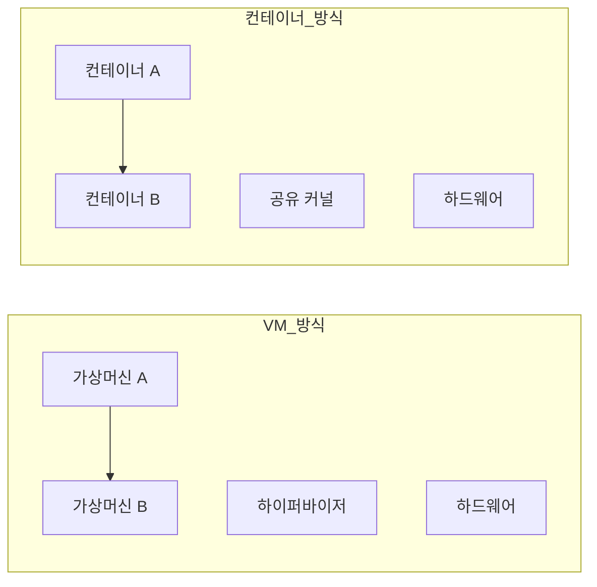

# 컨테이너 개념 (Namespace · cgroup · 격리 경계)

"컨테이너는 경량 VM"은 반은 맞고 반은 틀리다.
컨테이너는 **별도의 OS가 아니라, 커널이 보여주는 뷰를 프로세스별로 바꾼 것**이다.

이 글은 컨테이너의 근본 기제 — Linux namespace·cgroup·capability·MAC —
그리고 **컨테이너와 VM의 격리 경계가 왜 본질적으로 다른지**를 다룬다.

> 런타임(containerd·runc) 동작은 [containerd·runc](../runtime/containerd-runc.md).
> Docker 계층 구조는 [Docker 아키텍처](../docker-oci/docker-architecture.md).

---

## 1. 컨테이너란

컨테이너는 "이미지 + 격리된 프로세스 실행 환경"이다.
기술적으로는 **namespace + cgroup + (선택) capability·seccomp·MAC**의 조합이다.

| 구성 요소 | 역할 |
|---|---|
| Linux namespace | **뭘 볼 수 있는가** — 자원의 "뷰" 격리 |
| cgroup v2 | **얼마나 쓸 수 있는가** — CPU·메모리·IO·PID 제한 |
| capabilities | **뭘 할 수 있는가** — root 권한 세분화 |
| seccomp | **어떤 syscall을 부를 수 있는가** — syscall 필터 |
| AppArmor / SELinux | **어떤 리소스에 접근 가능한가** — MAC |

**하나도 VM 기술이 아니다.** 전부 Linux 커널 기능이며,
컨테이너는 이 기능을 조합해 "격리된 프로세스"를 만든다.

### 1-1. 표준화된 정의 (OCI)

OCI Runtime Spec은 컨테이너를 이렇게 정의한다:

- 루트 파일시스템 (rootfs)
- `config.json` — namespace·mount·resource 등 런타임 설정
- 라이프사이클 — create, start, kill, delete

컨테이너 런타임은 이 config.json을 받아 namespace·cgroup을 만들고
rootfs를 루트로 바꿔 프로세스를 실행한다. **이게 전부다.**

---

## 2. Linux Namespace — "뷰의 격리"

namespace는 **커널 자원의 뷰를 프로세스별로 분리**한다.
컨테이너 안에서 `ps`를 치면 호스트 프로세스가 안 보이는 건 PID namespace 때문이다.

### 2-1. 8종 namespace (커널 5.6+)

| namespace | 격리 대상 | 커널 추가 |
|---|---|---|
| `mnt` | 마운트 포인트 | 2.4.19 (2002) |
| `uts` | hostname, domainname | 2.6.19 |
| `ipc` | POSIX 메시지 큐·SysV IPC | 2.6.19 |
| `pid` | PID 공간 (컨테이너 PID 1) | 2.6.24 |
| `net` | 네트워크 스택 (인터페이스·라우팅·소켓) | 2.6.29 |
| `user` | UID/GID 매핑 | 3.8 |
| `cgroup` | cgroup 루트 | 4.6 |
| `time` | 시스템 시간·부트 시간 | **5.6** (2020) |

> **time namespace 주의**: 커널은 지원하지만 `runc`는 기본으로 활성화하지 않는다.
> 컨테이너 안에서 호스트와 다른 시간을 보이게 하고 싶다면 추가 설정 필요.

### 2-2. 주요 namespace 심층

#### PID namespace

컨테이너 첫 프로세스가 **PID 1**이 된다. 이게 init 역할을 하게 되는데,
보통 애플리케이션은 init으로 설계되지 않았다 — 좀비 수확·시그널 전달을 안 한다.

```dockerfile
# 해결: tini 같은 init을 PID 1에 둔다
ENTRYPOINT ["/tini", "--"]
CMD ["myapp"]
```

Docker는 `--init` 플래그로, Kubernetes는 `shareProcessNamespace: true`나
sidecar로 처리할 수 있다.

> **`/proc` 재마운트 함정**: PID namespace만 바꾸고 `/proc`를 재마운트하지 않으면
> 컨테이너 안 `ps`가 여전히 호스트 PID를 본다. 런타임이 자동으로 처리하지만,
> `--pid=host`로 공유하는 경우 수동 관리가 필요하다.

#### User namespace — 가장 강력한 보안 레이어

컨테이너 안 root(UID 0)를 호스트의 일반 유저로 매핑한다.
**컨테이너 탈출 시 호스트 root가 되지 않는다.**

| 컨테이너 UID | 호스트 UID |
|---|---|
| 0 (root) | 100000 |
| 1 | 100001 |
| 1000 | 101000 |

하지만 volume 마운트·network namespace 상호작용 등 운영 복잡도가 높아
**여전히 프로덕션 채택률은 낮다.** Kubernetes는 1.30에서 beta로 진입했고
**1.33에서 `UserNamespacesSupport`가 기본 활성화**됐지만 여전히 beta다.

rootless 컨테이너(Podman·Docker rootless)는 user namespace 없이는 불가능하다.
"호스트에 데몬·root 없이 컨테이너 실행"의 전제 기술이다.

#### Network namespace

각 컨테이너가 **자체 네트워크 스택**을 가진다 — 인터페이스·라우팅 테이블·iptables·소켓.
veth pair로 호스트 브리지에 연결되는 게 Docker의 기본.

---

## 3. cgroup v2 — "자원 제한"

cgroup(control group)은 프로세스 그룹에 **리소스 상한**을 건다.
namespace가 뷰라면 cgroup은 양이다.

### 3-1. v1 vs v2

| 항목 | cgroup v1 | cgroup v2 |
|---|---|---|
| 계층 | 컨트롤러별 **다중 계층** | **단일 통합 계층** |
| 일관성 | 컨트롤러 간 정책 충돌 가능 | 일관된 트리 |
| rootless | 제한적 | **향상** (delegation) |
| 기본 | RHEL 8- · 구 Docker | **RHEL 9+ · Ubuntu 22.04+ · 최신 K8s** |
| PSI | 없음 | **Pressure Stall Information** |
| CPU 단위 | `cpu.shares` 1~262144 (기본 1024) | `cpu.weight` 1~10000 (기본 100) |

> **마이그레이션 함정**: `cpu.shares`와 `cpu.weight`는 스케일이 다르다.
> v1→v2 변환 시 기본 1024 → 100이 되며, 운영 도구가 이를 자동 변환하지 않으면
> CPU 분배 가중치가 틀어진다.

**2026년 기준 v2가 기본**이다. v1은 레거시 시스템에서만 쓴다.

### 3-2. 주요 컨트롤러

| 컨트롤러 | 제한 항목 |
|---|---|
| `cpu` | CPU 시간 (weight·max) |
| `memory` | RAM·swap (high·max·low·min) |
| `io` | 디스크 읽기/쓰기 대역폭·IOPS |
| `pids` | 프로세스 수 (fork bomb 방지) |
| `cpuset` | 특정 CPU·NUMA 노드 고정 |
| `hugetlb` | Huge page 제한 |

### 3-3. 메모리 제한의 함정

cgroup `memory.max`는 **하드 리밋**이다. 초과 시 OOM killer가 컨테이너 내부에서 발동한다.
호스트 OOM이 아니라 컨테이너 OOM이라서 **로그가 호스트에 안 남을 수 있다**.

```bash
# cgroup v2
/sys/fs/cgroup/<컨테이너>/memory.current   # 현재 사용량
/sys/fs/cgroup/<컨테이너>/memory.max       # 하드 리밋
/sys/fs/cgroup/<컨테이너>/memory.high      # 소프트 리밋 (throttling)
/sys/fs/cgroup/<컨테이너>/memory.pressure  # PSI
```

**PSI(Pressure Stall Information)** 는 cgroup v2의 킬러 피처다.
"이 cgroup이 자원 부족으로 얼마나 정체됐는가"를 퍼센트로 알려준다.
K8s의 Vertical Pod Autoscaler·load shedding 판단 기반으로 쓰인다.

---

## 4. 보안 보조 기제 — capability · seccomp · MAC

namespace·cgroup만으로는 부족하다. 추가 방어선이 필요하다.

### 4-1. Linux Capabilities — root 세분화

전통적으로 root는 **전부 또는 전무**였다. capabilities는 이를 40여 개로 쪼갠다.

| capability | 의미 | 컨테이너에서 |
|---|---|---|
| `CAP_NET_ADMIN` | 네트워크 설정 | CNI만, 앱은 불필요 |
| `CAP_SYS_ADMIN` | **커널 대부분** | **"새로운 root"** — 절대 부여 금지 |
| `CAP_NET_BIND_SERVICE` | 1024 이하 포트 바인딩 | 80·443 바인딩에 필요 |
| `CAP_CHOWN` | 파일 소유자 변경 | 이미지 빌드에 필요, 런타임에 불필요 |

Docker 기본은 **14개 cap 유지**, Kubernetes Pod Security "restricted"는
`CAP_NET_BIND_SERVICE`만 허용하고 나머지 drop.

```yaml
securityContext:
  capabilities:
    drop: ["ALL"]
    add: ["NET_BIND_SERVICE"]
```

### 4-2. seccomp — syscall 필터

Linux는 350+개 syscall을 노출한다(x86_64 기준). 대부분의 앱은 **50개 이하**만 쓴다.
seccomp은 **seccomp-bpf (classic BPF)** 로 syscall 진입을 필터링한다.

Docker·containerd·CRI-O의 **기본 seccomp 프로필**은 약 44개 위험 syscall 차단:
`reboot`, `kexec_load`, `swapon`, `mount`, `module_init` 등.

```json
// 예: 기본 프로필 발췌
{
  "defaultAction": "SCMP_ACT_ALLOW",
  "syscalls": [
    { "names": ["reboot", "kexec_load"], "action": "SCMP_ACT_ERRNO" }
  ]
}
```

**절대 `--security-opt seccomp=unconfined` 쓰지 마라** —
컨테이너 탈출 CVE의 상당수가 이 옵션과 관련됐다.

### 4-3. AppArmor vs SELinux — MAC

MAC(Mandatory Access Control)은 **파일·네트워크 리소스 수준**의 제한이다.
seccomp이 "syscall"이라면 MAC은 "리소스"다.

| 항목 | AppArmor | SELinux |
|---|---|---|
| 모델 | 경로 기반 프로파일 | 라벨 기반 정책 |
| 기본 탑재 | Debian·Ubuntu·SUSE | RHEL·Fedora·CentOS |
| 학습 곡선 | 완만 | 가파름 |
| 표현력 | 중간 | 강함 |
| 컨테이너 기본 프로파일 | `docker-default` | `container_t` |

**Datadog 조사**: 프로덕션 컨테이너의 MAC 적용률은 **기본 프로파일 수준 30%**,
커스텀 프로파일은 10% 미만. "기본만 켜두라" 이게 최소선.

---

## 5. 컨테이너 vs VM — 격리 경계의 본질

### 5-1. 계층 비교



| 항목 | VM | 컨테이너 |
|---|---|---|
| 격리 | **하드웨어 가상화** (VT-x, EPT) | namespace·cgroup (커널 기능) |
| 커널 | VM마다 별도 | **호스트 커널 공유** |
| 부팅 | 분 단위 | 밀리초 단위 |
| 메모리 | OS 포함 수백 MB~ | 프로세스+rootfs 수 MB~ |
| 밀도 | 호스트당 수십 개 | 호스트당 수백~수천 개 |
| 공격 표면 | 하이퍼바이저 API | **450+ syscall + 4000만 줄 커널** |

### 5-2. "컨테이너는 보안 경계가 아니다"

이 문장은 2015년 전후로 업계 합의가 됐고, **2026년에도 여전히 맞다**.

- VM: 하이퍼바이저 탈출은 사실상 희귀 이벤트 (HW 보호 + 작은 API)
- 컨테이너: **커널 취약점 하나면 전체 호스트 장악** — CVE-2022-0185, CVE-2024-1086 등

이게 gVisor·Kata·Firecracker 같은 **샌드박스/microVM 런타임**이 존재하는 이유다.
신뢰할 수 없는 코드(멀티테넌트 SaaS·AI 에이전트 샌드박스)를 돌릴 땐
커널 공유 격리로는 불충분하다.

→ 상세는 [런타임 대안](../runtime/runtime-alternatives.md).

### 5-3. 언제 컨테이너로 충분한가

| 시나리오 | 컨테이너로 충분? |
|---|---|
| 단일 조직의 마이크로서비스 | **충분** |
| 같은 팀의 CI/CD 워크로드 | **충분** |
| 서로 모르는 테넌트 멀티테넌트 | **불충분** — microVM·VM 병행 |
| 신뢰 못 하는 유저 코드 실행 | **불충분** — gVisor·Firecracker |
| 고규제 산업 PCI/HIPAA 격리 | **상황별** — 보통 VM 경계까지 요구 |

---

## 6. 실무 체크리스트

### 런타임 설정 (Docker/K8s 공통)

- [ ] `privileged` 사용 금지 — 모든 cap + seccomp off = 컨테이너 무력화
- [ ] `CAP_SYS_ADMIN` 부여 지양 — "제2의 root"
- [ ] `--security-opt seccomp=unconfined` 금지
- [ ] rootless로 실행 (`runAsNonRoot: true`, `runAsUser: 1000+`)
- [ ] read-only rootfs (`readOnlyRootFilesystem: true`) + 필요 시 emptyDir
- [ ] `--init` 또는 tini로 PID 1 init 처리
- [ ] 메모리·CPU requests/limits 지정
- [ ] capability 실제 부여 확인: `grep Cap /proc/<PID>/status` → `CapEff`·`CapBnd`·`CapAmb` 디코드(`capsh --decode=`)

### 모니터링

- [ ] cgroup v2 `memory.pressure` (PSI) 수집
- [ ] OOM kill 이벤트 알림 (`dmesg` + cgroup events)
- [ ] syscall 감사 (Falco·Tetragon)

---

## 7. 이 카테고리의 경계

- **namespace·cgroup 커널 내부 구현** → `linux/` (예정)
- **K8s Pod Security / securityContext** → `kubernetes/`
- **이미지 서명·공급망 보안** → `security/supply-chain/`
- **Falco·eBPF 런타임 탐지** → `security/` 또는 `observability/`

---

## 참고 자료

- [Linux namespaces(7) man page](https://man7.org/linux/man-pages/man7/namespaces.7.html)
- [Control Group v2 — Linux Kernel Documentation](https://www.kernel.org/doc/html/latest/admin-guide/cgroup-v2.html)
- [OCI Runtime Specification](https://github.com/opencontainers/runtime-spec)
- [Datadog — Container security fundamentals: Isolation & namespaces](https://securitylabs.datadoghq.com/articles/container-security-fundamentals-part-2/)
- [Datadog — Container security fundamentals: AppArmor and SELinux](https://securitylabs.datadoghq.com/articles/container-security-fundamentals-part-5/)
- [Kubernetes — Linux kernel security constraints for Pods](https://kubernetes.io/docs/concepts/security/linux-kernel-security-constraints/)
- [Docker — Seccomp security profiles](https://docs.docker.com/engine/security/seccomp/)
- [AWS EKS Best Practices — Runtime Security](https://aws.github.io/aws-eks-best-practices/security/docs/runtime/)

(최종 확인: 2026-04-20)
