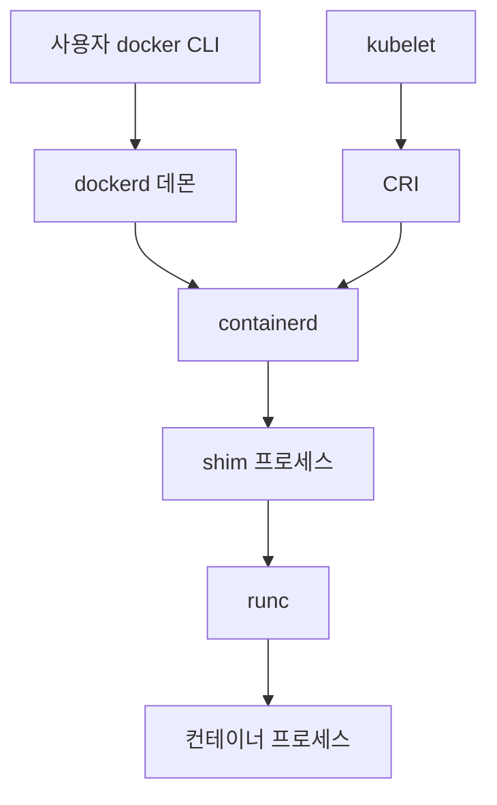
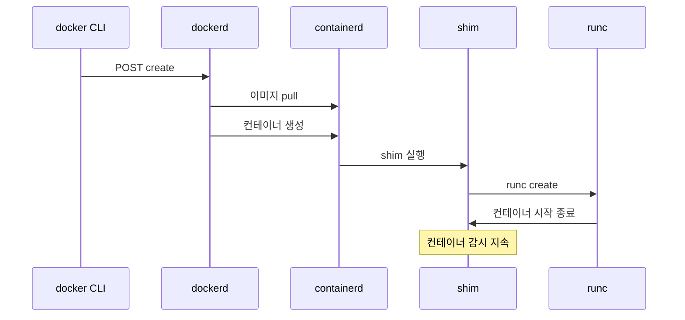
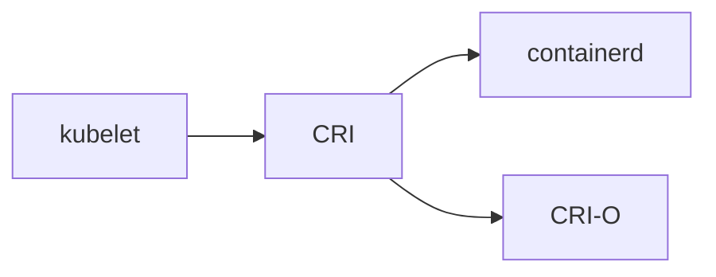
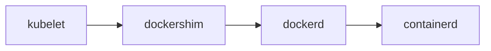

# Docker 아키텍처 (CLI · dockerd · containerd · runc)

Docker는 하나의 바이너리가 아니다.
**CLI → dockerd → containerd → shim → runc**까지 5개 컴포넌트가 계층으로 쌓인 시스템이다.

이 글은 각 계층의 역할, 컨테이너 한 개가 실행되는 호출 경로,
Kubernetes가 왜 Docker가 아닌 **containerd를 직접 쓰는지**,
프로덕션에서 주의할 소켓 보안·rootless 모드를 다룬다.

> 컨테이너 개념·namespace는 [컨테이너 개념](../concepts/container-concepts.md).
> containerd 심층은 [containerd·runc](../runtime/containerd-runc.md).

---

## 1. 전체 계층 구조



| 계층 | 프로세스 | 역할 |
|---|---|---|
| CLI | `docker` | 유저 인터페이스, REST 호출 |
| 데몬 | `dockerd` | API, 이미지 빌드 조율, 네트워크, 볼륨 |
| 런타임 관리 | `containerd` | 이미지·스냅샷·컨테이너 라이프사이클 |
| 감시 | `containerd-shim-runc-v2` | 컨테이너별 감시 프로세스 |
| OCI 런타임 | `runc` | 실제 namespace·cgroup 생성 후 종료 |

**핵심**: runc는 **컨테이너를 만들고 바로 종료**한다.
살아있는 감시 프로세스는 **shim** 하나씩이다.

---

## 2. 각 계층 상세

### 2-1. `docker` CLI

단순한 HTTP 클라이언트다. `/var/run/docker.sock` (Unix) 또는 TCP로 dockerd에 REST 호출.

```bash
docker run nginx
# → POST /containers/create  { Image: "nginx", ... }
# → POST /containers/<id>/start
```

환경변수 `DOCKER_HOST`로 원격 dockerd도 가능 (단, **절대 평문 TCP 노출 금지** — 뒤에서).

### 2-2. `dockerd` — Docker 데몬

Docker의 **브레인**이다. 하지만 실제 컨테이너 실행은 안 한다.

담당:
- REST API 서버 (`/containers`, `/images`, `/volumes`, `/networks`)
- 이미지 빌드 조율 — Docker 23+부터 **BuildKit이 기본 빌더**
- 빌더 드라이버 선택: `docker`(내장) / `docker-container`(컨테이너 buildkitd) / `remote`
- 볼륨 관리
- 네트워크 관리 (bridge, overlay, macvlan)
- 로깅 드라이버

> **이미지 스토어 격리 함정**: dockerd는 `/var/lib/docker`, containerd는
> `/var/lib/containerd`에 **별도 스토어**를 둔다. `docker build`로 만든 이미지가
> 같은 호스트 K8s의 `crictl images`에 안 보인다. Docker 25+ "containerd image store"
> 기능으로 통합 가능(실험).

**안 담당**: 실제 컨테이너 라이프사이클·이미지 스토어 → containerd에 위임.

2020년경 재구조화되면서 "껍데기" 역할에 가까워졌다.
**Docker 28.5 + Buildx 0.29 + BuildKit 0.25**가 2026년 기준 주류.

### 2-3. `containerd` — 실제 런타임 관리

CNCF 졸업 프로젝트. 2017년 Docker가 기증.

담당:
- 이미지 pull·push·storage (content store·snapshotter)
- 컨테이너 라이프사이클 (create, start, kill, delete)
- 네트워크 namespace 설정 준비
- shim 호출

Docker와 **독립적으로 동작**한다 — `ctr` 또는 `nerdctl` CLI로 dockerd 없이 바로 사용 가능.

### 2-4. `containerd-shim-runc-v2` — 감시 프로세스

각 컨테이너마다 **하나씩** 떠있는 경량 프로세스.

왜 필요한가:
- runc는 컨테이너 생성 후 **즉시 종료** — 부모가 없으면 컨테이너가 고아가 됨
- shim이 새 부모가 되어 **stdio 수집·종료 코드 수집**
- containerd·dockerd가 죽어도 **컨테이너는 계속 실행**

**shim v2**가 현재 표준이다. v1 대비 실행 모델이 단순해지고(프로세스 수 감소),
런타임 바이너리 교체(crun·youki)가 쉬워졌다.

```bash
# 실행 중 컨테이너 확인
ps -ef | grep shim
# containerd-shim-runc-v2 -namespace moby -id <abc123>...
```

### 2-5. `runc` — OCI 런타임

**40KB 바이너리** 하나로 namespace·cgroup 생성 후 exec.

- OCI Runtime Spec 구현체 (`config.json` → 컨테이너)
- 실행 시 `runc create` → `runc start` → 즉시 종료
- 저수준의 전부: clone(CLONE_NEW*), cgroup 생성, rootfs 전환

대안: `crun` (C로 작성, 더 빠름·rootless 최적화), `youki` (Rust).

---

## 3. `docker run nginx` — 호출 흐름 추적



| 단계 | 주체 | 결과 |
|---|---|---|
| 1 | CLI | `dockerd`에 REST 요청 |
| 2 | dockerd | 이미지 체크, 없으면 containerd에 pull 지시 |
| 3 | containerd | manifest·레이어 내려받아 snapshotter로 rootfs 구성 |
| 4 | containerd | OCI `config.json` 생성 후 shim 실행 |
| 5 | shim | `runc create/start` 호출 |
| 6 | runc | namespace·cgroup 생성, rootfs pivot, exec 후 **종료** |
| 7 | shim | 컨테이너 PID 부모로 잔류, 로그·종료 코드 수집 |

---

## 4. Docker Engine vs Docker Desktop

| 항목 | Docker Engine | Docker Desktop |
|---|---|---|
| 플랫폼 | Linux (네이티브) | macOS·Windows·Linux |
| 아키텍처 | dockerd 네이티브 | **경량 Linux VM + dockerd** |
| 라이선스 | Apache 2.0 | 상용 (대기업 유료) |
| 추가 기능 | 없음 | Kubernetes, GUI, Extensions, WSL2 통합 |
| 용도 | 서버·CI | **로컬 개발** |

**중요**: macOS·Windows에서 컨테이너는 **VM 안에서 실행**된다.
Linux 호스트와 성능·파일시스템 시맨틱이 다르다(bind mount 성능·inotify 이슈).

2022년부터 Docker Desktop은 대기업(직원 250명+ 또는 매출 $10M+) **유료**.
대안: Podman Desktop, Rancher Desktop, colima.

---

## 5. Kubernetes와 Docker — "dockershim은 왜 사라졌나"

### 5-1. dockershim 제거 타임라인

| 버전 | 시기 | 이벤트 |
|---|---|---|
| K8s 1.20 | 2020-12 | dockershim **deprecation 예고** |
| K8s 1.24 | 2022-05 | dockershim **완전 제거** |
| K8s 1.26 | 2022-12 | CRI v1 API **의무화** |

### 5-2. 왜 제거했나

**CRI (Container Runtime Interface)** 는 Kubernetes가 2016년에 만든 런타임 추상화 API다.
containerd·CRI-O는 CRI를 네이티브 구현한다. Docker는 **CRI가 없어서**
kubelet↔dockerd 사이에 **shim 어댑터**(dockershim)가 필요했다.

**현재 (CRI 네이티브)**



**과거 (dockershim 경유)**



dockerd가 이미 containerd를 쓰고 있었으니 중간 단계 하나를 **없애는 게** 합리적이었다.

**CRI 소켓 경로** (kubelet `--container-runtime-endpoint`):

| 런타임 | 소켓 |
|---|---|
| containerd | `/run/containerd/containerd.sock` |
| CRI-O | `/var/run/crio/crio.sock` |

### 5-3. 실무에 미친 영향

| 항목 | 실제 영향 |
|---|---|
| `docker build`로 만든 이미지 | **영향 없음** — OCI 이미지는 모든 런타임 호환 |
| K8s 클러스터에서 `docker ps` | 안 됨 — `crictl ps` 사용 |
| `docker run`을 K8s에서 | **불가** — kubelet이 containerd·CRI-O만 지원 |
| 로컬 개발·CI의 Docker | **그대로 사용 가능** |

> **흔한 오해**: "Docker는 끝났다" — **틀렸다**. Docker는 이미지 빌드·로컬 개발·
> Compose·Swarm에서 여전히 주류다. 바뀐 건 "K8s의 런타임"뿐이다.

---

## 6. 보안 — Docker 소켓과 rootless

### 6-1. `/var/run/docker.sock` — "호스트 root 권한 전달"

```yaml
# 절대 하지 마라
volumes:
  - /var/run/docker.sock:/var/run/docker.sock
```

이 마운트를 하는 순간, **컨테이너 안 프로세스 = 호스트 root**다.
`docker run --privileged -v /:/host ubuntu chroot /host`로 호스트 장악 가능.

**Read-only 마운트는 해결책이 아니다.** 소켓은 RW 없이도 API 호출이 된다.

| 흔한 사용 케이스 | 대체재 |
|---|---|
| Docker-in-Docker CI | Kaniko, BuildKit daemonless, Buildah |
| 로그 수집 (Fluent Bit 등) | 컨테이너 로그 파일 직접 마운트 |
| 컨테이너 모니터링 | Prometheus cAdvisor, Falco |
| Portainer 등 관리 도구 | 별도 agent 또는 소켓 프록시 (`docker-socket-proxy`) |

### 6-2. Rootless Docker

dockerd·컨테이너를 **non-root 유저**로 실행. 탈출해도 호스트 root가 아님.

```bash
dockerd-rootless-setuptool.sh install
```

| 제약 | 설명 |
|---|---|
| 포트 < 1024 | `CAP_NET_BIND_SERVICE` 필요 (setcap 또는 sysctl) |
| overlay2 | user namespace 지원 커널 필요 (5.11+) |
| AppArmor | 제한적 |
| cgroup v2 | 권장 (delegation) |
| 성능 | slirp4netns/pasta 네트워킹 오버헤드 소폭 |

**Kubernetes 대안**: Pod Security "restricted" + userns(1.33부터 기본 활성화, 여전히 beta)
조합으로 유사한 격리 수준 달성.

### 6-3. TLS 없는 TCP 노출 금지

```bash
# dockerd -H tcp://0.0.0.0:2375  ← 인터넷 공격자가 호스트 장악
```

암호화폐 채굴봇이 **Shodan으로 2375/2376 스캔**한다. 반드시:
- Unix 소켓 유지, 또는
- mTLS (`--tlscacert`, `--tlscert`, `--tlskey`) + 포트 2376

---

## 7. Docker의 대안들

| 도구 | 역할 | 특징 |
|---|---|---|
| **Podman** | Docker 호환 CLI | 데몬리스, 기본 rootless, `pod` 개념 |
| **nerdctl** | containerd용 CLI | Docker 호환 명령, BuildKit 통합 |
| **Buildah** | 이미지 빌드 전용 | 데몬리스, Dockerfile/스크립트 |
| **Docker Compose** | 멀티 컨테이너 | `compose.yaml`, 여전히 주류 |
| **Skopeo** | 이미지 복사·검사 | 레지스트리 간 이동 |

`podman`은 `alias docker=podman` 가능할 정도로 호환성 높음.
로컬 개발·CI 환경에서 Docker Desktop 유료 라이선스를 피하고 싶을 때 1순위 대안.

---

## 8. 실무 체크리스트

- [ ] `docker.sock` 마운트 금지 — 정말 필요하면 **docker-socket-proxy**로 제한
- [ ] `dockerd -H tcp://` 평문 노출 금지 (mTLS 필수)
- [ ] 대기업은 Docker Desktop 라이선스 확인 (또는 Podman/Rancher Desktop)
- [ ] K8s 클러스터에선 `crictl` 사용 (`docker ps` 동작 안 함)
- [ ] rootless 모드 고려 — 특히 CI runner
- [ ] containerd 버전 추적 — K8s와 호환성 매트릭스 확인
- [ ] 호스트 cgroup v2 사용 확인 (`stat -fc %T /sys/fs/cgroup` → `cgroup2fs`)

---

## 9. 이 카테고리의 경계

- **containerd 내부** (snapshotter·CRI·sandbox API) → [containerd·runc](../runtime/containerd-runc.md)
- **OCI 스펙** (Image·Runtime·Distribution) → [OCI 스펙](./oci-spec.md)
- **Kubernetes 런타임 설정** → `kubernetes/`
- **Docker 네트워크 bridge·overlay** → `network/`·`container/` 경계는 이곳에서 개념만

---

## 참고 자료

- [Docker — containerd vs Docker](https://www.docker.com/blog/containerd-vs-docker/)
- [Docker Engine v28 Release Notes](https://docs.docker.com/engine/release-notes/28/)
- [Kubernetes — Dockershim Removal FAQ (Updated)](https://kubernetes.io/blog/2022/02/17/dockershim-faq/)
- [Kubernetes — Container Runtimes](https://kubernetes.io/docs/setup/production-environment/container-runtimes/)
- [OWASP — Docker Security Cheat Sheet](https://cheatsheetseries.owasp.org/cheatsheets/Docker_Security_Cheat_Sheet.html)
- [Quarkslab — Why is Exposing the Docker Socket a Really Bad Idea?](https://blog.quarkslab.com/why-is-exposing-the-docker-socket-a-really-bad-idea.html)
- [Docker — Rootless mode](https://docs.docker.com/engine/security/rootless/)

(최종 확인: 2026-04-20)
