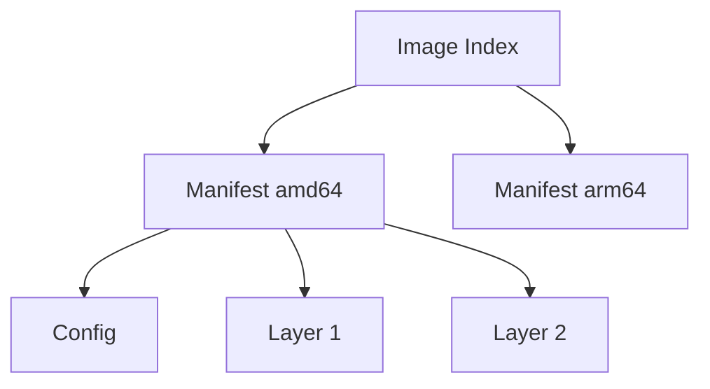
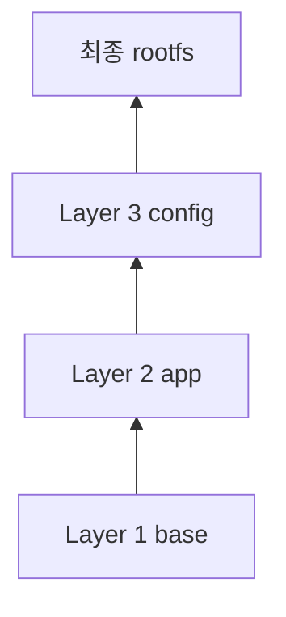
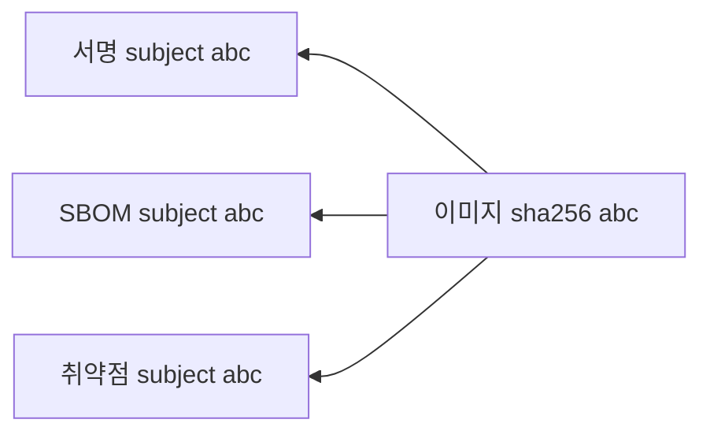
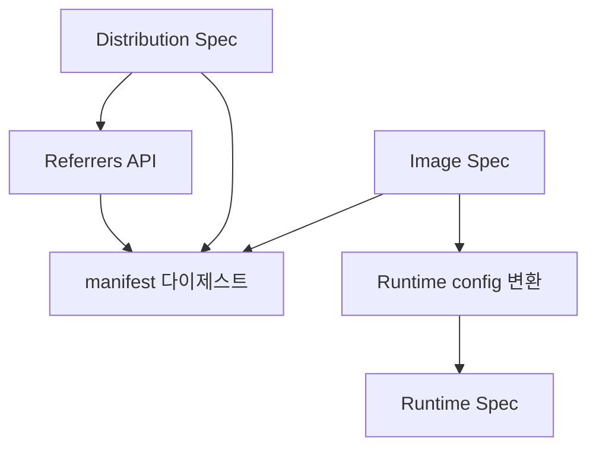

# OCI 스펙 (Image · Runtime · Distribution · Referrers)

OCI(Open Container Initiative)는 **컨테이너 생태계의 IETF**다.
Docker가 독주하던 2015년, Docker·CoreOS·CNCF 등이 **벤더 중립적 표준**을 만들기 위해 설립.

2026년 기준 실질 표준은 **3개 스펙 + 1개 확장**:

| 스펙 | 역할 | 최신 |
|---|---|---|
| **Image Spec** | 이미지 레이아웃·manifest·config | **v1.1.1** (2025-04) |
| **Runtime Spec** | 컨테이너 런타임 인터페이스 | **v1.2.1** |
| **Distribution Spec** | 레지스트리 HTTP API | **v1.1.1** |
| **Referrers API** | 이미지-아티팩트 연결 | v1.1에서 신설 |

> Docker 아키텍처는 [Docker 아키텍처](./docker-architecture.md),
> Artifacts 심화는 [OCI Artifacts](../registry/oci-artifacts.md) 참고.

---

## 1. 왜 OCI인가

### 1-1. "표준이 없으면 벤더 락인"

OCI 이전에는:
- 이미지 = Docker 이미지 형식 (독점)
- 런타임 = Docker Engine
- 레지스트리 API = Docker Registry v2

OCI 이후:
- Docker·Podman·containerd·CRI-O가 **같은 이미지 포맷** 사용
- ECR·GCR·Harbor·Zot이 **같은 HTTP API** 구현
- Kubernetes가 **어떤 런타임도** 꽂을 수 있음

**벤더 중립성이 Kubernetes·클라우드 이식성의 전제 조건**이다.

### 1-2. 멤버 구성 (일부)

AWS, Google, Microsoft, Red Hat, Docker, CNCF, IBM, Oracle, SUSE, NVIDIA —
사실상 컨테이너 관련 모든 주요 벤더.

---

## 2. Image Spec — 이미지의 내부

### 2-1. 핵심 구조

OCI 이미지는 **content-addressable 객체 트리**다.



| 객체 | 역할 | Media Type |
|---|---|---|
| Image Index | 멀티 플랫폼 manifest 목록 | `application/vnd.oci.image.index.v1+json` |
| Manifest | 단일 플랫폼 — config + 레이어 목록 | `application/vnd.oci.image.manifest.v1+json` |
| Config | OS·Arch·env·cmd·layer 순서 | `application/vnd.oci.image.config.v1+json` |
| Layer | tar.gz (diff) | `application/vnd.oci.image.layer.v1.tar+gzip` |

모든 객체는 **SHA256 다이제스트**로 식별된다 — 같은 내용이면 같은 다이제스트.

**Image Index의 `platform` 구조** — 멀티아키 디버깅의 핵심:

| 필드 | 예시 | 비고 |
|---|---|---|
| `architecture` | `amd64`, `arm64`, `riscv64` | 필수 |
| `os` | `linux`, `windows` | 필수 |
| `variant` | `v8`(arm64), `v7`(arm) | arm 계열 구분 |
| `os.version` | `10.0.17763.1234` | Windows 호환성 매칭 |

### 2-2. 실제 manifest 예시 (아티팩트)

아래는 **원본 이미지가 아니라, 그 이미지를 참조하는 아티팩트(SBOM 등)의 manifest**다.
원본 이미지 manifest에는 `subject`·`artifactType`이 없고, 아래처럼 **아티팩트 측**에만 붙는다.

```json
{
  "schemaVersion": 2,
  "mediaType": "application/vnd.oci.image.manifest.v1+json",
  "artifactType": "application/vnd.example.sbom.v1+json",
  "config": {
    "mediaType": "application/vnd.example.sbom.config.v1+json",
    "digest": "sha256:b5d0...",
    "size": 7023
  },
  "layers": [
    {
      "mediaType": "application/spdx+json",
      "digest": "sha256:e692...",
      "size": 32654
    }
  ],
  "subject": {
    "mediaType": "application/vnd.oci.image.manifest.v1+json",
    "digest": "sha256:abc...",
    "size": 1024
  }
}
```

`subject`와 `artifactType`은 **v1.1 신규 필드**. 아래 Referrers API 참고.
`artifactType`은 **Image Index 레벨에서도 지원**되어 아티팩트 계층적 묶음이 가능하다.

### 2-3. 레이어는 어떻게 합쳐지나



- 각 레이어는 **이전 레이어 대비 변경사항 (diff)** 을 tar로 담는다
- 삭제는 **whiteout 파일**(`.wh.filename`)로 표시
- 런타임이 `overlayfs`·`stargz`·`nydus` 등 스냅샷 드라이버로 병합

### 2-4. Config — 이미지의 메타데이터

```json
{
  "architecture": "amd64",
  "os": "linux",
  "config": {
    "Env": ["PATH=/usr/local/sbin:..."],
    "Entrypoint": ["/app"],
    "WorkingDir": "/app",
    "User": "1000:1000"
  },
  "rootfs": {
    "type": "layers",
    "diff_ids": ["sha256:...", "sha256:..."]
  },
  "history": [...]
}
```

컨테이너 실행 시 이 config가 **OCI Runtime Spec의 config.json**으로 변환된다.

---

## 3. Runtime Spec — 컨테이너를 "실행"한다는 것

### 3-1. 핵심 정의

런타임은 다음을 구현해야 한다:

1. **번들**: `config.json` + `rootfs/`가 담긴 디렉터리
2. **라이프사이클**: create → start → kill → delete
3. **상태**: creating, created, running, stopped

런타임에 "이미지"라는 개념은 없다. **이미지를 번들로 변환하는 건 상위 도구의 책임**(containerd 등).

### 3-2. config.json 핵심 필드

| 필드 | 의미 |
|---|---|
| `process.args` | 실행할 명령 |
| `process.env` | 환경변수 |
| `process.user` | UID/GID |
| `process.capabilities` | bounding·effective·permitted·inheritable·ambient |
| `linux.namespaces` | 생성할 namespace 목록 |
| `linux.resources` | cgroup 리소스 제한 |
| `linux.seccomp` | seccomp 프로필 |
| `linux.maskedPaths` | 마운트하되 숨길 경로 (`/proc/kcore` 등) |
| `linux.readonlyPaths` | read-only 경로 |
| `hooks` | prestart·poststart·poststop 스크립트 |

### 3-3. v1.2 주요 신규 항목

- **`scheduler`**: Linux CFS/DEADLINE 등 프로세스 스케줄러 설정
- **`ioPriority`**: I/O 우선순위(`IOPRIO_CLASS_*`)
- **time namespace** 지원 명문화 (런타임 구현 여부는 별개)
- v1.2.1: **CPU affinity** 필드 추가

### 3-4. 구현체

| 런타임 | 언어 | 특징 |
|---|---|---|
| `runc` | Go | 레퍼런스 구현 |
| `crun` | C | 더 빠름, rootless 친화적 |
| `youki` | Rust | 메모리 안전성 |
| `gVisor (runsc)` | Go | 유저스페이스 커널 |
| `Kata (kata-runtime)` | Go | microVM 래핑 |

**모두 같은 config.json을 먹는다.** 이게 OCI의 힘이다.

---

## 4. Distribution Spec — 레지스트리 API

### 4-1. HTTP 엔드포인트

레지스트리는 **`/v2/` 접두사**로 일련의 엔드포인트를 제공해야 한다.

| 엔드포인트 | 메서드 | 용도 |
|---|---|---|
| `/v2/` | GET | API 지원 확인 |
| `/v2/<name>/manifests/<ref>` | GET/PUT/DELETE | Manifest 조작 |
| `/v2/<name>/blobs/<digest>` | GET/HEAD | Blob 다운로드 |
| `/v2/<name>/blobs/uploads/` | POST | Blob 업로드 시작 |
| `/v2/<name>/tags/list` | GET | 태그 목록 |
| `/v2/<name>/referrers/<digest>` | GET | **v1.1 신규** — 연결된 아티팩트 |

> **`Docker-Content-Digest` 헤더**: manifest/blob 응답에 필수. CDN 캐시 무효화·
> 무결성 검증의 기반이다. ETag와 함께 쓰인다.

### 4-2. 인증 — Bearer Token

```http
GET /v2/library/alpine/manifests/latest
→ 401 WWW-Authenticate: Bearer realm="https://auth.example/token",service="registry",scope="..."

GET https://auth.example/token?service=registry&scope=repository:library/alpine:pull
→ 200 { "token": "eyJ..." }

GET /v2/library/alpine/manifests/latest
  Authorization: Bearer eyJ...
→ 200 { manifest }
```

레지스트리 **인증 실패 디버깅 시 이 흐름을 기억하라** — `docker login` 문제의 90%는 토큰 스코프 불일치.

### 4-3. 업로드는 chunked

blob 업로드는 POST로 세션을 열고 PATCH로 조각을 올린 뒤 PUT으로 종료.
대형 레이어·불안정 네트워크에서 **재개 가능**.

---

## 5. Referrers API — v1.1의 킬러 피처

### 5-1. 문제 상황

과거:
- 이미지 서명(cosign), SBOM, 취약점 스캔 결과를 어디에 저장?
- 기존 해결책: **별도 태그**(`<이미지>.sig`, `<이미지>.sbom`) — 태그 오염
- 별도 레지스트리 경로 — 이미지와 분리되어 관리 혼란

### 5-2. v1.1 해결책

**아티팩트가 이미지를 참조**한다. 이미지는 변경 없음.



```bash
# 이미지에 연결된 모든 아티팩트 조회
GET /v2/library/nginx/referrers/sha256:abc...
# → 응답: application/vnd.oci.image.index.v1+json
#   manifests[] 각 항목에 artifactType 포함 → 클라이언트에서 필터링 가능

# 서버 측 artifactType 필터
GET /v2/library/nginx/referrers/sha256:abc...?artifactType=application/vnd.cyclonedx+json
```

응답은 **Image Index와 같은 구조**를 재활용한다 — 아티팩트 manifest 목록을 담는 컨테이너 역할.

### 5-3. 레지스트리 지원 현황

| 레지스트리 | Referrers API | 비고 |
|---|---|---|
| Distribution (registry:3) | ✅ | 레퍼런스 구현 |
| Harbor 2.10+ | ✅ | |
| ECR | ✅ | 2024 지원 |
| GAR (Google) | ✅ | |
| ACR | ✅ | |
| Quay | ✅ | Red Hat 공식 발표 |
| Docker Hub | ✅ | |
| JFrog | ✅ | |
| Zot | ✅ | 네이티브 지원 |

**2024년부터 사실상 모든 메이저 레지스트리가 지원**한다.

### 5-4. 폴백 메커니즘

Referrers API가 없는 구식 레지스트리를 위한 **태그 스키마 폴백**:
`sha256-<digest>` 형식 태그로 인덱스를 저장. ORAS·cosign 등이 자동으로 폴백한다.

---

## 6. Artifacts — "이미지가 아닌 것도 OCI로"

v1.1에서 `artifactType`이 추가되면서, 레지스트리는 **임의의 콘텐츠 배포**도 가능해졌다.

| 아티팩트 | artifactType |
|---|---|
| Helm 차트 | `application/vnd.cncf.helm.config.v1+json` |
| CNAB | `application/vnd.cnab.manifest.v1+json` |
| Wasm 모듈 | `application/vnd.wasm.content.layer.v1+wasm` |
| SBOM (SPDX) | `application/spdx+json` |
| SBOM (CycloneDX) | `application/vnd.cyclonedx+json` |
| Cosign 서명 | `application/vnd.dev.cosign.artifact.sig.v1+json` |
| in-toto 증명 | `application/vnd.in-toto+json` |

→ 실제 저장·조회는 [OCI Artifacts](../registry/oci-artifacts.md) 참고.

---

## 7. 스펙 간 관계 요약



| 흐름 | 스펙 |
|---|---|
| 이미지 **생성**(build) | Image Spec |
| 이미지 **저장·배포** | Distribution Spec |
| 이미지 **실행** | Runtime Spec (Image→config 변환 경유) |
| 아티팩트 **연결** | Referrers API (Distribution v1.1) |

---

## 8. 실무 영향

### 언제 이걸 의식해야 하나

| 상황 | 왜 중요 |
|---|---|
| 레지스트리 선택 | Referrers API 지원 여부 → 서명·SBOM 운영 가능성 |
| 멀티 아키텍처 빌드 | Image Index로 amd64·arm64·riscv64 한 태그에 묶기 |
| 서명 검증 파이프라인 | cosign·Notation은 Referrers API 전제 |
| SBOM 정책 | SLSA 레벨 3+는 이미지에 증명 첨부 필요 |
| 레지스트리 자체 구축 | `distribution/distribution` 또는 Zot가 레퍼런스 |

### 점검 포인트

- [ ] 레지스트리가 Distribution Spec **v1.1 지원**인가 (`/referrers/` 엔드포인트)
- [ ] `docker manifest inspect <image>`로 manifest 직접 확인 가능
- [ ] `oras discover <image>`로 연결된 아티팩트 확인
- [ ] OCI v1.1 미지원 레지스트리 폴백 태그(`sha256-<digest>`) 감시

---

## 9. 이 카테고리의 경계

- **실제 아티팩트 저장 사례·ORAS** → [OCI Artifacts](../registry/oci-artifacts.md)
- **cosign·Sigstore 서명 정책** → `security/supply-chain/`
- **레지스트리 제품 비교** → [레지스트리 비교](../registry/registry-comparison.md)
- **런타임 config.json 실행 내부** → [containerd·runc](../runtime/containerd-runc.md)

---

## 참고 자료

- [OCI — Image and Distribution Specs v1.1 Release Announcement](https://opencontainers.org/posts/blog/2024-03-13-image-and-distribution-1-1/)
- [OCI Image Spec (GitHub)](https://github.com/opencontainers/image-spec)
- [OCI Runtime Spec (GitHub)](https://github.com/opencontainers/runtime-spec)
- [OCI Distribution Spec (GitHub)](https://github.com/opencontainers/distribution-spec)
- [AWS — Diving into OCI Image and Distribution 1.1 Support in ECR](https://aws.amazon.com/blogs/opensource/diving-into-oci-image-and-distribution-1-1-support-in-amazon-ecr/)
- [Red Hat — OCI Referrers API on Quay.io](https://www.redhat.com/en/blog/announcing-open-container-initiativereferrers-api-quayio-step-towards-enhanced-security-and-compliance)
- [ORAS — Attached Artifacts](https://oras.land/docs/concepts/reftypes/)

(최종 확인: 2026-04-20)
