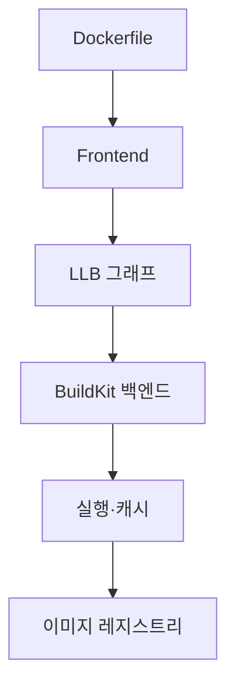

# BuildKit 기본 (LLB · Buildx · 캐시 · SBOM)

Docker 23+ 이후 **기본 빌더는 BuildKit**이다. 레거시 `docker build`는 잊어라.
BuildKit은 단순 속도 개선이 아니라 **병렬 그래프 실행·원격 빌더·캐시·SBOM·멀티 플랫폼**을
전부 담당하는 현대적 빌드 엔진이다.

이 글은 LLB·Buildx·캐시 마운트·시크릿·SBOM/provenance·멀티 아키텍처 빌드를 다룬다.

> 이미지 크기·레이어 전략은 [이미지 최적화](./image-optimization.md).
> 재현 가능성은 [재현 가능 빌드](./reproducible-builds.md).

---

## 1. BuildKit이 해결한 문제

기존 `docker build`의 한계:

| 문제 | BuildKit 해결 |
|---|---|
| 순차 실행 | **병렬 그래프 실행** |
| 캐시가 단순 레이어 기반 | 콘텐츠 주소 캐시, `RUN --mount=type=cache` |
| 시크릿을 레이어에 남김 | `RUN --mount=type=secret` — 레이어에 안 남음 |
| 빌드 시 SSH 키 노출 | `--mount=type=ssh` — 에이전트 전달 |
| 멀티 아키 매번 재실행 | 하나의 명령으로 amd64·arm64 동시 |
| 로컬 dockerd 의존 | **원격 빌더**·K8s 빌더 |
| SBOM·서명 외부 도구 | `--attest` 내장 |

---

## 2. 전체 구조



| 계층 | 역할 |
|---|---|
| **Frontend** | DSL을 LLB로 변환 (dockerfile, mockerfile 등) |
| **LLB** | Low-Level Build — 빌드 그래프 중간 표현 |
| **Worker** | OCI·containerd worker가 실제 실행 |
| **Cache** | local, inline, registry, gha, s3, azblob |

### 2-1. LLB — BuildKit의 중간 언어

LLB는 **Protobuf 기반 DAG**다. "이 단계가 이 단계를 의존한다"를 표현.

장점:
- **병렬화 가능** — 의존 없는 단계는 동시 실행
- **언어 독립** — Dockerfile 외에 Earthly, Buildpacks 등도 LLB로 컴파일
- **검증 가능** — 동일 LLB = 동일 빌드 (캐시 기반)

```go
// LLB 예시 (Go SDK)
state := llb.Image("alpine").
    Run(llb.Shlex("apk add curl")).Root()
```

2026년 LLB 추가 기능:
- `docker-image+blob://`·`oci-layout+blob://` 소스 타입
- HTTP 소스의 **커스텀 체크섬·PGP 서명 검증**

---

## 3. Buildx — CLI 진입점

Docker CLI 플러그인. **`docker build`는 내부적으로 buildx를 호출**한다 (Docker 23+).

### 3-1. 빌더 드라이버

| 드라이버 | 특징 | 용도 |
|---|---|---|
| `docker` | dockerd 내장 BuildKit | 기본, 단일 호스트 |
| `docker-container` | **별도 buildkitd 컨테이너** | 멀티 플랫폼·캐시 내보내기 필요 시 |
| `kubernetes` | K8s 파드로 buildkitd | CI 러너 확장, 공유 캐시 |
| `remote` | 기존 buildkitd 주소 지정 | 중앙 빌더, 팜 |

**중요**: 기본 image store 상태의 `docker` 드라이버는 **멀티 플랫폼·일부 cache export 제약**.
Docker 26+ **containerd image store** 활성화 시 상당 부분 해소되지만,
프로덕션 CI는 여전히 `docker-container`·`kubernetes`·`remote`가 기본 선택.

```bash
docker buildx create --name mybuilder --driver docker-container --use
```

### 3-2. Bake — 선언적 빌드

여러 이미지를 한 번에, 변수·합성으로.

```hcl
# docker-bake.hcl
target "api" {
  dockerfile = "Dockerfile.api"
  platforms  = ["linux/amd64", "linux/arm64"]
  tags       = ["ghcr.io/org/api:${VERSION}"]
}

target "web" {
  inherits = ["api"]
  dockerfile = "Dockerfile.web"
}

group "default" { targets = ["api", "web"] }
```

```bash
docker buildx bake
```

Compose 스타일이지만 **빌드 전용**. Compose `build:` 섹션과 호환되는 변환도 제공.

---

## 4. 캐시 — 현대적 빌드의 핵심

### 4-1. 캐시 유형

| 유형 | 메커니즘 | 언제 |
|---|---|---|
| **inline** | 이미지 manifest에 캐시 포함 | 소규모 프로젝트, 단순 |
| **registry** | 별도 이미지 태그로 캐시 저장 | **가장 권장** — CI 공유 |
| **local** | 로컬 디렉터리 | 로컬 개발 |
| **gha** | GitHub Actions 캐시 | GHA 전용 |
| **s3 / azblob** | 오브젝트 스토리지 | 자체 CI |

### 4-2. Registry 캐시 예시

```bash
docker buildx build \
  --cache-from type=registry,ref=ghcr.io/org/app:cache \
  --cache-to type=registry,ref=ghcr.io/org/app:cache,mode=max \
  --tag ghcr.io/org/app:v1 --push .
```

`mode=max`: **모든 중간 레이어 저장** (빌드 후속 히트율 ↑, 스토리지 ↑)
`mode=min` (기본): 최종 이미지 레이어만.

> **스토리지 폭증 주의**: 멀티 플랫폼 + `mode=max`는 레지스트리 비용이
> 수 GB/일 단위로 쌓인다. **별도 캐시 태그**(`:cache-<branch>`) + retention GC 정책 필수.

### 4-3. 캐시 마운트 — 빌드 간 아티팩트 공유

Dockerfile 안에서 **패키지 매니저 캐시**를 빌드 간 유지:

```dockerfile
# Go 모듈 캐시
RUN --mount=type=cache,target=/go/pkg/mod \
    --mount=type=cache,target=/root/.cache/go-build \
    go build -o app ./...

# apt
RUN --mount=type=cache,target=/var/cache/apt \
    --mount=type=cache,target=/var/lib/apt \
    apt-get update && apt-get install -y curl
```

| 장점 | 주의 |
|---|---|
| 재빌드 시 의존성 재다운로드 없음 | **최종 레이어에 남지 않음** — 런타임 사용 불가 |
| 10배+ 빨라짐 | BuildKit 워커마다 독립 (공유 원하면 remote 빌더) |

### 4-4. 캐시가 안 맞을 때

| 증상 | 원인 |
|---|---|
| 매번 전체 재빌드 | `COPY . .`를 상단에 둠 → 파일 하나만 바뀌어도 무효 |
| CI에선 캐시 미스 | 빌드마다 새 runner → registry 캐시 필요 |
| `--no-cache` 습관 | **없애라** — CI 디버깅용이지 일상 사용 아님 |

---

## 5. 시크릿·SSH — 안전한 빌드 입력

### 5-1. 시크릿 마운트

```dockerfile
RUN --mount=type=secret,id=npm_token \
    NPM_TOKEN=$(cat /run/secrets/npm_token) npm install
```

```bash
docker buildx build --secret id=npm_token,env=NPM_TOKEN .
```

**절대 하지 말 것**:
- `ARG NPM_TOKEN` → 이미지 히스토리에 남음
- `ENV NPM_TOKEN` → 이미지에 영구 노출
- `.dockerignore` 누락으로 `.env` 복사됨

### 5-2. SSH 에이전트 전달

```dockerfile
RUN --mount=type=ssh git clone git@github.com:org/private.git
```

```bash
docker buildx build --ssh default .
```

SSH 키가 **이미지에 남지 않는다**.

---

## 6. 멀티 플랫폼 빌드

### 6-1. 작동 원리

한 번의 `docker buildx build --platform=linux/amd64,linux/arm64,linux/arm/v7`가
**3개 플랫폼 이미지를 만들어 OCI Image Index(매니페스트 리스트)로 묶어 푸시**.

### 6-2. 실행 방식 2가지

| 방식 | 성능 | 설정 |
|---|---|---|
| **QEMU 에뮬레이션** | 느림, binfmt_misc 등록·커널 의존 이슈 빈발 | `docker/setup-qemu-action` + 커널 |
| **네이티브 노드 팜** | **빠름** (권장) | arm64 노드를 빌더에 추가 |

QEMU는 긴 컴파일(Rust·C++·Go CGO)에서 **10배+ 느려지고 드물게 hang**한다.
프로덕션 CI는 arm64 네이티브 러너 확보가 투자 대비 수익이 큰 영역.

네이티브 팜 예시:

```bash
docker buildx create --name farm --driver docker-container
docker buildx create --name farm --append --platform=linux/arm64 ssh://arm-node
```

### 6-3. 크로스 빌드 Dockerfile 팁

```dockerfile
FROM --platform=$BUILDPLATFORM golang:1.23 AS build
ARG TARGETOS TARGETARCH
RUN GOOS=$TARGETOS GOARCH=$TARGETARCH go build -o /app

FROM alpine
COPY --from=build /app /app
```

- `$BUILDPLATFORM`: 빌더 플랫폼 (빠름)
- `$TARGETPLATFORM`·`$TARGETOS`·`$TARGETARCH`: 대상 플랫폼
- 컴파일 단계는 **빌더에서 크로스 컴파일**, 최종 이미지만 target으로 복사

---

## 7. SBOM·Provenance — 공급망 보안

BuildKit 0.11+부터 **빌드 메타데이터 첨부**가 내장됐다.

### 7-1. 생성

```bash
docker buildx build \
  --sbom=true \
  --provenance=mode=max \
  --tag ghcr.io/org/app:v1 --push .
```

또는 세분화:

```bash
--attest type=sbom
--attest type=provenance,mode=max
```

`mode=max`: **Dockerfile·환경변수·소스 URL 전부 포함** (SLSA L3 지향)
`mode=min`: 최소 메타데이터 (기본)

### 7-2. 저장 위치

OCI Image v1.1 **Referrers API**로 이미지에 연결된다. 별도 태그 오염 없음.
→ [OCI 스펙 §5](../docker-oci/oci-spec.md#5-referrers-api--v11의-킬러-피처)

```bash
docker buildx imagetools inspect --format "{{ json .SBOM }}" ghcr.io/org/app:v1
```

### 7-3. 주요 한계 (2026)

- **생성된 attestation은 서명되지 않음** — 푸시 권한이 있으면 위조 가능
- 별도로 **cosign·Notation으로 서명** 필요 (공급망 엄격 시)
- SLSA L3 달성하려면 **빌드 환경 자체의 무결성**(isolated builder)도 필요

```bash
cosign attest --predicate sbom.spdx.json \
  --type spdxjson ghcr.io/org/app:v1
```

→ 심화는 `security/supply-chain/` 참고.

---

## 8. BuildKit 배포 모드

### 8-1. 자체 구축 고려 시

| 모드 | 장점 | 단점 |
|---|---|---|
| `docker-container` 로컬 | 간단 | 공유 캐시 없음 |
| K8s의 buildkitd StatefulSet | 캐시·계산 공유 | 운영 부담 |
| Depot.dev · Dagger · BuildJet | 관리형 | 비용·데이터 외부 |
| GitHub Actions Large Runners | 간편 | 캐시 세팅 필요 |

### 8-2. K8s 빌더 예시 핵심

- PVC로 캐시 디렉터리 보존
- `stargz` snapshotter로 base 이미지 빠른 풀
- rootless 모드 (`--oci-worker-rootless`) 고려
- `docker buildx create --driver kubernetes ...`

---

## 9. 실무 체크리스트

- [ ] `docker build`가 BuildKit 쓰는지 확인 (`DOCKER_BUILDKIT=1` 또는 Docker 23+)
- [ ] CI에서 **registry 캐시** 설정 (`mode=max`)
- [ ] 시크릿은 `--mount=type=secret`, 절대 ARG/ENV 금지
- [ ] 패키지 매니저 캐시 마운트 적용 (apt, pip, npm, go mod 등)
- [ ] 멀티 플랫폼 빌드는 **네이티브 팜** 우선
- [ ] `--sbom=true --provenance=mode=max` 활성화
- [ ] 서명은 **cosign 별도** 단계 (BuildKit attestation은 미서명)
- [ ] `.dockerignore`로 `.git`·`.env`·`node_modules` 제외
- [ ] BuildKit **entitlement**(`security.insecure`·`network.host`) 기본 꺼짐 유지
- [ ] K8s 빌더는 **rootless** 모드 — 멀티테넌트 CI의 사실상 표준

---

## 10. 이 카테고리의 경계

- **이미지 크기 최적화·multi-stage** → [이미지 최적화](./image-optimization.md)
- **bit-identical 재현 빌드** → [재현 가능 빌드](./reproducible-builds.md)
- **cosign·Sigstore 서명 정책** → `security/supply-chain/`
- **CI에서의 BuildKit 사용 패턴** → `cicd/`

---

## 참고 자료

- [BuildKit (moby/buildkit)](https://github.com/moby/buildkit)
- [Docker Buildx (docker/buildx)](https://github.com/docker/buildx)
- [Docker — BuildKit 공식 문서](https://docs.docker.com/build/buildkit/)
- [Docker — SBOM Attestations](https://docs.docker.com/build/metadata/attestations/sbom/)
- [Docker — SLSA Provenance Attestations](https://docs.docker.com/build/metadata/attestations/slsa-provenance/)
- [Docker — Generate SBOMs with BuildKit](https://www.docker.com/blog/generate-sboms-with-buildkit/)
- [ReversingLabs — BuildKit Attestation: How it Works and Key Limitations](https://www.reversinglabs.com/blog/dockers-buildkit-adds-supply-chain-security-features)

(최종 확인: 2026-04-20)
