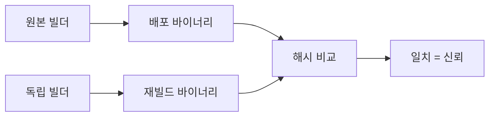

# 재현 가능 빌드 (SOURCE_DATE_EPOCH · apko · Nix)

**재현 가능 빌드(Reproducible Build)**: 동일 소스·동일 config를 빌드하면 **bit-identical(비트 단위 동일)** 결과가 나오는 빌드.

왜 이게 공급망 보안의 핵심인가?
- 서명된 바이너리가 **실제로 소스에서 왔는지** 제3자가 검증 가능
- 악성 컴파일러·백도어된 빌더가 끼어들면 해시가 달라져 **즉시 탐지**
- SLSA Level 3+의 전제이자, 오픈소스 커뮤니티의 신뢰 기반

이 글은 컨테이너 이미지를 재현 가능하게 만드는 기법을 다룬다.

> BuildKit·attestation은 [BuildKit 기본](./buildkit-basics.md).
> 이미지 최적화는 [이미지 최적화](./image-optimization.md).
> 서명·SLSA 전략 심화는 `security/supply-chain/`.

---

## 1. 왜 어려운가 — 비결정성의 원천

"같은 Dockerfile로 빌드했는데 해시가 왜 다르지?"

```
Build 1: sha256:abc123...
Build 2: sha256:def456...  ← 같은 코드인데
```

주된 비결정성 원천:

| 원천 | 영향 |
|---|---|
| **타임스탬프** | 파일 mtime, manifest `created` |
| **파일 순서** | tar 아카이브의 파일 나열 순서 |
| **UID/GID** | 빌더 환경별 다름 |
| **패키지 인덱스** | apt·apk 리포지토리 상태 |
| **네트워크 리소스** | DNS 해상도, CDN 엣지 |
| **의존성 버전** | `latest`, 범위 지정자(`^1.0`) |
| **컴파일러 플래그** | 빌드 경로·PID 포함 |
| **환경변수** | `$HOSTNAME`, `$USER` 같은 값 |

---

## 2. SOURCE_DATE_EPOCH — 타임스탬프 고정의 표준

reproducible-builds.org가 2014년 제안한 **업계 공통 환경변수**.
빌드 도구가 이 값을 UNIX epoch로 읽어 **모든 타임스탬프를 이 값으로** 설정한다.

### 2-1. 설정

```bash
# Git 커밋 시각을 epoch로
export SOURCE_DATE_EPOCH=$(git log -1 --pretty=%ct)

# 또는 명시적 고정 시각
export SOURCE_DATE_EPOCH=1700000000
```

### 2-2. 어느 도구가 지원하나

| 도구 | 지원 | 비고 |
|---|---|---|
| **BuildKit 0.11+** | ✅ | manifest·config `created` + tar mtime 설정 |
| GCC·Clang | ✅ | 바이너리 타임스탬프·`__DATE__` 매크로 |
| dpkg·rpm | ✅ | 패키지 생성 시각 |
| tar | ✅ (GNU 1.32+) | `--mtime` 플래그 자동화 |
| Go 컴파일러 | 부분 | `-trimpath` 병행 필요 |
| apko | ✅ | 네이티브 지원 |
| **nix** | ✅ | 전체 파이프라인 재현성 |

### 2-3. BuildKit에서 사용

```bash
SOURCE_DATE_EPOCH=$(git log -1 --pretty=%ct) \
docker buildx build \
  --build-arg SOURCE_DATE_EPOCH=$SOURCE_DATE_EPOCH \
  --output type=docker,rewrite-timestamp=true \
  --tag app:v1 .
```

`rewrite-timestamp=true`가 **이미지 레이어 tar 안 파일들의 mtime도 재작성**.
이 옵션 없으면 manifest만 고정되고 레이어 내부는 여전히 가변.

대상 메타데이터:
- 이미지 config의 `created` 필드
- manifest의 `created` 주석·`org.opencontainers.image.created` 라벨
- 각 레이어 tar 엔트리의 mtime

---

## 3. Go·Rust·C 컴파일러 플래그

### 3-1. Go

```dockerfile
RUN CGO_ENABLED=0 \
    go build \
      -trimpath \            # 빌드 경로 제거
      -buildvcs=false \      # VCS 정보 제외
      -ldflags="-s -w -buildid=" \  # 디버그·buildid 제거
      -o /out/app ./cmd/server
```

- `-trimpath`: `/home/runner/work/...` 같은 빌드 환경 경로 제거
- `-buildvcs=false`: Go 1.18+가 기본 삽입하는 VCS 정보 제외 — dirty worktree나 상이한 체크아웃 경로가 해시를 바꿈
- `-buildid=`: 링커가 생성하는 unique ID 제거

> **대안**: CI에서 `git archive` → tarball → 클린 sandbox 빌드로 하면
> `-buildvcs=auto`(기본)를 유지해도 재현 가능. VCS 정보를 **남기되 일관성을 보장**하는 방식.

### 3-2. Rust

```toml
# Cargo.toml
[profile.release]
lto = true
codegen-units = 1          # 병렬 빌드 차이 제거

# Cargo config
[build]
rustflags = [
  "--remap-path-prefix", "/home/runner/work=.",
]
```

`RUSTFLAGS=-C target-feature=+crt-static`로 정적 링크까지 하면 더 엄격.

### 3-3. C/C++ (gcc·clang)

```makefile
CFLAGS += -ffile-prefix-map=$(PWD)=.   # 소스 경로 제거
# gcc/clang 10+는 SOURCE_DATE_EPOCH 자동 반영
```

---

## 4. apko — Chainguard의 재현 빌드 도구

`apko`는 **Dockerfile 없이** declarative YAML로 이미지를 만든다.
Chainguard Images의 근간.

```yaml
# apko.yaml
contents:
  repositories:
    - https://packages.wolfi.dev/os
  keyring:
    - https://packages.wolfi.dev/os/wolfi-signing.rsa.pub
  packages:
    - ca-certificates-bundle
    - tzdata
    - myapp=1.2.3-r0

accounts:
  users:
    - username: nonroot
      uid: 65532

entrypoint:
  command: /usr/bin/myapp

archs:
  - amd64
  - arm64
```

```bash
apko build apko.yaml myapp:v1 myapp-v1.tar
```

### 4-1. 왜 재현 가능한가

- **빌드 순서가 결정적** — YAML에서 그래프 계산
- **패키지 해시 기반** — 버전+해시로 의존성 고정
- **SOURCE_DATE_EPOCH 네이티브 지원**
- **no network during build** — 사전에 인덱스 스냅샷 고정

### 4-2. Dockerfile 대체로 적합한가

**적합**: base 이미지, 시스템 도구, Go/Rust 정적 바이너리 패키징
**부적합**: 복잡한 npm·pip·cargo 의존성 그래프, C 확장 컴파일

Chainguard는 자체 **melange**(패키지 빌드, hermetic sandbox, SOURCE_DATE_EPOCH 지원)로 APK를 만들고
**apko**로 이미지를 조립한다. 이 2단계가 Chainguard "알려진 CVE 거의 0" 파이프라인의 기반.

---

## 5. Nix — 가장 엄격한 재현 빌드

Nix는 **전체 빌드 파이프라인을 순수 함수**로 본다.
입력(소스·의존성 해시) → 출력(바이너리)이 수학적으로 결정됨.

### 5-1. 컨테이너 이미지 생성

```nix
# default.nix
let
  pkgs = import <nixpkgs> { };
in
pkgs.dockerTools.buildImage {
  name = "myapp";
  tag = "v1";
  contents = [ pkgs.coreutils pkgs.curl ];
  config = {
    Cmd = [ "/bin/myapp" ];
  };
  created = "1970-01-01T00:00:00Z";  # epoch 고정
}
```

```bash
nix-build -A default
docker load < result
```

### 5-2. 장단점

| 장점 | 단점 |
|---|---|
| **r13y.com 기준 최소 환경 99%+ 재현율** | 학습 곡선 가파름 |
| flake.lock에 모든 해시 | 대형 이미지 경향 |
| **hermetic**한 빌드 | 기존 Dockerfile 전환 부담 |
| 전체 시스템 재현 | 팀 전원 Nix 지식 필요 |

### 5-3. "재현 가능(reproducible)" vs "반복 가능(repeatable)"

Hacker News 토론에서 자주 나오는 지적:
- **Repeatable**: 내가 다시 빌드하면 같은 결과
- **Reproducible**: **다른 머신, 다른 시점, 다른 사람**이 빌드해도 같은 결과

Nix는 repeatable은 항상 달성, reproducible은 99%+ 수준 (의존성 flake 핀 전제).

---

## 6. SLSA와의 관계

SLSA(Supply-chain Levels for Software Artifacts)는 **공급망 성숙도 프레임워크**.

| Level | 요구사항 | 재현 빌드 |
|---|---|---|
| L1 | 빌드 프로세스 문서화 | - |
| L2 | 호스팅된 빌드 + 서명된 provenance | - |
| **L3** | **빌드 격리·비위조 메타데이터** | 권장 |

**SLSA v1.0은 Build 트랙에서 L1–L3만 정의**한다. 이전 초안 v0.1의 L4 요구(hermetic·reproducible·pinned dependencies)는
제거된 것이 아니라 **Future Build L4 후보로 유예** 상태다(스펙 "future directions" 참고).
Google·Chainguard·Bitnami Secure Images는 이 후보 요구를 자발적으로 목표 삼고 있다.

### 6-1. Hermetic Build란

**외부 영향 차단된 빌드**:
- 네트워크 없음 (사전에 모든 의존성 lock)
- 빌더 이미지 자체 pin (digest)
- 빌드 환경 rebuild 가능

대표 구현:
- Bazel remote execution
- Nix
- apko + melange
- Google Cloud Build with `hermetic: true`

### 6-2. 서드파티 검증

```bash
# 내가 빌드한 해시
docker inspect app:v1 --format '{{.Id}}'
# sha256:abc123...

# 다른 팀이 동일 소스·config로 빌드한 해시와 비교
# 같으면 → 빌더 경로 오염 없음
```

**Debian·Arch·Tails**는 이 원리로 **reproducible-builds.org**에서
수 만 개 패키지를 3자 검증 중.

---

## 7. 흔한 실수·함정

### 7-1. Dockerfile의 `RUN apt-get update`

```dockerfile
# 나쁨 — 매번 다른 패키지 버전
RUN apt-get update && apt-get install -y curl

# 좋음 — 버전 고정
RUN apt-get update && \
    apt-get install -y --no-install-recommends \
      curl=7.88.1-10+deb12u6 \
    && rm -rf /var/lib/apt/lists/*
```

2026년 현실적으로는 **Debian snapshot.debian.org**로 시점 고정하거나
Chainguard처럼 **잠긴 패키지 리포지토리**를 쓰는 게 더 실용적.

### 7-2. `npm install` vs `npm ci`

`npm install`은 `package.json` 기반이라 마이너 버전이 달라질 수 있다.
**`npm ci`는 `package-lock.json`을 엄격히 따른다** — 재현 빌드엔 `ci` 필수.

Python: `pip install -r requirements.txt` → **hash pinning + `--require-hashes`**
Rust: `cargo build --locked`
Go: `go build`는 기본적으로 `go.sum` 검증

### 7-3. FROM :latest 태그

```dockerfile
FROM alpine:latest   # 재현 불가
FROM alpine:3.22     # 대강 재현
FROM alpine@sha256:a8560b36e8b8210... # 진짜 재현 가능
```

**digest pin이 유일한 안전장치**. Renovate·Dependabot이 PR로 갱신하게 하라.

---

## 8. 검증 워크플로우

### 8-1. 단일 팀 검증

```bash
# 빌드 1
SOURCE_DATE_EPOCH=1700000000 docker buildx build \
  --output type=oci,dest=img1.tar,rewrite-timestamp=true .

# 빌드 2 (다른 머신)
SOURCE_DATE_EPOCH=1700000000 docker buildx build \
  --output type=oci,dest=img2.tar,rewrite-timestamp=true .

# 해시 비교
sha256sum img1.tar img2.tar

# 일치 안 하면 무엇이 다른지 조사
diffoscope img1.tar img2.tar
```

**diffoscope**는 reproducible-builds.org의 사실상 표준 진단 도구.
아카이브를 재귀적으로 풀어 바이트 차이를 **사람이 읽을 수 있게** 출력한다.

### 8-2. 외부 검증 (Rebuilderd 등)



- **Rebuilderd** (Arch Linux), **Debian Reproducible Builds**
- 독립 빌더가 공개 배포 아티팩트를 **재빌드 → diffoscope로 바이트 비교**해 공격 여부 검증
- 커뮤니티 재빌더가 **지속적으로 독립 검증**

---

## 9. 실무 체크리스트

### 최소 (재현 의도 시작)

- [ ] FROM은 **digest pin** (`@sha256:...`)
- [ ] `SOURCE_DATE_EPOCH` 설정 + BuildKit `rewrite-timestamp=true`
- [ ] 의존성 **lock file** 커밋 + `npm ci`·`cargo --locked` 사용
- [ ] 컴파일러 플래그: Go `-trimpath -buildvcs=false`, Rust `--remap-path-prefix`

### 중급 (SLSA L3 지향)

- [ ] GitHub Artifact Attestations 또는 Cosign + Fulcio 서명
- [ ] BuildKit `--provenance=mode=max`
- [ ] 빌드 환경 이미지 digest 고정 (`runs-on` 또는 builder image)
- [ ] Renovate로 base·의존성 digest 자동 갱신

> **이미지 digest와 attestation의 관계**: BuildKit이 생성하는 provenance·SBOM은
> **별도 manifest로 푸시**되어 이미지 자체의 digest에는 영향을 주지 않는다.
> "서명 후 이미지 해시가 바뀌지 않는" 이유이자, Referrers API로 묶이는 구조의 전제다.

### 상급 (Hermetic)

- [ ] apko·Nix 기반 declarative 빌드
- [ ] 네트워크 차단 빌드 (`--network=none`)
- [ ] 서드파티 재빌드 검증 인프라
- [ ] SBOM·provenance의 외부 증명 (in-toto, Cosign KMS)

---

## 10. 이 카테고리의 경계

- **BuildKit 기본 기능·SBOM 생성** → [BuildKit 기본](./buildkit-basics.md)
- **이미지 크기 최소화 자체** → [이미지 최적화](./image-optimization.md)
- **SLSA·Sigstore·cosign 정책** → `security/supply-chain/`
- **CI/CD 자동화** → `cicd/`

---

## 참고 자료

- [reproducible-builds.org — SOURCE_DATE_EPOCH](https://reproducible-builds.org/docs/source-date-epoch/)
- [Docker — Reproducible builds with GitHub Actions](https://docs.docker.com/build/ci/github-actions/reproducible-builds/)
- [Chainguard — Designing build date epoch](https://www.chainguard.dev/unchained/designing-build-date-epoch-in-chainguard-images)
- [apko (Chainguard)](https://github.com/chainguard-dev/apko)
- [Nix dockerTools](https://nixos.org/manual/nixpkgs/stable/#sec-pkgs-dockerTools)
- [SLSA Framework](https://slsa.dev/spec/v1.0/)
- [GitHub — Enhance build security and reach SLSA L3](https://github.blog/enterprise-software/devsecops/enhance-build-security-and-reach-slsa-level-3-with-github-artifact-attestations/)

(최종 확인: 2026-04-20)
