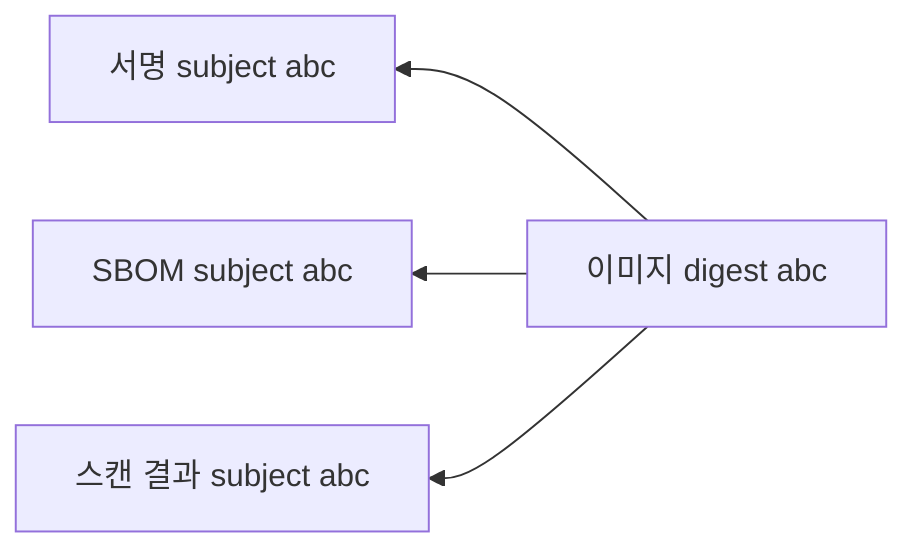
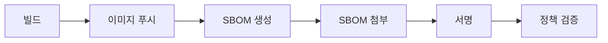

# OCI Artifacts (ORAS · Referrers · 서명 · SBOM 저장)

레지스트리는 더 이상 "이미지 창고"가 아니다.
**Helm 차트, Wasm 모듈, SBOM, 서명, 정책 번들, AI 모델 가중치**까지 전부
같은 레지스트리에 저장하고 버전 관리하는 시대다.

이 글은 OCI Artifacts 개념, **ORAS CLI 실전**, **Referrers API로 이미지에 SBOM·서명 묶기**,
레지스트리 호환성을 다룬다.

> OCI 스펙 이론은 [OCI 스펙](../docker-oci/oci-spec.md).
> 레지스트리별 지원 현황은 [레지스트리 비교](./registry-comparison.md).
> Sigstore 서명 정책은 `security/supply-chain/`.

---

## 1. "이미지가 아닌 것도 OCI로"

OCI Image v1.1이 `artifactType` + `subject` 필드를 추가하면서,
레지스트리는 **임의의 콘텐츠를 안전하게 배포**할 수 있게 됐다.

### 1-1. 왜 OCI 레지스트리인가

Helm 차트는 과거 `helm repo`, Python wheel은 PyPI, npm은 npm 레지스트리 —
**도구마다 저장소가 달랐다**. 이제 OCI로 통합 가능:

| 요구사항 | OCI 레지스트리 |
|---|---|
| Content-addressable (SHA256) | ✅ |
| Immutable | ✅ |
| 접근 제어·감사 | ✅ |
| 지역 복제 | ✅ |
| 취약점 스캔·서명 | ✅ |
| CDN·인프라 공유 | ✅ |

**"각 툴이 자기 저장소를 운영"** → **"OCI 하나로 수렴"** 이 2020년대 후반 트렌드.

### 1-2. 대표 사용 케이스

| 아티팩트 | artifactType |
|---|---|
| Helm 차트 | `application/vnd.cncf.helm.config.v1+json` (config + artifactType 이중 역할) |
| Wasm 모듈 | `application/vnd.wasm.content.layer.v1+wasm` |
| CNAB | `application/vnd.cnab.manifest.v1+json` |
| Policy (OPA·Kyverno) | `application/vnd.cncf.openpolicyagent.policy.layer.v1+rego` |
| SBOM (SPDX/CycloneDX) | `application/spdx+json`, `application/vnd.cyclonedx+json` |
| Cosign 서명 | `application/vnd.dev.cosign.artifact.sig.v1+json` |
| in-toto 증명 | `application/vnd.in-toto+json` |
| AI 모델 가중치 | `application/vnd.ollama.image.model` 등 |

Ollama, ModelOCI, OpenAI 일부 모델은 **OCI 레지스트리로 모델 배포 중**.

---

## 2. Referrers API — 아티팩트와 이미지 연결

### 2-1. 과거의 문제

이미지 `app:v1`의 서명을 어디에 저장할까?

| 방법 | 문제 |
|---|---|
| 별도 태그 `app:v1.sig` | 태그 네임스페이스 오염 |
| 별도 리포지토리 | 원본과 분리 관리 |
| manifest 내부 | 이미지 변경 → digest 변경 |

### 2-2. v1.1의 답



- 서명·SBOM은 **독립 manifest**로 푸시
- manifest의 `subject` 필드가 **원본 이미지를 가리킴**
- `GET /v2/<name>/referrers/<digest>`로 **연결된 아티팩트 목록 조회**

**이미지 digest는 바뀌지 않는다** → 서명 후 이미지를 다시 푸시할 필요 없음.

### 2-3. Fallback 태그 스키마

Referrers API 미지원 레지스트리를 위한 폴백:

```
sha256-<digest>
```

예: `app:sha256-abc123...`가 해당 digest의 referrers index를 담은 태그.
cosign·ORAS가 자동으로 처리한다.

---

## 3. ORAS — OCI Registry As Storage

ORAS는 **아티팩트용 CLI + 라이브러리**. 도커 이미지와 별개로
임의 파일을 OCI 레지스트리에 push/pull한다.

### 3-1. 설치·인증

```bash
# macOS
brew install oras
# Linux (2025-10 릴리즈 v1.3)
curl -LO https://github.com/oras-project/oras/releases/download/v1.3.0/oras_1.3.0_linux_amd64.tar.gz
tar -xzf oras_1.3.0_linux_amd64.tar.gz && sudo mv oras /usr/local/bin/

# 인증
oras login ghcr.io -u <user> --password-stdin <<< "$GH_TOKEN"
```

**v1.3 주요 기능**:
- `oras manifest index create` — 멀티 아키텍처 Image Index 직접 구성
- `oras copy --format` — Go 템플릿 출력, CI 파싱 용이
- backup/restore 명령 — DR 운영 단순화
- OCI Distribution Spec **v1.1.1 완전 준수**

### 3-2. 파일을 아티팩트로 푸시

```bash
# SBOM 푸시 (이미지와 연결)
oras attach \
  --artifact-type application/spdx+json \
  ghcr.io/org/app:v1 \
  ./sbom.spdx.json:application/spdx+json
```

`attach`는 **이미지에 subject로 연결**. 별도 태그 불필요.

### 3-3. 연결된 아티팩트 조회

```bash
# 이미지에 연결된 모든 아티팩트
oras discover ghcr.io/org/app:v1

# artifactType 필터
oras discover --artifact-type application/spdx+json \
  ghcr.io/org/app:v1

# 다운로드
oras pull ghcr.io/org/app@sha256:<sbom-digest>
```

### 3-4. 레지스트리 간 복사 (서명·SBOM 동반)

```bash
# 연결된 모든 아티팩트와 함께 복사
oras copy --recursive \
  source.example.com/app:v1 \
  dest.example.com/app:v1
```

재해 복구·멀티 리전 복제에서 **서명·SBOM·스캔 결과까지 한 번에** 이동.

---

## 4. 실제 사용 사례

### 4-1. Helm 3.8+ OCI 지원

```bash
# 차트를 OCI 레지스트리로 푸시
helm package mychart
helm push mychart-1.0.0.tgz oci://ghcr.io/org/charts

# 설치
helm install my-release oci://ghcr.io/org/charts/mychart --version 1.0.0
```

Helm 저장소 `index.yaml` 관리 불필요. 이미지와 **같은 레지스트리·같은 인증**.

### 4-2. cosign 서명 저장

```bash
# 서명 생성 (keyless Sigstore)
cosign sign ghcr.io/org/app:v1

# 서명은 referrers로 이미지에 연결됨
cosign tree ghcr.io/org/app:v1
# 📦 Supply Chain Security Related artifacts for ghcr.io/org/app:v1
#   └── 🔐 Signatures for ...
#   └── 📦 SBOMs for ...
```

> **역사적 주의**: cosign v2.x 초기 기본값은 **OCI Image 형식으로 서명을 저장**(태그 스키마 폴백).
> 최신 cosign은 `--registry-referrers-mode=oci-1-1` 또는 `COSIGN_EXPERIMENTAL=1`로
> **Referrers API 네이티브 저장**이 가능하다. issue #4335에서 전면 전환이 추적 중이며
> 2026 기준 대부분의 새 파이프라인은 oci-1-1 모드를 명시해 쓴다.

### 4-3. SBOM 첨부 + 검증

```bash
# SBOM 생성 및 첨부
syft ghcr.io/org/app:v1 -o spdx-json > sbom.spdx.json
oras attach --artifact-type application/spdx+json \
  ghcr.io/org/app:v1 ./sbom.spdx.json:application/spdx+json

# 배포 시 SBOM 존재 강제 (Kyverno)
# security/supply-chain/ 참고
```

### 4-4. 정책 번들 (OPA·Kyverno)

```bash
# Rego 정책 번들 푸시
oras push ghcr.io/org/policies/myorg:v1 \
  --artifact-type application/vnd.cncf.openpolicyagent.policy.layer.v1+rego \
  policy.rego
```

OPA는 `bundle` 명령으로 OCI 레지스트리에서 **정기 동기화** 가능.

### 4-5. Wasm 모듈

```bash
# SpinKube·wasmCloud 방식
oras push ghcr.io/org/wasm/hello:v1 \
  --artifact-type application/vnd.wasm.config.v0+json \
  hello.wasm:application/vnd.wasm.content.layer.v1+wasm
```

containerd `runwasi` 런타임이 이걸 직접 실행.

---

## 5. 레지스트리 호환성 (2026-04)

| 레지스트리 | Referrers API | Fallback 태그 | 빈 blob | 비고 |
|---|---|---|---|---|
| Harbor 2.10+ | ✅ | ✅ | ✅ | |
| Zot | ✅ | ✅ | ✅ | 가장 먼저 완비 |
| Distribution 3.x | ✅ | ✅ | ✅ | 레퍼런스 |
| ECR | ✅ | ✅ | ✅ | 2024 지원 |
| GAR | ✅ | ✅ | ✅ | |
| ACR | ✅ | ✅ | ✅ | |
| Quay | ✅ | ✅ | ✅ | Red Hat 공식 |
| Docker Hub | ✅ | ✅ | 부분 | |
| JFrog | ✅ | ✅ | ✅ | |
| GHCR | ✅ | ✅ | ✅ | |

**"빈 blob(`sha256:e3b0c44...`)"**: OCI 1.1에서 정의된 zero-byte 레이어.
일부 구식 레지스트리가 거부하는 게 흔한 호환성 이슈 → 2024년 이후 대부분 해결.

---

## 6. 실무 운영 패턴

### 6-1. CI/CD 파이프라인



각 단계가 OCI 레지스트리에 추가 아티팩트를 **subject로 연결**.
최종 manifest는 **자체 포함 감사 증적**이 된다.

### 6-2. 배포 시 검증

```bash
# 이미지에 SBOM·서명이 있어야만 배포
cosign verify ghcr.io/org/app:v1 --certificate-identity=...
oras discover ghcr.io/org/app:v1 | grep spdx
```

Kubernetes에서는 **Kyverno·Gatekeeper·Connaisseur**의 admission controller로 자동 검증.

### 6-3. 레지스트리 정리 함정

태그 없는 **dangling 아티팩트**가 쌓이기 쉽다.
Harbor·Zot의 GC는 **referrers 포함 그래프**를 보존해야 한다 — 구식 GC는 서명/SBOM을 고아로 판단해 삭제할 위험.

레지스트리 GC 실행 전:
- Referrers 인식 GC(Harbor 2.10+, Zot 최신) 사용 확인
- 드라이런으로 삭제 대상 감사

> **사고 패턴**: 태그 없는 signature manifest를 수동 GC로 정리하면
> `cosign verify`가 전수 실패한다 (Harbor 초기 버전에서 실제 발생). subject로 연결된
> 아티팩트는 **루트 이미지가 살아있는 한 함께 살려야** 한다.

---

## 7. 보안·운영 함정

### 7-1. 서명 위조 가능성

BuildKit의 provenance·SBOM attestation은 **자체적으로 서명되지 않는다**.
레지스트리 쓰기 권한이 있으면 누구나 위조 가능.

→ **cosign·Notation으로 별도 서명** 필수.

### 7-2. 서명 키 관리

| 방식 | 장점 | 단점 |
|---|---|---|
| 로컬 키 | 단순 | 키 분실·유출 위험 |
| KMS (AWS KMS·GCP KMS) | 클라우드 IAM | 벤더 락인 |
| **Sigstore keyless** | **키 없음**, OIDC 기반 | Fulcio·Rekor 의존 |
| HSM | 고보안 | 비용·복잡도 |

**2026년 추천 기본값**: Sigstore keyless + Fulcio + Rekor 투명성 로그.
자체 PKI가 있으면 Notation + Notary v2.

> **에어갭·규제 환경**: Rekor 공개 투명성 로그에 의존할 수 없는 경우
> `sigstore/scaffold`로 **자체 Fulcio·Rekor 구축**하거나 KMS 기반 키로 회귀.

### 7-3. 퍼블릭 레지스트리 쓰기 권한

GHCR·Docker Hub 등에 푸시 권한을 가진 CI 토큰이 **서명·SBOM 위조의 첫 번째 타깃**.
최소 권한·회전 주기·OIDC 기반 short-lived token 필수.

---

## 8. 실무 체크리스트

- [ ] 레지스트리가 **Referrers API 네이티브 지원**인지 확인
- [ ] ORAS CLI로 **아티팩트 push/discover/copy** 익숙해지기
- [ ] CI에서 이미지와 SBOM·서명 **함께 생성·푸시**
- [ ] 배포 시 **admission controller**로 서명 검증
- [ ] 레지스트리 GC가 **Referrers-aware**인지 확인 (Harbor 2.10+, Zot)
- [ ] **Sigstore keyless 서명**을 기본으로
- [ ] Helm·Wasm·Policy 번들도 OCI 레지스트리로 통합
- [ ] 다중 레지스트리 미러 시 `oras copy --recursive`로 아티팩트 동반

---

## 9. 이 카테고리의 경계

- **OCI 스펙 자체** → [OCI 스펙](../docker-oci/oci-spec.md)
- **Sigstore·cosign·SLSA 정책** → `security/supply-chain/`
- **Kyverno·Gatekeeper admission** → `kubernetes/`
- **GitOps로 Helm/OCI 배포** → `cicd/`

---

## 참고 자료

- [ORAS Project](https://oras.land/)
- [ORAS — Attached Artifacts](https://oras.land/docs/concepts/reftypes/)
- [Chainguard — What are OCI Artifacts?](https://edu.chainguard.dev/open-source/oci/what-are-oci-artifacts/)
- [Chainguard — Building towards OCI v1.1 support in cosign](https://www.chainguard.dev/unchained/building-towards-oci-v1-1-support-in-cosign)
- [Azure — Manage OCI Artifacts with ORAS](https://learn.microsoft.com/en-us/azure/container-registry/container-registry-manage-artifact)
- [Bret Fisher — OCI Artifacts: The Story So Far](https://www.bretfisher.com/blog/oci-artifacts)
- [Helm — Use OCI registries](https://helm.sh/docs/topics/registries/)
- [Sigstore Cosign Documentation](https://docs.sigstore.dev/cosign/overview/)

(최종 확인: 2026-04-20)
