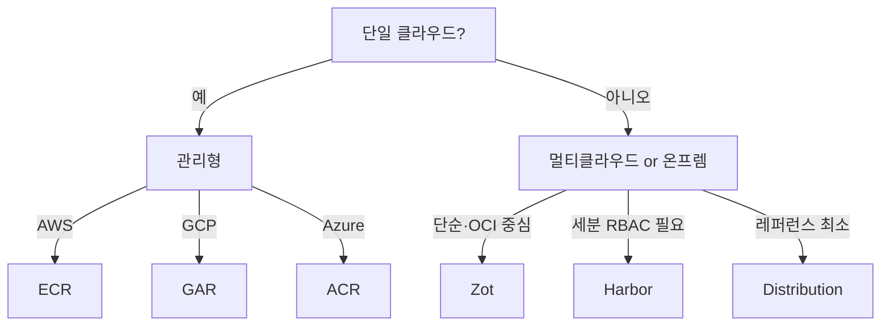

# 레지스트리 비교 (Harbor · Zot · Distribution · ECR · GAR · ACR)

컨테이너 레지스트리 선택은 **워크로드 특성·컴플라이언스·운영 능력**의 함수다.
"Docker Hub로 충분할까? Harbor를 세워야 할까? ECR이 나을까?"

이 글은 자체 구축(Harbor·Zot·Distribution)과 관리형(ECR·GAR·ACR·Docker Hub·Quay·JFrog)을
**2026년 실무 기준**으로 비교한다.

> OCI Distribution Spec은 [OCI 스펙 §4](../docker-oci/oci-spec.md).
> Referrers·아티팩트 저장은 [OCI Artifacts](./oci-artifacts.md).
> 이미지 취약점 정책은 `security/supply-chain/`.

---

## 1. 선택 프레임워크

먼저 답해야 할 질문들:

| 질문 | 영향 |
|---|---|
| 단일 클라우드 vs 멀티/온프렘 | 관리형(단일) vs 자체 구축(멀티) |
| 컴플라이언스(격리망·FIPS)? | 자체 구축 선호 |
| 팀이 K8s·StatefulSet 운영 가능? | 자체 구축 가능 여부 |
| Referrers API·Sigstore 필수? | 최신 레지스트리 필요 |
| 트래픽 패턴(pull 빈도·크기) | 비용 모델 선택 |
| Air-gap 환경? | Harbor·Zot·Distribution |

---

## 2. 자체 구축 — 3강

### 2-1. Harbor (CNCF graduated)

VMware가 주도하다 2020년 CNCF 졸업. 자체 구축 OSS 레지스트리의 **사실상 표준**.

**특징**:
- **프로젝트·사용자 단위 RBAC**
- **Trivy 내장 취약점 스캔** (Clair·Anchore 플러그인도 가능)
- **복제(replication)** — 지역·클라우드 간 미러
- **서명 검증 정책** — Cosign/Notation
- **Tag retention·immutable policy**
- **웹훅** — scan 완료·push 시 파이프라인 트리거
- **Harbor Satellite** (Preview, 2026-04 기준) — 엣지·IoT 동기화

**스택**: PostgreSQL + Redis + 자체 컴포넌트(core, jobservice, portal, registry, trivy, notary).

**사이즈**:

| 배포 모드 | 리소스 |
|---|---|
| 단일 노드 (`docker-compose`) | 4 vCPU·8GB RAM·100GB |
| K8s HA (helm chart) | 10+ vCPU·20GB·TB 스토리지 |

**단점**:
- 컴포넌트 많음 → **운영 부담**
- PostgreSQL·Redis 백업 필요
- 업그레이드 주의 (마이그레이션 스크립트)

### 2-2. Zot (CNCF Landscape 등재 OSS)

Cisco 주도. **"OCI 네이티브·경량" 철학**.

**특징**:
- **단일 Go 바이너리** — 복잡한 디펜던시 없음
- **OCI 1.1 완전 지원** (Referrers API 네이티브)
- **Stateless 또는 local FS·S3·Azure Blob**
- **내장 UI·검색·서명 검증·dedupe**
- **미러·동기화**
- **Trivy·Grype 통합 스캔**
- **Redis·Postgres 없음** → 운영 단순

**사이즈**: 수십 MB 메모리, 단일 바이너리 실행 가능.

**단점**:
- Harbor만큼 **RBAC 섬세하지 않음**
- 대규모 엔터프라이즈 레퍼런스 부족

**2026 트렌드**: Referrers API 지원이 가장 먼저·깨끗하게 되어 있어
**OCI Artifacts 중심 운영**에 인기.

### 2-3. Distribution (registry:3)

CNCF 프로젝트. OCI **레퍼런스 구현**. Docker Hub·GitHub Container Registry가 내부적으로 fork.

**특징**:
- **가장 순수한 OCI 구현**
- 스토리지 백엔드: local, S3, GCS, Azure Blob, Swift
- **UI 없음** — API만
- RBAC·스캔·웹훅 **없음** — 필요하면 프록시·플러그인 필요

**언제**:
- CI 캐시용 단기 레지스트리
- 실험 환경
- **다른 시스템의 백엔드로 embed**

---

## 3. 관리형 — 클라우드 빅3 + 기타

### 3-1. AWS ECR (Elastic Container Registry)

| 항목 | 내용 |
|---|---|
| 저장 비용 | **$0.10/GB·월** |
| 전송 | 데이터 전송 요금 표준 (Internet out) |
| 무료 | 신규 고객 500MB/월·1년 |
| 스캔 | 기본 + Enhanced(Inspector 통합) |
| Referrers API | ✅ (2024 지원) |
| 복제 | 리전 간 replication 기본 |
| 퍼블릭 레지스트리 | ECR Public (`public.ecr.aws`) |

**IAM 기반 인증** — Pod의 IRSA(EKS)·EC2 인스턴스 role로 인증.
**Lifecycle Policy**로 오래된 태그 자동 삭제.

### 3-2. Google Artifact Registry (GAR)

| 항목 | 내용 |
|---|---|
| 저장 비용 | $0.10/GB·월 (0.5GB 무료) |
| 스캔 | Container Analysis (부가 $0.26/컨테이너) |
| Referrers API | ✅ |
| 형식 | Docker, Helm, Maven, npm, Python 등 **다중 포맷** |
| 지역 | 멀티 리전 옵션 |

구 GCR은 2024년부터 **deprecated**, GAR로 마이그레이션 필수.

### 3-3. Azure Container Registry (ACR)

| 항목 | 내용 |
|---|---|
| SKU | Basic·Standard·Premium |
| Premium 기능 | **복제·Helm·토큰·태스크** |
| 스캔 | Defender for Cloud 통합 |
| Referrers API | ✅ |
| ACR Tasks | **클라우드 빌드** 내장 (Buildpacks·Buildx) |

온프렘-Azure 연결 시 Private Link + VNet integration이 선택지.

### 3-4. Quay (Red Hat)

CoreOS 인수 → Red Hat. **OKD/OpenShift 기본 레지스트리**.

- 온프렘 설치·Quay Cloud 둘 다
- Clair 통합 스캔(초창기 개척자)
- Tag history·롤백
- **Referrers API** 2023 공식 지원

### 3-5. JFrog Artifactory

**다중 포맷 universal binary repository**. Docker뿐 아니라 Maven·npm·Go·Helm·Rust 등.

- 대규모 엔터프라이즈 표준
- **비용은 가장 높음**
- XRay 통합 취약점·라이선스 스캔
- 프록시·리모트·가상 리포지토리 개념 강력

### 3-6. GitHub Container Registry (GHCR)

`ghcr.io`. **GitHub 리포지토리 권한에 본딩**.

- **Free for public** repos
- Private는 GitHub 요금제 일부
- Actions와 네이티브 통합
- Referrers API·SBOM·Attestation 연동

### 3-7. Docker Hub

원조 퍼블릭 레지스트리. 2025년 정책 개편 후 **IP당 익명 pull 제한 + 인증 사용자 월별 pull 제한**으로 전환.
정확한 수치는 [Docker 공식 Rate Limiting 문서](https://docs.docker.com/docker-hub/download-rate-limit/)에서 확인.

- Personal·Pro·Team·Business 플랜
- Public 이미지 호스팅 무료 (일부 제한)
- **Verified Publisher·Official Images** 가 핵심 가치
- 자체 빌드 Trust Registry (OCI 호환)

**회피 전략**: pull-through cache(Harbor proxy project, ECR pull-through rules),
업스트림 미러(`public.ecr.aws`, `mirror.gcr.io`, `registry.k8s.io`).

---

## 4. 기능 매트릭스

### 4-1. 기본 기능

| 레지스트리 | OCI 1.1 | Referrers | 스캔 | RBAC | 복제 | 웹훅 |
|---|---|---|---|---|---|---|
| Harbor | ✅ | ✅ 2.10+ | **Trivy 내장** | **세분화** | ✅ | ✅ |
| Zot | ✅ | ✅ | Trivy·Grype | 기본 | ✅ | ✅ |
| Distribution | ✅ | ✅ 3.x | ❌ | ❌ | ❌ | ❌ |
| ECR | ✅ | ✅ | Inspector | IAM | 리전 | EventBridge |
| GAR | ✅ | ✅ | Container Analysis | IAM | 멀티 리전 | Pub/Sub |
| ACR | ✅ | ✅ | Defender | Azure RBAC | Premium | Event Grid |
| Quay | ✅ | ✅ | Clair | 세분화 | ✅ | ✅ |
| JFrog | ✅ | ✅ | XRay | **가장 강력** | ✅ | ✅ |
| GHCR | ✅ | ✅ | **Actions 기반** | Repo 권한 | - | Actions |
| Docker Hub | ✅ | 부분 | 플랜별 | 기본 | - | ✅ |

### 4-2. 운영 특성

| 레지스트리 | HA | Air-gap | 백업 복잡도 | 기반 SW |
|---|---|---|---|---|
| Harbor | K8s HA | ✅ | **높음** (PG·Redis) | 다수 컴포넌트 |
| Zot | 기본 stateless | ✅ | 낮음 | 단일 바이너리 |
| Distribution | manual | ✅ | 낮음 | 단일 바이너리 |
| ECR·GAR·ACR | 관리형 | ❌ | - | - |
| Quay | HA (Operator) | ✅ | 중간 | PG·Redis |
| JFrog | HA | ✅ (on-prem) | 높음 | DB + Derby 가능 |
| GHCR | 관리형 (GitHub) | ❌ | - | - |
| Docker Hub | 관리형 | ❌ | - | - |

### 4-3. 인증·Workload Identity

| 레지스트리 | K8s 인증 방식 |
|---|---|
| ECR | **IRSA / EKS Pod Identity** (access key 없음) |
| GAR | **Workload Identity Federation** |
| ACR | **AKS Managed Identity** |
| Harbor | Robot account + imagePullSecret |
| Zot | htpasswd, LDAP, OIDC + imagePullSecret |
| GHCR | GitHub token (PAT 또는 Actions OIDC) |

---

## 5. 비용 관점

### 5-1. 관리형

일반적 요율(2026):

| 항목 | 요율 |
|---|---|
| 저장소 | **$0.10/GB·월** (ECR·GAR·ACR 공통) |
| 내부 리전 전송 | 0 또는 소액 |
| **Internet egress** | 90달러/TB 전후 (AWS·GCP·Azure) |

**egress가 숨은 비용**이다. 다른 클라우드·온프렘에서 pull하면 수 TB/월 쌓임.

### 5-2. 자체 구축 (Harbor 예시)

| 항목 | 예시 |
|---|---|
| VM | m5.xlarge·DS3 등 $80/월 × 3 HA |
| 스토리지 | S3 또는 Ceph $0.023/GB·월 (S3) |
| DB | RDS Postgres $100/월 또는 자체 |
| 운영 인건비 | **가장 큰 비용** — SRE 시간 |

**작은 팀**: 500GB 미만이면 관리형이 저렴.
**대규모**: 10TB+·multi-region은 Harbor·Zot로 장기적 이득.

---

## 6. 선택 가이드

### 6-1. 의사결정 트리

### 6-2. 시나리오별 추천

| 시나리오 | 추천 |
|---|---|
| 스타트업, AWS 올인 | ECR |
| 멀티테넌트 SaaS, 복잡한 RBAC | **Harbor** |
| 엣지·경량·OCI Artifacts 중심 | **Zot** |
| 공공·금융 격리망 | Harbor·Zot (air-gap 검증) |
| 다국적 대기업 다중 레포 | JFrog |
| OpenShift 클러스터 | Quay |
| CI용 임시 레지스트리 | Distribution |
| 오픈소스 배포용 | GHCR |

---

## 7. 운영 체크리스트

### 기본

- [ ] 저장소 명명 규칙 — `팀/서비스/컴포넌트:태그`
- [ ] **immutable tag** 정책 (semver tag 덮어쓰기 금지)
- [ ] **Tag retention** — 오래된 이미지 자동 정리
- [ ] **pull-through cache** 구성:
  - ECR: pull-through cache rules
  - Harbor: proxy project
  - Zot: sync extension
- [ ] Pull secret·IRSA·Workload Identity 중 하나로 인증 (4-3 표 참고)

### 보안

- [ ] scan-on-push 활성화
- [ ] **Critical CVE 발견 시 태그 quarantine**
- [ ] cosign 서명 검증 policy (Kyverno·Connaisseur)
- [ ] TLS 필수, 내부 통신은 **mTLS**(Harbor·Zot client cert auth)
- [ ] 레지스트리 관리 포트 외부 노출 제한
- [ ] 백업 전략(자체 구축) — DB·blob 스토리지
- [ ] Referrers API **fallback tag 스키마**(`sha256-<digest>`) 지원 여부 확인 — 구식 미러에 중요

### 비용

- [ ] **Internet egress 모니터링** (숨은 비용 #1)
- [ ] 지역별 레지스트리 배포 또는 replication
- [ ] Lifecycle Policy로 미사용 태그 삭제

---

## 8. 이 카테고리의 경계

- **OCI Artifacts·ORAS** → [OCI Artifacts](./oci-artifacts.md)
- **이미지 서명·cosign 정책** → `security/supply-chain/`
- **Kyverno·Connaisseur admission controller** → `kubernetes/`
- **CI/CD와 레지스트리 워크플로우** → `cicd/`

---

## 참고 자료

- [Harbor (CNCF)](https://goharbor.io/)
- [Zot Registry (CNCF)](https://zotregistry.dev/)
- [Distribution Registry (CNCF)](https://distribution.github.io/distribution/)
- [Shipyard — Choosing a Container Registry in 2026](https://shipyard.build/blog/container-registries/)
- [AWS ECR Pricing](https://aws.amazon.com/ecr/pricing/)
- [Google Artifact Registry Docs](https://cloud.google.com/artifact-registry/docs)
- [Azure Container Registry Pricing](https://azure.microsoft.com/en-us/pricing/details/container-registry/)
- [Quay.io — Red Hat](https://quay.io/)

(최종 확인: 2026-04-20)
