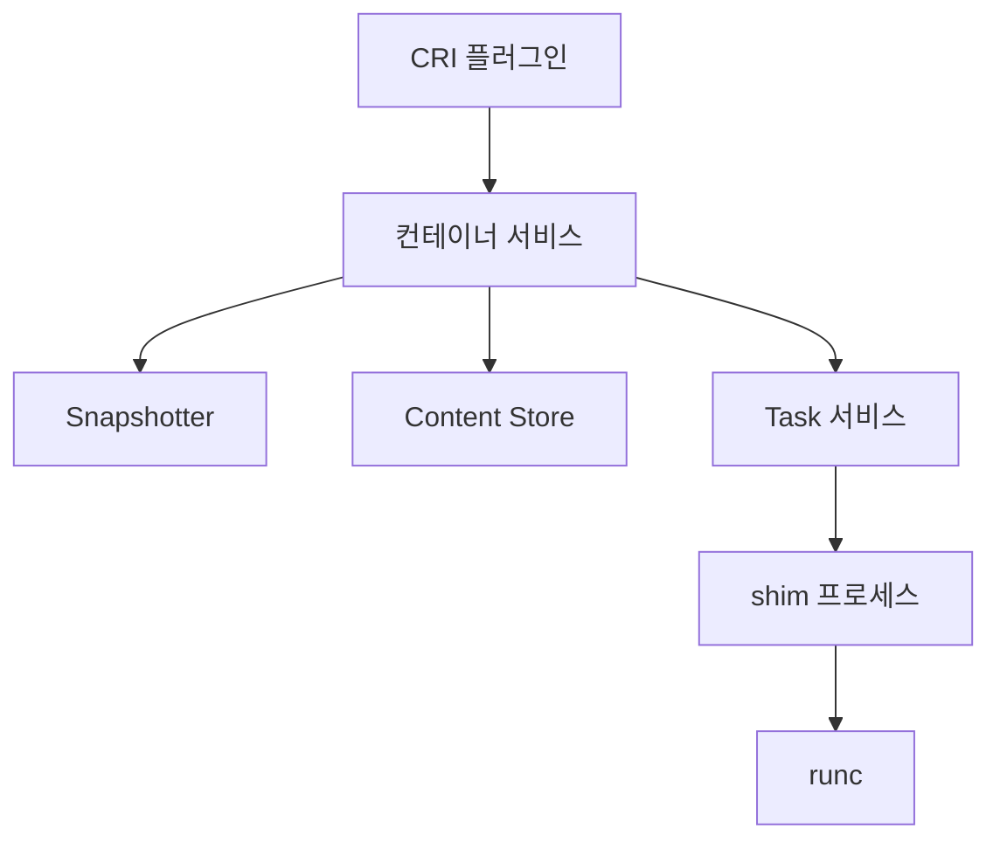

# containerd·runc (2.x · CRI · Sandbox · Snapshotter)

Kubernetes 클러스터의 **기본 런타임**은 이제 Docker가 아닌 **containerd**다.
이 글은 containerd 2.x의 아키텍처, CRI·Sandbox API, 스냅샷터 선택,
runc/crun/youki 등 **저수준 OCI 런타임 교체**, 운영 트러블슈팅을 다룬다.

> Docker 전체 계층은 [Docker 아키텍처](../docker-oci/docker-architecture.md).
> OCI 런타임 스펙 자체는 [OCI 스펙](../docker-oci/oci-spec.md).
> 대안 런타임(gVisor·Kata·Wasm)은 [런타임 대안](./runtime-alternatives.md).

---

## 1. containerd 전체 구조

containerd는 **플러그인 아키텍처**다. 단일 데몬이 여러 서비스를 호스트한다.



| 컴포넌트 | 역할 |
|---|---|
| Content Store | 콘텐츠 주소 기반 저장소 (blob·manifest) |
| Snapshotter | 파일시스템 레이어 병합 (overlay·stargz 등) |
| Image 서비스 | pull·push·tag·delete |
| Container 서비스 | 컨테이너 메타 관리 |
| Task 서비스 | 실행 중 프로세스 관리 (shim 호출) |
| CRI 플러그인 | Kubernetes `kubelet`용 gRPC 서버 |
| Sandbox 서비스 | Pod·microVM 등 격리 단위 관리 |
| NRI | 노드 리소스 인터페이스 플러그인 포인트 |
| CDI | GPU·FPGA 등 장치 주입 |

`ctr`(디버깅용)·`nerdctl`(Docker 호환)·`crictl`(CRI 직접) 세 CLI로 조작.

---

## 2. containerd 2.x — 2024년 메이저 업데이트

2024년 11월 **2.0** 릴리즈. 2026년 기준 2.0.x 안정화 단계.

### 2-1. 주요 변경

| 영역 | v1.7 → v2.0 |
|---|---|
| CRI API | **v1alpha2 제거** — v1만 지원 |
| Config 경로 | `/etc/containerd/config.toml` version 3 |
| Sandbox 서비스 | **stable** 승격 |
| NRI·CDI | **기본 활성화** |
| aufs snapshotter | **제거** — overlayfs 권장 |
| CRI 플러그인 | **sandboxed plugin** 아키텍처(플러그인 분리 로딩) |
| userns | Pod 수준 지원 (K8s 1.30 beta 기본 활성화 → 1.33 GA와 연동) |

### 2-2. CRI v1만 지원의 의미

- Kubernetes **1.26+**가 CRI v1 강제이므로 최신 K8s와 자연스러움
- 구식 kubelet(1.25 이하)과는 호환 안 됨 — **롤링 업그레이드 전 버전 매트릭스 확인 필수**

| containerd | 권장 K8s | 주의 |
|---|---|---|
| 1.6.x | 1.24–1.28 | CRI v1 + v1alpha2 병존 |
| 1.7.x | 1.26–1.31 | **v1alpha2 제거** (v1만 지원) |
| **2.0.x** | **1.28+** | v1 전용, config v3 필요 |

### 2-3. 이전 버전과의 설정 호환

`config.toml` v3 스키마 사용 시 v1·v2는 자동 변환되지 않는다.
**`containerd config migrate`** 로 선제 변환 후 2.x로 업그레이드.

```bash
containerd config migrate < /etc/containerd/config.toml > /etc/containerd/config.v3.toml
```

---

## 3. CRI — Kubernetes와의 인터페이스

### 3-1. CRI 구성 블록

```
/etc/containerd/config.toml
└── [plugins."io.containerd.grpc.v1.cri"]
    ├── sandbox_image = "registry.k8s.io/pause:3.10"
    ├── [plugins."io.containerd.grpc.v1.cri".containerd]
    │   ├── default_runtime_name = "runc"
    │   └── [plugins...cri.containerd.runtimes.runc]
    │       ├── runtime_type = "io.containerd.runc.v2"
    │       └── [plugins...runtimes.runc.options]
    │           └── SystemdCgroup = true   # K8s 기본
    └── [plugins...cri.registry.configs]
        └── auth, mirrors 등
```

### 3-2. `SystemdCgroup = true`가 중요한 이유

K8s는 systemd를 init으로 쓴다. cgroup 드라이버가 **systemd와 cgroupfs로 섞이면**
자원 제한이 두 계층에서 경쟁해 컨테이너가 **불규칙하게 OOM**된다.

- kubelet: `--cgroup-driver=systemd`
- containerd: `SystemdCgroup = true`
- **양쪽을 맞춰야 한다.** 대형 EKS/GKE 장애 원인의 단골.

### 3-3. 흔한 설정 요소

| 섹션 | 역할 |
|---|---|
| `sandbox_image` | Pod infra(`pause`) 이미지. 2026년 기준 `pause:3.10.x` 계열 |
| `snapshotter` | 기본 `overlayfs`. lazy pull용은 `stargz`·`nydus` |
| `registry.mirrors` | 레지스트리 미러·프라이빗 인증 |
| `runtime_type` | `io.containerd.runc.v2`(기본), `io.containerd.runsc.v1`(gVisor) |

> **`pause` 버전 불일치 함정**: kubelet이 바라보는 pause 버전과 containerd
> `sandbox_image` 기본값이 다르면, 에어갭 환경에서 미러된 쪽만 있는 버전으로
> Pod 생성이 실패한다. kubelet·containerd 양쪽 값을 명시적으로 고정하라.

### 3-4. NRI · CDI — 플러그인 확장

| 인터페이스 | 역할 | 경로·사용 사례 |
|---|---|---|
| **NRI** (Node Resource Interface) | 컨테이너 lifecycle 훅 | topology-aware 배치, WasmEdge·Kata 통합 |
| **CDI** (Container Device Interface) | 장치 주입 표준 | `/etc/cdi`, `/var/run/cdi`에 JSON — GPU·FPGA·InfiniBand |

NVIDIA GPU Operator·Intel device plugins가 CDI로 이주 중. 2.x에서 **둘 다 기본 활성화**.

---

## 4. Sandbox API — Pod를 일급 시민으로

### 4-1. 배경

기존 CRI는 **Pod = 컨테이너 1개 + 추가 컨테이너**처럼 다뤘다.
microVM 기반 런타임(Kata·Firecracker)은 **Pod 전체를 하나의 VM**으로 관리하고 싶었다.

Sandbox API는 **Pod(=sandbox) 수명주기를 명시적 엔티티로 추상화**한다.

### 4-2. 얻는 것

| 이점 | 설명 |
|---|---|
| microVM 친화 | Kata가 VM을 sandbox로 모델링 가능 |
| 리소스 일괄 관리 | Pod 수준 cgroup·네트워크 통합 |
| 수명주기 명확성 | `RunPodSandbox`·`StopPodSandbox`·`RemovePodSandbox` |
| 업데이트 API | 2.x에서 sandbox 속성 변경 가능 |

### 4-3. Runtime Class와의 관계

Kubernetes의 `RuntimeClass`가 `runtimeHandler`를 지정하면
containerd가 해당 sandbox를 별도 런타임으로 분기한다.

```yaml
apiVersion: node.k8s.io/v1
kind: RuntimeClass
metadata:
  name: gvisor
handler: runsc
```

```yaml
spec:
  runtimeClassName: gvisor  # 이 Pod만 gVisor
```

→ [런타임 대안](./runtime-alternatives.md)에서 상세.

---

## 5. Snapshotter — 레이어를 실제로 올리는 방식

### 5-1. 비교

| 스냅샷터 | 특징 | 언제 |
|---|---|---|
| **overlayfs** | 기본, 커널 내장 | 대부분의 워크로드 |
| **native** | 레이어 복사 | overlay 불가 환경 |
| **btrfs** | CoW 파일시스템 | btrfs 호스트 |
| **zfs** | ZFS 기반 | ZFS 호스트 |
| **stargz** | **lazy pulling** (eStargz 포맷) | 초기 기동 지연 중요 |
| **nydus** | **chunk 기반 lazy pulling** | 대형 이미지·P2P |
| **soci** | AWS SOCI 포맷 lazy pulling | ECS·EKS |
| **overlaybd** | Alibaba 주도 blob 블록 디바이스 | 대형 이미지, CNCF sandbox |

### 5-2. Lazy Pulling — 왜 혁신인가

전통적 pull은 **모든 레이어를 다 받은 후** 컨테이너 시작.
lazy pull은 **필요한 파일 청크만 가져오며 시작** — 2~10배 기동 단축이 흔함.

| 워크로드 | 성능 영향 |
|---|---|
| 1GB 이미지, 100MB만 실제 사용 | **극적 개선** (10배+) |
| 초기에 전체 스캔 (AV 등) | 오히려 악화 가능 |
| CI 러너 | 개선 |
| 프로덕션 서버 (long-running) | 기동만 빠르고 이후 동일 |

AWS Fargate·SOCI는 **ECS·EKS 기동 시간 단축**을 위해 이 기술을 대규모 채택.

### 5-3. 전환 함정

- 이미지 포맷이 **eStargz·Nydus**여야 lazy pull 가능 (표준 tar.gz에는 무효)
- BuildKit·ORAS로 재빌드·변환 필요
- **서명·SBOM이 원본 digest 기준**이면 변환 후 재서명 필요

---

## 6. runc — 최소 OCI 런타임

### 6-1. runc가 하는 일

1. `config.json` 읽기
2. `clone(CLONE_NEW*)`로 namespace 생성
3. cgroup 디렉터리 생성·가입
4. capabilities·seccomp·MAC 적용
5. `pivot_root` 또는 `chroot`로 rootfs 전환
6. `execve`로 프로세스 시작
7. **자신은 종료** (부모는 containerd-shim)

### 6-2. runc의 취약점 역사

runc는 **호스트 바이너리를 직접 실행**하기 때문에 공격 표면이 크다.

| CVE | 연도 | 요약 |
|---|---|---|
| CVE-2019-5736 | 2019 | `/proc/self/exe` 덮어쓰기로 호스트 runc 탈취 |
| CVE-2024-21626 | 2024 | `/proc/self/fd` 누수 → 컨테이너 CWD가 호스트 경로로 남음 |

**교훈**: runc 업그레이드는 보안 이슈다 — OS 패키지 업데이트와 독립적으로 추적.

### 6-3. runc 대안

runc 1.2 (2024-10 GA) 기준 cgroup v2·idmap mounts 안정, composefs 지원.

| 런타임 | 언어 | 강점 | 단점 |
|---|---|---|---|
| **runc** | Go | 레퍼런스·가장 안정 | Go 런타임 오버헤드 |
| **crun** | C | **빠름**(3–4배 create), rootless 친화 | 호환성 일부 차이 |
| **youki** | Rust | 메모리 안전성 | 아직 프로덕션 채택 적음 |

교체는 `config.toml`에서 `BinaryName = "/usr/bin/crun"`.

---

## 7. 운영 — 디버깅·성능·튜닝

### 7-1. 진단 명령

| 명령 | 용도 |
|---|---|
| `ctr namespace ls` | 네임스페이스 확인 (`moby`·`k8s.io` 등) |
| `ctr --namespace k8s.io containers ls` | K8s 컨테이너 목록 |
| `crictl ps / inspect / logs` | CRI 수준 진단 |
| `nerdctl ps / logs` | Docker 호환 UX |
| `ctr events` | 실시간 이벤트 스트림 |
| `journalctl -u containerd` | 데몬 로그 |

### 7-2. 자주 나오는 장애 패턴

| 증상 | 원인 |
|---|---|
| Pod이 `ContainerCreating`에서 멈춤 | CNI 플러그인 미설치·네트워크 플러그인 실패 |
| `pause` 이미지 pull 실패 | 에어갭·레지스트리 오인증 |
| 컨테이너 OOM 빈발 | cgroup 드라이버 불일치(`SystemdCgroup` 미적용) |
| 이미지 pull 매우 느림 | `max_concurrent_downloads` 기본 3 → 증가 |
| `devmapper`·`btrfs` 불안정 | overlayfs로 전환 권장 |

### 7-3. 성능 튜닝 포인트

- `max_concurrent_downloads` = 6–10 (빠른 회선·대형 이미지)
- `snapshotter = "stargz"` 검토 (초기 기동 중요)
- GC 간격 (`gc_schedule`) 조정 — 대형 컨테이너 호스트
- systemd `LimitNOFILE` 상향

---

## 8. 실무 체크리스트

- [ ] containerd 버전이 K8s 버전 매트릭스에 있는가
- [ ] `SystemdCgroup = true` (kubelet cgroup 드라이버와 일치)
- [ ] `sandbox_image` 경로가 에어갭 환경에서 접근 가능한가
- [ ] runc 독립 업그레이드 추적 (CVE 대응)
- [ ] lazy pull 후보 워크로드 식별 (초기 기동 중요한지)
- [ ] `config.toml` v3 스키마로 마이그레이션 완료 (2.x 시)
- [ ] NRI·CDI 플러그인 필요 여부 검토 (GPU·특수 자원)

---

## 9. 이 카테고리의 경계

- **gVisor·Kata·Firecracker·Wasm 런타임** → [런타임 대안](./runtime-alternatives.md)
- **Kubernetes RuntimeClass·Pod 스펙** → `kubernetes/`
- **eBPF 기반 CNI** → `network/`
- **이미지 서명 검증(cosign)** → `security/supply-chain/`

---

## 참고 자료

- [containerd 2.0 Release Notes](https://containerd.dev/docs/main/containerd-2.0/)
- [containerd Snapshotters 문서](https://github.com/containerd/containerd/blob/main/docs/snapshotters/README.md)
- [Stargz Snapshotter](https://github.com/containerd/stargz-snapshotter)
- [Nydus Snapshotter](https://github.com/containerd/nydus-snapshotter)
- [Kubernetes — Container Runtimes](https://kubernetes.io/docs/setup/production-environment/container-runtimes/)
- [k8wiz — containerd v1.x vs v2.0 Impacts on Kubernetes](https://www.k8wiz.com/articles/differences-and-changes-between-containerd-v1-x-and-v2-0-impacts-on-running-containers-in-kubernetes)
- [Snyk — CVE-2024-21626 runc vulnerability](https://snyk.io/blog/cve-2024-21626-runc-vulnerability-container-breakout/)

(최종 확인: 2026-04-20)
