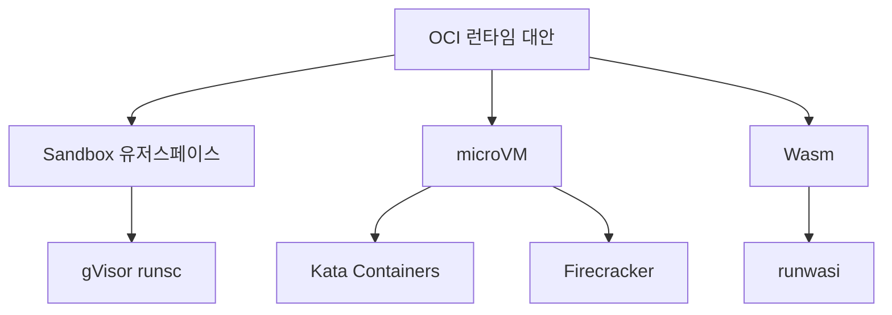
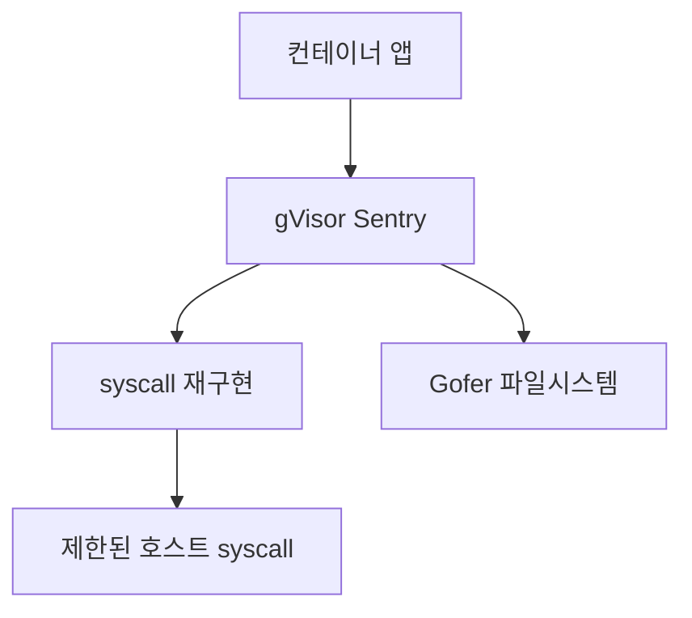
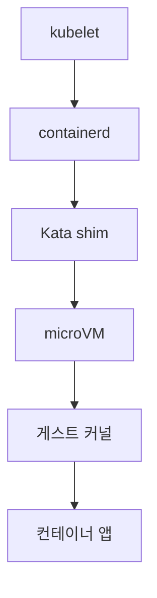
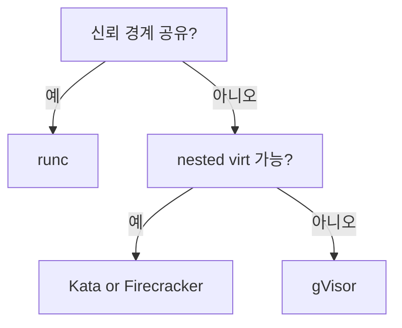

# 런타임 대안 (gVisor · Kata · Firecracker · Wasm)

runc는 **신뢰 경계 안**에서 돌리는 전제다. 멀티테넌트 SaaS, 유저 코드 샌드박스,
AI 에이전트 격리 같은 상황에선 부족하다. 대안은 크게 3갈래:

1. **유저스페이스 커널** — gVisor
2. **microVM 격리** — Kata Containers, Firecracker
3. **Wasm 런타임** — runwasi (WasmEdge, Wasmtime)

이 글은 각 기술의 **격리 모델·성능·운영 트레이드오프**, 언제 써야 하고
언제 쓰면 안 되는지를 다룬다.

> runc·containerd는 [containerd·runc](./containerd-runc.md).
> 왜 추가 격리가 필요한지는 [컨테이너 개념 §5](../concepts/container-concepts.md) 참고.

---

## 1. 왜 대안이 필요한가

runc 기반 컨테이너의 격리 = **Linux 커널 기능의 조합**.
커널 취약점 하나로 전체 호스트가 노출된다.

| 공격 표면 | runc | gVisor | Kata | Firecracker |
|---|---|---|---|---|
| 호스트 커널 syscall | **직접 노출** | 필터링 | VM 내부 | VM 내부 |
| 하이퍼바이저 API | 없음 | 없음 | 존재 | **최소화** |
| 공격 경로 | 커널 취약점 | gVisor 버그 | VMM + 커널 | VMM + 커널 |

**2026년 기준 "안전한 멀티테넌트"의 최소선은 microVM 또는 gVisor**다.

---

## 2. 분류 지도



| 접근 | 대표 | 격리 원천 |
|---|---|---|
| 유저스페이스 커널 | **gVisor** | syscall 재구현 |
| microVM + Kubernetes | **Kata Containers** | KVM/하드웨어 가상화 |
| microVM + Serverless | **Firecracker** | KVM, AWS Lambda/Fargate |
| Wasm 바이트코드 | **runwasi** | Wasm sandbox + WASI |

---

## 3. gVisor — 유저스페이스 커널

Google이 Google Cloud Run·App Engine·Borg에서 10년+ 운영해 온 기술.
`runsc` 바이너리로 containerd 런타임에 꽂는다.

### 3-1. 동작 원리



- **Sentry**: 유저스페이스 커널 (Go로 작성, ~200 syscall 재구현)
- **Gofer**: 파일시스템 프록시 (9P 프로토콜)
- 컨테이너 syscall → Sentry가 가로채 **필터링된 호스트 syscall로 변환**

### 3-2. 특성

| 항목 | 값 |
|---|---|
| 기동 | **50–100ms** |
| 메모리 오버헤드 | **~15MB** (VM보다 가벼움) |
| CPU 오버헤드 | **I/O 집약 20–40%**, CPU 집약 5% |
| 중첩 가상화 필요 | ❌ (EC2·GKE에서 바로 가능) |
| 호환성 | 일부 syscall 미구현 (예: 일부 ioctl) |

### 3-3. 언제 써야 하나

- **AWS Fargate·Google Cloud Run 같은 공유 인프라**의 격리
- **유저 코드(Lambda·함수)** 샌드박스
- **nested virt 불가** 환경 (이미 VM 위인 많은 클라우드)

**안 맞는 곳**: 고성능 I/O 워크로드 (DB), 특이한 syscall 쓰는 레거시 앱.

---

## 4. Kata Containers — microVM

각 Pod를 **경량 VM에 넣어 돌리는** OCI 호환 런타임.
OpenStack Foundation(OpenInfra) 프로젝트 → CNCF 인큐베이팅.

### 4-1. 아키텍처



- **VMM 선택**: QEMU (기본), **Cloud Hypervisor**, **Firecracker**, Dragonball
- 게스트 커널: 축소된 Linux (부팅 ~100ms)
- OCI runtime 인터페이스를 유지 → kubelet·containerd 관점에선 일반 런타임

### 4-2. 특성

| 항목 | 값 |
|---|---|
| 기동 | **150–300ms** (VMM·커널에 따라) |
| 메모리 오버헤드 | 40–80MB (게스트 커널 포함) |
| CPU 오버헤드 | <5% (KVM 하드웨어 가속) |
| 중첩 가상화 필요 | ✅ (bare metal 또는 `--enable-virtualization` EC2) |
| Pod 모델 | Pod당 하나의 VM (Pod = Sandbox) |

### 4-3. 언제 써야 하나

- **K8s 네이티브 멀티테넌트 클러스터**
- **규제(PCI/HIPAA)** 로 VM 경계가 요구되는 환경
- **bare metal 또는 nested virt 지원 VM**이 이미 있음

**안 맞는 곳**: 클라우드 일반 VM (nested virt 미지원/유료), 초저지연 기동.

### 4-4. Confidential Containers (CoCo)

Kata의 확장으로 **AMD SEV-SNP·Intel TDX·IBM SE**를 활용한 메모리 암호화.
호스트 root·하이퍼바이저도 게스트 메모리를 볼 수 없다. 2024년부터 CNCF 인큐베이팅.

핵심 개념: **attestation**(게스트가 자신의 무결성을 증명), **peer-pods**(TEE 노드를 별도 풀로 분리).
심화는 `security/` 영역.

---

## 5. Firecracker — AWS의 serverless microVM

2018년 AWS가 Rust로 작성해 오픈소스화. **AWS Lambda·Fargate 내부 엔진**.

### 5-1. 설계 원칙

- **VM 하나당 바이너리 하나** (`/dev/kvm` 직접)
- **최소 장치 모델** — disk, network, vsock, serial만
- **125ms 이내 cold start**
- 메모리 footprint **<5MB** (VMM)
- Rust 기반, 외부 의존 최소화

### 5-2. 특성

| 항목 | 값 |
|---|---|
| 기동 | **100–200ms** (pre-warm 없이) |
| 메모리 오버헤드 | **<5MB** VMM + 게스트 커널 |
| 하드웨어 가속 | KVM 필수 |
| Kubernetes 직접 지원 | ❌ (Kata·firecracker-containerd로 래핑) |
| 사용 사례 | **serverless·FaaS**, AI 에이전트 |

### 5-3. Kata와의 관계

Kata는 **Firecracker를 VMM으로 선택할 수 있다**. 그러면 Kata는 오케스트레이션 추상화,
Firecracker는 실제 microVM을 담당한다.

| 단독 Firecracker | Kata + Firecracker |
|---|---|
| 직접 API 호출 | OCI/CRI 인터페이스 |
| 자체 오케스트레이션 필요 | K8s에 바로 꽂힘 |
| AWS Lambda·Fargate | 일반 K8s 멀티테넌트 |

### 5-4. 파생 프로젝트

- **Cloud Hypervisor**: Intel 주도, Rust, Firecracker와 코드 공유 — **더 많은 장치·라이브 마이그레이션 지원**
- **Dragonball**: Kata의 네이티브 VMM

---

## 6. Wasm — 바이트코드 샌드박스

WebAssembly는 원래 브라우저용이지만 WASI(WebAssembly System Interface)로
**서버/엣지 실행 런타임**이 됐다.

### 6-1. 왜 컨테이너와 경쟁하나

| 항목 | 컨테이너 (OCI) | Wasm |
|---|---|---|
| 아티팩트 크기 | MB~GB | **KB~MB** |
| 기동 | 수백ms~초 | **1–10ms** |
| 메모리 | MB~GB | **KB~MB** |
| 격리 | Linux namespace | **Wasm 모듈 샌드박스** (capability 기반) |
| OS 지원 | Linux·Windows | 플랫폼 독립 바이트코드 |
| 성숙도 | 완숙 | 확장 중 |

### 6-2. runwasi — containerd 통합

**`containerd/runwasi`** 는 containerd가 Wasm 모듈을 **1급 컨테이너로** 다루게 한다.
같은 `docker/nerdctl/kubectl` UX로 Wasm 워크로드 실행 가능.

```bash
# OCI 이미지로 패키징된 Wasm
nerdctl run --runtime=io.containerd.wasmedge.v1 ghcr.io/.../myapp.wasm
```

**지원 엔진**:

| shim | 엔진 | 주도 |
|---|---|---|
| `containerd-shim-wasmedge-v1` | WasmEdge | Second State |
| `containerd-shim-wasmtime-v1` | Wasmtime | Bytecode Alliance |
| `containerd-shim-wasmer-v1` | Wasmer | Wasmer |
| `containerd-shim-spin-v2` | Spin (Fermyon) | Fermyon, Microsoft |

### 6-3. K8s에서의 Wasm

RuntimeClass로 지정:

```yaml
apiVersion: node.k8s.io/v1
kind: RuntimeClass
metadata:
  name: wasmedge
handler: wasmedge
```

Fermyon의 **SpinKube**(CNCF sandbox)가 K8s 위 Wasm serverless를 표준화 중.

### 6-4. 한계

- **시스템 기능 부족** — 파일시스템·네트워크 API가 제한적 (WASI Preview 2에서 개선 중)
- **언어 지원** — Rust·C/C++·Go(TinyGo)·AssemblyScript 외에는 제약
- **GPU·장치 접근** — 거의 불가
- **보안 모델** — capability 기반이지만 아직 레퍼런스 구현 변동

**2026년 기준 Wasm은 "특정 워크로드에 매우 강력"하지 "일반 컨테이너 대체"는 아님**.
엣지, 플러그인 시스템, serverless, CDN worker에서 빠르게 성장.

---

## 7. 비교 매트릭스

### 7-1. 격리·성능

| 런타임 | 격리 | 기동 | 메모리 OH | CPU OH | nested virt |
|---|---|---|---|---|---|
| runc | Linux namespace | <50ms | ~5MB | ~0% | - |
| **gVisor** | 유저스페이스 커널 | 50–100ms | ~15MB | I/O 20–40% | 불필요 |
| **Kata** | microVM | 150–300ms | 40–80MB | <5% | 필요 |
| **Firecracker** | microVM | 100–200ms | <5MB+게스트 | <5% | 필요 |
| **Wasm (runwasi)** | Wasm sandbox | **1–10ms** | KB–MB | 언어/구현별 | 불필요 |

### 7-2. 선택 의사결정



| 추가 조건 | 추천 |
|---|---|
| 앱을 Wasm으로 작성 가능 | **runwasi** |
| K8s 네이티브 멀티테넌트 | **Kata** (Firecracker VMM 가능) |
| 자체 serverless 구축 | **Firecracker** 직접 |
| nested virt 없음 + 공용 PaaS | **gVisor** |

### 7-3. 실제 채택 예시

| 플랫폼 | 런타임 |
|---|---|
| AWS Lambda | Firecracker |
| AWS Fargate | Firecracker + Firecracker-containerd |
| Google Cloud Run | gVisor |
| Google App Engine | gVisor |
| Fly.io | Firecracker |
| Cloudflare Workers | **V8 isolates** 기반(Wasm 추가 지원) |
| Fermyon Cloud | Spin/Wasm |
| Northflank·DigitalOcean 앱 | Kata + gVisor 하이브리드 |

---

## 8. 운영 함정

### 8-1. 모두 공통

- 이미지 호환성: **OCI 이미지는 호환** — Wasm은 별도 포맷
- 로깅: stdout/stderr은 대부분 OK, stat/tracing 도구 호환성은 제약 있음
- `exec`·`kubectl cp`: microVM 계열은 **VM 내부 진입** 오버헤드

### 8-2. gVisor

- **I/O heavy 워크로드 지양** (DB, 대량 네트워크)
- Linux 특정 기능(io_uring 일부, eBPF) 미지원
- 플랫폼 선택: **systrap**(기본, 2024+), ptrace, kvm — 플랫폼별 호스트 요구 다름

### 8-3. Kata·Firecracker

- 게스트 커널 보안 업데이트 **독립 관리**
- Pod 간 **리소스 overcommit** 감소 (VM 오버헤드)
- **live migration** 미지원이 기본 (Cloud Hypervisor 예외)

### 8-4. Wasm

- **표준 불안정** (WASI preview 1 vs preview 2)
- 디버깅 도구 성숙도 낮음
- 멀티스레드·시그널 등 일부 POSIX 동작 차이

---

## 9. 실무 체크리스트

- [ ] 신뢰 경계가 어디인가 정의 — 사내 단일 조직이면 runc로 충분
- [ ] nested virt 가용성 확인 — 클라우드 VM 중 상당수 불가
- [ ] K8s RuntimeClass로 **워크로드별 런타임 분리**
- [ ] 기동 SLA가 있으면 Wasm·gVisor 우선 고려
- [ ] 규제 격리 요구(HIPAA·PCI)는 microVM 이상
- [ ] AI 에이전트 샌드박스는 **Firecracker 또는 gVisor**
- [ ] 런타임 CVE 모니터링 (gVisor·Kata·Firecracker 독립)

---

## 10. 이 카테고리의 경계

- **K8s RuntimeClass 정의·스케줄링** → `kubernetes/`
- **Zero Trust·멀티테넌트 보안 전략** → `security/`
- **Confidential Computing·TEE 심화** → `security/`
- **Wasm 플랫폼 엔지니어링(SpinKube, Backstage)** → `cicd/` 또는 `kubernetes/`

---

## 참고 자료

- [Northflank — Kata vs Firecracker vs gVisor](https://northflank.com/blog/kata-containers-vs-firecracker-vs-gvisor)
- [gVisor Documentation](https://gvisor.dev/docs/)
- [Kata Containers Documentation](https://katacontainers.io/docs/)
- [Firecracker Project](https://firecracker-microvm.github.io/)
- [containerd/runwasi](https://github.com/containerd/runwasi)
- [CNCF — WebAssembly on Kubernetes (part 1)](https://www.cncf.io/blog/2024/03/12/webassembly-on-kubernetes-from-containers-to-wasm-part-01/)
- [CNCF — WebAssembly on Kubernetes (part 2)](https://www.cncf.io/blog/2024/03/28/webassembly-on-kubernetes-the-practice-guide-part-02/)
- [Edera — Kata, gVisor, or Firecracker](https://edera.dev/stories/kata-vs-firecracker-vs-gvisor-isolation-compared)

(최종 확인: 2026-04-20)
