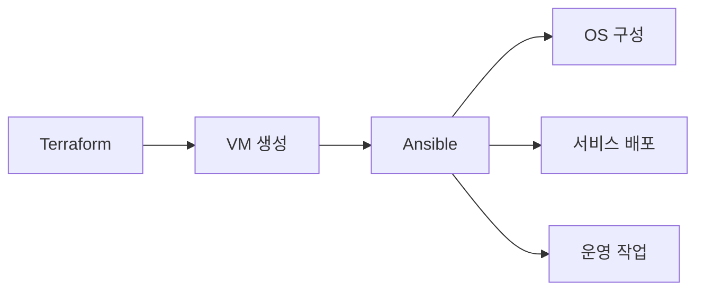

# Ansible 기본

> Ansible은 **agentless 구성 관리·자동화 도구**. SSH/WinRM으로 노드에
> 접속해 YAML로 작성한 playbook을 실행한다. Terraform이 **provisioning**
> (만들기)을 다룬다면, Ansible은 그 위에서 **configuration management**
> (꾸미기·유지)를 담당한다.
>
> 이 글은 Ansible의 **언어·구조·실행 모델·idempotency**를 다룬다.
> 운영(AAP·Tower·scale·secret)은 [Ansible 운영](./ansible-operations.md).

- **현재 기준** (2026-04):
  - **ansible-core 2.19.x** (controller Python **3.11+**, target Python **3.8+**)
  - **ansible community 12.x** (collections 메타패키지)
  - 11.x는 maintenance, 다음 minor 흐름은 13.x
- **전제**: SSH 기본, YAML 독해, [IaC 개요](../concepts/iac-overview.md)
- 본 위키는 **온프레미스 중심** — Ansible은 vSphere·OpenStack·베어메탈
  OS·네트워크 장비 영역에서 가장 가치가 큼

---

## 1. Ansible이란

### 1.1 한 문장 정의

**선언형 외피 + 절차형 내부**의 구성 관리 도구. YAML(선언처럼 보이는)을
순차 실행하지만, 모듈 자체가 idempotent여서 결과는 선언처럼 동작.

### 1.2 핵심 특징

| 특징 | 의미 |
|---|---|
| **Agentless** | 타겟 노드에 별도 데몬 없음 — SSH/WinRM만 |
| **Push 모델** | controller가 명령 실행, target은 수신 |
| **Idempotent 모듈** | 같은 playbook 반복 실행 안전 |
| **YAML** | 비개발자도 읽기 쉬움 (그러나 양날의 검) |
| **Module 생태계** | 수천 개 — 시스템·클라우드·네트워크·SaaS |
| **Collection** | 모듈·role을 묶은 배포 단위 (Galaxy) |

### 1.3 Ansible의 진짜 자리



| 영역 | Terraform | Ansible |
|---|:-:|:-:|
| 클라우드/온프레 리소스 생성 | ✅ | △ |
| OS 패키지·sysctl·user | △ | ✅ |
| 서비스 설치·구성·재시작 | ❌ | ✅ |
| 네트워크 장비 구성 | △ | ✅ |
| 일회성 운영 작업 (rolling restart) | ❌ | ✅ |
| 이미지 베이킹 (Packer + Ansible) | ❌ | ✅ |
| **드리프트 감지** (state) | ✅ | ❌ (자체 state 없음) |

**상호 보완**: Terraform으로 만든 VM에 Ansible로 OS 구성 — 흔한 조합.

---

## 2. 설치·실행 환경

### 2.1 ansible-core vs ansible (community)

| 패키지 | 내용 | 용도 |
|---|---|---|
| `ansible-core` | 엔진 + 핵심 모듈 (`ansible.builtin.*`) | 최소 설치, 컨트롤러 |
| `ansible` | core + 수많은 community collections | 일반 사용자 |
| **Execution Environment** (EE) | core + collections + dependencies를 컨테이너로 패키징 | AAP·AWX·CI 표준 |

### 2.2 설치

```bash
# pipx (격리, 권장)
pipx install ansible-core
pipx install ansible        # full collections 포함

# 또는 OS package
dnf install ansible-core
apt install ansible-core
```

**Python 호환성** (ansible-core 2.19 기준):
- **Controller**: Python **3.11+** (3.10 제거됨)
- **Target**: Python **3.8+** (3.7 제거됨)
- RHEL 8 기본 Python(3.6/3.8)은 target에서 제한적 — `ansible_python_interpreter`
  명시로 EPEL이나 platform-python 지정 필요

### 2.3 Execution Environment (EE)

```yaml
# execution-environment.yml
version: 3
images:
  # Red Hat AAP 표준 (서브스크립션)
  # name: registry.redhat.io/ansible-automation-platform-25/ee-supported-rhel9
  
  # Community/OSS 표준 — UBI 9 또는 ee-minimal community 빌드
  base_image:
    name: quay.io/centos/centos:stream9
    # 또는 ubi9-init 등
dependencies:
  galaxy: requirements.yml
  python: requirements.txt
  system: bindep.txt
```

**주의**: `quay.io/ansible/ansible-runner:latest`는 **deprecated**
(Ansible Builder 3.0+ 기준). 현재 표준은 RHEL UBI 9 기반 또는 RHAAP의
`ee-supported-rhel9`.

```bash
ansible-builder build -t myorg/ee:1.0
ansible-navigator run playbook.yml --eei myorg/ee:1.0
```

**가치**:
- **재현성**: 컨트롤러 환경 차이 제거 (Mac·Linux·CI 동일)
- **공급망 보안**: 검증된 base image + lock된 collections
- **AAP 표준**: Tower/AAP 2.x는 EE를 기본 실행 단위로 사용

### 2.4 Inventory와 SSH 인증

```ini
# inventory/prod.ini
[web]
web1.example.com ansible_user=deploy
web2.example.com ansible_user=deploy

[db]
db1.example.com ansible_host=10.10.10.5

[all:vars]
ansible_ssh_private_key_file=~/.ssh/deploy_key
```

또는 YAML:

```yaml
# inventory/prod.yml
all:
  vars:
    ansible_user: deploy
  children:
    web:
      hosts:
        web1.example.com:
        web2.example.com:
    db:
      hosts:
        db1.example.com:
          ansible_host: 10.10.10.5
```

**Dynamic inventory**: AWS·vSphere·OpenStack 등 plugin으로 실시간 조회.

```yaml
# inventory/aws_ec2.yml
plugin: amazon.aws.aws_ec2
regions: [us-east-1]
filters:
  tag:Environment: prod
keyed_groups:
  - prefix: tag
    key: tags
```

---

## 3. Inventory

### 3.1 호스트·그룹

```yaml
all:
  children:
    web:
      hosts:
        web[01:10].example.com:
    db:
      children:
        db_primary:
          hosts: { db1.example.com: }
        db_replica:
          hosts:
            db2.example.com:
            db3.example.com:
```

호스트 패턴 `web[01:10]`은 web01~web10 자동 확장.

### 3.2 그룹 변수

```text
inventory/
├── hosts.yml
├── group_vars/
│   ├── all.yml          # 모든 호스트
│   ├── web.yml          # web 그룹
│   └── db_primary.yml
└── host_vars/
    └── db1.example.com.yml   # 호스트 단위
```

**변수 우선순위** (요약, 상위가 우선):
1. `-e` extra vars (CLI)
2. task vars
3. `block`/`role` vars
4. play vars
5. host vars
6. group vars (specific → all)
7. role defaults
8. inventory vars

상세 우선순위는 23단계 — [공식 문서](https://docs.ansible.com/ansible/latest/playbook_guide/playbooks_variables.html)
참조.

### 3.3 시크릿 — Vault

```bash
# 파일 암호화
ansible-vault encrypt group_vars/prod/secrets.yml

# 편집
ansible-vault edit group_vars/prod/secrets.yml

# playbook 실행 시
ansible-playbook -i inventory/prod.yml site.yml --ask-vault-pass
# 또는
export ANSIBLE_VAULT_PASSWORD_FILE=~/.vault_pass
```

**한계**: vault password 자체 관리가 별 문제 — 진짜 시크릿은 외부
시크릿 스토어(HashiCorp Vault·AWS Secrets Manager) 권장 (→
`security/`).

---

## 4. Playbook

### 4.1 기본 구조

```yaml
- name: Configure web servers
  hosts: web
  become: true
  gather_facts: true
  
  vars:
    nginx_version: "1.27.0"
  
  pre_tasks:
    - name: Refresh apt cache
      ansible.builtin.apt:
        update_cache: true
        cache_valid_time: 3600
  
  roles:
    - role: common
    - role: nginx
      tags: [nginx]
  
  tasks:
    - name: Drop banner
      ansible.builtin.copy:
        dest: /etc/motd
        content: "Managed by Ansible\n"
  
  post_tasks:
    - name: Verify
      ansible.builtin.uri:
        url: http://localhost/
        status_code: 200
  
  handlers:
    - name: Reload nginx
      ansible.builtin.service:
        name: nginx
        state: reloaded
```

| 키 | 역할 |
|---|---|
| `hosts` | 대상 그룹·패턴 |
| `become` | privilege escalation (sudo) |
| `gather_facts` | 시스템 사실 수집 (성능 위해 `false` 옵션) |
| `vars` / `vars_files` | 변수 |
| `pre_tasks` / `post_tasks` | role 전·후 |
| `roles` | role 호출 |
| `tasks` | 인라인 task |
| `handlers` | notify로 호출되는 후속 액션 |

### 4.2 Task와 Module

```yaml
tasks:
  - name: Ensure nginx installed
    ansible.builtin.package:
      name: nginx
      state: present

  - name: Drop config
    ansible.builtin.template:
      src: nginx.conf.j2
      dest: /etc/nginx/nginx.conf
      mode: "0644"
      validate: "/usr/sbin/nginx -t -c %s"
    notify: Reload nginx
```

- **`name`**: 모든 task에 명시 (output 가독성)
- **모듈 fully qualified name** (FQCN, `ansible.builtin.template`): collection
  명시 — bare name(`template:`)도 여전히 동작하지만 **`ansible-lint`의
  `fqcn` 룰이 기본 활성화**되어 경고. EE 환경에서는 FQCN이 사실상 강제
- **`notify`**: 변경 발생 시 handler 호출
- **`validate`**: 적용 전 검증 (잘못된 config 방지)

### 4.3 Idempotency 원칙

```yaml
# ❌ 안티 — 매번 실행됨
- name: Add user
  ansible.builtin.command: useradd alice

# ✅ 권장 — 모듈이 상태 비교
- name: Add user
  ansible.builtin.user:
    name: alice
    state: present
```

**3원칙**:
1. **command/shell 대신 전용 모듈** 우선
2. command/shell 불가피하면 `creates`/`removes`/`changed_when` 명시
3. 변경 감지에 `register` + `when`

```yaml
- name: Run migration once
  ansible.builtin.command: scripts/migrate.sh
  args:
    creates: /var/lib/migration/done   # 이 파일 있으면 skip → idempotent
```

`creates`/`removes`만으로도 idempotent. `changed_when`은 결과 코드나
출력 검사로 changed 여부를 직접 결정할 때 (예: 명령은 매번 실행하되
출력에 변화 신호 있을 때만 changed).

**검증**: playbook을 두 번 실행해 두 번째에 `changed=0`이 나오면 idempotent.
`ansible-lint`·molecule의 `idempotence` 단계로 자동화 가능.

### 4.4 Handler

```yaml
tasks:
  - name: Drop nginx.conf
    ansible.builtin.template:
      src: nginx.conf.j2
      dest: /etc/nginx/nginx.conf
    notify: Reload nginx          # 변경 시에만 호출

  - name: Drop site config
    ansible.builtin.template:
      src: site.conf.j2
      dest: /etc/nginx/conf.d/site.conf
    notify: Reload nginx          # 같은 handler 다시 notify

handlers:
  - name: Reload nginx
    ansible.builtin.service:
      name: nginx
      state: reloaded
```

- handler는 **play 끝**에 한 번만 실행 (여러 task가 notify해도 1회)
- 실패 시 후속 task는 그대로 진행 — `--force-handlers`로 강제

### 4.5 Block — 묶음 처리

```yaml
- name: Database setup with rollback
  block:
    - name: Stop postgres
      ansible.builtin.service:
        name: postgresql
        state: stopped
    - name: Run migration
      ansible.builtin.command: pg_migrate.sh
  rescue:
    - name: Restore backup
      ansible.builtin.command: pg_restore.sh
  always:
    - name: Start postgres
      ansible.builtin.service:
        name: postgresql
        state: started
```

`block` + `rescue` + `always` = 예외 처리. blue/green 패턴, 가역 작업의
표준.

### 4.6 Tags

```yaml
- name: Install nginx
  ansible.builtin.package:
    name: nginx
  tags: [packages, nginx]
```

```bash
ansible-playbook site.yml --tags nginx
ansible-playbook site.yml --skip-tags slow_check
ansible-playbook site.yml --list-tags
```

- task 부분 실행에 유용 — 특히 디버깅·점진 배포
- 표준 tag: `always` (skip해도 항상 실행), `never` (지정해야만 실행)

### 4.7 Loops

```yaml
- name: Add multiple users
  ansible.builtin.user:
    name: "{{ item }}"
    state: present
  loop:
    - alice
    - bob
    - carol

- name: Add users with attributes
  ansible.builtin.user:
    name: "{{ item.name }}"
    groups: "{{ item.groups }}"
    state: present
  loop:
    - { name: alice, groups: [admin, dev] }
    - { name: bob,   groups: [dev] }
```

`with_*` 키워드(`with_items` 등)는 deprecated. **`loop` + filter**가 표준.

### 4.8 조건부

```yaml
- name: Apply only on Ubuntu
  ansible.builtin.apt:
    name: nginx
  when: ansible_facts['distribution'] == 'Ubuntu'

- name: Run something
  ansible.builtin.command: do.sh
  register: prior_result

- name: Apply if previous task changed
  ansible.builtin.command: post-action.sh
  when: prior_result.changed
```

---

## 5. Role

### 5.1 표준 디렉토리

```text
roles/nginx/
├── defaults/main.yml      # 기본 변수 (override 가능)
├── vars/main.yml          # 변수 (override 어려움)
├── tasks/main.yml         # 핵심 task
├── handlers/main.yml      # handler
├── templates/             # Jinja2 템플릿
├── files/                 # 정적 파일
├── meta/main.yml          # 의존성·플랫폼·작성자
├── tests/                 # molecule 테스트
└── README.md              # 사용법
```

### 5.2 변수 계층

```yaml
# defaults/main.yml — 안전한 기본값
nginx_user: www-data
nginx_listen_port: 80
nginx_worker_processes: auto

# vars/main.yml — 강한 값 (사용자가 override 어렵)
nginx_default_config_dir: /etc/nginx
```

**일반론**: `defaults`는 사용자 override 우선, `vars`는 role 내부 상수.

### 5.3 Meta — 의존성과 플랫폼

```yaml
# meta/main.yml
galaxy_info:
  author: myorg
  description: nginx configuration role
  license: MIT
  min_ansible_version: "2.15"
  platforms:
    - name: Ubuntu
      versions: [jammy, noble]
    - name: RedHat
      versions: ["9"]

dependencies:
  - role: common
    vars:
      common_install_packages: true
```

`dependencies`는 자동 호출 — 신중하게. include_role/import_role을
명시 호출이 더 명확.

### 5.4 Role 호출 — `include` vs `import`

```yaml
# 정적 (parse 시 결정) — tag·loop 가능
- import_role:
    name: nginx

# 동적 (실행 시 결정) — 조건부 로딩
- include_role:
    name: "{{ web_engine }}"
    apply:
      tags: [webserver]
```

| 키워드 | 시점 | 동적 |
|---|---|---|
| `import_*` | Parse-time | ❌ |
| `include_*` | Runtime | ✅ |

`import`는 디버깅 쉽고 tag 동작 안정. `include`는 동적 분기에만.

---

## 6. Galaxy·Collections

### 6.1 Collection이란

**Module + role + plugin + filter + module_utils**의 배포 단위.
Ansible 2.10+부터 표준. namespace는 `vendor.collection_name` 형태.

```bash
ansible-galaxy collection install community.general
ansible-galaxy collection install vmware.vmware_rest --requirements-file requirements.yml
```

```yaml
# requirements.yml
collections:
  - name: community.general
    version: ">=10.0.0,<11.0.0"
  - name: ansible.posix
    version: "2.0.0"
  - name: vmware.vmware_rest
    version: ">=4.7.0"

roles:
  - name: geerlingguy.docker
    version: "7.4.0"
```

```bash
ansible-galaxy install -r requirements.yml
```

### 6.2 FQCN 권장

Ansible 5+ 부터 **fully qualified collection name** 권장:

```yaml
- ansible.builtin.copy: ...    # 권장
- copy: ...                    # short, deprecated 경고
```

EE에서는 lock된 collection만 사용 가능 → FQCN이 안전.

### 6.3 자체 collection

```bash
ansible-galaxy collection init myorg.platform
# myorg/platform/ 디렉토리 생성
ansible-galaxy collection build
ansible-galaxy collection publish myorg-platform-1.0.0.tar.gz
```

사내 collection은 Galaxy private repo·Pulp·Artifactory에 publish.

---

## 7. ansible-vault

### 7.1 사용

```bash
# 파일 암호화
ansible-vault encrypt secrets.yml

# 인라인 변수 (group_vars 안에)
ansible-vault encrypt_string 's3cr3t' --name 'db_password'

# 결과
db_password: !vault |
  $ANSIBLE_VAULT;1.1;AES256
  6261313533...
```

### 7.2 multi-vault

```bash
ansible-playbook site.yml \
  --vault-id dev@~/.vault_dev \
  --vault-id prod@~/.vault_prod
```

```yaml
# group_vars/prod.yml의 일부
db_password: !vault |
  $ANSIBLE_VAULT;1.2;AES256;prod
  ...
```

label로 환경별 키 구분.

### 7.3 한계

- vault key를 어디 둘 것인가가 다시 문제 — env var, KMS, Vault dynamic
- 진짜 시크릿(API key 회전, DB password)은 **HashiCorp Vault**·**AWS
  Secrets Manager** + Ansible lookup으로 (→ `security/`)

```yaml
- name: Get DB password from Vault
  ansible.builtin.set_fact:
    db_password: "{{ lookup('community.hashi_vault.vault_kv2_get', 'secret/db', engine_mount_point='kv').secret.password }}"
  no_log: true
```

---

## 8. 안티패턴

| 안티패턴 | 왜 문제 | 교정 |
|---|---|---|
| `command`/`shell`로 모든 것 해결 | idempotency 깨짐 | 전용 모듈 |
| `command` + `creates`/`removes` 없음 | 매번 changed | `creates`/`changed_when` |
| `with_items` 등 `with_*` 사용 | lint 경고, 권장 폐기 (deprecated 아님) | `loop` + filter |
| FQCN 미사용 (`copy:` short) | lint 경고, EE에서 사실상 강제 (deprecated 아님) | `ansible.builtin.copy` |
| `gather_facts: true`를 모든 play에 | 불필요 fact 수집 비용 | **fact caching**(redis/jsonfile) + `gathering = smart` 또는 필요한 곳만 `setup` |
| handler 의존을 임의 순서로 가정 | handler는 play 끝에만 | 순서 의존이면 task로 |
| 변수에 시크릿 평문 | git 유출 | `ansible-vault` 또는 외부 스토어 |
| `ignore_errors: true` 남발 | 실패 무음, 디버깅 곤란 | `failed_when`로 의도된 실패만 |
| role default와 task vars 혼재 | 변수 우선순위 디버깅 지옥 | defaults에 안전한 값, vars 최소 |
| 인라인 task가 거대 | 재사용 불가 | role로 추출 |
| target Python 미고려 | RHEL/Ubuntu 차이 | `ansible_python_interpreter` 명시 |
| ansible-pull로 진짜 시크릿 git 동기화 | 평문 노출 | vault·외부 스토어 |
| collection lock 없는 채 prod | 자동 업그레이드로 깨짐 | `requirements.yml` version pin |
| EE 없이 controller 환경 | 재현성 0, 구성원 차이 | EE 도입 |
| `become_user`만 변경, password 검증 없음 | 권한 escalation 침묵 실패 | privilege escalation 명시 |
| `delegate_to`로 inventory 외 host에 멋대로 | 보안·감사 누락 | 명시 inventory만 |
| `serial`·`max_fail_percentage` 미사용 | rolling 실패 시 전 cluster 영향 | `serial: 25%` + 적절한 `max_fail_percentage` (주의: `0`은 "100% 실패에만 중단" — zero-tolerance면 `any_errors_fatal: true`) |
| `no_log: true` 과사용 | 디버깅 불가 | 시크릿 task에만 |

---

## 9. 도입 로드맵

1. **단일 inventory + ad-hoc 명령** — `ansible -m ping all`
2. **playbook 1개** — 단일 서버 nginx 설치
3. **role 추출** — 두 번째 사용 시
4. **inventory 분리** — `dev`/`stg`/`prod`
5. **vault 도입** — 시크릿 관리
6. **collections requirements.yml** — version pin
7. **CI 검증** — `ansible-lint`, `--check`(dry run), `--diff`
8. **molecule 테스트** — role 단위 테스트
9. **EE 도입** — 재현성 + AAP 호환
10. **AAP/AWX 운영** — 스케줄·승인·RBAC (→ [Ansible 운영](./ansible-operations.md))

---

## 10. 관련 문서

- [Ansible 운영](./ansible-operations.md) — AAP·Tower·scale·secret 관리
- [IaC 개요](../concepts/iac-overview.md) — Ansible의 자리
- [Terraform 기본](../terraform/terraform-basics.md) — 보완 도구
- [Crossplane](../k8s-native/crossplane.md) — K8s-native 대안
- [IaC 테스트](../operations/testing-iac.md) — molecule, ansible-lint

---

## 참고 자료

- [Ansible 공식 문서](https://docs.ansible.com/ansible/latest/) — 확인: 2026-04-25
- [Ansible Releases and maintenance](https://docs.ansible.com/projects/ansible/latest/reference_appendices/release_and_maintenance.html) — 확인: 2026-04-25
- [Ansible 11 Porting Guide](https://docs.ansible.com/projects/ansible/latest/porting_guides/porting_guide_11.html) — 확인: 2026-04-25
- [Variables 우선순위 (23단계)](https://docs.ansible.com/ansible/latest/playbook_guide/playbooks_variables.html) — 확인: 2026-04-25
- [Idempotency 가이드](https://docs.ansible.com/ansible/latest/playbook_guide/playbooks_intro.html) — 확인: 2026-04-25
- [Execution Environments 시작하기](https://docs.ansible.com/ansible/latest/getting_started_ee/index.html) — 확인: 2026-04-25
- [ansible-builder 공식](https://docs.ansible.com/projects/builder/en/stable/) — 확인: 2026-04-25
- [Galaxy 공식](https://galaxy.ansible.com) — 확인: 2026-04-25
- [Ansible Vault](https://docs.ansible.com/ansible/latest/vault_guide/index.html) — 확인: 2026-04-25
- [community.hashi_vault collection](https://galaxy.ansible.com/ui/repo/published/community/hashi_vault/) — 확인: 2026-04-25
