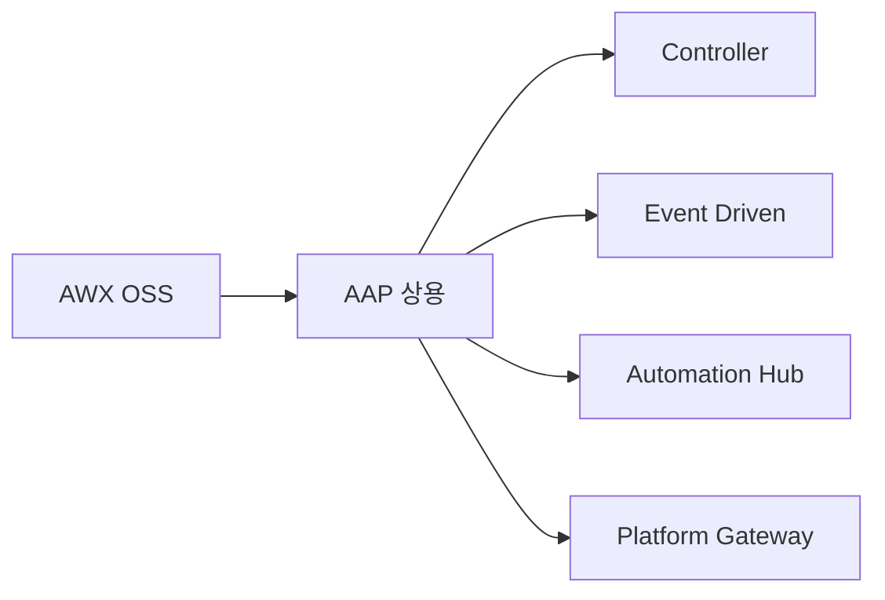
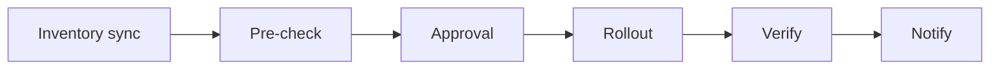
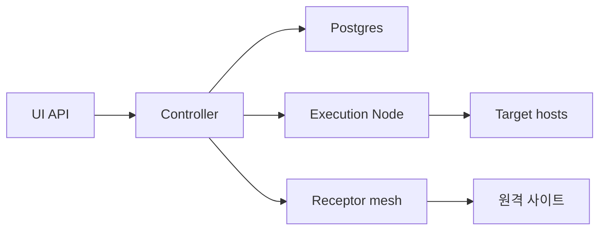
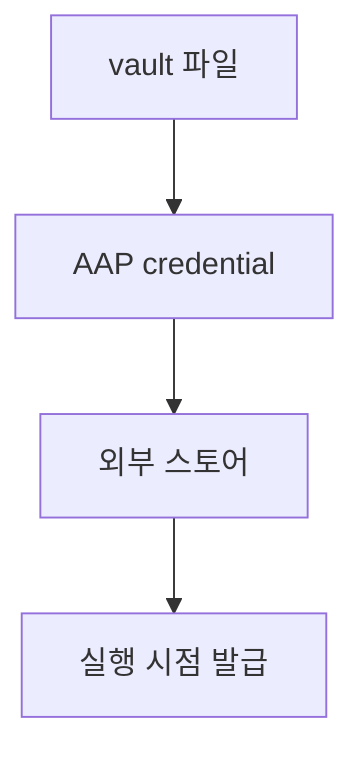

# Ansible 운영

> Playbook을 한 사람이 노트북에서 실행하는 단계를 넘으면 **누가·언제·
> 무엇을 적용했는지** 기록·승인·롤백·감사할 무대가 필요하다. 이 글은
> **AAP/AWX 표준 운영, scale, secret, RBAC, CI 통합** 등 운영 단계의
> 핵심을 다룬다.
>
> **현재 기준** (2026-04):
> - **Red Hat Ansible Automation Platform 2.6** (2025-10 GA) — Self-Service
>   Automation Portal, Automation Dashboard(ROI 메트릭), Ansible
>   Lightspeed Intelligent Assistant
> - **AAP 2.5** (2024-10) — 통합 UI·containerized installer 도입
> - **AWX**(OSS) — AAP의 upstream 커뮤니티
> - **ansible-core 2.19**, **ansible 12.x** 호환

- **전제**: [Ansible 기본](./ansible-basics.md), [State 관리
  ](../concepts/state-management.md)
- 본 글에서 다루지 않는 것: 시크릿 도구 깊이(Vault·ESO·SOPS)는
  `security/` 카테고리

---

## 1. 운영 단계로 가는 길

### 1.1 단계별 도구

| 단계 | 도구 | 누가·무엇 |
|---|---|---|
| Ad-hoc | `ansible-playbook` CLI | 1인, 노트북 |
| 팀 자동화 | + Git + CI(`gitlab-ci`/Actions) | 팀 단위 추적 |
| 엔터프라이즈 | **AAP / AWX** | 승인·RBAC·스케줄·감사 |
| 이벤트 기반 | **Event-Driven Ansible** | 알림·webhook 트리거 자동화 |

### 1.2 AAP·AWX 정리



| 영역 | AWX (OSS) | AAP (Red Hat 상용) |
|---|---|---|
| 라이선스 | Apache-2.0 | 서브스크립션 |
| 지원 | 커뮤니티 | Red Hat 24x7 |
| Tower | 구 명칭 (deprecated) | — |
| Controller | (이전 Tower) | 동일 |
| Event-Driven Ansible | 별도 OSS (event-driven-ansible) | 통합 |
| Automation Hub | 별도 (Galaxy NG) | 통합 |
| Platform Gateway (RBAC 통합) | — | AAP 2.5+ |
| 설치 | k8s operator만 | RPM·Operator·**Containerized**(2.5+) |

대부분의 엔터프라이즈는 AAP, OSS·연구·소규모는 AWX.

---

## 2. AAP/AWX 핵심 개념

### 2.1 객체 모델

| 객체 | 역할 |
|---|---|
| **Organization** | 최상위 격리 단위 (팀·BU) |
| **Team** | 사용자 그룹 |
| **User** | 개별 계정 |
| **Inventory** | 호스트·그룹 (정적 + dynamic) |
| **Project** | Git 리포지토리 동기화 단위 |
| **Job Template** | 실행 정의 (playbook + inventory + credential + ee) |
| **Workflow Template** | Job·Approval 노드의 그래프 |
| **Credential** | SSH key·API token·Vault·cloud 등 (암호화) |
| **Execution Environment** | 컨테이너 이미지 (engine + collections) |
| **Schedule** | cron 형태 자동 실행 |
| **Notification** | Slack·email·webhook |
| **Survey** | Job 실행 시 동적 입력 |

### 2.2 SCM 기반 Project

```yaml
# AAP/AWX Project 설정
SCM Type: Git
SCM URL: git@github.com:myorg/ansible-content.git
SCM Branch: main
SCM Update Options:
  - Update on launch: true     # job 실행 직전 동기화
  - Cache timeout: 0
  - Allow branch override: true
```

**원칙**: playbook을 UI에서 직접 업로드 금지. **Git이 진실**.

### 2.3 Inventory — Source

| Source | 용도 |
|---|---|
| Manual | 정적 ini/yml |
| **Sourced from Project** | repo의 inventory 파일 |
| **EC2/Azure/GCP/vSphere/OpenStack** | dynamic plugin |
| Custom Script | 사내 CMDB 연동 |
| Smart Inventory | 다른 inventory의 host 필터 |

### 2.4 Credential

| Credential Type | 용도 |
|---|---|
| Machine | SSH·sudo |
| Source Control | Git deploy key |
| Vault | ansible-vault password |
| **HashiCorp Vault Secret Lookup** | Vault에서 시크릿 동적 조회 |
| **HashiCorp Vault Signed SSH** | Vault 발급 단발 SSH 인증서 |
| Cloud (AWS/Azure/GCP/VMware) | API 인증 |
| AWX/AAP itself | tower-cli/awx-cli |
| Custom | 사용자 정의 plugin |

**`HashiCorp Vault Signed SSH`** = AAP 2.5+의 추천 패턴: Vault가
실행 시점에 단발 SSH 인증서를 발급해 SSH 키 영구 보유 없음.

---

## 3. 권한·RBAC

### 3.1 AAP 2.5+ Platform Gateway

기존 controller·EDA·Automation Hub의 RBAC가 **단일 Gateway에 통합**.
Organization → Team → User 계층에서 객체별 role 부여.

### 3.2 표준 Role

| Role | 권한 |
|---|---|
| Admin | 모든 작업 |
| Auditor | read-only |
| Project Admin | Project 수정·실행 |
| Inventory Admin | 인벤토리 수정 |
| **Job Template Execute** | **Job 실행만** (수정 불가) |
| Job Template Read | 보기만 |
| Approval | Workflow approval node 승인 |
| Use | 객체를 다른 곳에서 참조만 가능 |

### 3.3 Least privilege 패턴

```text
[전형적 매핑]
Junior Operator     → Job Template Execute (특정 inventory만)
SRE                  → Project Admin + Inventory Read
Platform Team       → Organization Admin
Audit                → Auditor (org-wide)
```

**원칙**: 사람은 read-only가 기본, **Job Template으로만 변경**.
콘솔 직접 변경은 break-glass.

### 3.4 SSO 통합

LDAP·SAML·OIDC·GitHub·Google·Azure AD. AAP 2.5+의 Gateway가 표준
SAML/OIDC 흐름 제공. role mapping은 외부 IdP의 group attribute로.

---

## 4. Workflow

### 4.1 Workflow Template

여러 Job·Approval·Inventory sync를 그래프로:



각 노드는 성공·실패·항상 실행 분기 가능. blue/green·canary 패턴 자연스럽게 표현.

### 4.2 Approval node

prod 변경의 표준 게이트:
- 지정된 사용자·팀만 승인 가능
- timeout 설정
- 승인 흐름 자체가 audit log로 기록

### 4.3 Survey

실행 시 동적 입력 받기:

```yaml
# Survey 예
- name: Target environment
  variable: env
  type: multiplechoice
  choices: [dev, stg, prod]
  default: dev
  required: true

- name: Branch override
  variable: scm_branch
  type: text
  required: false
```

UI에서 입력받아 extra_vars로 주입.

---

## 5. Scale — 대규모 인프라 운영

### 5.1 Forks·Strategy

```yaml
# job template
- forks: 50                   # 동시 host 50개
- strategy: linear            # default. 모든 host가 한 task 끝나야 다음
- strategy: free              # host별 독립 진행 (장애 host 영향 적음)
- strategy: host_pinned       # 한 host에 한 worker 고정
```

| Strategy | 적합 |
|---|---|
| linear | 일반, 동기화 필요 |
| free | 독립적 작업 (rolling 패치) |
| host_pinned | host당 일관 작업 |

### 5.2 Rolling — Serial과 fail policy

```yaml
- name: Rolling update web
  hosts: web
  serial: "20%"
  max_fail_percentage: 10
  any_errors_fatal: false
  
  pre_tasks:
    - name: Drain LB
      delegate_to: lb01.example.com
      community.general.haproxy:
        backend: web
        host: "{{ inventory_hostname }}"
        state: disabled
  
  tasks:
    - name: Apply update
      ansible.builtin.package:
        name: webapp
        state: latest
  
  post_tasks:
    - name: Re-enable in LB
      delegate_to: lb01.example.com
      community.general.haproxy:
        backend: web
        host: "{{ inventory_hostname }}"
        state: enabled
```

**fail policy 정확히**:
- `max_fail_percentage`: 한 batch에서 실패 허용 비율 — **0은 100% 실패 시에만 중단**(즉 이 값으로 zero-tolerance 안 됨)
- `any_errors_fatal: true`: 단일 host 실패 시 **즉시 전체 play 중단** — 진짜 zero-tolerance
- 안전 표준: `serial: 25%` + 적절한 `max_fail_percentage` 또는 `any_errors_fatal: true`

### 5.3 Fact caching

```ini
# ansible.cfg
[defaults]
gathering = smart
fact_caching = redis
fact_caching_connection = cache.example.com:6379:0   # host:port:db
fact_caching_timeout = 7200
```

| Backend | 적합 |
|---|---|
| `jsonfile` | 단일 controller |
| `redis` | 다중 controller·AWX execution node |
| `memcached` | 같음, redis가 일반적 |
| `mongodb` | 대규모 |

`smart` gathering: 캐시된 fact가 있으면 setup skip — 수백 노드 환경의
plan 시간을 분에서 초 단위로.

### 5.4 SSH 최적화

```ini
[ssh_connection]
pipelining = true
control_path = ~/.ssh/cm-%%r@%%h:%%p
control_path_dir = ~/.ssh/cm
ssh_args = -o ControlMaster=auto -o ControlPersist=60s -o PreferredAuthentications=publickey
```

- **pipelining = true**: 임시 파일 없이 원격 stdin으로 모듈 전달 — sudo 사용 시 `requiretty` 비활성화 필요
- **ControlMaster**: SSH 다중화 — 같은 host로 반복 접속 시 큰 가속
- **mitogen** strategy plugin: 더 큰 가속 가능했으나 **ansible-core
  2.19/Ansible 12부터 third-party strategy plugin이 deprecated 경로**
  — 신규 도입 비권장

### 5.5 AWX/AAP 인프라



- **Web/Task 컴포넌트**: 다중 replica로 HA
- **Execution Node**: job 실행, 횡으로 추가하면 동시성 증가
- **Automation Mesh** (백엔드 엔진은 Receptor): AAP 2.x의 분산 mesh —
  DMZ·여러 데이터센터로 job routing. 노드 종류:
  - **Control Node**: web/task UI·API
  - **Execution Node**: 실제 job 실행
  - **Hop Node**: 격리망 사이 라우팅 (DMZ 횡단의 핵심)
  - **Hybrid**: control + execution 겸임 (소규모)
- **Postgres**: AAP의 진실 — 백업·HA 필수

---

## 6. Secrets

### 6.1 계층



| 라벨 | 의미 |
|---|---|
| `vault 파일` | ansible-vault로 파일 단위 암호화 |
| `AAP credential` | AAP DB에 암호화 저장 |
| `외부 스토어` | HashiCorp Vault·AWS Secrets Manager 등 |
| `실행 시점 발급` | 단발 시크릿 동적 조회 |

| 단계 | 적합 |
|---|---|
| ansible-vault만 | 소규모, vault password 분실 위험 |
| AAP credential | 중간, AAP DB가 진실 |
| **외부 스토어 + lookup** | 글로벌 표준, 회전·감사·중앙 관리 |

### 6.2 Vault 동적 lookup

```yaml
- name: DB 패스워드를 매 실행마다 Vault에서 조회
  ansible.builtin.set_fact:
    db_password: >-
      {{ lookup('community.hashi_vault.vault_kv2_get',
                'secret/data/db',
                engine_mount_point='kv',
                url=vault_url,
                auth_method='approle',
                role_id=vault_role_id,
                secret_id=vault_secret_id).secret.password }}
  no_log: true
```

playbook이 시크릿을 **소유하지 않음**. AAP는 AppRole로 Vault에 인증
→ 동적 secret 받아 task에 전달 → playbook 종료 후 폐기.

### 6.3 Vault Signed SSH (AAP 2.5+)

매 실행마다 단발 SSH 인증서 발급:

```text
[흐름]
1. Job 시작
2. AAP credential plugin이 Vault에 SSH 키 sign 요청
3. Vault가 단발 인증서 발급 (5~30분 TTL)
4. AAP가 ssh -i certificate target host
5. 작업 종료 → 인증서 만료
```

장기 SSH key 영구 보유 없음. **2026 글로벌 표준**으로 자리잡는 중.

### 6.4 Hub 통합 secret backends

| Plugin | 출처 |
|---|---|
| HashiCorp Vault Secret Lookup | 일반 KV·KV2 |
| HashiCorp Vault Signed SSH | SSH CA |
| AWS Secrets Manager | AWS |
| Azure Key Vault | Azure |
| CyberArk | 엔터프라이즈 |
| Centrify | 엔터프라이즈 |
| GitHub App | git deploy key 동적 |

상세는 → `security/`

---

## 7. CI 통합

### 7.1 GitHub Actions 예시

```yaml
on:
  push:
    branches: [main]
    paths: ['ansible/**']

jobs:
  lint:
    runs-on: ubuntu-latest
    steps:
      - uses: actions/checkout@v4
      - uses: actions/setup-python@v5
        with: { python-version: "3.12" }
      - run: pipx install ansible-core
      - run: pipx install ansible-lint
      - run: ansible-galaxy collection install -r ansible/requirements.yml
      - run: ansible-lint ansible/

  syntax:
    needs: lint
    steps:
      - run: ansible-playbook --syntax-check ansible/site.yml

  test:
    needs: syntax
    steps:
      - run: pip install molecule molecule-plugins[docker]
      - run: cd ansible/roles/nginx && molecule test
```

### 7.2 AAP 자동 sync

GitHub push → AAP webhook → Project sync. Job Template이 항상 최신
HEAD 사용.

```text
[권장 흐름]
1. PR 생성 → CI에서 lint·syntax·molecule
2. PR merge → main 브랜치 동기화
3. AAP webhook → Project sync
4. 사람: AAP에서 Job Template Launch (또는 Workflow approval)
5. Audit log + notification
```

### 7.3 Drift detection

Ansible 자체에는 state 없음 → **`--check`** 모드로 변경 발생 여부만
확인:

```bash
ansible-playbook site.yml --check --diff
# 변경 발생 시 changed=N으로 출력
```

CI에서 정기 실행 → `changed > 0`이면 알림. 진정한 IaC drift 감지는
**Terraform plan**과 다른 모델 — Ansible은 "재적용해서 무엇이 바뀌는가"
관점.

---

## 8. 감사·로깅

### 8.1 AAP 자체 감사 로그

- 모든 Job 실행: who, when, inventory, credential, extra_vars(시크릿 마스킹)
- API 호출 로그
- RBAC 변경 이력
- approval 이력

### 8.2 외부 SIEM 연동

| 백엔드 | 용도 |
|---|---|
| Splunk | 표준 |
| ELK / OpenSearch | OSS |
| Loki | Grafana 스택 |
| Sumo Logic / Datadog | SaaS |

```yaml
# AAP 설정 → Logging
log_aggregator: splunk
log_aggregator_host: hec.splunk.example.com
log_aggregator_protocol: https
```

playbook 출력은 별도 — task별 stdout을 SIEM으로 보내는 패턴은
`ansible.builtin.callback` plugin 또는 EE에 logging 도구 통합.

---

## 9. 백업·DR

### 9.1 백업 대상

| 자산 | 도구 |
|---|---|
| Postgres | `pg_dump`, AAP backup playbook |
| Inventory·Credential·Project 메타 | DB 포함 |
| Custom EE 이미지 | image registry |
| 사내 collection | private Galaxy/Pulp |
| ansible-vault password | 별도 보관 (KMS·종이) |
| webhook secret·인증 정보 | DB 포함, 키 회전 정책 |

### 9.2 AAP 공식 backup·restore

```bash
# RPM 설치 환경
ansible-playbook -i inventory \
  /opt/ansible-automation-platform/installer/backup.yml

# 결과 tarball을 안전 보관 (다른 사이트·암호화)
```

### 9.3 DR 권장

- multi-AZ Postgres + read replica
- Object storage(S3·MinIO)에 backup 일일 동기화
- 1년에 1회 "처음부터" 복구 훈련 — 모르면 굳어 있음

---

## 10. 안티패턴

| 안티패턴 | 왜 문제 | 교정 |
|---|---|---|
| AAP/AWX UI에서 playbook 직접 업로드 | Git 진실성 깨짐 | SCM Project 기반 |
| 모든 사람이 Admin role | 사고 시 blast radius | least privilege + Job Template Execute |
| credential을 playbook 변수로 평문 | git/log 유출 | AAP credential 또는 외부 lookup |
| 단일 controller로 prod 운영 | SPOF | replica + HA Postgres |
| Postgres 백업 없음 | DB 손상 = 운영 정지 | 일일 backup + DR 훈련 |
| EE 없이 controller에 직접 collections 설치 | 재현성·공급망 보안 부재 | EE + lock된 collections |
| `forks` 너무 높음 | controller OOM, target 폭주 | 50~100, 모니터링 |
| `serial` 없는 prod rolling | 전 cluster 동시 재시작 | `serial: 25%` |
| `max_fail_percentage: 0`을 zero-tolerance로 오해 | 실제는 100% 실패에만 중단 | `any_errors_fatal: true` |
| Workflow에 approval 없는 prod | 실수 한 번이 전체 영향 | approval node 강제 |
| Survey에 시크릿 입력 | 평문 평가 로그 가능 | credential lookup |
| inventory를 controller 로컬 파일로 | 작업자 차이 | SCM 동기화 또는 dynamic |
| AAP audit log 보관 30일만 | compliance 미충족 | 외부 SIEM long-retention |
| Vault Signed SSH 미도입 후 SSH key 영구 보유 | 키 회전·감사 어려움 | Vault Signed SSH |
| ansible-pull로 prod 노드 자체 동기화 | 인증·감사 약함 | Push + AAP 또는 immutable 이미지 |
| EE 이미지 latest 태그 | 자동 업그레이드 사고 | 명시 태그 + 정기 패치 |
| receptor mesh 디자인 없이 multi-site | 격리·DMZ 통과 어려움 | 사전 mesh 설계 |
| approval timeout 없음 | 영원히 대기 | 적절 timeout + 만료 시 fail |
| custom callback plugin이 PII 로그 | 감사 위반 | `no_log` + 마스킹 정책 |

---

## 11. 도입 로드맵

1. **Git 표준화** — 모든 playbook이 Git에 있고 SCM project 동기화
2. **collections requirements + EE** — 재현성 확보
3. **AWX 또는 AAP 도입** — k8s operator 또는 containerized installer
4. **Inventory dynamic 전환** — vSphere/AWS/openstack/CMDB
5. **RBAC 분리** — Admin·Operator·Auditor
6. **Credential을 외부 vault로** — HashiCorp Vault·Secrets Manager
7. **Vault Signed SSH 도입** — SSH key 영구 보유 제거
8. **Workflow + Approval** — prod 게이트 강제
9. **CI 통합** — lint·molecule·webhook
10. **Drift 감지 정기 `--check`**
11. **Backup·DR 훈련 정례화**

---

## 12. 관련 문서

- [Ansible 기본](./ansible-basics.md) — 언어·구조·idempotency
- [IaC 개요](../concepts/iac-overview.md) — 도구 지도
- [Terraform 기본](../terraform/terraform-basics.md) — 보완 도구
- [IaC 테스트](../operations/testing-iac.md) — molecule, ansible-lint
- 시크릿 도구 상세: `security/` 카테고리

---

## 참고 자료

- [Red Hat AAP 2.5 What's new](https://developers.redhat.com/blog/2024/10/01/whats-new-red-hat-ansible-automation-platform-25) — 확인: 2026-04-25
- [AAP 2.6 What's new](https://www.redhat.com/en/blog/whats-new-in-ansible-automation-platform-2.6) — 확인: 2026-04-25
- [AAP 2.6 Documentation](https://docs.redhat.com/en/documentation/red_hat_ansible_automation_platform/2.6) — 확인: 2026-04-25
- [AAP RBAC (Gateway, 2.5+)](https://docs.redhat.com/en/documentation/red_hat_ansible_automation_platform/2.6/html/access_management_and_authentication/gw-managing-access) — 확인: 2026-04-25
- [AWX 공식 문서](https://ansible.readthedocs.io/projects/awx/) — 확인: 2026-04-25
- [HashiCorp Vault Signed SSH + AAP](https://developer.hashicorp.com/validated-patterns/vault/integrate-vault-ssh-with-ansible-automation-platform) — 확인: 2026-04-25
- [community.hashi_vault collection](https://docs.ansible.com/projects/ansible/latest/collections/community/hashi_vault/index.html) — 확인: 2026-04-25
- [Ansible Receptor (mesh)](https://github.com/ansible/receptor) — 확인: 2026-04-25
- [Ansible Hardening (AAP 2.5)](https://docs.redhat.com/en/documentation/red_hat_ansible_automation_platform/2.5/html/hardening_and_compliance/hardening-aap) — 확인: 2026-04-25
- [Event-Driven Ansible](https://www.redhat.com/en/technologies/management/ansible/event-driven-ansible) — 확인: 2026-04-25
