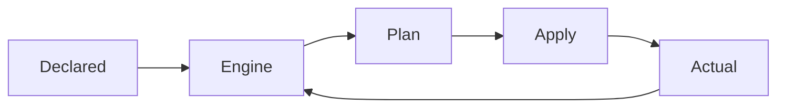
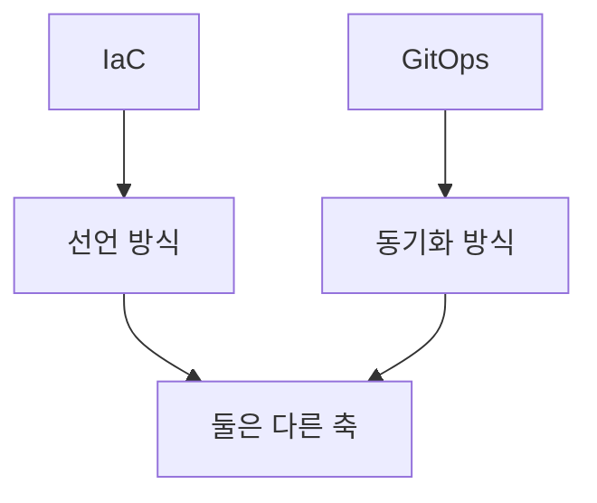
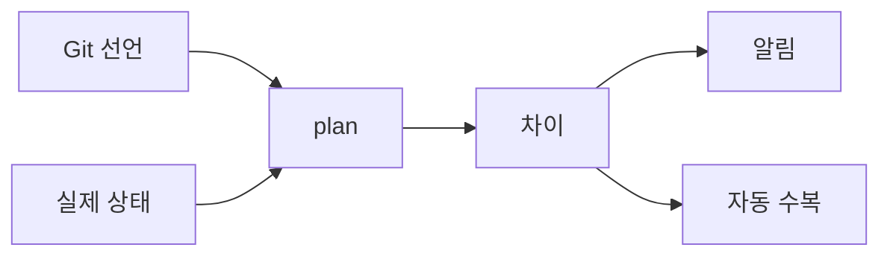

# IaC 개요

> "서버 한 대를 손으로 구성하면 스노우플레이크 하나가 생긴다. 100대면
> 100개의 스노우플레이크다." Infrastructure as Code(IaC)는 인프라를
> **버전 관리 가능한 텍스트**로 정의해 동일한 결과를 반복 재현하는
> 공학. 이 글은 IaC의 **철학·모델·도구 분류·성숙도**를 다룬다.
>
> **Gartner 예측**: 2025년 클라우드 보안 실패의 75%가 IaC 관리 부실에서
> 발생. DataStackHub(2025)에 따르면 설정 이슈 평균 감지 시간이 180일을
> 넘으며, 성숙한 IaC 환경에서는 40%+ 단축 가능. **DORA**는 IaC 채택과
> Deployment Lead Time·Change Failure Rate 개선 사이의 상관을 매년 보고.

- **전제**: 셸 스크립트로 서버를 구성해본 경험, Git 기본, YAML·JSON 독해
- **개별 도구**(Terraform·Ansible·Crossplane)는 각 전용 글에서 다룬다
- **State 상세**는 [State 관리](./state-management.md)

---

## 1. IaC란 무엇인가

### 1.1 정의

**Infrastructure as Code** = 서버·네트워크·스토리지·관리형 서비스를
**코드**(텍스트 파일)로 선언하고, 툴이 그 선언을 실제 인프라로
변환·유지하는 방식.

| 항목 | 수동 운영 | IaC |
|---|---|---|
| 변경 기록 | 티켓·채팅 | Git commit |
| 동일 환경 재현 | 체크리스트 | `apply` 1회 |
| 리뷰 | 구두·문서 | PR 리뷰 |
| 롤백 | 메모리·운빨 | `git revert` + `apply` |
| 감사 | 로그 긁어 모으기 | `git log` + 상태 파일 diff |
| 온보딩 | "선배에게 물어봐" | 리포지토리 clone |

### 1.2 IaC가 해결하는 4가지 문제

1. **환경 드리프트**(Environment Drift) — dev·staging·prod가 조금씩
   달라져 "내 컴퓨터에선 되던데"를 인프라에서 재현
2. **구성 드리프트**(Configuration Drift) — 동일 환경의 서버들이
   시간이 지나며 각기 달라짐 (snowflake)
3. **복구 불가능성** — 재해 발생 시 "어떻게 구성했는지" 아무도 모름
4. **변경 가시성 부재** — 누가·언제·왜 바꿨는지 추적 불가

### 1.3 IaC가 해결하지 **못하는** 것

| 착각 | 현실 |
|---|---|
| "IaC 쓰면 운영이 자동화된다" | **provisioning**은 자동, day-2 운영은 별도 (드리프트·장애·확장) |
| "IaC 쓰면 안전해진다" | 하드코딩된 시크릿·과한 권한이 `git push` 한 번에 유출 가능 |
| "IaC = GitOps" | IaC는 **선언 방식**, GitOps는 **동기화 방식**. 겹치지만 다른 축 |
| "IaC 쓰면 빨라진다" | 처음 6~12개월은 느려짐. 학습·표준화·모듈화 비용 |

---

## 2. Declarative vs Imperative

IaC 도구를 이해하는 첫 번째 축.

### 2.1 두 패러다임 비교

| 축 | Declarative | Imperative |
|---|---|---|
| 기술 초점 | **What** (원하는 결과) | **How** (도달 절차) |
| 실행 모델 | 현재 상태와 목표 상태를 비교해 diff만 적용 | 명령을 순서대로 실행 |
| 멱등성(Idempotency) | 기본 제공 | 직접 구현 필요 |
| 순서 의존성 | 도구가 의존성 그래프 계산 | 작성자가 순서 보장 |
| 드리프트 감지 | 지원 (`plan`) | 어려움 |
| 대표 도구 | Terraform, OpenTofu, Crossplane, CloudFormation, Bicep | 셸 스크립트, AWS CLI loops |
| 회색지대 | — | **Ansible**: YAML은 선언형 외피, 내부는 task 순차 실행 |
| 프로그래밍 | DSL (HCL, YAML) | 범용 언어 |
| 예외 | **Pulumi** (범용 언어로 선언) |  |

### 2.2 왜 대부분 Declarative로 수렴하는가

- 엔진이 항상 "현재 vs 목표"를 계산하므로 **반복 실행 안전** = 멱등성
- 변경 미리보기(`plan`)로 리뷰 가능
- 상태가 **데이터**(state)로 저장되므로 드리프트 감지·수정이 자연스러움

**Imperative가 여전히 의미 있는 곳**: 일회성 migration, OS 레벨
runbook, 범용 언어의 표현력이 필요한 동적 계산 — Pulumi가 이 틈새를
"선언형 결과 + 범용 언어 정의"로 메움.

### 2.3 하이브리드 트렌드 (2026)

- **Pulumi**: Python·Go·TypeScript로 리소스를 정의하되 엔진은 declarative
- **Terraform CDK (CDKTF)**: CDK로 작성 → HCL로 컴파일
- **Terraform Stacks**(2025 GA) / Project Infragraph: 단일 stack을
  넘어 **stack 간 의존성·오케스트레이션**을 1급으로 다루는 방향
- **AI 보조 생성**: 자연어 → HCL/YAML 초안 (2025~2026 범용화)
- 핵심은 여전히 **엔진이 상태 diff를 계산**한다는 선언형 원칙

---

## 3. Mutable vs Immutable Infrastructure

### 3.1 두 모델

| 축 | Mutable | Immutable |
|---|---|---|
| 변경 방식 | 기존 서버에 SSH → 수정 | 새 이미지 빌드 → 교체 |
| 상태 저장 | 서버가 진실 | 이미지·IaC가 진실 |
| 롤백 | 수동 역적용 | 이전 이미지로 swap |
| 스노우플레이크 | 발생 | 방지 |
| 대표 도구 | Ansible (in-place) | Packer + Terraform, 컨테이너, AMI |
| 적합 | Bare-metal, 소규모 | 클라우드, 쿠버네티스, 대규모 |

### 3.2 Immutable이 주류가 된 이유

1. **컨테이너** — 이미지가 불변 단위. 수정 = 재빌드 + 재배포
2. **클라우드** — VM 띄우는 비용이 사실상 0, 교체가 수정보다 쌈
3. **오토스케일링** — 수백 대 서버를 일일이 패치 불가 → 이미지 교체
4. **보안** — 장기 실행 서버의 공격 표면 최소화

### 3.3 현실의 하이브리드

- **Immutable 외부 + Mutable 내부**: Kubernetes 워크로드는 불변,
  ConfigMap·Secret은 변경 가능
- **Ansible의 생존 영역**: OS 튜닝(sysctl·limits), on-prem 베어메탈,
  네트워크 장비, 기존 레거시 시스템
- **Ansible의 immutable 활용**: Packer + Ansible provisioner로 AMI·
  컨테이너 이미지를 **빌드 시점에만** 구성 — 런타임은 불변. 즉 같은
  도구가 두 모델 모두에 쓰임 (in-place 적용 vs 이미지 베이킹)
- **둘 다 IaC** — Immutable만 IaC라는 주장은 오해

---

## 4. Push vs Pull 모델

누가 변경을 **적용**하는가.

| 모델 | 흐름 | 대표 도구 | 장점 | 단점 |
|---|---|---|---|---|
| **Push** | CI 러너가 인프라에 `apply` | Terraform, Ansible, Pulumi | 단순, 기존 CI 재사용 | 러너가 장기 credential 보유 |
| **Pull** | 타겟이 원하는 상태를 주기 pull | Crossplane, Argo CD, Flux | credential 중앙화, 드리프트 자동 수복 | 러닝 컨트롤러 필요 |

**GitOps** 흐름은 기본적으로 pull (Argo CD·Flux가 클러스터 내부에서
Git을 polling) — 이 때문에 "GitOps = IaC의 운영 모델 중 하나"로
정리됨.

---

## 5. GitOps와 IaC의 관계

### 5.1 흔한 오해

- **IaC = 인프라를 어떻게 표현할 것인가** (declarative, 코드화)
- **GitOps = 그 코드를 어떻게 실 환경에 반영할 것인가** (Git 단방향,
  pull, 자동 reconcile)
- 둘은 겹치지만 **직교**. Terraform push 파이프라인도 IaC이지만
  GitOps는 아님.

### 5.2 IaC 없이 GitOps는 불가능

GitOps의 대전제는 "Git의 선언이 **진실**"이다. 즉 인프라가 declarative
로 기술되어 있어야 GitOps 엔진이 diff를 계산할 수 있다. **Declarative
IaC가 GitOps의 전제**.

### 5.3 2026 업계 방향

- **"Git 밖 변경은 드리프트"** 원칙이 기본 운영 위생으로 자리잡음
- **Policy as Code**(OPA·Kyverno)가 GitOps 파이프라인의 필수 게이트
- 탐지만 하고 수정 안 하는 tool은 도태 → **자동 수복**이 당연시됨
- 상세 GitOps 도구 연계는 `cicd/` 참조 (본 카테고리는 provisioning 위주)

---

## 6. 2026 IaC 도구 지도

### 6.1 주요 도구 분류

| 도구 | 분류 | 언어 | 라이선스 | 상태 저장 | 모델 | 특징 |
|---|---|---|---|---|---|---|
| **Terraform** | Provisioning | HCL | BSL-1.1 (1.6+) | State 파일 | Declarative | 최대 생태계, HashiCorp 상용 |
| **OpenTofu** | Provisioning | HCL | MPL-2.0 | State 파일 | Declarative | Terraform 1.6 fork, **CNCF Sandbox**(2025-04) |
| **Pulumi** | Provisioning | Python·Go·TS·C#·Java | Apache-2.0 | Pulumi state | Declarative(hybrid) | 범용 언어, OSS + SaaS |
| **Crossplane** | Provisioning (K8s-native) | YAML(CR) | Apache-2.0 | etcd | Declarative | **CNCF Graduated**(2025-10), K8s 컨트롤 플레인 |
| **Ansible** | Config Mgmt | YAML | GPL-3.0 | 없음(에이전트리스) | 절차형 선언 | push 기반, OS·네트워크 |
| **CloudFormation** | Provisioning | YAML/JSON | (Amazon) | AWS 관리 | Declarative | AWS 전용 |
| **Bicep** | Provisioning | DSL | MIT | Azure 관리 | Declarative | Azure 전용, ARM의 후계 |
| **AWS CDK / CDK for Terraform** | Wrapper | TS·Py·Go | Apache-2.0 | 하위 도구에 위임 | Declarative | 범용 언어 DX |
| **kro**(Kube Resource Orchestrator) | K8s 합성 | YAML | Apache-2.0 | etcd | Declarative | AWS·Azure·Google 공동, **alpha v1alpha1**, CNCF 거버넌스 채택 중, **프로덕션 부적합** |
| **Packer** | 이미지 빌드 | HCL | BSL-1.1 | 없음 | 절차형 | VM·컨테이너 이미지 생성, IaC의 빌드 단계 |

### 6.2 선택 기준 요약

| 시나리오 | 1순위 | 대안 |
|---|---|---|
| 멀티클라우드 범용 | Terraform / OpenTofu | Pulumi |
| **온프레미스 중심** (vSphere·OpenStack·베어메탈) | Terraform / OpenTofu | Ansible |
| Kubernetes 중심 컨트롤 플레인 | Crossplane | kro |
| 개발자 DX(코드와 통합) | Pulumi | CDKTF |
| OS 수준 구성·패치·네트워크 장비 | Ansible | — |
| 클라우드 단일 벤더 lock-in 허용 | CloudFormation / Bicep | 네이티브 도구 |

**본 위키의 전제**(온프레미스 중심): Terraform/OpenTofu + Ansible +
Crossplane이 핵심 축. 클라우드 Landing Zone은 원칙 제외.

### 6.3 OpenTofu 분기의 의미

2023-08 HashiCorp가 Terraform을 **BSL(Business Source License)** 로
전환 → 경쟁 SaaS의 사용 제한. Linux Foundation 산하에서 fork한
**OpenTofu**(MPL-2.0) 출범 후 **2025-04 CNCF Sandbox**로 편입. 2026
현재:

- **OpenTofu**는 Terraform 1.6 이후 **독자 기능**(state encryption,
  early variable evaluation, dynamic provider iteration 등) 추가 +
  CNCF 거버넌스로 벤더 중립성 강화
- **Terraform**은 HashiCorp 상용 기능 통합 (**Stacks** GA, Project
  Infragraph, ephemeral values)
- 기본 HCL·provider는 상호 호환이지만 분기 가속 중 → [OpenTofu vs
  Terraform](../terraform/opentofu-vs-terraform.md)

---

## 7. IaC Maturity Model

5단계 성숙도 모델 (CSA "IaC Maturity Curve"(2025) 등 업계 모델 종합).
현재 팀이 어느 단계인지 자각이 도입 전략의 출발.

| Level | 상태 | 특징 |
|---|---|---|
| **0** | Ad-hoc | 콘솔·SSH 수동 구성, 스크립트 개인 보유 |
| **1** | Scripted | 셸·Ansible로 구성 자동화, 버전 관리 일부 |
| **2** | Declarative | Terraform·CloudFormation 선언형 도입, state 관리 |
| **3** | Modularized | 모듈·템플릿 공유, 환경별 variable 분리, PR 리뷰 |
| **4** | **Policy-governed GitOps** | Git 단방향·자동 reconcile·Policy as Code 게이트·드리프트 자동 수복 |

### 7.1 단계별 대표 징후

| Level | "이것이 보이면 해당 단계" |
|---|---|
| 0 | "지난주에 누가 이 보안 그룹 바꿨지?" |
| 1 | `setup.sh` 같은 스크립트가 repo에 있음. 실행 순서 Slack 검색 |
| 2 | Terraform 있음, state가 S3/원격, 팀원 1명만 `apply` |
| 3 | 환경별 workspace/디렉토리, 모듈 버전 tagging, PR 리뷰 강제 |
| 4 | 콘솔 write 금지, OPA·Sentinel 게이트, 드리프트 자동 복구 |

### 7.2 Level 상승의 핵심

- **0→1**: 스크립트화 + Git commit
- **1→2**: Declarative 도입 + **remote state**(=lock, 공유)
- **2→3**: **모듈 표준화** + **변수 분리** + **리뷰 강제**
- **3→4**: **Policy as Code** + **자동 reconcile/드리프트 수복** +
  **콘솔 변경 차단**

각 단계는 기술 선택 이상으로 **조직 합의**가 동반되어야 유지됨.

---

## 8. Day-2 Operations

프로비저닝은 시작일 뿐. IaC의 진짜 난이도는 **운영 단계**에 있다.

### 8.1 Day-2에서 다루는 문제

| 문제 | 예시 | 대응 |
|---|---|---|
| **드리프트** | 긴급 대응으로 콘솔에서 SG 변경 | 주기 `plan` + 알림, reconcile 주기 ↓ |
| **버전 이행** | provider v4 → v5, schema breaking | staging에서 먼저, 모듈 version pin |
| **비용 변화** | 리소스 추가로 월 과금 급증 | `terraform-cost-estimation`, FinOps 태깅 |
| **보안 패치** | AMI CVE 긴급 | 이미지 재빌드 + 오토스케일 교체 |
| **의존성 지옥** | 수백 모듈 업데이트 | renovate·dependabot, semver 강제 |
| **스테이트 파괴** | 잘못된 `rm -rf .tfstate` | state 백업·버저닝 필수 |
| **팀 간 의존** | 네트워크팀 CIDR 변경 | state 분리 + `terraform_remote_state` / output |

### 8.2 드리프트 감지 패턴

- **Scheduled plan**: 1h~1d 주기로 `plan` 실행, diff 발생 시 알림
- **Event-driven**: 클라우드 이벤트(CloudTrail·Audit Log)로 변경 감지
- **Continuous reconcile**: Crossplane/ArgoCD의 상시 reconcile
- 2026 트렌드: **탐지에 그치지 말고 자동 수정까지**

### 8.3 콘솔 변경 차단

Level 4의 핵심. "Git 밖 변경이 가능하면 governance 아니다."

- **IAM 정책**으로 write 경로 차단 (SCP, Azure Policy, GCP Org Policy)
- **Service Account·운영자 계정** 분리 — 사람은 read-only
- **Break-glass 절차** — 긴급 시 임시 권한 + 자동 감사 기록

---

## 9. 안티패턴

| 안티패턴 | 왜 문제 | 교정 |
|---|---|---|
| 하나의 거대한 state | lock 경합, blast radius 전체 | stack·workspace 분할 |
| state를 Git에 커밋 | state에 시크릿 포함됨, lock 불가 | remote backend + encryption |
| module version pin 없음 | provider·module 업데이트로 깨짐 | semver pin, `~> 1.2` |
| variable 하드코딩 | 환경별 재사용 불가 | `.tfvars` per env + CI injection |
| 콘솔·IaC 병행 변경 | 드리프트 일상화 | 콘솔 write 차단 |
| `apply -auto-approve` 무조건 | plan 리뷰 없이 배포 | PR plan 자동 post, 수동 승인 |
| 시크릿을 variable에 평문 | tfvars·state에 유출 | Vault·ESO·SOPS (→ `security/`) |
| 모든 리소스에 `count = var.enabled ? 1 : 0` | state key가 index에 묶여 순서 변경 시 destroy | `for_each` 사용 (단, `count`→`for_each` 전환은 `state mv` 필요) |
| **provider/module checksum 미커밋** (`.terraform.lock.hcl` 무시) | 빌드 시점마다 다른 binary, 공급망 공격 노출 | lock 파일 commit + CI에서 `init -lockfile=readonly` (상세는 `security/`) |
| `provisioner "local-exec"` 남용 | 재현성 파괴, 선언형 이탈 | provider·module로 대체 |
| 대규모 import 없이 인계 | "이 리소스는 Terraform 밖" 누수 | `terraform import` + tag 기반 차단 |
| 환경별 코드 복붙 | 3개 env × 10 stack = 30 repo 동기화 | 모듈 + variable |
| destroy 테스트 없음 | 생성은 되지만 삭제가 고장 | CI에 `plan -destroy` |
| docs 없는 모듈 | 재사용 불가 | `README.md` + `terraform-docs` |
| Ansible로 클라우드 provisioning | state 없음, 드리프트 감지 어려움 | provisioning은 Terraform, config는 Ansible |
| 모든 리소스에 태그 없음 | 비용·소유자·환경 추적 불가 | 필수 태그 정책(OPA) 강제 |

---

## 10. 도입 로드맵

1. **범위 확정** — 어디까지 IaC로 관리할지 (네트워크만? 전체?)
2. **도구 선정** — Terraform/OpenTofu + Ansible 조합이 무난한 출발
3. **remote state + lock** — state 공유·동시 변경 차단 (§8·[State](./state-management.md))
4. **디렉토리 구조·네이밍 표준** — `env/{dev,stg,prod}/{stack}/`
5. **모듈화** — 2번째 복붙이 생기면 즉시 모듈화
6. **CI 통합** — PR에서 `plan`, merge 시 `apply` (또는 GitOps)
7. **시크릿 분리** — Vault/ESO/SOPS (→ `security/`)
8. **Policy as Code** — OPA/conftest로 모듈 검증
9. **드리프트 탐지** — 주기 plan + 알림
10. **콘솔 변경 차단** — IAM으로 write 경로 막기
11. **비용 가시화** — 태그 정책 + 예산 알림
12. **IaC 테스트** — Terratest·policy test ([IaC 테스트](../operations/testing-iac.md))

각 단계는 앞 단계가 정착된 뒤 다음으로. 한 번에 Level 4를 목표로
하면 대개 좌초한다.

---

## 11. 관련 문서

- [State 관리](./state-management.md) — state·lock·drift 감지
- [Terraform 기본](../terraform/terraform-basics.md) — HCL·provider·resource
- [Ansible 기본](../ansible/ansible-basics.md) — 구성 관리의 주인공
- [Crossplane](../k8s-native/crossplane.md) — K8s-native IaC
- [OpenTofu vs Terraform](../terraform/opentofu-vs-terraform.md) — 분기 이후

---

## 참고 자료

- [HashiCorp: What is Infrastructure as Code](https://developer.hashicorp.com/terraform/intro) — 확인: 2026-04-25
- [CNCF: Crossplane Graduation (2025-11-06)](https://www.cncf.io/announcements/2025/11/06/cloud-native-computing-foundation-announces-graduation-of-crossplane/) — 확인: 2026-04-25
- [CNCF: OpenTofu 프로젝트 페이지 (Sandbox 2025-04)](https://www.cncf.io/projects/opentofu/) — 확인: 2026-04-25
- [kro 공식 — Alpha 표기](https://kro.run/docs/overview/) — 확인: 2026-04-25
- [HashiCorp BSL 발표 (2023-08)](https://www.hashicorp.com/en/blog/hashicorp-adopts-business-source-license) — 확인: 2026-04-25
- [Terraform Dependency Lock](https://developer.hashicorp.com/terraform/language/files/dependency-lock) — 확인: 2026-04-25
- [DORA State of DevOps Report](https://dora.dev/research/) — 확인: 2026-04-25
- [Microsoft Azure Well-Architected: IaC](https://learn.microsoft.com/en-us/azure/well-architected/operational-excellence/infrastructure-as-code-design) — 확인: 2026-04-25
- [Red Hat: What is IaC](https://www.redhat.com/en/topics/automation/what-is-infrastructure-as-code-iac) — 확인: 2026-04-25
- [ThoughtWorks Tech Radar — IaC 항목 주기 업데이트](https://www.thoughtworks.com/radar) — 확인: 2026-04-25
- [CSA: IaC Maturity Curve (2025)](https://cloudsecurityalliance.org/blog/2025/07/22/the-iac-maturity-curve-are-you-securing-or-scaling-your-risk) — 확인: 2026-04-25
- [env0: Drift Detection in IaC](https://www.env0.com/blog/drift-detection-in-iac-prevent-your-infrastructure-from-breaking) — 확인: 2026-04-25
- [Cycloid: Day 2 Operations (2026)](https://www.cycloid.io/blog/day-2-operations-a-practical-guide-for-managing-post-deployment-complexity/) — 확인: 2026-04-25
- [ControlMonkey: 2026 IaC Predictions](https://controlmonkey.io/blog/2026-iac-predictions/) — 확인: 2026-04-25
- [The New Stack: IaC — Imperative to Declarative and Back Again](https://thenewstack.io/infrastructure-as-code-from-imperative-to-declarative-and-back-again/) — 확인: 2026-04-25
- [OpenTofu Foundation](https://opentofu.org/) — 확인: 2026-04-25
- [Crossplane 공식 문서](https://docs.crossplane.io/) — 확인: 2026-04-25
