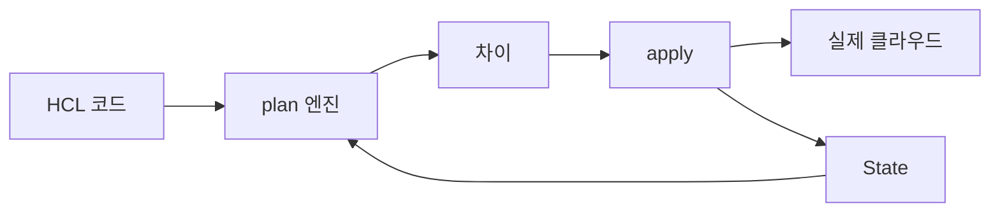
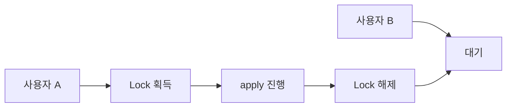
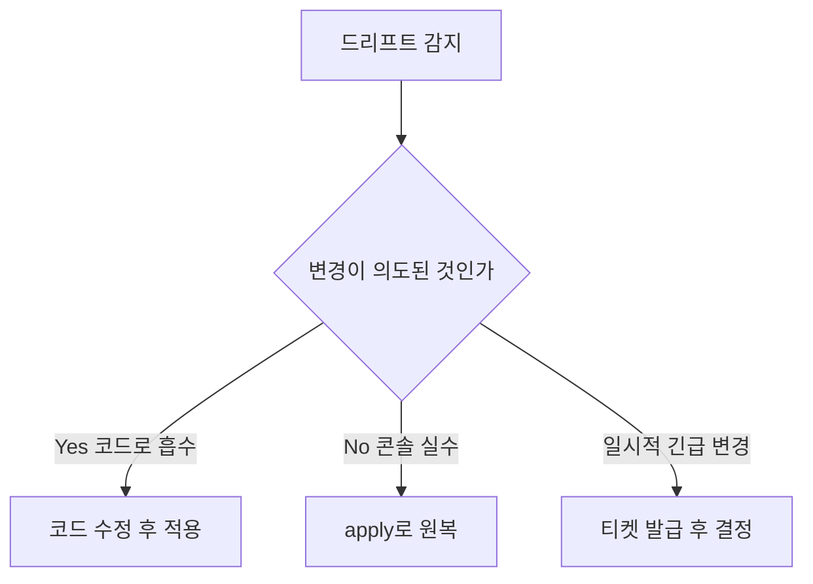

# State 관리

> Declarative IaC의 심장. **State는 "내가 만든 게 무엇인지 기억하는
> 장부"**다. 코드는 "원하는 것"을 적고, state는 "지금까지 만든 것"을
> 적으며, plan은 둘의 차이를 계산한다.
>
> State 관리 실패의 결과:
> - 같은 리소스 두 번 만들기 (혹은 destroy)
> - 동시 apply로 인한 corruption
> - 시크릿 평문 노출
> - 드리프트 누적으로 복구 불가
>
> 이 글은 **Terraform/OpenTofu 중심**으로 다루되, 원칙은 다른 도구에도
> 그대로 적용된다.

- **전제**: [IaC 개요](./iac-overview.md)
- **세부 Terraform 운영**은 [Terraform State](../terraform/terraform-state.md)
  에서 다루고, 본 글은 **개념·전략**에 집중

---

## 1. State란 무엇인가

### 1.1 왜 필요한가

코드만으로는 부족한 정보:

| 정보 | 코드에서 알 수 있나? | State 필요? |
|---|---|---|
| 리소스의 **고유 ID** (AWS resource ID, K8s UID) | ❌ | ✅ |
| 리소스 간 **의존성 그래프** (계산된) | 일부 | ✅ |
| 마지막 apply 시점의 **속성 값** | ❌ | ✅ |
| 어떤 리소스가 **이 코드의 소유**인지 | ❌ | ✅ |

State는 "코드의 선언" ↔ "실제 클라우드 리소스" 사이의 **매핑 테이블**.
이게 없으면 코드를 한 번 더 적용했을 때 같은 리소스를 또 만든다.

### 1.2 State가 담는 내용

Terraform `terraform.tfstate` 핵심 필드:

| 필드 | 내용 |
|---|---|
| `version` | state 포맷 버전 |
| `terraform_version` | 마지막 apply 시 도구 버전 |
| `serial` | 매 변경마다 증가 (충돌 감지용) |
| `lineage` | state 인스턴스 고유 ID (state 식별) |
| `resources[]` | 리소스별 ID, 속성, dependencies, provider 메타 |
| `outputs` | 모듈 output 값 |

**시크릿 포함**: provider 응답에 시크릿이 있으면 state에도 평문으로
저장됨 (RDS 마스터 패스워드, IAM access key 등). 이 점이 state
보안의 출발이자 가장 흔한 사고.

### 1.3 State의 단일 진실 원칙



- **코드가 진실**이지만 **state도 진실**의 일부
- 둘 중 하나만 망가져도 plan이 잘못됨
- "코드 vs 실제" 차이를 잡는 게 IaC, "state vs 실제" 차이를 잡는 게
  드리프트 감지

---

## 2. Local vs Remote State

### 2.1 비교

| 축 | Local (`terraform.tfstate`) | Remote (S3, GCS, etc.) |
|---|---|---|
| 저장 위치 | 작업자 로컬 디스크 | 원격 백엔드 |
| 동시 변경 차단 | ❌ | ✅ (lock) |
| 협업 | ❌ | ✅ |
| 백업·버저닝 | 수동 | 백엔드가 제공 (S3 versioning) |
| 시크릿 노출 | `.gitignore` 사고 위험 | 백엔드 IAM/KMS |
| 적합 | 학습·개인 실험 | 모든 팀 사용 |

**Production = Remote 무조건**. Local state는 학습과 1인 실험을
넘어선 적이 없다.

### 2.2 절대 금지

| 안티 | 왜 |
|---|---|
| `terraform.tfstate`를 Git에 commit | 시크릿 평문, lock 불가, 머지 충돌 |
| 팀원끼리 USB로 state 교환 | 동시 apply 검출 불가 |
| state를 NFS로 공유하지만 lock 없음 | 두 사람 동시 apply 시 corruption |

---

## 3. Lock — 동시 변경 차단

여러 사람이 같은 state를 동시에 변경하면 거의 확실히 깨진다.

### 3.1 Lock의 원리



- apply/plan 시작 시 lock 획득 시도
- 다른 누군가 lock 보유 중이면 **즉시 실패** (대기 안 함, 명시적 에러)
- 종료 시 lock 해제

### 3.2 백엔드별 Lock 메커니즘 (2026)

| 백엔드 | Lock 방식 | 비고 |
|---|---|---|
| **S3 (use_lockfile)** | S3 conditional write로 `.tflock` 파일 생성 | **Terraform 1.10+ / OpenTofu 1.8+ 권장**. DynamoDB 불필요 |
| S3 + DynamoDB | DynamoDB conditional write | **Deprecated**, 향후 제거 예정 |
| GCS | GCS object metadata | native |
| Azure Storage | Blob lease | native |
| **Kubernetes** (Secret 백엔드) | lease 기반 | **온프레 K8s 운영 시 후보**. 단 Secret 1MB 제한 + etcd durability 의존 |
| HTTP backend | 백엔드가 구현 | 임의 |
| Postgres backend | advisory lock | 강력 |
| Terraform Cloud / HCP / Spacelift / Scalr / env0 / Atlantis / Terramate | 자체 | 각 SaaS, OpenTofu도 일부 호환 |

**S3 native locking 전환** (Terraform 1.10+, 2024-12 GA):

```hcl
terraform {
  backend "s3" {
    bucket       = "myorg-tf-state"
    key          = "infra/network/terraform.tfstate"
    region       = "us-east-1"
    encrypt      = true
    use_lockfile = true   # ← native, DynamoDB 제거
  }
}
```

필요 IAM: `s3:GetObject`, `s3:GetObjectAttributes`, `s3:PutObject`
(conditional write `If-None-Match: *`), `s3:DeleteObject`,
`s3:ListBucket` (lock 파일 경로 포함). KMS 암호화 시 `kms:GenerateDataKey`
와 `kms:Decrypt`도 필수.

### 3.3 Lock 분실(stuck lock) 복구

`terraform plan` 실패 시 출력에 lock holder 정보가 포함된다(`Who`,
`Operation`, `Created`, `ID`). **먼저 누가 보유 중인지 확인** —
보유자에게 직접 연락하거나 CI 러너 상태 점검이 우선.

```text
Lock Info:
  ID:        4d3b1c... 
  Path:      myorg-tf-state/.../terraform.tfstate
  Operation: OperationTypeApply
  Who:       alice@worker-pod-1234
  Created:   2026-04-25 11:42:08
```

| 백엔드 | 해제 명령 |
|---|---|
| 모든 백엔드 | `terraform force-unlock <LOCK_ID>` (CI 자동화 금지) |
| DynamoDB 레거시 | 테이블에서 lock row 직접 삭제 |
| S3 native | `.tflock` 파일 삭제 |

**원칙**:
- force-unlock은 **사람의 명시적 승인** 후에만. CI 자동 호출 금지
- 진짜 apply가 진행 중인 lock을 강제 해제하면 state corruption 거의 확실
- 사고 후 반드시 `terraform plan`으로 무결성 확인

---

## 4. 백엔드 선택

### 4.1 백엔드 비교 (2026)

| 백엔드 | Lock | 암호화 | 버저닝 | 추가 비용 | 주 용도 |
|---|---|---|---|---|---|
| **S3 (native lock)** | ✅ | SSE-KMS | ✅ | 매우 저렴 | AWS 표준 |
| GCS | ✅ | CMEK | ✅ | 저렴 | GCP 표준 |
| Azure Storage (Blob) | ✅ | CMK | ✅ | 저렴 | Azure 표준 |
| Postgres | ✅ (advisory) | DB 암호화 | 직접 구성 | DB 운영 비용 | 온프레, 멀티클라우드 중립 |
| **Kubernetes (Secret)** | ✅ (lease) | etcd 암호화 | ❌ | 클러스터 자원 | 1MB 제한, etcd 의존, 소규모 |
| HTTP | 백엔드 구현에 의존 | 백엔드 구현 | 백엔드 구현 | — | 자체 구현 (위험) |
| Terraform Cloud / HCP | ✅ | ✅ | ✅ | 사용자 수 과금 | 호스티드, enclave에서만 평문 |
| Spacelift / Scalr / env0 / Atlantis / Terramate | ✅ | ✅ | ✅ | 각 SaaS | 협업·정책·UI |
| Consul | ✅ | KV 암호화 | ❌ | Consul 운영 | Consul 이미 운영 중인 조직 한정 |

**온프레미스 위키 관점**: Postgres 백엔드 또는 MinIO(S3 호환) +
native locking이 현실적. 베어메탈 K8s가 있으면 [Crossplane](../k8s-native/crossplane.md)
대안 검토.

### 4.2 백엔드 변경 절차

```bash
# 1. 새 backend block 작성
# 2. 기존 state를 새 위치로 마이그레이션
terraform init -migrate-state

# 3. 무결성 확인
terraform plan
# "No changes" 나와야 정상
```

**주의**: `-migrate-state`는 한 번만 작동. 중간 실패 시 수동 복구
필요 — 실행 전 기존 state **반드시 백업**.

---

## 5. State 암호화

### 5.1 두 단계 암호화

1. **At-rest (백엔드)** — S3 SSE-KMS, GCS CMEK, Azure CMK
2. **State 자체 암호화** — state 본문이 백엔드에 도달하기 전 암호화

(1)만 있으면 백엔드 IAM이 뚫리는 즉시 평문 노출. (2)가 있으면
키가 따로 필요.

### 5.2 OpenTofu 네이티브 state 암호화 (1.7+)

OpenTofu는 1.7부터 **state·plan 파일 자체 암호화**를 1급 기능으로
제공. 1.11에서 추가 정제.

```hcl
terraform {
  encryption {
    key_provider "aws_kms" "by_kms" {
      kms_key_id = "arn:aws:kms:us-east-1:111:key/abc-..."
      region     = "us-east-1"
      key_spec   = "AES_256"
    }
    method "aes_gcm" "default" {
      keys = key_provider.aws_kms.by_kms
    }
    state {
      method   = method.aes_gcm.default
      enforced = true
    }
    plan {
      method   = method.aes_gcm.default
      enforced = true
    }
  }
}
```

`enforced = true`는 키 없는 사용자가 plan/apply 못 하도록 강제.
규제 산업(금융·의료·정부)에서 결정적 차별점.

### 5.3 Terraform의 접근

Terraform은 2026 현재까지 **네이티브 state 암호화 없음**. 공식 입장은
"백엔드 암호화(SSE-KMS 등)에 위임"이지만 백엔드 IAM 권한자가
state 본문을 평문으로 읽을 수 있다는 한계는 동일.

→ Terraform 측 회피: (1) 외부 도구(`sops` + pre/post hook), (2)
**HCP Terraform/Cloud의 enclave**에서만 평문, (3) AWS Secrets Manager
같은 외부 스토어에 state 자체 저장. 모두 우회 — OpenTofu의 차별점.

### 5.4 state에서 시크릿을 빼는 다른 방법

- **`ephemeral` value**(Terraform 1.10+): apply 동안만 메모리 보유,
  state에 저장 안 함 — input variable·resource 두 형태. **provider 측이
  ephemeral write-only attribute를 지원해야** secret이 state에 저장 안
  됨(AWS·Azure·Kubernetes·random 등 우선 지원)
- **외부 시크릿 스토어**: Vault, AWS Secrets Manager, ESO. provider가
  시크릿을 직접 읽어 state에 저장하지 않도록 설계
- **HCP Terraform / Terraform Cloud enclave**: state는 enclave 내부에서만
  복호화 — Terraform 측의 사실상 유일한 native 보호
- **민감 output에 `sensitive = true`** 표시 — 출력 마스킹이지 state
  암호화는 아님 (혼동 주의)

상세는 → `security/`

---

## 6. State 분할 전략

하나의 거대한 state는 다음 문제를 만든다:

- **lock 경합**: 한 팀이 apply 중이면 다른 팀 대기
- **plan 시간**: 수천 리소스 새로고침으로 분 단위
- **blast radius**: 실수 한 번이 전체 인프라 위협
- **권한 분리 불가**: 모두가 모든 state 읽기 권한 필요

### 6.1 분할 축

| 축 | 예시 | 장점 |
|---|---|---|
| **환경** | `dev/`, `stg/`, `prod/` | prod 보호 |
| **레이어** | network → security → data → app | blast radius 격리 |
| **팀** | platform/, payments/, ml/ | 권한 분리 |
| **리전** | us-east-1, eu-west-1 | 장애 격리 |

대개 **환경 × 레이어**가 1차 분할. 큰 조직은 추가로 팀별.

### 6.2 디렉토리 구조 예시

```
infra/
├── modules/                # 재사용 모듈
│   ├── vpc/
│   └── eks-cluster/
└── live/
    ├── dev/
    │   ├── network/        # state 1
    │   ├── security/       # state 2
    │   └── compute/        # state 3
    ├── stg/
    └── prod/
```

각 leaf 디렉토리가 **하나의 state**. 각 state는 자체 backend·lock.

### 6.3 state 간 데이터 공유

```hcl
# compute/main.tf — network state의 vpc_id 참조
data "terraform_remote_state" "network" {
  backend = "s3"
  config = {
    bucket = "myorg-tf-state"
    key    = "live/prod/network/terraform.tfstate"
    region = "us-east-1"
  }
}

resource "aws_instance" "web" {
  subnet_id = data.terraform_remote_state.network.outputs.private_subnet_id
}
```

**주의**: `terraform_remote_state`는 다른 state의 **output 모두를 읽을
권한**을 요구. SSM Parameter Store / Secret Manager 같은 명시적
교환 채널이 권한 분리 면에서 더 안전.

**대안 흐름** (인프라 컨트롤 플레인에 의존을 위임):
- **Crossplane composition**: 다른 Composite Resource의 status를 참조
- **Pulumi stack reference**: stack 간 output 명시 노출
- 둘 다 "state 통째로 읽기" 위험을 회피하면서 의존을 표현

### 6.4 Terraform Stacks (2025 GA)

2025 HashiConf에서 GA 발표(OSS Terraform CLI는 1.14+ 포함). 단일
stack 모놀리스가 아니라 **stack 간 의존 오케스트레이션**을 1급으로
다룸. 같은 컴포넌트의 다중 인스턴스(리전·팀)를 선언만으로 fanout.
본 위키 카테고리는 온프레 중심이라 깊이는 별도 글에서.

---

## 7. State 명령어 (Terraform/OpenTofu)

### 7.1 핵심 명령

| 명령 | 용도 | 위험도 |
|---|---|---|
| `state list` | 관리되는 리소스 목록 | 안전 |
| `state show <addr>` | 리소스 속성 확인 | 안전 |
| `state mv <src> <dst>` | state 내부 이동 (모듈 리팩터링) | 중간 |
| `state rm <addr>` | state에서 제거 (실 리소스는 그대로) | 높음 |
| `state replace-provider` | provider 이전 | 중간 |
| `import <addr> <id>` | 기존 리소스 인계 | 중간 |
| `state push` | 로컬 state를 backend로 강제 푸시 | **매우 위험** |
| `state pull > state.json` | 백업·검사 | 안전 |
| `force-unlock <ID>` | stuck lock 해제 | 매우 위험 |

### 7.2 `taint` 는 deprecated

과거 `terraform taint`로 다음 apply 때 재생성을 강제했으나,
**Terraform 0.15.2+ / OpenTofu 모두 deprecated**. 대체:

```bash
terraform apply -replace="aws_instance.web"
```

### 7.3 `import` 워크플로

기존 리소스를 IaC 관리 하에 두는 표준 절차:

```bash
# 1. resource block 미리 작성 (속성은 일단 placeholder)
# 2. import
terraform import aws_security_group.web sg-0123456789abcdef0

# 3. 실제 속성을 코드로 옮기기 위해
terraform plan
# diff를 보면서 코드 보정 → "No changes" 나올 때까지 반복
```

**Terraform 1.5+ / OpenTofu**: HCL `import` 블록 지원 (선언적 import,
review 가능):

```hcl
import {
  to = aws_security_group.web
  id = "sg-0123456789abcdef0"
}
```

### 7.4 state 백업

`apply` 시 자동으로 `terraform.tfstate.backup` 생성 (직전 상태).

**중요한 한계**: 이 자동 백업은 **로컬 작업 디렉토리에서만** 생성된다.
Remote backend 사용 시 작업자 로컬 캐시에만 남으므로 CI 러너가 사라지면
함께 사라짐. **Remote 환경의 1차 안전망은 백엔드 자체 버저닝**(S3
versioning, GCS object versioning)이며, 자동 백업 파일은 보조 수단.

```bash
# S3 버전 목록 → 특정 버전 복구
aws s3api list-object-versions --bucket myorg-tf-state \
  --prefix infra/network/terraform.tfstate
aws s3api copy-object --bucket myorg-tf-state \
  --copy-source "myorg-tf-state/infra/network/terraform.tfstate?versionId=xxx" \
  --key infra/network/terraform.tfstate
```

---

## 8. Drift 감지·수정

코드와 state는 일치해도 **state와 실제**가 어긋날 수 있다 — 콘솔 변경,
긴급 hotfix, 다른 IaC 도구 충돌 등.

### 8.1 감지 방법

| 방법 | 명령·도구 | 빈도 |
|---|---|---|
| `plan -refresh-only` | state를 실제와 동기화하지만 인프라 변경 안 함 | 변경 빈도·blast radius로 결정 |
| `apply -refresh-only` | OpenTofu에서 권장 (review 후 commit) | 변경 빈도·blast radius로 결정 |
| **외부 도구**: driftctl, ControlMonkey, env0, Spacelift Drift | 클라우드 API 직접 스캔으로 "IaC 밖" 리소스도 탐지 | 일~주 |
| 클라우드 이벤트 기반 | CloudTrail·Audit Log → 변경 즉시 감지 | 실시간 |

**빈도 결정 기준**:
- prod IAM·NLB·DB 등 blast radius 큰 자원 — 1h 이하 + 이벤트 기반
- 일반 prod 자원 — 4~6h
- dev/stg — 일 1회로 충분

### 8.2 `terraform refresh` 단독 명령은 deprecated

```bash
# Old (위험, deprecated)
terraform refresh

# New (review 가능)
terraform plan -refresh-only
terraform apply -refresh-only
```

OpenTofu는 안전성 이유로 단독 `refresh`를 명시적 deprecated.

### 8.3 드리프트 처리 결정 트리



- **자동 수복**: 저위험 리소스(태그·로그 보존 기간 등)는 자동 apply
- **수동 검토**: 보안 그룹·IAM·DB 같은 고위험은 사람이 결정
- **차단**: `lifecycle { ignore_changes = [tags["LastModified"]] }`처럼
  **드리프트로 처리하지 않을** 속성을 명시 가능

### 8.4 `lifecycle` 블록의 활용

| 옵션 | 효과 |
|---|---|
| `ignore_changes = [...]` | 특정 속성의 drift를 무시 |
| `prevent_destroy = true` | destroy 시 에러 발생 (실수 방지) |
| `create_before_destroy = true` | 교체 시 새 리소스 먼저 생성 |
| `replace_triggered_by = [...]` | 다른 리소스 변경 시 강제 재생성 |

**`prevent_destroy`는 Git의 `chmod 444`** — 의도된 destroy까지 막을
수 있으므로 RDS·prod NLB 같은 결정적 자원에만.

---

## 9. State 손상·복구

### 9.1 흔한 손상 시나리오

| 시나리오 | 증상 | 복구 |
|---|---|---|
| 동시 apply (lock 우회) | state version mismatch | 백엔드 버전 복원 + force-unlock |
| `state rm` 실수 | 리소스가 IaC 밖으로 누수 | `import`로 복귀 |
| state JSON 수동 편집 | 파싱 실패 | 백업으로 복원 |
| 백엔드 마이그레이션 중단 | state 두 곳에 split | 한쪽 state 삭제 + reinit |
| provider schema 변경 후 호환 안 됨 | plan 에러 | `terraform 0.13upgrade`류 명령, 또는 state 수동 변환 |

### 9.2 복구 원칙

1. **건드리기 전에 무조건 백업** — `terraform state pull > backup.json`
2. 가능하면 **백엔드 버저닝 복원** (S3 versioning은 일종의 undo)
3. `force-*` 명령은 마지막 수단
4. 복구 후 반드시 `plan` "No changes" 확인

### 9.3 disaster recovery (DR)

- backend bucket의 **cross-region replication** — replication은 반드시
  **versioning 활성화**된 bucket에만 적용 (versioning 없으면 replication
  자체 불가)
- **KMS 키의 multi-region** 또는 별도 리전 키 + 정책 백업 — 복원 시
  키가 따라오지 않으면 복호화 불가가 가장 흔한 실패 모드
- state IAM 정책의 **무인 복원 가능성** 문서화 (런북)
- 복원 후 **`serial`·`lineage` 충돌 처리**: 다른 lineage의 state를
  덮어쓸 위험. `state pull`로 lineage 확인 후 재초기화 절차 명시

---

## 10. 안티패턴

| 안티패턴 | 왜 문제 | 교정 |
|---|---|---|
| 단일 monolithic state | lock 경합, blast radius | 환경·레이어로 분할 |
| state를 Git에 commit | 시크릿·머지 충돌 | 원격 backend |
| Local state + 팀 협업 | corruption 시간 문제 | 무조건 remote |
| DynamoDB lock 신규 도입 | deprecated, 비용·복잡 | S3 native lock |
| `terraform refresh` 단독 사용 | 변경을 review 없이 흡수 | `apply -refresh-only` |
| `state push` 일상적 사용 | 다른 사람 변경 덮어씀 | 거의 사용 금지 |
| `taint` 의존 | deprecated | `apply -replace=` |
| `terraform_remote_state` 남용 | 모든 output 노출, 권한 분리 깨짐 | SSM/Secrets Manager 명시 채널 |
| `prevent_destroy = true`를 모든 리소스에 | 의도된 destroy 차단 | 결정적 자원에만 |
| 드리프트 감지 없음 | 프로덕션 누적 드리프트 | 4-6시간 주기 plan |
| state 백업 없음 | 손상 시 처음부터 | 백엔드 버저닝 + 외부 백업 |
| DB password를 variable로 받아 RDS 생성 | state에 평문 | `ephemeral` value 또는 외부 시크릿 |
| backend 마이그레이션 검증 없이 prod | half-migrated state | staging에서 1회 + 백업 |
| `lifecycle { ignore_changes = ["*"] }` | 모든 변경 무시 → IaC 의미 상실 | 특정 속성만 |
| state 분할 후 cross-state 의존을 위해 hard-coded ID | 환경 이전 시 깨짐 | output + remote_state 또는 SSM |
| force-unlock 일상화 | 동시 apply 위험 신호 무시 | 운영 절차로 lock 해제 합의 |
| `.terraform.lock.hcl` 미커밋 | provider 무결성 검증 불가, 매 init마다 다른 binary | lock 파일 commit + CI에서 `init -lockfile=readonly` |

---

## 11. 도입 로드맵

1. **Local state로 학습 1회** — 동작 원리 체감
2. **Remote backend** — S3 + native lock(또는 GCS·Azure)
3. **Backend 암호화** — SSE-KMS·CMK
4. **State 분할** — 최소 환경(`dev`/`stg`/`prod`) + 레이어
5. **import로 기존 리소스 인계** — 점진적 IaC 흡수
6. **드리프트 감지** — 4~6시간 주기 `plan -refresh-only`
7. **시크릿 분리** — `ephemeral` 또는 외부 시크릿 스토어 (→ `security/`)
8. **state 자체 암호화** — OpenTofu 사용 시 1.7+ encryption block
9. **DR 구성** — cross-region replication, 런북
10. **Stacks·고급 분할** — 대규모 시 검토

---

## 12. 관련 문서

- [IaC 개요](./iac-overview.md) — 선언형·드리프트 개념
- [Terraform 기본](../terraform/terraform-basics.md) — HCL·provider
- [Terraform State](../terraform/terraform-state.md) — Terraform 특화 운영
- [Terraform 모듈](../terraform/terraform-modules.md) — 분할의 한 축
- [OpenTofu vs Terraform](../terraform/opentofu-vs-terraform.md) — state 암호화 차별점

---

## 참고 자료

- [Terraform Backend: s3](https://developer.hashicorp.com/terraform/language/backend/s3) — 확인: 2026-04-25
- [Terraform: Manage Resource Drift](https://developer.hashicorp.com/terraform/tutorials/state/resource-drift) — 확인: 2026-04-25
- [HashiCorp: Detecting and Managing Drift](https://www.hashicorp.com/en/blog/detecting-and-managing-drift-with-terraform) — 확인: 2026-04-25
- [S3 Native State Locking PR (Terraform 1.10)](https://github.com/hashicorp/terraform/pull/35661) — 확인: 2026-04-25
- [OpenTofu State Encryption 공식 문서](https://opentofu.org/docs/language/state/encryption/) — 확인: 2026-04-25
- [env0: OpenTofu v1.7 State Encryption](https://www.env0.com/blog/opentofu-v1-7-enhanced-security-with-file-state-encryption) — 확인: 2026-04-25
- [AWS Prescriptive Guidance: Backend Best Practices](https://docs.aws.amazon.com/prescriptive-guidance/latest/terraform-aws-provider-best-practices/backend.html) — 확인: 2026-04-25
- [Terraform import block 공식 문서](https://developer.hashicorp.com/terraform/language/import) — 확인: 2026-04-25
- [Terraform `lifecycle` block 공식 문서](https://developer.hashicorp.com/terraform/language/meta-arguments/lifecycle) — 확인: 2026-04-25
- [Spacelift: Terraform Drift Detection Guide](https://spacelift.io/blog/terraform-drift-detection) — 확인: 2026-04-25
