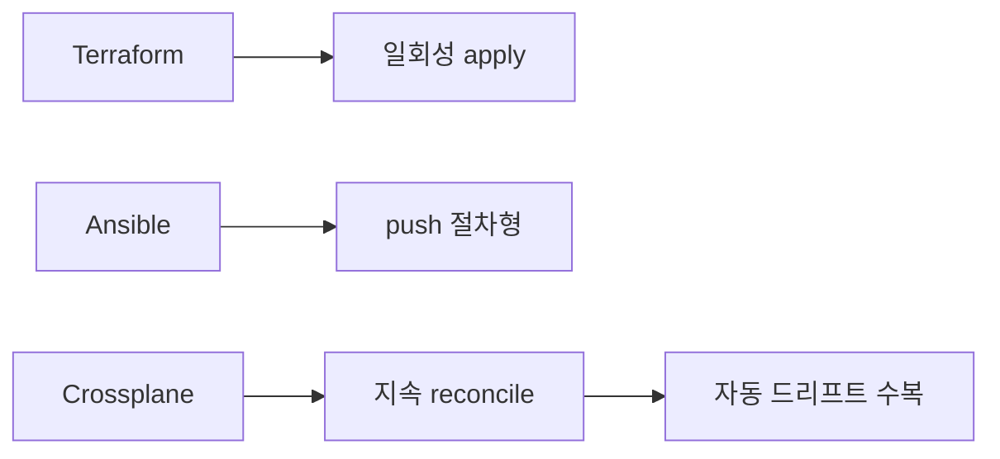
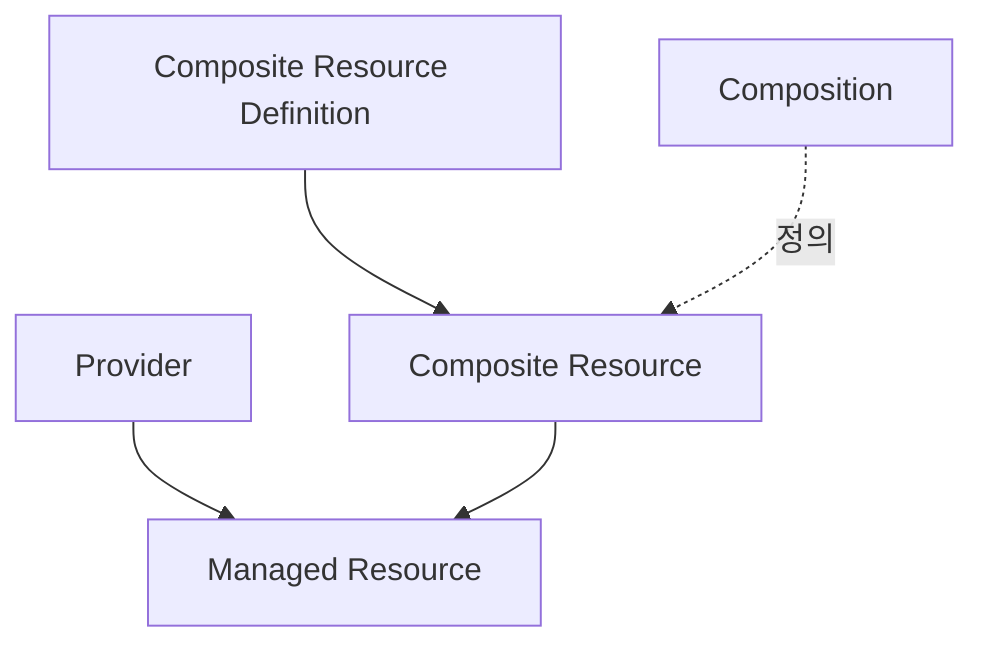
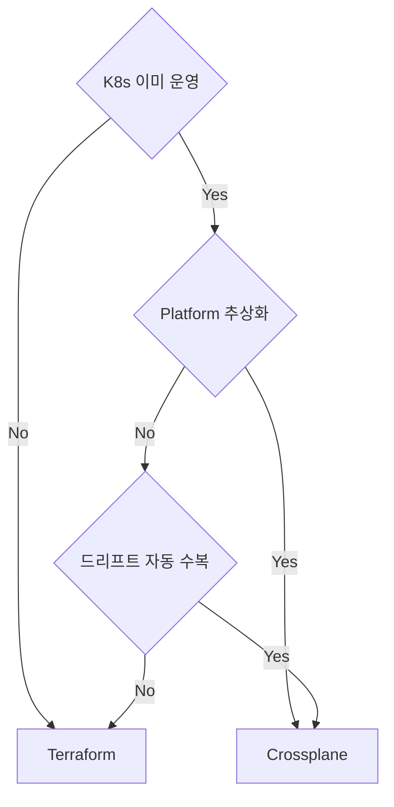

# Crossplane

> Crossplane은 **Kubernetes를 인프라 컨트롤 플레인으로 만드는** OSS
> 프레임워크. Terraform이 "외부에서 인프라를 만들고 끝"이라면,
> Crossplane은 **클러스터 안 controller가 reconcile loop로 인프라를
> 지속 동기화**한다.
>
> **현재 기준** (2026-04):
> - **CNCF Graduated** (2025-10-28 이동, 2025-11-06 발표)
> - **Crossplane v2.2** (v2.0은 2025년 메이저, namespaced XR 등 도입)
> - 사용자: Apple·Nike·Autodesk·Grafana Labs·NASA·SAP·IBM·VMware Tanzu
>   등 다수
>
> 본 글은 Crossplane의 **개념·아키텍처·composition v2·provider·function·
> 운영 함정**을 다룬다.

- **전제**: Kubernetes 기본(CRD·Controller·Reconcile), [IaC 개요
  ](../concepts/iac-overview.md), [State 관리](../concepts/state-management.md)
- 본 위키는 온프레 중심 — Crossplane은 **K8s가 이미 있는 환경**에서
  특히 가치

---

## 1. Crossplane이란

### 1.1 한 문장 정의

**Kubernetes API + reconcile loop를 사용해 "Kubernetes 외부의 자원"
(클라우드·온프레 인프라·SaaS)을 선언적으로 관리하는 컨트롤 플레인 프레임워크**.

### 1.2 다른 IaC와의 위치



| 축 | Terraform | Ansible | Crossplane |
|---|---|---|---|
| 모델 | declarative + state | 절차형 (idempotent module) | declarative + reconcile |
| 실행 | one-shot apply | one-shot push | continuous |
| 드리프트 수복 | plan으로 발견 | check로 발견 | **자동** |
| 언어 | HCL | YAML | YAML(K8s manifest) |
| state | 별도 파일 | 없음 | etcd |
| 추상화 | module | role | **XR**(자체 API 정의) |
| Day-2 | 별도 (drift CI) | 별도 | 1급 (reconcile) |

### 1.3 핵심 가치

- **K8s API 일급 시민**: kubectl·RBAC·audit·webhook·GitOps 모두 그대로
  적용 — ArgoCD·Flux와 자연스럽게 통합
- **자동 드리프트 수복**: controller가 외부 자원 상태를 끊임없이 비교
- **자체 API 설계**(XRD): 회사 표준 추상화를 K8s API로 노출 — Platform
  Engineering의 핵심 도구

---

## 2. 핵심 객체 (v2 기준)

### 2.1 4계층



| 객체 | 역할 |
|---|---|
| **Provider** | 외부 시스템 어댑터 (provider-aws·provider-vsphere·provider-helm 등) |
| **Managed Resource** (MR) | provider가 노출하는 1:1 자원 (예: `Bucket`) |
| **Composite Resource Definition** (XRD) | 사용자 정의 API의 schema — XR의 type 선언 |
| **Composite Resource** (XR) | XRD에서 정의한 type의 인스턴스 |
| **Composition** | XR이 어떤 MR들을 만들지 정의 (template 또는 function 파이프라인) |
| **Function** | Composition의 동적 로직 (v1.14+, gRPC 서버) |

### 2.2 Provider — 외부 시스템 어댑터

```yaml
apiVersion: pkg.crossplane.io/v1
kind: Provider
metadata:
  name: provider-aws-s3
spec:
  package: xpkg.upbound.io/upbound/provider-aws-s3:v1.10.0
```

| Provider 종류 | 출처 |
|---|---|
| AWS·Azure·GCP (각 Family) | Upbound 공식 |
| Kubernetes·Helm | Crossplane 공식 |
| vSphere·OpenStack·Proxmox | 커뮤니티 |
| GitHub·Datadog·Cloudflare·MongoDB Atlas | 커뮤니티/벤더 |
| Provider Family (`provider-aws-*` 분리) | Upbound provider 패키징 모델 — core 버전과 별도 (provider-family-aws v0.40 시리즈) |

provider 설치 후 ProviderConfig로 인증:

```yaml
apiVersion: aws.upbound.io/v1beta1
kind: ProviderConfig
metadata:
  name: default
spec:
  credentials:
    source: Secret
    secretRef:
      namespace: crossplane-system
      name: aws-creds
      key: creds
```

### 2.3 Managed Resource — 1:1 자원

```yaml
apiVersion: s3.aws.upbound.io/v1beta1
kind: Bucket
metadata:
  name: myorg-data-2026
spec:
  forProvider:
    region: us-east-1
    versioningConfiguration:
      - status: Enabled
```

이게 가장 단순한 사용. 1:1로 클라우드 자원과 매핑.

### 2.4 XRD·XR·Composition — 추상화


```yaml
# 1. XRD — 사내 표준 API 정의
apiVersion: apiextensions.crossplane.io/v2
kind: CompositeResourceDefinition
metadata:
  name: xpostgresqls.platform.myorg.dev
spec:
  scope: Namespaced       # v2 default. Cluster scope도 선택 가능 (전역 인프라)
  group: platform.myorg.dev
  names:
    kind: XPostgreSQL
    plural: xpostgresqls
  versions:
    - name: v1alpha1
      served: true
      referenceable: true
      schema:
        openAPIV3Schema:
          type: object
          properties:
            spec:
              type: object
              properties:
                size: { type: string, enum: [small, medium, large] }
                version: { type: string }
              required: [size, version]
```

```yaml
# 2. Composition — 어떤 MR을 만들지
apiVersion: apiextensions.crossplane.io/v1
kind: Composition
metadata:
  name: postgres-aws-rds
  labels:
    provider: aws
spec:
  compositeTypeRef:
    apiVersion: platform.myorg.dev/v1alpha1
    kind: XPostgreSQL
  mode: Pipeline           # v1.14+ Function 파이프라인
  pipeline:
    - step: render-rds
      functionRef: { name: function-go-templating }
      input:
        apiVersion: gotemplating.fn.crossplane.io/v1beta1
        kind: GoTemplate
        source: Inline
        inline:
          template: |
            ---
            apiVersion: rds.aws.upbound.io/v1beta1
            kind: Instance
            metadata:
              name: {{ .observed.composite.resource.metadata.name }}
            spec:
              forProvider:
                engine: postgres
                engineVersion: "{{ .observed.composite.resource.spec.version }}"
                instanceClass: {{ if eq .observed.composite.resource.spec.size "large" }}db.r5.xlarge{{ else }}db.t3.medium{{ end }}
```

```yaml
# 3. 사용자가 XR 생성 → Crossplane이 reconcile
apiVersion: platform.myorg.dev/v1alpha1
kind: XPostgreSQL
metadata:
  name: payments-db
  namespace: payments
spec:
  size: large
  version: "16.2"
```

### 2.5 v1의 Claim — v2부터 선택적

v1에서는 namespace 격리를 위해 **Claim**(namespaced) → **XR**(cluster-scoped)
구조였으나, **v2부터 XR 자체가 namespaced** 가능 → Claim 없이 직접
XR 생성 가능 (단순화).

기존 v1 사용자: Claim 호환 유지. 신규 사용자: namespaced XR 권장.

---

## 3. Composition Functions

(v1.11 alpha → **v1.14 beta** → v2에서 표준 모드. v2부터는 `mode:
Pipeline`이 사실상 유일한 권장 합성 모드, 기존 `mode: Resources`(P&T)는
deprecation 진행 중)

### 3.1 왜 Function인가

v1 초기 Composition은 **template + patches** 모델:
- 정적 patch만 가능
- 복잡한 로직(loop, 조건, 외부 API)은 표현 불가
- "이 케이스만 처리해 주세요" 요구가 끝없이 늘어남

**Function 파이프라인** (v1.14+, v2 표준): 각 step이 gRPC 서버로 동작,
임의 로직 실행. Composition 자체가 declarative → imperative function
호출의 파이프라인.

### 3.2 표준 Function

| Function | 용도 | 언어 |
|---|---|---|
| `function-patch-and-transform` | 기존 v1 patch 호환 | Go (built-in) |
| `function-go-templating` | Go template으로 동적 manifest | Go template |
| `function-kcl` | KCL 언어 (구조화·타입 안전) | KCL |
| `function-cue` | CUE 언어 | CUE |
| `function-python` | 2025-03 첫 출시, 안정 사용 가능 | Python |
| `function-shell` | shell·bash | sh |
| `function-auto-ready` | 자동 readiness 평가 | Go (built-in) |

### 3.3 파이프라인 구성

```yaml
spec:
  mode: Pipeline
  pipeline:
    - step: render
      functionRef: { name: function-go-templating }
      input: ...
    - step: validate
      functionRef: { name: function-cue }
      input: ...
    - step: ready-check
      functionRef: { name: function-auto-ready }
```

각 step은 이전 step의 output을 받아 변환. 파이프라인 자체를 PR review
가능.

### 3.4 Function 개발

자체 Function을 만들 수 있다 (gRPC 서버, OCI 이미지로 배포):

```bash
crossplane beta xpkg init my-function function-template-go
# 작성 후
crossplane xpkg build
crossplane xpkg push xpkg.upbound.io/myorg/my-function:v0.1.0
```

회사 도메인 로직(예: "이 팀의 모든 DB는 자동으로 KMS 암호화")을
Function으로 캡슐화 → Composition에서 재사용.

---

## 4. 운영 — Provider·Package·업그레이드

### 4.1 Package 모델

Crossplane의 모든 확장은 **OCI 이미지**로 배포·설치:
- Provider
- Function
- Configuration (XRD + Composition 묶음)

```bash
# 모두 동일 형태
crossplane xpkg push xpkg.upbound.io/myorg/my-config:v1.0.0
```

CNCF Sigstore 기반 서명·검증 가능 → 공급망 보안 (→ `security/`).

### 4.2 Provider Family

**Upbound provider의 패키징 모델** (Crossplane core 버전과 별도). 기존
단일 `provider-aws`가 모든 AWS API 포함 → 메모리·CRD 폭증.

**Family**: `provider-aws-s3`, `provider-aws-rds`, `provider-aws-ec2` 등
도메인별 분리(provider-family-aws v0.40 시리즈+). 필요한 family만 설치 →
메모리·CRD·시작 시간 감소. 모든 provider가 family 모델을 따르는 것은
아님 — provider별 확인 필요.

### 4.3 RuntimeConfig (v1.14+)

```yaml
apiVersion: pkg.crossplane.io/v1beta1
kind: DeploymentRuntimeConfig
metadata:
  name: provider-aws-s3
spec:
  deploymentTemplate:
    spec:
      template:
        spec:
          containers:
            - name: package-runtime
              resources:
                limits:   { memory: 1Gi, cpu: 1 }
                requests: { memory: 256Mi, cpu: 100m }
              env:
                - name: AWS_RETRY_MODE
                  value: adaptive
```

Provider pod의 자원·환경·SA·toleration 등을 명시 — 운영 표준.

### 4.4 ManagementPolicies (v1.11 alpha → v1.14 beta, v2.2까지 beta 유지)

기존: Crossplane이 자원의 lifecycle을 모두 관리 (create/update/delete).
**Management Policy**: 각 resource·field의 관리 강도 선택.

**현재 (2026-04)**: 여전히 **beta** 단계. Provider별 지원 편차 있음
— prod 도입 전 사용 provider의 Management Policy 호환성 확인 필수.

```yaml
apiVersion: rds.aws.upbound.io/v1beta1
kind: Instance
metadata:
  name: legacy-db
spec:
  managementPolicies: [Observe]    # 만들지 않고 관찰만
  forProvider:
    ...
```

| Policy | 동작 |
|---|---|
| `FullControl` (default) | create + update + delete |
| `Observe` | 외부 자원의 상태만 reflect, 변경 없음 |
| `LateInitialize` | 누락된 spec을 외부 값으로 채움 |
| `*` 조합 | 복수 정책 |

**활용**: 기존 Terraform 자원을 Crossplane이 **관찰**만 하다가 점진
인계, 또는 read-only inventory로 활용.

---

## 5. GitOps와의 통합

### 5.1 ArgoCD/Flux와 자연스러운 결합

XRD·Composition·XR이 모두 K8s manifest → Git에 두고 ArgoCD/Flux가 sync.

```text
git/
├── platform/
│   ├── xrds/                    # XRD
│   ├── compositions/            # Composition
│   └── functions/               # Function 설치
└── apps/
    └── payments/
        └── postgres-xr.yaml     # 실제 XR
```

ArgoCD는 sync wave로 XRD → Composition → XR 순서 보장.

### 5.2 Application 설계

| 분리 | 설명 |
|---|---|
| **Platform layer**(Provider·XRD·Composition) | 플랫폼 팀, drift 거의 없음 |
| **App layer**(XR) | 앱 팀, 자주 변경 |

권한 분리도 자연스러움:
- 플랫폼 팀: cluster-admin, XRD 수정 가능
- 앱 팀: 자기 namespace에서 XR 생성만

---

## 6. 인증·Secret

### 6.1 Provider 인증

```yaml
apiVersion: aws.upbound.io/v1beta1
kind: ProviderConfig
metadata:
  name: prod
spec:
  credentials:
    source: Secret              # 또는 IRSA, WebIdentity, Filesystem
    secretRef:
      namespace: crossplane-system
      name: aws-creds-prod
      key: creds
```

| Source | 적합 |
|---|---|
| `Secret` | 단순. 키 관리 별 문제 |
| **`IRSA`/Workload Identity** | EKS/GKE/AKS 표준 |
| **`Vault`** (External Secrets Operator로 동기화) | 권장 — 회전·감사 |
| `WebIdentity`/OIDC | SPIFFE/SPIRE 통합 |

**원칙**: `Secret` source로 정적 키를 commit하지 말 것. ESO·Vault로
주입 (→ `security/`).

### 6.2 Connection Details

XR이 만든 자원의 연결 정보(DB endpoint·password 등)를 사용자 namespace의
Secret으로 publish:

```yaml
# XRD
spec:
  connectionSecretKeys:
    - host
    - port
    - username
    - password

# 사용자 XR
spec:
  writeConnectionSecretToRef:
    name: payments-db-conn
    namespace: payments
```

앱은 그 Secret만 보면 됨. Crossplane이 라이프사이클·회전 관리.

**보안 주의**: publish된 Secret은 **default로 평문**. 추가 보호:
- Secret 자체에 K8s RBAC 좁히기 (앱 SA만 read)
- ESO·Sealed Secrets·SOPS로 wrapping
- AAP·앱이 Secret 직접 사용보다 in-cluster mTLS·Vault dynamic 권장

---

## 7. 한계·함정

### 7.1 K8s 의존

- 클러스터 자체가 죽으면 reconcile 멈춤
- "DB를 만드는 K8s"가 깨지면 그 위 모든 자원 영향
- **DR**: 다른 cluster로 복구 가능하도록 etcd 백업(Velero 등) + Provider
  재설치 + **`crossplane.io/external-name` annotation 보존**이 핵심
  — 이 annotation이 외부 자원과 MR의 매핑이며, 잃으면 자원이 중복
  생성되거나 destroy됨

### 7.2 Imperative 작업의 어려움

- 일회성 migration, 외부 명령 호출 등 절차형 작업은 Crossplane 안에서 어색
- `function-shell`은 escape hatch이지만 reconcile 모델과 충돌
- 보완: Argo Workflows·Tekton 같은 imperative 도구와 분리

### 7.3 Provider 성숙도 차이

- AWS·Azure·GCP·Helm·Kubernetes는 매우 성숙
- vSphere·OpenStack·Proxmox 등은 커뮤니티 — feature gap 있음
- 새 클라우드 API 추가가 Terraform보다 늦을 수 있음

### 7.4 디버깅 비용

- reconcile 실패 시 `kubectl describe`·`kubectl logs`로 controller 추적
- Function 파이프라인의 한 단계 실패 진단이 어려움 (gRPC 호출 trace)
- v1.14+ `crossplane beta trace` 명령으로 부분 완화

### 7.5 v1 → v2 마이그레이션

- v1의 Claim → v2 namespaced XR 전환에 schema·controller 변경
- 단계적 전환 가이드: 공식 [Migration to v2](https://docs.crossplane.io/latest/migration-to-v2/)
- prod 전환은 dry-run·dual-stack 후 신중

### 7.6 학습 곡선

- K8s API + reconcile + provider + function이라는 4축
- 작은 팀에 단순 클라우드 provisioning만 한다면 Terraform보다 비용 큼
- Platform team이 **공통 추상화**를 만들어 앱 팀이 단순한 XR만 쓰는
  구조에서 가치 폭발

---

## 8. Crossplane vs Terraform — 실무 결정

### 8.1 비교

| 축 | Terraform | Crossplane |
|---|---|---|
| 실행 모델 | one-shot | continuous reconcile |
| 드리프트 | plan으로 발견 | 자동 수복 |
| state | 별도 파일 | etcd |
| 학습 | HCL + state | K8s + provider + function |
| K8s 의존 | 없음 | 필수 |
| 추상화 | module | XRD/Composition (자체 API) |
| GitOps | 별도 (Atlantis 등) | 자연 통합 |
| Day-2 운영 | 별도 (drift CI) | 1급 |
| 성숙도 (provider) | 매우 높음 | 도메인별 차이 |
| 권장 출발점 | 클라우드 provisioning | K8s 기반 platform |

### 8.2 결정 가이드



### 8.3 함께 쓰는 표준 패턴

| 단계 | 도구 |
|---|---|
| 1. **Bootstrap** (K8s 클러스터·VPC·IAM) | Terraform |
| 2. **Crossplane 설치** | Helm via Terraform 또는 ArgoCD |
| 3. **Platform 추상화 (XRD·Composition)** | Crossplane |
| 4. **앱 자원 (DB·Cache·Queue)** | Crossplane XR (앱 팀이 작성) |

Terraform이 "회사의 기초 환경", Crossplane이 "Platform-as-a-Product"의
인터페이스.

---

## 9. kro 비교

`kro`(Kube Resource Orchestrator)는 AWS·Azure·Google이 공동 개발하는
Kubernetes 자원 합성 도구. **Composition v2의 일부 영역과 겹침**.

| 축 | Crossplane | kro |
|---|---|---|
| CNCF 상태 | **Graduated** (2025-10) | **kubernetes-sigs 산하**, CNCF 비편입, **alpha v1alpha1** |
| 외부 자원 (cloud API) | Provider 통해 | provider 미보유 (K8s 자원 합성 중심) |
| 자체 API 정의 | XRD | RGD (ResourceGraphDefinition) |
| 합성 로직 | Composition + Function | Graph + Schema |
| 프로덕션 사용 | 다수 (Apple·Nike 등) | **부적합** (alpha) |
| 적합 | 클라우드·인프라 자원 IaC | K8s 자원 패키징·합성 |

**현재**(2026-04): Crossplane이 사실상 표준. kro는 K8s 자원 합성에
집중한 별도 도구로, Crossplane 대체보다는 보완·다른 use case로 보는 게
맞다 — 그러나 alpha 단계이므로 **prod 도입은 비권장**.

---

## 10. 안티패턴

| 안티패턴 | 왜 문제 | 교정 |
|---|---|---|
| Provider를 한 모놀리스(`provider-aws`)로 | 메모리 폭증, CRD 수천 개 | Provider Family 분할 |
| Composition v1 patch만으로 복잡 로직 | 가독성 0, 디버깅 불가 | Function pipeline (v1.14+) |
| `Secret` source에 정적 키 commit | 시크릿 유출 | ESO·Vault·Workload Identity |
| ProviderConfig 1개 글로벌 | 권한 분리 불가 | 환경별·팀별 ProviderConfig |
| XR을 cluster-scoped(v1)로 prod 운영 | 권한·격리 한계 | v2 namespaced XR |
| 모든 자원을 `FullControl`로 | 기존 자원 destroy 사고 | `Observe`로 인계 후 점진 전환 |
| Function 없이 KCL/CUE 외부 도구로 정적 생성 | reconcile 흐름 깨짐 | function-kcl/cue |
| ArgoCD sync wave 없이 XRD·Composition·XR 동시 적용 | XRD 없이 XR 생성 시도 → 실패 | sync wave로 순서 강제 |
| controller pod 단일 replica | SPOF | leaderElection + replicas: 2 |
| etcd 백업 없음 | DR 시 자원 매핑 손실 | etcd backup + provider state 재현 가이드 |
| Provider 자동 업그레이드 (latest 태그) | breaking 변경 사고 | 정확 version pin |
| Function gRPC 서버에 메모리 limit 없음 | OOM 시 reconcile 정지 | 명시 limits |
| Composition에 외부 명령 (`function-shell`) 의존 | 재현성·이식성 파괴 | 도메인 logic은 function-go/python |
| 여러 Composition이 같은 XRD 매칭 → label selector 모호 | 의도와 다른 Composition 선택 | 명확한 label selector + 기본 명시 |
| v1 Claim ↔ v2 namespaced XR 혼용 | schema·동작 차이 | 한쪽으로 통일 후 마이그레이션 |
| Crossplane을 imperative 작업(migration script)에 사용 | reconcile 모델 충돌 | Argo Workflows·Tekton |
| `connectionSecretKeys` 누락 | DB password 등 사용 불가 | XRD·Composition·MR 4단계 모두 명시 |
| Provider 인증을 cluster-admin SA로 | least privilege 위반 | 전용 SA + 최소 RBAC |

---

## 11. 도입 로드맵

1. **K8s 클러스터 + Crossplane 설치** — Helm으로
2. **Provider 1개 + Managed Resource 1개** — S3 bucket 한 개 만들기
3. **GitOps 통합** — ArgoCD 또는 Flux로 manifests sync
4. **첫 XRD + Composition** — 사내 자주 만드는 자원 1개 표준화
5. **Function 도입** — go-templating 또는 KCL
6. **Provider Family 전환** — 메모리·시작 시간 개선
7. **인증을 IRSA·ESO로** — 정적 키 제거
8. **Management Policies로 기존 자원 인계**
9. **모니터링** — controller 메트릭, reconcile 실패 알림
10. **Platform-as-a-Product** — XRD를 사내 카탈로그로

---

## 12. 관련 문서

- [IaC 개요](../concepts/iac-overview.md) — Crossplane의 자리
- [Terraform 기본](../terraform/terraform-basics.md) — 보완 도구
- [State 관리](../concepts/state-management.md) — 자동 reconcile vs 수동 plan
- [Terraform Providers](../terraform/terraform-providers.md) — kubernetes·helm provider
- [IaC 테스트](../operations/testing-iac.md) — Composition 테스트

---

## 참고 자료

- [Crossplane 공식 문서 (v2.x)](https://docs.crossplane.io/latest/) — 확인: 2026-04-25
- [CNCF Crossplane Graduation (2025-11)](https://www.cncf.io/announcements/2025/11/06/cloud-native-computing-foundation-announces-graduation-of-crossplane/) — 확인: 2026-04-25
- [Crossplane v2 What's New](https://docs.crossplane.io/latest/whats-new/) — 확인: 2026-04-25
- [Composition Functions](https://docs.crossplane.io/latest/composition/composition-functions/) — 확인: 2026-04-25
- [Provider Family 발표](https://blog.crossplane.io/) — 확인: 2026-04-25
- [Management Policies 공식 문서](https://docs.crossplane.io/latest/managed-resources/management-policies/) — 확인: 2026-04-25
- [Migration to v2 가이드](https://docs.crossplane.io/latest/migration-to-v2/) — 확인: 2026-04-25
- [kro 공식](https://kro.run/) — 확인: 2026-04-25
- [Spacelift: Crossplane vs Terraform](https://spacelift.io/blog/crossplane-vs-terraform) — 확인: 2026-04-25
- [Upbound provider registry](https://marketplace.upbound.io/) — 확인: 2026-04-25
