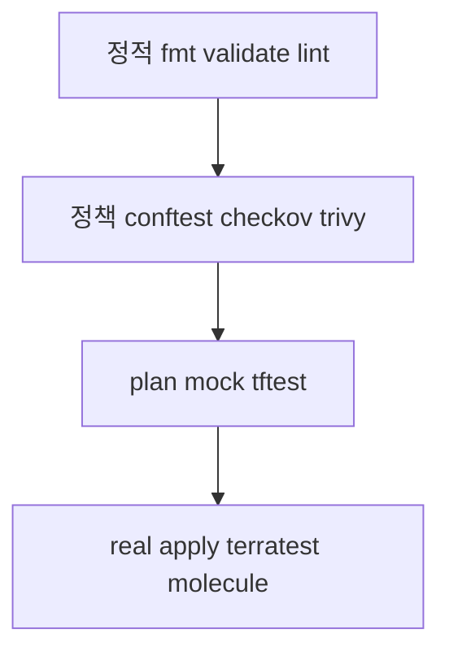

# IaC 테스트

> "코드는 테스트하면서 인프라 코드는 안 한다"는 더 이상 통하지 않는다.
> IaC가 prod 인프라를 만든다면, 같은 신뢰도를 요구한다.
>
> 이 글은 IaC의 **4단계 테스트 피라미드**(정적 → 정책 → plan/mock →
> real-apply)와 각 단계의 **표준 도구·패턴·CI 통합**을 다룬다. Terraform·
> OpenTofu·Ansible·Crossplane 모두 다루되, 깊이는 Terraform 중심.

- **전제**: [Terraform 기본](../terraform/terraform-basics.md), [Terraform
  모듈](../terraform/terraform-modules.md), [Ansible 기본
  ](../ansible/ansible-basics.md)
- 본 글은 **도구 명령·CI 통합**에 집중. 모듈 메인테이너 시각의 테스트
  설계는 [Terraform 모듈 §7](../terraform/terraform-modules.md#7-테스트-모듈-메인테이너-시각)

---

## 1. 4단계 피라미드



| 단계 | 시간 | 비용 | 빈도 | 발견하는 문제 |
|---|---|---|---|---|
| **정적** | 초 | 0 | 매 commit | 문법, 스타일, 타입 |
| **정책** | 초 | 0 | 매 commit | 보안·컴플라이언스 룰 |
| **plan/mock** | 초~분 | 0 | 매 PR | 동작 검증 (cluster 없이) |
| **real apply** | 분~시간 | 클라우드 비용 | nightly·release | 통합·실제 동작 |

**원칙**: 단계가 올라갈수록 **느리고 비싸지만 진짜에 가까워진다**.
모든 PR이 4단계를 다 거칠 필요는 없음 — 변경 영향에 비례.

---

## 2. 정적 분석

### 2.1 Terraform/OpenTofu

| 도구 | 용도 |
|---|---|
| `terraform fmt -check -recursive` | 들여쓰기·정렬 표준 |
| `terraform validate` | 문법·타입·내부 일관성 (provider 미설치 가능) |
| **`tflint`** | 추가 룰 — provider별·deprecated 사용·variable 검증 |
| `terraform-docs --output-check` | README 동기화 |

```yaml
# .tflint.hcl
plugin "terraform" {
  enabled = true
  preset  = "recommended"
}
plugin "aws" {
  enabled = true
  version = "0.30.0"
  source  = "github.com/terraform-linters/tflint-ruleset-aws"
}
rule "terraform_required_version" { enabled = true }
rule "terraform_required_providers" { enabled = true }
rule "terraform_unused_declarations" { enabled = true }
```

```bash
tflint --init
tflint --recursive
```

### 2.2 Ansible

| 도구 | 용도 |
|---|---|
| `ansible-playbook --syntax-check` | YAML·playbook 문법 |
| **`ansible-lint`** | 표준 룰 (FQCN, no-changed-when, name 일관성 등) |
| `yamllint` | 일반 YAML lint |

```yaml
# .ansible-lint
profile: production
exclude_paths:
  - .cache/
warn_list:
  - experimental
```

```bash
ansible-lint playbooks/
```

### 2.3 Crossplane (YAML 검증)

| 도구 | 용도 |
|---|---|
| `kubectl apply --dry-run=client` | 빠른 syntax 검사 |
| `kubeconform` / `kubectl-validate` | OpenAPI schema 검증 |
| `kustomize` lint | manifest 빌드 검증 |

---

## 3. 정책 (Policy as Code)

### 3.1 Conftest + OPA Rego

```rego
# policy/aws/s3.rego
package terraform.aws.s3

deny[msg] {
  resource := input.resource_changes[_]
  resource.type == "aws_s3_bucket"
  resource.change.actions[_] == "create"
  not resource.change.after.server_side_encryption_configuration
  msg := sprintf("S3 bucket %s missing encryption", [resource.address])
}

deny[msg] {
  resource := input.resource_changes[_]
  resource.type == "aws_s3_bucket_public_access_block"
  resource.change.after.block_public_acls != true
  msg := sprintf("S3 PAB %s must block_public_acls", [resource.address])
}
```

```bash
# Terraform plan을 JSON으로
terraform plan -out=tfplan
terraform show -json tfplan > plan.json

# Conftest 실행
conftest test --policy policy/ plan.json

# 정책 자체 단위 테스트 (*_test.rego)
conftest verify --policy policy/
```

**가치**:
- 사내 표준(필수 태그·암호화·SG 0.0.0.0 금지 등)을 **plan 단계에서 차단**
- Rego 단위 테스트로 정책 자체의 신뢰도 확보
- OCI registry·Git에서 정책 share 가능

### 3.2 IaC 보안 스캐너 비교 (2026)

| 도구 | 라이선스 | 룰 수 | 특징 |
|---|---|---|---|
| **Checkov** | Apache 2.0 (Palo Alto/Prisma) | 1,000+ | **graph-based**(cross-resource) 800+, CIS·SOC2·HIPAA·PCI 매핑, OpenTofu·Bicep·Kustomize·CDK 지원 |
| **Trivy** (구 tfsec 흡수) | Apache 2.0 (Aqua) | 800+ | IaC + container + SBOM + K8s 통합 binary, CIS Benchmarks |
| tfsec | Apache 2.0 (Aqua) | maintenance-only (2023+) | Trivy로 흡수됨 — **신규 도입 비권장** |
| KICS | Apache 2.0 (Checkmarx) | 2,400+ | rule 수 많음, false positive 빈도 |
| Terrascan | Apache 2.0 (Tenable) | — | OPA 기반 |

**2026 권장**:
- **포괄성·graph 분석**: Checkov
- **단일 binary로 IaC + container + K8s + SBOM**: Trivy
- **사내 사용자 정의**: Conftest + OPA

⚠ **공급망 사고 인지** (2026-03 Trivy 릴리즈 인프라 침해):
- `aquasecurity/trivy-action` 76/77 태그 force-push, `setup-trivy` 7
  태그 전부 변조
- Docker Hub의 v0.69.4/0.69.5/0.69.6 이미지 변조
- GitHub Actions Runner 메모리에서 직접 secret 탈취(log masking 우회)

**행동 가이드**:
1. Third-party action은 **commit SHA로 핀**(`@v0.x` 태그 금지). Renovate가
   SHA를 자동 업데이트하도록 설정
2. Trivy binary는 cosign keyless로 서명 검증
3. vuln DB 업데이트는 공식 미러 검증 후 사용
4. 사고 기간에 사용한 secret은 **회전**
5. 상세는 → [`security/supply-chain/sigstore.md`](../../security/supply-chain/sigstore.md), [SLSA](../../security/supply-chain/slsa.md)

### 3.3 Checkov 사용

```bash
# 디렉토리 스캔
checkov -d terraform/

# Terraform plan JSON 스캔
checkov -f plan.json --framework terraform_plan

# 사용자 정의 정책 (Python 또는 YAML)
checkov -d terraform/ --external-checks-dir custom_checks/

# CI 출력 (JUnit·SARIF)
checkov -d terraform/ -o junitxml > checkov.xml
checkov -d terraform/ -o sarif > checkov.sarif
```

### 3.4 Trivy 사용

```bash
# IaC 스캔
trivy config terraform/
trivy config -f json -o trivy.json terraform/

# 통합 (config + secret + sbom)
trivy fs --scanners config,secret,vuln .
```

Trivy의 가치는 **하나의 도구로 IaC + 컨테이너 이미지 + K8s + SBOM**을 다룸.

### 3.5 OPA Gatekeeper / Kyverno (런타임)

본 글은 **사전(plan 시점)** 정책에 집중. **런타임 정책**(Kubernetes
admission webhook)은 → `security/policy/`.

상호 보완:
- 사전: conftest·checkov로 plan 차단
- 런타임: gatekeeper/kyverno로 cluster apply 차단

---

## 4. Plan 검증·Mock 테스트

### 4.1 `terraform test` (TF 1.6+ / OpenTofu 1.6+)

GA된 native 테스트 프레임워크. 상세 문법은 [Terraform 모듈 §7.2
](../terraform/terraform-modules.md#72-terraform-test-tf-16-opentofu-16).

```hcl
# tests/basic.tftest.hcl
variables {
  name = "test"
  cidr = "10.0.0.0/16"
}

run "create_vpc" {
  command = plan
  
  assert {
    condition     = aws_vpc.main.cidr_block == "10.0.0.0/16"
    error_message = "VPC CIDR mismatch"
  }
}
```

```bash
terraform test                 # tests/ 자동
terraform test -filter=basic.tftest.hcl
terraform test -junit-xml=results.xml
```

### 4.2 Mock provider (TF 1.7+ / OpenTofu 1.8+)

real cloud 호출 없이 plan 검증. **호환성 차이** 주의 — TF·OpenTofu
mock 문법 100% 호환 아님.

```hcl
# tests/with_mock.tftest.hcl
mock_provider "aws" {
  # provider 자체를 mock으로 대체. computed 속성은 자동 생성됨
  
  mock_resource "aws_vpc" {
    defaults = {
      id        = "vpc-12345"
      arn       = "arn:aws:ec2:us-east-1:111:vpc/vpc-12345"
    }
  }
  
  override_resource {
    target = aws_vpc.main
    values = { id = "vpc-67890" }   # 특정 리소스 강제값
  }
}

run "with_mock" {
  command = plan

  assert {
    condition     = aws_vpc.main.id == "vpc-67890"
    error_message = "mock override failed"
  }
}
```

**핵심 규칙**:
- `mock_provider`는 그 자체로 provider를 mock으로 **대체** — `alias`로
  분리하지 않음 (real provider 인스턴스를 mock으로 바꾸는 모델)
- `mock_resource` / `mock_data`로 type 단위 default
- `override_resource` / `override_data`로 특정 인스턴스 강제값

### 4.2.1 OpenTofu 1.8+ mocking 분기

OpenTofu는 mock 정의를 **별도 파일**로 분리할 수 있다:

| 파일 | 적용 |
|---|---|
| `*.tfmock.hcl` | 양쪽 도구 공통 |
| `*.tofumock.hcl` | OpenTofu 전용 |

또한 OpenTofu는 provider-level mock value 패턴(특정 attribute의 `null`/
default 동작)에 차이가 있어, 양쪽 도구를 지원하는 모듈은:
- 공통 부분만 `*.tfmock.hcl`
- 양쪽 분기 테스트는 `.tftest.hcl` / `.tofutest.hcl`로 분리

### 4.3 OpenTofu `.tofutest.hcl`

OpenTofu는 `.tftest.hcl`도 지원하지만 OpenTofu 전용 기능을 쓸 때
`.tofutest.hcl` 확장자로 분기. 양쪽 도구를 지원하는 모듈은 공통 부분만
`.tftest.hcl`에, OpenTofu 전용 테스트는 `.tofutest.hcl`에.

### 4.4 Atlantis·Spacelift·env0 plan 정책

CI 도구의 정책 게이트:
- **Atlantis**: conftest 기본 통합, 정책 실패 시 머지 차단
- **Spacelift**: OPA 기반 plan/push/access 정책
- **env0**: OPA 또는 자체 정책 엔진
- **Scalr**: OPA·custom hooks

---

## 5. 통합 테스트 (real apply)

### 5.1 Terratest

Go 기반 통합 테스트 라이브러리. real cloud 자원 생성 → 검증 → 자동
정리.

```go
// test/vpc_test.go
package test

import (
    "testing"
    "github.com/gruntwork-io/terratest/modules/terraform"
    "github.com/stretchr/testify/assert"
)

func TestVPCBasic(t *testing.T) {
    t.Parallel()
    
    opts := &terraform.Options{
        TerraformDir: "../examples/basic",
        TerraformBinary: "tofu",   // OpenTofu 사용 시
        Vars: map[string]interface{}{
            "name": "test-" + random.UniqueId(),
            "cidr": "10.0.0.0/16",
        },
    }
    
    defer terraform.Destroy(t, opts)
    terraform.InitAndApply(t, opts)
    
    vpcID := terraform.Output(t, opts, "vpc_id")
    assert.NotEmpty(t, vpcID)
    
    // 추가 검증 — AWS API 직접 호출
    aws.GetVpcById(t, vpcID, "us-east-1")
}
```

```bash
cd test
go test -v -timeout 30m -parallel 4
```

**원칙**:
- `random.UniqueId()`로 자원 이름 충돌 회피 (병렬 실행)
- `defer terraform.Destroy`로 실패해도 정리 보장
- `t.Parallel()`로 테스트 간 병렬화
- 비용·시간 — nightly·release 단계에서 실행

### 5.2 OpenTofu와의 호환

`TerraformBinary: "tofu"`로 지정하면 동일하게 동작. 일부 옵션
(`WithDefaultRetryableErrors` 등)에서 미세한 차이 가능 — 큰 매트릭스
환경에선 양쪽 모두 정기 검증.

### 5.3 LocalStack — 비용 절감

AWS API 에뮬레이터. real apply의 일부를 LocalStack에 위임:

```go
opts := &terraform.Options{
    TerraformDir: "../",
    EnvVars: map[string]string{
        "AWS_ENDPOINT_URL": "http://localhost:4566",  // LocalStack
    },
}
```

**한계**: LocalStack 무료 tier는 일부 서비스만. IAM·S3·EC2 기본은 OK,
EKS·SageMaker 등은 유료. **prod와 100% 동일 동작 아님** — release
gate는 real cloud 권장.

### 5.4 Kitchen-Terraform (legacy)

Test Kitchen + InSpec. Ruby 기반, 예전부터 사용. 2026 현재 **Terratest
가 사실상 표준**. 유지보수가 적은 환경에선 여전히 valid.

### 5.5 Crossplane 통합 테스트

```bash
# 일회성 cluster (kind/k3d)에 Crossplane 설치
kind create cluster --name xp-test
helm install crossplane crossplane-stable/crossplane

# Provider·XRD·Composition apply
kubectl apply -f providers.yaml
kubectl wait --for=condition=Healthy provider/provider-aws-s3 --timeout=5m
kubectl apply -f xrd.yaml
kubectl apply -f composition.yaml

# XR 생성 후 reconcile 확인
kubectl apply -f test/xr.yaml
kubectl wait --for=condition=Ready xpostgresql/test --timeout=10m

# 검증 후 destroy
kubectl delete xpostgresql/test
kind delete cluster --name xp-test
```

**검증 레이어** (Ready만으로 부족):

```bash
# 1. XR과 모든 composed resource의 Ready·Synced 동시 확인
kubectl wait --for=condition=Ready,Synced xpostgresql/test --timeout=10m

# 2. composed graph 추적 (Composition 어디서 막혔는가)
crossplane beta trace xpostgresql/test

# 3. provider별 reconcile 에러 카운터 — Prometheus
# rate(controller_runtime_reconcile_errors_total[5m])
```

`Ready=true`만 보면 "Composition은 끝났지만 일부 MR이 reconcile loop"
를 놓친다. `Synced`까지 봐야 안전.

### 5.6 Ansible — Molecule

Role 단위 테스트의 사실상 표준.

```yaml
# molecule/default/molecule.yml
driver:
  name: docker         # 또는 podman, openstack, ec2

platforms:
  - name: instance
    image: quay.io/centos/centos:stream9
    pre_build_image: true

provisioner:
  name: ansible

verifier:
  name: ansible        # 또는 testinfra
```

```bash
cd roles/nginx
molecule test
# create → converge → idempotence → verify → destroy
```

**전체 시퀀스** (default scenario): `dependency → cleanup → destroy →
syntax → create → prepare → converge → idempotence → side_effect →
verify → cleanup → destroy`. 핵심 단계:

1. `dependency`: 외부 collection·role 설치
2. `create`: 컨테이너·VM 생성
3. `prepare`: fixture 적재
4. `converge`: role 적용
5. `idempotence`: 두 번째 적용에 changed=0 검증
6. `side_effect`: 서비스 재시작·실패 주입 후 재검증
7. `verify`: 결과 검증 (testinfra·ansible assert)
8. `destroy`: 정리

---

## 6. CI 통합 표준

### 6.1 GitHub Actions 예시 (Terraform)

```yaml
on:
  pull_request:
    paths: ['terraform/**', 'modules/**']

jobs:
  static:
    runs-on: ubuntu-latest
    steps:
      - uses: actions/checkout@v4
      - uses: hashicorp/setup-terraform@v3
        with:
          terraform_version: "1.14.9"
          terraform_wrapper: false   # plan stdout 보존
      # OpenTofu라면 opentofu/setup-opentofu@v1 + tofu init/plan
      - run: terraform fmt -check -recursive
      - run: terraform init -backend=false -lockfile=readonly
      - run: terraform validate
      - uses: terraform-linters/setup-tflint@v4
      - run: tflint --init && tflint --recursive

  policy:
    needs: static
    permissions: { id-token: write, contents: read }   # OIDC
    steps:
      - uses: aws-actions/configure-aws-credentials@v4
        with:
          role-to-assume: arn:aws:iam::111:role/tf-plan-readonly
          aws-region: us-east-1
      - run: terraform init -lockfile=readonly
      - run: terraform plan -out=tfplan -var-file=stg.tfvars
      - run: terraform show -json tfplan > plan.json
      # Conftest: 공식 binary 직접 호출 (third-party action 의존 회피)
      - run: |
          curl -sSL https://github.com/open-policy-agent/conftest/releases/download/v0.55.0/conftest_0.55.0_Linux_x86_64.tar.gz \
            | tar xz
          ./conftest test --policy policy/ plan.json
      - run: pip install checkov
      - run: checkov -f plan.json --framework terraform_plan -o sarif --output-file-path checkov.sarif

  test:
    needs: policy
    steps:
      - run: terraform test

  integration:
    if: github.event_name == 'schedule'   # nightly only
    steps:
      - uses: actions/setup-go@v5
      - run: cd test && go test -v -timeout 60m
```

### 6.2 GitHub Actions (Ansible)

```yaml
jobs:
  lint:
    steps:
      - run: pipx install ansible-core ansible-lint
      - run: ansible-galaxy install -r requirements.yml
      - run: ansible-lint
      - run: ansible-playbook --syntax-check playbooks/site.yml
  
  molecule:
    strategy:
      matrix:
        role: [common, nginx, postgres]
    steps:
      - run: pip install molecule molecule-plugins[docker] testinfra
      # requirements.yml에서 collection 버전 핀 필수 — 안티패턴 방지
      # 예: community.general "==10.4.0", ansible.posix "==2.0.0"
      - run: ansible-galaxy collection install -r requirements.yml
      - run: cd roles/${{ matrix.role }} && molecule test
```

### 6.3 SARIF로 GitHub Security 통합

```yaml
- run: checkov -d terraform/ -o sarif > results.sarif
- uses: github/codeql-action/upload-sarif@v3
  with:
    sarif_file: results.sarif
```

PR 리뷰에 보안 finding이 코드 위에 직접 표시. compliance·audit에 도움.

### 6.4 PR 코멘트로 plan·정책 결과 게시

```yaml
- uses: actions/upload-artifact@v4
  with:
    name: tfplan
    path: tfplan
- run: terraform show -no-color tfplan > plan.txt
- uses: marocchino/sticky-pull-request-comment@v2
  with:
    header: tf-plan
    path: plan.txt
```

리뷰어는 PR에서 plan·conftest 결과를 한 번에 본다.

---

## 7. 비용·실행 환경 관리

### 7.1 자원 정리

real apply 테스트는 **실패해도 자원이 남으면** 비용·blast radius 폭발:
- `defer destroy` (Terratest 표준)
- `cleanup` 스크립트 + tag 기반 cleanup (`tag:purpose=test` 24h 후 자동 삭제)
- LocalStack·LambdaTest 등 emulator 활용
- 소형 region·가벼운 instance type 사용

### 7.2 격리

테스트 간섭 방지:
- 별도 AWS account/Azure subscription/GCP project
- prod와 다른 region
- IAM 분리 (test runner는 read+create 한정)
- 자원 이름 prefix (`tf-test-` + UUID)

### 7.3 ephemeral PR 환경

PR마다 임시 stack:
- AAP·Atlantis가 PR branch마다 plan
- Crossplane·ArgoCD ApplicationSet으로 PR preview 환경 배포
- 머지 또는 close 시 자동 정리

---

## 8. Drift 감지 vs 테스트

| 차이 | Drift 감지 | 테스트 |
|---|---|---|
| 대상 | prod 인프라 vs IaC | 변경 PR |
| 빈도 | 4~6h cron | 매 commit/PR |
| 도구 | `plan -refresh-only`, driftctl | 위 4단계 |
| 발견 | 콘솔 변경·제3자 변경 | 코드 결함 |

상호 보완. drift 감지는 [State 관리 §8](../concepts/state-management.md#8-drift-감지수정).

---

## 9. 안티패턴

| 안티패턴 | 왜 문제 | 교정 |
|---|---|---|
| 테스트 0개 | 변경 사고가 prod까지 | 최소 정적 + 정책 |
| `validate`만 하고 plan 안 함 | 실제 변경 못 잡음 | plan을 PR 게이트 |
| 정책 수백 개를 한 번에 | 알람 피로 | 핵심 5~10개부터 점진 |
| 사내 정책을 정적 도구 룰로만 표현 | 다른 도구로 이동 시 재작성 | OPA Rego (도구 독립) |
| Terratest를 매 commit에 | 비용·시간 폭발 | nightly·release만 |
| real apply 테스트가 prod 계정 | 사고 시 영향 거대 | 전용 test account |
| `defer destroy` 누락 | 실패 시 자원 누수 | 표준 패턴 강제 |
| 자원 이름이 정적 (`test-bucket`) | 병렬 실행 충돌 | UUID prefix |
| 정책 자체에 단위 테스트 없음 | rego 버그 무음 | `conftest verify` |
| Trivy·checkov fail이 머지 차단 안 됨 | 게이트 의미 없음 | required check |
| LocalStack 결과를 prod와 동일시 | 호환 차이로 prod 사고 | release 전 real |
| Molecule converge만 하고 idempotence skip | idempotency 깨진 채 prod | `molecule test` (full sequence) |
| Terratest가 수십 분 걸림 | feedback 늦음 | t.Parallel + 작은 자원 |
| sarif·junit 출력 미사용 | PR 리뷰 가시성 0 | GitHub Security 통합 |
| 정책 repo가 IaC repo와 같은 곳에 | 정책 변경이 무음으로 적용 | 정책 별도 repo + version pin |
| 정책 변경에 테스트 없음 | false positive·negative 폭주 | rego 단위 테스트 |
| 정책 finding을 끊임없이 ignore — waiver 메커니즘 부재 | "CI 무시" 문화 | Checkov `--skip-check`, Conftest `exception` rule 등 명시 waiver + 만료 |
| Third-party action을 `@v1`/`@master`로 호출 | 2026-03 Trivy 사고처럼 tag 변조 위험 | commit SHA pin + Renovate |
| tfsec 신규 도입 | maintenance-only | Trivy 또는 Checkov |
| Trivy 무서명 binary 사용 (2026-03 사고) | 공급망 공격 노출 | cosign 검증 필수 |
| Crossplane 테스트 없이 Composition prod 배포 | reconcile 실패가 모든 XR 영향 | kind·k3d로 통합 테스트 |
| Ansible CI에 collection lock 없음 | 매 실행 다른 버전 | `requirements.yml` pin |
| 테스트가 prod와 동일 region | 비용·격리 부족 | 전용 region |

---

## 10. 도입 로드맵

1. **fmt + validate** — PR 게이트
2. **tflint / ansible-lint** — 추가 룰
3. **terraform-docs / docs check** — 문서 동기화
4. **conftest + 5~10개 핵심 정책** — 보안 baseline
5. **Checkov 또는 Trivy** — 추가 룰 자동
6. **`terraform test` (mock)** — module 단위 PR 테스트
7. **molecule for Ansible roles**
8. **Terratest 또는 kind 기반 통합** — nightly
9. **Crossplane Composition 통합 테스트** — kind·k3d
10. **policy as code repo + version pin** — 정책 자체 거버넌스
11. **drift 감지 cron + 알림** — [State 관리 §8](../concepts/state-management.md#8-drift-감지수정)
12. **PR ephemeral 환경** — preview·정리

---

## 11. 관련 문서

- [Terraform 기본](../terraform/terraform-basics.md) — `validate`·CI 패턴
- [Terraform 모듈](../terraform/terraform-modules.md) — 모듈 메인테이너 시각의 테스트
- [Terraform State](../terraform/terraform-state.md) — 분할·리팩터 테스트
- [Ansible 기본](../ansible/ansible-basics.md) — molecule
- [Crossplane](../k8s-native/crossplane.md) — Composition 테스트
- 시크릿 관리: `security/`
- OPA·Gatekeeper 런타임 정책: `security/policy/`

---

## 참고 자료

- [Terraform `terraform test` 공식](https://developer.hashicorp.com/terraform/language/tests) — 확인: 2026-04-25
- [OpenTofu Tests 공식](https://opentofu.org/docs/cli/commands/test/) — 확인: 2026-04-25
- [Terratest 공식](https://terratest.gruntwork.io/) — 확인: 2026-04-25
- [Conftest 공식](https://www.conftest.dev/) — 확인: 2026-04-25
- [OPA: Terraform 가이드](https://www.openpolicyagent.org/docs/terraform) — 확인: 2026-04-25
- [Checkov 공식](https://www.checkov.io) — 확인: 2026-04-25
- [Trivy 공식](https://trivy.dev) — 확인: 2026-04-25
- [tfsec → Trivy 통합 발표](https://github.com/aquasecurity/tfsec) — 확인: 2026-04-25
- [Molecule 공식](https://ansible.readthedocs.io/projects/molecule/) — 확인: 2026-04-25
- [ansible-lint 공식](https://ansible.readthedocs.io/projects/lint/) — 확인: 2026-04-25
- [LocalStack 공식](https://www.localstack.cloud/) — 확인: 2026-04-25
- [Spacelift: Terraform Scanning Tools](https://spacelift.io/blog/terraform-scanning-tools) — 확인: 2026-04-25
- [Trivy 공급망 사고 (2026-03)](https://www.aquasec.com/) — 확인: 2026-04-25
