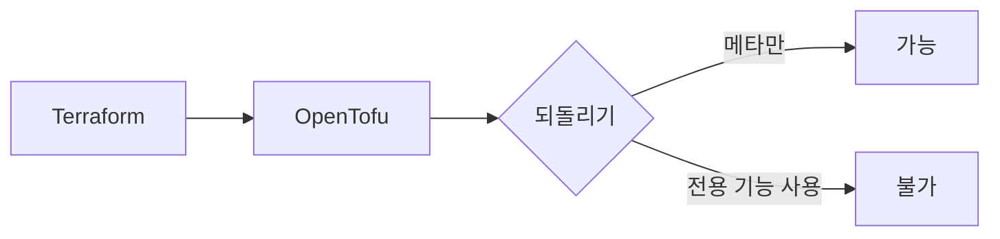
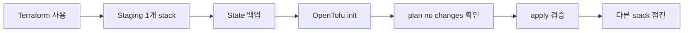
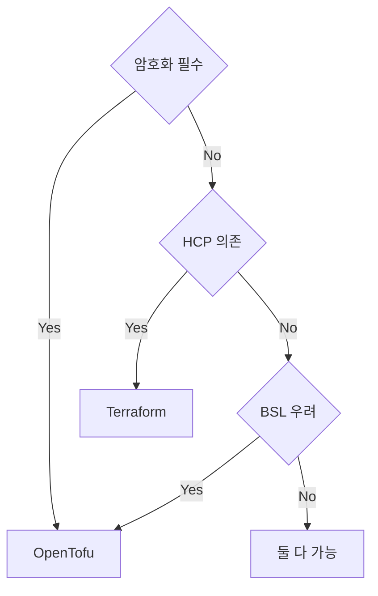

# OpenTofu vs Terraform

> 2023-08 HashiCorp가 Terraform을 BSL로 전환한 뒤 Linux Foundation
> 산하에서 fork된 **OpenTofu**가 등장했다. 2026 현재 OpenTofu는
> **CNCF Sandbox**(2025-04 편입)로, Terraform 1.5.7 fork에서 시작해
> 독자 기능을 빠르게 늘리는 단계.
>
> 두 도구의 **차이점·호환성·마이그레이션·선택 기준**을 정리한다.

- **전제**: [Terraform 기본](./terraform-basics.md), [State 관리
  ](../concepts/state-management.md)

---

## 1. 분기의 배경

### 1.1 타임라인

| 날짜 | 사건 |
|---|---|
| 2014 | Terraform OSS 출시 (MPL-2.0) |
| 2023-08-10 | HashiCorp, Terraform 1.6+ 라이선스를 **BSL-1.1**로 전환 |
| 2023-09 | OpenTF 매니페스토, fork 시작 |
| 2024-01-10 | **OpenTofu 1.6.0** GA (Terraform 1.5.7 fork 기반) |
| 2024-04-24 | IBM, HashiCorp **인수 발표** |
| 2024-04-30 | OpenTofu 1.7 — **state encryption** GA |
| 2024-07 | OpenTofu 1.8 — **early evaluation, mock provider** |
| 2025-02-27 | IBM, HashiCorp **인수 완료** (HashiCorp가 IBM 산하로) |
| 2025-04-23 | OpenTofu **CNCF Sandbox** 편입 |
| 2025-06 | HCP Terraform **Stacks** GA (HashiConf 2025) |
| 2025-11 | Terraform 1.14 — List Resources, Actions Block |
| 2025-12 | OpenTofu 1.11 |
| 2026-04 | Terraform 1.14.9 (현재) |

### 1.2 BSL 라이선스의 의미

**BSL-1.1**(Business Source License):
- 라이선스 텍스트에 정의된 대로 **각 버전이 release 4년 후** Change
  License(HashiCorp는 MPL-2.0 지정)로 자동 전환 — 코드베이스 일괄
  전환이 아닌 **버전 단위** 적용
- 그 사이 **HashiCorp 경쟁 SaaS 제공 금지** (Spacelift·env0 등 우회 필요)
- 일반 사용자는 사실상 무관, **TACOS** (Terraform Automation and Collaboration Software) 벤더가 직격탄

OpenTofu 측 답: **MPL-2.0 영구 유지** (Linux Foundation·CNCF 거버넌스로 보장).

---

## 2. 호환성

### 2.1 기본 호환

| 영역 | 호환 |
|---|---|
| HCL 문법 | ✅ 완전 (1.5.x 기준) |
| 기본 resource·data 스키마 | ✅ |
| provider protocol | ✅ Plugin Protocol v5/v6 |
| state 파일 포맷 | ✅ (Terraform이 OpenTofu 메타 거부 가능 — §2.3) |
| `terraform_data`, `import` 블록, `removed` 블록, `moved` 블록 | ✅ (1.6 fork 시점에 포함) |
| `sensitive`, `nullable`, `validation` | ✅ |

### 2.2 양 도구 모두 GA된 후속 기능 (분기 이후 양쪽 추가)

| 기능 | Terraform | OpenTofu | 비고 |
|---|---|---|---|
| Provider mocking (test) | 1.7 (2024-01) | 1.8 (2024-07) | 문법 차이 — 양립 모듈 주의 |
| Provider-defined functions | 1.8 | 1.7 | OpenTofu가 먼저 |
| `ephemeral` input variables | 1.10 | 1.11 | 변수 단위 |
| `ephemeral` resources / write-only 인자 | 1.11 | 1.11 | resource 단위 — 진짜 영속화 차단 |
| Cross-variable validation | 1.9 | 1.9 | OpenTofu 1.9.x에 동작 이슈 보고됨(#2813) |
| S3 native locking (`use_lockfile`) | 1.10 experimental, **1.11 GA** | 1.10 GA | DynamoDB deprecated |
| `removed` 블록 | 1.7 | 1.7 | — |
| Provider iteration (`for_each` provider) | — | 1.9 | OpenTofu 전용 |

분기 후에도 **언어·표준 기능은 두 도구가 평행 진화** — 호환성 유지에
양쪽 모두 노력.

### 2.3 단방향 마이그레이션



- **Terraform → OpenTofu**: 대부분 무수정 가능. 단 1.6+ 신기능을 사용
  중이면 OpenTofu 호환 버전 확인 필요
- **OpenTofu → Terraform**: 거부 사유에 따라 다름:

| 사용한 OpenTofu 기능 | Terraform 복귀 |
|---|---|
| 순수 plan/apply만 | `terraform_version` 필드 수정으로 복귀 가능 |
| state encryption 사용 | **불가** — Terraform이 본문 복호화 못 함 |
| `enabled` meta-argument 사용 | 코드 수정 필요 |
| early evaluation으로 backend 동적 변수 | terraform 블록 정적화 필요 |
| provider for_each | 코드 재작성 |

**결론**: state encryption 사용 시점부터 사실상 단방향. 순수 fork만
사용 중이면 복귀 가능하지만 백업은 필수.

---

## 3. 도구별 독자 기능

### 3.1 OpenTofu만 가진 기능 (2026-04 기준)

| 기능 | 도입 | 의미 |
|---|---|---|
| **state·plan encryption** | 1.7 | state 본문 자체 암호화 (AES-GCM, AWS KMS·OpenBao 키) |
| **early variable evaluation** | 1.8 | `terraform` 블록 내 backend·encryption·module source에 변수 사용 |
| **provider iteration** (`for_each` provider) | 1.9 | aliased provider를 동적으로 fanout |
| **OCI registry 모듈/provider 배포** | 1.10 | container registry로 모듈·provider 배포 |
| **enabled meta-argument** | 1.11 | resource 단위 conditional의 표준화 |
| **ephemeral resources** | 1.11 | apply 동안만 존재하는 resource — secret 회전 등 |
| **`.tofutest.hcl`** 확장자 | 1.6+ | OpenTofu 전용 테스트 |
| **MPL-2.0 영구 보장** | — | CNCF는 통상 Apache-2.0이지만 OpenTofu에 MPL-2.0 예외 승인 |
| **CNCF 거버넌스** | — | 벤더 중립 |

### 3.2 Terraform만 가진 기능 (2026-04 기준)

| 기능 | 도입 | 의미 |
|---|---|---|
| **List Resources** + `terraform query` | 1.14 | `.tfquery.hcl`로 외부 자원 발견·bulk import |
| **Actions Block** + `-invoke` | 1.14 | 리소스 lifecycle에 imperative 후크 (Lambda·CloudFront 등) |
| **HCP Terraform Stacks** (GA 2025-06) | — | stack 오케스트레이션 (HCP 전용 — OSS CLI 불가) |
| **Project Infragraph** | — | 인프라 그래프 가시화 (HCP) |
| **Terraform Enterprise UI brownfield** | TFE 1.2 | 콘솔 발견 자원 import UI |
| **IBM·HashiCorp 통합 자원** | 2025-02+ | watsonx·IBM Cloud 통합 |

### 3.3 핵심 차별점 비교

| 측면 | Terraform | OpenTofu |
|---|---|---|
| **라이선스** | BSL-1.1 (1.6+) | MPL-2.0 |
| **거버넌스** | HashiCorp(IBM 산하) | Linux Foundation + CNCF |
| **혁신 방향** | HCP 통합·List/Actions | OSS CLI 자체 기능 |
| **state 암호화** | 없음(백엔드 위임) | 네이티브 |
| **terraform 블록 내 변수** | 불가 | 가능 (early evaluation) |
| **TACOS 호환** | 가능하나 BSL 제약 | 자유 |
| **벤더 lock-in** | 일부 기능 HCP 종속 | 없음 |
| **registry** | HashiCorp registry | OpenTofu registry (별도, 2,000+ provider 미러) |

---

## 4. 라이선스·거버넌스 결정 매트릭스

조직 상황별 권장:

| 상황 | 권장 |
|---|---|
| 규제 산업·금융·정부 (state 암호화 필수) | **OpenTofu** |
| HCP Terraform 이미 사용 중 | **Terraform** |
| 자체 호스팅 + OSS 우선 + 벤더 중립 | **OpenTofu** |
| Stacks·List Resources 등 1.14+ 신기능 의존 | **Terraform** |
| BSL 우려 (사내 정책·법무 검토) | **OpenTofu** |
| 기존 모듈·자동화 그대로 유지 | 둘 다 가능 (호환성 ≥ 95%) |
| 클라우드 native + IBM 생태계 | **Terraform** |
| Atlantis 자체 호스팅 + OSS 우선 | **OpenTofu** |
| HCP Terraform/Cloud agent 사용 중 | **Terraform** |

**현실**: 많은 조직이 **현 상태 유지** — 강한 동인 없으면 굳이 옮기지
않음. 이미 안정된 환경에서는 차이가 결정적이지 않다.

---

## 5. 마이그레이션 절차

### 5.1 사전 검토

1. 사용 중인 Terraform 버전 (1.5.x 이하면 가장 매끄러움, 1.6+ 신기능
   사용 중이면 case-by-case)
2. provider 호환성 — 99%는 그대로지만 일부 partner provider는 확인
3. CI 도구 (Atlantis, Spacelift, env0, Scalr 등) 의 OpenTofu 지원
4. 정적 분석·테스트 도구 (tflint, conftest, checkov, terratest)
5. 사내 wrapper·script가 `terraform` 명령어를 hard-coded로 호출

### 5.2 단계적 전환



#### 절차

```bash
# 1. 백업
terraform state pull > backup-pre-migration.json

# 2. binary 설치 (다른 디렉토리)
brew install opentofu  # 또는 https://opentofu.org/docs/intro/install/
which tofu

# 3. init (OpenTofu 자동 인식)
tofu init -upgrade

# 4. plan — 반드시 no changes
tofu plan
# ⚠ "Plan: 0 to add, 0 to change, 0 to destroy" 외에는 중단

# 5. apply (사실상 no-op이지만 state metadata 업데이트)
tofu apply

# 6. 이후 CI도 tofu로 전환
```

### 5.3 CI 변경

```yaml
# Before
- run: terraform init
- run: terraform plan

# After
- run: tofu init
- run: tofu plan
```

GitHub Actions: `opentofu/setup-opentofu@v1` 액션. 스크립트의 `terraform`을
`tofu`로 일괄 치환 시 **PR 코멘트 트리거** 등 일부 wrapper(예 Atlantis)는
키워드 매칭으로 동작하므로 사용 도구의 trigger 패턴을 사전 검증할 것.

### 5.4 롤백 가능성

OpenTofu apply 후 state 메타가 들어가면 Terraform이 거부할 수 있다.
**롤백을 보장**하려면:
1. backup 파일 보관
2. OpenTofu 메타가 추가되기 전까지 `tofu init`만 했으면 backup으로
   복귀 가능
3. 한 번 `tofu apply` 한 후에는 사실상 단방향

---

## 6. 일상 운영 차이

### 6.1 명령어

```bash
# 모두 동일 의미
terraform init  ↔  tofu init
terraform plan  ↔  tofu plan
terraform apply ↔  tofu apply
terraform destroy ↔ tofu destroy
terraform fmt  ↔  tofu fmt
terraform validate ↔ tofu validate
terraform test ↔ tofu test  (OpenTofu는 .tofutest.hcl 추가 지원)
```

### 6.2 환경 변수

| Terraform | OpenTofu | 비고 |
|---|---|---|
| `TF_VAR_<name>` | 동일 | 호환 |
| `TF_LOG` | 동일 | 호환 |
| `TF_CLI_ARGS` | 동일 | 호환 |
| `TF_PLUGIN_CACHE_DIR` | 동일 | 호환 |
| — | `TF_ENCRYPTION` | OpenTofu 전용, encryption 설정 inline |

### 6.3 Registry

```hcl
# Terraform 표준
source = "hashicorp/aws"      # registry.terraform.io 자동

# OpenTofu — 2가지
source = "hashicorp/aws"           # OpenTofu registry로 redirect
source = "registry.opentofu.org/hashicorp/aws"  # 명시
```

**OpenTofu registry**(`registry.opentofu.org`)는 HashiCorp registry의
provider를 수천 개 미러 + 일부 community 추가. mirror 동작 자체는
사용자 무영향.

### 6.4 Lock 파일 호환

`.terraform.lock.hcl`은 두 도구가 **공유**. 단 일부 provider hash
검증 알고리즘 차이로 양쪽 init 시 약간의 변경이 발생할 수 있음 →
multi-platform 팀은 `terraform providers lock -platform=...` 또는
`tofu providers lock -platform=...` 으로 명시 관리.

---

## 7. 본 위키의 입장

### 7.1 글의 표기

본 위키 IaC 카테고리의 모든 글은 **두 도구를 모두 지원**하도록 작성.
명령어는 `terraform`을 표준으로 쓰되, OpenTofu 전용 기능은 명시.

### 7.2 결정 가이드 한 줄 요약



대부분 조직은 **현재 상태 유지**가 합리적. 새 프로젝트라면
**OpenTofu 우선 검토**(라이선스 안전성·기능 추가 속도).

---

## 8. 안티패턴

| 안티패턴 | 왜 문제 | 교정 |
|---|---|---|
| 마이그레이션 백업 없음 | 롤백 불가 | `state pull > backup.json` |
| OpenTofu apply 후 Terraform로 복귀 시도 | state 거부 | 단방향 인지, 사전 결정 |
| 양쪽 도구를 같은 state에 번갈아 사용 | 메타 충돌 | **하나 선택** |
| Terraform 1.14 신기능(List·Actions) 사용 후 OpenTofu 전환 | 기능 누락 | 의존 사전 정리 |
| OpenTofu 1.7+ encryption + Terraform 1.x 혼용 | encryption 인식 불가 | OpenTofu 통일 |
| Wrapper script가 `terraform` 하드코딩 | tofu 전환 불가 | `${TF_BIN:-tofu}` 패턴 |
| HCP Terraform 사용 중 OpenTofu 전환 | HCP 전용 기능 손실 | HCP 의존 사전 평가 |
| 한 번에 모든 stack 전환 | 사고 시 영향 거대 | staging 1개부터 점진 |
| `.terraform.lock.hcl` 비교 검증 없이 마이그레이션 | hash 불일치 init 실패 | `providers lock -platform=...` 사전 정리 |
| OpenTofu 1.8 mock provider 문법 그대로 Terraform 1.7에 사용 | 호환성 차이로 실패 | 양쪽 호환 부분만 사용 또는 분기 테스트 |
| BSL 검토 없이 prod 사내 Terraform 사용 | 법무·구매 이슈 | 사전 라이선스 합의 |
| OpenTofu/Terraform 양립 모듈에 분기 파일·테스트 관리 부재 | 한쪽에서만 동작 | `.tf`/`.tofu` 분리 또는 호환 부분만 사용 + 양쪽 CI |
| OpenTofu 1.9 cross-variable validation 그대로 의존 | 동작 이슈(#2813) 보고됨 | 1.10+ 확인 또는 회피 패턴 |

---

## 9. 도입 로드맵 (전환 결정한 경우)

1. **사내 라이선스·CI·도구 영향 평가** — 1~2주
2. **테스트 환경 1개 stack 전환** — 1주
3. **CI 도구 OpenTofu 지원 확인 및 전환**
4. **staging 환경 전체 전환** — 2~4주
5. **prod 점진 전환** — stack 단위로 순차
6. **OpenTofu 전용 기능 도입 검토** — state encryption 우선
7. **모듈에 `.tofutest.hcl` 추가 (선택)** — 양쪽 테스트 분리
8. **6개월 후 회고** — 결정 결과 평가

---

## 10. 관련 문서

- [IaC 개요](../concepts/iac-overview.md) — IaC 도구 지도
- [Terraform 기본](./terraform-basics.md) — HCL·workflow
- [State 관리](../concepts/state-management.md) — state encryption 차이
- [Terraform State](./terraform-state.md) — backend·workspace 차이
- [Terraform 모듈](./terraform-modules.md) — 호환성 작성 패턴

---

## 참고 자료

- [OpenTofu 공식](https://opentofu.org/) — 확인: 2026-04-25
- [OpenTofu 1.7 (state encryption) 발표](https://opentofu.org/blog/opentofu-1-7-0/) — 확인: 2026-04-25
- [OpenTofu 1.8 (early evaluation, mock) 발표](https://opentofu.org/blog/opentofu-1-8-0/) — 확인: 2026-04-25
- [OpenTofu 1.11 발표](https://opentofu.org/blog/opentofu-1-11-0/) — 확인: 2026-04-25
- [CNCF: OpenTofu 프로젝트 페이지 (Sandbox 2025-04)](https://www.cncf.io/projects/opentofu/) — 확인: 2026-04-25
- [HashiCorp BSL 발표 (2023-08)](https://www.hashicorp.com/en/blog/hashicorp-adopts-business-source-license) — 확인: 2026-04-25
- [Terraform 1.14 — List Resources & Actions](https://github.com/hashicorp/terraform/releases/tag/v1.14.0) — 확인: 2026-04-25
- [OpenTofu state encryption 공식 문서](https://opentofu.org/docs/language/state/encryption/) — 확인: 2026-04-25
- [OpenTofu Migration 가이드](https://opentofu.org/docs/intro/migration/) — 확인: 2026-04-25
- [Spacelift: OpenTofu vs Terraform](https://spacelift.io/blog/opentofu-vs-terraform) — 확인: 2026-04-25
- [HCP Terraform Stacks GA](https://developer.hashicorp.com/terraform/language/stacks/update-GA) — 확인: 2026-04-25
