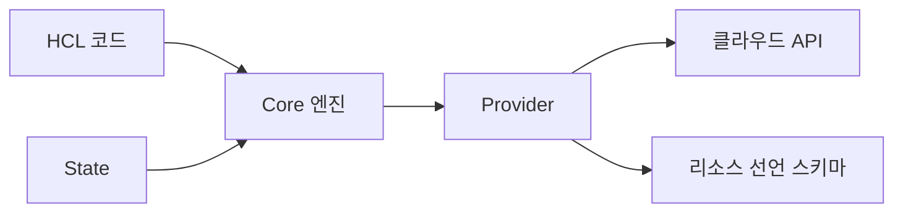
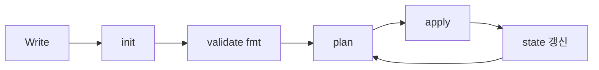

# Terraform 기본

> Terraform/OpenTofu를 처음 만지는 엔지니어가 알아야 할 **언어 기초·
> 워크플로·핵심 개념**. 이 글은 표준 사용 패턴이며, **state 운영**은
> [Terraform State](./terraform-state.md), **모듈**은 [Terraform 모듈
> ](./terraform-modules.md), **provider**는 [Terraform Providers
> ](./terraform-providers.md), **분기 비교**는 [OpenTofu vs Terraform
> ](./opentofu-vs-terraform.md)에서 다룬다.
>
> **현재 기준** (2026-04):
> - Terraform **1.14.x** (2025-11 GA, 1.14.9 패치 2026-04)
> - OpenTofu **1.11.x** (2025-12 GA)
> - 두 도구 모두 HCL이 본 글의 기본 문법

- **전제**: [IaC 개요](../concepts/iac-overview.md), [State 관리
  ](../concepts/state-management.md)
- 본 글은 **언어와 워크플로**가 중심. 도구 선택 비교는 별도 글

---

## 1. Terraform·OpenTofu이란

### 1.1 한 문장 정의

**선언형 IaC 도구**. HCL로 인프라를 선언하면, 엔진이 현재 state와
대조해 필요한 API 호출을 계산·실행한다.

### 1.2 구성 요소



| 요소 | 역할 |
|---|---|
| **Core** | 의존성 그래프, plan 계산, state 관리 |
| **HCL** | 사람이 읽고 쓰는 선언 언어 |
| **Provider** | AWS·Azure·K8s·vSphere 등 각 시스템 어댑터 |
| **State** | "지금까지 만든 것"의 장부 ([State 관리](../concepts/state-management.md)) |

### 1.3 OpenTofu 호환성

- HCL·provider·state는 **상호 호환**(소수 신규 기능 제외)
- 본 글의 모든 예시는 두 도구에서 동일 동작
- OpenTofu는 별도 binary `tofu`로 배포되며 Terraform CLI의 **drop-in
  replacement**. 사용자가 셸 alias로 `terraform` 명령에 매핑하는 것은
  관례일 뿐 공식 동작 아님

---

## 2. HCL 기초

### 2.1 파일 구성

```text
.
├── main.tf          # resource, data 선언
├── variables.tf     # input 변수
├── outputs.tf       # 외부에 노출할 값
├── providers.tf     # provider 설정
├── versions.tf      # required_version, required_providers
├── terraform.tfvars # 변수 값 (gitignore 권장 if 시크릿)
└── .terraform.lock.hcl  # provider 무결성 잠금 (커밋 필수)
```

파일 이름은 관례. Core가 디렉토리 내 모든 `.tf`를 합쳐 처리.

### 2.2 핵심 블록 6종

```hcl
# 1. terraform — 도구·backend·required_providers
terraform {
  required_version = ">= 1.6.0"
  required_providers {
    aws = {
      source  = "hashicorp/aws"
      version = "~> 5.70"
    }
  }
  backend "s3" {
    # bucket·key·region·use_lockfile=true 등은 별 글에서
    # → ../concepts/state-management.md
  }
}

# 2. provider — 어댑터 인스턴스
provider "aws" {
  region = "us-east-1"
}

# 3. resource — 만들려는 인프라
resource "aws_s3_bucket" "logs" {
  bucket = "myorg-logs"
}

# 4. data — 외부 정보 조회 (read-only)
data "aws_ami" "al2023" {
  most_recent = true
  owners      = ["amazon"]
  filter {
    name   = "name"
    values = ["al2023-ami-*-x86_64"]
  }
}

# 5. variable — 입력
variable "env" {
  type    = string
  default = "dev"
}

# 6. output — 출력
output "bucket_arn" {
  value = aws_s3_bucket.logs.arn
}
```

### 2.3 표현식

| 표현 | 예 |
|---|---|
| 참조 | `aws_s3_bucket.logs.arn` |
| 변수 | `var.env` |
| local | `local.tags` (`locals { tags = {...} }`) |
| 보간 | `"prefix-${var.env}"` |
| 함수 | `merge(var.tags, {Owner = "ops"})` |
| 조건 | `var.enabled ? 1 : 0` |
| splat | `aws_instance.web[*].id` |
| for | `[for s in var.subs : s.id]` |
| heredoc | `<<EOT ... EOT` (멀티라인) |

### 2.4 타입 시스템

```hcl
variable "config" {
  type = object({
    name     = string
    replicas = number
    tags     = map(string)
    rules    = list(object({
      port = number
      cidr = string
    }))
  })
}
```

- **primitive**: `string`, `number`, `bool`
- **collection**: `list(T)`, `set(T)`, `map(T)`, `tuple([...])`, `object({...})`
- **`optional()` 마커** (TF 1.3+): `object({ name = optional(string, "default") })`
  로 필드 단위 기본값·선택성 표현. 모듈 작성에서 거의 필수
- **any** 가능하지만 비권장 — 타입 추론은 검증을 약화

### 2.5 변수 검증·민감도

```hcl
variable "instance_type" {
  type = string
  validation {
    condition     = startswith(var.instance_type, "t3.")
    error_message = "t3 계열만 허용 (비용 정책)."
  }
}

variable "db_password" {
  type      = string
  sensitive = true   # plan/apply 출력 마스킹
  ephemeral = true   # 변수 메모리만, state·plan 미저장 (TF 1.10+)
}

resource "aws_rds_cluster" "main" {
  master_password_wo         = var.db_password   # TF 1.11+ write-only
  master_password_wo_version = 1
}
```

**중요한 구분**:
- **`ephemeral` 변수**(TF 1.10+): 변수 자체가 메모리에만 — 변수 단위
- **`write_only` 인자**(TF 1.11+, `_wo` suffix): provider 인자가 state에
  저장되지 않음 — **시크릿이 진짜로 영속화 안 되려면 이 단계까지 필요**
- `sensitive`는 표시만 가리고 state에는 저장됨

`ephemeral` 변수만 붙이면 모듈 호출 사이에서만 차단됨. 시크릿이 실제
리소스 인자에 들어가야 한다면 provider가 `write_only` 인자를 지원해야
영속화 차단 — AWS·Azure·random 등에서 우선 지원. 상세 → [State 관리
§5.4](../concepts/state-management.md).

---

## 3. 코어 워크플로

### 3.1 Write → Plan → Apply



| 단계 | 명령 | 역할 |
|---|---|---|
| Write | (편집기) | HCL 작성·리뷰 |
| Init | `init` | provider·module 다운로드, backend 설정 |
| Validate | `validate` | 문법·내부 일관성 |
| Format | `fmt` | 표준 들여쓰기·정렬 |
| Plan | `plan` | 변경 미리보기, 산출물 저장 가능 |
| Apply | `apply` | 변경 적용 |
| Destroy | `destroy` | 전체 삭제 |

### 3.2 명령 상세

#### `init`

```bash
terraform init                  # 기본
terraform init -upgrade         # provider/module 새 버전 검색
terraform init -reconfigure     # backend 재구성
terraform init -migrate-state   # backend 변경 시 state 이전
terraform init -lockfile=readonly  # CI에서 lock 파일 변경 차단 (권장)
```

`init`은 **idempotent**. 매번 실행 안전. `-lockfile=readonly`는 lock
파일을 readonly로 취급해 **provider hash 불일치 시 init을 실패**시키는
무결성 검증 옵션 — CI에서 공급망 공격 방어. 단, dependency 자동
업그레이드(Renovate 등)와는 충돌하므로 PR 자동화 워크플로에서는
업그레이드 PR에서만 lockfile 갱신 허용 + 머지 후 검증으로 분리.

#### `plan`

```bash
terraform plan                       # 콘솔 출력
terraform plan -out=tfplan           # binary plan 파일 저장
terraform plan -refresh-only         # state ↔ 실제 차이만 확인
terraform plan -destroy              # destroy 시 무엇이 사라지는지
terraform plan -target=aws_instance.web   # 부분만 (위험, 디버깅용)
terraform plan -var-file=prod.tfvars
terraform plan -compact-warnings     # 출력 정리
```

**프로덕션 표준**: PR에서 `plan -out=tfplan` 저장 → 리뷰어가 검토 →
머지 후 같은 plan 파일을 `apply tfplan`. **리뷰한 plan과 적용되는
plan이 일치**해야 한다.

#### `apply`

```bash
terraform apply                  # plan 후 확인 prompt
terraform apply -auto-approve    # CI에서 (이미 plan 검토 완료한 경우)
terraform apply tfplan           # 저장된 plan 파일을 그대로 적용
terraform apply -replace=aws_instance.web   # taint 대체 — 운영 중 즉시 destroy/recreate (다운타임 가능)
terraform apply -refresh-only    # state ↔ 실제 동기화만 — drift를 review 없이 받아들임
terraform apply -parallelism=20  # 동시 실행 (default 10)
```

**위험 명령 주의**:
- `-replace`: 운영 중 리소스를 그 자리에서 destroy 후 재생성 → 다운타임
  가능. `lifecycle { create_before_destroy = true }` 없으면 더 위험
- `-refresh-only`: drift가 의도된 변경(긴급 fix)일 수도 있는데 그대로
  state로 흡수. **콘솔 변경 추적 의도가 사라짐** — review 후 commit 권장
- `-target`: 의존 리소스 생략 → 부분 plan은 일시 디버깅 외 금지

**`-auto-approve` 원칙**: CI에서만, 그것도 plan 파일을 명시 적용할
때만 안전.

#### `destroy`

```bash
terraform plan -destroy   # 무엇이 사라지는지 미리 보기
terraform destroy
terraform destroy -target=aws_instance.web   # 부분 (재현성 깨짐 주의)
```

prod에 `destroy` 명령을 직접 실행하는 일은 거의 없어야 한다. 오해
방지를 위해 prod state에서는 IAM으로 destroy 차단을 검토.

### 3.3 보조 명령

| 명령 | 용도 |
|---|---|
| `validate` | 문법·일관성 (provider 미설치도 동작) |
| `fmt` | 들여쓰기·정렬 표준화 (`-recursive`) |
| `console` | 표현식 즉석 평가 (디버깅) |
| `graph` | 의존성 그래프(dot 형식) |
| `output` | output 값 조회 |
| `show` | 현재 state 또는 plan 파일 내용 |
| `providers` | 사용 중인 provider 목록 |
| `force-unlock <ID>` | state lock 강제 해제 — **사고 복구 전용**, 자동화 금지 |
| `taint` / `untaint` | **deprecated**. `apply -replace=`로 대체 |
| `version` | 도구·provider 버전 |

---

## 4. Resource·Data·Provider

### 4.1 Resource 메타 인수

```hcl
resource "aws_instance" "web" {
  count         = var.create ? 1 : 0   # 또는 for_each
  ami           = data.aws_ami.al2023.id
  instance_type = var.instance_type
  
  depends_on = [aws_security_group.web]   # 명시 의존
  provider   = aws.us_west                # 별칭 provider
  
  lifecycle {
    create_before_destroy = true
    prevent_destroy       = false
    ignore_changes        = [tags["LastBackup"]]
    replace_triggered_by  = [aws_security_group.web]
  }
}
```

| 메타 인수 | 용도 |
|---|---|
| `count` | 정수 개수 (단순 반복) |
| `for_each` | map·set 반복 (key 기반 안정) |
| `depends_on` | 자동 추론 안 되는 의존성 |
| `provider` | 별칭 provider 지정 |
| `lifecycle` | 변경·삭제 정책 |

### 4.2 `count` vs `for_each`

```hcl
# count — index 기반, 순서 변경에 취약
resource "aws_iam_user" "team" {
  count = length(var.users)
  name  = var.users[count.index]
}

# for_each — key 기반, 안정적 (권장)
resource "aws_iam_user" "team" {
  for_each = toset(var.users)
  name     = each.key
}
```

**state key 차이**: `aws_iam_user.team[0]` vs `aws_iam_user.team["alice"]`.
`count`는 list에서 한 명 제거 시 뒷쪽 모두 재생성된다.

**전환 함정**: 이미 `count`로 만든 리소스를 `for_each`로 바꾸려면
`state mv`로 각 인스턴스를 명시 이동 필요 (그렇지 않으면 destroy +
recreate).

### 4.3 Data Source

```hcl
data "aws_vpc" "main" {
  filter {
    name   = "tag:Name"
    values = ["prod-vpc"]
  }
}

resource "aws_subnet" "private" {
  vpc_id     = data.aws_vpc.main.id
  cidr_block = "10.0.1.0/24"
}
```

- **read-only** 외부 정보 조회
- 매 plan/apply마다 다시 조회 — 응답이 바뀌면 의존 리소스도 변경됨
- 외부 변동성이 큰 값(예: `data "aws_ami" "latest"`)은 의도치 않은
  교체 유발 가능

### 4.4 Provider 선언

```hcl
terraform {
  required_providers {
    aws = {
      source  = "hashicorp/aws"
      version = "~> 5.70"
    }
    kubernetes = {
      source  = "hashicorp/kubernetes"
      version = "~> 2.31"
    }
  }
}

provider "aws" {
  region = "us-east-1"
}

provider "aws" {
  alias  = "us_west"
  region = "us-west-2"
}
```

- `source` = registry 주소, `version` = semver 제약
- 별칭(`alias`)으로 같은 provider 다중 인스턴스 (멀티 리전·계정)
- 상세 → [Terraform Providers](./terraform-providers.md)

---

## 5. 동적 구성

### 5.1 `dynamic` 블록

같은 블록을 여러 개 생성 (보통 `tags`, `ingress`, `setting`).

```hcl
resource "aws_security_group" "web" {
  name = "web"

  dynamic "ingress" {
    for_each = var.allowed_ports
    content {
      from_port   = ingress.value.port
      to_port     = ingress.value.port
      protocol    = "tcp"
      cidr_blocks = ingress.value.cidrs
    }
  }
}

variable "allowed_ports" {
  type = list(object({
    port  = number
    cidrs = list(string)
  }))
  default = [
    { port = 80,  cidrs = ["0.0.0.0/0"] },
    { port = 443, cidrs = ["0.0.0.0/0"] },
  ]
}
```

**한계**: `dynamic`은 resource·data·provider·provisioner의 nested
argument에만 사용. `lifecycle` 같은 메타 블록에는 사용 불가.

### 5.2 조건부 dynamic

```hcl
dynamic "encryption_configuration" {
  for_each = var.kms_key_arn != null ? [1] : []
  content {
    kms_master_key_id = var.kms_key_arn
    sse_algorithm     = "aws:kms"
  }
}
```

빈 list → 블록 미생성. 옵셔널 설정 표현의 표준 패턴.

### 5.3 nested dynamic

```hcl
dynamic "rule" {
  for_each = var.rules
  content {
    name = rule.value.name
    dynamic "filter" {
      for_each = rule.value.filters
      content {
        prefix = filter.value
      }
    }
  }
}
```

너무 깊으면 가독성 급락. **3단 이상이면 module로 추출** 권장.

### 5.4 `null_resource`·`terraform_data`

`null_resource`는 외부 명령 실행용. **`terraform_data` 리소스(TF 1.4+)
가 권장 후속**.

```hcl
# 1.4+ 권장
resource "terraform_data" "trigger" {
  triggers_replace = [aws_db_instance.main.endpoint]
  
  provisioner "local-exec" {
    command = "scripts/migrate.sh ${aws_db_instance.main.endpoint}"
  }
}
```

**기존 `null_resource`에서 마이그레이션**:

| 항목 | `null_resource` | `terraform_data` |
|---|---|---|
| 외부 provider | `hashicorp/null` 필요 | 내장 |
| 트리거 인자 | `triggers = map(string)` | `triggers_replace = any` |
| State 이동 | — | `moved` 블록(TF 1.9+)으로 안전 이전 |

```hcl
# state 이전을 위한 moved 블록 (TF 1.9+)
moved {
  from = null_resource.trigger
  to   = terraform_data.trigger
}
```

`provisioner "local-exec"`는 **재현성을 깨므로 최후 수단**. 거의
모든 경우 provider·module로 표현 가능.

---

## 6. 모듈 호출 (요약)

```hcl
module "vpc" {
  source  = "terraform-aws-modules/vpc/aws"
  version = "~> 5.0"

  name = "prod-vpc"
  cidr = "10.0.0.0/16"
  
  azs             = ["us-east-1a", "us-east-1b"]
  private_subnets = ["10.0.1.0/24", "10.0.2.0/24"]
  public_subnets  = ["10.0.101.0/24", "10.0.102.0/24"]
}

# module의 output 참조
output "vpc_id" {
  value = module.vpc.vpc_id
}
```

- `source`: registry, Git, 로컬 경로, S3 등
- `version`: registry·git tag만 의미. 로컬 source는 무시
- 상세 설계 원칙은 [Terraform 모듈](./terraform-modules.md)

---

## 7. 변수 우선순위

여러 곳에서 같은 variable이 정의되면 **다음 순서**로 결정 (뒤가 우선):

1. `variable {}`의 `default`
2. 환경 변수 `TF_VAR_<name>`
3. `terraform.tfvars`
4. `terraform.tfvars.json`
5. `*.auto.tfvars` / `*.auto.tfvars.json` (알파벳 순)
6. `-var-file=` (CLI, 명시 순)
7. `-var=` (CLI, 명시 순)

**프로덕션 표준**:
- 환경별 `prod.tfvars` / `stg.tfvars` 분리
- 시크릿은 `TF_VAR_db_password`로 환경 변수 주입 (CI에서)
- `*.auto.tfvars`는 의도와 다른 값이 자동 적용될 위험 — 가급적 회피

---

## 8. 1.14·1.11 신기능 요약 (2025~2026)

| 기능 | TF 버전 | OpenTofu | 의미 |
|---|---|---|---|
| `ephemeral` value | 1.10 | 1.11 | state 미저장 시크릿 변수 |
| `import` 블록(선언) | 1.5 | 1.6 | review 가능한 import |
| S3 native locking | 1.10 | 1.8 | DynamoDB 불필요 |
| `terraform_data` | 1.4 | 1.6 | `null_resource` 후속 |
| `removed` 블록 | 1.7 | 1.7 | state에서 제거 (리소스 유지) |
| 변수 `validation`에서 다른 var 참조 | 1.9 | 1.9 | cross-validation |
| **List Resources / `terraform query`** | **1.14** | — | `.tfquery.hcl`로 외부 자원 발견·bulk import |
| **Actions Block / `-invoke`** | **1.14** | — | 리소스 라이프사이클에 imperative 후크 (Lambda 등) |
| **State encryption** | — | **1.7+** | 네이티브 state·plan 암호화 |
| **Early variable evaluation** | — | **1.10+** | terraform 블록 내 dynamic 값 |
| Provider mocks (`mock_provider`) | 1.7 | 1.8 | 모듈 단위 테스트 |
| Provider-defined functions | 1.8 | 1.7 | provider가 함수 노출 (예: `provider::aws::arn_parse`) |

OpenTofu의 state encryption과 Terraform의 List Resources/Actions는
2025~2026 두 도구의 핵심 차별점. 상세 → [OpenTofu vs Terraform
](./opentofu-vs-terraform.md).

---

## 9. CI 표준 패턴

### 9.1 PR 단계 (plan 게이트)

```yaml
# .github/workflows/tf-plan.yml (예시)
- run: terraform fmt -check -recursive
- run: terraform init -lockfile=readonly
- run: terraform validate
- run: terraform plan -out=tfplan -lock-timeout=2m
- run: terraform show -no-color tfplan > plan.txt
- uses: actions/upload-artifact@v4
  with:
    name: tfplan
    path: tfplan
    retention-days: 7        # plan은 시크릿 포함 가능 — 짧게
# plan.txt를 PR 코멘트로 자동 게시 → 리뷰
```

### 9.2 머지 후 (apply)

```yaml
- uses: actions/download-artifact@v4
  with: { name: tfplan }
- run: terraform init -lockfile=readonly
- run: terraform apply -auto-approve tfplan
```

**핵심**: PR에서 만든 동일 plan을 적용. 머지 후 `terraform plan`을
다시 실행하면 그 사이 다른 사람의 변경이 섞일 수 있다.

**plan 파일 보안 주의**:
- plan 파일에는 **시크릿이 평문 포함될 수 있음**(provider 응답 일부).
  artifact 보존 기간을 짧게(7일 이내), 가능하면 암호화 storage에 저장
- plan과 apply 사이 **OIDC 세션이 새로 발급**되어야 — apply job에서
  AWS 자격 증명을 다시 acquire
- plan 만든 PR 작성자와 apply 실행 주체는 분리(분리 책임)

### 9.3 OIDC 기반 인증

장기 access key 대신 GitHub OIDC → AWS IAM 역할:

```yaml
permissions:
  id-token: write
  contents: read

steps:
  - uses: aws-actions/configure-aws-credentials@v4
    with:
      role-to-assume: arn:aws:iam::111:role/tf-runner
      aws-region: us-east-1
```

**IAM 역할의 trust policy에서 sub claim 제한 필수**:

```json
{
  "Effect": "Allow",
  "Principal": { "Federated": "arn:aws:iam::111:oidc-provider/token.actions.githubusercontent.com" },
  "Action": "sts:AssumeRoleWithWebIdentity",
  "Condition": {
    "StringEquals": {
      "token.actions.githubusercontent.com:aud": "sts.amazonaws.com",
      "token.actions.githubusercontent.com:sub": "repo:myorg/infra:ref:refs/heads/main"
    }
  }
}
```

**누락하면 fork PR에서 prod 역할 탈취 위험**. `environment:prod` 또는
specific branch로 sub claim을 제한하지 않은 OIDC는 사고로 직결된다.

장기 credential 보유 = §IaC 개요의 push 모델 단점. OIDC로 해소.

---

## 10. 안티패턴

| 안티패턴 | 왜 문제 | 교정 |
|---|---|---|
| `terraform apply` 직접 prod | plan 검토 없음 | PR plan + 저장된 plan 파일 적용 |
| `count` 위치 변경 빈번 | 뒷쪽 리소스 destroy/recreate | `for_each` |
| `provisioner "local-exec"` 의존 | 재현성 파괴 | provider·module로 대체 |
| 변수에 시크릿을 평문 default | git에 평문 유출 | env var, ephemeral, 외부 스토어 |
| `-target` 일상적 사용 | 부분 plan은 의존 무시 | 전체 plan, 디버깅에만 |
| `data` 소스로 자주 변하는 외부값 참조 | 의도치 않은 리소스 교체 | 고정 ID 또는 latest 태그 회피 |
| provider version 미고정 | 호환성 깨지는 자동 업그레이드 | `version = "~> 5.70"` |
| `.terraform.lock.hcl` 미커밋 | 무결성 검증 불가 | commit + CI `-lockfile=readonly` |
| `validate` 만 하고 plan 안 함 | 실제 리소스 변경은 못 잡음 | plan을 PR 게이트 |
| `apply -auto-approve` 무조건 | 검토 없는 적용 | 저장된 plan 적용 시에만 |
| 같은 디렉토리에 모든 환경 코드 | env 간 의존·실수 위험 | env별 디렉토리·workspace |
| local state로 협업 | corruption | remote backend ([State 관리](../concepts/state-management.md)) |
| `null_resource` 남발 | "절차형 셸 스크립트 위키"로 변질 | `terraform_data`, 그래도 안 되면 module |
| `for_each = toset(var.users)` 내부 변경 | tag 변경만으로 destroy | key는 stable identifier로 |
| `output` 모두를 `sensitive = false` | 시크릿 콘솔 노출 | 시크릿은 `sensitive = true` |
| 환경 분기를 `count` ternary로 | 코드 가독성·blast radius | workspace 또는 dir 분할 |
| variable에 `default = null`/`""`로 필수성 모호 | 누락이 무음 실패로 | `nullable = false` 또는 default 제거 |
| `for_each = data.X.Y` (data 결과를 직접 사용) | 첫 plan 시 unknown 값으로 에러 | data 결과를 local에 캐싱 후 stable key 추출 |
| 모듈 내부에 `provider` 블록 선언 | 재사용성 파괴, multi-region·multi-account 불가 | 모듈은 `configuration_aliases`만, provider는 호출자가 주입 |
| 리소스 이름·tag에 `var.env` 등 동적 값을 key로 사용 | env 변경 시 state key 변경 → destroy/recreate | identifier는 stable, env는 attribute로 |

---

## 11. 도입 로드맵

1. **HCL 문법 1주** — 빈 디렉토리에 S3 bucket 1개
2. **변수·output·module 호출** — terraform-aws-modules/vpc 사용
3. **remote backend** — S3 + native lock
4. **`fmt`·`validate`·`plan` PR 게이트** — CI 통합
5. **provider version pin + lock 파일** — 무결성
6. **for_each 표준화** — count 의존 제거
7. **OIDC 인증** — 장기 access key 제거
8. **state 분할** — env별 디렉토리
9. **모듈 표준화** — 사내 모듈 registry
10. **policy as code** — OPA·conftest로 plan 검증 ([IaC 테스트](../operations/testing-iac.md))
11. **drift 감지 자동화** — `plan -detailed-exitcode` cron + 알림 (→ [State 관리 §8](../concepts/state-management.md#8-drift-감지수정))

---

## 12. 관련 문서

- [IaC 개요](../concepts/iac-overview.md) — 선언형·드리프트
- [State 관리](../concepts/state-management.md) — backend·lock·drift
- [Terraform State](./terraform-state.md) — Terraform 특화 운영
- [Terraform 모듈](./terraform-modules.md) — 재사용 설계
- [Terraform Providers](./terraform-providers.md) — vSphere·OpenStack·K8s
- [OpenTofu vs Terraform](./opentofu-vs-terraform.md) — 분기 차이

---

## 참고 자료

- [Terraform 공식 — Core Workflow](https://developer.hashicorp.com/terraform/intro/core-workflow) — 확인: 2026-04-25
- [Terraform Releases (1.14.x)](https://github.com/hashicorp/terraform/releases) — 확인: 2026-04-25
- [Terraform 1.14 — List Resources & Actions Block](https://developer.hashicorp.com/terraform/language/v1.14.x) — 확인: 2026-04-25
- [OpenTofu 1.11 Release Notes](https://opentofu.org/blog/) — 확인: 2026-04-25
- [HCL Language: Dynamic Blocks](https://developer.hashicorp.com/terraform/language/expressions/dynamic-blocks) — 확인: 2026-04-25
- [HCL Language: for_each / count](https://developer.hashicorp.com/terraform/language/meta-arguments/for_each) — 확인: 2026-04-25
- [Variable Definition Precedence](https://developer.hashicorp.com/terraform/language/values/variables#variable-definition-precedence) — 확인: 2026-04-25
- [`terraform_data` 공식 문서](https://developer.hashicorp.com/terraform/language/resources/terraform-data) — 확인: 2026-04-25
- [GitHub OIDC for AWS 공식 가이드](https://docs.github.com/en/actions/deployment/security-hardening-your-deployments/configuring-openid-connect-in-amazon-web-services) — 확인: 2026-04-25
