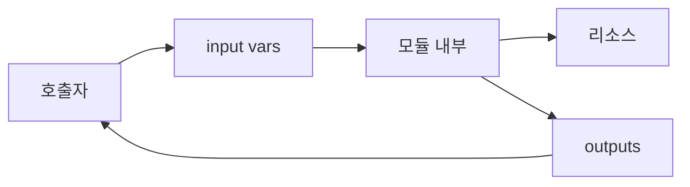
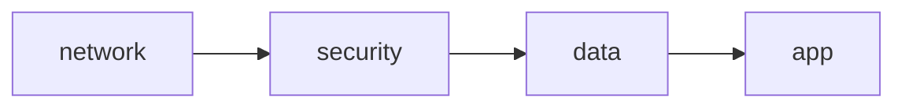
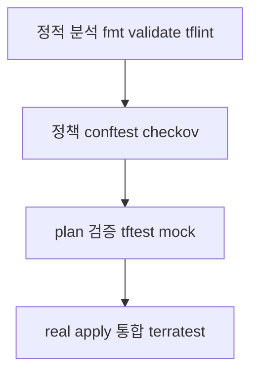

# Terraform 모듈

> "두 번째 복붙이 보이면 모듈로 만든다." 모듈은 Terraform의 **재사용
> 단위**이자 팀 간 인터페이스 계약. 잘 만든 모듈은 **변경 비용을
> 줄이고**, 잘못 만든 모듈은 모든 사용자를 끌어들여 함께 깨진다.
>
> 이 글은 모듈 **설계 원칙·버저닝·composition 패턴·테스트**까지 다룬다.
> Terraform 1.14 / OpenTofu 1.11 기준.

- **전제**: [Terraform 기본](./terraform-basics.md), [State 관리
  ](../concepts/state-management.md)
- **테스트 도구 상세**(Terratest·conftest 명령어 레퍼런스)는 [IaC
  테스트](../operations/testing-iac.md)에서 다룬다 — 본 글은 모듈
  메인테이너 시각의 테스트 설계만

---

## 1. 모듈이란

### 1.1 정의

**모듈** = `.tf` 파일이 모인 디렉토리. 호출자(caller)가 `module {}`
블록으로 사용하며, **input variables → resources → outputs**의
경계를 가진다.



모듈의 본질은 **블랙박스 인터페이스**. 호출자는 input·output만 알면
되고, 내부 구현은 모듈 메인테이너의 자유.

### 1.2 모듈 종류 (역할별)

| 종류 | 역할 | 예 |
|---|---|---|
| **Root module** | 엔트리 포인트 (배포 단위) | `live/prod/network/` |
| **Child module** | 다른 모듈에서 호출됨 | `modules/vpc/` |
| **Reusable module** | 팀·조직 간 공유 | `terraform-aws-vpc` |
| **Composite module** | 여러 모듈을 조합 | `modules/three-tier-app/` |

**Root는 모듈이 아니다**라는 표현도 보이지만, Terraform 입장에서는
"호출자 없이 동작하는 가장 바깥 모듈". 같은 규칙(input·output)이 적용.

### 1.3 모듈 source 종류

```hcl
# 1. Terraform Registry (공식·사설)
module "vpc" {
  source  = "terraform-aws-modules/vpc/aws"
  version = "~> 5.0"
}

# 2. Git
module "vpc" {
  source = "git::https://github.com/myorg/tf-modules.git//modules/vpc?ref=v1.2.0"
}

# 3. 로컬 경로 (relative)
module "vpc" {
  source = "../../modules/vpc"
}

# 4. HTTP, S3, GCS, Bitbucket, Mercurial — 지원되지만 흔치 않음
```

| Source | `version` 필드 | 적합 |
|---|---|---|
| Registry | semver 제약 (`~> 5.0`) | 외부·사내 공유 모듈 |
| Git (with `ref=tag`) | 무시됨 — `ref`로 버전 표현 | private 사내 모듈 |
| 로컬 경로 | 무시됨 | 같은 repo 내부 |

---

## 2. 모듈 설계 원칙

### 2.1 SRP — 단일 책임

한 모듈이 하나의 의미 있는 단위만 만든다.

| 좋은 모듈 | 나쁜 모듈 |
|---|---|
| `aws-vpc` | `aws-vpc-rds-eks-redis-everything` |
| `aws-eks-cluster` | "회사 전체 인프라" |
| `aws-iam-role-with-policies` | `aws-platform` |

**기준**: 같은 모듈을 여러 환경·팀이 **다른 선택**과 함께 호출할 수
있는가. "옵션을 30개 만들어 모든 경우 커버"는 신호.

### 2.2 인터페이스 안정성

모듈의 **input·output은 공개 API**. 한 번 게시한 v1.0 인터페이스를
함부로 깨지 말 것.

| 변경 종류 | semver 영향 |
|---|---|
| 새 변수 추가 (default 있음) | minor |
| output 추가 | minor |
| 내부 리소스 이름 변경 (사용자 영향 없음) | patch |
| 변수 default 변경 (동작 차이) | major |
| 변수 제거·이름 변경 | major |
| output 제거 | major |
| 리소스 destroy/recreate 유발 변경 | major |

### 2.3 입력 검증

```hcl
variable "instance_type" {
  type = string
  validation {
    condition = contains(
      ["t3.small", "t3.medium", "m5.large", "m5.xlarge"],
      var.instance_type
    )
    error_message = "허용된 instance_type: t3.small/medium, m5.large/xlarge"
  }
}

variable "name" {
  type     = string
  nullable = false
  validation {
    condition     = length(var.name) <= 32
    error_message = "name은 32자 이하 (AWS tag 제약)"
  }
}
```

`validation` 블록(TF 1.9+)은 **다른 var 참조** 가능 — cross-validation.

```hcl
variable "min_size" { type = number }
variable "max_size" { type = number }
variable "enable_logs" { type = bool }
variable "log_bucket" {
  type    = string
  default = null
}

variable "_validate" {
  type    = bool
  default = true
  validation {
    condition     = var.min_size <= var.max_size
    error_message = "min_size는 max_size 이하여야 함"
  }
  validation {
    condition     = !var.enable_logs || var.log_bucket != null
    error_message = "enable_logs=true면 log_bucket이 필요"
  }
}
```

호출자에게 "왜 잘못됐는가"를 명확히 알려준다 — 모듈 인터페이스
계약의 검증 단계.

### 2.4 `optional` + 기본값

```hcl
variable "subnets" {
  type = list(object({
    cidr               = string
    az                 = string
    public             = optional(bool, false)
    nat_gateway        = optional(bool, false)
    enable_flow_logs   = optional(bool, true)
  }))
}
```

`optional()`(TF 1.3+)으로 필드 단위 default 표현. 호출자는 필수 필드
만 채우고 나머지는 생략 가능 — 모듈의 **점진적 채택** 핵심.

### 2.5 output 설계

| 패턴 | 설명 |
|---|---|
| **개별 ID·ARN** | `vpc_id`, `vpc_arn`, `subnet_ids` |
| **그룹화 object** | `vpc = { id = ..., cidr = ..., subnets = [...] }` |
| **라이프사이클 일관 조회** | `for_each`로 만든 리소스는 map output |
| **`sensitive = true`** | 패스워드·키는 마스킹 |
| **description 필수** | 사용자 문서의 출발점 |

**과한 output 노출 주의**: 모듈 내부 리소스 전부를 output하면
호출자가 내부에 의존 → 향후 리팩터 어려워짐.

---

## 3. Provider 처리 (configuration_aliases)

### 3.1 절대 원칙

**자식 모듈에 `provider` 블록 선언 금지**. 모든 provider는 호출자가
주입한다.

이유:
- 모듈을 multi-region·multi-account에서 재사용 불가
- 모듈 내부 provider 변경이 호출자 입장에서 보이지 않음
- HashiCorp 공식 권장 (Google Cloud Best Practices도 동일)

### 3.2 단일 provider — 자동 상속

호출자의 default provider가 자동으로 자식 모듈에 상속.

```hcl
# 호출자
provider "aws" { region = "us-east-1" }

module "vpc" {
  source = "../modules/vpc"
  # providers 명시 불필요
}
```

### 3.3 별칭 provider — `configuration_aliases`

aliased provider를 모듈에서 사용하려면 `required_providers`에 명시.

```hcl
# modules/multi-region/versions.tf
terraform {
  required_providers {
    aws = {
      source                = "hashicorp/aws"
      version               = "~> 5.70"
      configuration_aliases = [aws.primary, aws.dr]
    }
  }
}

# modules/multi-region/main.tf
resource "aws_s3_bucket" "primary" {
  provider = aws.primary
  bucket   = "myorg-data-primary"
}

resource "aws_s3_bucket" "dr" {
  provider = aws.dr
  bucket   = "myorg-data-dr"
}
```

호출자에서 명시 매핑:

```hcl
provider "aws" {
  alias  = "us_east"
  region = "us-east-1"
}

provider "aws" {
  alias  = "us_west"
  region = "us-west-2"
}

module "data" {
  source = "../modules/multi-region"
  
  providers = {
    aws.primary = aws.us_east
    aws.dr      = aws.us_west
  }
}
```

**핵심**: aliased provider는 **자동 상속 안 됨**. `providers = {}`
매핑이 필수.

### 3.4 다중 provider 모듈

Kubernetes·Helm·AWS를 동시에 쓰는 EKS 모듈:

```hcl
terraform {
  required_providers {
    aws        = { source = "hashicorp/aws",        version = "~> 5.70" }
    kubernetes = { source = "hashicorp/kubernetes", version = "~> 2.36" }
    helm       = { source = "hashicorp/helm",       version = "~> 3.0" }
    # helm 3.0(2026): Plugin Framework 전환, OAuth, set_list/set_sensitive
    # 변경 — 2.x에서 마이그레이션 시 호출자 영향 검토
  }
}
```

**주의**: kubernetes·helm provider는 **EKS cluster가 만들어진 후에만**
연결 가능. 모듈 내부에서 cluster 생성과 helm install을 한 번에 하면
첫 plan 시 "unknown values" 에러가 흔함.

**표준 회피 (권장순)**:
1. **모듈 분리**(권장): cluster 생성 모듈 vs k8s 자원 모듈을 별도
   stack으로. cluster output을 SSM/secrets로 publish, 다른 stack이
   소비. plan/apply가 두 단계로 명확
2. **`aws_eks_cluster_auth` data source + `exec` provider 인증**:
   같은 root에서 처리해야 한다면 dynamic credential이 정답
3. `depends_on`+`time_sleep`: 마지막 수단, 안티패턴에 가까움

---

## 4. 모듈 디렉토리 구조

### 4.1 표준 레이아웃

```text
modules/aws-vpc/
├── README.md             # terraform-docs 자동 생성
├── CHANGELOG.md          # 버전별 변경
├── LICENSE               # OSS면 필수 (Apache-2.0/MPL-2.0/MIT 등)
├── versions.tf           # required_version, required_providers
├── variables.tf          # input
├── main.tf               # 핵심 리소스
├── outputs.tf            # output
├── locals.tf             # local 값
├── data.tf               # data source
├── .terraform-docs.yml   # docs 생성 설정
├── .tflint.hcl           # 정적 분석 룰
├── examples/             # 호출 예시 (테스트 대상)
│   ├── basic/
│   ├── multi-az/
│   └── with-nat/
└── tests/                # tftest.hcl 또는 terratest
    └── basic.tftest.hcl
```

### 4.2 `examples/`의 가치

각 example 디렉토리는:
- **호출자 시각의 사용 예시** (README보다 강력)
- **CI 테스트 대상** (real apply·destroy)
- **breaking change 회귀 검출**

가장 중요한 것은 `examples/basic`·`examples/full`이 **항상 동작**하도록
유지하는 것. registry에 publish할 때도 검증 항목.

### 4.3 README 표준

[`terraform-docs`](https://terraform-docs.io)로 자동 생성:

```bash
terraform-docs markdown table . > README.md
```

생성 항목:
- Requirements (TF·provider 버전)
- Providers
- Modules
- Resources
- Inputs (변수 표)
- Outputs

CI에서 `terraform-docs --output-check`로 README 동기화 강제.

---

## 5. 버저닝·릴리즈

### 5.1 SemVer

| 변경 | 버전 |
|---|---|
| 새 변수 default 있음 | MINOR |
| 새 output | MINOR |
| 내부 리팩터 + `moved` 블록으로 사용자 영향 없게 흡수 | PATCH or MINOR |
| 내부 리소스 변경이 destroy/recreate 유발 (`moved`로 우회 불가) | **MAJOR** |
| 내부 리팩터 (사용자에게 plan diff 0) | PATCH |
| 버그 fix | PATCH |
| 변수 제거·이름 변경 | MAJOR |
| 변수 default 변경 (동작 차이) | MAJOR |
| `removed` 블록으로 IaC에서 분리 (실 리소스 보존) | MINOR |
| `removed` (destroy=true)로 실 리소스 삭제 | MAJOR |

**결정 트리**: "사용자가 새 버전으로 올렸을 때 plan에 destroy/recreate가
보이는가?" → 보이면 MAJOR, `moved`/`removed`로 흡수되면 MINOR.

### 5.2 Git tag → registry 등록

```bash
git tag v1.2.0
git push origin v1.2.0
```

- Public registry: GitHub repo가 `terraform-<provider>-<name>` 패턴이면
  자동 인식 (예: `terraform-aws-vpc`)
- Private registry (HCP, Spacelift, Scalr 등): 각 SaaS의 registry 등록
  방식 따름

### 5.3 호출자의 version 제약

```hcl
# 비권장: 제약 없음
version = "" 

# 비권장 prod: 자동 minor 업그레이드
version = "~> 5.0"

# 권장 prod: 정확한 버전 고정
version = "5.7.2"

# stg: patch 자동 업그레이드
version = "~> 5.7.0"
```

**중요**: `.terraform.lock.hcl`은 **provider만** 잠그며 **module 버전은
잠그지 않는다**. 그래서 prod에선 `=`로 정확히 고정.

**트레이드오프**: 정확 고정만 쓰면 보안 패치·버그 fix가 누락 위험.
**Renovate / Dependabot**으로 모듈 버전 자동 PR을 받고, staging에서
검증 후 prod로 promote하는 게 글로벌 표준. 정확 고정 + 자동 PR이
정답이지 "고정만"이 정답은 아님.

### 5.4 CHANGELOG·release notes

```text
## [1.2.0] - 2026-04-15
### Added
- `enable_flow_logs` 옵션 (default: false)

### Changed
- 내부 NAT Gateway 리소스 이름 변경 (moved 블록 포함)

### Migration
1.1.x → 1.2.0: 코드 변경 불필요. `moved` 블록이 자동 처리.
```

major release에는 **migration 가이드** 필수. 사용자가 destroy/recreate
없이 이행할 수 있는 경로를 제시.

### 5.5 Deprecation 워크플로

| 단계 | 코드 | 사용자 |
|---|---|---|
| 1. Deprecate 예고 | description·CHANGELOG | 새 변수로 이행 권장 |
| 2. Warning | `deprecated = "..."` 속성 (TF 1.15+) 또는 `validation` 메시지 | apply 시 경고 출력 |
| 3. Removal | major bump, 변수 삭제 | 강제 마이그레이션 |

**Terraform 1.15+ (2026 현재 alpha → GA 진행)**: `variable`·`output`
블록에 **`deprecated`** 속성과 모듈 호출 시 **`ignore_nested_deprecations`**
메타 인자가 정식 추가. 1.14 이하 환경은 validation message로 대체.

```hcl
# TF 1.15+ 예시
variable "old_name" {
  type       = string
  default    = null
  deprecated = "v2.0에서 제거 예정. `new_name`을 사용하세요."
}
```

---

## 6. Composition 패턴

### 6.1 Layered (레이어형)



- 각 레이어가 별도 root module (state 분할)
- output → SSM/Secrets Manager로 publish (→ [Terraform State §2.3](./terraform-state.md))

### 6.2 Fanout

같은 모듈을 multi-region·multi-tenant로 인스턴스화.

```hcl
module "tenant" {
  source   = "../modules/tenant"
  for_each = var.tenants
  
  name = each.key
  size = each.value.size
}
```

대규모 fanout은 plan 시간 폭증 — Terragrunt·Terramate·Stacks 등 도구
검토 ([Terraform State §2.4](./terraform-state.md)).

### 6.3 Wrapper

저수준 모듈을 회사 표준으로 감싸는 패턴.

```hcl
# modules/myorg-rds/main.tf
module "rds" {
  source  = "terraform-aws-modules/rds/aws"
  version = "~> 6.0"

  # 사내 표준 강제
  storage_encrypted = true
  backup_retention_period = 30
  deletion_protection     = true
  performance_insights_enabled = true

  # 사용자 인자
  identifier = var.identifier
  engine     = var.engine
  # ...
}
```

장점: 보안·컴플라이언스 default를 사내 표준으로 강제.
단점: 외부 모듈 변경에 영향받음 — wrapper도 패치 부담.

### 6.4 Anti-composition: Mega module

"우리 회사 전체 인프라를 하나의 모듈로" — 거의 항상 실패.
- plan 시간 폭증
- 변경 blast radius 거대
- 의존성 그래프 진단 불가

**규칙**: 모듈 하나의 plan이 30초 넘으면 분할 신호.

---

## 7. 테스트 (모듈 메인테이너 시각)

상세 명령어는 [IaC 테스트](../operations/testing-iac.md). 여기서는
**모듈에 어떤 테스트가 필요한가**.

### 7.1 4단계 피라미드



| 단계 | 도구 | 시간 | 비용 | 빈도 |
|---|---|---|---|---|
| 정적 | `fmt`, `validate`, `tflint` | 초 | 0 | 매 commit |
| 정책 | `conftest`, `checkov`, `tfsec`, `trivy` | 초 | 0 | 매 commit |
| Plan(mock) | `terraform test` (`.tftest.hcl`) | 초~분 | 0 | 매 PR |
| Real apply | terratest, kitchen-terraform | 분~시간 | 클라우드 비용 | nightly·release |

### 7.2 `terraform test` (TF 1.6+ / OpenTofu 1.6+)

GA된 native 테스트 프레임워크.

```hcl
# tests/basic.tftest.hcl
variables {
  name = "test-vpc"
  cidr = "10.0.0.0/16"
}

run "create_vpc" {
  command = plan

  assert {
    condition     = aws_vpc.main.cidr_block == "10.0.0.0/16"
    error_message = "VPC CIDR이 입력값과 다름"
  }
}

run "validate_subnets" {
  command = plan
  variables {
    az_count = 3
  }
  assert {
    condition     = length(aws_subnet.private) == 3
    error_message = "AZ 수만큼 subnet이 생성되지 않음"
  }
}
```

```bash
terraform test            # tests/ 디렉토리 자동 실행
terraform test -filter=basic.tftest.hcl
```

### 7.3 Mock provider (TF 1.7+ / OpenTofu 1.8+)

real cloud API 호출 없이 plan 검증.

**호환성 주의**: Terraform 1.7과 OpenTofu 1.8의 mock 문법은 **완전
호환되지 않는다**. 예를 들어 `override_resource`/`override_data` 위치,
mock_data 처리 방식이 다르다. 양쪽 도구를 동시에 지원하는 모듈은
공통 부분만 사용하고 도구별 분기 테스트(`.tofutest.hcl`)를 두는 것이
안전.

```hcl
# tests/mock.tftest.hcl
mock_provider "aws" {
  alias = "fake"
  
  override_resource {
    target = aws_vpc.main
    values = {
      id = "vpc-12345"
    }
  }
}

run "with_mock" {
  providers = { aws = aws.fake }
  command   = plan
  
  assert {
    condition = aws_vpc.main.id == "vpc-12345"
    error_message = "mock vpc id 부정확"
  }
}
```

빠르고 비용 0. CI 표준.

### 7.4 Terratest (real apply)

```go
// test/vpc_test.go
package test

import (
    "testing"
    "github.com/gruntwork-io/terratest/modules/terraform"
    "github.com/stretchr/testify/assert"
)

func TestVPCBasic(t *testing.T) {
    opts := &terraform.Options{
        TerraformDir: "../examples/basic",
        TerraformBinary: "tofu",   // OpenTofu 사용 시
    }
    defer terraform.Destroy(t, opts)
    terraform.InitAndApply(t, opts)
    
    vpcID := terraform.Output(t, opts, "vpc_id")
    assert.NotEmpty(t, vpcID)
}
```

real cloud 자원을 만들고 검증. 비용·시간이 들지만 **integration
검증의 표준**. nightly·release 단계에서 실행.

### 7.5 Policy as Code

`conftest`(OPA)·`checkov`·`tfsec`·`trivy`로 **plan output**을 검사.

```bash
terraform plan -out=tfplan
terraform show -json tfplan > plan.json
conftest test --policy policies/ plan.json
```

상세 정책 작성은 [IaC 테스트](../operations/testing-iac.md).

---

## 8. Private Registry

### 8.1 옵션

| 옵션 | 라이선스·비용 | 특징 |
|---|---|---|
| **HCP Terraform** | 무료 tier 있음 | 공식, 통합 좋음 |
| **Spacelift / Scalr / env0** | 유료 | hosted registry + 협업·정책 |
| **GitLab Module Registry** | GitLab CE/EE 내장(무료) | self-hosted GitLab 표준 |
| **Azure DevOps Artifacts / AWS CodeArtifact** | CSP 종량 | CSP에 IAM 통합 |
| **Atmos**(Cloud Posse) | OSS | stack composition framework — registry 자체보다 multi-stack 오케스트레이션 |
| **Git + 직접 참조** | 무료 | 가장 단순, version은 git tag |
| **Artifactory / Nexus** | 자체 호스팅 | 대기업 표준, 다수 packaging 통합 |

### 8.2 git 기반 sub-directory 참조

```hcl
module "vpc" {
  source = "git::ssh://git@github.com/myorg/tf-modules.git//modules/vpc?ref=v1.2.0"
}
```

- `//path` = subdirectory
- `?ref=tag` = 정확한 버전 고정
- private repo 시 SSH key 또는 GitHub Apps token 필요
- **공급망 보안**: tag에 GPG signed tag 또는 Sigstore cosign keyless
  서명 권장 — `git verify-tag` 또는 cosign 검증 단계를 CI에 추가
  (상세는 `security/` SLSA·Sigstore)

### 8.3 모듈 publish 자동화

```yaml
# .github/workflows/release.yml (예시)
on:
  push:
    tags: ["v*"]
jobs:
  release:
    steps:
      - run: terraform fmt -check -recursive
      - run: terraform-docs --output-check
      - run: terraform test
      # tag push만으로 registry 자동 인식 (HCP·Spacelift 등)
```

---

## 9. 안티패턴

| 안티패턴 | 왜 문제 | 교정 |
|---|---|---|
| 자식 모듈 내부에 `provider` 블록 | 재사용성·multi-region·multi-account 파괴 | 호출자가 주입, `configuration_aliases` 사용 |
| 옵션 30개짜리 메가모듈 | 관리 불가, 모든 사용자 영향 | SRP로 분할 |
| 로컬 path source 절대 경로 | 재현 불가 | relative path |
| 모듈 source에 branch 참조(`ref=main`) | 안정성 0, 매 init마다 변경 | semver tag |
| `version = ""` 빈 제약 | 자동 major 업그레이드로 깨짐 | semver pin |
| variable에 default를 prod 값으로 | 잘못된 호출자가 prod 설정 받음 | default는 안전한 dev 값, prod는 명시 |
| output에 sensitive 누락 | 콘솔·CI 로그 노출 | `sensitive = true` |
| 모듈 내부 리소스 이름이 일관성 없음 | 사용자 디버깅 어려움 | 일관 prefix, `local.name` 패턴 |
| 변경 안내 없는 major release | 사용자 갑작스런 destroy | CHANGELOG + migration guide |
| 모듈 내부 `provisioner` 사용 | 재현성 파괴 | provider·data로 표현 |
| 환경 분기를 모듈 내부 `count`/`for_each` ternary로 표현 | 모듈 복잡도 폭발 | 호출자가 `module {}` 자체를 조건부, 또는 환경별 wrapper |
| examples 없음 | 사용법 불명, 회귀 검출 불가 | 최소 `examples/basic` |
| 테스트 없음 | breaking change 잡지 못함 | tftest mock + nightly terratest |
| `terraform-docs` 미사용 | README 수동 업데이트 망각 | CI에서 `--output-check` |
| `for_each = var.x` 값을 리소스 destroy 후에도 유지하려고 toset 변경 | recreate 발생 | stable identifier |
| Wrapper module이 외부 모듈 버전을 `~>`로만 잠금 | 외부 변경에 무방비 | `=`로 정확 고정 + 정기 패치 |
| 모듈에 `lifecycle { ignore_changes = [...] }` 강제 | 사용자가 변경 안 됨 | 호출자에서 제어 |
| `data "terraform_remote_state"`를 모듈 내부에서 | 재사용성 파괴, 다른 state 의존 | 호출자가 주입 |
| 모듈 출시 시 README의 인자 표 수동 작성 | 빠진 인자 발생 | `terraform-docs` 자동 생성 |

---

## 10. 도입 로드맵

1. **inline 코드 작성** — 일단 동작
2. **두 번째 복붙 발생 → 모듈 추출** — `modules/` 디렉토리
3. **examples + README** — `terraform-docs` 도입
4. **버저닝** — git tag, semver
5. **input validation·optional** — 인터페이스 견고화
6. **테스트 피라미드** — fmt·validate·tflint → tftest → terratest
7. **policy as code** — conftest·checkov 사내 정책
8. **private registry** — Git 또는 HCP/Spacelift
9. **wrapper module로 사내 표준화** — 보안·컴플라이언스 default
10. **CI 자동 publish** — tag push만으로 registry 등록

---

## 11. 관련 문서

- [Terraform 기본](./terraform-basics.md) — HCL·workflow
- [Terraform State](./terraform-state.md) — 분할 전략과 모듈 경계
- [Terraform Providers](./terraform-providers.md) — provider 깊이
- [OpenTofu vs Terraform](./opentofu-vs-terraform.md) — 분기 차이
- [IaC 테스트](../operations/testing-iac.md) — Terratest·conftest·checkov

---

## 참고 자료

- [Terraform: Modules 공식](https://developer.hashicorp.com/terraform/language/modules) — 확인: 2026-04-25
- [Terraform: Providers Within Modules](https://developer.hashicorp.com/terraform/language/modules/develop/providers) — 확인: 2026-04-25
- [Terraform: Module Tests (`terraform test`)](https://developer.hashicorp.com/terraform/language/tests) — 확인: 2026-04-25
- [Terraform 1.7 Mock provider 발표](https://www.hashicorp.com/blog/terraform-1-7-adds-test-mocking-and-config-driven-remove) — 확인: 2026-04-25
- [Terraform 1.9 cross-variable validation](https://www.hashicorp.com/blog/terraform-1-9-enhances-input-variable-validations) — 확인: 2026-04-25
- [terraform-docs 공식](https://terraform-docs.io) — 확인: 2026-04-25
- [Terratest 공식](https://terratest.gruntwork.io) — 확인: 2026-04-25
- [Google Cloud: Terraform reusable module 가이드](https://docs.cloud.google.com/docs/terraform/best-practices/reusable-modules) — 확인: 2026-04-25
- [Spacelift: Terraform Module Versioning](https://spacelift.io/blog/terraform-module-versioning) — 확인: 2026-04-25
- [OpenTofu Tests 공식](https://opentofu.org/docs/cli/commands/test/) — 확인: 2026-04-25
