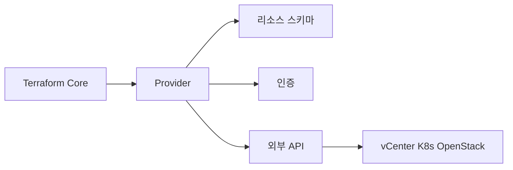
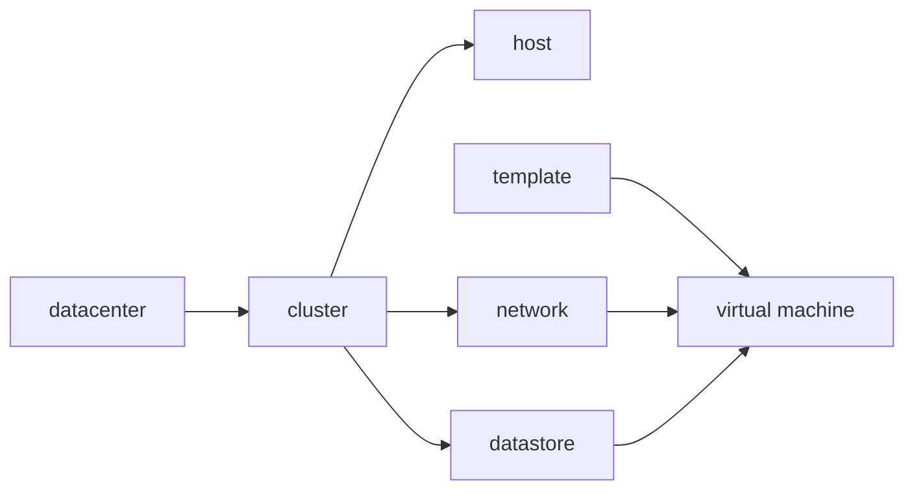

# Terraform Providers (온프레미스 중심)

> Terraform/OpenTofu의 **provider**는 외부 시스템 어댑터. 본 위키
> 카테고리(온프레미스 중심)에서 가장 많이 마주치는 provider:
> **vSphere·OpenStack·Kubernetes·Helm·외부 부속**(`local`, `tls`,
> `random`, `null`, `time`).
>
> 이 글은 provider 자체 동작·인증·버전 관리·온프레 운영 패턴에 집중.
> 클라우드 provider(AWS·Azure·GCP)는 본 위키 범위에서 제외.

- **전제**: [Terraform 기본](./terraform-basics.md), [Terraform 모듈
  ](./terraform-modules.md)
- **버전 일치 운영**(`.terraform.lock.hcl` 등)은 [Terraform 기본
  ](./terraform-basics.md#9-ci-표준-패턴)도 참조

---

## 1. Provider란

### 1.1 역할



| 책임 | 설명 |
|---|---|
| 리소스 스키마 정의 | `vsphere_virtual_machine` 같은 타입 |
| CRUD 호출 변환 | HCL → API 호출 |
| 인증·세션 관리 | 토큰 갱신, mTLS, kubeconfig |
| state 동기화 | API 응답을 schema에 맞게 정규화 |

Provider는 별도 binary (Go로 작성). Terraform Core와 gRPC로 통신.

### 1.2 Plugin Framework vs SDKv2

```text
SDKv2 (Legacy)              Plugin Framework (Modern)
└── 대부분 기존 provider    └── 신규·migration 진행 중
```

- **Plugin Framework** (HashiCorp 공식 권장): 타입 안전, 더 명확한
  스키마, 더 좋은 unknown 처리. **2024~2026 마이그레이션 가속**
- **SDKv2** (Legacy): 여전히 동작하지만 신규 기능은 Framework로 추가
- 사용자 시각에서 차이는 **schema 미세 변경**으로 표현됨 — provider
  major bump 시 호환성 가이드 확인

### 1.3 Provider 종류 분류

| 분류 | 예 | 메인테이너 |
|---|---|---|
| **Official** | aws, azurerm, google, kubernetes, helm | HashiCorp |
| **Partner** | vsphere(VMware), oracle, vault | 벤더 |
| **Community** | openstack, proxmox, nutanix | 커뮤니티 |
| **External** | datadog, github, pagerduty | 각 SaaS |

Registry에서 신뢰도 표시(공식·검증) 확인 가능.

---

## 2. Provider 선언·버전

### 2.1 표준 선언

```hcl
terraform {
  required_version = ">= 1.6.0"
  required_providers {
    vsphere = {
      source  = "vmware/vsphere"      # 2.6+ 부터 vmware/ 네임스페이스
      version = "~> 2.13"
    }
    openstack = {
      source  = "terraform-provider-openstack/openstack"
      version = "~> 3.2"
    }
    kubernetes = {
      source  = "hashicorp/kubernetes"
      version = "~> 3.0"   # 2.x → 3.x major (2026)
    }
    helm = {
      source  = "hashicorp/helm"
      version = "~> 3.0"   # 2.x → 3.x major
    }
  }
}
```

### 2.2 `.terraform.lock.hcl`

```hcl
provider "registry.terraform.io/hashicorp/kubernetes" {
  version     = "2.36.1"
  constraints = "~> 2.36"
  hashes = [
    "h1:abc...",
    "zh:def...",
  ]
}
```

- **반드시 commit**. CI에서 `init -lockfile=readonly`로 무결성 검증
- `terraform init -upgrade`로 lock 갱신 (의도적 업그레이드 시)
- multi-platform(macOS/Linux) 팀은 `terraform providers lock -platform=linux_amd64 -platform=darwin_arm64`로 모든 플랫폼 hash 포함

### 2.3 별칭 provider (multi-instance)

같은 provider의 여러 인스턴스 (예: 2개 vCenter, 2개 K8s):

```hcl
provider "vsphere" {
  alias                = "dc1"
  vsphere_server       = "vc-dc1.example.com"
  user                 = var.vsphere_user
  password             = var.vsphere_pass
  allow_unverified_ssl = false
}

provider "vsphere" {
  alias                = "dc2"
  vsphere_server       = "vc-dc2.example.com"
  user                 = var.vsphere_user
  password             = var.vsphere_pass
  allow_unverified_ssl = false
}

resource "vsphere_virtual_machine" "vm_dc1" {
  provider = vsphere.dc1
  # ...
}
```

별칭 provider는 모듈에 **자동 상속 안 됨**. `providers = {}` 매핑
필수 (→ [Terraform 모듈 §3.3](./terraform-modules.md)).

---

## 3. 인증 패턴

### 3.1 인증 우선순위

provider마다 다르지만 일반적으로:

1. provider block의 명시 인자 (절대 시크릿 평문 금지)
2. 환경 변수 (`VSPHERE_PASSWORD`, `OS_PASSWORD`, `KUBECONFIG`)
3. config 파일 (`~/.kube/config`, `~/.config/openstack/clouds.yaml`)
4. **dynamic credentials** (Vault, OIDC, SPIFFE)

### 3.2 시크릿을 코드 밖으로

| 방법 | 적용 | 평가 |
|---|---|---|
| 환경 변수 (`TF_VAR_xxx`) | 단순 | OK, CI에서 노출 위험 관리 |
| Vault dynamic secret | provider가 Vault에서 단발 시크릿 발급 | **권장** |
| `ephemeral` value (TF 1.10+) | state 미저장 시크릿 | provider가 `write_only` 인자 지원해야 진짜 차단 |
| OIDC + 워크로드 인증 | 클라우드는 표준, 온프레는 SPIFFE/SPIRE | 점진 표준화 |

상세는 → `security/`

### 3.3 sensitive 처리

```hcl
variable "vsphere_password" {
  type      = string
  sensitive = true
  ephemeral = true   # TF 1.10+: 변수 자체가 메모리에만
}
```

**3단계 차이**:

| 표기 | 도입 | 효과 |
|---|---|---|
| `sensitive = true` | TF 0.14+ | 출력 마스킹만. **state에는 평문** |
| `ephemeral = true` (변수) | TF 1.10+ | 변수가 메모리에만 — provider 인자에 들어가면 state로 흐름 |
| `*_wo` (write-only 인자) | **TF 1.11+** | provider 인자 자체를 state 미저장 — **진짜 영속화 차단** |

```hcl
# TF 1.11+ 진짜 영속화 차단
resource "aws_rds_cluster" "main" {
  master_password_wo         = var.db_password   # state 미저장
  master_password_wo_version = 1                 # 회전 트리거
}
```

provider가 `_wo` 인자를 노출해야 동작 — AWS·Azure·random 등 우선 지원.

---

## 4. vSphere Provider

### 4.1 기본

```hcl
provider "vsphere" {
  user                 = var.vsphere_user
  password             = var.vsphere_password
  vsphere_server       = "vcenter.example.com"
  allow_unverified_ssl = false   # prod
}
```

| 인자 | 비고 |
|---|---|
| `vsphere_server` | vCenter FQDN. ESXi 직접 접속 비권장 |
| `user` | `domain\username` 또는 `user@vsphere.local` |
| `allow_unverified_ssl` | **prod 절대 false**. self-signed면 CA 추가 |
| `vim_keep_alive` | 세션 keep-alive 간격(분), default 10 (최소 1) |

### 4.2 핵심 리소스



| 리소스·data | 용도 |
|---|---|
| `data.vsphere_datacenter` | DC 조회 |
| `data.vsphere_compute_cluster` | 클러스터 |
| `data.vsphere_datastore` | 데이터스토어 |
| `data.vsphere_network` | port group |
| `data.vsphere_virtual_machine` (template) | 템플릿 조회 |
| `vsphere_virtual_machine` | VM 생성 |
| `vsphere_folder` | 폴더 |
| `vsphere_resource_pool` | 리소스 풀 |
| `vsphere_distributed_virtual_switch` | dvSwitch |
| `vsphere_tag` / `vsphere_tag_category` | 태그 (자동화의 핵심) |

### 4.3 VM 생성 패턴

```hcl
resource "vsphere_virtual_machine" "web" {
  name             = "web-${count.index}"
  resource_pool_id = data.vsphere_compute_cluster.cl.resource_pool_id
  datastore_id     = data.vsphere_datastore.ds.id
  folder           = "infra/web"
  num_cpus         = 4
  memory           = 8192
  guest_id         = data.vsphere_virtual_machine.template.guest_id
  scsi_type        = data.vsphere_virtual_machine.template.scsi_type
  
  network_interface {
    network_id   = data.vsphere_network.app_pg.id
    adapter_type = "vmxnet3"
  }
  
  disk {
    label            = "disk0"
    size             = 50
    eagerly_scrub    = false
    thin_provisioned = false   # 스토리지 종류·정책에 맞춰 선택
    # vSAN: 보통 thin, storage policy로 관리
    # VMFS/NFS 전통: thick lazy zeroed가 일반 권장
  }
  
  clone {
    template_uuid = data.vsphere_virtual_machine.template.id
    customize {
      linux_options {
        host_name = "web-${count.index}"
        domain    = "internal.example.com"
      }
      network_interface {
        ipv4_address = "10.10.1.${10 + count.index}"
        ipv4_netmask = 24
      }
      ipv4_gateway = "10.10.1.1"
      dns_server_list = ["10.10.1.1", "10.10.1.2"]
    }
  }
  
  lifecycle {
    ignore_changes = [
      annotation,           # vCenter UI 변경 무시
      clone[0].template_uuid,  # template 업데이트 무시
    ]
  }
}
```

### 4.4 운영 주의

- **template 준비**: 부팅 후 IP 받을 수 있어야 customize 동작
- **disk provisioning**: 스토리지 종류·storage policy에 따라 다름.
  vSAN은 thin이 표준(policy로 제어), VMFS/NFS는 prod에 thick lazy zeroed가 일반 권장. 일률 답 없음
- **vSphere version 호환**: provider별 [공식 호환성 매트릭스](https://github.com/vmware/terraform-provider-vsphere/blob/main/CHANGELOG.md)
  확인 필수 — 일반론은 위험, 마이너 버전 단위로 명시됨
- **VM Tools 필수**: customize 동작 전제. cloud-init 가능한 OS는 cloud-init도 옵션
- **권한**: Terraform 전용 vCenter user에 minimum role 부여 (Inventory, Datastore, Network 각 권한 매트릭스)
- **drift 빈번**: vCenter UI에서 메모리·CPU·태그 변경이 일상 — `lifecycle.ignore_changes`로 의도된 무시 명시

### 4.5 한계·대안

- **VMware의 license/소유권 변동**(2024-2025 Broadcom 인수)으로
  provider 미래에 영향 — partner provider이지만 OSS 라이선스 유지 중
- **kubevirt·Proxmox**: vSphere 대안 검토 시 `kubevirt`/`proxmox` provider
- **OpenStack 마이그레이션**: VM 운영을 OpenStack으로 옮기는 경우

---

## 5. OpenStack Provider

### 5.1 기본

```hcl
terraform {
  required_providers {
    openstack = {
      source  = "terraform-provider-openstack/openstack"
      version = "~> 3.2"
    }
  }
}

# 1. clouds.yaml 사용 (권장)
provider "openstack" {
  cloud = "myorg-prod"
}

# 또는 2. 명시
provider "openstack" {
  user_name   = var.os_user
  password    = var.os_password
  tenant_name = var.os_tenant
  domain_name = var.os_domain
  auth_url    = "https://keystone.example.com:5000/v3"
  region      = "RegionOne"
}
```

`clouds.yaml` 표준 위치: `~/.config/openstack/clouds.yaml` 또는
`OS_CLIENT_CONFIG_FILE` 환경 변수.

### 5.2 핵심 리소스

| 리소스 | 서비스 | 용도 |
|---|---|---|
| `openstack_compute_instance_v2` | Nova | VM |
| `openstack_compute_keypair_v2` | Nova | SSH key |
| `openstack_networking_network_v2` | Neutron | 가상 네트워크 |
| `openstack_networking_subnet_v2` | Neutron | 서브넷 |
| `openstack_networking_router_v2` | Neutron | 라우터 |
| `openstack_networking_port_v2` | Neutron | port (고정 IP·SG) |
| `openstack_networking_secgroup_v2` | Neutron | 보안 그룹 |
| `openstack_blockstorage_volume_v3` | Cinder | 볼륨 |
| `openstack_objectstorage_container_v1` | Swift | 객체 저장 |
| `openstack_images_image_v2` | Glance | 이미지 |
| `openstack_lb_loadbalancer_v2` | Octavia | LB |
| `openstack_dns_zone_v2` | Designate | DNS |
| `openstack_identity_user_v3` | Keystone | 사용자 |

### 5.3 VM 생성 패턴

```hcl
resource "openstack_compute_instance_v2" "web" {
  name              = "web-${count.index}"
  image_name        = "ubuntu-22.04"
  flavor_name       = "m1.medium"
  key_pair          = openstack_compute_keypair_v2.deploy.name
  security_groups   = [openstack_networking_secgroup_v2.web.name]
  availability_zone = "nova"
  
  network {
    port = openstack_networking_port_v2.web[count.index].id
  }
  
  user_data = file("cloud-init.yaml")  # cloud-init
  
  metadata = {
    role = "web"
    env  = var.env
  }
}
```

### 5.4 운영 주의

- **Magnum**(Kubernetes-as-a-Service) provider 통합: K8s cluster를 OpenStack 관리하 사용
- **드리프트**: Horizon 콘솔 변경이 흔함 — 콘솔 write 차단 IAM 검토
- **Tag 표준**: AWS와 달리 metadata는 key-value 자유 — 사내 표준 강제(OPA)
- **Octavia LB**의 health monitor·SG 의존성: 삭제 순서 함정 빈번

---

## 6. Kubernetes Provider

### 6.1 기본 — 인증 4가지

```hcl
# A. KUBECONFIG 파일
provider "kubernetes" {
  config_path = "~/.kube/config"
}

# B. exec plugin (EKS·GKE·AKS 토큰 동적)
provider "kubernetes" {
  host                   = data.aws_eks_cluster.main.endpoint
  cluster_ca_certificate = base64decode(data.aws_eks_cluster.main.certificate_authority[0].data)
  exec {
    api_version = "client.authentication.k8s.io/v1beta1"
    args        = ["eks", "get-token", "--cluster-name", "main"]
    command     = "aws"
  }
}

# C. token 직접
provider "kubernetes" {
  host  = "https://k8s.example.com:6443"
  token = var.k8s_token
  cluster_ca_certificate = file("ca.crt")
}

# D. 사용자/패스워드 (사실상 사용 금지)
# K8s 1.19+에서 basic auth 제거. provider 인자는 일부 레거시
# webhook 호환을 위해 남아 있을 뿐 표준 K8s API에선 동작 안 함
```

**인증 안티패턴**: cluster 생성과 동일 root에서 hardcoded token 사용
→ 토큰 만료 후 plan 실패. EKS의 `aws_eks_cluster_auth` data source는
**최대 15분 토큰**이라 nightly job에서 만료. **`exec` provider auth가 표준** —
단, plan 시작과 apply 도중에 토큰이 끊기는 long-running plan은 여전히
함정이므로 large stack은 분할이 안전.

### 6.2 manifest vs typed resource

```hcl
# 1. typed resource (스키마 검증, deprecated 경고 가능)
resource "kubernetes_deployment" "app" {
  metadata { name = "app" }
  spec {
    replicas = 3
    # ...
  }
}

# 2. raw manifest (어떤 K8s 자원이든)
resource "kubernetes_manifest" "crd_resource" {
  manifest = yamldecode(file("istio-vs.yaml"))
}
```

| 패턴 | 장점 | 한계 |
|---|---|---|
| typed | 스키마 검증, IDE 자동완성 | provider 업데이트 lag |
| `kubernetes_manifest` | 모든 CRD 지원 | dry-run에 cluster 접근 필요(plan 시) |

### 6.3 plan 시 cluster 접근 제약

`kubernetes_manifest`는 **plan 단계에서 cluster에 접근**해 schema
검증 (`server-side apply` dry-run). cluster가 없으면 plan 실패 →
부트스트랩(cluster 생성과 동시 K8s 자원 배포)이 안 된다.

**해결**:
- cluster 생성 모듈과 K8s 자원 모듈 **분리** (state 2개) — **권장**
- 동일 root이면 `alekc/kubectl` provider (커뮤니티) 사용 — server-side
  validation 없이 텍스트 apply.
  - ⚠ 인기 있던 `gavinbunney/kubectl`은 메인테인 정체. **`alekc/kubectl`**
    포크가 활발 (2024-2025+). 부트스트랩 핵심 의존이므로 출처 확인
- `kubernetes_manifest`의 `computed_fields` 옵션으로 plan 시 cluster
  의존을 부분 완화 가능

### 6.4 HCL ↔ YAML 변환

```hcl
# YAML 파일을 그대로 적용
resource "kubernetes_manifest" "configmap" {
  manifest = yamldecode(templatefile("cm.yaml.tpl", {
    env = var.env
  }))
}
```

대규모 manifest는 **GitOps**(ArgoCD/Flux) 권장. Terraform은
부트스트랩(controller·CRD)에 집중하고 app 자원은 GitOps로 위임이 표준.

---

## 7. Helm Provider

### 7.1 기본

```hcl
provider "helm" {
  kubernetes {
    config_path = "~/.kube/config"
  }
}

resource "helm_release" "argo_cd" {
  name       = "argo-cd"
  namespace  = "argocd"
  repository = "https://argoproj.github.io/argo-helm"
  chart      = "argo-cd"
  version    = "7.6.0"
  
  create_namespace = true
  atomic           = true   # 실패 시 자동 rollback
  cleanup_on_fail  = true
  wait             = true
  timeout          = 600
  
  values = [
    file("values/argo-cd.yaml"),
    yamlencode({
      server = { service = { type = "LoadBalancer" } }
    }),
  ]
}
```

### 7.2 v3.0 메이저 변경 (2026)

`hashicorp/helm` provider **v3.0**은 SDKv2 → **Plugin Framework**로
migration. 주요 영향:

| 변경 | 영향 |
|---|---|
| `kubernetes` block → 단일 nested object | 호출자 schema 변경 |
| `set`, `set_list`, `set_sensitive` → list of nested objects | 인자 표기 변경 |
| `experiments` block → list | manifest 검증 등 |
| Plugin Protocol Version 6 | TF 1.0+ 필요 |
| state `cannot decode state` 에러 사례 보고 | 업그레이드 전 staging 검증 필수 |

**Before (v2) vs After (v3) 표기**:

```hcl
# v2 (block 형태)
provider "helm" {
  kubernetes {
    config_path = "~/.kube/config"
  }
}

resource "helm_release" "x" {
  name       = "x"
  chart      = "x"
  set { name = "image.tag", value = "1.0" }
  set { name = "replicas", value = "3"   }
}
```

```hcl
# v3 (single nested object + list)
provider "helm" {
  kubernetes = {
    config_path = "~/.kube/config"
  }
}

resource "helm_release" "x" {
  name  = "x"
  chart = "x"
  set = [
    { name = "image.tag", value = "1.0" },
    { name = "replicas",  value = "3"   },
  ]
}
```

**업그레이드 권장 절차**:
1. staging에서 v3.0으로 init·plan
2. plan diff 검토 (대개 schema migration으로 인한 in-place 변경)
3. issue tracker 확인 (v3 초기에 state corruption 사례 있음)
4. v2.x로 pin 유지가 필요한 환경은 시급하지 않음

### 7.3 운영 주의

- **`atomic + cleanup_on_fail`**: 부분 install 잔류 방지
- **`wait`** (default `true`): readiness 대기. `atomic = true`는 wait를
  강제 — 동시 명시는 불필요. **함정**: `atomic + 짧은 timeout`은
  every-time rollback. 서비스 startup이 긴 chart(DB·Operator)는
  `timeout`을 충분히(600~1800)
- **values 분리**: file + yamlencode 조합으로 환경별 분기
- **chart version pin**: `version = "7.6.0"` 정확 고정 (chart도 module과 같은 공급망)
- **의존성 순서**: namespace → CRD → operator → 사용처. CRD가 늦게
  생기면 consumer plan에서 unknown 에러
- **GitOps와의 분담**: Helm provider로 부트스트랩, app 자원은 ArgoCD/Flux

---

## 8. 외부 부속 Provider

### 8.1 일상적인 helper

| Provider | 용도 |
|---|---|
| `hashicorp/local` | 로컬 파일 read·write |
| `hashicorp/random` | 랜덤 값 (suffix, password 자리표시) |
| `hashicorp/tls` | private key·cert 생성 |
| `hashicorp/null` | (deprecated) `terraform_data`로 대체 |
| `hashicorp/time` | sleep·rotation 트리거 |
| `hashicorp/external` | 외부 명령 실행 (data source) |
| `cloudflare/cloudflare` | DNS·CDN |

### 8.2 안티패턴 — local-exec 의존

```hcl
# 안티
resource "null_resource" "run_script" {
  provisioner "local-exec" {
    command = "scripts/post.sh"
  }
}

# 권장: 필요하면 명령형 부분을 외부 도구로 분리
# 예: Ansible playbook을 별도 호출, ArgoCD로 K8s 자원 위임
```

`provisioner`는 **Terraform의 선언형 모델을 깨뜨리는 escape hatch**.
사용 시 PR 리뷰에서 명시 합의 필요.

### 8.3 `random` 활용 — 주의

```hcl
resource "random_password" "db" {
  length  = 32
  special = true
  
  keepers = {
    rotate_at = var.rotate_timestamp   # 이 값 변경 시 새로 생성
  }
}
```

**위험**: `random_*` 결과는 **state에 저장**. 진짜 시크릿은 Vault
dynamic secret으로 — `random_password`는 일회성 placeholder 또는
non-sensitive 식별자 정도.

---

## 9. Provider 운영

### 9.1 버전 업그레이드

```bash
# 1. 의존성 확인
terraform providers
terraform version

# 2. 안전한 업그레이드 절차
git checkout -b chore/upgrade-providers
terraform init -upgrade
terraform plan
# diff 면밀 검토 → schema migration 변경만 있으면 OK
git commit -am "chore: upgrade providers"

# 3. staging 1회 apply 검증 후 prod
```

### 9.2 EOL·migration

- vSphere → kubevirt/proxmox: VM 자원 모델 차이로 1:1 변환 어려움.
  서비스 재설계 동반
- **`hashicorp/helm` provider v2 → v3** (2026): Plugin Framework 전환,
  `set`/`kubernetes` schema 변경 (§7.2)
- Helm CLI v2 → v3은 별개(2020년 완료) — provider 버전과 혼동 금지
- `null_resource` → `terraform_data` (TF 1.4+): `moved` 블록으로 흡수

### 9.3 Provider 미러·캐시

폐쇄망/대역 절약 시 provider mirror 사용:

```hcl
# .terraformrc
provider_installation {
  filesystem_mirror {
    path    = "/opt/terraform-mirror"
    include = ["registry.terraform.io/*/*"]
  }
  direct {
    exclude = ["registry.terraform.io/*/*"]
  }
}
```

`terraform providers mirror /opt/terraform-mirror`로 binary 캐시.

### 9.4 여러 provider의 호출 순서

Terraform Core는 자동 의존성 그래프 계산. 그러나:
- `kubernetes_manifest`가 cluster 생성과 같은 root에 있으면 **plan 단계에서
  cluster API 호출** → 첫 plan 실패
- helm provider가 cluster output에 의존 + chart에 cluster API 검증이
  필요하면 동일 함정

**원칙**: cluster·platform 자원과 그 위 자원은 **state 분리** (→
[Terraform State §2.3](./terraform-state.md))

---

## 10. 안티패턴

| 안티패턴 | 왜 문제 | 교정 |
|---|---|---|
| provider block을 자식 모듈에 선언 | multi-instance 불가 | `configuration_aliases` |
| `allow_unverified_ssl = true` prod | MITM 노출 | private CA 추가, 검증 강제 |
| 하드코딩 시크릿 평문 | git 유출, state 평문 | env var, Vault, ephemeral |
| EKS 토큰 1시간 직접 사용 | 만료 후 plan 실패 | `exec` provider auth |
| `kubernetes_manifest` + cluster 생성 같은 root | 첫 plan 실패 | state 분리 |
| `helm_release` chart version 미고정 | 자동 업그레이드로 깨짐 | `version = "X.Y.Z"` |
| `null_resource` + `local-exec` 다용 | 재현성 파괴 | provider·도구 분리 |
| Helm v2 → v3 업그레이드를 prod에서 무검증 | state corruption 사례 | staging 검증 |
| vSphere `lifecycle` 설정 없이 콘솔 변경 흡수 안 함 | 매 plan diff | `ignore_changes` 명시 |
| `clouds.yaml`에 password를 평문 commit | 시크릿 유출 | non-secret 부분만 템플릿 commit, password는 Vault·env var |
| provider lock 파일 미커밋 | 매 init마다 다른 binary | commit + `init -lockfile=readonly` |
| 한 root에 6개 이상 provider | plan 시간 폭증, debug 곤란 | layer로 분리 |
| `random_password` 결과를 시크릿으로 그대로 사용 | state 평문 | Vault dynamic |
| Multi-platform 팀에서 lock에 OS 1개만 hash | 다른 OS init 실패 | `terraform providers lock -platform=...` |

---

## 11. 도입 로드맵

1. **단일 provider로 시작** — vSphere or OpenStack
2. **`clouds.yaml` / KUBECONFIG / `VSPHERE_*` 환경 변수로 인증 분리**
3. **provider version pin + lock commit**
4. **lifecycle.ignore_changes**로 콘솔 드리프트 명시 무시
5. **별칭 provider** — multi-DC, multi-cluster
6. **Vault dynamic secrets**로 인증 자동 갱신
7. **state 분리** — 부트스트랩(cluster) vs 워크로드
8. **GitOps와의 분담** — Helm은 부트스트랩만, app은 ArgoCD/Flux
9. **provider mirror** — 폐쇄망/대역 절약
10. **`exec` provider auth로 동적 토큰**

---

## 12. 관련 문서

- [Terraform 기본](./terraform-basics.md) — provider 선언 기초
- [Terraform 모듈](./terraform-modules.md) — `configuration_aliases`
- [Terraform State](./terraform-state.md) — multi-provider state 분할
- [OpenTofu vs Terraform](./opentofu-vs-terraform.md) — registry·provider 호환
- [Crossplane](../k8s-native/crossplane.md) — K8s-native IaC 대안

---

## 참고 자료

- [Terraform Registry: vsphere](https://registry.terraform.io/providers/vmware/vsphere/latest) — 확인: 2026-04-25
- [Terraform Registry: openstack](https://registry.terraform.io/providers/terraform-provider-openstack/openstack/latest) — 확인: 2026-04-25
- [Terraform Registry: kubernetes](https://registry.terraform.io/providers/hashicorp/kubernetes/latest) — 확인: 2026-04-25
- [Helm Provider v3 Upgrade Guide](https://registry.terraform.io/providers/hashicorp/helm/latest/docs/guides/v3-upgrade-guide) — 확인: 2026-04-25
- [Plugin Framework vs SDKv2](https://developer.hashicorp.com/terraform/plugin/framework-benefits) — 확인: 2026-04-25
- [Terraform: provider mirror](https://developer.hashicorp.com/terraform/cli/config/config-file#provider-installation) — 확인: 2026-04-25
- [Terraform: providers lock command](https://developer.hashicorp.com/terraform/cli/commands/providers/lock) — 확인: 2026-04-25
- [OpenStack clouds.yaml 표준](https://docs.openstack.org/openstacksdk/latest/user/config/configuration.html) — 확인: 2026-04-25
- [HashiCorp: Helm provider 3.0 release](https://github.com/hashicorp/terraform-provider-helm/releases) — 확인: 2026-04-25
- [VMware vSphere Provider GitHub](https://github.com/vmware/terraform-provider-vsphere) — 확인: 2026-04-25
