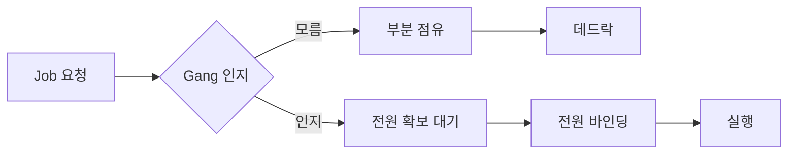
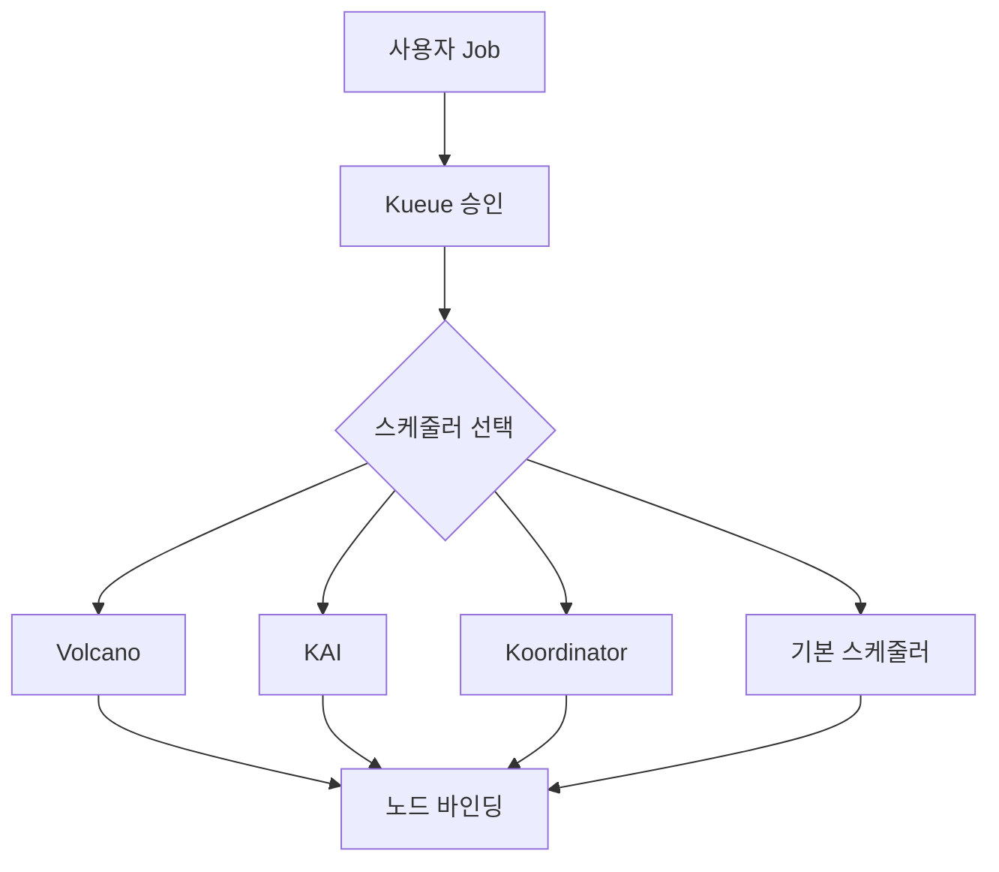

# AI 워크로드 스케줄링 — Volcano, KAI, Koordinator, Kueue

> AI 워크로드의 스케줄링 난이도는 **일반 앱과 근본적으로 다르다**. 학습은
> 전원이 동시에 떠야 한 걸음을 걷고(Gang), 고성능은 NVLink 도메인 안에
> 들어있어야 의미가 있고(Topology), 추론은 KV 캐시까지 본 뒤에야 올바른
> 레플리카로 요청이 간다(L7 routing). 본 문서는 이 3축의 표준 스택과
> **Volcano·KAI·Koordinator·Kueue**의 역할·선택 기준을 정리한다.

- **1.35 Workload API** — 업스트림 Gang Scheduling 알파, 구조적 전환점
- **Volcano·KAI·Koordinator** — Secondary scheduler 3인방, 축이 다르다
- **Kueue + TAS** — 표준 큐잉·토폴로지 스택, 메인스트림 선택지
- **InferencePool v1 GA** — 추론은 L4가 아니라 L7 라우팅

선행: [Scheduler 내부](../scheduling/scheduler-internals.md),
[Priority·Preemption](../scheduling/priority-preemption.md),
[Topology Spread](../scheduling/topology-spread.md),
[GPU 스케줄링](../special-workloads/gpu-scheduling.md),
[배치 워크로드 — Kueue·JobSet](../special-workloads/batch-workload.md).

관련: 리소스 표현은 [DRA](./dra.md), 분산 학습·멀티노드 추론 토폴로지는
[LWS·JobSet](./lws-jobset.md).

---

## 1. 왜 AI는 기본 스케줄러로 부족한가

기본 `kube-scheduler`는 파드 하나를 개별 단위로 본다. AI 워크로드는 그 전제가
깨진다.

| 요구 | 일반 앱 | AI 워크로드 |
|---|---|---|
| 실행 단위 | 파드 1개 | 수십~수천 파드 **동시** 시작 (Gang) |
| 배치 기준 | 자원 충족 | 자원 + **토폴로지** (NVLink·PCIe·IB) |
| 실패 처리 | 개별 재시작 | **전체 롤백**, 체크포인트 복원 |
| 공유 자원 | CPU·메모리 | **GPU** (고가·희소·정수) |
| SLA | p99 지연 | 학습 처리량, **추론 TTFT·TPOT** |
| 큐잉 | 필요 없음 | **팀별 쿼터**, 공정 공유, 선점 |

"파드가 두 개만 떠도 쓸모없는" 분산 학습은 **Gang scheduling**이 없으면 자원을
부분 점유한 채 데드락에 빠진다. 2×8 = 16장의 H100이 필요한 Job이 15장만
확보하고 한 장을 기다리면, 그 15장은 아무 일도 못 하면서 다른 Job의 진입도
막는다. 이게 **partial scheduling deadlock**이다.



---

## 2. 1.35 Workload API — 전환점

2025-12 릴리스된 Kubernetes v1.35는 **Gang Scheduling을 업스트림에 알파로
도입**했다. KEP-4671 "Gang Scheduling using Workload Object"의 1차 구현.

| 항목 | 내용 |
|---|---|
| API 그룹 | `scheduling.k8s.io/v1alpha1` |
| 리소스 | `Workload` (minCount, podSets) |
| 플러그인 | `GangScheduling` (PreEnqueue·Permit 훅) |
| 피처 게이트 | `GenericWorkload`, `GangScheduling` (기본 비활성) |
| 동작 | minCount 만큼 배치 가능하면 일괄 바인딩, 부족하면 전원 unschedulable 큐 |
| 1.36 이후 | `Workload`를 정책, `PodGroup`을 런타임 그루핑으로 분리 예정 |

```yaml
apiVersion: scheduling.k8s.io/v1alpha1
kind: Workload
metadata:
  name: llama-pretrain
spec:
  podSets:
    - name: workers
      count: 8
      minCount: 8      # all-or-nothing
      template:
        spec:
          containers:
            - name: trainer
              image: nvcr.io/nvidia/pytorch:24.12-py3
              resources:
                limits:
                  nvidia.com/gpu: 8
```

**해석**: 장기적으로 Gang·Fair-share·Topology가 업스트림으로 흡수되는
흐름의 시작. 그러나 **2026년 4월 현재 알파**다. 프로덕션에서는 여전히
Volcano·KAI·Kueue+Coscheduling 조합이 현실 해답.

**운영 주의**: 알파는 피처 게이트를 꺼 두는 것이 안전하다. 파일럿은 전용
테스트 클러스터에서만. 1.36·1.37 흐름을 본 뒤 베타 이상에서 이관 검토가
합리적.

---

## 3. 스케줄러 배치 패턴 — 보완형 vs 교체형

K8s에서 다른 스케줄러를 붙이는 방법은 세 가지다. **구조가 다르면 운영이
다르다**.

| 패턴 | 방식 | 파드 라우팅 | 장점 | 단점 |
|---|---|---|---|---|
| **다중 프로파일** | 기본 스케줄러의 `KubeSchedulerConfiguration`에 프로파일 여러 개 | `schedulerName: <profile>` | 레이스 없음, 단일 프로세스 | 고급 기능 한계 |
| **보완형** (Kueue) | 큐잉·승인만 Kueue, 실제 바인딩은 기본 스케줄러 | `schedulerName: default` | 점진 도입, K8s-native | 강한 토폴로지는 TAS에 한정 |
| **교체형** (Volcano·KAI·Koordinator) | 별도 스케줄러 프로세스, 파드 라우팅 | `schedulerName: volcano` 등 | 고급 기능 전부 | **멀티 스케줄러 충돌 가능** |

### 멀티 스케줄러 충돌

같은 노드를 두 스케줄러가 동시에 본다면, 한 쪽이 파드를 바인딩하는 사이
다른 쪽이 같은 노드의 자원을 다른 파드에 배정할 수 있다. kubelet에서 자원
부족으로 실패·재스케줄이 일어나면서 **플래핑**이 발생한다.

**표준 대응**:
- GPU 노드에 `scheduler=volcano:NoSchedule` 같은 테인트로 **노드 서브셋 분리**
- 또는 단일 프로세스의 **다중 프로파일**로 통합
- 프로덕션에선 절대 "아무 스케줄러나 집는 파드" 상태를 두지 않는다

---

## 4. 생태계 비교 — Volcano, KAI, Koordinator, Kueue



| 항목 | Volcano v1.14 | KAI Scheduler | Koordinator v1.7 | Kueue v0.14 | 1.35 기본 |
|---|---|---|---|---|---|
| CNCF | Incubating | Sandbox (2025) | Sandbox | SIG-Batch | Core |
| 역할 | 교체형 | 교체형 | 교체형 | 보완형 | Native |
| Gang | PodGroup, MinMember | Podgrouper 내장 | PodGroup | Coscheduling 연동 | Alpha |
| Fair-share | Queue·Capacity | **2단계 계층 큐** | Elastic Quota | ClusterQueue·Cohort | 없음 |
| 토폴로지 | **HyperNode** CRD | 노드·랙·존 | Network-Topology | **TAS 3레이어** | 미지원 |
| 선점 | Queue·Priority | Consolidation+선점 | **Job-Level 선점** | ClusterQueue 경계 | Workload-Aware Alpha |
| GPU 공유 | MIG·Dynamic MIG | Fraction·Reservation | Device Share | DRA 경유 | DRA |
| DRA | 지원 | 지원 | 지원 | 지원 | Core |
| 주 사용처 | 화웨이, 빅데이터+AI | NVIDIA DGX·Run:ai | Alibaba colocation | GKE·OpenShift | - |

### 4.1 Volcano — AI-Native Unified 플랫폼

2026-03 릴리스된 **v1.14**에서 "배치 스케줄러"에서 "AI-Native 통합 스케줄링
플랫폼"으로 리포지셔닝. 한 클러스터에 **학습·추론·RL·에이전트 워크로드**를
동시에 싣는 것을 목표로 한다.

| 기능 | 역할 |
|---|---|
| **Sharding Controller** | 리소스 풀을 Batch·Agent 등으로 실시간 분할 |
| **Agent Scheduler** (Alpha) | 수명 짧고 지연 민감한 에이전트용 고속 경로 |
| **HyperNode** CRD | 네트워크 토폴로지를 라벨 대신 리소스로 표현 |
| **SubGroup** 정책 | Job 내부의 논리 그룹에 각자 Gang·Topology 적용 |
| **Dynamic MIG** | MIG 프로파일을 요청 시점에 동적 생성 |
| **Volcano Global** | 멀티클러스터 스케줄링 |

```yaml
apiVersion: scheduling.volcano.sh/v1beta1
kind: PodGroup
metadata:
  name: mpi-train
spec:
  minMember: 16
  minResources:
    nvidia.com/gpu: "128"
  queue: research
  priorityClassName: high
```

**선택 이유**: Gang·큐·토폴로지를 **스케줄러 한 프로세스**가 모두 처리한다.
Kueue 없이도 완결. MPI·PyTorch Operator·Ray·Spark 통합이 성숙.

### 4.2 KAI Scheduler — NVIDIA 오픈소스

Run:ai의 코어 스케줄링 엔진이 NVIDIA 인수 후 Apache 2.0으로 공개되어
**2025년 후반 CNCF Sandbox**에 수락됐다. 저장소는
`github.com/NVIDIA/KAI-Scheduler`.

| 기능 | 역할 |
|---|---|
| **2단계 Hierarchical Queue** | 부서→팀 형태의 계층 공정 공유 |
| Consolidation | 조각난 GPU를 재배치해 큰 요청 수용 |
| Bin-packing·Spread | 워크로드별 배치 스타일 |
| Podgrouper | Gang 자동 구성 (사용자가 PodGroup 직접 작성 불필요) |
| GPU Fraction·Reservation | 소수 GPU 요청, 장기 예약 |

**주의**: "Run:ai 상용 = KAI Scheduler"가 아니다. 공개된 것은 **스케줄링
엔진만**이며 UI·멀티클러스터 관리·과금 등 엔터프라이즈 레이어는 상용에
잔류.

### 4.3 Koordinator — Job-Level 선점의 대표

Alibaba 발 colocation/QoS 스케줄러. v1.7(2026)에서 **Job-Level Preemption**을
도입 — 학습 Job의 파드를 **묶어서 한 번에 선점**한다. 한두 파드만 쫓겨나는
상황으로 학습이 반복 실패하는 패턴을 차단.

| 기능 | 역할 |
|---|---|
| Colocation | LS(Latency Sensitive)와 BE(Best Effort) 동일 노드 공존 |
| QoS 클래스 | `koordinator.sh/qosClass` 기반 자원 격리 |
| Elastic Quota | 미사용 쿼터를 다른 팀이 탄력적으로 사용 |
| Network-Topology | 토폴로지 인지 Gang |
| **Job-Level 선점** | 학습 Job 단위의 원자적 선점 |

### 4.4 Kueue — 표준 큐잉 스택

SIG-Batch 프로젝트. **큐·쿼터·승인**을 담당하고 실제 스케줄링은 기본
스케줄러에 맡긴다. 2026년 v0.14 계열에서 **TAS가 GA**에 근접.

| 기능 | 역할 |
|---|---|
| **ClusterQueue·LocalQueue** | 팀·네임스페이스별 큐 |
| **Cohort** | 미사용 쿼터 공유 단위 |
| **ResourceFlavor** | 하드웨어 등급(예: H100·A100) 분리 |
| **TAS** | Topology 인지 배치 (3레이어까지) |
| **Provisioning Request** | Cluster Autoscaler 연계, 노드 on-demand |
| **AdmissionCheck** | Volcano·KAI와의 브리지 |

**포지션**: "스케줄러를 바꾸지 않고" AI 큐잉을 시작할 때 첫 선택.
Kubeflow Training Operator, LeaderWorkerSet도 Kueue와 직접 연동.

---

## 5. Topology-Aware Scheduling (TAS) 심화

AI 학습 성능의 **절반 이상**이 노드 간 통신 속도에서 나온다. 같은 NVLink
도메인(또는 같은 스위치, 같은 랙)에 묶여야 All-Reduce가 빠르다. TAS는 이를
스케줄러에 알리는 표준 방식이다.

### 5.1 토폴로지 라벨 계층

| 레이어 | 라벨 | 의미 |
|---|---|---|
| L1 — 블록 | `topology.k8s.io/block` (Kueue) | 스위치·랙 단위 |
| L2 — 존 | `topology.kubernetes.io/zone` | 가용 영역 (온프레미스: 데이터홀) |
| L3 — 노드 | `kubernetes.io/hostname` | 물리 노드 |
| NVLink | `nvidia.com/gpu.clique`, `nvidia.com/mnnvl.domain` | NVL72 같은 고속 도메인 |

### 5.2 Kueue TAS와 본 글의 관심사

Kueue의 `Topology`·`ResourceFlavor`·`podset-required-topology` 어노테이션
기본 사용법은 [배치 워크로드 §6 TAS](../special-workloads/batch-workload.md)
에서 다룬다. API 버전은 `kueue.x-k8s.io/v1beta2`가 현재 표준
(`v1beta1`은 deprecated).

**이 글의 관심사**는 그 위에서 AI 특화로 더 나가는 두 축 —
**ComputeDomain**(MNNVL·NVL72)과 **스케줄러 교체형**에서의 토폴로지
처리다.

### 5.3 ComputeDomain — MNNVL·NVL72의 1급 표현

NVIDIA GB200 NVL72는 **최대 72 GPU가 단일 NVLink 도메인**을 이룬다. 이를
노드 라벨로만 표현하면 운영이 취약하다. DRA의 **ComputeDomain** 리소스가
이 도메인을 네이티브로 모델링하고, 스케줄러는 "파드의 ResourceClaim을
한 ComputeDomain 안에서 배치"하도록 동작한다.

| 속성 | 의미 |
|---|---|
| elasticity | 워크로드와 함께 확장·축소 |
| fault tolerance | 노드 손실 시 자동 복구 |
| IMEX 관리 | NVLink IMEX 도메인의 수명 주기 |

**스케줄링 관점의 핵심**: 토폴로지 단위가 **파드가 아니라 도메인**이 된다.
DRA 상세는 [DRA — Dynamic Resource Allocation](./dra.md) 참조.

---

## 6. 추론 워크로드 스케줄링 — InferencePool v1

추론은 **L4 로드밸런싱으로 풀기 어렵다**. 같은 모델 레플리카라도 KV 캐시
점유·큐 길이·활성 LoRA가 달라 최적 대상이 실시간으로 바뀐다. Gateway API
Inference Extension이 이 문제를 풀기 위한 표준.

### 6.1 리소스 모델

| 리소스 | 소유 | 의미 |
|---|---|---|
| `InferencePool` (v1 GA, 2026-02) | 플랫폼 관리자 | 같은 모델·가속기·서버 조합의 파드 집합 |
| `InferenceModel` | AI 엔지니어 | 논리 모델 엔드포인트 (향후 변경 가능) |
| **Endpoint Picker (EPP)** | 확장 프로세스 | KV 캐시·큐·LoRA 보고 레플리카 선택 |

```yaml
apiVersion: inference.networking.k8s.io/v1
kind: InferencePool
metadata:
  name: llama-70b-pool
spec:
  targetPortNumber: 8000
  selector:
    app: vllm-llama-70b
  extensionRef:
    name: endpoint-picker
```

**참고**: GAMMA(Service Mesh용 Gateway API 확장)와 **다른 프로젝트**다.
이름이 비슷해 혼동되지만 Inference Extension은 독립 sub-project로 2026-02
v1.3.1에서 GA. Istio 1.28에서 풀 서포트.

### 6.2 라우팅 시그널

| 시그널 | 의미 | 영향 |
|---|---|---|
| KV 캐시 이용률 | HBM 점유율 | 높으면 새 요청 회피 |
| Pending queue | 서버 큐 길이 | 지연의 선행 지표 |
| Active LoRA | 장착된 LoRA 어댑터 | 어댑터 스와핑 비용 회피 |
| Request cost | 토큰 수·컨텍스트 길이 | Cost-aware 분배 |

### 6.3 로드맵 (참고)

- **Prefix-cache aware LB** — 원격 KV 캐시를 고려한 라우팅
- **Heterogeneous accelerator** — 지연·비용 관점 이기종 선택
- **Disaggregated serving** — Prefill·Decode 분리 풀
- **llm-d** (CNCF Sandbox, 2026-03) — 위 개념의 레퍼런스 구현

멀티노드 추론(vLLM·SGLang·TensorRT-LLM)의 파드 구조는
[LWS·JobSet](./lws-jobset.md)에서 다룬다.

---

## 7. 스케줄링 관측 — 실패를 분류한다

AI 클러스터의 Pending은 원인이 여러 개다. 구분하지 않고 "자원 부족"으로
묶으면 용량 계획이 틀어진다.

| 증상 | 원인 분류 | 진단 |
|---|---|---|
| `FailedScheduling: Insufficient nvidia.com/gpu` | 절대 부족 | `kube_node_status_allocatable{resource="nvidia.com/gpu"}` |
| 일부 파드만 `Pending`, 나머지 `ContainerCreating` | **Gang 실패** — 부분 점유 | `kubectl get podgroup`, Event `NotEnoughPods` |
| `nominatedNodeName` 있는데 바인딩 안 됨 | 선점 진행 중 | Event `PreemptionByScheduler` |
| 특정 토폴로지에서만 실패 | **TAS 제약** | Kueue Workload의 `TopologyAssignment` |
| 전체 스케줄링이 늦음 | 스케줄러 지연 | `scheduler_scheduling_attempt_duration_seconds` P99 |
| ResourceClaim 할당 실패 | DRA 드라이버 | `resourceclaim` Events |

### 7.1 필수 메트릭

| 메트릭 | 해석 |
|---|---|
| `scheduler_pending_pods{queue="unschedulable"}` | 스케줄러가 포기한 파드 수 |
| `scheduler_scheduling_attempt_duration_seconds` | P99가 튀면 플러그인 중 하나가 느림 |
| `scheduler_schedule_attempts_total{result="error"}` | 에러 비율, 드라이버 장애 선행 |
| Kueue `kueue_pending_workloads` | 승인 대기 워크로드 |
| Kueue `kueue_admission_wait_time_seconds` | 큐잉 → 승인 지연 |
| Volcano `volcano_queue_pod_group_count` | 큐별 PodGroup 상태 |

---

## 8. 의사결정 매트릭스

| 상황 | 추천 스택 |
|---|---|
| 단일 팀, 중소 GPU, 학습·추론 혼재 | 기본 스케줄러 + **Kueue + TAS** |
| 다팀·계층 쿼터 필수 | **Kueue**(Cohort 계층) 또는 **KAI** 2단계 큐 |
| MIG·GPU fraction 핵심, NVIDIA 스택 | **KAI Scheduler** + DRA |
| Ray·Spark·Flink + AI 혼재 | **Volcano** 또는 Apache YuniKorn |
| Job-Level 선점·Colocation 요구 | **Koordinator** v1.7+ |
| 추론 L7(KV 캐시 인지) | **InferencePool + EPP** (+ llm-d 검토) |
| 가볍게 Gang만 필요 | `scheduler-plugins` **Coscheduling** |
| 1.35 업스트림만 고집 | **Workload API** (알파, 테스트 한정) |

### 8.1 프레임워크·오퍼레이터 레이어

스케줄러 선택과 별개로, **Job을 만드는 상위 레이어**도 결정해야 한다.

| 프레임워크·오퍼레이터 | 역할 | 언제 |
|---|---|---|
| **Kubeflow Trainer v2** (TrainJob) | PyTorch·TensorFlow·JAX 등 선언적 학습 Job | 프레임워크 다양성·재현성·Kueue 승인 통합 |
| **MPI Operator** | 고전 MPI All-Reduce 기반 학습 | HPC 레거시·NCCL 세밀 튜닝, Volcano Gang과 상성 |
| **Ray + KubeRay** | Actor 모델 기반 분산 실행 (학습·RL·튜닝) | RLHF·HPO·스트리밍 전처리, 하이브리드 워크로드 |
| **JobSet** | 여러 역할의 Job 조합 (리더·워커·PS) | 멀티 슬라이스·다역할 학습, 낮은 수준 제어 |
| **LeaderWorkerSet** | 한 그룹 N파드(리더 1 + 워커 N-1) | 멀티노드 추론, TP/PP 토폴로지 고정 |
| Volcano Job | MPI·TF·PyTorch 내장 플러그인 | Volcano 스케줄러 전제 클러스터 |

**선택의 축**:
- 프레임워크 다양성이 관건 → **Kubeflow Trainer v2**
- NCCL·RDMA·MPI 세밀 제어 → **MPI Operator** + Volcano
- RL·HPO·데이터 전처리 혼재 → **Ray/KubeRay**
- 추론(멀티노드) → **LWS**
- 가장 낮은 수준 제어 → **JobSet** (`ai-ml/lws-jobset.md`에서 상세)

### 8.2 온프레미스 특화 고려

- **Volcano + Kueue 브리지**: Kueue의 AdmissionCheck로 조직 큐잉을 거치고,
  바인딩은 Volcano가 한다. 사내 다팀 GPU 공유의 현실적 타협점
- **GatewayClass는 Envoy Gateway·Istio·kgateway·NGINX Gateway Fabric** 중
  InferencePool v1을 지원하는 구현을 선택 (2026-04 기준 Istio 1.28이 선도)
- **NVIDIA DRA Driver + ComputeDomain**은 GB200 NVL72 랙을 도입한 경우만
  필수. 일반 HGX 서버는 노드 라벨 TAS로 충분

---

## 9. 운영 이슈

### 9.1 멀티 스케줄러 경계

```yaml
# GPU 노드를 Volcano 전용으로
kubectl taint nodes gpu-worker-01 scheduler=volcano:NoSchedule

# 워크로드
spec:
  schedulerName: volcano
  tolerations:
    - key: scheduler
      operator: Equal
      value: volcano
      effect: NoSchedule
```

기본 스케줄러와의 **배타 영역**을 만든다. 공유 영역(일반 워크로드 노드)에
실수로 `schedulerName: volcano`가 들어가면 Pending이 누적된다.

### 9.2 Gang × HPA의 충돌

HPA는 파드 단위 스케일을 전제한다. Gang은 그룹 단위다. 학습 Job에는 HPA를
쓰지 않고, 추론 서버에만 HPA를 사용한다.

**멀티노드 추론 원칙**: HPA가 건드리는 것은 **LWS 레플리카 수**(복제된
그룹 수)뿐이다. `groupSize`(한 그룹의 파드 수 = TP·PP 토폴로지)는 **고정**
한다. 그룹 내부 파드를 HPA가 임의로 늘리면 모델 병렬 구성이 깨져 추론이
불가능해진다. 상세는 [LWS·JobSet](./lws-jobset.md).

### 9.3 Priority 역전

높은 Priority 파드가 Gang 대기 중인 낮은 Priority PodGroup을 부분 선점하면,
낮은 쪽이 반복 실패한다. Volcano·KAI는 **Gang 의식 선점**(그룹 전체를 한 번에
쫓아내거나 아예 건드리지 않음)이 있다. 기본 스케줄러는 1.35 Workload-Aware
Preemption 알파로 첫 시도.

### 9.4 Fair-share와 선점의 공존

Fair-share는 "장기적으로 공정"하게 분배하지만, **단기 Burst**에는 약하다.
Burst 허용을 위해 Cohort·Elastic Quota로 미사용 쿼터를 빌려주고, 원 소유
팀이 돌아오면 **선점**으로 회수하는 구조가 표준. Kueue·KAI·Koordinator 모두
이 패턴을 제공.

### 9.5 스케줄링 지연의 피드백

`scheduler_scheduling_attempt_duration_seconds` P99이 100ms를 넘기 시작하면
플러그인·Webhook·DRA 드라이버 중 하나가 의심 대상. AI 클러스터는 ResourceSlice가
많아 **DRA 쪽 점검**이 1순위.

---

## 10. 흔한 오해 정리

| 오해 | 사실 |
|---|---|
| Volcano가 기본 스케줄러를 대체한다 | **교체형이지만** `schedulerName: volcano`를 명시한 파드만 처리. 일반 파드는 기본 스케줄러가 그대로 처리 |
| KAI = Run:ai 상용 | KAI는 스케줄링 엔진만 오픈소스. UI·멀티클러스터 관리는 상용 잔류 |
| Kueue가 있으면 Volcano 불필요 | 절반만 맞음. **둘 다 같이**(조직 큐잉 + 노드 Gang/토폴로지) 쓰는 프로덕션이 흔함 |
| InferencePool = GAMMA | 다른 프로젝트. GAMMA는 Service Mesh, Inference Extension은 독립 sub-project |
| 1.35가 Gang을 완성 | **알파**다. 프로덕션에 쓸 수준은 아직 아님 |
| ComputeDomain = 단순 라벨 | DRA 리소스, NVLink IMEX 도메인의 수명주기까지 관리 |

---

## 11. 핵심 요약

1. **AI 스케줄링은 3축**이다 — Gang·Topology·추론 L7. 각 축에 표준 스택이
   생겨있다.
2. **1.35 Workload API**는 업스트림 Gang의 첫걸음이지만 알파. 프로덕션은
   여전히 Volcano·KAI·Kueue 조합.
3. **Kueue는 보완형, Volcano·KAI·Koordinator는 교체형**. 둘을 같이
   쓰는 "브리지 구성"이 다팀 GPU 클러스터의 현실 해답.
4. **TAS + ComputeDomain**은 학습 성능을 결정한다. 노드 라벨만으로는
   NVL72·MNNVL을 제대로 표현할 수 없다.
5. **추론은 InferencePool v1**이 표준. KV 캐시·큐·LoRA를 보는 EPP가 올바른
   레플리카 선택의 열쇠.

---

## 참고 자료

- [Kubernetes v1.35 — Introducing Workload-Aware Scheduling](https://kubernetes.io/blog/2025/12/29/kubernetes-v1-35-introducing-workload-aware-scheduling/) (확인: 2026-04-24)
- [Kubernetes Docs — Gang Scheduling](https://kubernetes.io/docs/concepts/scheduling-eviction/gang-scheduling/) (확인: 2026-04-24)
- [KEP-4671 — Gang Scheduling using Workload Object](https://github.com/kubernetes/enhancements/tree/master/keps/sig-scheduling/4671-gang-scheduling) (확인: 2026-04-24)
- [Kubernetes Docs — Configure Multiple Schedulers](https://kubernetes.io/docs/tasks/extend-kubernetes/configure-multiple-schedulers/) (확인: 2026-04-24)
- [Volcano v1.14 — Beyond Batch (CNCF Blog)](https://www.cncf.io/blog/2026/03/23/beyond-batch-volcano-evolves-into-the-ai-native-unified-scheduling-platform/) (확인: 2026-04-24)
- [Volcano Network Topology Aware Scheduling](https://volcano.sh/en/docs/network_topology_aware_scheduling/) (확인: 2026-04-24)
- [NVIDIA KAI Scheduler — GitHub](https://github.com/NVIDIA/KAI-Scheduler) (확인: 2026-04-24)
- [KAI Scheduler CNCF Sandbox Proposal](https://github.com/cncf/sandbox/issues/372) (확인: 2026-04-24)
- [Koordinator v1.7 Release Notes](https://koordinator.sh/blog/release-v1.7.0) (확인: 2026-04-24)
- [Kueue — Topology Aware Scheduling](https://kueue.sigs.k8s.io/docs/concepts/topology_aware_scheduling/) (확인: 2026-04-24)
- [Kueue — Topology Concept](https://kueue.sigs.k8s.io/docs/concepts/topology/) (확인: 2026-04-24)
- [scheduler-plugins — Coscheduling](https://scheduler-plugins.sigs.k8s.io/docs/kep/2-lightweight-coscheduling/readme/) (확인: 2026-04-24)
- [Apache YuniKorn](https://yunikorn.apache.org/) (확인: 2026-04-24)
- [Gateway API Inference Extension](https://gateway-api-inference-extension.sigs.k8s.io/) (확인: 2026-04-24)
- [InferencePool — API Reference](https://gateway-api-inference-extension.sigs.k8s.io/api-types/inferencepool/) (확인: 2026-04-24)
- [NVIDIA ComputeDomain — Multi-Node NVLink on Kubernetes](https://developer.nvidia.com/blog/enabling-multi-node-nvlink-on-kubernetes-for-gb200-and-beyond/) (확인: 2026-04-24)
- [NVIDIA DRA Driver — ComputeDomain Docs](https://docs.nvidia.com/datacenter/cloud-native/gpu-operator/latest/dra-cds.html) (확인: 2026-04-24)
- [NVIDIA at KubeCon + CloudNativeCon EU 2026](https://blogs.nvidia.com/blog/nvidia-at-kubecon-2026/) (확인: 2026-04-24)
- [llm-d — Architecture](https://llm-d.ai/docs/architecture) (확인: 2026-04-24)
- [Kubeflow Training Operator — Job Scheduling](https://www.kubeflow.org/docs/components/trainer/legacy-v1/user-guides/job-scheduling/) (확인: 2026-04-24)
- [Kubernetes — System Metrics (Scheduler)](https://kubernetes.io/docs/concepts/cluster-administration/system-metrics/) (확인: 2026-04-24)
